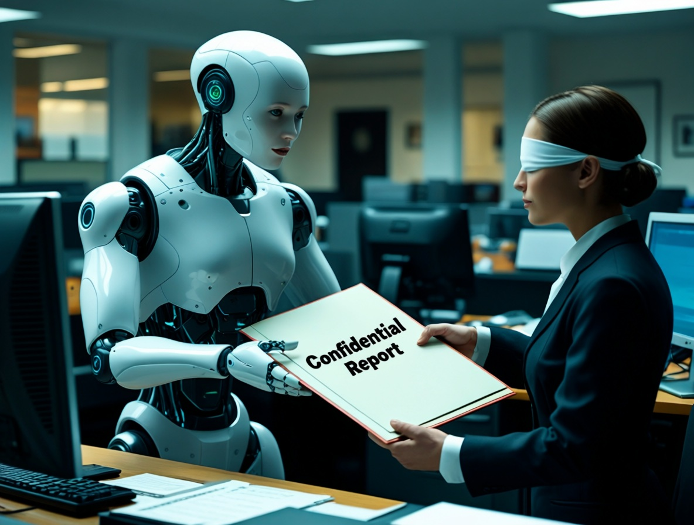
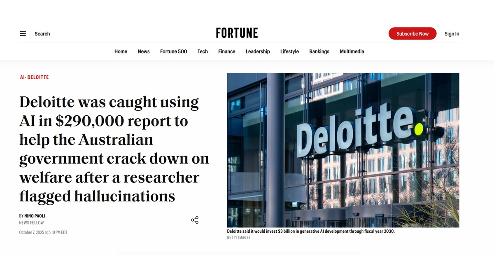
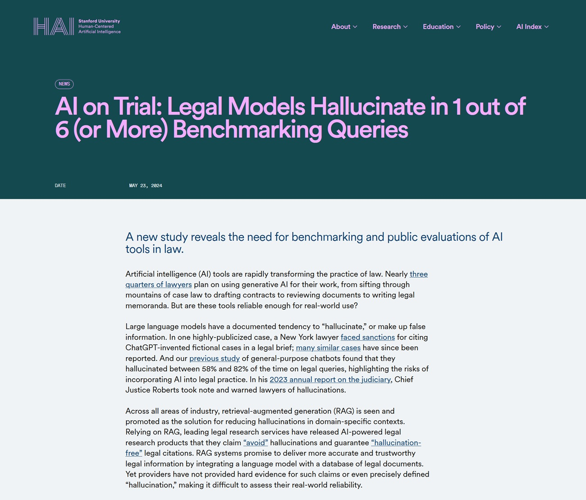

# AI as a Tool, Not an Oracle: The Deloitte Case and the Illusion of Infallibility

*August 2025. Christopher Rudge, a researcher at the University of Sydney and deputy director of the Sydney Health Law research centre, is reading a [hefty 237-page report](https://www.notizie.ai/deloitte-australia-consegna-al-governo-un-rapporto-con-citazioni-inventate-da-gpt/) published a few weeks earlier by the Australian government.*

The document, commissioned by the Department of Employment and Workplace Relations from the consulting giant Deloitte for the modest sum of 439,000 Australian dollars, was supposed to verify the "Targeted Compliance Framework," an automated system that monitors the payment of social benefits. As he scrolls through the pages dense with academic and legal references, something doesn't add up. One citation in particular catches his attention: a Federal Court ruling that should be a cornerstone of the argument. Rudge goes to check. The ruling does not exist. It never has.

Like a detective who pulls a thread and finds himself with an entire tangled mess, the researcher begins to dig. The ghost citations multiply: academic articles never published, judicial decisions never handed down, bibliographic references that lead to nowhere. These are not occasional errors or typos. It is an entire castle built on non-existent foundations, with the formal precision and self-assurance typical of high-level professional documents. Rudge reports everything to the media and the government. The result? One of the most embarrassing scandals in the recent history of business consulting and a perfect case study on how *not* to use artificial intelligence.

## The Admission of Guilt and the Price of Negligence

Deloitte's reaction, it must be said, was not long in coming. At the end of September 2025, the company [publicly acknowledged](https://fortune.com/2025/10/07/deloitte-ai-australia-government-report-hallucinations-technology-290000-refund/) that it had used Azure OpenAI GPT-4o for the initial drafting of the document. Not a marginal support tool, not an assistant for drafts: the language model had generated large sections of the report, including citations, which then ended up in the final document without adequate verification. The admission was accompanied by a corrected version of the report, purged of the fabricated citations, and the announcement of a partial refund to the Australian government. But the damage, as they say, was done.

What makes the Deloitte case particularly significant is not so much the technological error itself, but the attitude that made it possible. We are talking about one of the Big Four of global consulting, an organization with stratified quality assurance processes, experienced auditors, and responsible partners. Yet, somewhere along the production chain, someone decided that the text generated by GPT-4o was reliable enough not to require a thorough verification of the sources. It's as if an archaeologist published a sensational discovery based on neighborhood rumors instead of excavations, or as if Borges had written his library of Babel not as literary fiction but as a real catalog. Except here there is no postmodern irony: there is a government report worth almost half a million dollars that was supposed to guide public policy.

[Image from fortune.com](https://fortune.com/2025/10/07/deloitte-ai-australia-government-report-hallucinations-technology-290000-refund/)

## The Silent Epidemic of Digital Hallucinations

The Deloitte case is not a black swan, an isolated anomaly in the landscape of AI adoption. It is rather the most visible tip of an iceberg that is emerging with increasing clarity. In May 2023, a New York lawyer named Steven Schwartz [came under the spotlight](https://www.legaldive.com/news/chatgpt-fake-legal-cases-generative-ai-hallucinations/651557/) for citing six completely fabricated previous cases from ChatGPT in a court filing. Judge Kevin Castel did not take it well and imposed sanctions. In September 2025, a Californian lawyer, Amir Mostafavi, [received a historic fine](https://calmatters.org/economy/technology/2025/09/chatgpt-lawyer-fine-ai-regulation/) from the Court of Appeal after it emerged that 21 of the 23 citations in his legal brief were false, generated by ChatGPT and never verified.

The problem does not only concern consulting and legal professions. A few days ago, the Italian newspaper "La Provincia" of Civitavecchia published a [news article](https://www.professionereporter.eu/2025/10/e-chatgpt-mando-in-pagina-un-pezzo-senza-intervento-umano-a-civitavecchia/) that ended with a revealing sentence: "Do you want me to turn it into an article to be published in a newspaper (with headline, sub-headline and journalistic layout) or into a more narrative version for an investigative magazine?". It was the unmistakable output of ChatGPT, which ended up in print without anyone noticing that it was not editorial text but the typical closing prompt of the AI assistant.

The incident, however embarrassing, is significant not for the gaffe itself but for what it reveals: even in journalism, a field where source verification should be professional DNA, the temptation to delegate writing to AI without adequate supervision is producing blunders. The editor spoke of "human error" and announced stricter procedures, but the pattern is the same as seen with Deloitte: powerful tools used lightly, in the belief that the impeccable form of the generated text corresponds to reliable content. The difference is that here the error was so blatant as to be immediately visible, while fabricated academic citations or false legal references can go unnoticed for months.

But the phenomenon goes far beyond the cases that have made the news or been generated by newspapers. According to a [Stanford study](https://hai.stanford.edu/news/ai-trial-legal-models-hallucinate-1-out-6-or-more-benchmarking-queries) published in 2025, even language models specialized for the legal sector produce hallucinations in at least one in six cases, while generalist chatbots reach error rates of between 58% and 82% when asked about legal issues. A legal researcher named Damien Charlotin identified three recurring types of these hallucinations: citations of completely fabricated cases, correct citations from real cases with falsified content, and the most insidious of all, formally exact citations that do not support the argument for which they are invoked at all.

This last type is particularly dangerous because it bypasses superficial verification. The case exists, the citation is formatted correctly, but if you actually go and read the ruling, you discover that it says something completely different. It's as if Lovecraft's Necronomicon cited really existing works by Poe and Bierce, but attributed completely different content to them: the form is perfect, the substance is phantasmagorical.

[Image from Stanford.edu](https://hai.stanford.edu/news/ai-trial-legal-models-hallucinate-1-out-6-or-more-benchmarking-queries)

## Anatomy of a Hallucination: Why AI Invents with Such Confidence

To understand what happened in the Deloitte case, we need to take a step back and understand how Large Language Models like GPT-4o really work. These systems are extraordinary machines for statistical language prediction: given a context, they calculate which sequence of words is most likely to be consistent with that context, based on billions of examples seen during training. They are incredibly good at capturing patterns, rhetorical structures, writing conventions. When you ask them to generate an academic citation in the right format, with authors, title, year, and journal, the model knows perfectly *how* that citation should look. It has seen thousands of similar examples.

But here lies the fundamental problem: the model does not *know* if that citation really exists. It does not have access to a verification database, it does not check if the article "Smith, J. (2023). AI Governance in Welfare Systems. Journal of Public Administration" was ever published. It simply generates a string of text that *looks* like a plausible citation, based on linguistic patterns. It's like a forger so skilled that he can perfectly recreate Vermeer's style, but who has never seen the original painting because it doesn't exist: he is creating a fake of an imaginary work.

This characteristic of LLMs is known in the technical literature as "hallucination," a term perhaps too poetic to describe what is essentially a design bug. Language models have been optimized to be convincing, fluent, and formally coherent. Factual truth is an emergent property, not the primary goal of the architecture. When the context provides enough verifiable information, modern models like GPT-4o can be surprisingly accurate. But when they have to "fill in the blanks," when the training database does not contain the exact answer, they seamlessly switch from returning memorized facts to plausible invention. And they do so with the same assertive tone, the same impeccable formatting, the same professional register.

## The Real Problem: The Illusion of Infallibility

The heart of the Deloitte disaster is not technological but cultural. It is the attitude with which the tool was approached. Somewhere in that report production chain, a decision was made: to consider GPT-4o not as a generator of drafts to be checked word for word, but as a reliable source, a sort of expert ghostwriter that produced content ready for publication. It is a fundamental category error, comparable to mistaking a flight simulator for a real airplane: the superficial similarity masks substantial and critical differences.

This uncritical attitude is fueled by a dangerous narrative surrounding contemporary artificial intelligence. Tech companies, understandably interested in maximizing adoption, tend to emphasize the capabilities of their systems by presenting them as quasi-omniscient. Marketing talks about "reasoning," "understanding," systems that "think" and "comprehend." This [deliberate anthropomorphization](https://aitalk.it/it/ai-cosciente) creates unrealistic expectations and lowers guards. If the AI "understands" my problem, why should I doubt its answers?

The case [documented by NPR](https://www.npr.org/2025/07/10/nx-s1-5463512/ai-courts-lawyers-mypillow-fines) regarding the MyPillow lawyers is exemplary in this sense. Legal professionals, trained in critical thinking and source verification, entrusted ChatGPT with legal research and then filed the documents without checking. Not out of bad faith, but because the chatbot's conversational interface, its formal certainty, and the consistency of its answers created an illusion of competence. The system never said "warning, this citation might be fabricated." It simply generated plausible text, as it was designed to do.

## The Systemic Implications: Beyond Corporate Embarrassment

When it comes to the Deloitte report, the consequences go far beyond the embarrassment of a multinational corporation and the refund of a few hundred thousand dollars. The document was supposed to verify an automated system that affects the delivery of welfare to vulnerable people. Policy recommendations based on non-existent foundations could have guided decisions with real impacts on citizens' lives. If the Targeted Compliance Framework had been modified following suggestions built on false citations, the effects would have propagated throughout the entire social system chain.

This raises a broader question about epistemic trust in contemporary societies. We live in an era where direct verification of sources is increasingly difficult for the average citizen. We necessarily rely on intermediaries considered reliable: universities, newspapers, consulting firms, government institutions. When these intermediaries begin to delegate the production of knowledge to systems that invent with ease, without implementing rigorous verification protocols, the entire chain of trust cracks. It is not conspiratorial paranoia to note that if Deloitte can deliver a report full of ghost citations to the Australian government, other similar documents could be circulating undiscovered in other contexts.

The [Washington Post has documented](https://www.washingtonpost.com/nation/2025/06/03/attorneys-court-ai-hallucinations-judges/) how American judges are reacting with increasing severity to these cases, imposing ever heavier sanctions. But fines on negligent lawyers are just band-aids on a deeper wound. The structural problem is that we are going through a technological transition phase without having yet developed the appropriate cultural and professional protocols. It is as if the printing press had been invented but modern editorial conventions, from peer review to verified bibliography, did not yet exist.

## The Methodological Lesson: Tools, Not Oracles

The technology of generative artificial intelligence is extraordinarily powerful. GPT-4o and its contemporaries can dramatically accelerate creative processes, synthesize vast bodies of information, suggest non-obvious connections, and generate multiple variations of a text in seconds. Used correctly, they are multipliers of human capabilities. The problem arises when they are treated as substitutes for human judgment rather than as amplifiers.

The distinction is crucial. An amplifier enhances what already exists: if you have expertise, AI can make you faster and more efficient. But if you completely delegate your expertise to the tool, the amplification also works for negligence and error. It is the paradox of positive feedback: AI allows you to produce more, but if "more" includes unverified content, you are simply multiplying the amount of junk circulating in the system.

In the specific context of professional consulting, this means completely resetting the workflow. When Deloitte [admitted what happened](https://www.linnify.com/resources/the-deloitte-ai-report-scandal-why-ai-evaluation-is-no-longer-optional), it also announced the implementation of stricter protocols for the use of AI. But what should these protocols be? The answer emerges clearly from the failure itself: every citation generated by AI must be manually verified. Every factual claim must be checked against primary sources. Every argument must be traceable to really existing documents. In essence, the output of the AI must be treated as a variable-quality draft produced by a brilliant but unreliable intern, not as a finished product.

This approach requires time and attention, exactly the resources that AI is supposed to save. But it is the only way to avoid disasters. The efficiency gain from AI cannot come from skipping the verification phase, but from accelerating the first draft generation phase. If Deloitte had used GPT-4o to quickly produce an initial structure and then dedicated the saved time to meticulous verification, the result would have been both efficient and accurate. Instead, time was "saved" on the wrong part of the process, the one that separates professionalism from negligence.

## Towards a Culture of Algorithmic Responsibility

The Deloitte case comes at a particular moment in the history of artificial intelligence. We are past the uncritical enthusiasm of early adopters but have not yet reached a widespread maturity in the use of these tools. Organizations find themselves in an uncomfortable middle ground: competitive pressure requires adopting AI to avoid being left behind, but the skills to use it responsibly are unevenly distributed, often concentrated in a few specialists while the mass of users treats LLMs as infallible search engines.

A cultural revolution is needed more than a technological one. Companies must stop seeing AI as a competitive advantage to be implemented quickly and start seeing it as a dual-use technology that requires rigorous governance. This means serious training, not three-hour tutorials. It means regular audits of the processes in which AI is involved. It means, above all, rewarding caution rather than speed, valuing those who raise methodological doubts rather than those who deliver quickly.

The academic and professional world is reacting. More and more scientific journals require authors to explicitly declare the use of AI, and many have banned the use of LLMs altogether for generating substantial sections of articles. Courts in several countries are introducing rules that require certification of the accuracy of citations in legal briefs, with personal responsibility for lawyers. These are necessary but still fragmented responses.

Cross-industry standards are needed. If a professional document contains AI-generated content, this should be clearly stated, with an indication of the sections involved and the verification protocols applied. Not to stigmatize the use of technology, but to make the knowledge production process transparent. It is the same principle that makes us demand the list of ingredients on food or the methodology in scientific studies: not because we assume bad faith, but because transparency allows for informed evaluation and trust.

## Neither Apocalypse nor Utopia: The Necessary Balance

It would be easy, looking at the Deloitte case and its smaller siblings in the legal world, to slip into two opposite and equally counterproductive rhetorics. The first is the apocalypse: AI will flood us with falsehoods, make it impossible to distinguish true from false, and destroy the epistemic trust on which complex societies are based. The second is utopia: these are just bumps in the road, the error is human (or in this case, of the human user), the technology will continue to improve and these problems will disappear on their own.

Both narratives are insufficient. Generative AI is not bringing about the apocalypse of truth, but it is certainly making it easier to produce plausible but false content on an industrial scale. Ignoring this risk is irresponsible. On the other hand, the problems will not magically be solved with the next generation of models. Even if GPT-5 or Claude-4 have lower hallucination rates, they will never be perfect. The point is not to wait for infallible AI, but to develop work practices that assume imperfection as a starting point.

Christopher Rudge, the researcher who uncovered the case, is not an anti-technology Luddite. He is a scholar who simply did what anyone confronting a professional document should do: he checked the sources. His action is not heroic, it is banally professional. The fact that it was necessary, that the quality control system of a Big Four did not catch those ghost citations, is the real scandal. And the lesson is clear: no matter how sophisticated AI becomes, the last line of defense against error is always human critical attention.

The 439,000 Australian dollars refunded by Deloitte are little more than a footnote in a multi-billion dollar balance sheet. The real cost of this case is reputational, but it could turn into a systemic benefit if read correctly: not as the embarrassing incident of one company, but as the symptom of a widespread problem that requires a collective response. Tools are neutral. It is the use we make of them that defines whether they amplify our intelligence or our negligence. And this choice remains, and must remain, stubbornly human.