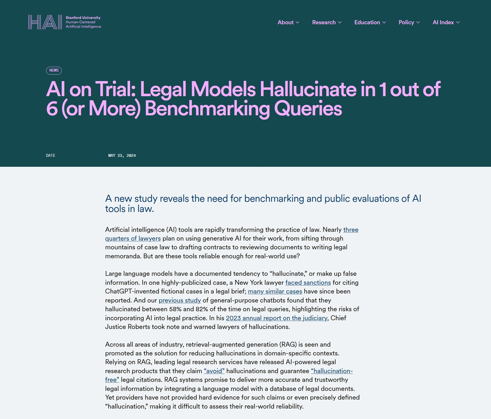

# La IA como Herramienta y no como Oráculo: el caso Deloitte y la ilusión de la infalibilidad

*Agosto de 2025. Christopher Rudge, investigador de la Universidad de Sídney y subdirector del centro de investigación Sydney Health Law, está leyendo un [voluminoso informe de 237 páginas](https://www.notizie.ai/deloitte-australia-consegna-al-governo-un-rapporto-con-citazioni-inventate-da-gpt/) publicado unas semanas antes por el gobierno australiano.*

El documento, encargado por el Departamento de Empleo y Relaciones Laborales al gigante de la consultoría Deloitte por la módica suma de 439.000 dólares australianos, debía verificar el "Marco de Cumplimiento Dirigido", un sistema automatizado que controla la concesión de prestaciones sociales. Mientras recorre las páginas densas de referencias académicas y jurisprudenciales, algo no cuadra. Una cita en particular llama su atención: una sentencia del Tribunal Federal que debería ser la piedra angular de la argumentación. Rudge va a verificar. La sentencia no existe. Nunca ha existido.

Como un detective que tira de un hilo y se encuentra con toda una madeja, el investigador empieza a cavar. Las citas fantasma se multiplican: artículos académicos nunca publicados, decisiones judiciales nunca pronunciadas, referencias bibliográficas que no llevan a ninguna parte. No se trata de errores ocasionales o erratas. Es todo un castillo construido sobre cimientos inexistentes, con la precisión formal y la seguridad en sí mismo típicas de los documentos profesionales de alto nivel. Rudge lo denuncia todo a los medios de comunicación y al gobierno. ¿El resultado? Uno de los escándalos más bochornosos de la historia reciente de la consultoría empresarial y un caso de estudio perfecto sobre cómo *no* usar la inteligencia artificial.

## La admisión de culpa y el precio de la negligencia

La reacción de Deloitte, hay que decirlo, no se hizo esperar. A finales de septiembre de 2025, la empresa [reconoció públicamente](https://fortune.com/2025/10/07/deloitte-ai-australia-government-report-hallucinations-technology-290000-refund/) que había utilizado Azure OpenAI GPT-4o para la redacción inicial del documento. No una herramienta de apoyo marginal, no un asistente para borradores: el modelo de lenguaje había generado amplias secciones del informe, incluidas las citas, que luego acabaron en el documento final sin una verificación adecuada. La admisión fue acompañada de una versión corregida del informe, depurada de las citas inventadas, y del anuncio de un reembolso parcial al gobierno australiano. Pero el daño, como se dice, ya estaba hecho.

Lo que hace que el caso Deloitte sea particularmente significativo no es tanto el error tecnológico en sí, sino la actitud que lo hizo posible. Estamos hablando de una de las Cuatro Grandes de la consultoría global, una organización con procesos de garantía de calidad estratificados, auditores experimentados y socios responsables. Sin embargo, en algún punto de la cadena de producción, alguien decidió que el texto generado por GPT-4o era lo suficientemente fiable como para no requerir una verificación exhaustiva de las fuentes. Es como si un arqueólogo publicara un descubrimiento sensacional basándose en los rumores del barrio en lugar de en las excavaciones, o como si Borges hubiera escrito su biblioteca de Babel no como ficción literaria sino como un catálogo real. Solo que aquí no hay ironía posmoderna: hay un informe gubernamental de casi medio millón de dólares que debería haber guiado las políticas públicas.

[Imagen de fortune.com](https://fortune.com/2025/10/07/deloitte-ai-australia-government-report-hallucinations-technology-290000-refund/)

## La epidemia silenciosa de las alucinaciones digitales

El caso Deloitte no es un cisne negro, una anomalía aislada en el panorama de la adopción de la IA. Es más bien la punta más visible de un iceberg que está emergiendo con creciente claridad. En mayo de 2023, un abogado de Nueva York llamado Steven Schwartz [se vio en el punto de mira](https://www.legaldive.com/news/chatgpt-fake-legal-cases-generative-ai-hallucinations/651557/) por citar en un recurso judicial seis casos anteriores completamente inventados por ChatGPT. El juez Kevin Castel no se lo tomó bien e impuso sanciones. En septiembre de 2025, un abogado californiano, Amir Mostafavi, [recibió una multa histórica](https://calmatters.org/economy/technology/2025/09/chatgpt-lawyer-fine-ai-regulation/) del Tribunal de Apelación después de que se descubriera que 21 de las 23 citas de su escrito procesal eran falsas, generadas por ChatGPT y nunca verificadas.

El problema no afecta solo a la consultoría y a las profesiones jurídicas. Hace unos días, el periódico italiano "La Provincia" de Civitavecchia publicó un [artículo de crónica](https://www.professionereporter.eu/2025/10/e-chatgpt-mando-in-pagina-un-pezzo-senza-intervento-umano-a-civitavecchia/) que concluía con una frase reveladora: "¿Quieres que lo transforme en un artículo para publicar en un periódico (con titular, subtítulo y maquetación periodística) o en una versión más narrativa para una revista de investigación?". Era la inconfundible salida de ChatGPT, que acabó impresa sin que nadie se diera cuenta de que no se trataba de un texto de redacción, sino de la típica indicación de cierre del asistente de IA.

El incidente, por muy bochornoso que sea, es significativo no por el error en sí, sino por lo que revela: incluso en el periodismo, un ámbito en el que la verificación de las fuentes debería ser el ADN profesional, la tentación de delegar la redacción en la IA sin una supervisión adecuada está produciendo deslices. El director habló de "error humano" y anunció procedimientos más estrictos, pero el patrón es el mismo que se vio con Deloitte: herramientas potentes utilizadas a la ligera, en la creencia de que la forma impecable del texto generado se corresponde con un contenido fiable. La diferencia es que aquí el error era tan flagrante que era inmediatamente visible, mientras que las citas académicas inventadas o las referencias jurisprudenciales falsas pueden pasar desapercibidas durante meses.

Pero el fenómeno va mucho más allá de los casos que han aparecido en los periódicos o que han sido generados por ellos. Según un [estudio de Stanford](https://hai.stanford.edu/news/ai-trial-legal-models-hallucinate-1-out-6-or-more-benchmarking-queries) publicado en 2025, incluso los modelos de lenguaje especializados para el sector jurídico producen alucinaciones en al menos un caso de cada seis, mientras que los chatbots generalistas alcanzan tasas de error de entre el 58% y el 82% cuando se les pregunta sobre cuestiones jurídicas. Un investigador jurídico llamado Damien Charlotin ha identificado tres tipos recurrentes de estas alucinaciones: citas de casos completamente inventados, citas correctas de casos reales con contenido falsificado, y la más insidiosa de todas, citas formalmente exactas pero que no apoyan en absoluto el argumento para el que se invocan.

Este último tipo es particularmente peligroso porque supera la verificación superficial. El caso existe, la cita está formateada correctamente, pero si realmente vas a leer la sentencia descubres que dice todo lo contrario. Es como si el Necronomicon de Lovecraft citara obras realmente existentes de Poe y Bierce, pero atribuyéndoles un contenido completamente diferente: la forma es perfecta, la sustancia es fantasmagórica.

[Imagen de Stanford.edu](https://hai.stanford.edu/news/ai-trial-legal-models-hallucinate-1-out-6-or-more-benchmarking-queries)

## Anatomía de una alucinación: por qué la IA inventa con tanta seguridad

Para entender lo que ocurrió en el caso Deloitte, hay que dar un paso atrás y comprender cómo funcionan realmente los Modelos de Lenguaje Grandes como GPT-4o. Estos sistemas son extraordinarias máquinas de predicción estadística del lenguaje: dado un contexto, calculan qué secuencia de palabras es más probable que sea coherente con ese contexto, basándose en miles de millones de ejemplos vistos durante el entrenamiento. Son increíblemente buenos para captar patrones, estructuras retóricas, convenciones de escritura. Cuando les pides que generen una cita académica en el formato correcto, con autores, título, año y revista, el modelo sabe perfectamente *cómo* debería ser esa cita. Ha visto miles de ejemplos similares.

Pero aquí está el problema fundamental: el modelo no *sabe* si esa cita existe realmente. No tiene acceso a una base de datos de verificación, no comprueba si el artículo "Smith, J. (2023). AI Governance in Welfare Systems. Journal of Public Administration" se ha publicado alguna vez. Simplemente genera una cadena de texto que *parece* una cita plausible, basándose en patrones lingüísticos. Es como un falsificador tan hábil que puede recrear a la perfección el estilo de Vermeer, pero que nunca ha visto el cuadro original porque no existe: está creando una falsificación de una obra imaginaria.

Esta característica de los LLM se conoce en la literatura técnica como "alucinación", un término quizás demasiado poético para describir lo que es esencialmente un error de diseño. Los modelos de lenguaje se han optimizado para ser convincentes, fluidos y formalmente coherentes. La verdad fáctica es una propiedad emergente, no el objetivo principal de la arquitectura. Cuando el contexto proporciona suficiente información verificable, los modelos modernos como GPT-4o pueden ser sorprendentemente precisos. Pero cuando tienen que "rellenar los huecos", cuando la base de datos de entrenamiento no contiene la respuesta exacta, pasan sin solución de continuidad de devolver hechos memorizados a la invención plausible. Y lo hacen con el mismo tono asertivo, el mismo formato impecable, el mismo registro profesional.

## El verdadero problema: la ilusión de la infalibilidad

El meollo del desastre de Deloitte no es tecnológico, sino cultural. Es la actitud con la que se abordó la herramienta. En algún punto de esa cadena de producción del informe, se tomó una decisión: considerar a GPT-4o no como un generador de borradores que hay que verificar palabra por palabra, sino como una fuente fiable, una especie de escritor fantasma experto que producía contenido ya listo para su publicación. Es un error de categoría fundamental, comparable a confundir un simulador de vuelo con un avión de verdad: la similitud superficial enmascara diferencias sustanciales y críticas.

Esta actitud acrítica se alimenta de una narrativa peligrosa que rodea a la inteligencia artificial contemporánea. Las empresas tecnológicas, comprensiblemente interesadas en maximizar la adopción, tienden a enfatizar las capacidades de sus sistemas presentándolos como casi omniscientes. El marketing habla de "razonamiento", de "comprensión", de sistemas que "piensan" y "comprenden". Esta [antropomorfización deliberada](https://aitalk.it/it/ai-cosciente) crea expectativas poco realistas y baja la guardia. Si la IA "entiende" mi problema, ¿por qué debería dudar de sus respuestas?

El caso [documentado por NPR](https://www.npr.org/2025/07/10/nx-s1-5463512/ai-courts-lawyers-mypillow-fines) relativo a los abogados de MyPillow es ejemplar en este sentido. Profesionales del derecho, formados en el pensamiento crítico y la verificación de fuentes, confiaron a ChatGPT la investigación jurisprudencial y luego presentaron los escritos sin comprobarlos. No por mala fe, sino porque la interfaz conversacional del chatbot, su seguridad formal y la coherencia de sus respuestas crearon una ilusión de competencia. El sistema nunca dijo "atención, esta cita podría ser inventada". Simplemente generó un texto plausible, como fue diseñado para hacer.

## Las implicaciones sistémicas: más allá del bochorno corporativo

En lo que respecta al informe de Deloitte, las consecuencias van mucho más allá del bochorno de una multinacional y el reembolso de unos cientos de miles de dólares. El documento debía verificar un sistema automatizado que afecta a la prestación de asistencia social a personas vulnerables. Las recomendaciones políticas basadas en fundamentos inexistentes podrían haber guiado decisiones con un impacto real en la vida de los ciudadanos. Si el Marco de Cumplimiento Dirigido se hubiera modificado siguiendo sugerencias basadas en citas falsas, los efectos se habrían propagado por toda la cadena del sistema social.

Esto plantea una cuestión más amplia sobre la confianza epistémica en las sociedades contemporáneas. Vivimos en una época en la que la verificación directa de las fuentes es cada vez más difícil para el ciudadano medio. Nos basamos necesariamente en intermediarios considerados fiables: universidades, periódicos, empresas de consultoría, instituciones gubernamentales. Cuando estos intermediarios empiezan a delegar la producción de conocimiento en sistemas que inventan con soltura, sin implementar rigurosos protocolos de verificación, toda la cadena de confianza se resquebraja. No es paranoia conspirativa señalar que si Deloitte puede entregar al gobierno australiano un informe lleno de citas fantasma, otros documentos similares podrían estar circulando sin ser descubiertos en otros contextos.

El [Washington Post ha documentado](https://www.washingtonpost.com/nation/2025/06/03/attorneys-court-ai-hallucinations-judges/) cómo los jueces estadounidenses están reaccionando con creciente severidad a estos casos, imponiendo sanciones cada vez más duras. Pero las multas a los abogados negligentes son solo tiritas en una herida más profunda. El problema estructural es que estamos atravesando una fase de transición tecnológica sin haber desarrollado todavía los protocolos culturales y profesionales adecuados. Es como si se hubiera inventado la imprenta pero las convenciones editoriales modernas, desde la revisión por pares hasta la bibliografía verificada, aún no existieran.

## La lección metodológica: herramientas, no oráculos

La tecnología de la inteligencia artificial generativa es extraordinariamente potente. GPT-4o y sus contemporáneos pueden acelerar drásticamente los procesos creativos, sintetizar vastos corpus de información, sugerir conexiones no obvias y generar múltiples variaciones de un texto en segundos. Usados correctamente, son multiplicadores de las capacidades humanas. El problema surge cuando se les trata como sustitutos del juicio humano en lugar de como amplificadores.

La distinción es crucial. Un amplificador potencia lo que ya existe: si tienes experiencia, la IA puede hacerte más rápido y eficiente. Pero si delegas por completo tu experiencia en la herramienta, la amplificación también funciona para la negligencia y el error. Es la paradoja de la retroalimentación positiva: la IA te permite producir más, pero si "más" incluye contenido no verificado, simplemente estás multiplicando la cantidad de basura que circula en el sistema.

En el contexto específico de la consultoría profesional, esto significa restablecer por completo el flujo de trabajo. Cuando Deloitte [admitió lo sucedido](https://www.linnify.com/resources/the-deloitte-ai-report-scandal-why-ai-evaluation-is-no-longer-optional), también anunció la implementación de protocolos más estrictos para el uso de la IA. Pero, ¿cuáles deberían ser estos protocolos? La respuesta surge claramente del propio fracaso: cada cita generada por la IA debe ser verificada manualmente. Cada afirmación fáctica debe ser contrastada con fuentes primarias. Cada argumento debe poder rastrearse hasta documentos realmente existentes. En esencia, el resultado de la IA debe ser tratado como un borrador de calidad variable producido por un becario brillante pero poco fiable, no como un producto acabado.

Este enfoque requiere tiempo y atención, exactamente los recursos que se supone que la IA debe ahorrar. Pero es la única manera de evitar desastres. La ganancia de eficiencia de la IA no puede provenir de saltarse la fase de verificación, sino de acelerar la fase de generación del primer borrador. Si Deloitte hubiera empleado GPT-4o para producir rápidamente una estructura inicial y luego hubiera dedicado el tiempo ahorrado a una verificación meticulosa, el resultado habría sido tanto eficiente como preciso. En cambio, se "ahorró" tiempo en la parte equivocada del proceso, la que separa el profesionalismo de la negligencia.

## Hacia una cultura de la responsabilidad algorítmica

El caso Deloitte llega en un momento particular de la historia de la inteligencia artificial. Hemos superado el entusiasmo acrítico de los primeros adoptantes, pero aún no hemos alcanzado una madurez generalizada en el uso de estas herramientas. Las organizaciones se encuentran en un incómodo punto intermedio: la presión competitiva impone la adopción de la IA para no quedarse atrás, pero las competencias para usarla de forma responsable están distribuidas de forma desigual, a menudo concentradas en unos pocos especialistas, mientras que la masa de usuarios trata a los LLM como motores de búsqueda infalibles.

Se necesita una revolución cultural más que tecnológica. Las empresas deben dejar de considerar la IA como una ventaja competitiva que hay que implementar rápidamente y empezar a verla como una tecnología de doble uso que requiere una gobernanza rigurosa. Esto significa una formación seria, no tutoriales de tres horas. Significa auditorías periódicas de los procesos en los que interviene la IA. Significa, sobre todo, premiar la cautela en lugar de la velocidad, valorar a quienes plantean dudas metodológicas en lugar de a quienes entregan rápidamente.

El mundo académico y profesional está reaccionando. Cada vez más revistas científicas exigen a los autores que declaren explícitamente el uso de la IA, y muchas han prohibido por completo el uso de LLM para generar secciones sustanciales de los artículos. Tribunales de varios países están introduciendo normas que exigen la certificación de la exactitud de las citas en los escritos procesales, con responsabilidad personal para los abogados. Son respuestas necesarias pero todavía fragmentarias.

Se necesitan normas industriales transversales. Si un documento profesional contiene contenido generado por IA, esto debería declararse claramente, con indicación de las secciones implicadas y los protocolos de verificación aplicados. No para estigmatizar el uso de la tecnología, sino para hacer transparente el proceso de producción de conocimiento. Es el mismo principio que nos hace exigir la lista de ingredientes en los alimentos o la metodología en los estudios científicos: no porque supongamos mala fe, sino porque la transparencia permite una evaluación y una confianza informadas.

## Ni apocalipsis ni utopía: el equilibrio necesario

Sería fácil, al observar el caso Deloitte y sus hermanos menores en el mundo jurídico, caer en dos retóricas opuestas e igualmente contraproducentes. La primera es el apocalipsis: la IA nos inundará de falsedades, hará imposible distinguir lo verdadero de lo falso y destruirá la confianza epistémica en la que se basan las sociedades complejas. La segunda es la utopía: son solo baches en el camino, el error es humano (o en este caso, del usuario humano), la tecnología seguirá mejorando y estos problemas desaparecerán por sí solos.

Ambas narrativas son insuficientes. La IA generativa no está trayendo el apocalipsis de la verdad, pero ciertamente está facilitando la producción de contenido plausible pero falso a escala industrial. Ignorar este riesgo es irresponsable. Por otro lado, los problemas no se resolverán mágicamente con la próxima generación de modelos. Aunque GPT-5 o Claude-4 tengan tasas de alucinación más bajas, nunca serán perfectos. El punto no es esperar a una IA infalible, sino desarrollar prácticas de trabajo que asuman la imperfección como punto de partida.

Christopher Rudge, el investigador que destapó el caso, no es un ludita antitecnológico. Es un académico que simplemente hizo lo que cualquiera que se enfrente a un documento profesional debería hacer: verificó las fuentes. Su acción no es heroica, es banalmente profesional. El hecho de que fuera necesario, que el sistema de control de calidad de una de las Cuatro Grandes no detectara esas citas fantasma, es el verdadero escándalo. Y la lección es clara: no importa cuán sofisticada se vuelva la IA, la última línea de defensa contra el error es siempre la atención crítica humana.

Los 439.000 dólares australianos reembolsados por Deloitte son poco más que una nota a pie de página en un balance de miles de millones. El verdadero coste de este caso es reputacional, pero podría convertirse en un beneficio sistémico si se lee correctamente: no como el bochornoso incidente de una empresa, sino como el síntoma de un problema generalizado que requiere una respuesta colectiva. Las herramientas son neutrales. Es el uso que hacemos de ellas lo que define si amplifican nuestra inteligencia o nuestra negligencia. Y esta elección sigue siendo, y debe seguir siendo, obstinadamente humana.