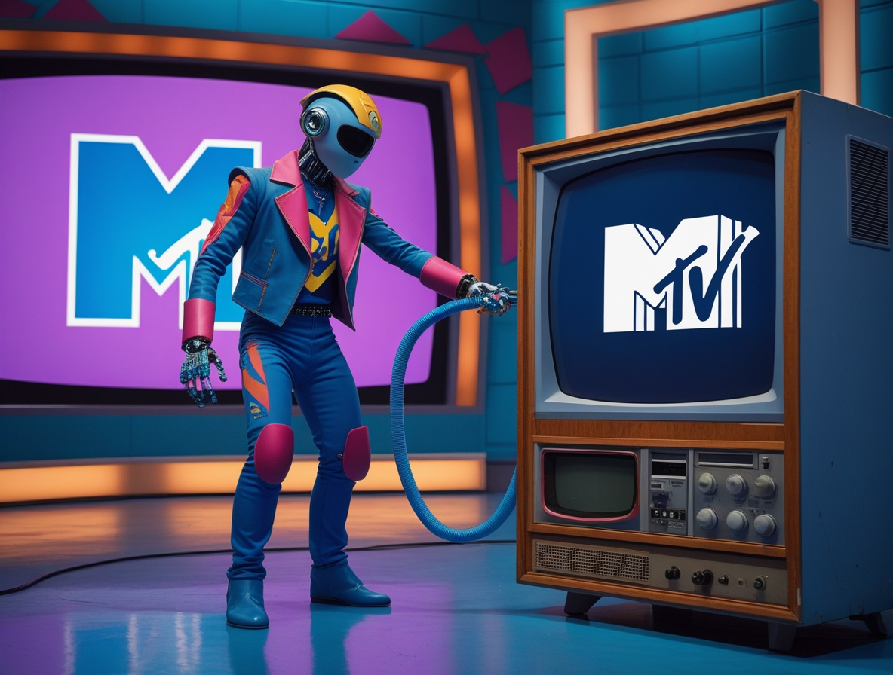
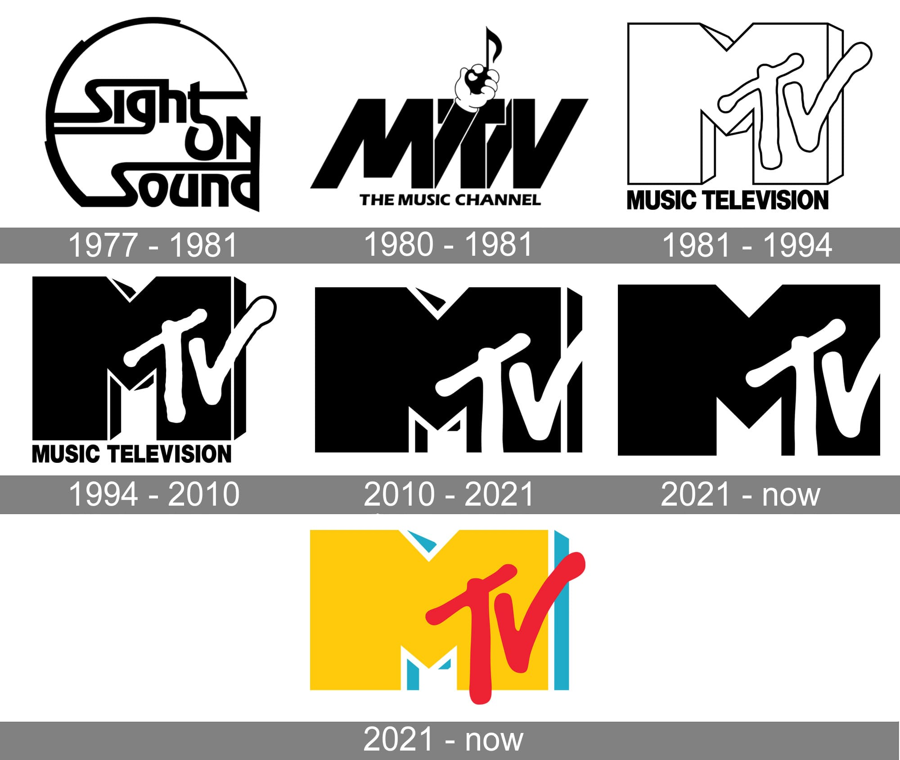
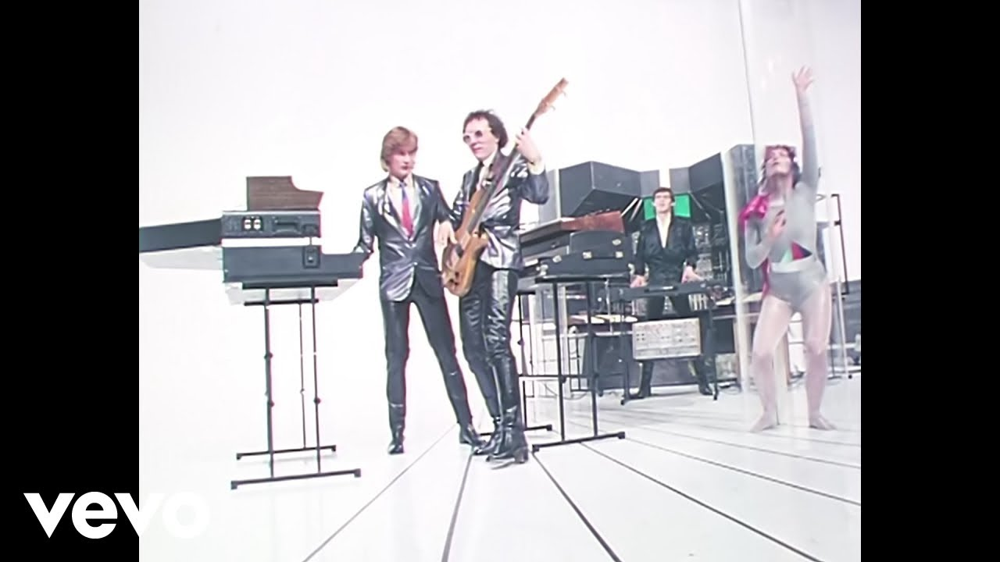

# 'AI Killed the MTV Star': l'AI chiude MTV

*Il primo agosto 1981, alle 00:01, MTV lanciava le sue trasmissioni con un videoclip che oggi suona come una profezia rovesciata. "Video Killed the Radio Star" dei Buggles era la dichiarazione di intenti di un'epoca nuova, quella in cui la musica non si ascoltava più soltanto, ma si guardava. Il testo parlava di nostalgia per l'era della radio, travolta dall'avvento del video.*

Eppure, con un'ironia che avrebbe fatto sorridere amaramente anche Philip K. Dick, la storia ha preso una piega diversa. Nel 2025 la radio gode di ottima salute, con [ascolti solidi e un pubblico fedele](https://www.radiospeaker.it/blog/ascolti-radio-primo-semestre-2025-editori/), mentre MTV sta spegnendo i suoi canali musicali uno dopo l'altro. Il video non ha ucciso la radio star. Ma qualcos'altro ha ucciso MTV.

Quel qualcosa ha il volto asettico degli algoritmi di intelligenza artificiale che oggi governano YouTube, Spotify e TikTok. E questo non è un articolo di nostalgia televisiva, ma di tecnologia. Perché dietro la [chiusura annunciata da Paramount Global](https://www.broadbandtvnews.com/2025/10/10/paramount-to-close-mtv-channels-across-europe/) di cinque canali musicali MTV entro il 31 dicembre 2025 c'è una rivoluzione silenziosa che ha ridefinito il modo in cui scopriamo, ascoltiamo e consumiamo musica. Una rivoluzione che ha le sue radici nel machine learning e nei sistemi di raccomandazione, non nelle preferenze del pubblico per i reality show.

## La fine di un'era

[L'annuncio di Paramount](https://www.bbc.com/news/articles/cdr612yz8p0o) segna la fine delle trasmissioni per MTV Music, MTV 80s, MTV 90s, Club MTV e MTV Live. Non parliamo di mercati marginali: la chiusura coinvolge Regno Unito, Irlanda, Francia, Germania, Austria, Polonia, Ungheria, e si estenderà ad Australia e Brasile. Il canale principale MTV HD sopravviverà, ma come una versione zombie di se stesso, concentrato su programmi di intrattenimento e reality che con la musica hanno poco a che fare. Come ciliegina finale sulla torta del declino, Paramount ha cancellato anche [l'edizione 2025 degli MTV Europe Music Awards](https://www.rollingstone.com/music/music-news/mtv-uk-music-channels-end-of-year-1235444783/), quello che un tempo era uno degli appuntamenti più attesi dell'anno per il pubblico musicale europeo.

La motivazione ufficiale è quella che ci si aspetterebbe: necessità di tagliare circa 500 milioni di dollari di costi in un mercato televisivo in contrazione. Ma dire che MTV chiude perché la gente non guarda più la TV musicale è come dire che i dinosauri si sono estinti perché faceva freddo. È vero, ma non racconta tutta la storia. La vera estinzione di massa è avvenuta a livello più profondo, nel substrato tecnologico che determina come e cosa ascoltiamo.

[La storia del logo MTV, immagine tratta da:  1000logos.net](https://1000logos.net/mtv-logo/)

## La rivoluzione invisibile degli algoritmi

A prima vista, questo potrebbe sembrare un argomento lontano dal core business di un portale tecnologico. MTV è televisione, roba del Novecento, dinosauri mediatici che non hanno saputo evolversi. Ma guardando più in profondità, la chiusura di MTV è la testimonianza più evidente di come l'intelligenza artificiale abbia già trasformato radicalmente interi settori della nostra vita culturale, spesso senza che ce ne rendessimo conto. Non stiamo parlando di ChatGPT o di deepfake, stiamo parlando di algoritmi di raccomandazione che lavorano in background, invisibili ma onnipresenti, ridefinendo i nostri gusti musicali da oltre un decennio.

Quando nel 1981 MTV iniziava le trasmissioni, la scoperta musicale era un processo intrinsecamente sociale e curato da esseri umani. C'erano i VJ, video jockey come Martha Quinn o Mark Goodman, o qualche tempo dopo l'italiano Andrea Pezzi, che selezionavano cosa mandare in onda, creavano flussi narrativi tra un video e l'altro, ti facevano scoprire i Talking Heads subito dopo Madonna. C'era un elemento umano di cura, un gusto editoriale, una visione. Anche quando quella visione era discutibile o controversa, come quando [MTV venne accusata di razzismo](https://hollywoodreporter.it/musica/mtv-music-television-storia-vera-anniversario-nascita-canale-videoclip-musica-cultura-pop/35199/) per la scarsa presenza di artisti afroamericani nei primi anni, rimaneva un processo mediato da scelte umane, criticabili e discutibili, ma trasparenti.

Oggi quel processo è stato sostituito da sistemi di machine learning che analizzano miliardi di dati comportamentali. L'algoritmo di YouTube non si limita a suggerirti video simili a quelli che hai già visto: costruisce un profilo psicografico delle tue preferenze musicali incrociando il tempo di visualizzazione, i momenti in cui metti pausa, quando abbandoni un video, cosa cerchi dopo, cosa ascoltano gli utenti con pattern di consumo simili al tuo. Spotify utilizza [sistemi di raccomandazione ibridi](https://www.nature.com/articles/s41598-024-75967-0) che combinano collaborative filtering, analisi dei contenuti audio tramite reti neurali convoluzionali che riconoscono pattern musicali, e natural language processing per analizzare come gli utenti parlano di musica sui social media.

È tecnologia affascinante, certo. Ma è anche tecnologia che ha reso obsoleto il modello broadcast di MTV. Perché guardare un flusso lineare di video musicali scelti da qualcun altro quando puoi avere un DJ algoritmico personale che conosce i tuoi gusti meglio di quanto tu stesso li conosca? È come se Skynet avesse deciso di fare il critico musicale invece di sterminare l'umanità.

## Dal broadcast all'unicast personalizzato

Il passaggio epocale che MTV non è riuscita a gestire è quello dal broadcasting all'unicasting algoritmico. MTV trasmetteva lo stesso flusso a milioni di persone simultaneamente. Era uno a molti, una piazza condivisa dove un'intera generazione guardava gli stessi video, agli stessi orari. Questo creava una cultura comune, riferimenti condivisi, conversazioni collettive. Ricordate quando tutti parlavano dello stesso video il giorno dopo? Io si per fortuna, o purtroppo... Quello era il potere del broadcast.

Le piattaforme digitali hanno polverizzato questo modello. YouTube genera oltre un miliardo di ore di contenuti video musicali visti quotidianamente, ma nessuno sta guardando lo stesso flusso. Ognuno ha il suo feed personalizzato, il suo mix unico. TikTok ha portato questa logica all'estremo con il suo [For You Page](https://derev.com/2025/06/tiktok-nel-2025-algoritmo-e-novita/), un flusso infinito di contenuti brevi dove l'AI decide in tempo reale cosa mostrarti basandosi su microinterazioni misurate in millisecondi di attenzione. Non è più uno a molti, è uno a uno, moltiplicato per miliardi.

Questo ha anche ridefinito cosa significa "guardare musica". Su MTV guardavi un videoclip di quattro minuti dall'inizio alla fine. Su TikTok i brani vengono frammentati in snippet di 15-30 secondi, remixati, reinterpretati, trasformati in meme. L'algoritmo impara non solo se ti piace una canzone, ma quale frammento specifico di quella canzone cattura la tua attenzione. È granularità analitica portata a un livello che i programmatori di MTV non avrebbero mai potuto immaginare.

## I numeri di un'emigrazione di massa

I dati sul declino della TV musicale tradizionale sono spietati. Secondo le [ricerche di mercato](https://economictimes.indiatimes.com/news/international/us/mtv-to-shut-its-popular-music-tv-channels-after-4-decades-which-popular-mtv-channels-are-being-closed-and-what-triggered-the-big-move-all-you-need-to-know/articleshow/124516118.cms) citate nell'annuncio di Paramount, la stragrande maggioranza del pubblico giovane sotto i 35 anni non ha mai guardato un canale musicale televisivo. Non per scelta ideologica, semplicemente perché l'idea stessa di aspettare che passi un video che non ti interessa per vedere quello che vuoi è aliena quanto usare un modem dial-up per scaricare una canzone.

YouTube Music conta oltre 100 milioni di abbonati paganti, Spotify supera i 600 milioni di utenti attivi. Ma quello che è più significativo è il tempo speso: l'utente medio passa oltre 2 ore e mezza al giorno su queste piattaforme, contro i pochi minuti residuali della TV musicale tradizionale. E non è solo una questione di comodità o di accesso on-demand. È che queste piattaforme hanno costruito ecosistemi dove l'AI fa da collante tra scoperta, ascolto, condivisione e creazione di contenuti.

La musica è diventata ambientale, sempre disponibile, personalizzata per ogni momento della giornata. Spotify ha playlist generate algoritmicamente per "Concentration", "Workout", "Chill Evening". YouTube suggerisce video musicali basandosi non solo sui tuoi gusti, ma sul contesto: ora del giorno, dispositivo che stai usando, se stai guardando su TV o smartphone. MTV mandava gli stessi video a mezzogiorno e a mezzanotte, a uno studente e a un lavoratore notturno. Era democratico ma rigido. L'AI è flessibile ma frammentata.

[Immagine tratta dal video "Video Killed the Radio Star" su YouTube](https://www.youtube.com/watch?v=W8r-tXRLazs)

## Il paradosso della scoperta algoritmica

Ed è qui che arriviamo al cuore della questione, al dubbio che dovrebbe farci riflettere mentre MTV chiude i battenti. Gli algoritmi sono davvero migliori dei VJ umani nel farci scoprire nuova musica? O stiamo scambiando la biodiversità culturale con una monocultura algoritmica camuffata da personalizzazione?

[Una ricerca pubblicata su Scientific Reports nel 2025](https://www.nature.com/articles/s41598-024-75967-0) ha analizzato miliardi di ascolti su piattaforme di streaming musicale, scoprendo qualcosa di inquietante. Sì, gli algoritmi espongono gli utenti a un numero più alto di artisti diversi rispetto alla radio tradizionale. Ma questi artisti sono "semanticamente confinati", appartengono cioè a nicchie sempre più ristrette e omogenee. In altre parole: scopri più band, ma tutte che suonano sostanzialmente allo stesso modo.

Il problema si chiama "filter bubble musicale", e funziona così. L'algoritmo parte dalle tue prime scelte musicali e costruisce un profilo. Poi ti suggerisce contenuti che massimizzano la probabilità che tu continui ad ascoltare, perché il suo obiettivo è tenerti sulla piattaforma. Per farlo, privilegia la familiarità sulla novità radicale. Ti propone artisti che sono abbastanza diversi da sembrare una scoperta, ma abbastanza simili da non rischiare che tu abbandoni l'ascolto. È la logica della comfort zone algoritmica.

[Uno studio presentato alla ACM Web Conference 2024](https://dl.acm.org/doi/10.1145/3589334.3645497) ha dimostrato che i sistemi di raccomandazione tradizionali riducono significativamente la diversità "inter-utente" (le differenze tra i gusti di persone diverse) senza aumentare proporzionalmente la diversità "intra-utente" (la varietà musicale che ogni singolo ascoltatore sperimenta). Tradotto: tutti finiamo per ascoltare un mix sempre più simile, mentre ognuno di noi esplora un territorio sempre più ristretto.

MTV, con tutti i suoi limiti e le sue scelte discutibili, ti costringeva a una forma di serendipità. Accendevi la TV per vedere i Duran Duran e ti trovavi i Sonic Youth, ti piacesse o no. Magari cambiavi canale infastidito, o magari scoprivi qualcosa che non avresti mai cercato autonomamente. Era un modello di scoperta "push" (di spinta) basato sulla cura umana. L'algoritmo invece è "pull" (di traino): parte da dove sei già e ti porta dove vuole che tu vada, creando l'illusione che tu stia scegliendo liberamente.

[Una ricerca del 2024 sull'homogenizzazione della musica pop](https://www.researchgate.net/publication/385087005_Homogenization_of_Pop_Music_How_Social_Media's_Algorithms_Prevents_Creativity_and_Innovation) ha mostrato come gli algoritmi dei social media creino un feedback loop pericoloso: premiano i contenuti mainstream di ampio appeal, artisti e produttori imparano cosa funziona algoritmicamente e producono musica ottimizzata per gli algoritmi, che a loro volta premiano questa musica perché performante, in un circolo che tende alla standardizzazione. È come se stessimo allevando la musica in batteria invece che libera nei campi.

Il VJ umano poteva sbagliarsi, avere pregiudizi, fare scelte orribili. Ma aveva anche la possibilità di fare scelte coraggiose, di mettere in rotazione un video sperimentale perché ci credeva, di creare connessioni inaspettate tra generi diversi. L'algoritmo ottimizza per l'engagement, non per la scoperta culturale. E questa è una differenza fondamentale che rischiamo di comprendere troppo tardi.

## Il Video non uccise la Radio Star

C'è un'ultima ironia in questa storia che vale la pena sottolineare. La radio, quella che i Buggles davano per morta nel 1981, è sopravvissuta ed è in salute. Secondo i dati del 2025, la radio raggiunge ancora il 90% della popolazione adulta in molti paesi occidentali, ha saputo integrarsi nel digitale con lo streaming, i podcast, le app. I DJ radiofonici umani continuano a fare scoprire musica, a creare flussi narrativi, a essere voci riconoscibili con una personalità.

MTV invece sta chiudendo perché è rimasta ancorata al modello broadcast lineare senza evolversi. Non è riuscita a diventare una piattaforma digitale, non ha costruito algoritmi competitivi, non ha capito che il futuro non era semplicemente mettere i suoi contenuti online, ma ripensare completamente cosa significa curare e far scoprire musica nell'era dell'AI.

La radio si è evoluta perché ha capito che il suo valore non era nel medium tecnologico ma nella relazione umana, nella voce del DJ che conosci e di cui ti fidi, nella comunità di ascoltatori. MTV ha creduto che il suo valore fosse nel controllo del canale distributivo televisivo, e quando quel canale è diventato obsoleto, non aveva altro.

Forse tra qualche anno ci renderemo conto che anche la personalizzazione algoritmica ha i suoi limiti, che la biodiversità culturale ha bisogno di curatori umani che fanno scelte apparentemente inefficienti ma culturalmente vitali. Forse scopriremo che l'amico che ti fa ascoltare quella band strana che non avresti mai cercato su Spotify, o il DJ radiofonico che ti sorprende con un brano fuori dal tuo profilo algoritmico, svolgevano una funzione ecologica importante nel mantenere vivo un ecosistema musicale diversificato.

Ma per ora, mentre MTV spegne gli ultimi canali musicali e Paramount promette che il brand vivrà "nel digitale", la realtà è che il video non uccise la radio star. Furono gli algoritmi di intelligenza artificiale a uccidere la MTV star. E questo, con buona pace dei Buggles, è l'ultimo videoclip che vale la pena guardare prima che le trasmissioni cessino definitivamente il 31 dicembre 2025. "AI killed the MTV star". E non è ancora chiaro se dovremmo considerarlo un progresso o una perdita.