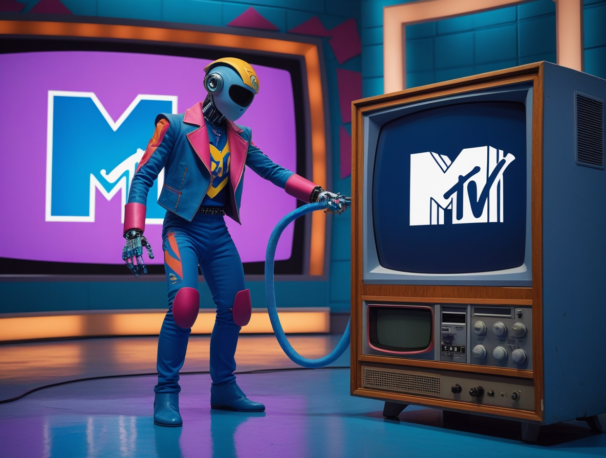
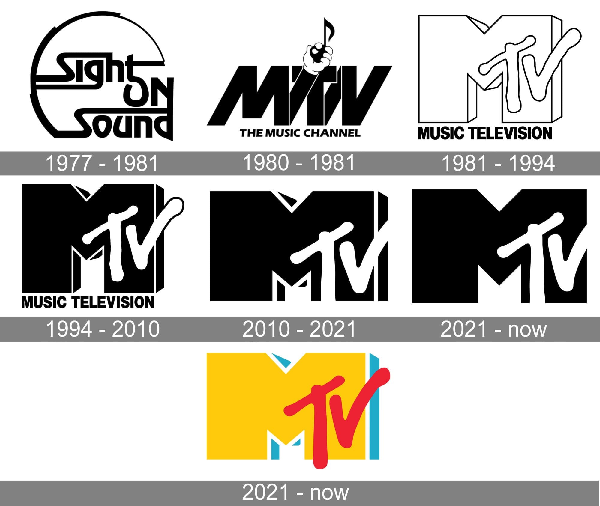

# 'AI Killed the MTV Star': KI schaltet MTV ab

*Am 1. August 1981 um 00:01 Uhr startete MTV seine Sendungen mit einem Musikvideo, das heute wie eine umgekehrte Prophezeiung klingt. "Video Killed the Radio Star" von den Buggles war die Absichtserklärung einer neuen Ära, in der Musik nicht mehr nur gehört, sondern auch gesehen wurde. Der Text handelte von der Nostalgie für die Ära des Radios, die vom Aufkommen des Videos überrollt wurde.*

Doch mit einer Ironie, die selbst Philip K. Dick bitter zum Lächeln gebracht hätte, hat die Geschichte eine andere Wendung genommen. Im Jahr 2025 erfreut sich das Radio bester Gesundheit, mit [soliden Einschaltquoten und einem treuen Publikum](https://www.radiospeaker.it/blog/ascolti-radio-primo-semestre-2025-editori/), während MTV seine Musikkanäle einen nach dem anderen abschaltet. Das Video hat den Radiostar nicht getötet. Aber etwas anderes hat MTV getötet.

Dieses Etwas hat das aseptische Gesicht der Algorithmen der künstlichen Intelligenz, die heute YouTube, Spotify und TikTok beherrschen. Und dies ist kein Artikel über Fernsehnostalgie, sondern über Technologie. Denn hinter der von [Paramount Global angekündigten Schließung](https://www.broadbandtvnews.com/2025/10/10/paramount-to-close-mtv-channels-across-europe/) von fünf MTV-Musikkanälen bis zum 31. Dezember 2025 verbirgt sich eine stille Revolution, die die Art und Weise, wie wir Musik entdecken, hören und konsumieren, neu definiert hat. Eine Revolution, die ihre Wurzeln im maschinellen Lernen und in Empfehlungssystemen hat, nicht in den Vorlieben des Publikums für Reality-Shows.

## Das Ende einer Ära

[Die Ankündigung von Paramount](https://www.bbc.com/news/articles/cdr612yz8p0o) markiert das Ende der Ausstrahlung von MTV Music, MTV 80s, MTV 90s, Club MTV und MTV Live. Wir sprechen nicht von marginalen Märkten: Die Schließung betrifft Großbritannien, Irland, Frankreich, Deutschland, Österreich, Polen, Ungarn und wird sich auf Australien und Brasilien ausdehnen. Der Hauptsender MTV HD wird überleben, aber als eine Zombie-Version seiner selbst, die sich auf Unterhaltungsprogramme und Reality-Shows konzentriert, die wenig mit Musik zu tun haben. Als letzte Kirsche auf der Torte des Niedergangs hat Paramount auch die [Ausgabe 2025 der MTV Europe Music Awards](https://www.rollingstone.com/music/music-news/mtv-uk-music-channels-end-of-year-1235444783/) abgesagt, einst einer der am meisten erwarteten Termine des Jahres für das europäische Musikpublikum.

Die offizielle Begründung ist die, die man erwarten würde: die Notwendigkeit, in einem schrumpfenden Fernsehmarkt rund 500 Millionen Dollar an Kosten zu sparen. Aber zu sagen, dass MTV schließt, weil die Leute kein Musikfernsehen mehr schauen, ist wie zu sagen, dass die Dinosaurier ausgestorben sind, weil es kalt war. Es ist wahr, aber es erzählt nicht die ganze Geschichte. Das eigentliche Massensterben fand auf einer tieferen Ebene statt, im technologischen Substrat, das bestimmt, wie und was wir hören.

[Die Geschichte des MTV-Logos, Bild von: 1000logos.net](https://1000logos.net/mtv-logo/)

## Die unsichtbare Revolution der Algorithmen

Auf den ersten Blick mag dies wie ein Thema erscheinen, das weit vom Kerngeschäft eines Technologieportals entfernt ist. MTV ist Fernsehen, Zeug aus dem zwanzigsten Jahrhundert, Mediendinosaurier, die sich nicht weiterentwickeln konnten. Aber wenn man genauer hinsieht, ist die Schließung von MTV das deutlichste Zeugnis dafür, wie die künstliche Intelligenz bereits ganze Sektoren unseres kulturellen Lebens radikal verändert hat, oft ohne dass wir es bemerkt haben. Wir sprechen nicht von ChatGPT oder Deepfakes, wir sprechen von Empfehlungsalgorithmen, die im Hintergrund arbeiten, unsichtbar, aber allgegenwärtig, und seit über einem Jahrzehnt unseren Musikgeschmack neu definieren.

Als MTV 1981 mit der Ausstrahlung begann, war die Entdeckung von Musik ein von Natur aus sozialer und von Menschen kuratierter Prozess. Es gab VJs, Videojockeys wie Martha Quinn oder Mark Goodman, oder etwas später den Italiener Andrea Pezzi, die auswählten, was gesendet wurde, narrative Flüsse zwischen einem Video und dem nächsten schufen und dich die Talking Heads direkt nach Madonna entdecken ließen. Es gab ein menschliches Element der Kuration, einen redaktionellen Geschmack, eine Vision. Selbst wenn diese Vision fragwürdig oder umstritten war, wie damals, als [MTV des Rassismus beschuldigt wurde](https://hollywoodreporter.it/musica/mtv-music-television-storia-vera-anniversario-nascita-canale-videoclip-musica-cultura-pop/35199/) wegen der geringen Präsenz afroamerikanischer Künstler in den Anfangsjahren, blieb es ein Prozess, der von menschlichen Entscheidungen vermittelt wurde, kritisierbar und diskutierbar, aber transparent.

Heute wurde dieser Prozess durch maschinelle Lernsysteme ersetzt, die Milliarden von Verhaltensdaten analysieren. Der Algorithmus von YouTube schlägt Ihnen nicht nur Videos vor, die denen ähneln, die Sie bereits gesehen haben: Er erstellt ein psychografisches Profil Ihrer Musikpräferenzen, indem er die Sehdauer, die Momente, in denen Sie pausieren, wann Sie ein Video verlassen, was Sie als Nächstes suchen und was Nutzer mit ähnlichen Konsummustern hören, miteinander vergleicht. Spotify verwendet [hybride Empfehlungssysteme](https://www.nature.com/articles/s41598-024-75967-0), die kollaboratives Filtern, die Analyse von Audioinhalten mittels Faltungs-Neuronalen-Netzwerken, die musikalische Muster erkennen, und die Verarbeitung natürlicher Sprache kombinieren, um zu analysieren, wie Nutzer in den sozialen Medien über Musik sprechen.

Das ist faszinierende Technologie, natürlich. Aber es ist auch Technologie, die das Sendemodell von MTV überflüssig gemacht hat. Warum einen linearen Strom von Musikvideos ansehen, die von jemand anderem ausgewählt wurden, wenn man einen persönlichen algorithmischen DJ haben kann, der seinen Geschmack besser kennt als man selbst? Es ist, als hätte Skynet beschlossen, Musikkritiker zu werden, anstatt die Menschheit auszurotten.

## Vom Broadcast zum personalisierten Unicast

Der epochale Wandel, den MTV nicht bewältigen konnte, ist der vom Broadcasting zum algorithmischen Unicasting. MTV sendete denselben Stream an Millionen von Menschen gleichzeitig. Es war eins zu vielen, ein gemeinsamer Platz, auf dem eine ganze Generation dieselben Videos zur selben Zeit sah. Dies schuf eine gemeinsame Kultur, gemeinsame Referenzen, kollektive Gespräche. Erinnern Sie sich, als am nächsten Tag alle über dasselbe Video sprachen? Ich schon, zum Glück oder leider... Das war die Macht des Broadcasts.

Digitale Plattformen haben dieses Modell pulverisiert. YouTube generiert täglich über eine Milliarde Stunden an angesehenen Musikvideoinhalten, aber niemand schaut denselben Stream. Jeder hat seinen eigenen personalisierten Feed, seine eigene einzigartige Mischung. TikTok hat diese Logik mit seiner [For You Page](https://derev.com/2025/06/tiktok-nel-2025-algoritmo-e-novita/) auf die Spitze getrieben, einem endlosen Strom kurzer Inhalte, bei dem die KI in Echtzeit entscheidet, was sie Ihnen basierend на micro-interaktionen, die in Millisekunden Aufmerksamkeit gemessen werden, zeigen soll. Es ist nicht mehr eins zu vielen, es ist eins zu eins, multipliziert mit Milliarden.

Dies hat auch neu definiert, was "Musik schauen" bedeutet. Auf MTV schaute man sich ein vierminütiges Musikvideo von Anfang bis Ende an. Auf TikTok werden Songs in 15-30 Sekunden lange Schnipsel zerlegt, remixed, neu interpretiert, in Memes verwandelt. Der Algorithmus lernt nicht nur, ob Ihnen ein Lied gefällt, sondern auch, welcher spezifische Ausschnitt dieses Liedes Ihre Aufmerksamkeit fesselt. Es ist eine analytische Granularität, die auf ein Niveau gebracht wird, das sich die Programmierer von MTV niemals hätten vorstellen können.

## Die Zahlen einer Massenabwanderung

Die Daten über den Niedergang des traditionellen Musikfernsehens sind gnadenlos. Laut [Marktforschungen](https://economictimes.indiatimes.com/news/international/us/mtv-to-shut-its-popular-music-tv-channels-after-4-decades-which-popular-mtv-channels-are-being-closed-and-what-triggered-the-big-move-all-you-need-to-know/articleshow/124516118.cms), die in der Ankündigung von Paramount zitiert werden, hat die überwiegende Mehrheit des jungen Publikums unter 35 Jahren noch nie einen Musikfernsehsender gesehen. Nicht aus ideologischer Wahl, sondern einfach, weil die bloße Vorstellung, darauf zu warten, dass ein Video, das einen nicht interessiert, vorbeigeht, um das zu sehen, was man will, so fremd ist wie die Verwendung eines Einwahlmodems zum Herunterladen eines Liedes.

YouTube Music hat über 100 Millionen zahlende Abonnenten, Spotify übersteigt 600 Millionen aktive Nutzer. Aber was noch wichtiger ist, ist die aufgewendete Zeit: Der durchschnittliche Nutzer verbringt über 2,5 Stunden pro Tag auf diesen Plattformen, verglichen mit den wenigen verbleibenden Minuten des traditionellen Musikfernsehens. Und es ist nicht nur eine Frage der Bequemlichkeit oder des On-Demand-Zugriffs. Es ist, dass diese Plattformen Ökosysteme aufgebaut haben, in denen KI als Klebstoff zwischen Entdeckung, Hören, Teilen und Inhaltserstellung fungiert.

Musik ist umgebungsbezogen geworden, immer verfügbar, für jeden Moment des Tages personalisiert. Spotify hat algorithmisch generierte Wiedergabelisten für "Konzentration", "Workout", "Chilliger Abend". YouTube schlägt Musikvideos nicht nur basierend auf Ihrem Geschmack vor, sondern auch auf dem Kontext: Tageszeit, verwendetes Gerät, ob Sie auf dem Fernseher oder dem Smartphone schauen. MTV sendete mittags und mitternachts dieselben Videos, an einen Studenten und einen Nachtarbeiter. Es war demokratisch, aber starr. KI ist flexibel, aber fragmentiert.

[Bild aus dem Video "Video Killed the Radio Star" auf YouTube](https://www.youtube.com/watch?v=W8r-tXRLazs)

## Das Paradox der algorithmischen Entdeckung

Und hier kommen wir zum Kern der Sache, zu dem Zweifel, der uns nachdenklich machen sollte, während MTV seine Pforten schließt. Sind Algorithmen wirklich besser als menschliche VJs, um uns neue Musik entdecken zu lassen? Oder tauschen wir kulturelle Biodiversität gegen eine algorithmische Monokultur, die als Personalisierung getarnt ist?

[Eine 2025 in Scientific Reports veröffentlichte Studie](https://www.nature.com/articles/s41598-024-75967-0) analysierte Milliarden von Hörvorgängen auf Musik-Streaming-Plattformen und entdeckte etwas Beunruhigendes. Ja, Algorithmen setzen Nutzer einer größeren Anzahl verschiedener Künstler aus als das traditionelle Radio. Aber diese Künstler sind "semantisch begrenzt", das heißt, sie gehören zu immer engeren und homogeneren Nischen. Mit anderen Worten: Sie entdecken mehr Bands, aber alle klingen im Grunde gleich.

Das Problem nennt sich "musikalische Filterblase" und funktioniert so. Der Algorithmus beginnt mit Ihren ersten musikalischen Entscheidungen und erstellt ein Profil. Dann schlägt er Ihnen Inhalte vor, die die Wahrscheinlichkeit maximieren, dass Sie weiterhören, denn sein Ziel ist es, Sie auf der Plattform zu halten. Dazu bevorzugt er Vertrautheit gegenüber radikaler Neuheit. Er schlägt Ihnen Künstler vor, die unterschiedlich genug sind, um wie eine Entdeckung zu wirken, aber ähnlich genug, um nicht zu riskieren, dass Sie das Hören abbrechen. Es ist die Logik der algorithmischen Komfortzone.

[Eine auf der ACM Web Conference 2024 vorgestellte Studie](https://dl.acm.org/doi/10.1145/3589334.3645497) zeigte, dass traditionelle Empfehlungssysteme die "Inter-User"-Vielfalt (die Unterschiede zwischen den Geschmäckern verschiedener Personen) erheblich reduzieren, ohne die "Intra-User"-Vielfalt (die musikalische Vielfalt, die jeder einzelne Hörer erlebt) proportional zu erhöhen. Übersetzt: Wir alle hören am Ende eine immer ähnlichere Mischung, während jeder von uns ein immer engeres Territorium erkundet.

MTV zwang einen mit all seinen Einschränkungen und fragwürdigen Entscheidungen zu einer Form von Serendipität. Man schaltete den Fernseher ein, um Duran Duran zu sehen, und stieß auf Sonic Youth, ob es einem gefiel oder nicht. Vielleicht hat man verärgert den Kanal gewechselt, oder vielleicht hat man etwas entdeckt, wonach man von sich aus nie gesucht hätte. Es war ein "Push"-Entdeckungsmodell, das auf menschlicher Kuration basierte. Der Algorithmus hingegen ist "Pull": Er beginnt dort, wo man bereits ist, und führt einen dorthin, wo er einen haben will, und erzeugt die Illusion, dass man frei wählt.

[Eine Studie aus dem Jahr 2024 über die Homogenisierung der Popmusik](https://www.researchgate.net/publication/385087005_Homogenization_of_Pop_Music_How_Social_Media's_Algorithms_Prevents_Creativity_and_Innovation) zeigte, wie Social-Media-Algorithmen einen gefährlichen Rückkopplungskreislauf erzeugen: Sie belohnen Mainstream-Inhalte mit breiter Anziehungskraft, Künstler und Produzenten lernen, was algorithmisch funktioniert, und produzieren Musik, die für Algorithmen optimiert ist, die wiederum diese Musik belohnen, weil sie gut funktioniert, in einem Kreislauf, der zur Standardisierung neigt. Es ist, als ob wir Musik in Batterien züchten würden, anstatt sie frei auf den Feldern laufen zu lassen.

Der menschliche VJ konnte sich irren, Vorurteile haben, schreckliche Entscheidungen treffen. Aber er hatte auch die Möglichkeit, mutige Entscheidungen zu treffen, ein experimentelles Video in die Rotation zu nehmen, weil er daran glaubte, unerwartete Verbindungen zwischen verschiedenen Genres zu schaffen. Der Algorithmus optimiert auf Engagement, nicht auf kulturelle Entdeckung. Und das ist ein grundlegender Unterschied, den wir zu spät zu verstehen drohen.

## Das Video hat den Radiostar nicht getötet

Es gibt eine letzte Ironie in dieser Geschichte, die es wert ist, hervorgehoben zu werden. Das Radio, das die Buggles 1981 für tot erklärt hatten, hat überlebt und ist gesund. Laut Daten von 2025 erreicht das Radio immer noch 90 % der erwachsenen Bevölkerung in vielen westlichen Ländern, hat es geschafft, sich mit Streaming, Podcasts und Apps in die digitale Welt zu integrieren. Menschliche Radio-DJs entdecken weiterhin Musik, schaffen narrative Flüsse und sind wiedererkennbare Stimmen mit einer Persönlichkeit.

MTV hingegen schließt, weil es am linearen Sendemodell festhielt, ohne sich weiterzuentwickeln. Es hat es nicht geschafft, eine digitale Plattform zu werden, es hat keine wettbewerbsfähigen Algorithmen entwickelt, es hat nicht verstanden, dass die Zukunft nicht einfach darin bestand, seine Inhalte online zu stellen, sondern darin, völlig neu zu überdenken, was es bedeutet, Musik im Zeitalter der KI zu kuratieren und zu entdecken.

Das Radio hat sich weiterentwickelt, weil es verstanden hat, dass sein Wert nicht im technologischen Medium lag, sondern in der menschlichen Beziehung, in der Stimme des DJs, den man kennt und dem man vertraut, in der Gemeinschaft der Hörer. MTV glaubte, sein Wert liege in der Kontrolle des Fernseh-Vertriebskanals, und als dieser Kanal veraltet war, hatte es nichts mehr.

Vielleicht werden wir in ein paar Jahren feststellen, dass auch die algorithmische Personalisierung ihre Grenzen hat, dass die kulturelle Biodiversität menschliche Kuratoren braucht, die scheinbar ineffiziente, aber kulturell lebenswichtige Entscheidungen treffen. Vielleicht werden wir entdecken, dass der Freund, der einen dazu bringt, diese seltsame Band zu hören, die man nie auf Spotify gesucht hätte, oder der Radio-DJ, der einen mit einem Titel außerhalb seines algorithmischen Profils überrascht, eine wichtige ökologische Funktion bei der Erhaltung eines vielfältigen musikalischen Ökosystems spielten.

Aber im Moment, während MTV seine letzten Musikkanäle abschaltet und Paramount verspricht, dass die Marke "im Digitalen" weiterleben wird, ist die Realität, dass das Video den Radiostar nicht getötet hat. Es waren die Algorithmen der künstlichen Intelligenz, die den MTV-Star getötet haben. Und das ist, bei allem Respekt vor den Buggles, das letzte Musikvideo, das es sich lohnt anzusehen, bevor die Sendungen am 31. Dezember 2025 endgültig eingestellt werden. "KI hat den MTV-Star getötet". Und es ist noch nicht klar, ob wir das als Fortschritt oder als Verlust betrachten sollten.