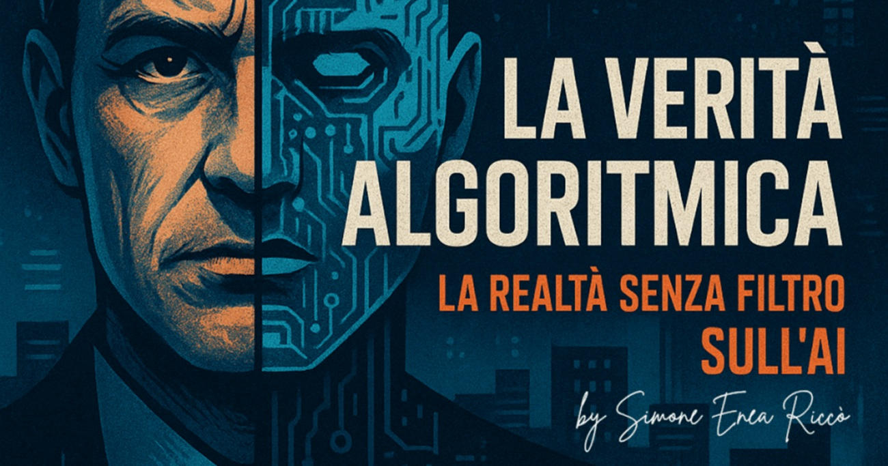

# "KI stiehlt nicht den Job, die Mittelmäßigkeit tut es": Simone Enea Riccò und "Die Algorithmische Wahrheit"

Simone Enea Riccò ist nicht der Typ, der sich von technologischen Moden blenden lässt. Mit über fünfzehn Jahren Erfahrung an der Spitze von Marketing und digitaler Strategie hat er viele angekündigte Revolutionen kommen und wenige sich verwirklichen sehen. Doch die künstliche Intelligenz ist für ihn anders. Nicht, weil sie das x-te Schlagwort ist, das in Unternehmenspräsentationen eingefügt wird, sondern weil sie wirklich die Art und Weise verändert, wie Unternehmen die Bedürfnisse ihrer Kunden verstehen und antizipieren können.

Marketing Director und AI Strategy Leader, [Riccò](https://www.simoneenearicco.it/) ist der Gründer von La Verità Algoritmica, einem Observatorium und Podcast, das die realen Auswirkungen von KI in Wirtschaft, Kommunikation und Gesellschaft untersucht. Seine erklärte Mission ist es, die künstliche Intelligenz zu entmystifizieren, sie zugänglich zu machen und über den technologischen Hype hinauszugehen, um zu dem zu gelangen, was er "bewusste und menschenzentrierte Innovation" nennt. Sein Lebenslauf hebt Marketing- und Rebranding-Strategien für internationale Marken, neu gestaltete Treueprogramme für Branchenführer und Kooperationen mit Institutionen vom Kaliber des Europäischen Parlaments und der Expo 2015 hervor. Ein Weg, der ihm unter anderem die NC Awards 2019 für die beste PR-Kampagne in Italien eingebracht hat.

Als Autor von zwei Büchern, die seine Philosophie kristallisieren, "Marketing AI: Der strategische Leitfaden" und dem Wirtschaftsroman "KI hat meinen Job gestohlen", der am 28. November erscheint, baut Riccò Brücken zwischen dem theoretischen Potenzial der KI und greifbaren Geschäftsergebnissen. Und wenn ich ihn nach diesen konkreten Anwendungen frage, die einen messbaren Return on Investment bringen und nicht nur Schall und Rauch sind, ist seine Antwort chirurgisch präzise.

## Vom Megaphon zur Vorhersage: die Entwicklung des Marketings

"Die Unternehmen, die sich wirklich mit KI auseinandersetzen, fragen sich: 'Okay, aber wofür ist KI gut? Wo setze ich sie ein? Warum setze ich sie ein? Welche Probleme will ich lösen?', es gibt hauptsächlich zwei Bereiche: Technologie und Marketing", erklärt Riccò. Der Grund ist einfach: Das Marketing hatte bereits Automatisierung, Trichter und die Analyse der Customer Journey in seinem Werkzeugkasten. Der evolutionäre Sprung der KI war daher nicht traumatisch, sondern fast natürlich. "Bis gestern warst du reaktiv, hast an den Verbraucher gedacht. Jetzt denkst du an den Verbraucher in einer prädiktiven Optik."

Und genau auf die Vorhersage konzentrieren sich die reifsten Anwendungen. Wenn du es schaffst, Verbraucher dank Daten effizient zu klassifizieren, kannst du heute einzelne Kunden oder Interessenten bewerten und in Bezug auf den prädiktiven Wert denken. Der prädiktive Customer Lifetime Value ermöglicht es beispielsweise, zu prognostizieren, welcher Kunde ein höheres Potenzial hat und daher größere Investitionen verdient als ein anderer, der historisch auf weniger interessante Muster reagiert. Ein Paradigmenwechsel, der das Marketingbudget von einer zufällig verteilten Ausgabe in eine gezielte Investition verwandelt.

Aber die wahre Goldmine, so Riccò, liegt in der Vorhersage der Kundenabwanderung (Churn). "Kundenbindung und -treue sind super wichtig. Es ist entscheidend, die Signale abzufangen, die darauf hindeuten, dass ein Kunde kurz vor der Abwanderung steht, Signale, die man früher im Data Lake nicht gesehen hat." Einen Kunden zurückzugewinnen, der im Begriff ist zu gehen, kostet unendlich weniger als einen neuen zu gewinnen, und hier macht die KI den Unterschied zwischen dem Erkennen des Musters und dem Verlieren im Hintergrundrauschen.

All dies führt zu einem radikalen Umdenken im Marketing selbst. Weg vom Megaphon-Marketing, das lauter als die Konkurrenz schrie und eine Unterbrechung nach der anderen verursachte. "In einer auf Vertrauen basierenden Wirtschaft wie der europäischen", sagt Riccò und bezieht sich auf ein anderes Modell als die KI-Macht Amerikas und Chinas, "nervt die Unterbrechung den Nutzer. Die vierzigste E-Mail einer Marke ist keine Kommunikation, sondern Spam." Die Alternative besteht darin, Wert und Kontext zu bieten, dank algorithmischer Vorhersage zu verstehen, was der Nutzer erhalten möchte, damit die Kommunikation keine Unterbrechung, sondern ein Service ist. Die E-Mail, die Aktivitäten auf Sizilien vorschlägt, nachdem du einen Flug gebucht hast, ist nicht aufdringlich, sondern nützlich. Und das ist der Unterschied zwischen reaktivem und prädiktivem Marketing.

## Instinkt gegen Daten: Warum KI-Projekte scheitern

Das Buch "Marketing AI: Der strategische Leitfaden" entstand aus einer bitteren Erkenntnis. "Ich sah viele Unternehmen, die von der Mode 'machen wir die Investition' erfasst waren", erzählt Riccò. "Die instinktive Entscheidung war, das Tool zu kaufen, die KI zu kaufen, Megaprojekte zu machen, Geld auszugeben, und dann zeigten die Berichte sechs Monate später, dass KI-Projekte zu 75 %, 85 %, einer Milliarde Prozent scheiterten." Es ist das Thema der instinktiv getroffenen Entscheidungen, geleitet vom Geschmack des Augenblicks, vom Bedürfnis, etwas Modisches zu tun. Und sie enden fast immer schlecht.

Der häufigste Fehler? Sich nicht zu fragen, wie der eigene Data Lake aussieht. Wenn die Daten schmutzig sind, ist die Vorhersage falsch. Es ist das Prinzip "Garbage in, Garbage out", das in der KI noch gnadenloser wird. Ehrgeizige Projekte für prädiktiven CLV oder prädiktive Churn-Raten scheitern kläglich, weil das Scoring sehr schlecht gemacht wird, vielleicht ohne jemals eine Datenbereinigung durchgeführt zu haben, oder schlimmer noch, ohne überhaupt ein anständiges CRM zu haben. "Ich habe einen strategischen Kompass geschrieben, der die Leute nicht in instinktiven Dingen verloren gehen lässt, sondern ein Muster, ein Framework, ein Schema zum Befolgen gibt, um sich die richtigen Fragen zu stellen", erklärt er.

Und dann gibt es den FOMO-Effekt, die Fear of Missing Out, die Angst, außen vor zu bleiben. Man versucht, etwas instinktiv zu tun, man stürzt sich hinein. Riccòs Empfehlung ist klar: versuchen und ausprobieren, aber mit kleinen Proof of Concepts und Tests. "Man sollte nicht die fünfhundert Millionen Euro Investition tätigen, ohne vorher getestet zu haben, ob das Projekt skalierbar war und ob man die Daten im Unternehmen hatte, um das Ziel zu erreichen."

Das grundlegende Problem ist jedoch tiefer und in allen Berichten über den Stand der Unternehmens-KI aufgetaucht: Es fehlt an Kompetenz. Es gibt keine KI-Alphabetisierung, die Ausbildung ist unzureichend, obwohl sie im europäischen KI-Gesetz verpflichtend geworden ist. Die Unternehmen haben noch nicht begonnen, ernsthaft in die Umschulung (Reskilling) zu investieren. Und die Menschen, die sich wirklich verändern und beruflich wachsen wollen, bewegen sich autonom und schreiben sich in Masterstudiengänge ein, um ihre beruflichen Fähigkeiten zu stärken.

## Die emotionale Intelligenz, die der Algorithmus nicht hat

"KI hat meinen Job gestohlen, Geschichte eines mittelmäßigen Managers" ist der provokante Titel des Romans, der am 28. November erscheint. Riccò behandelt das Thema eines Managers, der nicht seine Mittelmäßigkeit, sondern die Technologie beschuldigt. "Die wahre Bedrohung ist nicht die Technologie, sondern die Mittelmäßigkeit", fasst er zusammen. Und hier kommt das Thema der Zukunftskompetenzen ins Spiel, die kein Algorithmus ersetzen kann.

Die Menschen müssen ihr Denkvermögen, ihr kritisches Denken trainieren. Das Reskilling kann sich nicht auf Prompting-Kurse beschränken, so nützlich sie auch sein mögen. Es werden tiefere Kompetenzen benötigt: kritisches Denken und emotionale Intelligenz. Riccò zitiert ein nachdenklich stimmendes Beispiel: das Trolley-Dilemma, das Gemini, der KI von Google, vorgelegt wurde. Vor die Wahl gestellt, zwei Millionen Kinder oder den Präsidenten der Vereinigten Staaten zu überfahren, entschied sich der Algorithmus dafür, die zwei Millionen Kinder zu opfern. "Er hat nicht die Ausbildung und die emotionale Intelligenz, um die emotionalen und sozialen Konsequenzen vorherzusehen: politische Instabilität, Aufstand gegen die Maschinen."

Die Maschine macht diese emotionale Überlegung nicht, weil sie es nicht kann. Sie berechnet, optimiert, prognostiziert, aber sie versteht nicht das soziale Gefüge, die moralischen Implikationen, das Gewicht bestimmter Entscheidungen. Deshalb, so Riccò, muss die Ausbildung Kurse belohnen, die technische Kompetenz, aber auch emotionale Intelligenz und kritisches Denken vermitteln. Es reicht nicht zu wissen, wie man KI einsetzt, man muss wissen, wann man sie nicht einsetzen sollte.

## Wenn Reskilling zu einem Wettlauf gegen die Zeit wird

Die historischen Revolutionen der Arbeit, die landwirtschaftliche und die industrielle, fanden über Jahrzehnte oder sogar Jahrhunderte statt. Diese ist anders, viel schneller. "Es ist ein bisschen schwierig", gibt Riccò zu, als wir ihn fragen, wie man eine so schnelle und gewaltige Nachfrage nach Reskilling bewältigen kann. Das Problem betrifft vor allem Menschen, die seit zwanzig Jahren eine repetitive Arbeit machen, die nicht die Gewohnheit haben, sich neu zu erfinden, zu lernen.

Nicht alles ist für jeden, und das ist klar. Aber wer sich weiterentwickeln will, sollte vielleicht jetzt damit anfangen. Riccò glaubt nicht, dass übermorgen die Welt untergeht und die Menschen wegen der künstlichen Intelligenz alle ihre Arbeit verlieren werden. Wie bei allen Veränderungen in der Geschichte müssen sich jedoch diejenigen, die überleben wollen, bewegen. Der Ausgangspunkt in Italien ist kompliziert: Es gibt einen auch vom Ministerium anerkannten digitalen Analphabetismus, eine schwache Grundlage, auf der die Transformation aufgebaut werden muss.

Die größten Sorgen, so merke ich an, betreffen diejenigen, die in Sektoren arbeiten, in denen es reine Handarbeit oder Fließbandarbeit gibt. Wenn eine Maschine eine manuelle Arbeit ersetzt, wird es extrem schwierig, diese Person umzuschulen. Und wir sprechen nicht nur von Arbeitern: Auch der fünfzigjährige Buchhalter, der sich um die Rechnungen kümmert, gerät trotz seiner Fähigkeiten in Schwierigkeiten, wenn er durch eine Software ersetzt wird. Er kann nicht plötzlich ein Prompt-Ingenieur werden. Riccò bestätigt: "Ein vollständig manueller und replizierbarer Beruf wird zur Ware."

In seinem demnächst erscheinenden Buch behandelt Riccò das Thema des "Taschenrechner-Managers", der sich auf die KI verlassen hat, ohne sich zu hinterfragen, und sich so ersetzbar gemacht hat. Das Ziel ist es, auf verschiedenen Ebenen und mit unterschiedlichen Kompetenzen, sich unersetzlich zu machen. Ein Ziel, das immer dringlicher wird, wenn man bedenkt, dass die Robotik im Jahr 2030 etwa zwanzigtausend Euro kosten und viel weiter verbreitet sein wird als heute.

## Der Mensch im Mittelpunkt, auch wenn der Algorithmus entscheidet

Wenn man über Ethik in der KI spricht, wird das Thema der Black Box zentral. "Die Erklärbarkeit der KI wird super wichtig", betont Riccò. Der Mensch im Mittelpunkt bedeutet, dass der Mensch der endgültige Entscheidungsträger ist. Um auf das Beispiel des Trolley-Dilemmas zurückzukommen: Derjenige, der den Hebel umlegen muss, informiert durch die Daten der KI, ist der Mensch, nicht die Maschine.

Auf ethischer Ebene müssen bestimmte Entscheidungen mit menschlicher Verantwortung getroffen werden. Die KI macht die Berechnungen, gibt die Vorhersage und die Information, aber sie muss auch die dahinterstehende Argumentation erklären, die man oft nicht sieht. Erst nachdem der Mensch transparent informiert wurde, trifft er die Entscheidung. Das ist das Konzept des "Menschen im Mittelpunkt" und der Humanics, der Disziplin, die die Interaktion zwischen menschlichen Fähigkeiten und Technologie untersucht.

Für ein Unternehmen bedeutet dies, dass KI-Innovation als menschenzentriert wahrgenommen werden muss, um das Vertrauen der Kunden in den wichtigsten Wettbewerbsvorteil zu verwandeln. In einem sich ständig weiterentwickelnden digitalen Kontext baut sich der Ruf einer Marke auf der Transparenz der verwendeten Algorithmen und der Garantie auf, dass hinter jeder wichtigen Entscheidung ein verantwortlicher Mensch steht.

## Menschen, die mit Maschinen sprechen, die mit Menschen sprechen

Das Paradigma ändert sich schnell. "Wenn du heute zwischen Apple und Samsung wählen willst, gehst du nicht mehr zu Google, du fragst Gemini oder ChatGPT", bemerkt Riccò. Das ist eine radikale Veränderung in der Art und Weise, wie Menschen Informationen suchen und Kaufentscheidungen treffen. Und das bedeutet, dass Marken ihre digitale Präsenz komplett überdenken müssen.

Man muss für den Algorithmus relevant sein, damit die vom Algorithmus gegebene Zusammenfassung, die beim Menschen ankommt, interessant und korrekt ist. Der Gesprächspartner ist nicht mehr direkt der Mensch, sondern "wir sind Menschen, die mit Maschinen sprechen, die mit Menschen sprechen". Ein bisschen wie bei dem Spiel "Stille Post", das wir als Kinder gespielt haben, nur dass hier die Nachricht intakt ankommen muss.

Aus diesem Grund ist ein ganzheitliches Markendenken notwendig. Die Marke muss die Bewertungen pflegen, eine konsistente Positionierung auf allen Kanälen beibehalten, eine SEO betreiben, die darauf ausgelegt ist, dass der Algorithmus das, was sie sagt, für zuverlässig hält. Das Ziel ist es, dass der Algorithmus die Website, die Bewertungen, die Websites Dritter, die Konkurrenten und die Aggregatoren korrekt liest und eine korrekte Zusammenfassung dessen erstellt, wie das Unternehmen erscheinen möchte. Nur so kann die Person, die diese Zusammenfassung liest, eine informierte Entscheidung treffen.

Es geht nicht mehr um Engagement um seiner selbst willen, um Sichtbarkeit um jeden Preis. Es geht um Autorität in den Augen des Algorithmus, die dann zur Autorität in den Augen der Menschen wird. Ein zweistufiges Marketing, bei dem der erste Filter nicht menschlich, sondern künstlich ist.

## Regulierung: Der wahre Game Changer der nächsten fünf Jahre

Als ich ihn frage, was die wahre Herausforderung sein wird, die die Zukunft der künstlichen Intelligenz in den nächsten fünf Jahren definieren wird, ob technologische Entwicklung, gesetzliche Regulierung oder Unternehmensführung, hat Riccò keine Zweifel. "Wir sind sehr weit von der Anwendung des KI-Gesetzes entfernt und das ist heute das Wichtigste: eine effiziente und ethische Regulierung zu haben, die die Anwendung regelt."

Eine technische Flucht nach vorn ist nicht angebracht, da sie dann gemäß der neuen Regulierung wieder demontiert werden müsste. Die Unternehmensführung baut auf Gesetzen auf, also sind die Gesetze der erste Teil, von dem man ausgehen muss. "Das Gesetz ist das Wichtigste, von dem aus alles andere eingerahmt werden muss", erklärt er. Auch wenn die öffentliche Verwaltung bei diesen Veränderungen leider zu langsam ist, bleibt die Regulierung die absolute Priorität.

Es ist ein Ansatz, der das europäische Modell widerspiegelt, das der auf Vertrauen basierenden Wirtschaft, von der er zuvor sprach. Während Amerika und China auf reine technologische Macht setzen, versucht Europa, einen ethischen und rechtlichen Rahmen zu schaffen, der sicherstellt, dass Innovation nachhaltig und menschenzentriert ist. Ein vielleicht langsamerer Ansatz, aber auf lange Sicht potenziell solider.

---

  
Das Gespräch mit Simone Enea Riccò hinterlässt eine Gewissheit: Künstliche Intelligenz ist nicht das Problem und wahrscheinlich auch nicht die Lösung. Sie ist ein Werkzeug, so mächtig wie gefährlich, wenn es falsch eingesetzt wird. Den wahren Unterschied machen die Menschen: diejenigen, die sich weiterbilden, die kritisches Denken und emotionale Intelligenz entwickeln, die sich die richtigen Fragen stellen, bevor sie Millionen in zum Scheitern verurteilte Projekte investieren. KI stiehlt nicht den Job von denen, die sich mit einzigartigen Kompetenzen unentbehrlich machen. Sie stiehlt ihn nur denen, die bereits ersetzbar waren, denen, die sich hinter der Mittelmäßigkeit repetitiver Prozesse versteckten, ohne sich jemals nach dem Wert zu fragen, den sie brachten.

Wie Riccò sagt, geht es nicht darum, pessimistisch oder optimistisch in die Zukunft zu blicken. Es geht darum, zu wählen, auf welcher Seite man stehen will: auf der Seite derer, die die Veränderung erleiden, oder auf der Seite derer, die sie anführen. Und das war am Ende schon immer eine persönliche Entscheidung.