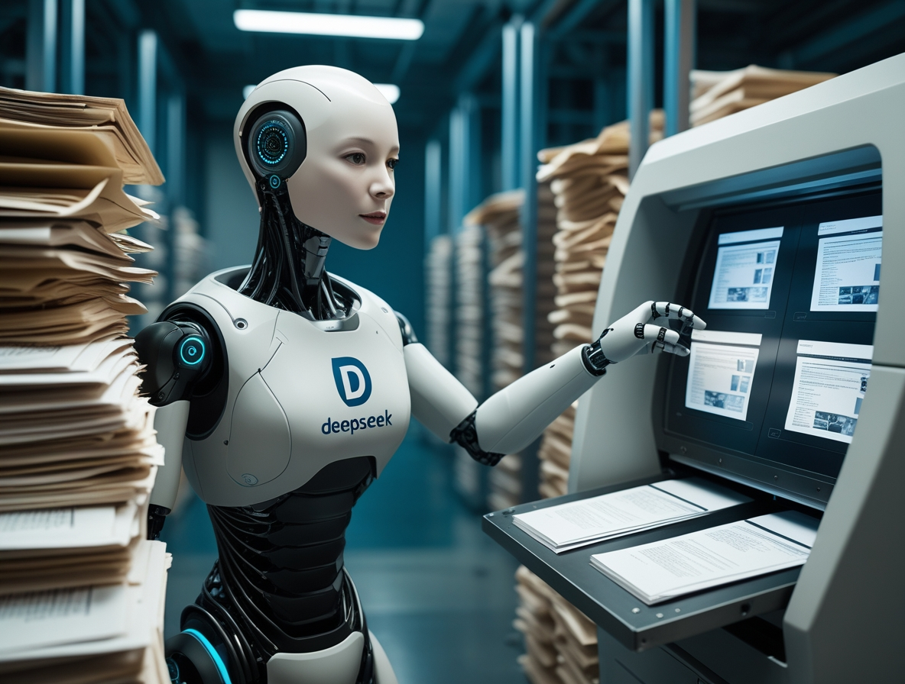
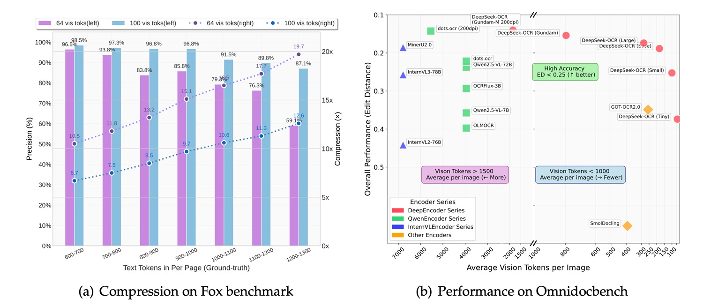
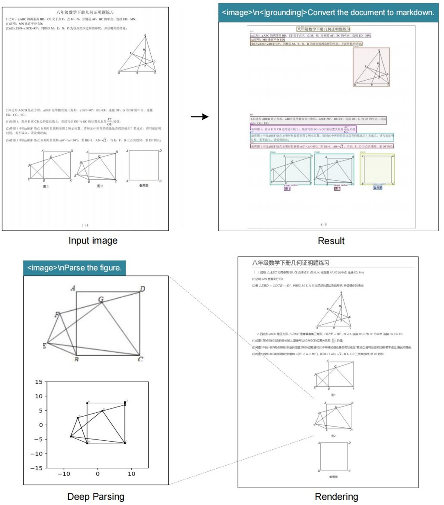

# DeepSeek OCR: quando l'immagine vale 10mila token

*Solitamente evitiamo di rincorrere ogni annuncio delle grandi aziende tech, a meno che non si tratti di vera innovazione. E stavolta sembra proprio il caso. [DeepSeek-OCR](https://github.com/deepseek-ai/DeepSeek-OCR), rilasciato il 20 ottobre 2025, ha raggiunto oltre 7.000 stelle su GitHub in pochi giorni e ha catturato l'attenzione di Andrej Karpathy, ex direttore AI di Tesla e figura leggendaria nel campo del deep learning. Non è un fatto da poco quando uno dei cervelli più brillanti della computer vision [definisce un modello "quite interesting"](https://x.com/karpathy/status/1980397031542989305) e si mette a filosofeggiare sul futuro dei tokenizer. Ma cosa ha di speciale questo modello da 3 miliardi di parametri che ha scatenato tale entusiasmo?*

## L'architettura del ribaltamento

DeepSeek-OCR rovescia un paradigma che sembrava consolidato: invece di convertire immagini in testo per poi tokenizzarlo, trasforma il testo in immagine e lo comprime otticamente. È come se qualcuno avesse guardato la Stele di Rosetta al contrario e avesse capito che il geroglifico è più efficiente dell'alfabeto. L'idea è tanto semplice quanto controintuitiva, e richiama quella scena di *Tenet* dove i proiettili tornano indietro nel tempo: qui i token tornano pixel.

L'architettura si divide in due componenti principali. Il DeepEncoder prende un documento ad alta risoluzione, lo processa attraverso un encoder visivo basato su [SAM](https://segment-anything.com/) e CLIP, poi lo comprime usando un modulo convoluzionale che riduce drasticamente il numero di token necessari. Il decoder è un modello Mixture-of-Experts da 3 miliardi di parametri che interpreta questi "vision tokens" compressi e produce output strutturato. 

I numeri raccontano una storia interessante: con una compressione 10x, il sistema mantiene il 97% di precisione. Spingendo il rapporto a 20x, la precisione scende al 60%, ma per molti use case rimane più che accettabile. Questo significa che un articolo di mille parole, che richiederebbe circa mille token in formato testo, può essere rappresentato con soli 100 vision tokens mantenendo quasi intatta l'informazione. [DeepSeek sostiene](https://deepseek.ai/blog/deepseek-ocr-context-compression) che un singolo GPU NVIDIA A100 può processare 200.000 pagine al giorno con questo sistema, un throughput che fa impallidire i tradizionali pipeline OCR.

## Benchmark e confronti: dove brilla (e dove no)

Il confronto con la concorrenza rivela luci e ombre. Su [OmniDocBench](https://www.marktechpost.com/2025/10/20/deepseek-just-released-a-3b-ocr-model-a-3b-vlm-designed-for-high-performance-ocr-and-structured-document-conversion/), il benchmark che testa capacità di estrazione su documenti complessi, DeepSeek-OCR si comporta bene ma non domina. GOT-OCR 2.0, sviluppato dall'Università di Pechino, rimane superiore in termini di accuratezza pura, specialmente su documenti con layout complessi o formule matematiche. MinerU 2.0, altro contendente cinese, mostra prestazioni simili ma con un'architettura più tradizionale.

Nel confronto con i modelli vision-language multimodali generalisti, la situazione si fa più interessante. MiniCPM-V 2.6, InternVL 2.5 e il recente Mistral OCR sono tutti modelli più grandi, con parametri che vanno dai 7 ai 20 miliardi. DeepSeek-OCR, con i suoi 3 miliardi, gioca in una categoria diversa. Come [nota Karpathy stesso](https://x.com/karpathy/status/1980397031542989305), il modello è "maybe a bit worse than dots" (riferendosi probabilmente a Gemini o altri sistemi chiusi), ma l'ammissione è sincera e sintomatica: non è una questione di supremazia assoluta, ma di efficienza relativa.

IBM Docling, altra soluzione open source per l'analisi documentale, adotta un approccio ibrido con pipeline modulari e raggiunge ottimi risultati su documenti tecnici e scientifici, ma richiede più risorse computazionali. Microsoft Florence-2, pur essendo un modello vision più generico, mostra capacità OCR discrete ma soffre nelle situazioni dove serve preservare la struttura del documento.

La vera forza di DeepSeek-OCR emerge nei casi d'uso specifici: documenti lunghi, batch processing, applicazioni dove la velocità è critica e una leggera perdita di precisione è tollerabile. È l'equivalente tecnologico di scegliere una reflex mirrorless rispetto a una medio formato: meno perfetta, ma molto più versatile e pratica.

[Immagine tratta dal prfilo GitHub di DeepSeek OCR](https://github.com/deepseek-ai/DeepSeek-OCR)

## Dalla teoria alla pratica: dove serve davvero

Ma quando ha senso implementare DeepSeek-OCR in un progetto reale? La risposta dipende dal contesto specifico. Le applicazioni più promettenti riguardano scenari dove volume e velocità contano più della perfezione assoluta. Pensiamo alla digitalizzazione di archivi storici cartacei, dove milioni di pagine devono essere convertite in formato ricercabile: qui la capacità di processare 200.000 pagine al giorno su un singolo GPU fa la differenza tra un progetto fattibile e uno economicamente insostenibile.

Nel mondo enterprise, l'estrazione automatica di dati da fatture, ricevute o documenti contabili rappresenta un altro territorio fertile. Società come [Dataconomy evidenziano](https://dataconomy.com/2025/10/21/deepseek-ocr-new-open-source-ai-model-goes-viral-on-github/) come studi legali e dipartimenti compliance potrebbero beneficiare dell'analisi massiva di contratti, dove mantenere la struttura visiva del documento è cruciale quanto estrarre il testo. Un avvocato che cerca una clausola specifica in diecimila accordi di non divulgazione non ha bisogno di precisione al 99,9%, ma di trovare rapidamente i documenti rilevanti.

C'è però un'ombra che aleggia su questi scenari: la trasparenza sui dati di training. DeepSeek non ha rilasciato dettagli sul dataset usato per addestrare il modello, e questo è un problema non banale. Un OCR addestrato principalmente su documenti finanziari cinesi potrebbe interpretare male fatture europee, così come uno esposto prevalentemente a testi stampati potrebbe arrancare con la scrittura a mano. L'opacità sui dati rende difficile valutare a priori se il modello sia adatto al proprio caso d'uso specifico, obbligando a test empirici che non tutti possono permettersi.

## La filosofia open source in tempi di guerra dei chip

La decisione di rilasciare DeepSeek-OCR completamente open source, con pesi del modello scaricabili da [Hugging Face](https://huggingface.co/spaces/khang119966/DeepSeek-OCR-DEMO) e codice su GitHub, stride violentemente con il destino del modello R2 di DeepSeek, ancora nel limbo. [Il contesto geopolitico spiega tutto](https://www.techradar.com/pro/chaos-at-deepseek-as-r2-launch-crashes-into-hardware-problems-rivals-gain-huge-advantage): dopo il successo virale di DeepSeek-R1 all'inizio del 2025, le autorità cinesi hanno spinto l'azienda ad abbandonare le GPU NVIDIA in favore dei chip Ascend di Huawei per l'addestramento di R2.

Il risultato è stato un disastro tecnico. [Secondo Financial Times](https://www.tomshardware.com/tech-industry/artificial-intelligence/deepseek-reportedly-urged-by-chinese-authorities-to-train-new-model-on-huawei-hardware-after-multiple-failures-r2-training-to-switch-back-to-nvidia-hardware-while-ascend-gpus-handle-inference), DeepSeek non è riuscita a completare un singolo training run con successo sui chip Huawei, nonostante un team di ingegneri fosse stato inviato sul posto. L'amministrazione Trump aveva bandito l'esportazione delle H20 di NVIDIA verso la Cina nell'aprile 2025, e DeepSeek si è trovata stretta tra le sanzioni americane e le pressioni governative cinesi. Il CEO Liang Wenfeng, [insoddisfatto delle performance di R2](https://www.bgr.com/tech/what-happened-to-deepseeks-revolutionary-r2-ai/), ha dovuto scegliere: patriottismo tecnologico o risultati concreti.

In questo scenario, rilasciare DeepSeek-OCR in open source diventa una mossa strategica multidimensionale. Primo, aggira le limitazioni hardware: un modello da 3 miliardi può girare su hardware consumer, riducendo la dipendenza da datacenter pieni di GPU impossibili da ottenere. Secondo, costruisce soft power: mentre R2 langue nei server di DeepSeek, OCR conquista sviluppatori in tutto il mondo. Terzo, bypassa le restrizioni: un modello open source non può essere "bannato" efficacemente, può solo essere replicato e migliorato dalla community.

È la stessa strategia che Meta ha usato con Llama: se non puoi vincere sul piano commerciale chiuso, apri tutto e lascia che l'ecosistema faccia il lavoro. [Come riporta Dataconomy](https://dataconomy.com/2025/10/21/deepseek-ocr-new-open-source-ai-model-goes-viral-on-github/), il modello ha raggiunto 4.000 stelle su GitHub in meno di 24 ore, un'adozione virale che nessuna campagna marketing potrebbe comprare.

[Immagine tratta dal prfilo GitHub di DeepSeek OCR](https://github.com/deepseek-ai/DeepSeek-OCR)

## Il futuro dell'OCR: visione vs testo

La riflessione più provocatoria arriva proprio da Karpathy, che nel suo thread su X [solleva una questione filosofica](https://x.com/karpathy/status/1980397031542989305): "Forse avrebbe più senso che tutti gli input degli LLM fossero sempre e solo immagini." È un'affermazione che suona eretica per chi ha passato anni a perfezionare tokenizer e embedding testuali.

Karpathy elenca quattro argomenti: maggiore compressione informativa, stream dati più generale che include formattazione e colori, capacità di usare attenzione bidirezionale invece che autoregressiva, ed eliminazione del "tokenizer brutto" con tutti i suoi problemi di Unicode, sicurezza ed encoding. Il suo punto è semplice: un'emoji sorridente dovrebbe essere rappresentata come faccia sorridente, pixel e tutto, non come un token astratto che ha perso ogni connessione visiva con il significato originale.

Xie Saining, professore assistente alla New York University, [concorda con questa visione](https://dataconomy.com/2025/10/21/deepseek-ocr-new-open-source-ai-model-goes-viral-on-github/) di convergenza tra computer vision e natural language processing. Ma l'entusiasmo va temperato con realismo. I tokenizer testuali esistono da decenni e hanno una ragione: sono efficienti per il linguaggio naturale puro. Il testo renderizzato come immagine, anche compresso, occupa più spazio di un buon tokenizer BPE per contenuti puramente testuali.

Il vero use case è ibrido: documenti dove layout, formattazione e struttura visiva sono parte integrante del significato. Contratti legali dove l'indentazione conta. Report finanziari dove tabelle e grafici coesistono con il testo. Articoli scientifici pieni di equazioni. In questi scenari, DeepSeek-OCR brilla perché mantiene il contesto visivo che un parser testuale distruggerebbe.

Dall'altro lato, per una conversazione in chat o un prompt testuale semplice, convertire tutto in immagine è uno spreco. È come usare un oscilloscopio per misurare la temperatura: tecnicamente possibile, ma assurdo. [Simon Willison](https://simonwillison.net/2025/Oct/20/deepseek-ocr-claude-code/) nota che DeepSeek-OCR funziona meglio quando combinato con altri tool, non come sostituto universale.

Il dibattito ricorda quello tra vinile e digitale nella musica: i puristi del testo sostengono che la rappresentazione simbolica è più pulita, i visionari dei pixel dicono che solo l'immagine cattura la totalità dell'informazione. La verità, come sempre, sta nel mezzo: multi-modalità nativa, dove modelli possono scegliere dinamicamente la rappresentazione migliore per ogni tipo di input.

## Conclusioni: innovazione o escamotage elegante?

DeepSeek-OCR è entrambe le cose. È innovazione genuina nell'approccio alla compressione contestuale, con un'architettura che sfida assunzioni consolidate su come rappresentare informazione testuale. Ma è anche un escamotage brillante a vincoli concreti: poche GPU, pressioni politiche, necessità di efficienza estrema.

[Il modello su Hugging Face](https://huggingface.co/spaces/khang119966/DeepSeek-OCR-DEMO) gira a 2.500 token al secondo su una A100-40G, prestazioni che impressionano considerando la complessità del task. Gli sviluppatori possono integrarlo facilmente nelle loro pipeline, e la licenza open source permette modifiche e adattamenti. Per chi lavora con grandi volumi di documenti, potrebbe essere la soluzione che stava cercando.

Tuttavia, gli aspetti critici non vanno ignorati. La precisione non è migliore dello stato dell'arte, ammesso dallo stesso Karpathy. La qualità dei dati di training, cruciale per qualsiasi sistema OCR, rimane opaca nella documentazione ufficiale. E il modello è ottimizzato per documenti in cinese e inglese, con supporto limitato per altre lingue.

Il successo virale su GitHub e l'entusiasmo della community suggeriscono che DeepSeek ha colpito un nervo scoperto: il desiderio di strumenti efficienti, aperti e pragmatici in un'epoca di modelli sempre più grandi e costosi. Mentre i giganti tech competono su chi ha il datacenter più grande, DeepSeek dimostra che si può ancora innovare negli angoli, trovando efficienza dove altri vedono solo la necessità di più potenza bruta.

Come quella scena finale di *Ghost in the Shell* dove Motoko Kusanagi si fonde con il Puppet Master, forse il futuro dell'AI non è una vittoria totale del testo o della visione, ma una sintesi ibrida dove entrambi coesistono e si completano. DeepSeek-OCR è un passo in quella direzione, imperfetto ma affascinante, pragmatico ma visionario. E soprattutto, è open source: il che significa che tra sei mesi qualche teenager geniale avrà probabilmente già risolto i problemi che oggi sembrano limitanti. È questo, in fondo, il vero potere dell'open source: non la perfezione, ma l'iterazione infinita.