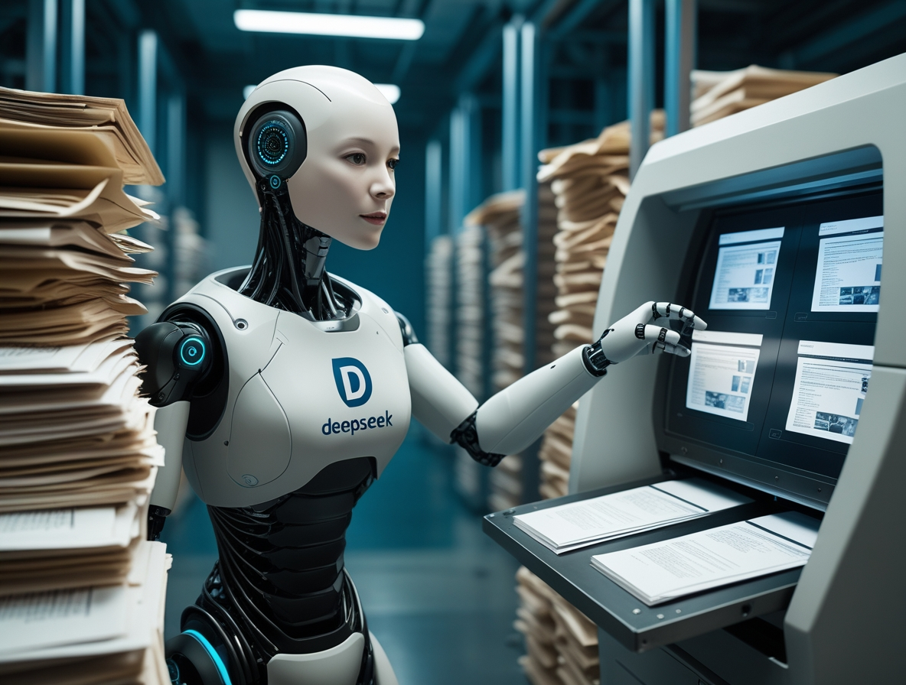

# DeepSeek OCR: Wenn ein Bild 10.000 Token wert ist

*Normalerweise vermeiden wir es, jeder Ankündigung der großen Tech-Unternehmen hinterherzujagen, es sei denn, es handelt sich um echte Innovation. Und dieses Mal scheint genau das der Fall zu sein. [DeepSeek-OCR](https://github.com/deepseek-ai/DeepSeek-OCR), das am 20. Oktober 2025 veröffentlicht wurde, hat in wenigen Tagen über 7.000 Sterne auf GitHub erreicht und die Aufmerksamkeit von Andrej Karpathy, dem ehemaligen KI-Direktor von Tesla und einer legendären Figur im Bereich des Deep Learning, auf sich gezogen. Es ist keine Kleinigkeit, wenn einer der brillantesten Köpfe der Computer Vision [ein Modell als "quite interesting"](https://x.com/karpathy/status/1980397031542989305) bezeichnet und anfängt, über die Zukunft der Tokenizer zu philosophieren. Aber was ist das Besondere an diesem 3-Milliarden-Parameter-Modell, das eine solche Begeisterung ausgelöst hat?*

## Die Architektur der Umkehrung

DeepSeek-OCR stellt ein scheinbar etabliertes Paradigma auf den Kopf: Anstatt Bilder in Text umzuwandeln und diesen dann zu tokenisieren, wandelt es den Text in ein Bild um und komprimiert es optisch. Es ist, als hätte jemand den Rosetta-Stein rückwärts betrachtet und erkannt, dass die Hieroglyphe effizienter ist als das Alphabet. Die Idee ist ebenso einfach wie kontraintuitiv und erinnert an die Szene aus *Tenet*, in der die Kugeln in der Zeit zurückreisen: Hier werden aus Token wieder Pixel.

Die Architektur gliedert sich in zwei Hauptkomponenten. Der DeepEncoder nimmt ein hochauflösendes Dokument, verarbeitet es durch einen visuellen Encoder, der auf [SAM](https://segment-anything.com/) und CLIP basiert, und komprimiert es dann mit einem Faltungsmodul, das die Anzahl der benötigten Token drastisch reduziert. Der Decoder ist ein 3-Milliarden-Parameter-Modell vom Typ Mixture-of-Experts, das diese komprimierten "Vision Tokens" interpretiert und eine strukturierte Ausgabe erzeugt.

Die Zahlen erzählen eine interessante Geschichte: Bei einer 10-fachen Komprimierung behält das System eine Genauigkeit von 97 %. Erhöht man das Verhältnis auf das 20-fache, sinkt die Genauigkeit auf 60 %, was für viele Anwendungsfälle aber immer noch mehr als akzeptabel ist. Das bedeutet, dass ein Artikel mit tausend Wörtern, der etwa tausend Token im Textformat benötigen würde, mit nur 100 Vision Tokens dargestellt werden kann, wobei die Information fast vollständig erhalten bleibt. [DeepSeek behauptet](https://deepseek.ai/blog/deepseek-ocr-context-compression), dass eine einzige NVIDIA A100 GPU mit diesem System 200.000 Seiten pro Tag verarbeiten kann, ein Durchsatz, der traditionelle OCR-Pipelines in den Schatten stellt.

## Benchmarks und Vergleiche: Wo es glänzt (und wo nicht)

Der Vergleich mit der Konkurrenz offenbart Licht und Schatten. Auf [OmniDocBench](https://www.marktechpost.com/2025/10/20/deepseek-just-released-a-3b-ocr-model-a-3b-vlm-designed-for-high-performance-ocr-and-structured-document-conversion/), dem Benchmark, der die Extraktionsfähigkeiten bei komplexen Dokumenten testet, schneidet DeepSeek-OCR gut ab, dominiert aber nicht. GOT-OCR 2.0, entwickelt von der Universität Peking, bleibt in Bezug auf die reine Genauigkeit überlegen, insbesondere bei Dokumenten mit komplexen Layouts oder mathematischen Formeln. MinerU 2.0, ein weiterer chinesischer Konkurrent, zeigt eine ähnliche Leistung, aber mit einer traditionelleren Architektur.

Im Vergleich zu allgemeinen multimodalen Vision-Language-Modellen wird die Situation interessanter. MiniCPM-V 2.6, InternVL 2.5 und das kürzlich erschienene Mistral OCR sind allesamt größere Modelle mit Parametern zwischen 7 und 20 Milliarden. DeepSeek-OCR spielt mit seinen 3 Milliarden in einer anderen Liga. Wie [Karpathy selbst anmerkt](https://x.com/karpathy/status/1980397031542989305), ist das Modell "vielleicht ein bisschen schlechter als die Punkte" (womit er sich wahrscheinlich auf Gemini oder andere geschlossene Systeme bezieht), aber das Eingeständnis ist ehrlich und symptomatisch: Es geht nicht um absolute Überlegenheit, sondern um relative Effizienz.

IBM Docling, eine weitere Open-Source-Lösung für die Dokumentenanalyse, verfolgt einen hybriden Ansatz mit modularen Pipelines und erzielt hervorragende Ergebnisse bei technischen und wissenschaftlichen Dokumenten, benötigt aber mehr Rechenressourcen. Microsoft Florence-2 zeigt als allgemeineres Vision-Modell zwar ordentliche OCR-Fähigkeiten, hat aber Schwierigkeiten in Situationen, in denen die Struktur des Dokuments erhalten bleiben muss.

Die wahre Stärke von DeepSeek-OCR zeigt sich in spezifischen Anwendungsfällen: lange Dokumente, Stapelverarbeitung, Anwendungen, bei denen Geschwindigkeit entscheidend ist und ein geringer Genauigkeitsverlust tolerierbar ist. Es ist das technologische Äquivalent zur Wahl einer spiegellosen Kamera gegenüber einer Mittelformatkamera: weniger perfekt, aber vielseitiger und praktischer.

[Bild aus dem GitHub-Profil von DeepSeek OCR](https://github.com/deepseek-ai/DeepSeek-OCR)

## Von der Theorie zur Praxis: Wo es wirklich gebraucht wird

Aber wann ist es sinnvoll, DeepSeek-OCR in einem realen Projekt zu implementieren? Die Antwort hängt vom spezifischen Kontext ab. Die vielversprechendsten Anwendungen betreffen Szenarien, in denen Volumen und Geschwindigkeit wichtiger sind als absolute Perfektion. Denken Sie an die Digitalisierung historischer Papierarchive, bei denen Millionen von Seiten in ein durchsuchbares Format umgewandelt werden müssen: Hier macht die Fähigkeit, 200.000 Seiten pro Tag auf einer einzigen GPU zu verarbeiten, den Unterschied zwischen einem machbaren und einem wirtschaftlich untragbaren Projekt aus.

In der Unternehmenswelt stellt die automatische Datenextraktion aus Rechnungen, Quittungen oder Buchhaltungsunterlagen ein weiteres fruchtbares Gebiet dar. Unternehmen wie [Dataconomy heben hervor](https://dataconomy.com/2025/10/21/deepseek-ocr-new-open-source-ai-model-goes-viral-on-github/), wie Anwaltskanzleien und Compliance-Abteilungen von der massenhaften Analyse von Verträgen profitieren könnten, bei der die Beibehaltung der visuellen Struktur des Dokuments ebenso entscheidend ist wie die Extraktion des Textes. Ein Anwalt, der eine bestimmte Klausel in zehntausend Geheimhaltungsvereinbarungen sucht, benötigt keine 99,9%ige Genauigkeit, sondern muss die relevanten Dokumente schnell finden.

Es gibt jedoch einen Schatten, der über diesen Szenarien schwebt: die mangelnde Transparenz bei den Trainingsdaten. DeepSeek hat keine Details über das zum Trainieren des Modells verwendete Dataset veröffentlicht, und das ist ein nicht unerhebliches Problem. Ein OCR, das hauptsächlich auf chinesischen Finanzdokumenten trainiert wurde, könnte europäische Rechnungen falsch interpretieren, genauso wie eines, das überwiegend gedruckten Texten ausgesetzt war, mit Handschrift zu kämpfen haben könnte. Die Undurchsichtigkeit der Daten macht es schwierig, a priori zu beurteilen, ob das Modell für den eigenen spezifischen Anwendungsfall geeignet ist, und zwingt zu empirischen Tests, die sich nicht jeder leisten kann.

## Die Open-Source-Philosophie in Zeiten des Chip-Krieges

Die Entscheidung, DeepSeek-OCR vollständig als Open Source zu veröffentlichen, mit Modellgewichten, die von [Hugging Face](https://huggingface.co/spaces/khang119966/DeepSeek-OCR-DEMO) heruntergeladen werden können, und Code auf GitHub, steht in krassem Widerspruch zum Schicksal des R2-Modells von DeepSeek, das sich immer noch in der Schwebe befindet. [Der geopolitische Kontext erklärt alles](https://www.techradar.com/pro/chaos-at-deepseek-as-r2-launch-crashes-into-hardware-problems-rivals-gain-huge-advantage): Nach dem viralen Erfolg von DeepSeek-R1 Anfang 2025 drängten die chinesischen Behörden das Unternehmen, für das Training von R2 von NVIDIA-GPUs auf Ascend-Chips von Huawei umzusteigen.

Das Ergebnis war eine technische Katastrophe. [Laut der Financial Times](https://www.tomshardware.com/tech-industry/artificial-intelligence/deepseek-reportedly-urged-by-chinese-authorities-to-train-new-model-on-huawei-hardware-after-multiple-failures-r2-training-to-switch-back-to-nvidia-hardware-while-ascend-gpus-handle-inference) gelang es DeepSeek nicht, einen einzigen Trainingslauf auf den Huawei-Chips erfolgreich abzuschließen, obwohl ein Team von Ingenieuren vor Ort geschickt wurde. Die Trump-Administration hatte im April 2025 den Export von NVIDIAs H20 nach China verboten, und DeepSeek befand sich zwischen amerikanischen Sanktionen und dem Druck der chinesischen Regierung. CEO Liang Wenfeng, [unzufrieden mit der Leistung von R2](https://www.bgr.com/tech/what-happened-to-deepseeks-revolutionary-r2-ai/), musste wählen: technologischer Patriotismus oder konkrete Ergebnisse.

In diesem Szenario wird die Veröffentlichung von DeepSeek-OCR als Open Source zu einem mehrdimensionalen strategischen Schritt. Erstens umgeht es Hardwarebeschränkungen: Ein 3-Milliarden-Modell kann auf Consumer-Hardware laufen, was die Abhängigkeit von Rechenzentren voller unerreichbarer GPUs verringert. Zweitens baut es Soft Power auf: Während R2 auf den Servern von DeepSeek verkümmert, erobert OCR Entwickler auf der ganzen Welt. Drittens umgeht es Beschränkungen: Ein Open-Source-Modell kann nicht effektiv "verboten" werden, es kann nur von der Community repliziert und verbessert werden.

Es ist dieselbe Strategie, die Meta mit Llama angewendet hat: Wenn du auf der geschlossenen kommerziellen Ebene nicht gewinnen kannst, öffne alles und lass das Ökosystem die Arbeit machen. [Wie Dataconomy berichtet](https://dataconomy.com/2025/10/21/deepseek-ocr-new-open-source-ai-model-goes-viral-on-github/), erreichte das Modell in weniger als 24 Stunden 4.000 Sterne auf GitHub, eine virale Annahme, die keine Marketingkampagne kaufen könnte.

[Bild aus dem GitHub-Profil von DeepSeek OCR](https://github.com/deepseek-ai/DeepSeek-OCR)

## Die Zukunft von OCR: Vision vs. Text

Die provokanteste Überlegung kommt von Karpathy selbst, der in seinem X-Thread [eine philosophische Frage aufwirft](https://x.com/karpathy/status/1980397031542989305): "Vielleicht würde es mehr Sinn machen, wenn alle LLM-Eingaben immer und nur Bilder wären." Das ist eine Aussage, die für diejenigen, die Jahre damit verbracht haben, Tokenizer und Texteinbettungen zu perfektionieren, ketzerisch klingt.

Karpathy listet vier Argumente auf: größere Informationskompression, ein allgemeinerer Datenstrom, der Formatierung und Farben enthält, die Fähigkeit, bidirektionale statt autoregressiver Aufmerksamkeit zu verwenden, und die Beseitigung des "hässlichen Tokenizers" mit all seinen Unicode-, Sicherheits- und Kodierungsproblemen. Sein Punkt ist einfach: Ein lächelndes Emoji sollte als lächelndes Gesicht dargestellt werden, mit Pixeln und allem, nicht als abstraktes Token, das jede visuelle Verbindung zu seiner ursprünglichen Bedeutung verloren hat.

Xie Saining, Assistenzprofessor an der New York University, [stimmt dieser Vision](https://dataconomy.com/2025/10/21/deepseek-ocr-new-open-source-ai-model-goes-viral-on-github/) einer Konvergenz von Computer Vision und Natural Language Processing zu. Aber die Begeisterung muss mit Realismus gedämpft werden. Text-Tokenizer gibt es aus gutem Grund seit Jahrzehnten: Sie sind effizient für reinen natürlichen Text. Als Bild gerenderter Text, selbst komprimiert, nimmt mehr Platz ein als ein guter BPE-Tokenizer für rein textuelle Inhalte.

Der wahre Anwendungsfall ist hybrid: Dokumente, bei denen Layout, Formatierung und visuelle Struktur ein integraler Bestandteil der Bedeutung sind. Juristische Verträge, bei denen die Einrückung zählt. Finanzberichte, in denen Tabellen und Grafiken neben dem Text existieren. Wissenschaftliche Artikel voller Gleichungen. In diesen Szenarien glänzt DeepSeek-OCR, weil es den visuellen Kontext beibehält, den ein Textparser zerstören würde.

Andererseits ist es für eine Chat-Konversation oder einen einfachen Text-Prompt eine Verschwendung, alles in ein Bild umzuwandeln. Es ist, als würde man ein Oszilloskop zur Temperaturmessung verwenden: technisch möglich, aber absurd. [Simon Willison](https://simonwillison.net/2025/Oct/20/deepseek-ocr-claude-code/) stellt fest, dass DeepSeek-OCR am besten funktioniert, wenn es mit anderen Tools kombiniert wird, nicht als universeller Ersatz.

Die Debatte erinnert an die zwischen Vinyl und Digital in der Musik: Textpuristen argumentieren, dass die symbolische Darstellung sauberer ist, während Pixel-Visionäre sagen, dass nur das Bild die Gesamtheit der Informationen erfasst. Die Wahrheit liegt wie immer in der Mitte: native Multi-Modalität, bei der Modelle dynamisch die beste Darstellung für jede Art von Eingabe wählen können.

## Fazit: Innovation oder eleganter Trick?

DeepSeek-OCR ist beides. Es ist eine echte Innovation im Ansatz zur kontextuellen Kompression, mit einer Architektur, die etablierte Annahmen darüber, wie textuelle Informationen dargestellt werden, in Frage stellt. Aber es ist auch ein brillanter Trick, um konkrete Einschränkungen zu umgehen: wenige GPUs, politischer Druck, die Notwendigkeit extremer Effizienz.

[Das Modell auf Hugging Face](https://huggingface.co/spaces/khang119966/DeepSeek-OCR-DEMO) läuft mit 2.500 Token pro Sekunde auf einer A100-40G, eine beeindruckende Leistung angesichts der Komplexität der Aufgabe. Entwickler können es leicht in ihre Pipelines integrieren, und die Open-Source-Lizenz erlaubt Änderungen und Anpassungen. Für diejenigen, die mit großen Dokumentenmengen arbeiten, könnte es die Lösung sein, nach der sie gesucht haben.

Die kritischen Aspekte sollten jedoch nicht ignoriert werden. Die Genauigkeit ist nicht besser als der Stand der Technik, wie Karpathy selbst zugibt. Die Qualität der Trainingsdaten, die für jedes OCR-System entscheidend ist, bleibt in der offiziellen Dokumentation undurchsichtig. Und das Modell ist für chinesische und englische Dokumente optimiert, mit begrenzter Unterstützung für andere Sprachen.

Der virale Erfolg auf GitHub und die Begeisterung der Community deuten darauf hin, dass DeepSeek einen Nerv getroffen hat: den Wunsch nach effizienten, offenen und pragmatischen Werkzeugen in einer Ära immer größerer und teurerer Modelle. Während die Tech-Giganten darum konkurrieren, wer das größte Rechenzentrum hat, zeigt DeepSeek, dass man immer noch in den Nischen innovieren kann, indem man Effizienz dort findet, wo andere nur die Notwendigkeit von mehr roher Gewalt sehen.

Wie in der Schlussszene von *Ghost in the Shell*, in der Motoko Kusanagi mit dem Puppet Master verschmilzt, ist die Zukunft der KI vielleicht kein totaler Sieg des Textes oder der Vision, sondern eine hybride Synthese, in der beide koexistieren und sich ergänzen. DeepSeek-OCR ist ein Schritt in diese Richtung, unvollkommen, aber faszinierend, pragmatisch, aber visionär. Und vor allem ist es Open Source: Das bedeutet, dass in sechs Monaten wahrscheinlich irgendein genialer Teenager die Probleme gelöst haben wird, die heute einschränkend erscheinen. Das ist letztendlich die wahre Kraft von Open Source: nicht Perfektion, sondern unendliche Iteration.