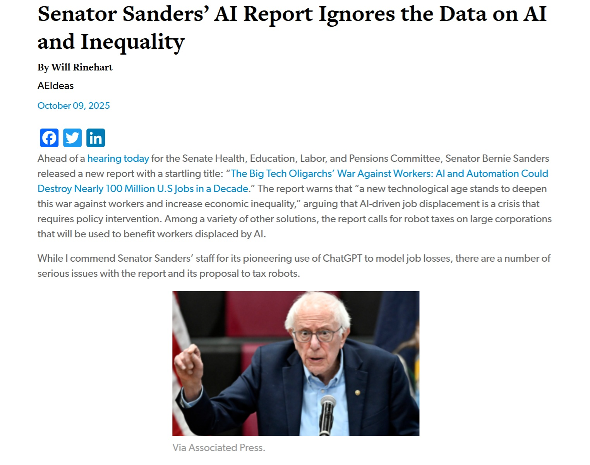

# Robot Tax: La Crociata di Sanders Tra Etica e Pragmatismo. Tassare l'innovazione?

*Quando il [Senate HELP Committee ha pubblicato il suo report](https://www.help.senate.gov/dem/newsroom/press/news-sanders-releases-report-on-big-tech-oligarchs-war-against-workers-warns-ai-could-eliminate-nearly-100-million-us-jobs) il 6 ottobre 2025, la cifra ha fatto girare la testa: cento milioni di posti di lavoro americani potrebbero svanire nel prossimo decennio, cancellati dall'intelligenza artificiale e dall'automazione. Il paradosso è deliziosamente meta: per arrivare a questa previsione apocalittica, gli staffer democratici hanno chiesto aiuto proprio a ChatGPT, consultando l'oracolo digitale per prevedere la propria obsolescenza professionale. Come chiedere a Terminator consigli sulla sicurezza domestica.*

I numeri emersi dallo studio disegnano uno scenario da distopia cyberpunk: l'89% dei lavoratori nel fast food destinati alla disoccupazione, l'83% degli addetti al customer service sostituibili, il 64% dei contabili ridondanti, perfino il 54% degli sviluppatori software che potrebbero essere rimpiazzati dalle stesse tecnologie che contribuiscono a creare. È come se gli ingegneri della Death Star avessero progettato il proprio punto debole senza rendersene conto, solo che stavolta non c'è Luke Skywalker all'orizzonte, ma Bernie Sanders con una proposta legislativa al posto della spada laser.

Il senatore del Vermont, [Ranking Member del Committee](https://www.sanders.senate.gov/), non ha usato mezzi termini: "La stessa manciata di oligarchi che hanno truccato la nostra economia per decenni — Elon Musk, Larry Ellison, Mark Zuckerberg, Jeff Bezos e altri — stanno ora correndo il più velocemente possibile per sostituire i lavoratori umani con quella che chiamano 'artificial labor'". Il linguaggio è quello della battaglia di classe, aggiornato all'era digitale, dove i baroni rapinatori non costruiscono ferrovie ma addestrano modelli linguistici.

## Bernie Sanders: Il Crociato dell'Era Digitale

Per capire la proposta di Sanders sulla robot tax bisogna comprendere chi è l'uomo dietro le lenti spesse e i capelli perennemente arruffati. Bernie Sanders non è l'ultimo arrivato nella battaglia contro i giganti corporativi. Il suo socialismo democratico — che in America suona quasi come un ossimoro — ha radici che affondano negli anni Sessanta, quando manifestava per i diritti civili e contro la guerra del Vietnam. La sua coerenza ideologica è proverbiale, al punto che i suoi oppositori lo considerano testardo e i suoi sostenitori lo vedono come incorruttibile.

Negli anni Novanta si oppose ferocemente al NAFTA e agli accordi di libero scambio, prevedendo correttamente che avrebbero svuotato il Midwest industriale americano. Ha combattuto contro [Amazon](https://fortune.com/2023/02/21/bernie-sanders-bill-gates-robot-tax-automation-job-threat/) fino a costringere il colosso di Bezos ad alzare il salario minimo a 15 dollari l'ora. Ha preso di mira Walmart per le condizioni dei lavoratori. Ha denunciato le compagnie farmaceutiche per i prezzi gonfiati dei medicinali. Insomma, se esistesse un Frequent Fighter Program per politici che sfidano le mega-corporation, Sanders avrebbe accumulato abbastanza miglia da andare e tornare da Alpha Centauri.

La sua posizione sull'intelligenza artificiale è perfettamente coerente con questa narrativa: la tecnologia non è neutrale, ma riflette le scelte di chi la controlla. E se chi la controlla sono i miliardari della Silicon Valley, allora i benefici fluiranno inevitabilmente verso l'alto, mentre i costi sociali si distribuiranno verso il basso. È la teoria del trickle-down economics rovesciata: invece di ricchezza che sgocciola dall'alto, abbiamo disoccupazione che piove a cascata sui ceti medi e bassi.

## La Proposta: Tassare il Futuro

Ma cosa propone esattamente Sanders? La robot tax è il pezzo centrale di un pacchetto legislativo più ampio che sta preparando, anche se [secondo il Washington Examiner](https://www.washingtonexaminer.com/policy/finance-and-economy/3844942/sanders-plans-robot-tax-legislation/) i dettagli tecnici devono ancora essere definiti. L'idea di base è semplice nella sua radicalità: le aziende che sostituiscono lavoratori umani con sistemi di intelligenza artificiale o robot dovrebbero pagare una tassa specifica. I fondi raccolti andrebbero a finanziare programmi di riqualificazione professionale, sussidi per i lavoratori disoccupati, e investimenti in educazione.

Il meccanismo esatto rimane da definire — e qui iniziano i problemi tecnici che analizzeremo più avanti — ma l'intento è chiaro: far pagare alle aziende i costi sociali dell'automazione. Attualmente, quando Amazon installa robot nei suoi magazzini e licenzia migliaia di lavoratori, i profitti restano ad Amazon mentre i costi sociali (sussidi di disoccupazione, assistenza sanitaria, degradazione delle comunità) ricadono sulla collettività. La robot tax vuole internalizzare queste esternalità negative, per usare il gergo economico.

Il pacchetto più ampio include proposte che suonano quasi utopiche nel contesto americano: una settimana lavorativa di 32 ore senza perdita di salario, l'obbligo per le grandi corporation di distribuire almeno il 20% delle loro azioni ai dipendenti, la partecipazione dei lavoratori nei consigli di amministrazione al 45% come avviene in Germania, e il divieto per le aziende di riacquistare le proprie azioni — una pratica che gonfia artificialmente i prezzi delle azioni e arricchisce gli azionisti senza creare valore reale.

Sanders ha scritto: "Abbiamo bisogno di un mondo dove le persone vivono vite più sane, più felici e più appaganti — non uno dove le macchine fanno tutti i soldi". È una visione che risuona con milioni di americani che vedono il proprio tenore di vita erodersi nonostante la produttività continui a crescere, un paradosso che definisce l'economia americana da almeno quarant'anni.

[Immagine tratta da FoxNews](https://www.foxnews.com/tech/ai-newsletter-dems-demand-robot-tax)

## Bill Gates e i Magnati Divisi

Se c'è un aspetto sorprendente in questa storia, è che Sanders non è completamente solo tra i miliardari. Nel 2017, [Bill Gates propose pubblicamente](https://fortune.com/2023/02/21/bernie-sanders-bill-gates-robot-tax-automation-job-threat/) proprio una robot tax, sostenendo che i governi dovrebbero rallentare l'adozione dell'automazione nelle aree dove sostituisce direttamente i lavoratori umani. "Se un lavoratore umano guadagna 50.000 dollari lavorando in una fabbrica, quel reddito viene tassato", argomentò Gates. "Se un robot fa lo stesso lavoro, dovremmo tassare il robot a un livello simile".

La posizione di Gates è particolarmente interessante perché viene dall'interno dell'ecosistema tecnologico. Non è un luddista che vuole distruggere i telai meccanici, ma uno dei padri della rivoluzione informatica che suggerisce di pompare i freni. La sua proposta non mirava a fermare il progresso tecnologico ma a rallentarlo abbastanza da permettere alla società di adattarsi, usando i fondi raccolti per riqualificare i lavoratori e finanziare settori dove l'intervento umano resta insostituibile, come l'assistenza agli anziani e l'educazione.

Anche Mark Cuban, l'imprenditore miliardario e personalità televisiva, ha espresso aperture verso forme di tassazione che redistribuiscano i benefici dell'automazione. Elizabeth Warren, senatrice democratica del Massachusetts, ha sostenuto posizioni simili a quelle di Sanders, inserendo la questione nel più ampio dibattito sulla tassazione delle grandi corporation tecnologiche.

Dall'altra parte dello spettro, Elon Musk ha una visione radicalmente diversa. Ha profetizzato che entro il 2040 ci saranno più robot umanoidi che esseri umani, e che "probabilmente nessuno di noi avrà un lavoro". La sua soluzione? Un reddito universale di base, perché il lavoro diventerà optional, "come un hobby". È una visione che oscilla tra l'utopia post-scarsità di Star Trek e la distopia corporativa di Ready Player One, dove tutti vivono di sussidi governativi mentre si immergono in realtà virtuali per sfuggire alla miseria del mondo reale.

Jeff Bezos, che ha più da perdere di chiunque altro considerando quanto Amazon abbia investito nell'automazione dei magazzini e nella logistica robotizzata, ha mantenuto un silenzio strategico sull'argomento. Il suo impero è costruito sull'efficienza algortimica e sulla sostituzione sistematica del lavoro umano con sistemi automatizzati, quindi qualsiasi presa di posizione pubblica sarebbe politicamente costosa.

## Il Fronte Repubblicano: Tra Innovazione e Populismo

Se vi aspettavate un fronte repubblicano compatto contro la robot tax, preparatevi a una sorpresa. Il partito è attraversato da una spaccatura interessante tra libertari tradizionali e populisti conservatori di nuova generazione, e la questione dell'intelligenza artificiale sta acuendo questa divisione.

Il senatore Lindsey Graham ha liquidato la proposta come "[morta all'arrivo](https://www.foxnews.com/tech/ai-newsletter-dems-demand-robot-tax)", utilizzando la classica retorica repubblicana secondo cui qualsiasi regolamentazione soffoca l'innovazione e danneggia la competitività americana. Ron Johnson ha evocato lo spettro della produttività storica: ogni rivoluzione tecnologica ha creato più posti di lavoro di quanti ne abbia distrutti, quindi perché questa dovrebbe essere diversa?

È l'argomento più forte contro la robot tax, supportato da dati storici impressionanti. Durante la rivoluzione industriale, nonostante l'automazione agricola, la disoccupazione non esplose ma si trasformò, con milioni di lavoratori che passarono dalle fattorie alle fabbriche. La computerizzazione degli anni Ottanta e Novanta non ha prodotto disoccupazione di massa ma ha creato intere nuove industrie. Persino nell'industria automobilistica americana, [secondo i dati citati dal think tank conservatore AEI](https://www.aei.org/technology-and-innovation/senator-sanders-ai-report-ignores-the-data-on-ai-and-inequality/), tra il 2010 e il 2022 sono stati installati circa 60.000 robot industriali ma sono stati creati 230.000 nuovi posti di lavoro umani.

Ma c'è una crepa in questo fronte. Il senatore Josh Hawley del Missouri rappresenta una nuova generazione di conservatori populisti che hanno serie preoccupazioni sull'impatto dell'AI sui lavoratori. In un [discorso alla National Conservatism Conference](https://www.dailysignal.com/2025/09/04/hawley-ai-threatens-the-working-man/) di settembre 2025, Hawley ha dipinto un quadro fosco: "L'agricoltore, l'operaio della catena di montaggio, il lavoratore edile con elmetto e martello: tutti questi uomini vivono del loro corpo, del loro lavoro. Non c'è posto per loro nell'utopia transumanista, dove tutto è silicio".

Hawley ha introdotto diverse proposte legislative sull'AI, inclusa la AI LEAD Act che richiederebbe alle aziende che usano l'automazione di investire nella riqualificazione dei lavoratori. Ha anche co-sponsorizzato con il democratico Richard Durbin [una legge che renderebbe le compagnie AI responsabili](https://rollcall.com/2025/10/09/ai-rush-prompts-raft-of-guardrail-proposals/) secondo le leggi sulla sicurezza dei prodotti. In un'intervista ad [Axios a luglio](https://www.axios.com/2025/07/23/josh-hawley-ai-congress), ha dichiarato: "Se il Partito Repubblicano vuole essere il partito delle persone che lavorano, dovremmo iniziare a pensare a come l'AI influenzerà la gente comune".

Questa spaccatura è significativa perché riflette una tensione più profonda nel conservatorismo americano contemporaneo tra l'ideologia pro-business tradizionale e un nuovo nazionalismo economico che mette al centro i lavoratori americani. Hawley ha persino sostenuto l'aumento del salario minimo federale a 15 dollari, una posizione che fino a pochi anni fa sarebbe stata anatema per qualsiasi repubblicano.

[Immagine tratta da American Enterprise Institute](https://www.aei.org/technology-and-innovation/senator-sanders-ai-report-ignores-the-data-on-ai-and-inequality/)

## Gli Scenari: Tra Distopia e Opportunità

Ora entriamo nel cuore della questione: cosa succederebbe davvero se venisse implementata una robot tax? E cosa succederà se non viene implementata? Gli scenari possibili sono molteplici e le conseguenze tutt'altro che scontate.

Lo scenario distopico è quello dipinto da Sanders e sempre più condiviso anche da alcuni tecnologi pentiti: una polarizzazione sociale estrema dove una minuscola elite controlla i mezzi di produzione automatizzati e accumula ricchezze inimmaginabili, mentre masse crescenti di persone perdono non solo il reddito ma anche il senso di identità e scopo che deriva dal lavoro. Amazon ne è l'esempio emblematico: nel 2023 ha licenziato 27.000 dipendenti mentre registrava profitti per 59,2 miliardi di dollari. UnitedHealth ha tagliato personale mentre i suoi dirigenti intascavano compensi da decine di milioni. Foxconn, il gigante taiwanese dell'elettronica, ha annunciato piani per sostituire il 30% della sua forza lavoro con robot entro il 2025.

Il report di Sanders cita casi concreti di aziende che stanno apertamente dicendo agli investitori che l'AI permetterà loro di "tagliare i costi del personale". Salesforce pubblicizza piattaforme di "digital labor" con lo slogan "smettete di assumere umani". Startup di camion autonomi si vantano che la loro tecnologia elimina il "problema" dei salari più alti per gli autisti. È inquietante quanto sia esplicito il disprezzo per il capitale umano.

Lo scenario opposto, quello dipinto dai critici della robot tax, prevede una frenata dell'innovazione tecnologica americana proprio mentre la Cina e altri paesi accelerano. Se le aziende americane devono pagare tasse extra per automatizzare, sostengono, semplicemente sposteranno la produzione all'estero o verranno superate dai competitor internazionali che non hanno questi vincoli. Il risultato paradossale sarebbe una perdita netta di competitività senza proteggere davvero i lavoratori, perché i loro posti verrebbero comunque persi a favore di aziende straniere.

[Il think tank libertario Reason](https://reason.com/2025/10/02/josh-hawley-and-democrat-allies-target-ai-with-new-legal-and-regulatory-regime/) ha paragonato la proposta a "tassare il Modello T nei primi del Novecento". Avrebbe salvato i produttori di carrozze e i maniscalchi? Forse temporaneamente. Ma avrebbe anche rallentato una rivoluzione tecnologica che alla fine ha enormemente aumentato la prosperità complessiva e creato milioni di nuovi tipi di lavoro che nessuno nel 1910 avrebbe potuto immaginare.

C'è poi uno scenario intermedio, più sfumato. L'AI potrebbe non sostituire interamente i lavoratori ma trasformare radicalmente la natura del lavoro. Invece di 100 milioni di disoccupati, potremmo avere 100 milioni di lavoratori che fanno cose molto diverse da oggi, magari guadagnando di più perché l'AI ha eliminato le parti ripetitive e noiose del loro lavoro, permettendo loro di concentrarsi su aspetti più creativi e ad alto valore. È lo scenario ottimista alla "l'AI come copilota", dove la tecnologia amplifica le capacità umane invece di sostituirle.

Ma c'è un problema con questo scenario roseo: la velocità del cambiamento. Le precedenti rivoluzioni tecnologiche si sono svolte nell'arco di decenni o secoli, permettendo alle società di adattarsi gradualmente. La rivoluzione industriale ha richiesto più di un secolo. La rivoluzione agricola migliaia di anni. L'intelligenza artificiale sta comprimendo trasformazioni simili in meno di un decennio. Come nota il [report del HELP Committee](https://www.sanders.senate.gov/wp-content/uploads/10.6.2025-The-Big-Tech-Oligarchs-War-Against-Workers.pdf), questa velocità senza precedenti potrebbe non lasciare il tempo necessario per la riqualificazione e l'adattamento.

## Le Ombre della Proposta

Anche volendo implementare una robot tax, le sfide tecniche e pratiche sono formidabili. La prima e più ovvia: come si definisce un "robot" o un sistema AI tassabile? Un software che automatizza la contabilità conta? E un algoritmo che ottimizza le rotte di consegna? Se Amazon usa l'AI per prevedere la domanda e ridurre il personale di pianificazione, come si calcola quanti "robot" equivalenti ha impiegato?

Questa non è una preoccupazione teorica. Nel 2017, il Parlamento Europeo votò contro una proposta di robot tax proprio perché i tecnici non riuscivano a trovare una definizione operativa sensata di cosa tassare. Il rischio è creare una legislazione talmente vaga da essere inapplicabile o talmente specifica da essere facilmente aggirata con sotterfugi legali.

Poi c'è la questione della competitività internazionale. Se gli Stati Uniti implementano unilateralmente una robot tax, le aziende potrebbero semplicemente spostare le operazioni in paesi più accoglienti. Questo è particolarmente problematico per l'industria tecnologica, dove il software può essere sviluppato praticamente ovunque nel mondo. Amazon potrebbe tenere i magazzini robotizzati in America ma spostare tutto lo sviluppo software a Bangalore o Varsavia.

Gli economisti più ortodossi sollevano un'obiezione più fondamentale: tassare l'innovazione tecnologica è sempre una cattiva idea perché alla lunga riduce la produttività e impoverisce tutti. Se nel 1920 avessimo tassato i trattori per proteggere i lavoratori agricoli manuali, oggi avremmo cibo più costoso e una popolazione più povera. La soluzione giusta, sostengono, non è frenare il progresso ma redistribuire i suoi benefici attraverso sistemi fiscali progressivi sui profitti e sui redditi, non sulla tecnologia in sé.

C'è anche un elemento di giustizia distributiva che complica il quadro. L'[American Enterprise Institute ha criticato](https://www.aei.org/technology-and-innovation/senator-sanders-ai-report-ignores-the-data-on-ai-and-inequality/) il report di Sanders per aver ignorato dati che mostrano come l'AI stia in realtà riducendo alcune forme di disuguaglianza, permettendo a lavoratori meno qualificati di essere più produttivi. Un'assistente virtuale AI permette a una piccola impresa di competere con una grande corporation senza assumere staff costoso. Un traduttore automatico permette a un freelancer italiano di lavorare per clienti americani. Tassare questi strumenti potrebbe paradossalmente danneggiare proprio quei lavoratori che la tassa vorrebbe proteggere.

## L'Aspetto Umano

Dietro le statistiche e le proiezioni economiche ci sono persone reali con vite reali. Quando un autista di camion cinquantenne del Kansas perde il lavoro per un sistema di guida autonoma, non si tratta solo di una voce in un foglio Excel. È un uomo che magari ha fatto quel lavoro per trent'anni, che ha un mutuo da pagare e figli da mandare al college, che si identifica profondamente con il suo mestiere. "Sono un camionista" non è solo una descrizione lavorativa, è un'identità.

Il report di Sanders enfatizza questi aspetti umani, forse perché Sanders stesso ha sempre avuto un talento nel rendere concrete astrazioni economiche. Quando parla dei 3 milioni di lavoratori nel fast food che potrebbero perdere il lavoro — quell'89% citato nello studio — non sono numeri ma persone che lavorano turni massacranti per salari minimi, spesso senza assicurazione sanitaria, che vedono anche quella fragile sicurezza economica evaporare.

Gli sviluppatori software, quel 54% a rischio, presentano un caso particolarmente ironico e tragico. Sono le persone che hanno costruito l'industria tecnologica, che hanno scritto il codice che ora minaccia i loro stessi posti di lavoro. Molti hanno accumulato debiti studenteschi enormi per laurearsi in informatica, attratti da promesse di carriere lucrative e sicure. Scoprire che l'AI generativa può scrivere codice decente in una frazione del tempo che richiederebbe a un umano deve suonare come un tradimento cosmico.

C'è una profonda ingiustizia nel fatto che i benefici dell'automazione sono asimmetrici. Quando un'azienda automatizza e licenzia lavoratori, i profitti aggiuntivi vanno quasi interamente agli azionisti e ai top manager. Jeff Bezos diventa più ricco di 50 miliardi, mentre il magazziniere che ha perso il lavoro fatica a pagare l'affitto. Non è solo economicamente inefficiente — tutta quella domanda aggregata persa danneggia l'economia nel suo complesso — ma è moralmente inaccettabile per molti.

Eppure c'è anche l'altra faccia della medaglia. Molti lavori che l'AI potrebbe eliminare sono oggettivamente terribili. Nessuno sogna di passare otto ore al giorno davanti a una friggitrice per il salario minimo. Nessuno aspira a passare la vita in un magazzino Amazon a scannerizzare pacchi sotto la sorveglianza algoritmica che misura ogni secondo di pausa. Se l'automazione liberasse davvero le persone da questi lavori alienanti, permettendo loro di fare qualcosa di più significativo e ben pagato, sarebbe un guadagno netto per l'umanità.

Il problema è quel "se". Se c'è riqualificazione adeguata. Se ci sono nuovi lavori migliori disponibili. Se la società riesce ad adattarsi alla velocità del cambiamento. È un "se" molto grande, e finora la storia recente non è incoraggiante. I lavoratori manifatturieri del Midwest che hanno perso il lavoro con la globalizzazione non si sono magicamente trasformati in programmatori. Molti sono finiti in lavori di servizio a basso salario o sono usciti completamente dalla forza lavoro, alimentando crisi di oppioidi e disperazione economica che hanno rimodellato la politica americana.

## Verso Quale Futuro?

Arriviamo al cuore della questione: la proposta di Sanders è una visione lungimirante che potrebbe salvare la classe media americana, o è un'illusione protezionista destinata a fallire contro le forze inarrestabili del progresso tecnologico?

La verità è probabilmente nel mezzo, e molto più complicata di quanto qualsiasi slogan politico possa catturare. L'intelligenza artificiale e l'automazione avanzeranno, questo è inevitabile. La domanda non è "se" ma "come" e "a beneficio di chi". Sanders ha perfettamente ragione a sottolineare che senza intervento politico, il default è che i benefici fluiscano verso l'alto e i costi verso il basso. I mercati non risolvono spontaneamente questo problema.

Allo stesso tempo, una robot tax rigida e male implementata potrebbe essere controproducente. Le sfide definitorie sono reali, i rischi di fuga di capitali sono reali, il pericolo di soffocare l'innovazione è reale. Forse la risposta non è una tassa specifica sulla tecnologia ma un ripensamento più ampio del sistema fiscale, dove si tassano più aggressivamente i profitti e i patrimoni mentre si alleggerisce il peso sui salari.

Alternative alla robot tax includono il reddito universale di base, sostenuto da figure diverse come Andrew Yang e, inaspettatamente, lo stesso Elon Musk. L'idea è che in un'economia sempre più automatizzata, il legame tra lavoro e reddito debba essere spezzato. Ogni cittadino riceverebbe un pagamento mensile incondizionato che garantisce un livello minimo di sussistenza, finanziato dai profitti generati dall'economia automatizzata. È radicale ma ha una sua logica: se i robot fanno tutto il lavoro, perché dovremmo ancora misurare il valore umano attraverso l'occupazione?

Un'altra strada è investire massicciamente in educazione e riqualificazione, non i programmi simbolici attuali ma qualcosa di molto più ambizioso. Singapore ha implementato il programma SkillsFuture che garantisce crediti di formazione continua a tutti i cittadini per tutta la vita. La Danimarca ha un sistema di "flexicurity" che rende facile per le aziende licenziare ma fornisce generosi sussidi e riqualificazione ai lavoratori. Questi modelli potrebbero essere adattati all'America, anche se richiederebbero un investimento pubblico su scala che attualmente sembra politicamente impossibile.

C'è anche la possibilità di regolamentare direttamente come l'AI viene implementata nei luoghi di lavoro, invece di tassarla. Si potrebbero richiedere periodi di transizione obbligatori, pacchetti di riqualificazione finanziati dall'azienda, o rappresentanza dei lavoratori nelle decisioni sull'automazione. Questo è l'approccio preferito dai sindacati e ha il vantaggio di affrontare direttamente il problema del potere nella relazione lavorativa.

Il divario cruciale è tra la velocità dell'innovazione corporativa e la lentezza della risposta legislativa. Le aziende tecnologiche si muovono alla velocità di internet, le legislature alla velocità delle commissioni parlamentari. Quando Amazon implementa un nuovo sistema di automazione dei magazzini, lo fa globalmente in pochi mesi. Quando il Congresso discute una risposta legislativa, possono passare anni prima che qualcosa venga approvato, e altri anni prima che venga implementato. Nel frattempo, i fatti compiuti si accumulano.

Sanders ha almeno il merito di porre la questione con forza, costringendo un dibattito pubblico su un argomento che altrimenti resterebbe confinato alle sale riunioni della Silicon Valley e agli uffici dei CFO. La sua robot tax può essere imperfetta, può anche essere impraticabile nella forma attuale, ma serve come punto di Schelling per una conversazione necessaria: che tipo di futuro tecnologico vogliamo? E soprattutto, per chi?

## La Vostra Voce

E voi, cosa ne pensate? Siete dalla parte di Sanders, convinti che le aziende debbano pagare per i costi sociali dell'automazione? O credete che tassare l'innovazione sia sempre sbagliato e che la soluzione stia altrove — in un reddito universale, in massicci investimenti in educazione, o semplicemente nel lasciare che il mercato si aggiusti naturalmente come ha sempre fatto nelle precedenti rivoluzioni tecnologiche?

Avete mai sperimentato direttamente l'impatto dell'automazione o dell'AI nel vostro lavoro? Vi sentite minacciati dalla prospettiva di essere sostituiti da un algoritmo, o vedete l'AI come uno strumento che può rendervi più produttivi e liberarvi dalle parti più noiose del vostro mestiere?

E se domani doveste decidere voi la politica tecnologica del paese, quale equilibrio cerchereste tra progresso tecnologico e protezione dei lavoratori? Esiste un modo per avere entrambi, o dobbiamo necessariamente scegliere?

La questione non è accademica. Le decisioni che prendiamo oggi — o che rimandiamo — plasmeranno il mondo del lavoro per i prossimi decenni. Bernie Sanders ha lanciato un sasso nello stagno della Silicon Valley, e le onde si stanno espandendo. Ora tocca a tutti noi decidere come navigarle.