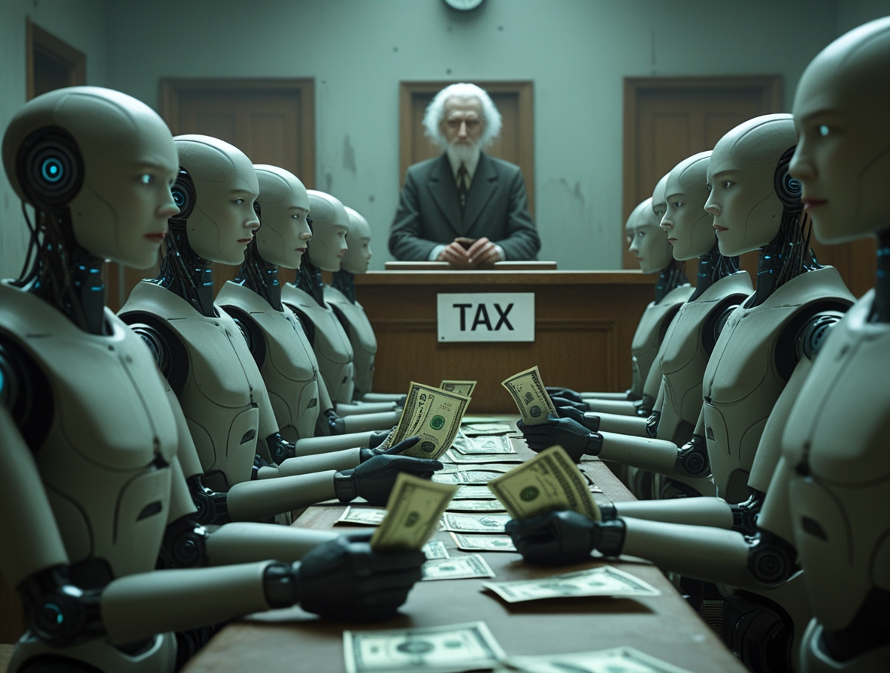
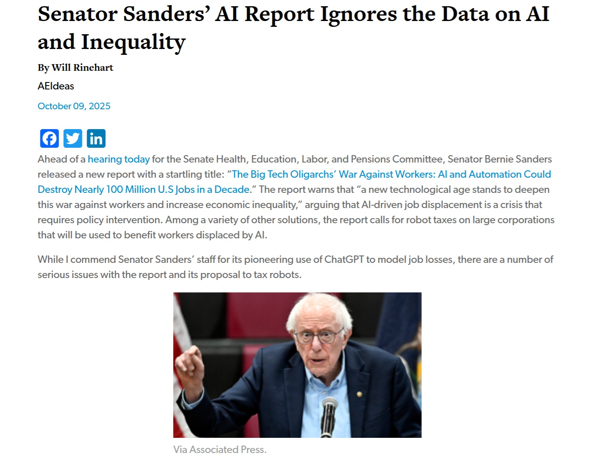

# Robotersteuer: Sanders' Kreuzzug zwischen Ethik und Pragmatismus. Innovation besteuern?

*Als der [Senatsausschuss HELP seinen Bericht veröffentlichte](https://www.help.senate.gov/dem/newsroom/press/news-sanders-releases-report-on-big-tech-oligarchs-war-against-workers-warns-ai-could-eliminate-nearly-100-million-us-jobs) am 6. Oktober 2025, war die Zahl schwindelerregend: Einhundert Millionen amerikanische Arbeitsplätze könnten im nächsten Jahrzehnt verschwinden, ausgelöscht durch künstliche Intelligenz und Automatisierung. Das Paradoxe daran ist köstlich meta: Um zu dieser apokalyptischen Vorhersage zu gelangen, baten demokratische Mitarbeiter ausgerechnet ChatGPT um Hilfe und konsultierten das digitale Orakel, um ihre eigene berufliche Obsoleszenz vorherzusagen. Das ist, als würde man den Terminator um Rat für die Haussicherheit bitten.*

Die Zahlen aus der Studie zeichnen ein Bild einer Cyberpunk-Dystopie: 89 % der Fast-Food-Arbeiter sind zur Arbeitslosigkeit verdammt, 83 % der Kundendienstmitarbeiter sind ersetzbar, 64 % der Buchhalter sind überflüssig, und sogar 54 % der Softwareentwickler könnten durch genau die Technologien ersetzt werden, die sie mitentwickeln. Es ist, als hätten die Ingenieure des Todessterns ihre eigene Schwachstelle entworfen, ohne es zu merken, nur dass diesmal kein Luke Skywalker am Horizont ist, sondern Bernie Sanders mit einem Gesetzesvorschlag anstelle eines Lichtschwerts.

Der Senator aus Vermont, [ranghöchstes Mitglied des Ausschusses](https://www.sanders.senate.gov/), nahm kein Blatt vor den Mund: "Dieselbe Handvoll Oligarchen, die unsere Wirtschaft seit Jahrzehnten manipuliert haben – Elon Musk, Larry Ellison, Mark Zuckerberg, Jeff Bezos und andere – rennen jetzt so schnell sie können, um menschliche Arbeiter durch das zu ersetzen, was sie 'künstliche Arbeit' nennen." Die Sprache ist die des Klassenkampfes, aktualisiert für das digitale Zeitalter, in dem die Raubritter keine Eisenbahnen bauen, sondern Sprachmodelle trainieren.

## Bernie Sanders: Der Kreuzritter des digitalen Zeitalters

Um Sanders' Vorschlag zur Robotersteuer zu verstehen, muss man den Mann hinter den dicken Brillengläsern und dem ewig zerzausten Haar verstehen. Bernie Sanders ist kein Neuling im Kampf gegen die Konzernriesen. Sein demokratischer Sozialismus – was in Amerika fast wie ein Oxymoron klingt – hat Wurzeln, die bis in die 1960er Jahre zurückreichen, als er für Bürgerrechte und gegen den Vietnamkrieg demonstrierte. Seine ideologische Konsequenz ist sprichwörtlich, so dass seine Gegner ihn für stur halten und seine Anhänger ihn für unbestechlich.

In den 1990er Jahren widersetzte er sich vehement dem NAFTA und den Freihandelsabkommen und sagte korrekt voraus, dass sie den amerikanischen industriellen Mittleren Westen aushöhlen würden. Er kämpfte gegen [Amazon](https://fortune.com/2023/02/21/bernie-sanders-bill-gates-robot-tax-automation-job-threat/), bis er den Bezos-Giganten zwang, den Mindestlohn auf 15 Dollar pro Stunde anzuheben. Er nahm Walmart wegen der Arbeitsbedingungen seiner Mitarbeiter ins Visier. Er prangerte Pharmaunternehmen wegen überhöhter Medikamentenpreise an. Kurz gesagt, wenn es ein Vielfliegerprogramm für Politiker gäbe, die sich mit Megakonzernen anlegen, hätte Sanders genug Meilen gesammelt, um nach Alpha Centauri und zurück zu fliegen.

Seine Haltung zur künstlichen Intelligenz steht in perfekter Übereinstimmung mit dieser Erzählung: Technologie ist nicht neutral, sondern spiegelt die Entscheidungen derer wider, die sie kontrollieren. Und wenn diejenigen, die sie kontrollieren, die Milliardäre des Silicon Valley sind, dann werden die Vorteile unweigerlich nach oben fließen, während die sozialen Kosten nach unten verteilt werden. Es ist die umgekehrte Trickle-Down-Ökonomie-Theorie: Anstatt dass Reichtum von oben herab sickert, haben wir Arbeitslosigkeit, die auf die Mittel- und Unterschicht herabregnet.

## Der Vorschlag: Die Zukunft besteuern

Aber was genau schlägt Sanders vor? Die Robotersteuer ist das Herzstück eines umfassenderen Gesetzespakets, das er vorbereitet, obwohl [laut dem Washington Examiner](https://www.washingtonexaminer.com/policy/finance-and-economy/3844942/sanders-plans-robot-tax-legislation) die technischen Details noch definiert werden müssen. Die Grundidee ist in ihrer Radikalität einfach: Unternehmen, die menschliche Arbeiter durch künstliche Intelligenzsysteme oder Roboter ersetzen, sollten eine spezifische Steuer zahlen. Die eingenommenen Mittel würden zur Finanzierung von Umschulungsprogrammen, Subventionen für arbeitslose Arbeitnehmer und Investitionen in die Bildung verwendet.

Der genaue Mechanismus muss noch definiert werden – und hier beginnen die technischen Probleme, die wir später analysieren werden – aber die Absicht ist klar: Unternehmen sollen die sozialen Kosten der Automatisierung tragen. Derzeit, wenn Amazon Roboter in seinen Lagern installiert und Tausende von Arbeitern entlässt, bleiben die Gewinne bei Amazon, während die sozialen Kosten (Arbeitslosengeld, Gesundheitsversorgung, Verfall der Gemeinschaften) auf die Gemeinschaft abgewälzt werden. Die Robotersteuer will diese negativen externen Effekte internalisieren, um den ökonomischen Jargon zu verwenden.

Das umfassendere Paket enthält Vorschläge, die im amerikanischen Kontext fast utopisch klingen: eine 32-Stunden-Woche ohne Lohneinbußen, die Verpflichtung für große Konzerne, mindestens 20 % ihrer Aktien an die Mitarbeiter zu verteilen, eine 45%ige Beteiligung der Arbeitnehmer in den Aufsichtsräten wie in Deutschland und ein Verbot für Unternehmen, ihre eigenen Aktien zurückzukaufen – eine Praxis, die die Aktienkurse künstlich aufbläht und die Aktionäre bereichert, ohne realen Wert zu schaffen.

Sanders schrieb: "Wir brauchen eine Welt, in der die Menschen ein gesünderes, glücklicheres und erfüllteres Leben führen – nicht eine, in der Maschinen das ganze Geld verdienen." Es ist eine Vision, die bei Millionen von Amerikanern Anklang findet, die sehen, wie ihr Lebensstandard trotz steigender Produktivität erodiert, ein Paradoxon, das die amerikanische Wirtschaft seit mindestens vierzig Jahren kennzeichnet.

[Bild von FoxNews](https://www.foxnews.com/tech/ai-newsletter-dems-demand-robot-tax)

## Bill Gates und die geteilten Magnaten

Wenn es einen überraschenden Aspekt in dieser Geschichte gibt, dann ist es, dass Sanders unter den Milliardären nicht ganz allein ist. Im Jahr 2017 [schlug Bill Gates öffentlich](https://fortune.com/2023/02/21/bernie-sanders-bill-gates-robot-tax-automation-job-threat/) eine Robotersteuer vor und argumentierte, dass Regierungen die Einführung von Automatisierung in Bereichen verlangsamen sollten, in denen sie menschliche Arbeitskräfte direkt ersetzt. "Wenn ein menschlicher Arbeiter 50.000 Dollar in einer Fabrik verdient, wird dieses Einkommen besteuert", argumentierte Gates. "Wenn ein Roboter die gleiche Arbeit macht, sollten wir den Roboter auf einem ähnlichen Niveau besteuern."

Gates' Position ist besonders interessant, weil sie aus dem Inneren des Tech-Ökosystems kommt. Er ist kein Luddit, der mechanische Webstühle zerstören will, sondern einer der Väter der Computerrevolution, der vorschlägt, auf die Bremse zu treten. Sein Vorschlag zielte nicht darauf ab, den technologischen Fortschritt zu stoppen, sondern ihn so weit zu verlangsamen, dass sich die Gesellschaft anpassen kann, indem die eingenommenen Mittel zur Umschulung von Arbeitnehmern und zur Finanzierung von Sektoren verwendet werden, in denen menschliches Eingreifen unersetzlich bleibt, wie z. B. Altenpflege und Bildung.

Mark Cuban, der milliardenschwere Unternehmer und Fernsehpersönlichkeit, hat sich ebenfalls offen für Formen der Besteuerung gezeigt, die die Vorteile der Automatisierung umverteilen. Elizabeth Warren, eine demokratische Senatorin aus Massachusetts, hat ähnliche Positionen wie Sanders unterstützt und das Thema in die breitere Debatte über die Besteuerung großer Technologiekonzerne eingebracht.

Auf der anderen Seite des Spektrums hat Elon Musk eine radikal andere Vision. Er hat prophezeit, dass es bis 2040 mehr humanoide Roboter als Menschen geben wird und dass "wahrscheinlich keiner von uns einen Job haben wird". Seine Lösung? Ein universelles Grundeinkommen, weil Arbeit optional wird, "wie ein Hobby". Es ist eine Vision, die zwischen der Post-Knappheits-Utopie von Star Trek und der Unternehmensdystopie von Ready Player One schwankt, wo alle von staatlichen Subventionen leben, während sie sich in virtuelle Realitäten stürzen, um dem Elend der realen Welt zu entkommen.

Jeff Bezos, der angesichts der massiven Investitionen von Amazon in die Lagerautomatisierung und Roboterlogistik mehr zu verlieren hat als jeder andere, hat zu diesem Thema ein strategisches Schweigen bewahrt. Sein Imperium basiert auf algorithmischer Effizienz und dem systematischen Ersatz menschlicher Arbeit durch automatisierte Systeme, daher wäre jede öffentliche Stellungnahme politisch kostspielig.

## Die republikanische Front: Zwischen Innovation und Populismus

Wenn Sie eine geschlossene republikanische Front gegen die Robotersteuer erwartet haben, machen Sie sich auf eine Überraschung gefasst. Die Partei ist von einer interessanten Spaltung zwischen traditionellen Libertären und konservativen Populisten der neuen Generation durchzogen, und die Frage der künstlichen Intelligenz verschärft diese Spaltung.

Senator Lindsey Graham wies den Vorschlag als "[von vornherein zum Scheitern verurteilt](https://www.foxnews.com/tech/ai-newsletter-dems-demand-robot-tax)" zurück und bediente sich der klassischen republikanischen Rhetorik, wonach jede Regulierung die Innovation erstickt und die amerikanische Wettbewerbsfähigkeit beeinträchtigt. Ron Johnson beschwor das Gespenst der historischen Produktivität herauf: Jede technologische Revolution hat mehr Arbeitsplätze geschaffen als vernichtet, warum sollte diese also anders sein?

Dies ist das stärkste Argument gegen die Robotersteuer, gestützt auf beeindruckende historische Daten. Während der industriellen Revolution explodierte die Arbeitslosigkeit trotz der Automatisierung in der Landwirtschaft nicht, sondern wandelte sich, wobei Millionen von Arbeitern von den Farmen in die Fabriken wechselten. Die Computerisierung der 1980er und 1990er Jahre führte nicht zu Massenarbeitslosigkeit, sondern schuf ganz neue Industrien. Selbst in der amerikanischen Autoindustrie wurden [laut Daten des konservativen Think Tanks AEI](https://www.aei.org/technology-and-innovation/senator-sanders-ai-report-ignores-the-data-on-ai-and-inequality/) zwischen 2010 und 2022 rund 60.000 Industrieroboter installiert, aber 230.000 neue menschliche Arbeitsplätze geschaffen.

Aber es gibt einen Riss in dieser Front. Senator Josh Hawley aus Missouri repräsentiert eine neue Generation konservativer Populisten, die ernsthafte Bedenken hinsichtlich der Auswirkungen von KI auf die Arbeitnehmer haben. In einer [Rede auf der National Conservatism Conference](https://www.dailysignal.com/2025/09/04/hawley-ai-threatens-the-working-man/) im September 2025 malte Hawley ein düsteres Bild: "Der Bauer, der Fließbandarbeiter, der Bauarbeiter mit Helm und Hammer: All diese Männer leben von ihrem Körper, von ihrer Arbeit. Für sie gibt es keinen Platz in der transhumanistischen Utopie, wo alles aus Silizium besteht."

Hawley hat mehrere Gesetzesvorschläge zur KI eingebracht, darunter den AI LEAD Act, der Unternehmen, die Automatisierung einsetzen, verpflichten würde, in die Umschulung von Arbeitnehmern zu investieren. Er hat auch zusammen mit dem Demokraten Richard Durbin [ein Gesetz mitgetragen, das KI-Unternehmen haftbar machen würde](https://rollcall.com/2025/10/09/ai-rush-prompts-raft-of-guardrail-proposals/) gemäß den Produktsicherheitsgesetzen. In einem Interview mit [Axios im Juli](https://www.axios.com/2025/07/23/josh-hawley-ai-congress) erklärte er: "Wenn die Republikanische Partei die Partei der arbeitenden Menschen sein will, sollten wir anfangen, darüber nachzudenken, wie sich die KI auf die einfachen Leute auswirken wird."

Diese Spaltung ist bedeutsam, weil sie eine tiefere Spannung im zeitgenössischen amerikanischen Konservatismus zwischen der traditionellen wirtschaftsfreundlichen Ideologie und einem neuen Wirtschaftsnationalismus widerspiegelt, der die amerikanischen Arbeitnehmer in den Mittelpunkt stellt. Hawley hat sogar die Anhebung des föderalen Mindestlohns auf 15 Dollar unterstützt, eine Position, die noch vor wenigen Jahren für jeden Republikaner ein Anathema gewesen wäre.

[Bild vom American Enterprise Institute](https://www.aei.org/technology-and-innovation/senator-sanders-ai-report-ignores-the-data-on-ai-and-inequality/)

## Die Szenarien: Zwischen Dystopie und Chance

Jetzt kommen wir zum Kern der Sache: Was würde wirklich passieren, wenn eine Robotersteuer eingeführt würde? Und was passiert, wenn sie nicht eingeführt wird? Die möglichen Szenarien sind vielfältig und die Konsequenzen alles andere als sicher.

Das dystopische Szenario ist das von Sanders gezeichnete und zunehmend auch von einigen reuigen Technologen geteilte: eine extreme soziale Polarisierung, in der eine winzige Elite die automatisierten Produktionsmittel kontrolliert und unvorstellbaren Reichtum anhäuft, während wachsende Massen von Menschen nicht nur ihr Einkommen, sondern auch das Gefühl von Identität und Sinn verlieren, das aus der Arbeit erwächst. Amazon ist das emblematische Beispiel: 2023 entließ das Unternehmen 27.000 Mitarbeiter und verzeichnete gleichzeitig einen Gewinn von 59,2 Milliarden Dollar. UnitedHealth kürzte Personal, während seine Führungskräfte Vergütungen in zweistelliger Millionenhöhe einstrichen. Foxconn, der taiwanesische Elektronikriese, hat Pläne angekündigt, bis 2025 30 % seiner Belegschaft durch Roboter zu ersetzen.

Sanders' Bericht zitiert konkrete Fälle von Unternehmen, die Investoren offen sagen, dass KI es ihnen ermöglichen wird, "Personalkosten zu senken". Salesforce wirbt für "digitale Arbeits"-Plattformen mit dem Slogan "hören Sie auf, Menschen einzustellen". Start-ups für autonome Lkw prahlen damit, dass ihre Technologie das "Problem" höherer Löhne für Fahrer beseitigt. Es ist beunruhigend, wie explizit die Verachtung für Humankapital ist.

Das gegenteilige Szenario, das von Kritikern der Robotersteuer gezeichnet wird, sieht eine Verlangsamung der amerikanischen technologischen Innovation vor, gerade als China und andere Länder beschleunigen. Wenn amerikanische Unternehmen zusätzliche Steuern für die Automatisierung zahlen müssen, argumentieren sie, werden sie einfach die Produktion ins Ausland verlagern oder von internationalen Wettbewerbern überholt werden, die diese Einschränkungen nicht haben. Das paradoxe Ergebnis wäre ein Nettoverlust an Wettbewerbsfähigkeit, ohne die Arbeitnehmer wirklich zu schützen, da ihre Arbeitsplätze ohnehin an ausländische Unternehmen verloren gehen würden.

[Der libertäre Think Tank Reason](https://reason.com/2025/10/02/josh-hawley-and-democrat-allies-target-ai-with-new-legal-and-regulatory-regime/) verglich den Vorschlag mit der "Besteuerung des Model T im frühen 20. Jahrhundert". Hätte das die Kutschenbauer und Hufschmiede gerettet? Vielleicht vorübergehend. Aber es hätte auch eine technologische Revolution verlangsamt, die letztendlich den allgemeinen Wohlstand enorm gesteigert und Millionen neuer Arbeitsplätze geschaffen hat, die sich 1910 niemand hätte vorstellen können.

Dann gibt es ein mittleres, nuancierteres Szenario. KI könnte die Arbeitnehmer nicht vollständig ersetzen, sondern die Natur der Arbeit radikal verändern. Statt 100 Millionen Arbeitsloser könnten wir 100 Millionen Arbeitnehmer haben, die ganz andere Dinge tun als heute, vielleicht mehr verdienen, weil die KI die repetitiven und langweiligen Teile ihrer Arbeit eliminiert hat, so dass sie sich auf kreativere und hochwertigere Aspekte konzentrieren können. Es ist das optimistische Szenario "KI als Co-Pilot", in dem die Technologie die menschlichen Fähigkeiten verstärkt, anstatt sie zu ersetzen.

Aber es gibt ein Problem mit diesem rosigen Szenario: die Geschwindigkeit des Wandels. Frühere technologische Revolutionen fanden über Jahrzehnte oder Jahrhunderte statt und ermöglichten es den Gesellschaften, sich allmählich anzupassen. Die industrielle Revolution dauerte mehr als ein Jahrhundert. Die landwirtschaftliche Revolution Tausende von Jahren. Die künstliche Intelligenz komprimiert ähnliche Transformationen in weniger als ein Jahrzehnt. Wie der [Bericht des HELP-Ausschusses feststellt](https://www.sanders.senate.gov/wp-content/uploads/10.6.2025-The-Big-Tech-Oligarchs-War-Against-Workers.pdf), lässt diese beispiellose Geschwindigkeit möglicherweise nicht genügend Zeit für Umschulung und Anpassung.

## Die Schattenseiten des Vorschlags

Selbst wenn man eine Robotersteuer einführen wollte, sind die technischen und praktischen Herausforderungen gewaltig. Die erste und offensichtlichste: Wie definiert man einen steuerpflichtigen "Roboter" oder ein KI-System? Zählt Software, die die Buchhaltung automatisiert? Was ist mit einem Algorithmus, der Lieferrouten optimiert? Wenn Amazon KI einsetzt, um die Nachfrage vorherzusagen und das Planungspersonal zu reduzieren, wie berechnet man, wie viele äquivalente "Roboter" es eingesetzt hat?

Dies ist keine theoretische Sorge. 2017 stimmte das Europäische Parlament gegen einen Vorschlag für eine Robotersteuer, gerade weil die Techniker keine vernünftige operationale Definition dessen finden konnten, was besteuert werden sollte. Das Risiko besteht darin, eine Gesetzgebung zu schaffen, die so vage ist, dass sie nicht durchsetzbar ist, oder so spezifisch, dass sie leicht durch rechtliche Winkelzüge umgangen werden kann.

Dann gibt es die Frage der internationalen Wettbewerbsfähigkeit. Wenn die Vereinigten Staaten einseitig eine Robotersteuer einführen, könnten Unternehmen ihre Betriebe einfach in gastfreundlichere Länder verlagern. Dies ist besonders problematisch für die Technologiebranche, in der Software praktisch überall auf der Welt entwickelt werden kann. Amazon könnte seine Roboterlager in Amerika behalten, aber die gesamte Softwareentwicklung nach Bangalore oder Warschau verlagern.

Orthodoxere Ökonomen erheben einen grundlegenderen Einwand: Die Besteuerung technologischer Innovationen ist immer eine schlechte Idee, weil sie langfristig die Produktivität senkt und alle ärmer macht. Hätten wir 1920 Traktoren besteuert, um die manuellen Landarbeiter zu schützen, hätten wir heute teurere Lebensmittel und eine ärmere Bevölkerung. Die richtige Lösung, so argumentieren sie, besteht nicht darin, den Fortschritt zu bremsen, sondern seine Vorteile durch progressive Steuersysteme auf Gewinne und Einkommen umzuverteilen, nicht auf die Technologie selbst.

Es gibt auch ein Element der Verteilungsgerechtigkeit, das das Bild verkompliziert. Das [American Enterprise Institute kritisierte](https://www.aei.org/technology-and-innovation/senator-sanders-ai-report-ignores-the-data-on-ai-and-inequality/) den Bericht von Sanders dafür, dass er Daten ignoriert, die zeigen, dass KI tatsächlich einige Formen der Ungleichheit verringert, indem sie weniger qualifizierten Arbeitnehmern ermöglicht, produktiver zu sein. Ein KI-virtueller Assistent ermöglicht es einem kleinen Unternehmen, mit einem großen Konzern zu konkurrieren, ohne teures Personal einzustellen. Ein automatischer Übersetzer ermöglicht es einem italienischen Freiberufler, für amerikanische Kunden zu arbeiten. Die Besteuerung dieser Werkzeuge könnte paradoxerweise genau die Arbeitnehmer schädigen, die die Steuer schützen soll.

## Der menschliche Aspekt

Hinter den Statistiken und wirtschaftlichen Projektionen stehen reale Menschen mit realen Leben. Wenn ein fünfzigjähriger Lastwagenfahrer aus Kansas seinen Job an ein autonomes Fahrsystem verliert, ist das nicht nur ein Eintrag in einer Tabelle. Es ist ein Mann, der diesen Job vielleicht dreißig Jahre lang gemacht hat, der eine Hypothek abzahlen und Kinder aufs College schicken muss, der sich tief mit seinem Beruf identifiziert. "Ich bin ein Lastwagenfahrer" ist nicht nur eine Berufsbezeichnung, es ist eine Identität.

Sanders' Bericht betont diese menschlichen Aspekte, vielleicht weil Sanders selbst immer ein Talent dafür hatte, wirtschaftliche Abstraktionen konkret zu machen. Wenn er von den 3 Millionen Fast-Food-Arbeitern spricht, die ihren Job verlieren könnten – diese 89 %, die in der Studie zitiert werden – sind das nicht Zahlen, sondern Menschen, die zermürbende Schichten für den Mindestlohn arbeiten, oft ohne Krankenversicherung, die sehen, wie selbst diese fragile wirtschaftliche Sicherheit verdunstet.

Softwareentwickler, diese 54 % im Risiko, stellen einen besonders ironischen und tragischen Fall dar. Sie sind die Menschen, die die Technologiebranche aufgebaut haben, die den Code geschrieben haben, der jetzt ihre eigenen Arbeitsplätze bedroht. Viele haben riesige Studentenschulden angehäuft, um einen Abschluss in Informatik zu machen, angezogen von Versprechungen auf lukrative und sichere Karrieren. Zu entdecken, dass generative KI anständigen Code in einem Bruchteil der Zeit schreiben kann, die ein Mensch benötigen würde, muss sich wie ein kosmischer Verrat anfühlen.

Es liegt eine tiefe Ungerechtigkeit darin, dass die Vorteile der Automatisierung asymmetrisch sind. Wenn ein Unternehmen automatisiert und Arbeiter entlässt, gehen die zusätzlichen Gewinne fast ausschließlich an die Aktionäre und Top-Manager. Jeff Bezos wird um 50 Milliarden reicher, während der Lagerarbeiter, der seinen Job verloren hat, Schwierigkeiten hat, die Miete zu bezahlen. Das ist nicht nur wirtschaftlich ineffizient – all diese verlorene Gesamtnachfrage schadet der Wirtschaft als Ganzes –, sondern für viele auch moralisch inakzeptabel.

Doch es gibt auch die andere Seite der Medaille. Viele Arbeitsplätze, die die KI eliminieren könnte, sind objektiv schrecklich. Niemand träumt davon, acht Stunden am Tag vor einer Fritteuse für den Mindestlohn zu verbringen. Niemand strebt danach, sein Leben in einem Amazon-Lager damit zu verbringen, Pakete unter algorithmischer Überwachung zu scannen, die jede Sekunde Pause misst. Wenn die Automatisierung die Menschen wirklich von diesen entfremdenden Arbeiten befreien würde und es ihnen ermöglichen würde, etwas Sinnvolleres und Besserbezahltes zu tun, wäre das ein Nettogewinn für die Menschheit.

Das Problem ist dieses "wenn". Wenn es eine angemessene Umschulung gibt. Wenn neue, bessere Arbeitsplätze zur Verfügung stehen. Wenn sich die Gesellschaft an die Geschwindigkeit des Wandels anpassen kann. Es ist ein sehr großes "Wenn", und bisher ist die jüngste Geschichte nicht ermutigend. Die Industriearbeiter im Mittleren Westen, die ihre Arbeitsplätze durch die Globalisierung verloren haben, haben sich nicht auf magische Weise in Programmierer verwandelt. Viele landeten in schlecht bezahlten Dienstleistungsberufen oder verließen die Erwerbsbevölkerung ganz, was Opioidkrisen und wirtschaftliche Verzweiflung schürte, die die amerikanische Politik neu geformt haben.

## In welche Zukunft?

Wir kommen zum Kern der Sache: Ist Sanders' Vorschlag eine weitsichtige Vision, die die amerikanische Mittelschicht retten könnte, oder ist es eine protektionistische Illusion, die dazu bestimmt ist, an den unaufhaltsamen Kräften des technologischen Fortschritts zu scheitern?

Die Wahrheit liegt wahrscheinlich irgendwo in der Mitte und ist viel komplizierter, als es jeder politische Slogan erfassen kann. Künstliche Intelligenz und Automatisierung werden voranschreiten, das ist unvermeidlich. Die Frage ist nicht "ob", sondern "wie" und "zu wessen Gunsten". Sanders hat absolut Recht, wenn er darauf hinweist, dass ohne politische Intervention der Standard darin besteht, dass die Vorteile nach oben und die Kosten nach unten fließen. Märkte lösen dieses Problem nicht spontan.

Gleichzeitig könnte eine starre und schlecht umgesetzte Robotersteuer kontraproduktiv sein. Die Definitionsherausforderungen sind real, die Risiken der Kapitalflucht sind real, die Gefahr, die Innovation zu ersticken, ist real. Vielleicht liegt die Antwort nicht in einer spezifischen Steuer auf Technologie, sondern in einer umfassenderen Überarbeitung des Steuersystems, bei dem Gewinne und Vermögen aggressiver besteuert werden, während die Belastung der Löhne verringert wird.

Alternativen zur Robotersteuer umfassen das bedingungslose Grundeinkommen, das von so unterschiedlichen Persönlichkeiten wie Andrew Yang und unerwarteterweise Elon Musk selbst unterstützt wird. Die Idee ist, dass in einer zunehmend automatisierten Wirtschaft die Verbindung zwischen Arbeit und Einkommen durchbrochen werden muss. Jeder Bürger würde eine bedingungslose monatliche Zahlung erhalten, die ein Mindestmaß an Existenzsicherung garantiert, finanziert aus den Gewinnen der automatisierten Wirtschaft. Es ist radikal, hat aber seine eigene Logik: Wenn Roboter die ganze Arbeit machen, warum sollten wir den menschlichen Wert noch durch Beschäftigung messen?

Ein anderer Weg besteht darin, massiv in Bildung und Umschulung zu investieren, nicht in die symbolischen Programme von heute, sondern in etwas viel Ehrgeizigeres. Singapur hat das SkillsFuture-Programm eingeführt, das allen Bürgern lebenslange Weiterbildungskredite garantiert. Dänemark hat ein "Flexicurity"-System, das es Unternehmen erleichtert, Arbeitnehmer zu entlassen, aber großzügige Subventionen und Umschulungen für Arbeitnehmer vorsieht. Diese Modelle könnten an Amerika angepasst werden, obwohl sie eine öffentliche Investition in einem Ausmaß erfordern würden, das derzeit politisch unmöglich erscheint.

Es besteht auch die Möglichkeit, direkt zu regulieren, wie KI am Arbeitsplatz implementiert wird, anstatt sie zu besteuern. Obligatorische Übergangsfristen, vom Unternehmen finanzierte Umschulungspakete oder eine Vertretung der Arbeitnehmer bei Automatisierungsentscheidungen könnten erforderlich sein. Dies ist der von den Gewerkschaften bevorzugte Ansatz und hat den Vorteil, das Machtproblem im Arbeitsverhältnis direkt anzugehen.

Die entscheidende Kluft besteht zwischen der Geschwindigkeit der Unternehmensinnovation und der Langsamkeit der gesetzgeberischen Reaktion. Technologieunternehmen bewegen sich mit der Geschwindigkeit des Internets, Gesetzgeber mit der Geschwindigkeit von Parlamentsausschüssen. Wenn Amazon ein neues Lagerautomatisierungssystem implementiert, tut es dies weltweit in wenigen Monaten. Wenn der Kongress über eine gesetzgeberische Antwort debattiert, kann es Jahre dauern, bis etwas verabschiedet wird, und weitere Jahre, bis es umgesetzt wird. In der Zwischenzeit sammeln sich vollendete Tatsachen an.

Sanders hat zumindest das Verdienst, das Thema energisch anzusprechen und eine öffentliche Debatte über ein Thema zu erzwingen, das sonst auf die Sitzungssäle des Silicon Valley und die Büros der CFOs beschränkt bliebe. Seine Robotersteuer mag unvollkommen sein, sie mag sogar in ihrer jetzigen Form undurchführbar sein, aber sie dient als Schelling-Punkt für ein notwendiges Gespräch: Welche Art von technologischer Zukunft wollen wir? Und vor allem, für wen?

## Ihre Stimme

Und Sie, was denken Sie? Sind Sie auf Sanders' Seite, überzeugt davon, dass Unternehmen für die sozialen Kosten der Automatisierung aufkommen sollten? Oder glauben Sie, dass die Besteuerung von Innovationen immer falsch ist und die Lösung woanders liegt – in einem universellen Einkommen, in massiven Investitionen in Bildung oder einfach darin, den Markt sich selbst regulieren zu lassen, wie er es in früheren technologischen Revolutionen immer getan hat?

Haben Sie jemals die Auswirkungen von Automatisierung oder KI in Ihrer Arbeit direkt erlebt? Fühlen Sie sich von der Aussicht bedroht, durch einen Algorithmus ersetzt zu werden, oder sehen Sie KI als ein Werkzeug, das Sie produktiver machen und Sie von den langweiligsten Teilen Ihres Berufs befreien kann?

Und wenn Sie morgen die Technologiepolitik des Landes bestimmen müssten, welches Gleichgewicht würden Sie zwischen technologischem Fortschritt und Arbeitnehmerschutz anstreben? Gibt es eine Möglichkeit, beides zu haben, oder müssen wir uns zwangsläufig entscheiden?

Die Frage ist nicht akademisch. Die Entscheidungen, die wir heute treffen – oder aufschieben – werden die Arbeitswelt für die kommenden Jahrzehnte prägen. Bernie Sanders hat einen Stein in den Teich des Silicon Valley geworfen, und die Wellen breiten sich aus. Jetzt liegt es an uns allen, zu entscheiden, wie wir sie navigieren.