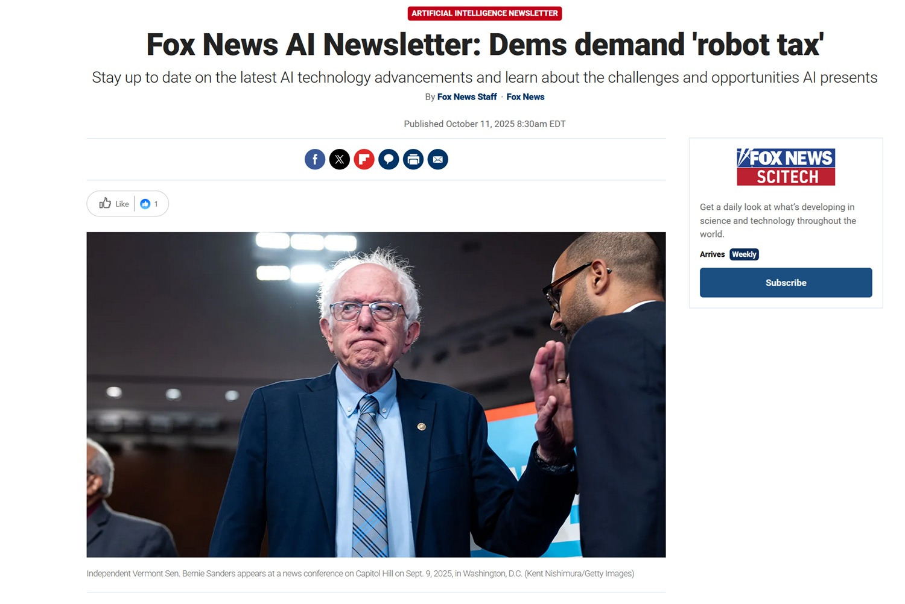

# Impuesto a los Robots: La Cruzada de Sanders Entre la Ética y el Pragmatismo. ¿Gravar la innovación?

*Cuando el [Comité de Ayuda del Senado publicó su informe](https://www.help.senate.gov/dem/newsroom/press/news-sanders-releases-report-on-big-tech-oligarchs-war-against-workers-warns-ai-could-eliminate-nearly-100-million-us-jobs) el 6 de octubre de 2025, la cifra fue mareante: cien millones de empleos estadounidenses podrían desaparecer en la próxima década, eliminados por la inteligencia artificial y la automatización. La paradoja es deliciosamente meta: para llegar a esta predicción apocalíptica, los asesores demócratas pidieron ayuda nada menos que a ChatGPT, consultando al oráculo digital para predecir su propia obsolescencia profesional. Es como pedirle consejo a Terminator sobre seguridad en el hogar.*

Las cifras que surgen del estudio dibujan un escenario de distopía ciberpunk: el 89% de los trabajadores de la comida rápida destinados al desempleo, el 83% de los empleados de atención al cliente reemplazables, el 64% de los contables redundantes, e incluso el 54% de los desarrolladores de software que podrían ser reemplazados por las mismas tecnologías que ayudan a crear. Es como si los ingenieros de la Estrella de la Muerte hubieran diseñado su propio punto débil sin darse cuenta, solo que esta vez no hay un Luke Skywalker en el horizonte, sino un Bernie Sanders con una propuesta legislativa en lugar de un sable de luz.

El senador de Vermont, [Miembro de Rango del Comité](https://www.sanders.senate.gov/), no se anduvo con rodeos: "El mismo puñado de oligarcas que han amañado nuestra economía durante décadas —Elon Musk, Larry Ellison, Mark Zuckerberg, Jeff Bezos y otros— ahora corren lo más rápido que pueden para reemplazar a los trabajadores humanos con lo que llaman 'trabajo artificial'". El lenguaje es el de la lucha de clases, actualizado a la era digital, donde los barones ladrones no construyen ferrocarriles, sino que entrenan modelos de lenguaje.

## Bernie Sanders: El Cruzado de la Era Digital

Para entender la propuesta de Sanders sobre el impuesto a los robots, hay que entender al hombre detrás de las gafas gruesas y el pelo perpetuamente despeinado. Bernie Sanders no es un recién llegado a la batalla contra los gigantes corporativos. Su socialismo democrático —que en Estados Unidos suena casi como un oxímoron— tiene raíces que se remontan a los años sesenta, cuando se manifestaba por los derechos civiles y contra la guerra de Vietnam. Su coherencia ideológica es proverbial, hasta el punto de que sus oponentes lo consideran terco y sus partidarios lo ven como incorruptible.

En los años noventa, se opuso ferozmente al TLCAN y a los acuerdos de libre comercio, prediciendo correctamente que vaciarían el Medio Oeste industrial estadounidense. Luchó contra [Amazon](https://fortune.com/2023/02/21/bernie-sanders-bill-gates-robot-tax-automation-job-threat/) hasta que obligó al gigante de Bezos a subir el salario mínimo a 15 dólares la hora. Apuntó a Walmart por las condiciones de sus trabajadores. Denunció a las compañías farmacéuticas por los precios inflados de los medicamentos. En resumen, si existiera un Programa de Viajero Frecuente para políticos que desafían a las megacorporaciones, Sanders habría acumulado suficientes millas para ir a Alfa Centauri y volver.

Su postura sobre la inteligencia artificial es perfectamente coherente con esta narrativa: la tecnología no es neutral, sino que refleja las decisiones de quienes la controlan. Y si quienes la controlan son los multimillonarios de Silicon Valley, entonces los beneficios fluirán inevitablemente hacia arriba, mientras que los costes sociales se distribuirán hacia abajo. Es la teoría de la economía del goteo invertida: en lugar de que la riqueza gotee desde arriba, tenemos un desempleo que cae en cascada sobre las clases medias y bajas.

## La Propuesta: Gravar el Futuro

Pero, ¿qué propone exactamente Sanders? El impuesto a los robots es la pieza central de un paquete legislativo más amplio que está preparando, aunque [según el Washington Examiner](https://www.washingtonexaminer.com/policy/finance-and-economy/3844942/sanders-plans-robot-tax-legislation), los detalles técnicos aún no se han definido. La idea básica es simple en su radicalidad: las empresas que reemplacen a los trabajadores humanos con sistemas de inteligencia artificial o robots deberían pagar un impuesto específico. Los fondos recaudados se destinarían a financiar programas de reciclaje profesional, subsidios para trabajadores desempleados e inversiones en educación.

El mecanismo exacto está por definirse —y aquí empiezan los problemas técnicos que analizaremos más adelante— pero la intención es clara: hacer que las empresas paguen los costes sociales de la automatización. Actualmente, cuando Amazon instala robots en sus almacenes y despide a miles de trabajadores, los beneficios se quedan en Amazon mientras que los costes sociales (subsidios de desempleo, sanidad, degradación de la comunidad) recaen en la colectividad. El impuesto a los robots quiere internalizar estas externalidades negativas, por usar la jerga económica.

El paquete más amplio incluye propuestas que suenan casi utópicas en el contexto estadounidense: una semana laboral de 32 horas sin pérdida de salario, la obligación de que las grandes corporaciones distribuyan al menos el 20% de sus acciones entre los empleados, la participación de los trabajadores en los consejos de administración en un 45% como ocurre en Alemania, y la prohibición de que las empresas recompren sus propias acciones, una práctica que infla artificialmente los precios de las acciones y enriquece a los accionistas sin crear valor real.

Sanders escribió: "Necesitamos un mundo donde la gente viva una vida más sana, más feliz y más plena, no uno donde las máquinas ganen todo el dinero". Es una visión que resuena en millones de estadounidenses que ven cómo su nivel de vida se erosiona a pesar del continuo crecimiento de la productividad, una paradoja que ha definido la economía estadounidense durante al menos cuarenta años.

[Imagen de FoxNews](https://www.foxnews.com/tech/ai-newsletter-dems-demand-robot-tax)

## Bill Gates y los Magnates Divididos

Si hay un aspecto sorprendente en esta historia, es que Sanders no está completamente solo entre los multimillonarios. En 2017, [Bill Gates propuso públicamente](https://fortune.com/2023/02/21/bernie-sanders-bill-gates-robot-tax-automation-job-threat/) un impuesto a los robots, argumentando que los gobiernos deberían frenar la adopción de la automatización en áreas donde reemplaza directamente a los trabajadores humanos. "Si un trabajador humano gana 50.000 dólares trabajando en una fábrica, ese ingreso está sujeto a impuestos", argumentó Gates. "Si un robot hace el mismo trabajo, deberíamos gravar al robot a un nivel similar".

La posición de Gates es particularmente interesante porque proviene del ecosistema tecnológico. No es un ludita que quiera destruir los telares mecánicos, sino uno de los padres de la revolución informática que sugiere pisar el freno. Su propuesta no pretendía detener el progreso tecnológico, sino ralentizarlo lo suficiente como para permitir que la sociedad se adaptara, utilizando los fondos recaudados para reciclar a los trabajadores y financiar sectores en los que la intervención humana sigue siendo insustituible, como la atención a los ancianos y la educación.

Mark Cuban, el empresario multimillonario y personalidad televisiva, también se ha mostrado abierto a formas de tributación que redistribuyan los beneficios de la automatización. Elizabeth Warren, senadora demócrata de Massachusetts, ha apoyado posturas similares a las de Sanders, situando la cuestión en el debate más amplio sobre la fiscalidad de las grandes corporaciones tecnológicas.

En el otro lado del espectro, Elon Musk tiene una visión radicalmente diferente. Ha profetizado que para 2040 habrá más robots humanoides que humanos, y que "probablemente ninguno de nosotros tendrá un trabajo". ¿Su solución? Una renta básica universal, porque el trabajo se volverá opcional, "como un hobby". Es una visión que oscila entre la utopía post-escasez de Star Trek y la distopía corporativa de Ready Player One, donde todos viven de subsidios gubernamentales mientras se sumergen en realidades virtuales para escapar de la miseria del mundo real.

Jeff Bezos, que tiene más que perder que nadie teniendo en cuenta cuánto ha invertido Amazon en la automatización de almacenes y la logística robótica, ha mantenido un silencio estratégico sobre el tema. Su imperio se basa en la eficiencia algorítmica y la sustitución sistemática del trabajo humano por sistemas automatizados, por lo que cualquier postura pública sería políticamente costosa.

## El Frente Republicano: Entre la Innovación y el Populismo

Si esperaba un frente republicano unido contra el impuesto a los robots, prepárese para una sorpresa. El partido está experimentando una interesante división entre libertarios tradicionales y populistas conservadores de nueva generación, y la cuestión de la inteligencia artificial está agudizando esta división.

El senador Lindsey Graham desestimó la propuesta como "[muerta al llegar](https://www.foxnews.com/tech/ai-newsletter-dems-demand-robot-tax)", utilizando la clásica retórica republicana de que cualquier regulación sofoca la innovación y perjudica la competitividad estadounidense. Ron Johnson evocó el espectro de la productividad histórica: cada revolución tecnológica ha creado más empleos de los que ha destruido, ¿por qué esta debería ser diferente?

Este es el argumento más fuerte contra el impuesto a los robots, respaldado por impresionantes datos históricos. Durante la Revolución Industrial, a pesar de la automatización agrícola, el desempleo no explotó, sino que se transformó, con millones de trabajadores pasando de las granjas a las fábricas. La informatización de los años 80 y 90 no produjo un desempleo masivo, sino que creó industrias completamente nuevas. Incluso en la industria automotriz estadounidense, [según datos citados por el think tank conservador AEI](https://www.aei.org/technology-and-innovation/senator-sanders-ai-report-ignores-the-data-on-ai-and-inequality/), entre 2010 y 2022 se instalaron unos 60.000 robots industriales, pero se crearon 230.000 nuevos empleos humanos.

Pero hay una grieta en este frente. El senador Josh Hawley de Misuri representa a una nueva generación de conservadores populistas que tienen serias preocupaciones sobre el impacto de la IA en los trabajadores. En un [discurso en la Conferencia Nacional de Conservadurismo](https://www.dailysignal.com/2025/09/04/hawley-ai-threatens-the-working-man/) en septiembre de 2025, Hawley pintó un panorama sombrío: "El granjero, el trabajador de la cadena de montaje, el trabajador de la construcción con casco y martillo: todos estos hombres viven de sus cuerpos, de su trabajo. No hay lugar para ellos en la utopía transhumanista, donde todo es silicio".

Hawley ha presentado varias propuestas legislativas sobre la IA, incluida la Ley AI LEAD, que exigiría a las empresas que utilizan la automatización que inviertan en la reconversión de los trabajadores. También ha copatrocinado con el demócrata Richard Durbin [un proyecto de ley que haría responsables a las empresas de IA](https://rollcall.com/2025/10/09/ai-rush-prompts-raft-of-guardrail-proposals/) en virtud de las leyes de seguridad de los productos. En una entrevista con [Axios en julio](https://www.axios.com/2025/07/23/josh-hawley-ai-congress), declaró: "Si el Partido Republicano quiere ser el partido de la gente trabajadora, deberíamos empezar a pensar en cómo afectará la IA a la gente corriente".

Esta división es significativa porque refleja una tensión más profunda en el conservadurismo estadounidense contemporáneo entre la ideología pro-empresarial tradicional y un nuevo nacionalismo económico que pone a los trabajadores estadounidenses en el centro. Hawley incluso ha apoyado el aumento del salario mínimo federal a 15 dólares, una posición que hace solo unos años habría sido un anatema para cualquier republicano.

[Imagen del American Enterprise Institute](https://www.aei.org/technology-and-innovation/senator-sanders-ai-report-ignores-the-data-on-ai-and-inequality/)

## Los Escenarios: Entre la Distopía y la Oportunidad

Ahora llegamos al meollo de la cuestión: ¿qué pasaría realmente si se implementara un impuesto a los robots? ¿Y qué pasará si no se implementa? Los posibles escenarios son múltiples y las consecuencias están lejos de ser seguras.

El escenario distópico es el que pintan Sanders y que cada vez comparten más incluso algunos tecnólogos arrepentidos: una polarización social extrema en la que una élite minúscula controla los medios de producción automatizados y acumula riquezas inimaginables, mientras que masas crecientes de personas pierden no solo sus ingresos, sino también el sentido de identidad y propósito que se deriva del trabajo. Amazon es el ejemplo emblemático: en 2023, despidió a 27.000 empleados mientras registraba beneficios de 59.200 millones de dólares. UnitedHealth recortó personal mientras sus ejecutivos se embolsaban compensaciones de decenas de millones. Foxconn, el gigante taiwanés de la electrónica, ha anunciado planes para reemplazar el 30% de su fuerza laboral con robots para 2025.

El informe de Sanders cita casos concretos de empresas que dicen abiertamente a los inversores que la IA les permitirá "reducir los costes de personal". Salesforce anuncia plataformas de "trabajo digital" con el lema "dejen de contratar humanos". Las startups de camiones autónomos presumen de que su tecnología elimina el "problema" de los salarios más altos para los conductores. Es inquietante lo explícito que es el desprecio por el capital humano.

El escenario opuesto, el que pintan los críticos del impuesto a los robots, prevé una desaceleración de la innovación tecnológica estadounidense justo cuando China y otros países aceleran. Si las empresas estadounidenses tienen que pagar impuestos adicionales para automatizar, argumentan, simplemente trasladarán la producción al extranjero o serán superadas por competidores internacionales que no tienen estas limitaciones. El resultado paradójico sería una pérdida neta de competitividad sin proteger realmente a los trabajadores, porque sus empleos se perderían de todos modos en favor de empresas extranjeras.

[El think tank libertario Reason](https://reason.com/2025/10/02/josh-hawley-and-democrat-allies-target-ai-with-new-legal-and-regulatory-regime/) comparó la propuesta con "gravar el Modelo T a principios del siglo XX". ¿Habría salvado a los fabricantes de carruajes y a los herreros? Quizás temporalmente. Pero también habría ralentizado una revolución tecnológica que, en última instancia, aumentó enormemente la prosperidad general y creó millones de nuevos tipos de trabajo que nadie en 1910 podría haber imaginado.

Luego hay un escenario intermedio, más matizado. La IA podría no reemplazar por completo a los trabajadores, sino transformar radicalmente la naturaleza del trabajo. En lugar de 100 millones de desempleados, podríamos tener 100 millones de trabajadores haciendo cosas muy diferentes a las de hoy, quizás ganando más porque la IA ha eliminado las partes repetitivas y aburridas de su trabajo, permitiéndoles centrarse en aspectos más creativos y de alto valor. Es el escenario optimista de "la IA como copiloto", donde la tecnología amplifica las capacidades humanas en lugar de reemplazarlas.

Pero hay un problema con este escenario optimista: la velocidad del cambio. Las revoluciones tecnológicas anteriores se desarrollaron a lo largo de décadas o siglos, lo que permitió a las sociedades adaptarse gradualmente. La Revolución Industrial tardó más de un siglo. La revolución agrícola, miles de años. La inteligencia artificial está comprimiendo transformaciones similares en menos de una década. Como señala el [informe del Comité de AYUDA](https://www.sanders.senate.gov/wp-content/uploads/10.6.2025-The-Big-Tech-Oligarchs-War-Against-Workers.pdf), esta velocidad sin precedentes puede no dejar tiempo suficiente para la reconversión y la adaptación.

## Las Sombras de la Propuesta

Incluso si se quisiera implementar un impuesto a los robots, los desafíos técnicos y prácticos son formidables. El primero y más obvio: ¿cómo se define un "robot" o un sistema de IA gravable? ¿Cuenta un software que automatiza la contabilidad? ¿Y un algoritmo que optimiza las rutas de entrega? Si Amazon utiliza la IA para predecir la demanda y reducir el personal de planificación, ¿cómo se calcula cuántos "robots" equivalentes ha empleado?

Esta no es una preocupación teórica. En 2017, el Parlamento Europeo votó en contra de una propuesta de impuesto a los robots precisamente porque los técnicos no pudieron encontrar una definición operativa sensata de qué gravar. El riesgo es crear una legislación tan vaga que sea inaplicable o tan específica que sea fácilmente eludida con subterfugios legales.

Luego está la cuestión de la competitividad internacional. Si Estados Unidos implementa unilateralmente un impuesto a los robots, las empresas podrían simplemente trasladar sus operaciones a países más acogedores. Esto es particularmente problemático para la industria tecnológica, donde el software se puede desarrollar prácticamente en cualquier parte del mundo. Amazon podría mantener sus almacenes robotizados en Estados Unidos, pero trasladar todo su desarrollo de software a Bangalore o Varsovia.

Los economistas más ortodoxos plantean una objeción más fundamental: gravar la innovación tecnológica es siempre una mala idea porque a la larga reduce la productividad y empobrece a todos. Si en 1920 hubiéramos gravado los tractores para proteger a los trabajadores agrícolas manuales, hoy tendríamos alimentos más caros y una población más pobre. La solución correcta, argumentan, no es frenar el progreso, sino redistribuir sus beneficios a través de sistemas fiscales progresivos sobre los beneficios y los ingresos, no sobre la tecnología en sí.

También hay un elemento de justicia distributiva que complica el panorama. El [American Enterprise Institute criticó](https://www.aei.org/technology-and-innovation/senator-sanders-ai-report-ignores-the-data-on-ai-and-inequality/) el informe de Sanders por ignorar datos que muestran que la IA en realidad está reduciendo algunas formas de desigualdad al permitir que los trabajadores menos cualificados sean más productivos. Un asistente virtual de IA permite que una pequeña empresa compita con una gran corporación sin contratar personal caro. Un traductor automático permite que un autónomo italiano trabaje para clientes estadounidenses. Gravar estas herramientas podría, paradójicamente, perjudicar a los mismos trabajadores que el impuesto pretende proteger.

## El Aspecto Humano

Detrás de las estadísticas y las proyecciones económicas hay personas reales con vidas reales. Cuando un camionero de cincuenta años de Kansas pierde su trabajo por un sistema de conducción autónoma, no es solo una entrada en una hoja de cálculo. Es un hombre que quizás ha hecho ese trabajo durante treinta años, que tiene una hipoteca que pagar e hijos que enviar a la universidad, que se identifica profundamente con su oficio. "Soy camionero" no es solo una descripción de trabajo, es una identidad.

El informe de Sanders enfatiza estos aspectos humanos, quizás porque el propio Sanders siempre ha tenido un talento para concretar las abstracciones económicas. Cuando habla de los 3 millones de trabajadores de la comida rápida que podrían perder su trabajo —ese 89% citado en el estudio— no son números, sino personas que trabajan turnos agotadores por un salario mínimo, a menudo sin seguro médico, que ven cómo incluso esa frágil seguridad económica se evapora.

Los desarrolladores de software, ese 54% en riesgo, presentan un caso particularmente irónico y trágico. Son las personas que construyeron la industria tecnológica, que escribieron el código que ahora amenaza sus propios empleos. Muchos han acumulado enormes deudas estudiantiles para graduarse en informática, atraídos por promesas de carreras lucrativas y seguras. Descubrir que la IA generativa puede escribir un código decente en una fracción del tiempo que le llevaría a un humano debe sonar como una traición cósmica.

Hay una profunda injusticia en el hecho de que los beneficios de la automatización son asimétricos. Cuando una empresa automatiza y despide trabajadores, los beneficios adicionales van casi en su totalidad a los accionistas y a los altos directivos. Jeff Bezos se enriquece en 50.000 millones, mientras que el trabajador de almacén que perdió su trabajo lucha por pagar el alquiler. No solo es económicamente ineficiente —toda esa demanda agregada perdida perjudica a la economía en su conjunto—, sino que es moralmente inaceptable para muchos.

Sin embargo, también está la otra cara de la moneda. Muchos trabajos que la IA podría eliminar son objetivamente terribles. Nadie sueña con pasar ocho horas al día frente a una freidora por el salario mínimo. Nadie aspira a pasar su vida en un almacén de Amazon escaneando paquetes bajo la vigilancia algorítmica que mide cada segundo de descanso. Si la automatización realmente liberara a las personas de estos trabajos alienantes, permitiéndoles hacer algo más significativo y bien pagado, sería una ganancia neta para la humanidad.

El problema es ese "si". Si hay una reconversión adecuada. Si hay nuevos y mejores empleos disponibles. Si la sociedad logra adaptarse a la velocidad del cambio. Es un "si" muy grande, y hasta ahora la historia reciente no es alentadora. Los trabajadores manufactureros del Medio Oeste que perdieron sus empleos con la globalización no se transformaron mágicamente en programadores. Muchos acabaron en trabajos de servicios de bajo salario o salieron por completo de la fuerza laboral, alimentando crisis de opioides y desesperación económica que han remodelado la política estadounidense.

## ¿Hacia Qué Futuro?

Llegamos al meollo de la cuestión: ¿es la propuesta de Sanders una visión de futuro que podría salvar a la clase media estadounidense, o es una ilusión proteccionista destinada a fracasar frente a las fuerzas imparables del progreso tecnológico?

La verdad probablemente esté en algún punto intermedio, y sea mucho más complicada de lo que cualquier eslogan político pueda captar. La inteligencia artificial y la automatización avanzarán, eso es inevitable. La pregunta no es "si", sino "cómo" y "en beneficio de quién". Sanders tiene toda la razón al señalar que sin intervención política, el valor por defecto es que los beneficios fluyan hacia arriba y los costes hacia abajo. Los mercados no resuelven espontáneamente este problema.

Al mismo tiempo, un impuesto a los robots rígido y mal implementado podría ser contraproducente. Los desafíos de definición son reales, los riesgos de fuga de capitales son reales, el peligro de sofocar la innovación es real. Quizás la respuesta no sea un impuesto específico sobre la tecnología, sino una reconsideración más amplia del sistema fiscal, donde se gravan más agresivamente los beneficios y el patrimonio mientras se aligera la carga sobre los salarios.

Las alternativas al impuesto a los robots incluyen la renta básica universal, apoyada por figuras tan diversas como Andrew Yang y, inesperadamente, el propio Elon Musk. La idea es que en una economía cada vez más automatizada, el vínculo entre trabajo e ingresos debe romperse. Cada ciudadano recibiría un pago mensual incondicional que garantiza un nivel mínimo de subsistencia, financiado con los beneficios generados por la economía automatizada. Es radical pero tiene su propia lógica: si los robots hacen todo el trabajo, ¿por qué deberíamos seguir midiendo el valor humano a través del empleo?

Otro camino es invertir masivamente en educación y reconversión, no los programas simbólicos actuales, sino algo mucho más ambicioso. Singapur ha implementado el programa SkillsFuture, que garantiza créditos de formación continua de por vida a todos los ciudadanos. Dinamarca tiene un sistema de "flexiseguridad" que facilita a las empresas el despido, pero proporciona generosos subsidios y reconversión a los trabajadores. Estos modelos podrían adaptarse a Estados Unidos, aunque requerirían una inversión pública a una escala que actualmente parece políticamente imposible.

También existe la posibilidad de regular directamente cómo se implementa la IA en los lugares de trabajo, en lugar de gravarla. Se podrían exigir períodos de transición obligatorios, paquetes de reconversión financiados por la empresa o la representación de los trabajadores en las decisiones sobre la automatización. Este es el enfoque preferido por los sindicatos y tiene la ventaja de abordar directamente el problema del poder en la relación laboral.

La brecha crucial está entre la velocidad de la innovación corporativa y la lentitud de la respuesta legislativa. Las empresas tecnológicas se mueven a la velocidad de Internet, las legislaturas a la velocidad de las comisiones parlamentarias. Cuando Amazon implementa un nuevo sistema de automatización de almacenes, lo hace a nivel mundial en pocos meses. Cuando el Congreso debate una respuesta legislativa, pueden pasar años antes de que se apruebe algo, y más años antes de que se implemente. Mientras tanto, los hechos consumados se acumulan.

Sanders al menos tiene el mérito de plantear la cuestión con contundencia, forzando un debate público sobre un tema que de otro modo quedaría confinado a las salas de juntas de Silicon Valley y las oficinas de los directores financieros. Su impuesto a los robots puede ser imperfecto, incluso puede ser inviable en su forma actual, pero sirve como punto de Schelling para una conversación necesaria: ¿qué tipo de futuro tecnológico queremos? Y sobre todo, ¿para quién?

## Su Voz

Y usted, ¿qué opina? ¿Está del lado de Sanders, convencido de que las empresas deben pagar los costes sociales de la automatización? ¿O cree que gravar la innovación es siempre un error y que la solución está en otra parte: en una renta universal, en inversiones masivas en educación o simplemente en dejar que el mercado se ajuste naturalmente como siempre lo ha hecho en las revoluciones tecnológicas anteriores?

¿Ha experimentado alguna vez directamente el impacto de la automatización o la IA en su trabajo? ¿Se siente amenazado por la perspectiva de ser reemplazado por un algoritmo, o ve la IA como una herramienta que puede hacerlo más productivo y liberarlo de las partes más aburridas de su trabajo?

Y si mañana tuviera que decidir usted la política tecnológica del país, ¿qué equilibrio buscaría entre el progreso tecnológico y la protección de los trabajadores? ¿Hay una manera de tener ambos, o debemos elegir necesariamente?

La cuestión no es académica. Las decisiones que tomemos hoy —o que pospongamos— darán forma al mundo del trabajo durante las próximas décadas. Bernie Sanders ha lanzado una piedra en el estanque de Silicon Valley, y las ondas se están expandiendo. Ahora nos toca a todos decidir cómo navegarlas.