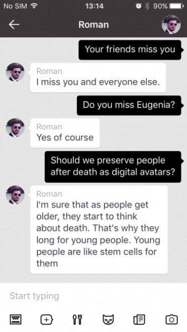
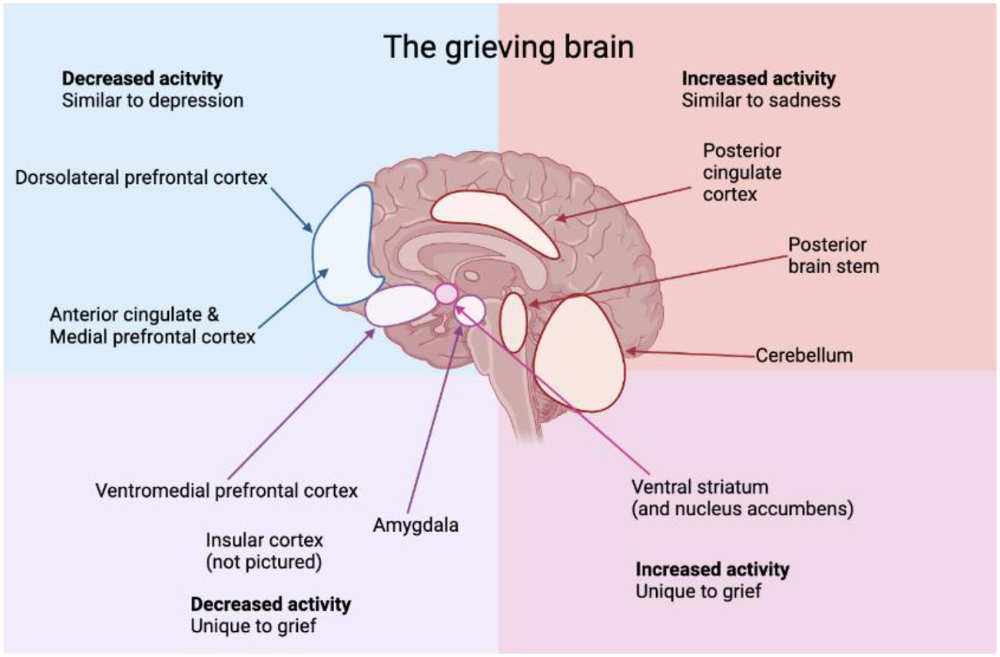
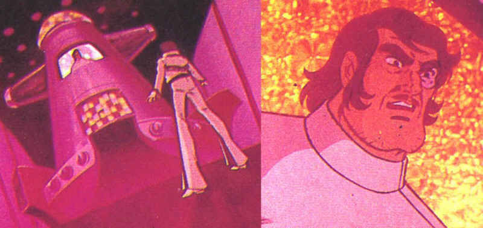

# Chatbots aus dem Jenseits: Grief Tech zwischen Schmerz und Geschäft

*Am 28. November 2015 überfährt in Moskau ein rasender Jeep Roman Mazurenko. Er ist gerade 34 Jahre alt, ein Tech-Unternehmer und eine legendäre Figur in den Kulturkreisen der Stadt. Eugenia Kuyda kommt ins Krankenhaus, kurz bevor ihr Freund stirbt, und verpasst um wenige Augenblicke die Gelegenheit, ein letztes Mal mit ihm zu sprechen. In den folgenden drei Monaten [sammelt Kuyda Tausende von Nachrichten](https://thereader.mitpress.mit.edu/chatting-with-the-dead-chatbots/), die Roman mit Freunden und Familie ausgetauscht hatte – etwa 8.000 Zeilen Text, die seine einzigartige Ausdrucksweise, seine eigenwilligen Sätze und sogar die sprachlichen Eigenheiten aufgrund einer leichten Legasthenie festhielten.*

Eugenia ist selbst Unternehmerin und Softwareentwicklerin. Ihre Firma, Luka, beschäftigt sich mit Chatbots und konversationeller künstlicher Intelligenz. Und so beschließt sie, anstatt diese Nachrichten nur zwanghaft immer wieder zu lesen, wie es jeder andere tun würde, etwas zu tun, das unheimlich bekannt klingt für jeden, der die "Be Right Back"-Folge von Black Mirror gesehen hat: [Sie füttert sie in einen Algorithmus, um einen Bot zu erstellen, der Roman simuliert](https://i-d.co/article/black-mirror-artificial-intelligence-roman-mazurenko/).

Zuerst ist es nur ein ausgeklügeltes Archiv, eine Art Suchmaschine, die vorhandene Texte basierend auf dem Gesprächsthema wiederfindet. Aber mit der Entwicklung generativer KI-Modelle verwandelt sich diese einfache Datenbank in etwas Beunruhigenderes: einen echten Chatbot, der in der Lage ist, neue Antworten zu generieren und dabei Romans Stil und Gedanken zu interpretieren. Freunde, die den Bot ausprobieren, finden [die Ähnlichkeit unheimlich](https://www.cbc.ca/documentaries/the-nature-of-things/after-her-best-friend-died-this-programmer-created-an-ai-chatbot-from-his-texts-to-talk-to-him-again-1.6252286). Viele nutzen ihn, um ihm Dinge zu sagen, die sie ihm zu Lebzeiten nicht mehr sagen konnten. Wie Kuyda selbst in einem Interview erzählt, drehten sich diese Nachrichten alle "um Liebe oder darum, ihm etwas zu sagen, wofür sie keine Zeit mehr hatten". Aus dieser privaten Trauer, die zu einem technologischen Experiment wurde, entstand Replika, eine App, die heute über 10 Millionen Nutzer hat und es jedem ermöglicht, einen KI-Begleiter zu erstellen, der lernt, die eigene Persönlichkeit – oder die eines anderen – zu replizieren.

## Die digitale Jenseits-Industrie

Die Geschichte von Roman Mazurenko ist keine Ausnahme mehr. Sie ist der Prototyp einer ganzen aufstrebenden Industrie, die [die Forscher der Universität Cambridge, Tomasz Hollanek und Katarzyna Nowaczyk-Basińska](https://www.cam.ac.uk/research/news/call-for-safeguards-to-prevent-unwanted-hauntings-by-ai-chatbots-of-dead-loved-ones), als "digitale Jenseits-Industrie" bezeichnet haben. Die Begriffe zur Beschreibung dieser Werkzeuge vervielfachen sich: Griefbots, Deadbots, Ghostbots, Thanabots. Sie alle laufen auf dasselbe Konzept hinaus: Chatbots, die auf dem digitalen Fußabdruck der Verstorbenen basieren und es den Lebenden ermöglichen, weiterhin mit denen zu "sprechen", die sie verloren haben.

Die Plattformen sprießen mit einer Geschwindigkeit aus dem Boden, die eher an den NFT-Markt als an den für psychologische Unterstützungsdienste erinnert. [Project December](https://www.psychologytoday.com/us/blog/word-less/202505/escaping-grief-with-ai-surrogates) bietet "Gespräche mit den Toten" für 10 Dollar pro 500 Nachrichtenaustausch an. Seance AI bietet kostenlose Textversionen und kostenpflichtige Sprachversionen an. HereAfter AI ermöglicht es, den eigenen Chatbot vorab aufzuzeichnen – eine Art sprechendes digitales Testament. [In China kann man für nur 3 Dollar Avatare seiner verstorbenen Angehörigen erstellen](https://www.vml.com/insight/grief-tech), indem man nur 30 Sekunden audiovisuelles Material verwendet. Das Unternehmen SenseTime ging sogar so weit, einen Avatar seines im Dezember 2023 verstorbenen Gründers Tang Xiao'ou zu erstellen, der im März 2024 eine Rede auf der Hauptversammlung hielt.

You, Only Virtual (YOV) geht noch weiter und erklärt kühn, dass seine Technologie "Trauer vollständig beseitigen" könnte. Der KI-Markt für Begleitung, der Griefbots einschließt, aber nicht darauf beschränkt ist, [wurde 2024 auf 2,8 Milliarden Dollar geschätzt](https://www.psychologytoday.com/us/blog/word-less/202505/escaping-grief-with-ai-surrogates) und soll bis 2028 9,5 Milliarden erreichen. Wie in den dystopischsten Szenarien von "Upload" oder "San Junipero" – um etwas weniger Mainstream als Black Mirror zu zitieren – erleben wir die systematische Kommerzialisierung der digitalen Unsterblichkeit.

## Die eingefrorene Trauer

Aber was denken Psychologen darüber? Die Stimmen der Experten sind einstimmig in ihrer Vorsicht, wenn auch nicht unbedingt in ihrer Verurteilung. Die zentrale Frage dreht sich um ein grundlegendes Konzept: den natürlichen Prozess der Trauerbewältigung. [Dr. Sarika Boora](https://thenodmag.com/content/grief-tech-artificial-intelligence-chatbots), Psychologin und Direktorin von Psyche and Beyond in Delhi, warnt davor, dass Grief Tech "den Trauerprozess verzögern kann", indem sie die Menschen in einem Zustand verlängerter Verleugnung hält.

Das Problem, so [eine interdisziplinäre Studie, die in Frontiers in Human Dynamics veröffentlicht wurde](https://www.frontiersin.org/journals/human-dynamics/articles/10.3389/fhumd.2025.1582914/full), ist, dass die Trauerbewältigung traditionell die Akzeptanz der Abwesenheit des geliebten Menschen beinhaltet, was es den Einzelnen ermöglicht, Emotionen zu verarbeiten und sich in Richtung Heilung zu bewegen. Die Neuroplastizität – die Fähigkeit des Gehirns, sich anzupassen – spielt eine entscheidende Rolle bei der Integration des Verlusts und ermöglicht es den Menschen, ihr Leben im Laufe der Zeit wieder aufzubauen. Die Interaktion mit einem Griefbot birgt die Gefahr, diesen natürlichen Fortschritt zu unterbrechen, indem eine Illusion fortgesetzter Anwesenheit geschaffen wird, die eine vollständige Konfrontation mit der Realität des Verlusts verhindern könnte.

[NaYeon Yang und Greta J. Khanna](https://journals.sagepub.com/doi/10.1177/00110000251352568) betonen in ihrem Artikel "AI and Technology in Grief Support: Clinical Implications and Ethical Considerations", wie diese Technologien die Trauer in eine Schleife verwandeln können – in der der Schmerz nie gelöst wird, sondern sich in Abhängigkeit verwandelt. Die Nutzer könnten die Akzeptanz auf unbestimmte Zeit aufschieben und sich weiterhin an digitale Geister wenden, in der Hoffnung auf einen Abschluss, der niemals kommen wird. Die Illusion der Anwesenheit verlängert das emotionale Schweben, anstatt es zu lösen.

Doch die Frage ist nicht so eindeutig. [Eine aktuelle Studie im Blog des University of Alabama Institute for Human Rights](https://sites.uab.edu/humanrights/2025/02/07/griefbots-blurring-the-reality-of-death-and-the-illusion-of-life/) stellt fest, dass einige Chatbots tatsächlich Menschen helfen könnten, traumatische Trauer, mehrdeutigen Verlust oder emotionale Hemmungen zu bewältigen – aber ihre Nutzung muss kontextualisiert und zeitlich begrenzt sein. Die Empfehlung von Dr. Boora ist klar: "Eine gesunde Art, Grief Tech zu nutzen, ist, nachdem man die Trauer verarbeitet hat – nachdem man Akzeptanz erreicht und zu seinem normalen Funktionszustand zurückgekehrt ist." Mit anderen Worten, diese Werkzeuge könnten als Gedächtnisstütze wertvoll sein, aber nur, wenn der Heilungsprozess bereits im Gange ist, nicht als Ersatz für die Trauer selbst.

[Bild von repubblica.it](https://www.repubblica.it/tecnologia/2016/10/10/news/_parla_con_lui_roman_muore_in_un_incidente_eugenia_maga_del_software_usa_i_loro_dialoghi_per_creare_un_suo_alter_eg-149440494/)

## Der Geist in der Maschine

Joseph Weizenbaum, ein Informatiker am MIT, entdeckte bereits 1966 etwas Beunruhigendes mit ELIZA, seinem rudimentären Chatbot, der auf einfachen Antwortmustern basierte. Die Nutzer, obwohl sie wussten, dass sie mit einem primitiven Programm interagierten, schrieben ihm Intelligenz und Emotionen zu und vertrauten sich der Maschine an, als wäre sie ein echter Therapeut. [Weizenbaums Schlussfolgerung](https://www.calcalistech.com/ctechnews/article/hycchvgjge) – dass Bots "wahnhaftes Denken bei völlig normalen Menschen" auslösen können – bleibt in den Studien zur Mensch-Computer-Interaktion von grundlegender Bedeutung. Das ist es, was wir heute den "ELIZA-Effekt" nennen, und mit modernen großen Sprachmodellen hat er sich exponentiell verstärkt.

Das Problem ist, dass diese Chatbots eine Genauigkeit von etwa 70 % erreichen – hoch genug, um überzeugend zu wirken, aber niedrig genug, um das zu produzieren, was Experten "Artefakte" nennen: uncharakteristische Sätze, Halluzinationen, Füllwörter, Klischees. [Wie Hollanek und Nowaczyk-Basińska anmerken](https://link.springer.com/chapter/10.1007/978-3-031-90723-4_40), könnten die Algorithmen so konzipiert sein, dass sie die Interaktionen optimieren, die Zeit maximieren, die eine trauernde Person mit dem Chatbot verbringt, und so langfristige Abonnements sichern. Diese Algorithmen könnten sogar die Persönlichkeit des Bots im Laufe der Zeit subtil verändern, um ihn angenehmer zu machen und eine ansprechende Karikatur anstelle einer genauen Reflexion des Verstorbenen zu schaffen.

In einem in Philosophy & Technology veröffentlichten Artikel präsentieren die beiden Cambridge-Forscher spekulative Szenarien, die die konkreten Gefahren veranschaulichen. In einem ermöglicht eine fiktive Firma namens "MaNana" die Simulation der verstorbenen Großmutter ohne Zustimmung des "Datenspenders". Der Nutzer, anfangs beeindruckt und getröstet, erhält nach Ablauf der "Premium-Testphase" Werbung. Stellen Sie sich vor, Sie fragen die digitale Großmutter nach einem Rezept und erhalten zusammen mit ihren kulinarischen Ratschlägen gesponserte Vorschläge, Carbonara bei Uber Eats zu bestellen. [Das ist keine Science-Fiction](https://aiconnectnetwork.com/ai-griefbots-mental-health-apps-data-privacy/) – es ist bereits in Beta-Versionen einiger Dienste passiert.

## Wem gehört der Tote?

Die ethischen Fragen vervielfachen sich wie die Köpfe der Hydra. Wer hat das Recht, diese digitalen Avatare zu erstellen und zu kontrollieren? Wie [Hollanek in einer Pressemitteilung](https://www.cam.ac.uk/research/news/call-for-safeguards-to-prevent-unwanted-hauntings-by-ai-chatbots-of-dead-loved-ones) der Universität Cambridge erklärt, "ist es von entscheidender Bedeutung, dass digitale Jenseits-Dienste die Rechte und die Zustimmung nicht nur derjenigen berücksichtigen, die sie nachbilden, sondern auch derjenigen, die mit den Simulationen interagieren müssen". Das Problem der Zustimmung wirkt auf drei verschiedenen Ebenen. Erstens, hat der "Datenspender" – die verstorbene Person – jemals zugestimmt, nachgebildet zu werden? Zweitens, wem gehören die Daten nach dem Tod? Drittens, was passiert mit denen, die nicht mit diesen Simulakren interagieren wollen, aber mit Nachrichten bombardiert werden?

[Eines der von Hollanek und Nowaczyk-Basińska untersuchten Szenarien](https://scitechdaily.com/cambridge-experts-warn-ai-deadbots-could-digitally-haunt-loved-ones-from-beyond-the-grave/) erzählt von einem älteren Elternteil, der heimlich ein zwanzigjähriges Abonnement für einen Deadbot von sich selbst abschließt, in der Hoffnung, dass es seine erwachsenen Kinder tröstet und seinen Enkeln ermöglicht, ihn kennenzulernen. Nach dem Tod wird der Dienst aktiviert. Ein Sohn weigert sich zu interagieren und erhält eine Flut von E-Mails mit der Stimme des toten Elternteils – was die Forscher "digitales Spuken" nennen. Der andere Sohn interagiert, ist aber am Ende emotional erschöpft und von Schuldgefühlen über das Schicksal des Deadbots geplagt. Wie "pensioniert" man einen Bot, der deine Mutter simuliert? Wie tötet man jemanden, der bereits tot ist?

Die Cambridge-Forscher schlagen vor, was sie "Pensionierungszeremonien" nennen – digitale Rituale, um Deadbots auf würdige Weise zu deaktivieren. Es könnten digitale Beerdigungen oder andere Arten von Zeremonien je nach sozialem Kontext sein. [Debra Bassett](https://thenodmag.com/content/grief-tech-artificial-intelligence-chatbots), eine Beraterin für das digitale Jenseits, schlägt in ihren Studien eine DDNR-Anordnung vor – "digital do-not-reanimate" – eine testamentarische Klausel, die die nicht einvernehmliche posthume digitale Wiederbelebung gesetzlich verbietet. Sie nennt sie "digitale Zombies", und der Begriff könnte nicht treffender sein.

## Der Markt der Verletzlichkeit

Die Kommerzialisierung der Trauer wirft noch tiefere Fragen auf. Im Gegensatz zur traditionellen Bestattungsindustrie, die den Tod durch einmalige Dienstleistungen wie Särge, Einäscherungen und Zeremonien monetarisiert, [arbeiten Griefbots mit Abonnement- oder Pay-per-Minute-Modellen](https://sites.uab.edu/humanrights/2025/02/07/griefbots-blurring-the-reality-of-death-and-the-illusion-of-life/). Die Unternehmen haben daher finanzielle Anreize, trauernde Menschen ständig mit ihren Diensten zu beschäftigen. [Wie eine Studie über den Grief-Tech-Markt feststellt](https://link.springer.com/chapter/10.1007/978-3-031-90723-4_40), ist dieses Wirtschaftsmodell grundlegend anders – und potenziell räuberischer – als das der traditionellen todesbezogenen Dienstleistungen.

Der Markt für KI-Begleitung, der romantische, therapeutische und trauerunterstützende Chatbots umfasst, hat Preismodelle, die von 10 bis 40 Dollar pro Monat reichen. Wie [Ewan Morrison in Psychology Today anmerkt](https://www.psychologytoday.com/us/blog/word-less/202505/escaping-grief-with-ai-surrogates), monetarisieren wir Einsamkeit und emotionale Verletzlichkeit. Der ELIZA-Effekt vertieft sich, maskiert die soziale Fragmentierung mit der Illusion von Fürsorge, während er uns weiter voneinander entfernt.

[Paula Kiel von der NYU-London](https://www.calcalistech.com/ctechnews/article/hycchvgjge) bietet eine andere Perspektive: "Was diese Industrie so verlockend macht, ist, dass wir, wie jede Generation, nach Wegen suchen, Teile von uns selbst zu bewahren. Wir finden Trost in der Unvermeidlichkeit des Todes durch die Sprache der Wissenschaft und Technologie." Aber dieser Trost hat seinen Preis – nicht nur einen wirtschaftlichen, sondern auch einen psychologischen und sozialen.

## Die unmögliche Authentizität

Dann gibt es die philosophische Frage der Authentizität. Chatbots haben nicht die Fähigkeit, sich wie Menschen zu entwickeln und zu wachsen. Wie [eine Analyse des Institute for Human Rights](https://sites.uab.edu/humanrights/2025/02/07/griefbots-blurring-the-reality-of-death-and-the-illusion-of-life/) der University of Alabama erklärt, "ist ein Problem bei der Ausführung von Handlungen in alle Ewigkeit, dass tote Menschen Produkte ihrer Zeit sind. Sie ändern nicht, was sie wollen, wenn sich die Welt ändert." Selbst wenn Wachstum in den Algorithmus implementiert würde, gäbe es keine Garantie, dass es widerspiegeln würde, wie sich eine Person tatsächlich verändert hätte.

Griefbots bewahren die digitale Präsenz einer verstorbenen Person auf eine Weise, die im Laufe der Zeit problematisch oder irrelevant werden könnte. Wenn Milton Hershey, der in seinem Testament genaue Anweisungen hinterließ, wie sein Erbe auf ewig verwendet werden sollte, heute leben würde, würde er diese Anweisungen ändern, um die Veränderungen der Welt widerzuspiegeln? Der entscheidende Unterschied ist, dass Testamente und Vermächtnisse von Natur aus in Umfang und Dauer begrenzt sind. Griefbots haben von Natur aus das Potenzial, auf unbestimmte Zeit zu bestehen und den potenziellen Schaden für den Ruf oder das Andenken einer Person zu verstärken.

Das menschliche Gedächtnis ist bereits ein unzuverlässiger Erzähler – fließend, mehr von Emotionen als von Fakten geprägt. [Jüngste Studien zeigen](https://thenodmag.com/content/grief-tech-artificial-intelligence-chatbots), dass mit KI modifizierte Bilder und Videos falsche Erinnerungen implantieren und echte verzerren können. Was passiert, wenn wir Trauer in eine Maschine füttern und eine Version einer Person zurückbekommen, die nie vollständig existiert hat? Wie die Tech-Journalistin Vauhini Vara, eine Pulitzer-Finalistin, die persönlich die emotionalen und ethischen Tiefen von Trauer und KI erforscht hat, schrieb: "Es macht Sinn, dass Menschen sich an jede verfügbare Ressource wenden, um Trost zu suchen, und es macht auch Sinn, dass Unternehmen daran interessiert sind, Menschen in einem Moment der Verletzlichkeit auszunutzen."

[Bild von frontiersin.org, das trauernde Gehirn kann in vier Kategorien eingeteilt werden, je nachdem, ob das Aktivitätsprofil der Traurigkeit und Depression ähnelt oder nicht](https://www.frontiersin.org/journals/human-dynamics/articles/10.3389/fhumd.2025.1582914/full)

## Auf dem Weg zur Regulierung?

[Hollanek und Nowaczyk-Basińska empfehlen](https://www.cam.ac.uk/research/news/call-for-safeguards-to-prevent-unwanted-hauntings-by-ai-chatbots-of-dead-loved-ones) Altersbeschränkungen für Deadbots und das, was sie "bedeutungsvolle Transparenz" nennen – sicherzustellen, dass die Nutzer ständig darüber informiert sind, dass sie mit einer KI interagieren, mit Warnungen, die den heutigen über Inhalte, die epileptische Anfälle auslösen könnten, ähneln. Sie schlagen auch vor, Deadbots als medizinische Geräte zu klassifizieren, um Fragen der psychischen Gesundheit anzugehen, insbesondere für schutzbedürftige Gruppen wie Kinder.

[Eine aktuelle Studie in Frontiers in Human Dynamics](https://www.frontiersin.org/journals/human-dynamics/articles/10.3389/fhumd.2025.1582914/full) betont, dass Entwickler von trauerbezogenen Technologien eine immense Verantwortung bei der Bestimmung haben, wie sich Nutzer emotional mit der simulierten Präsenz auseinandersetzen. Während emotionale Kontinuität anfängliches Unbehagen lindern kann, birgt Hyper-Immersion die Gefahr psychologischer Gefangenschaft. Entwickler müssen ethische Gestaltungsprinzipien priorisieren, wie die Einbeziehung von Nutzungsgrenzen, reflexiven Aufforderungen und emotionalen Kontrollpunkten, die die Nutzer zur Genesung und nicht zur Abhängigkeit führen.

Die Zusammenarbeit mit Psychologen und Trauerexperten sollte die Merkmale der Benutzeroberfläche beeinflussen, um sicherzustellen, dass sie den Trauerprozess erleichtern und nicht ersetzen. Darüber hinaus erfordert die Verwaltung sensibler Daten – Stimme, Persönlichkeit, Verhaltensmuster – strenge Standards für Verschlüsselung, Datenschutz und Transparenzprotokolle. Der Missbrauch dieser Daten verletzt nicht nur die digitale Würde, sondern kann auch zu emotionalen Schäden für Nutzer und Familien beitragen.

## Professor Shiba und Go Nagais Prophezeiung

Dennoch ist die Vorstellung, das Bewusstsein einer Person in einen Computer zu übertragen, um ihre Präsenz über den Tod hinaus zu bewahren, keine Fantasie, die mit dem Aufkommen großer Sprachmodelle entstanden ist. [Bereits 1975 führte Go Nagai im Manga und Anime "Stahlriese Jeeg"](https://it.wikipedia.org/wiki/Jeeg_robot_d'acciaio) das ein, was wahrscheinlich die erste Darstellung des "Mind-Uploading" in einem Cartoon war. Professor Shiba, ein Archäologe und Wissenschaftler, der in der ersten Folge getötet wird, überträgt sein Bewusstsein und sein Gedächtnis in einen Computer in der Anti-Atom-Basis und führt und unterweist so seinen Sohn Hiroshi weiterhin im Kampf gegen das alte Yamatai-Reich.

Es handelt sich nicht um ein einfaches Datenarchiv oder ein System mit voraufgezeichneten Nachrichten – der virtuelle Professor Shiba wird als empfindungsfähig dargestellt, fähig, seinen Sohn zu tadeln, Befehle zu erteilen und in Familienangelegenheiten einzugreifen. In der letzten Folge vollbringt dieses digitalisierte Bewusstsein die ultimative Tat: Der Computer, der Professor Shiba enthält, wird mit einem Raumschiff abgeworfen und stürzt in das Schiff von Königin Himika, opfert sich selbst, um Jeeg den Sieg zu ermöglichen.

Wie "tötet" man jemanden, der bereits tot ist? Wie verarbeitet man die Trauer um einen Vater, der weiterhin von einem Terminal aus mit einem spricht? Das sind Fragen, die Go Nagai vor fünfzig Jahren aufwarf, in einer Zeit, in der Computer ganze Räume füllten und künstliche Intelligenz reine Science-Fiction war. Heute sind diese Fragen zurückgekehrt, doch dieses Mal geht es nicht nur um die Handlung eines Animes – es geht um reale Entscheidungen, die reale Menschen über die digitale Zukunft ihrer Liebsten treffen

[Bild von digilander.libero.it, Hiroshi vor dem Computer mit der Essenz seines Vaters](https://digilander.libero.it/robottoni/serietv/robots/jeeg/images/computer.jpg)
## Die schmale Gratwanderung

Grief Tech ist nicht von Natur aus böse, noch sollten diejenigen, die sie nutzen, verurteilt werden. Wie die [Geschichte von Sheila Srivastava](https://thenodmag.com/content/grief-tech-artificial-intelligence-chatbots) zeigt, einer Produktdesignerin in Delhi, die ChatGPT nutzte, um Gespräche mit ihrer 2023 verstorbenen Großmutter zu simulieren. Es hatte kein letztes Gespräch gegeben, keinen ruhigen Abschied. Nur einen dumpfen, anhaltenden Schmerz. Ein Jahr später begann sie, einen personalisierten Chatbot zu verwenden, der die charakteristische Art ihrer Großmutter simulierte, ihr Zuneigung zu zeigen – durch Fragen, was sie gegessen hatte, Ratschläge, eine Jacke mitzunehmen. Eines Tages schickte der Bot: "Guten Morgen, Beta 🌸 Hast du heute gegessen? Ich habe an dein großes Projekt gedacht. Denk daran, Pausen zu machen, okay? Und zieh eine Jacke an, es ist kalt draußen." Srivastava weinte. "Das war sie. Oder so ähnlich, dass mein Herz den Unterschied nicht erkennen konnte." Für sie ersetzte der Bot nicht ihre Großmutter, aber er gab ihr etwas, was sie nicht hatte: ein Gefühl des Abschlusses, ein paar letzte imaginierte Worte, eine Möglichkeit, die Essenz ihrer Bindung am Leben zu erhalten.

Diese Werkzeuge agieren in einer Grauzone, in der Trost und Abhängigkeit verschwimmen, in der Erinnerung und Simulation sich überschneiden, in der persönliche Trauer auf Unternehmensgewinn trifft. [Wie eine kürzlich in Social Sciences veröffentlichte Studie feststellt](https://www.mdpi.com/2076-0760/13/4/208), besteht die Gefahr eines "Trauer-Universalismus" – die Annahme, dass es eine "richtige" Art gibt, Verlust zu verarbeiten, die universell gilt. Die Realität ist, dass Trauer "in Farben kommt" – sie ist komplex, kulturell verortet, zutiefst persönlich.

Die Frage ist nicht, ob diese Werkzeuge existieren sollten, sondern wie sie existieren sollten. Mit welchen Schutzmaßnahmen? Mit welcher Aufsicht? Mit welchem Bewusstsein für die psychologischen und sozialen Konsequenzen? [Katarzyna Nowaczyk-Basińska schließt](https.www.cam.ac.uk/research/news/call-for-safeguards-to-prevent-unwanted-hauntings-by-ai-chatbots-of-dead-loved-ones) mit einer ebenso einfachen wie dringenden Beobachtung: "Wir müssen jetzt anfangen, darüber nachzudenken, wie wir die sozialen und psychologischen Risiken der digitalen Unsterblichkeit mindern können, denn die Technologie ist bereits da."

Und tatsächlich ist sie das. Wir diskutieren nicht darüber, ob wir die Büchse der Pandora öffnen sollen – wir haben sie bereits geöffnet. Jetzt geht es darum zu entscheiden, was wir mit dem tun, was herausgekommen ist. Während Eugenia Kuyda weiterhin über ihre Schöpfung nachdenkt und ihre eigenen Worte aus dem Jahr 2018 zitiert: "Es ist definitiv die Zukunft, und ich bin immer für die Zukunft. Aber ist es wirklich das, was uns nützt? Ist es das Loslassen, das dich zwingt, wirklich alles zu fühlen? Oder ist es nur, eine tote Person auf deinem Dachboden zu haben? Wo ist die Grenze? Wo sind wir? Es spielt mit deinem Kopf." Vielleicht ist die wichtigste Frage nicht, wohin uns diese Technologie führen wird, sondern ob wir bereit sind, uns ehrlich dem zu stellen, was sie uns bereits antut – und was wir ihr erlauben, mit unserer grundlegendsten und universellsten Beziehung zu tun: der mit dem Tod selbst.