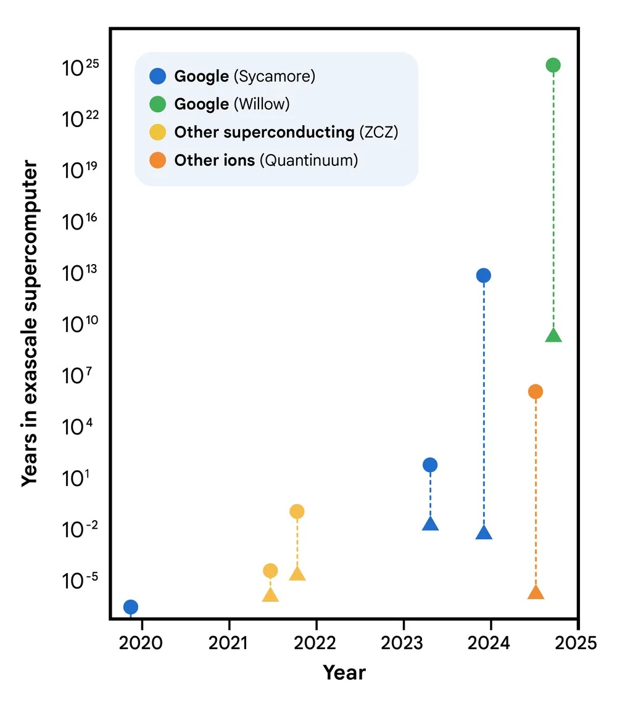
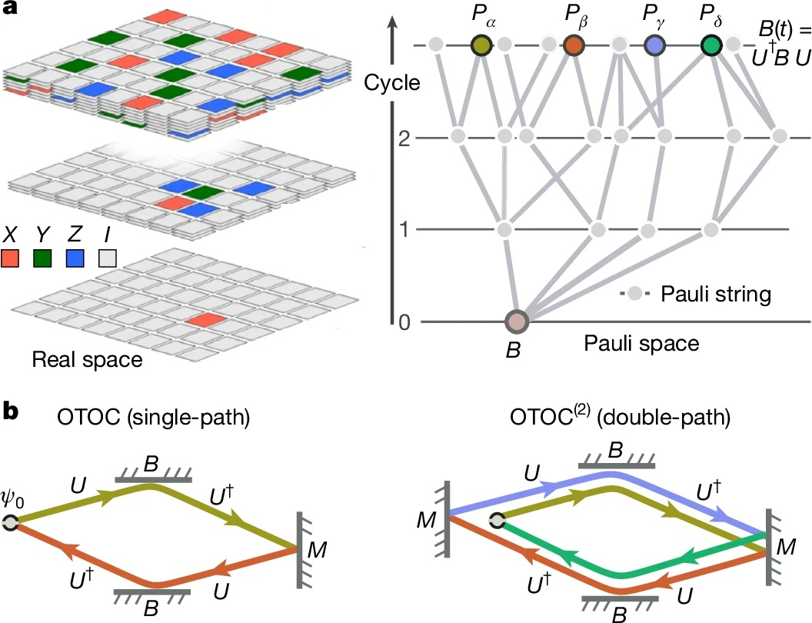
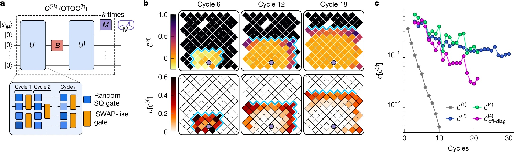
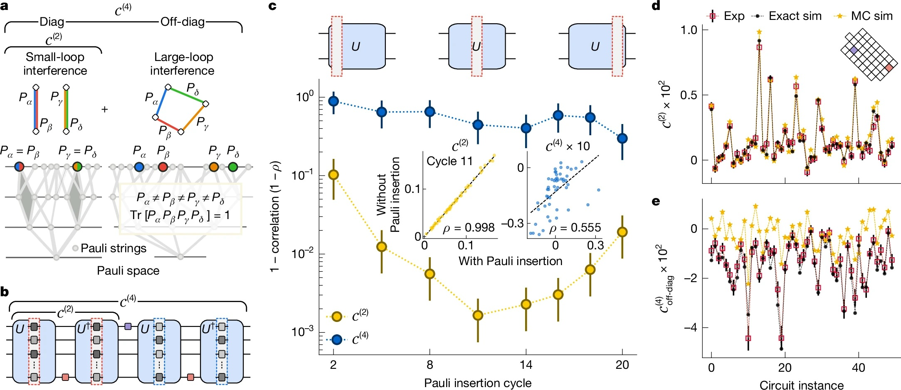

# Computers quantistici: Google presenta 'Quantum Echoes', sarà vera gloria?

*Il 22 ottobre 2025, Google ha pubblicato su [Nature](https://www.nature.com/articles/s41586-025-09526-6) uno studio che segna probabilmente il passaggio più significativo nella storia del calcolo quantistico: dal "possiamo fare qualcosa di impressionante ma fondamentalmente inutile" al "possiamo fare qualcosa di scientificamente rilevante". L'algoritmo Quantum Echoes, eseguito sul chip [Willow](https://blog.google/technology/research/google-willow-quantum-chip/) da 105 qubit, ha dimostrato per la prima volta un vantaggio quantistico verificabile su un problema reale, calcolando strutture molecolari 13.000 volte più velocemente del supercomputer Frontier, attualmente il più potente al mondo. Ma attenzione: prima di immaginare computer quantistici che rivoluzionano la chimica farmaceutica già domani mattina, vale la pena comprendere cosa significhi davvero questo annuncio, quali siano i suoi limiti concreti e perché alcuni ricercatori rimangono scettici.*

## L'evoluzione di Willow: dal dicembre 2024 a oggi

Per capire Quantum Echoes dobbiamo prima fare un passo indietro di dieci mesi. Nel dicembre 2024, Google aveva annunciato il chip Willow, un processore quantistico da 105 qubit superconduttori che rappresentava un salto qualitativo rispetto al precedente Sycamore da 53 qubit, quello usato nel controverso esperimento del 2019 sulla "supremazia quantistica". Willow aveva dimostrato la capacità di operare sotto la soglia critica di correzione degli errori: più qubit aggiungi, meno errori ottieni. Un risultato fondamentale perché ribaltava quello che fino ad allora era stato il tallone d'Achille del calcolo quantistico, dove ogni qubit aggiuntivo significava tradizionalmente più rumore e instabilità.

Il chip [Willow utilizzato negli esperimenti](https://blog.google/technology/research/quantum-hardware-verifiable-advantage/) presentava una vita media degli stati eccitati (T₁) di 106 microsecondi e un tempo di coerenza (T₂E) di 130 microsecondi, con un errore medio delle porte a due qubit dello 0,15%. Numeri che sulla carta potrebbero sembrare marginali, ma che nella pratica dei sistemi quantistici rappresentano la differenza tra il successo e il fallimento di un calcolo complesso. Per dare un'idea della scala temporale: questi qubit mantengono la loro coerenza per poco più di un decimo di millisecondo, un'eternità rispetto ai primi esperimenti ma ancora un battito di ciglia rispetto ai tempi del calcolo classico.

[Immagine tratta dal nature.com ](https://www.nature.com/articles/s41586-025-09526-6)

## L'algoritmo dell'eco: tornare indietro nel tempo quantistico

Il cuore di Quantum Echoes è un algoritmo che sfrutta una proprietà controintuitiva della meccanica quantistica: la reversibilità temporale. Pensate a una goccia che cade in uno stagno. Le onde si propagano verso l'esterno in cerchi concentrici sempre più ampi, perdendo intensità. Nel mondo classico, invertire questo processo è impossibile: non potete far convergere spontaneamente le onde verso il centro per ricostruire la goccia iniziale. Nel mondo quantistico, invece, è possibile. O meglio, è possibile se sapete esattamente come invertire ogni singola operazione che avete compiuto.

Gli scienziati di Google hanno implementato quello che tecnicamente si chiama [out-of-time-order correlator di secondo ordine](https://research.google/blog/a-verifiable-quantum-advantage/) (OTOC(2)), ma che è più intuitivo immaginare come un esperimento di "echo sonar quantistico". Come racconta il [blog ufficiale di Google](https://blog.google/technology/research/quantum-echoes-willow-verifiable-quantum-advantage/), il processo si articola in quattro fasi: si esegue una serie di operazioni quantistiche su un array di qubit, si perturba deliberatamente un singolo qubit specifico, si inverte esattamente la sequenza di operazioni precedente e infine si misura il risultato. Se tutto funziona perfettamente, il sistema dovrebbe tornare allo stato iniziale. Ma se la perturbazione ha avuto effetto, l'eco che torna indietro sarà diversa, e questa differenza contiene informazioni preziose su come l'informazione si è diffusa attraverso il sistema quantistico.

Il trucco elegante è che questo "eco" viene amplificato attraverso un fenomeno chiamato interferenza costruttiva: le onde quantistiche si sommano in fase, rafforzandosi reciprocamente invece di annullarsi. È un po' come quando due onde d'acqua si incontrano nel punto giusto e creano un'onda più alta. Nel mondo quantistico, questo effetto rende le misurazioni incredibilmente sensibili ai dettagli microscopici del sistema.

Per rendere l'idea con una metafora, pensate al gioco di Mr. Driller, quel puzzle game giapponese dove scavate attraverso strati di blocchi colorati: più scendete in profondità, più complessa diventa la struttura che dovete attraversare. Nell'algoritmo Quantum Echoes, il sistema quantistico "scava" attraverso strati sempre più profondi di correlazioni tra qubit, e quando inverte il percorso deve riuscire a tornare esattamente al punto di partenza attraversando la stessa complessità. La perturbazione è come un blocco di colore diverso inserito a metà percorso: se quando torni indietro quel blocco ha alterato il percorso, lo capisci dall'eco che ricevi.

## I numeri che contano: 13.000x più veloce, ma su cosa?

Qui arriviamo al punto cruciale, quello che separa l'hype dalla realtà. Google afferma che il suo algoritmo è 13.000 volte più veloce di Frontier, il supercomputer più potente al mondo con i suoi 1,2 exaflops di potenza di calcolo. Suona impressionante, ma cosa significa esattamente?

Gli esperimenti pubblicati su [Nature](https://www.nature.com/articles/s41586-025-09526-6) hanno utilizzato circuiti quantistici con 65 qubit attivi, per un totale di 23 cicli di operazioni. Il team di Google ha misurato valori di OTOC(2) che hanno richiesto circa 2,1 ore di tempo di raccolta dati per circuito sul chip Willow. Utilizzando algoritmi di contrazione tensoriale altamente ottimizzati su Frontier, lo stesso calcolo richiederebbe circa 3,2 anni per singolo punto dati. Il fattore 13.000x deriva esattamente da questo confronto: circa 28.000 ore (3,2 anni) divise per 2,1 ore.

Ma qui entra in gioco la prima grande critica, sollevata proprio sulla rivista [Nature](https://www.nature.com/articles/d41586-025-03300-4) da Dries Sels, fisico quantistico della New York University: "L'onere della prova dovrebbe essere elevato. Anche se il paper fa un lavoro serio nel testare vari algoritmi classici, non c'è dimostrazione che non esista un algoritmo efficiente". In altre parole, il fatto che oggi non conosciamo un modo più veloce per fare questi calcoli su un computer classico non significa che tale modo non esista. È la stessa critica che era stata mossa all'esperimento di supremazia quantistica del 2019.

Il team di Google ha però fatto un lavoro più approfondito questa volta. Come dettagliato nel [paper tecnico](https://research.google/blog/a-verifiable-quantum-advantage/), hanno testato nove diversi algoritmi classici di simulazione, spendendo l'equivalente di dieci anni-persona nel tentativo di trovare scorciatoie classiche (quello che nel gergo viene chiamato "red teaming"). Hanno utilizzato tecniche di Monte Carlo quantistico, reti tensoriali, algoritmi di Monte Carlo con cache e altre strategie avanzate. Nessuna è riuscita a eguagliare l'accuratezza del processore quantistico nel regime considerato.

[Immagine tratta dal nature.com (OTOCs as interferometers.)](https://www.nature.com/articles/s41586-025-09526-6)

## Dall'esperimento molecolare alla realtà

Ma Quantum Echoes non è solo un esercizio astratto di calcolo. La dimostrazione più interessante è quella che riguarda lo studio di molecole reali, condotta in [partnership con l'Università di Berkeley](https://quantumai.google/static/site-assets/downloads/quantum-computation-molecular-geometry-via-nuclear-spin-echoes.pdf). Il team ha studiato due molecole organiche: il toluene marcato con carbonio-13 (15 atomi) e il 3',5'-dimetilbifenile (28 atomi), entrambe sospese in cristalli liquidi nematici.

L'idea è di estendere una tecnica chiamata risonanza magnetica nucleare (NMR), la stessa fisica dietro alle macchine per la risonanza magnetica degli ospedali. La NMR funziona come un "microscopio molecolare" che permette di vedere la posizione relativa degli atomi misurando come i nuclei atomici interagiscono magneticamente tra loro. Il problema è che quando due nuclei sono troppo distanti, circa oltre 6 Ångström (un decimiliardesimo di metro), il loro accoppiamento diventa troppo debole per essere misurato con tecniche convenzionali.

Qui entra in gioco Quantum Echoes. Simulando la dinamica degli spin nucleari sul chip quantistico e confrontando i risultati con i dati sperimentali da NMR, i ricercatori sono riusciti a determinare parametri strutturali delle molecole con una precisione comparabile a quella di tecniche spettroscopiche indipendenti. Per il toluene, hanno stimato la distanza media tra gli atomi di idrogeno in posizione orto e meta del benzene con un errore di appena 0,01 Ångström. Per il dimetilbifenile, hanno determinato la distribuzione dell'angolo diedrico tra i due anelli benzenici, un parametro cruciale per comprendere la conformazione molecolare.

La validazione è stata fatta confrontando i risultati quantistici con esperimenti di spettroscopia a coerenza quantistica multipla su un campione deuterato indipendente. I dati concordano entro le barre d'errore, dimostrando che l'approccio funziona, almeno in linea di principio.

## Le applicazioni promesse: dal laboratorio alla farmacia?

Google dipinge scenari ambiziosi. Hartmut Neven, capo del laboratorio quantistico di Google a Santa Barbara, ha dichiarato durante il briefing per la stampa che "questo algoritmo offre l'opportunità per applicazioni nel mondo reale" e che l'azienda è ottimista sul fatto che entro cinque anni ci saranno usi pratici per i computer quantistici.

Gli ambiti promessi spaziano dalla scoperta di farmaci alla scienza dei materiali. In particolare, l'algoritmo potrebbe aiutare a determinare come potenziali medicine si legano ai loro bersagli biologici, una delle sfide più computazionalmente intensive della chimica farmaceutica. Oppure potrebbe caratterizzare la struttura molecolare di nuovi materiali come polimeri avanzati, componenti per batterie o persino i materiali che compongono gli stessi qubit quantistici.

Ma qui entrano in gioco i distinguo cruciali. Come ha sottolineato [Tom O'Brien](https://blog.google/technology/research/quantum-echoes-willow-verifiable-quantum-advantage/), ricercatore di Google Quantum AI a Monaco, "applicare l'algoritmo Quantum Echoes a sistemi più complessi richiederà hardware meno rumoroso o metodi per correggere gli errori che sono ancora in fase di sviluppo". In altre parole, quello che funziona su toluene e dimetilbifenile non scala automaticamente a proteine con centinaia di aminoacidi o cristalli con migliaia di atomi.

James Whitfield, fisico quantistico del Dartmouth College, è stato ancora più esplicito nella sua intervista a [Nature](https://www.nature.com/articles/d41586-025-03300-4): "L'avanzamento tecnico è impressionante, ma è un po' forzato pensare che questo risolverà improvvisamente qualche problema economicamente rilevante".

Il limite fondamentale è che per ora l'algoritmo funziona solo su molecole abbastanza semplici da poter essere simulate efficientemente anche in modo classico. Il [preprint sottomesso ad arXiv](https://quantumai.google/static/site-assets/downloads/quantum-computation-molecular-geometry-via-nuclear-spin-echoes.pdf) ammette candidamente: "A causa della complessità intrinseca della simulazione di sistemi reali e dei limiti di performance del nostro chip attuale, questa dimostrazione iniziale non è ancora oltre-classica".

[Immagine tratta dal nature.com (Sensitivity of OTOCs towards microscopic details of quantum dynamics.)](https://www.nature.com/articles/s41586-025-09526-6)

## Quantum advantage vs quantum supremacy: differenze sostanziali

Vale la pena fermarsi un momento sulla differenza tra quanto fatto nel 2019 e quanto dimostrato oggi. Nel 2019, con il chip Sycamore, Google aveva dimostrato la cosiddetta "quantum supremacy" (ora più comunemente chiamata "quantum computational advantage"): aveva eseguito in 200 secondi un calcolo che avrebbe richiesto 10.000 anni al supercomputer più potente dell'epoca. Suonava spettacolare, e tecnicamente lo era, ma c'era un problema: il calcolo in questione era completamente privo di utilità pratica. Si trattava di campionare stringhe casuali da uno stato quantistico altamente caotico, un problema progettato appositamente per essere difficile per i computer classici ma facile per quelli quantistici.

Come spiegato nel [paper su Nature](https://www.nature.com/articles/s41586-025-09526-6), con il Random Circuit Sampling "la stessa stringa binaria non appare mai due volte in un sistema quantistico grande, limitando la sua capacità di rivelare informazioni utili". Era l'equivalente di dimostrare che la vostra auto di Formula 1 può battere qualsiasi altra auto su un circuito disegnato appositamente per favorirla, ma su cui nessuno vorrebbe mai correre per motivi pratici.

Quantum Echoes è diverso perché misura valori di aspettazione quantistici, cioè quantità fisiche reali come corrente, velocità, magnetizzazione o densità. Questi valori sono verificabili: se ripeti l'esperimento su un altro computer quantistico di pari qualità, dovresti ottenere lo stesso risultato. E soprattutto, sono rilevanti per descrivere sistemi fisici reali, dalle molecole ai magneti ai buchi neri (sì, l'algoritmo OTOC ha applicazioni anche nella fisica teorica dei buchi neri, ma questo è un altro discorso).

La verificabilità è la chiave. Xiao Mi e Kostyantyn Kechedzhi, ricercatori di Google Quantum AI e autori principali dello [studio tecnico](https://research.google/blog/a-verifiable-quantum-advantage/), sottolineano che "a differenza delle stringhe binarie, i valori di aspettazione quantistici sono risultati computazionali verificabili che rimangono gli stessi quando eseguiti su computer quantistici diversi". Questo apre una strada diretta verso l'uso di OTOC per risolvere problemi del mondo reale usando computer quantistici che non sono possibili da risolvere su computer classici.

## I tre milestone e la strada verso il futuro

Google Quantum AI ha una roadmap pubblica con diversi traguardi da raggiungere. Il team afferma di aver superato tre milestone fondamentali: la capacità di eseguire circuiti quantistici complessi con basso tasso d'errore, la dimostrazione di correzione degli errori sotto-soglia con Willow, e ora questo primo vantaggio quantistico verificabile su un problema con potenziale applicazione pratica.

Il prossimo obiettivo, quello che chiamano "Milestone 3" nella loro [roadmap pubblica](https://quantumai.google/roadmap), è raggiungere un qubit logico longevo, cioè un qubit protetto da correzione d'errore che possa mantenere la sua informazione per tempi sufficientemente lunghi da permettere calcoli complessi. Solo a quel punto si potrà parlare di calcolo quantistico fault-tolerant, resistente agli errori, il Santo Graal del settore.

La tempistica dei cinque anni citata da Neven per applicazioni pratiche è ambiziosa ma non del tutto irrealistica. Il problema è che dipende da una serie di "se" significativi: se riusciranno a scalare il numero di qubit mantenendo la qualità, se riusciranno a implementare la correzione d'errore in modo efficiente, se riusciranno a sviluppare algoritmi più raffinati, se il rumore hardware continuerà a diminuire.

Un aspetto interessante, spesso trascurato nel dibattito pubblico, è che il team ha utilizzato [AlphaEvolve](https://quantumai.google/static/site-assets/downloads/quantum-computation-molecular-geometry-via-nuclear-spin-echoes.pdf), un agente di coding basato su modelli linguistici di grandi dimensioni, per ottimizzare la compilazione dei circuiti quantistici per l'esperimento sul dimetilbifenile. L'algoritmo evolutivo è riuscito a ridurre l'errore medio dal 10,4% allo 0,82% generando formule prodotto più efficienti rispetto al primo ordine di Trotter standard. È un esempio di come l'IA stia già giocando un ruolo nel migliorare l'efficienza degli algoritmi quantistici.

[Immagine tratta dal nature.com (Quantum interference and classical simulation complexity of OTOC)](https://www.nature.com/articles/s41586-025-09526-6)

## Le criticità nascoste nei dettagli tecnici

Scavando nei supplementi tecnici del paper emergono dettagli che ridimensionano l'entusiasmo. Per mitigare gli errori hardware, il team ha dovuto implementare una pipeline di quattro stadi che include filtri double-sided light cone, extrapolazione zero-noise basata sui percorsi di Pauli, sequenze di disaccoppiamento dinamico e twirling dei gate sub-Clifford. In pratica, hanno dovuto applicare una batteria di correzioni software per estrarre un segnale pulito da dati molto rumorosi.

Nei circuiti più profondi per la molecola a 15 spin, il segnale grezzo misurato era appena 0,055 ± 0,003, un valore estremamente piccolo sommerso nel rumore. Solo attraverso sofisticate tecniche di mitigazione degli errori sono riusciti a estrarre dati utilizzabili. Questo solleva una domanda legittima: quanto di questo "vantaggio quantistico" è intrinseco alla fisica quantistica e quanto è semplicemente una dimostrazione di eccellente ingegneria del software di correzione?

Un altro aspetto critico riguarda l'errore di Trotterizzazione. L'algoritmo non simula la dinamica molecolare esatta, ma una sua approssimazione discreta chiamata formula di Trotter. L'errore introdotto da questa approssimazione è stimato essere circa 0,035 per il toluene, che si somma all'errore sperimentale residuo di 0,050 dopo la mitigazione. Questo porta a un errore quadratico medio totale di 0,058 tra i dati quantistici e la simulazione classica esatta. Non è male, ma non è nemmeno trascurabile.

Inoltre, i circuiti più profondi usati richiedevano fino a 1.080 gate a due qubit per simulare i primi sei step temporali della curva OTOC del toluene. Con un errore medio per gate a due qubit di circa 0,15%, l'errore si accumula rapidamente. È il motivo per cui Tom O'Brien ha ammesso che servono hardware meno rumorosi per andare oltre questi sistemi giocattolo.

## AlphaEvolve e l'ottimizzazione degli algoritmi

Un contributo spesso sottovalutato in questo lavoro è l'uso di AlphaEvolve per ottimizzare i circuiti quantistici, particolarmente per l'esperimento sul dimetilbifenile. AlphaEvolve è un agente di coding evolutivo che sfrutta modelli linguistici per scoprire soluzioni efficienti a problemi scientifici complessi.

Il processo parte da un programma scritto da umani (una formula di Trotter del primo ordine) che funge da soluzione iniziale. Attraverso mutazione, valutazione e selezione, AlphaEvolve genera una popolazione di programmi che producono circuiti con errore di approssimazione significativamente inferiore rispetto al riferimento, passando da un errore medio del 10,4% allo 0,82%, pur rimanendo sotto il budget di gate imposto dall'hardware.

La cosa interessante è che il sistema non genera circuiti direttamente, ma scrive codice Python che costruisce circuiti. Questo ha due vantaggi chiave: il codice risultante può generalizzare a parametri e tempi fuori dal set di addestramento, e il codice può essere analizzato e compreso dagli umani. Esaminando il supplemento tecnico, emerge che AlphaEvolve ha implementato una miscela di pruning del cono di luce, ordinamento di termini e qubit, step temporali adattivi e rescaling dei termini basato sulla distanza, alcune delle quali tecniche erano già state suggerite in letteratura.

Questo solleva una questione filosofica interessante: se abbiamo bisogno dell'IA per ottimizzare gli algoritmi quantistici da far girare su computer quantistici, stiamo davvero semplificando i problemi o stiamo solo aggiungendo strati di complessità?

## Il problema della scalabilità

La domanda che tutti dovrebbero porsi è: questo scala? La risposta breve è: non lo sappiamo ancora. Gli stessi autori del preprint molecolare [ammettono](https://quantumai.google/static/site-assets/downloads/quantum-computation-molecular-geometry-via-nuclear-spin-echoes.pdf) che "stime suggeriscono distanze accessibili di 20-60 Ångström per misurazioni basate su OTOC, avvicinandosi alla scala di lunghezza del trasferimento di energia per risonanza di Förster (FRET)". Questo porrebbe la tecnica oltre la portata di approcci NMR all'avanguardia come PDSD, REDOR e RFDR, tutte tecniche che non usano inversione temporale.

Ma c'è un "ma" grosso come una casa. Per sistemi con 50 spin, le stime degli errori di Trotter suggeriscono che metodi ingenui richiederebbero da 100.000 a un milione di gate. È un divario grande ma non astronomico rispetto ai requisiti hardware attuali, dato che si selezionano attentamente i problemi. Come dicono gli autori: "Non ci aspettiamo che questo divario venga superato solo dall'hardware fisico". Serve un progresso algoritmico sostanziale.

La fisica molecolare presenta anche sfide specifiche. Il team ha dovuto trattare l'Hamiltoniana dipolare completamente accoppiata con una rete di swap, una tecnica che permette di compilare gate di swap attraverso un pattern "brick wall" di interazioni a due qubit. Questo è ottimale in termini sia del numero di gate sia della profondità richiesta, ma scala male al crescere del numero di spin. Per il toluene, hanno ulteriormente approssimato che lo spin del carbonio-13 interagisse solo con il protone più vicino, riducendo il numero di gate del 17%. Questa approssimazione era giustificata perché tutti gli altri accoppiamenti erano due ordini di grandezza più piccoli, ma non sarà sempre possibile fare semplificazioni simili.

## L'hardware: un capolavoro di ingegneria superconduttiva

Vale la pena dedicare qualche parola all'hardware sottostante. I qubit di Willow sono circuiti superconduttori di tipo transmon, basicamente minuscoli oscillatori elettrici che operano a frequenze attorno ai 6,2 GHz con anarmonicità di circa 210 MHz. Vengono raffreddati a temperature prossime allo zero assoluto, circa 15 millikelvin, usando refrigeratori a diluizione criogenici.

Per l'esperimento sul toluene, hanno implementato 80 gate fSim (fermionic simulation) unici attraverso tutto il landscape dei parametri. A differenza di lavori precedenti che usavano un singolo impulso, qui hanno adottato un approccio a due impulsi: il primo impulso stabilisce l'angolo di swap e induce una fase condizionale spuria di meno di 100 millirad, mentre un secondo impulso realizza una fase condizionale e uno swap spurio di circa 30 millirad.

La calibrazione è intensiva ma fornisce performance e flessibilità superiori rispetto all'approccio a impulso singolo. Hanno adattato tecniche di calibrazione periodica "Floquet" ad alta precisione, raggiungendo angoli target con una tolleranza massima di 20 millirad e un errore tipico inferiore a 5 millirad. L'errore XEB mediano per i gate fSim calibrati era 0,0026, con un massimo di 0,0045.

Per l'esperimento sul dimetilbifenile a 15 qubit, hanno invece usato una decomposizione basata su gate CZ, che non richiedeva la costruzione fSim dettagliata sopra descritta. Questo dimostra la flessibilità dell'approccio architetturale di Google.

## Il confronto con D-Wave e altri approcci

È interessante notare che Google non è l'unica azienda a rivendicare progressi recenti nel calcolo quantistico. D-Wave Systems, che usa un approccio completamente diverso basato sull'annealing quantistico invece che sui gate quantistici universali, ha pubblicato a marzo 2025 su Science risultati su simulazioni magnetiche quantistiche che affermano vadano oltre le capacità di simulazione classica.

L'approccio di D-Wave è fondamentalmente diverso: invece di costruire circuiti quantistici con gate universali, usa un sistema di qubit che si "annealano" verso lo stato di minima energia, una tecnica utile per problemi di ottimizzazione. Non è chiaro quale approccio prevarrà nel lungo termine, o se entrambi avranno nicchie applicative distinte.

Un'altra differenza cruciale rispetto ai sistemi a ioni intrappolati (come quelli sviluppati da IonQ o Quantinuum) è la velocità delle operazioni. I qubit superconduttori operano su scale temporali di nanosecondi, mentre gli ioni intrappolati richiedono microsecondi per gate. Questo vantaggio in velocità viene però pagato con tempi di coerenza più brevi e tassi d'errore generalmente più alti. È il classico trade-off ingegneristico.

## Le implicazioni per la crittografia: quando preoccuparsi davvero?

Ogni annuncio di progressi nel calcolo quantistico solleva inevitabilmente timori sulla sicurezza della crittografia attuale. Vale la pena chiarire: questo esperimento non ha nulla a che vedere con la rottura della crittografia RSA o ellittica. L'algoritmo di Shor per fattorizzare numeri grandi richiederebbe migliaia o milioni di qubit logici con correzione d'errore completa, e siamo ancora molto lontani da quello scenario.

Tuttavia, il fatto che Google stia facendo progressi costanti sulla correzione degli errori e la qualità dei qubit è un segnale che l'industria dovrebbe prendere sul serio la migrazione verso algoritmi post-quantistici. Il NIST ha già standardizzato diversi algoritmi resistenti ai quantum, e molte organizzazioni stanno iniziando la transizione. Il consiglio è: non fatevi prendere dal panico oggi, ma nemmeno rimandare la pianificazione a domani.

## Verificabilità e riproducibilità: la scienza fatta bene

Un aspetto positivo spesso trascurato è che Google ha reso disponibili [i dati grezzi e i circuiti quantistici su Zenodo](https://doi.org/10.5281/zenodo.15640502), permettendo ad altri ricercatori di verificare e riprodurre i risultati. Hanno anche pubblicato il codice sorgente per le stime di costo della contrazione tensoriale su [GitHub](https://github.com/google-research/tnco) sotto licenza open source.

Questo è scienza fatta nel modo giusto, dove la trasparenza e la riproducibilità sono messe al primo posto. Non sempre è così nel settore del calcolo quantistico, dove alcuni annunci aziendali hanno peccato di opacità. Il fatto che il lavoro sia stato sottoposto a peer review rigorosa su Nature, con referee che hanno sollevato obiezioni significative (come documentato nella versione pubblicata), è un altro punto a favore della credibilità.

## Prospettive realistiche: cosa aspettarsi nei prossimi anni

Quindi, tirando le somme, cosa possiamo aspettarci nei prossimi cinque anni? Probabilmente vedremo progressi incrementali su più fronti: chip con più qubit e tassi d'errore più bassi, algoritmi meglio ottimizzati, tecniche di mitigazione degli errori più sofisticate e prime applicazioni di nicchia dove il vantaggio quantistico è abbastanza grande da giustificare i costi e la complessità.

Gli ambiti più promettenti nel breve termine sono probabilmente la simulazione di sistemi quantistici naturali (proprio come dimostrato qui con la spettroscopia NMR), l'ottimizzazione di problemi specifici in chimica computazionale e forse alcune applicazioni in machine learning quantistico. Non aspettatevi rivoluzioni immediate nella scoperta di farmaci o nella progettazione di batterie, ma piuttosto contributi incrementali che accelerano ricerche già in corso.

La timeline di cinque anni di Neven per applicazioni pratiche è plausibile se intendiamo "pratica" in senso accademico-scientifico: aiutare ricercatori a rispondere a domande che altrimenti richiederebbero troppo tempo o risorse. Se invece intendiamo "pratica" nel senso di prodotti commerciali che impattano la vita quotidiana, probabilmente siamo più vicini ai dieci-quindici anni.

## Il ruolo della dinamica molecolare e la correzione dei modelli

Un aspetto sottile ma cruciale emerso dall'esperimento sul dimetilbifenile riguarda come Quantum Echoes possa aiutare a correggere le approssimazioni delle simulazioni di dinamica molecolare classiche. I ricercatori hanno usato il campo di forze GAFF 2.11 combinato con parametri legati da Grappa 1.3.1 per simulare il comportamento della molecola nel cristallo liquido 5CB.

Il problema è che i parametri di ordine dei cristalli liquidi sono sensibili alla temperatura e difficili da modellare accuratamente con la dinamica molecolare. Le simulazioni tendono a sottostimare o sovrastimare certi gradi di libertà. Qui entra in gioco l'idea dell'apprendimento Hamiltoniano: si confrontano i dati OTOC sperimentali con simulazioni quantistiche di Hamiltoniane parametrizzate, e si ottimizzano i parametri finché i dati simulati non corrispondono all'esperimento reale.

Come descritto nel [preprint su arXiv](https://quantumai.google/static/site-assets/downloads/quantum-computation-molecular-geometry-via-nuclear-spin-echoes.pdf), questo approccio ha permesso di stimare l'angolo diedrico medio del dimetilbifenile con una precisione simile a quella della spettroscopia MQC indipendente, migliorando le previsioni della dinamica molecolare grezza di un fattore quattro in termini di errore quadratico medio.

Questo suggerisce un possibile paradigma futuro: usare simulazioni classiche economiche per ottenere una prima approssimazione della struttura molecolare, poi raffinare i parametri critici usando misurazioni OTOC elaborate da computer quantistici. Non è una rivoluzione, ma è un esempio concreto di come il calcolo quantistico potrebbe inserirsi in workflow scientifici esistenti.

## L'elefante nella stanza: il costo energetico

Una domanda che raramente viene posta negli annunci entusiastici è: quanto costa in termini energetici far funzionare un computer quantistico? I refrigeratori a diluizione che mantengono i qubit superconduttori a 15 millikelvin consumano decine di kilowatt di potenza elettrica continuamente. L'infrastruttura criogenica, gli elettronizzatori, i sistemi di controllo, tutto questo ha un'impronta energetica significativa.

Confrontare direttamente con i supercomputer è complicato perché Frontier consuma circa 21 megawatt quando è a pieno regime, ma opera su migliaia di nodi in parallelo e può eseguire molti compiti diversi simultaneamente. Un singolo chip quantistico, per quanto impressionante, esegue un calcolo alla volta e richiede comunque un'infrastruttura di supporto classica sostanziale.

Questo non è un argomento contro il calcolo quantistico, ma un promemoria che i confronti "13.000x più veloce" sono sempre parziali. Nella vita reale, l'efficienza si misura anche in joule per operazione, in costi operativi totali, in tempo necessario per programmare e calibrare il sistema. Sono tutti fattori che al momento favoriscono pesantemente i sistemi classici per la stragrande maggioranza delle applicazioni.

## La questione del sign problem e la complessità classica

Uno degli aspetti tecnici più interessanti, seppellito nei supplementi del paper di Nature, riguarda il cosiddetto "sign problem" nel calcolo di OTOC(2). I ricercatori hanno dimostrato che l'interferenza costruttiva tra loop di Pauli strings di area arbitrariamente grande crea una barriera fondamentale per gli algoritmi classici di campionamento Monte Carlo quantistico.

Il problema dei segni è un ostacolo noto nella fisica computazionale: quando si cerca di calcolare somme dove i termini possono essere sia positivi che negativi (o più precisamente, hanno fasi complesse arbitrarie), gli algoritmi stocastici classici falliscono perché le cancellazioni tra termini grandi di segno opposto portano a risultati piccoli con errori statistici enormi.

Come spiegato nel [supplemento tecnico](https://www.nature.com/articles/s41586-025-09526-6), hanno mappato l'OTOC(2) medio sui circuiti a un modello magnetico con la struttura del gruppo simmetrico di ordine 4, e hanno mostrato numericamente che il problema dei segni in questo modello è severo. Questo suggerisce che il problema dei segni è una caratteristica inevitabile che presenta una barriera per gli algoritmi classici di campionamento quando si calcola OTOC(2).

Questo è uno dei pezzi più solidi dell'argomentazione per il vantaggio quantistico: non si tratta solo di "non abbiamo trovato un algoritmo classico migliore", ma di "ci sono ragioni teoriche fondamentali per cui certi algoritmi classici non possono funzionare". Naturalmente, questo non esclude che esista qualche algoritmo classico completamente diverso che aggiri il problema, ma rende l'affermazione più robusta.

## La metafora del righello molecolare

Una delle descrizioni più efficaci fornite dal team di Google è quella del "righello molecolare quantistico". La NMR convenzionale può misurare distanze tra nuclei atomici fino a circa 6 Ångström per coppie di carbonio-13. Oltre questa distanza, l'accoppiamento dipolare diventa troppo debole per essere risolto.

L'idea dietro Quantum Echoes applicato alla NMR è che invece di guardare singoli accoppiamenti, si osserva come la polarizzazione si propaga attraverso l'intera rete di spin nucleari. È un po' come passare dal misurare distanze con una corda tesa (che funziona solo per distanze brevi) al lanciare un sasso in uno stagno e cronometrare quanto ci vuole perché le onde raggiungano punti diversi (che può funzionare per distanze maggiori).

Il limite teorico stimato per le distanze accessibili con questo approccio è 20-60 Ångström, avvicinandosi alla scala di tecniche completamente diverse come il trasferimento di energia per risonanza di Förster (FRET) usato in biologia. Se questo venisse realizzato in pratica, aprirebbe possibilità genuine per studiare strutture proteiche complesse, assemblamenti molecolari e altri sistemi dove i vincoli di distanza a lungo raggio sono cruciali ma difficili da ottenere.

Tuttavia, c'è un abisso tra "stimato in principio" e "dimostrato sperimentalmente". Per ora, gli esperimenti hanno validato il concetto su sistemi che possono ancora essere simulati classicamente. Il prossimo passo critico sarebbe dimostrare l'utilità su un sistema dove la simulazione classica fallisce ma il metodo quantistico funziona ancora in modo affidabile.

## L'ecosistema più ampio: cosa stanno facendo gli altri

Mentre Google faceva questi progressi, il resto dell'ecosistema quantistico non è rimasto fermo. IBM ha recentemente annunciato progressi significativi nel suo chip Heron con 133 qubit e tassi d'errore competitivi. La loro roadmap punta a raggiungere 1.000+ qubit entro il 2026. Rigetti Computing sta sviluppando architetture modulari che potrebbero essere più facilmente scalabili. PsiQuantum sta lavorando su qubit fotonici a temperatura ambiente, un approccio radicalmente diverso che evita completamente la criogenia.

Nel frattempo, aziende come Atom Computing e QuEra stanno esplorando qubit a atomi neutri, che promettono tempi di coerenza molto più lunghi rispetto ai superconduttori ma con velocità di gate più lente. Microsoft sta investendo pesantemente nei qubit topologici basati su fermioni di Majorana, un approccio che potrebbe offrire protezione intrinseca dagli errori ma è ancora in fase di ricerca fondamentale.

Questa diversità di approcci è salutare. Non è ancora chiaro quale architettura prevarrà, e probabilmente diverse tecnologie troveranno nicchie applicative diverse. I superconduttori di Google sono ottimi per velocità e flessibilità ma soffrono di tempi di coerenza brevi. Gli ioni intrappolati hanno coerenza eccellente ma sono lenti. I fotoni operano a temperatura ambiente ma sono difficili da far interagire. È la tipica fase di esplorazione tecnologica dove molteplici soluzioni competono.

## Le domande che rimangono aperte

Chiudiamo con le domande oneste che ogni persona razionale dovrebbe porsi di fronte a questo annuncio:

**Primo**: questo risultato è riproducibile da team indipendenti? Finora solo Google ha l'hardware necessario per verificarlo. Sarebbe importante vedere laboratori accademici o altri attori industriali replicare esperimenti simili su hardware diverso.

**Secondo**: la tecnica scala davvero a sistemi interessanti? Gli autori stessi ammettono che servono progressi sostanziali sia nell'hardware che negli algoritmi. La distanza tra simulare toluene e simulare una proteina funzionale è enorme.

**Terzo**: esistono davvero applicazioni dove il vantaggio quantistico è abbastanza grande da giustificare i costi e la complessità? Per ora la risposta è "forse, in nicchie molto specifiche". Tra cinque anni potrebbe cambiare, ma non è garantito.

**Quarto**: quanto di questo progresso è trasferibile ad altre architetture quantistiche? Gli algoritmi OTOC sono generali, ma le tecniche di mitigazione degli errori e ottimizzazione sviluppate per i superconduttori potrebbero non funzionare bene su ioni intrappolati o altri sistemi.

**Quinto**: ci sono applicazioni killer che non abbiamo ancora immaginato? La storia della tecnologia è piena di invenzioni che hanno trovato usi completamente inaspettati. Il laser fu chiamato "una soluzione in cerca di un problema" quando venne inventato. Forse i computer quantistici troveranno la loro applicazione killer in domini che ora non stiamo nemmeno considerando.

## Conclusioni: progressi reali in un campo ostico

Quantum Echoes rappresenta un progresso genuino nel calcolo quantistico, probabilmente il più significativo degli ultimi anni in termini di rilevanza scientifica. Non è l'hype vuoto della supremazia quantistica del 2019, né è la rivoluzione imminente che alcuni titoli sensazionalistici vorrebbero farci credere.

È un passo solido verso computer quantistici che possono contribuire a risolvere problemi scientifici reali, anche se ancora su scale limitate e con molte riserve. La strada verso computer quantistici universali che superano i classici su una vasta gamma di applicazioni pratiche rimane lunga e incerta. Ma per la prima volta, sembra che stiamo camminando su un sentiero reale invece che girare in cerchio su un terreno astratto.

Il fatto che l'algoritmo sia verificabile, che i risultati molecolari concordino con tecniche spettroscopiche indipendenti, che il team abbia fatto uno sforzo serio per escludere scorciatoie classiche e che l'intero approccio si inserisca in workflow scientifici esistenti sono tutti segnali positivi. Non è la fine del viaggio, probabilmente nemmeno la metà, ma è un punto di riferimento tangibile che possiamo prendere sul serio.

La comunità scientifica rimane giustamente scettica, come deve essere. Le affermazioni straordinarie richiedono prove straordinarie, e mentre Google ha fornito prove sostanziali, rimangono domande legittime sulla scalabilità, sull'utilità pratica a breve termine e sull'esistenza di potenziali algoritmi classici migliori non ancora scoperti.

Nei prossimi anni vedremo se questo lavoro segnerà davvero l'inizio dell'era dell'utilità quantistica o se si rivelerà un'altra tappa impressionante ma non decisiva in un viaggio ancora molto lungo. Per ora, possiamo dire che l'eco quantistico di Google suona decisamente più forte di prima, anche se dobbiamo ancora aspettare per capire se sta risuonando verso qualcosa di veramente rivoluzionario o se è solo un'eco più sonora in una caverna ancora molto profonda.