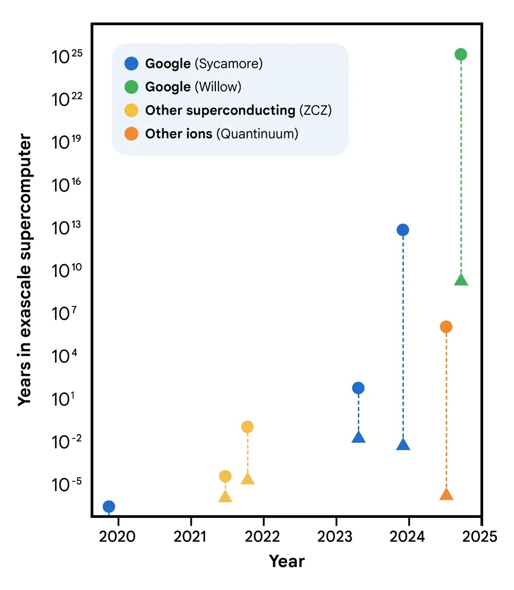

# Quantencomputer: Google präsentiert 'Quantum Echoes', wird es wahrer Ruhm sein?

*Am 22. Oktober 2025 veröffentlichte Google in [Nature](https://www.nature.com/articles/s41586-025-09526-6) eine Studie, die wahrscheinlich den bedeutendsten Wandel in der Geschichte des Quantencomputings markiert: vom "wir können etwas Beeindruckendes, aber im Grunde Nutzloses tun" zum "wir können etwas wissenschaftlich Relevantes tun". Der Quantum-Echoes-Algorithmus, ausgeführt auf dem 105-Qubit-Chip [Willow](https://blog.google/technology/research/google-willow-quantum-chip/), demonstrierte zum ersten Mal einen nachweisbaren Quantenvorteil bei einem realen Problem, indem er Molekülstrukturen 13.000 Mal schneller berechnete als der Supercomputer Frontier, der derzeit leistungsstärkste der Welt. Aber Vorsicht: Bevor man sich vorstellt, dass Quantencomputer schon morgen früh die pharmazeutische Chemie revolutionieren, lohnt es sich zu verstehen, was diese Ankündigung wirklich bedeutet, welche konkreten Grenzen sie hat und warum einige Forscher skeptisch bleiben.*

## Die Entwicklung von Willow: von Dezember 2024 bis heute

Um Quantum Echoes zu verstehen, müssen wir zunächst zehn Monate zurückgehen. Im Dezember 2024 hatte Google den Willow-Chip angekündigt, einen Quantenprozessor mit 105 supraleitenden Qubits, der einen qualitativen Sprung gegenüber dem vorherigen Sycamore mit 53 Qubits darstellte, der im umstrittenen Experiment zur "Quantenüberlegenheit" von 2019 verwendet wurde. Willow hatte die Fähigkeit bewiesen, unterhalb der kritischen Schwelle der Fehlerkorrektur zu arbeiten: Je mehr Qubits man hinzufügt, desto weniger Fehler erhält man. Ein grundlegendes Ergebnis, da es das umkehrte, was bis dahin die Achillesferse des Quantencomputings gewesen war, wo jedes zusätzliche Qubit traditionell mehr Rauschen und Instabilität bedeutete.

Der in den Experimenten verwendete [Willow-Chip](https://blog.google/technology/research/quantum-hardware-verifiable-advantage/) wies eine durchschnittliche Lebensdauer der angeregten Zustände (T₁) von 106 Mikrosekunden und eine Kohärenzzeit (T₂E) von 130 Mikrosekunden auf, mit einem durchschnittlichen Fehler der Zwei-Qubit-Gatter von 0,15 %. Zahlen, die auf dem Papier marginal erscheinen mögen, aber in der Praxis von Quantensystemen den Unterschied zwischen Erfolg und Misserfolg einer komplexen Berechnung ausmachen. Um eine Vorstellung von der Zeitskala zu geben: Diese Qubits behalten ihre Kohärenz für etwas mehr als eine Zehntelsekunde, eine Ewigkeit im Vergleich zu den ersten Experimenten, aber immer noch ein Wimpernschlag im Vergleich zu den Zeiten des klassischen Rechnens.

[Bild aus nature.com](https://www.nature.com/articles/s41586-025-09526-6)

## Der Echo-Algorithmus: Zurück in die Quantenzeit

Das Herzstück von Quantum Echoes ist ein Algorithmus, der eine kontraintuitive Eigenschaft der Quantenmechanik ausnutzt: die Zeitreversibilität. Stellen Sie sich einen Tropfen vor, der in einen Teich fällt. Die Wellen breiten sich in immer größer werdenden konzentrischen Kreisen nach außen aus und verlieren an Intensität. In der klassischen Welt ist es unmöglich, diesen Prozess umzukehren: Man kann die Wellen nicht spontan zum Zentrum konvergieren lassen, um den ursprünglichen Tropfen wiederherzustellen. In der Quantenwelt ist es jedoch möglich. Oder besser gesagt, es ist möglich, wenn man genau weiß, wie man jede einzelne durchgeführte Operation umkehrt.

Die Wissenschaftler von Google implementierten das, was technisch als [Out-of-Time-Order-Korrelator zweiter Ordnung](https://research.google/blog/a-verifiable-quantum-advantage/) (OTOC(2)) bezeichnet wird, was man sich aber intuitiver als ein "Quanten-Echolot"-Experiment vorstellen kann. Wie der [offizielle Google-Blog](https://blog.google/technology/research/quantum-echoes-willow-verifiable-quantum-advantage/) erklärt, gliedert sich der Prozess in vier Phasen: Man führt eine Reihe von Quantenoperationen an einem Qubit-Array durch, stört absichtlich ein einzelnes spezifisches Qubit, kehrt die vorherige Operationssequenz exakt um und misst schließlich das Ergebnis. Wenn alles perfekt funktioniert, sollte das System in seinen Ausgangszustand zurückkehren. Aber wenn die Störung eine Wirkung hatte, wird das zurückkehrende Echo anders sein, und dieser Unterschied enthält wertvolle Informationen darüber, wie sich die Information durch das Quantensystem ausgebreitet hat.

Der elegante Trick dabei ist, dass dieses "Echo" durch ein Phänomen namens konstruktive Interferenz verstärkt wird: Die Quantenwellen addieren sich in Phase und verstärken sich gegenseitig, anstatt sich auszulöschen. Es ist ein bisschen so, als ob zwei Wasserwellen am richtigen Punkt aufeinandertreffen und eine höhere Welle erzeugen. In der Quantenwelt macht dieser Effekt die Messungen unglaublich empfindlich für die mikroskopischen Details des Systems.

Um die Idee mit einer Metapher zu verdeutlichen, denken Sie an das Spiel Mr. Driller, dieses japanische Puzzlespiel, bei dem Sie durch Schichten von farbigen Blöcken graben: Je tiefer Sie graben, desto komplexer wird die Struktur, die Sie durchqueren müssen. Im Quantum-Echoes-Algorithmus "gräbt" das Quantensystem durch immer tiefere Schichten von Korrelationen zwischen Qubits, und wenn es den Weg umkehrt, muss es gelingen, genau zum Ausgangspunkt zurückzukehren, indem es dieselbe Komplexität durchquert. Die Störung ist wie ein andersfarbiger Block, der auf halbem Weg eingefügt wird: Wenn dieser Block auf dem Rückweg den Weg verändert hat, erkennen Sie das am Echo, das Sie erhalten.

## Die Zahlen, die zählen: 13.000x schneller, aber worauf?

Hier kommen wir zum entscheidenden Punkt, der den Hype von der Realität trennt. Google behauptet, sein Algorithmus sei 13.000 Mal schneller als Frontier, der leistungsstärkste Supercomputer der Welt mit seinen 1,2 Exaflops Rechenleistung. Das klingt beeindruckend, aber was bedeutet das genau?

Die in [Nature](https://www.nature.com/articles/s41586-025-09526-6) veröffentlichten Experimente verwendeten Quantenschaltungen mit 65 aktiven Qubits für insgesamt 23 Operationszyklen. Das Google-Team maß OTOC(2)-Werte, die etwa 2,1 Stunden Datenerfassungszeit pro Schaltung auf dem Willow-Chip erforderten. Mit hochoptimierten Tensor-Kontraktionsalgorithmen auf Frontier würde dieselbe Berechnung etwa 3,2 Jahre pro einzelnem Datenpunkt dauern. Der Faktor 13.000x ergibt sich genau aus diesem Vergleich: etwa 28.000 Stunden (3,2 Jahre) geteilt durch 2,1 Stunden.

Aber hier kommt die erste große Kritik ins Spiel, die von Dries Sels, einem Quantenphysiker an der New York University, in der Zeitschrift [Nature](https://www.nature.com/articles/d41586-025-03300-4) geäußert wurde: "Die Beweislast sollte hoch sein. Obwohl die Arbeit eine ernsthafte Prüfung verschiedener klassischer Algorithmen durchführt, gibt es keinen Beweis dafür, dass kein effizienter Algorithmus existiert." Mit anderen Worten, die Tatsache, dass wir heute keinen schnelleren Weg kennen, diese Berechnungen auf einem klassischen Computer durchzuführen, bedeutet nicht, dass es keinen solchen Weg gibt. Es ist dieselbe Kritik, die bereits dem Experiment zur Quantenüberlegenheit von 2019 entgegengebracht wurde.

Das Google-Team hat diesmal jedoch eine gründlichere Arbeit geleistet. Wie im [technischen Paper](https://research.google/blog/a-verifiable-quantum-advantage/) detailliert, testeten sie neun verschiedene klassische Simulationsalgorithmen und investierten das Äquivalent von zehn Personenjahren, um klassische Abkürzungen zu finden (was im Fachjargon als "Red Teaming" bezeichnet wird). Sie verwendeten Quanten-Monte-Carlo-Techniken, Tensor-Netzwerke, Monte-Carlo-Algorithmen mit Cache und andere fortgeschrittene Strategien. Keiner schaffte es, die Genauigkeit des Quantenprozessors im betrachteten Bereich zu erreichen.

[Bild aus nature.com (OTOCs as interferometers.)](https://www.nature.com/articles/s41586-025-09526-6)

## Vom molekularen Experiment zur Realität

Aber Quantum Echoes ist nicht nur eine abstrakte Rechenübung. Die interessanteste Demonstration betrifft die Untersuchung realer Moleküle, die in [Partnerschaft mit der University of Berkeley](https://quantumai.google/static/site-assets/downloads/quantum-computation-molecular-geometry-via-nuclear-spin-echoes.pdf) durchgeführt wurde. Das Team untersuchte zwei organische Moleküle: mit Kohlenstoff-13 markiertes Toluol (15 Atome) und 3',5'-Dimethylbiphenyl (28 Atome), beide in nematischen Flüssigkristallen suspendiert.

Die Idee ist, eine Technik namens Kernspinresonanz (NMR) zu erweitern, dieselbe Physik, die hinter den MRT-Geräten in Krankenhäusern steckt. NMR funktioniert wie ein "molekulares Mikroskop", das es ermöglicht, die relative Position von Atomen zu sehen, indem es misst, wie Atomkerne magnetisch miteinander interagieren. Das Problem ist, dass, wenn zwei Kerne zu weit voneinander entfernt sind, etwa über 6 Ångström (ein Zehnmilliardstel Meter), ihre Kopplung zu schwach wird, um mit herkömmlichen Techniken gemessen zu werden.

Hier kommt Quantum Echoes ins Spiel. Durch die Simulation der Dynamik der Kernspins auf dem Quantenchip und den Vergleich der Ergebnisse mit experimentellen NMR-Daten konnten die Forscher strukturelle Parameter der Moleküle mit einer Präzision bestimmen, die mit der von unabhängigen spektroskopischen Techniken vergleichbar ist. Für Toluol schätzten sie den durchschnittlichen Abstand zwischen den Wasserstoffatomen in Ortho- und Meta-Position des Benzolrings mit einem Fehler von nur 0,01 Ångström. Für Dimethylbiphenyl bestimmten sie die Verteilung des Diederwinkels zwischen den beiden Benzolringen, ein entscheidender Parameter zum Verständnis der molekularen Konformation.

Die Validierung erfolgte durch den Vergleich der Quantenergebnisse mit Experimenten der Mehrquantenkohärenz-Spektroskopie an einer unabhängigen deuterierten Probe. Die Daten stimmen innerhalb der Fehlerbalken überein und zeigen, dass der Ansatz zumindest prinzipiell funktioniert.

## Die versprochenen Anwendungen: vom Labor in die Apotheke?

Google malt ehrgeizige Szenarien. Hartmut Neven, Leiter des Quantenlabors von Google in Santa Barbara, erklärte während des Pressebriefings, dass "dieser Algorithmus die Möglichkeit für reale Anwendungen bietet" und dass das Unternehmen optimistisch ist, dass es innerhalb von fünf Jahren praktische Anwendungen für Quantencomputer geben wird.

Die versprochenen Bereiche reichen von der Arzneimittelforschung bis zur Materialwissenschaft. Insbesondere könnte der Algorithmus helfen zu bestimmen, wie potenzielle Medikamente an ihre biologischen Ziele binden, eine der rechenintensivsten Herausforderungen in der pharmazeutischen Chemie. Oder er könnte die Molekularstruktur neuer Materialien wie fortschrittlicher Polymere, Batteriekomponenten oder sogar der Materialien, aus denen die Quanten-Qubits selbst bestehen, charakterisieren.

Aber hier kommen die entscheidenden Einschränkungen ins Spiel. Wie [Tom O'Brien](https://blog.google/technology/research/quantum-echoes-willow-verifiable-quantum-advantage/), Forscher bei Google Quantum AI in München, betonte, "die Anwendung des Quantum-Echoes-Algorithmus auf komplexere Systeme erfordert weniger verrauschte Hardware oder Methoden zur Fehlerkorrektur, die sich noch in der Entwicklung befinden". Mit anderen Worten, was bei Toluol und Dimethylbiphenyl funktioniert, skaliert nicht automatisch auf Proteine mit Hunderten von Aminosäuren oder Kristalle mit Tausenden von Atomen.

James Whitfield, ein Quantenphysiker am Dartmouth College, war in seinem Interview mit [Nature](https://www.nature.com/articles/d41586-025-03300-4) noch deutlicher: "Der technische Fortschritt ist beeindruckend, aber es ist etwas weit hergeholt zu denken, dass dies plötzlich ein wirtschaftlich relevantes Problem lösen wird."

Die grundlegende Einschränkung ist, dass der Algorithmus vorerst nur bei Molekülen funktioniert, die einfach genug sind, um auch klassisch effizient simuliert zu werden. Das bei [arXiv eingereichte Preprint](https://quantumai.google/static/site-assets/downloads/quantum-computation-molecular-geometry-via-nuclear-spin-echoes.pdf) gibt offen zu: "Aufgrund der intrinsischen Komplexität der Simulation realer Systeme und der Leistungsbeschränkungen unseres aktuellen Chips ist diese erste Demonstration noch nicht überklassisch."

[Bild aus nature.com (Sensitivity of OTOCs towards microscopic details of quantum dynamics.)](https://www.nature.com/articles/s41586-025-09526-6)

## Quantenvorteil vs. Quantenüberlegenheit: Wesentliche Unterschiede

Es lohnt sich, einen Moment bei dem Unterschied zwischen dem, was 2019 getan wurde, und dem, was heute demonstriert wurde, innezuhalten. 2019 hatte Google mit dem Sycamore-Chip die sogenannte "Quantenüberlegenheit" (heute häufiger als "quantencomputergestützter Vorteil" bezeichnet) demonstriert: Es hatte in 200 Sekunden eine Berechnung durchgeführt, die auf dem damals leistungsstärksten Supercomputer 10.000 Jahre gedauert hätte. Das klang spektakulär und war es technisch auch, aber es gab ein Problem: Die betreffende Berechnung war völlig ohne praktischen Nutzen. Es ging darum, zufällige Zeichenketten aus einem hochchaotischen Quantenzustand abzutasten, ein Problem, das speziell dafür entwickelt wurde, für klassische Computer schwierig, für Quantencomputer aber einfach zu sein.

Wie im [Nature-Paper](https://www.nature.com/articles/s41586-025-09526-6) erklärt, erscheint beim Random Circuit Sampling "dieselbe Bitfolge in einem großen Quantensystem nie zweimal, was seine Fähigkeit, nützliche Informationen zu enthüllen, einschränkt". Es war das Äquivalent zu dem Beweis, dass Ihr Formel-1-Auto jedes andere Auto auf einer speziell dafür konzipierten Strecke schlagen kann, auf der aber aus praktischen Gründen niemand jemals fahren möchte.

Quantum Echoes ist anders, weil es Quantenerwartungswerte misst, d.h. reale physikalische Größen wie Strom, Geschwindigkeit, Magnetisierung oder Dichte. Diese Werte sind überprüfbar: Wenn man das Experiment auf einem anderen Quantencomputer gleicher Qualität wiederholt, sollte man das gleiche Ergebnis erhalten. Und vor allem sind sie relevant für die Beschreibung realer physikalischer Systeme, von Molekülen über Magnete bis hin zu Schwarzen Löchern (ja, der OTOC-Algorithmus hat auch Anwendungen in der theoretischen Physik der Schwarzen Löcher, aber das ist eine andere Geschichte).

Die Überprüfbarkeit ist der Schlüssel. Xiao Mi und Kostyantyn Kechedzhi, Forscher bei Google Quantum AI und Hauptautoren der [technischen Studie](https://research.google/blog/a-verifiable-quantum-advantage/), betonen, dass "im Gegensatz zu Bitfolgen Quantenerwartungswerte überprüfbare Rechenergebnisse sind, die bei Ausführung auf verschiedenen Quantencomputern gleich bleiben". Dies eröffnet einen direkten Weg zur Nutzung von OTOCs zur Lösung realer Probleme mit Quantencomputern, die auf klassischen Computern nicht gelöst werden können.

## Die drei Meilensteine und der Weg in die Zukunft

Google Quantum AI hat eine öffentliche Roadmap mit mehreren zu erreichenden Meilensteinen. Das Team gibt an, drei grundlegende Meilensteine überschritten zu haben: die Fähigkeit, komplexe Quantenschaltungen mit geringer Fehlerrate auszuführen, die Demonstration der Fehlerkorrektur unterhalb der Schwelle mit Willow und nun diesen ersten nachweisbaren Quantenvorteil bei einem Problem mit potenziellem praktischen Nutzen.

Das nächste Ziel, das sie in ihrer [öffentlichen Roadmap](https://quantumai.google/roadmap) als "Meilenstein 3" bezeichnen, ist das Erreichen eines langlebigen logischen Qubits, d.h. eines fehlerkorrigierten Qubits, das seine Informationen lange genug behalten kann, um komplexe Berechnungen zu ermöglichen. Erst dann kann man von fehlertolerantem Quantencomputing sprechen, dem Heiligen Gral der Branche.

Der von Neven genannte Fünfjahreszeitplan für praktische Anwendungen ist ehrgeizig, aber nicht völlig unrealistisch. Das Problem ist, dass er von einer Reihe signifikanter "Wenns" abhängt: wenn es ihnen gelingt, die Anzahl der Qubits unter Beibehaltung der Qualität zu skalieren, wenn es ihnen gelingt, die Fehlerkorrektur effizient zu implementieren, wenn es ihnen gelingt, verfeinerte Algorithmen zu entwickeln, wenn das Hardware-Rauschen weiter abnimmt.

Ein interessanter Aspekt, der in der öffentlichen Debatte oft übersehen wird, ist, dass das Team [AlphaEvolve](https://quantumai.google/static/site-assets/downloads/quantum-computation-molecular-geometry-via-nuclear-spin-echoes.pdf) verwendet hat, einen auf großen Sprachmodellen basierenden Codierungsagenten, um die Kompilierung von Quantenschaltungen für das Dimethylbiphenyl-Experiment zu optimieren. Der evolutionäre Algorithmus schaffte es, den durchschnittlichen Fehler von 10,4 % auf 0,82 % zu reduzieren, indem er effizientere Produktformeln im Vergleich zum Standard-Trotter erster Ordnung generierte. Es ist ein Beispiel dafür, wie KI bereits eine Rolle bei der Verbesserung der Effizienz von Quantenalgorithmen spielt.

[Bild aus nature.com (Quantum interference and classical simulation complexity of OTOC)](https://www.nature.com/articles/s41586-025-09526-6)

## Die versteckten Kritiken in den technischen Details

Beim Graben in den technischen Ergänzungen des Papers kommen Details zum Vorschein, die die Begeisterung dämpfen. Um Hardwarefehler zu mindern, musste das Team eine vierstufige Pipeline implementieren, die doppelseitige Lichtkegelfilter, eine auf Pauli-Pfaden basierende Null-Rauschen-Extrapolation, dynamische Entkopplungssequenzen und Sub-Clifford-Gate-Twirling umfasst. In der Praxis mussten sie eine Batterie von Softwarekorrekturen anwenden, um ein sauberes Signal aus sehr verrauschten Daten zu extrahieren.

In den tiefsten Schaltungen für das 15-Spin-Molekül betrug das gemessene Rohsignal nur 0,055 ± 0,003, ein extrem kleiner Wert, der im Rauschen unterging. Nur durch ausgeklügelte Fehlerkorrekturtechniken gelang es ihnen, verwertbare Daten zu extrahieren. Dies wirft eine berechtigte Frage auf: Wie viel von diesem "Quantenvorteil" ist der Quantenphysik inhärent und wie viel ist einfach eine Demonstration exzellenter Software-Korrekturtechnik?

Ein weiterer kritischer Aspekt betrifft den Trotterisierungsfehler. Der Algorithmus simuliert nicht die exakte Molekulardynamik, sondern eine diskrete Annäherung daran, die als Trotter-Formel bezeichnet wird. Der durch diese Annäherung eingeführte Fehler wird für Toluol auf etwa 0,035 geschätzt, was sich zum verbleibenden experimentellen Fehler von 0,050 nach der Korrektur addiert. Dies führt zu einem mittleren quadratischen Gesamtfehler von 0,058 zwischen den Quantendaten und der exakten klassischen Simulation. Nicht schlecht, aber auch nicht zu vernachlässigen.

Darüber hinaus erforderten die tiefsten verwendeten Schaltungen bis zu 1.080 Zwei-Qubit-Gatter, um die ersten sechs Zeitschritte der Toluol-OTOC-Kurve zu simulieren. Mit einem durchschnittlichen Fehler pro Zwei-Qubit-Gatter von etwa 0,15 % häuft sich der Fehler schnell an. Das ist der Grund, warum Tom O'Brien zugab, dass weniger verrauschte Hardware erforderlich ist, um über diese Spielzeugsysteme hinauszugehen.

## AlphaEvolve und die Optimierung von Algorithmen

Ein oft unterschätzter Beitrag in dieser Arbeit ist die Verwendung von AlphaEvolve zur Optimierung der Quantenschaltungen, insbesondere für das Dimethylbiphenyl-Experiment. AlphaEvolve ist ein evolutionärer Codierungsagent, der Sprachmodelle nutzt, um effiziente Lösungen für komplexe wissenschaftliche Probleme zu finden.

Der Prozess beginnt mit einem von Menschen geschriebenen Programm (einer Trotter-Formel erster Ordnung), das als Ausgangslösung dient. Durch Mutation, Bewertung und Selektion erzeugt AlphaEvolve eine Population von Programmen, die Schaltungen mit einem signifikant geringeren Approximationsfehler als die Referenz erzeugen und den durchschnittlichen Fehler von 10,4 % auf 0,82 % reduzieren, während sie unter dem vom Hardware auferlegten Gatterbudget bleiben.

Das Interessante daran ist, dass das System nicht direkt Schaltungen generiert, sondern Python-Code schreibt, der Schaltungen baut. Dies hat zwei entscheidende Vorteile: Der resultierende Code kann auf Parameter und Zeiten außerhalb des Trainingssatzes verallgemeinert werden, und der Code kann von Menschen analysiert und verstanden werden. Bei der Untersuchung des technischen Anhangs stellt sich heraus, dass AlphaEvolve eine Mischung aus Lichtkegel-Pruning, Term- und Qubit-Sortierung, adaptiven Zeitschritten und abstandsbasiertem Term-Rescaling implementiert hat, von denen einige Techniken bereits in der Literatur vorgeschlagen wurden.

Dies wirft eine interessante philosophische Frage auf: Wenn wir KI benötigen, um Quantenalgorithmen für die Ausführung auf Quantencomputern zu optimieren, vereinfachen wir dann wirklich die Probleme oder fügen wir nur Komplexitätsebenen hinzu?

## Das Skalierbarkeitsproblem

Die Frage, die sich jeder stellen sollte, lautet: Skaliert das? Die kurze Antwort ist: Wir wissen es noch nicht. Die Autoren des molekularen Preprints selbst [geben zu](https://quantumai.google/static/site-assets/downloads/quantum-computation-molecular-geometry-via-nuclear-spin-echoes.pdf), dass "Schätzungen zugängliche Abstände von 20-60 Ångström für OTOC-basierte Messungen nahelegen, was sich der Längenskala des Förster-Resonanzenergietransfers (FRET) annähert". Dies würde die Technik außerhalb der Reichweite modernster NMR-Ansätze wie PDSD, REDOR und RFDR bringen, allesamt Techniken, die keine Zeitumkehr verwenden.

Aber es gibt ein großes "Aber". Für Systeme mit 50 Spins deuten Schätzungen der Trotter-Fehler darauf hin, dass naive Methoden 100.000 bis eine Million Gatter erfordern würden. Das ist eine große, aber keine astronomische Lücke im Vergleich zu den aktuellen Hardwareanforderungen, da die Probleme sorgfältig ausgewählt werden. Wie die Autoren sagen: "Wir erwarten nicht, dass diese Lücke allein durch die physische Hardware überbrückt wird." Es bedarf eines substanziellen algorithmischen Fortschritts.

Die Molekularphysik stellt auch spezifische Herausforderungen. Das Team musste den vollständig gekoppelten dipolaren Hamilton-Operator mit einem Swap-Netzwerk behandeln, einer Technik, die es ermöglicht, Swap-Gatter durch ein "Ziegelmauer"-Muster von Zwei-Qubit-Wechselwirkungen zu kompilieren. Dies ist sowohl hinsichtlich der Anzahl der Gatter als auch der erforderlichen Tiefe optimal, skaliert aber schlecht mit zunehmender Anzahl von Spins. Für Toluol näherten sie weiter an, dass der Kohlenstoff-13-Spin nur mit dem nächstgelegenen Proton wechselwirkte, was die Anzahl der Gatter um 17 % reduzierte. Diese Annäherung war gerechtfertigt, da alle anderen Kopplungen zwei Größenordnungen kleiner waren, aber es wird nicht immer möglich sein, ähnliche Vereinfachungen vorzunehmen.

## Die Hardware: ein Meisterwerk der supraleitenden Ingenieurskunst

Es lohnt sich, ein paar Worte über die zugrunde liegende Hardware zu verlieren. Die Qubits von Willow sind supraleitende Transmon-Schaltungen, im Grunde winzige elektrische Oszillatoren, die bei Frequenzen um 6,2 GHz mit einer Anharmonizität von etwa 210 MHz arbeiten. Sie werden mit kryogenen Verdünnungsrefrigeratoren auf Temperaturen nahe dem absoluten Nullpunkt, etwa 15 Millikelvin, gekühlt.

Für das Toluol-Experiment implementierten sie 80 einzigartige fSim (fermionische Simulation) Gatter über die gesamte Parameterlandschaft. Im Gegensatz zu früheren Arbeiten, die einen einzelnen Impuls verwendeten, wählten sie hier einen Zwei-Impuls-Ansatz: Der erste Impuls legt den Swap-Winkel fest und induziert eine störende bedingte Phase von weniger als 100 Milliradian, während ein zweiter Impuls eine bedingte Phase und einen störenden Swap von etwa 30 Milliradian realisiert.

Die Kalibrierung ist intensiv, bietet aber eine überlegene Leistung und Flexibilität im Vergleich zum Ein-Impuls-Ansatz. Sie passten hochpräzise periodische "Floquet"-Kalibrierungstechniken an und erreichten Zielwinkel mit einer maximalen Toleranz von 20 Milliradian und einem typischen Fehler von weniger als 5 Milliradian. Der mediane XEB-Fehler für die kalibrierten fSim-Gatter betrug 0,0026, mit einem Maximum von 0,0045.

Für das 15-Qubit-Dimethylbiphenyl-Experiment verwendeten sie stattdessen eine auf CZ-Gattern basierende Zerlegung, die die oben beschriebene detaillierte fSim-Konstruktion nicht erforderte. Dies zeigt die Flexibilität des architektonischen Ansatzes von Google.

## Der Vergleich mit D-Wave und anderen Ansätzen

Es ist interessant festzustellen, dass Google nicht das einzige Unternehmen ist, das jüngste Fortschritte im Quantencomputing für sich beansprucht. D-Wave Systems, das einen völlig anderen Ansatz verwendet, der auf Quanten-Annealing anstelle von universellen Quantengattern basiert, veröffentlichte im März 2025 in Science Ergebnisse zu quantenmagnetischen Simulationen, von denen sie behaupten, dass sie über die Fähigkeiten der klassischen Simulation hinausgehen.

Der Ansatz von D-Wave ist grundlegend anders: Anstatt Quantenschaltungen mit universellen Gattern zu bauen, verwendet es ein System von Qubits, die sich in den Zustand minimaler Energie "ausglühen", eine nützliche Technik für Optimierungsprobleme. Es ist nicht klar, welcher Ansatz sich langfristig durchsetzen wird oder ob beide unterschiedliche Anwendungsnischen finden werden.

Ein weiterer entscheidender Unterschied zu gefangenen Ionen-Systemen (wie denen von IonQ oder Quantinuum) ist die Geschwindigkeit der Operationen. Supraleitende Qubits arbeiten im Nanosekundenbereich, während gefangene Ionen Mikrosekunden pro Gatter benötigen. Dieser Geschwindigkeitsvorteil wird jedoch mit kürzeren Kohärenzzeiten und im Allgemeinen höheren Fehlerraten bezahlt. Es ist der klassische technische Kompromiss.

## Die Auswirkungen auf die Kryptographie: Wann muss man sich wirklich Sorgen machen?

Jede Ankündigung von Fortschritten im Quantencomputing weckt unweigerlich Befürchtungen hinsichtlich der Sicherheit der aktuellen Kryptographie. Es sei klargestellt: Dieses Experiment hat nichts mit dem Knacken von RSA- oder Elliptische-Kurven-Kryptographie zu tun. Der Shor-Algorithmus zum Faktorisieren großer Zahlen würde Tausende oder Millionen von logischen Qubits mit vollständiger Fehlerkorrektur erfordern, und wir sind noch sehr weit von diesem Szenario entfernt.

Die Tatsache, dass Google jedoch stetige Fortschritte bei der Fehlerkorrektur und der Qubit-Qualität macht, ist ein Signal, dass die Industrie die Migration zu post-quantischen Algorithmen ernst nehmen sollte. Das NIST hat bereits mehrere quantenresistente Algorithmen standardisiert, und viele Organisationen beginnen mit der Umstellung. Der Rat lautet: Heute keine Panik, aber auch die Planung nicht auf morgen verschieben.

## Überprüfbarkeit und Reproduzierbarkeit: Gut gemachte Wissenschaft

Ein oft übersehener positiver Aspekt ist, dass Google die [Rohdaten und Quantenschaltungen auf Zenodo](https://doi.org/10.5281/zenodo.15640502) zur Verfügung gestellt hat, was es anderen Forschern ermöglicht, die Ergebnisse zu überprüfen und zu reproduzieren. Sie haben auch den Quellcode für die Kostenschätzungen der Tensor-Kontraktion auf [GitHub](https://github.com/google-research/tnco) unter einer Open-Source-Lizenz veröffentlicht.

Das ist Wissenschaft, wie sie sein sollte, bei der Transparenz und Reproduzierbarkeit an erster Stelle stehen. Das ist im Bereich des Quantencomputings nicht immer der Fall, wo einige Unternehmensankündigungen an mangelnder Transparenz litten. Die Tatsache, dass die Arbeit einer strengen Peer-Review in Nature unterzogen wurde, bei der die Gutachter erhebliche Einwände erhoben (wie in der veröffentlichten Version dokumentiert), ist ein weiterer Punkt für die Glaubwürdigkeit.

## Realistische Aussichten: Was in den nächsten Jahren zu erwarten ist

Zusammenfassend lässt sich also sagen, was wir in den nächsten fünf Jahren erwarten können? Wahrscheinlich werden wir schrittweise Fortschritte an mehreren Fronten sehen: Chips mit mehr Qubits und geringeren Fehlerraten, besser optimierte Algorithmen, ausgefeiltere Fehlerkorrekturtechniken und erste Nischenanwendungen, bei denen der Quantenvorteil groß genug ist, um die Kosten und die Komplexität zu rechtfertigen.

Die vielversprechendsten Bereiche auf kurze Sicht sind wahrscheinlich die Simulation natürlicher Quantensysteme (genau wie hier mit der NMR-Spektroskopie gezeigt), die Optimierung spezifischer Probleme in der computergestützten Chemie und vielleicht einige Anwendungen im quantenmaschinellen Lernen. Erwarten Sie keine unmittelbaren Revolutionen in der Arzneimittelforschung oder im Batteriedesign, sondern eher schrittweise Beiträge, die bereits laufende Forschungen beschleunigen.

Nevens Fünfjahreszeitplan für praktische Anwendungen ist plausibel, wenn wir "praktisch" im akademisch-wissenschaftlichen Sinne verstehen: Forschern helfen, Fragen zu beantworten, die sonst zu viel Zeit oder Ressourcen erfordern würden. Wenn wir jedoch "praktisch" im Sinne von kommerziellen Produkten verstehen, die das tägliche Leben beeinflussen, sind wir wahrscheinlich eher zehn bis fünfzehn Jahre entfernt.

## Die Rolle der Molekulardynamik und der Modellkorrektur

Ein subtiler, aber entscheidender Aspekt, der sich aus dem Dimethylbiphenyl-Experiment ergab, betrifft, wie Quantum Echoes helfen kann, die Annäherungen klassischer Molekulardynamiksimulationen zu korrigieren. Die Forscher verwendeten das GAFF 2.11-Kraftfeld in Kombination mit durch Grappa 1.3.1 gebundenen Parametern, um das Verhalten des Moleküls im 5CB-Flüssigkristall zu simulieren.

Das Problem ist, dass die Ordnungsparameter von Flüssigkristallen temperaturempfindlich und mit Molekulardynamik schwer genau zu modellieren sind. Simulationen neigen dazu, bestimmte Freiheitsgrade unter- oder überzubewerten. Hier kommt die Idee des Hamilton-Lernens ins Spiel: Man vergleicht experimentelle OTOC-Daten mit Quantensimulationen parametrisierter Hamilton-Operatoren und optimiert die Parameter, bis die simulierten Daten mit dem realen Experiment übereinstimmen.

Wie im [arXiv-Preprint](https://quantumai.google/static/site-assets/downloads/quantum-computation-molecular-geometry-via-nuclear-spin-echoes.pdf) beschrieben, ermöglichte dieser Ansatz die Schätzung des durchschnittlichen Diederwinkels von Dimethylbiphenyl mit einer ähnlichen Genauigkeit wie die unabhängige MQC-Spektroskopie und verbesserte die Vorhersagen der rohen Molekulardynamik um den Faktor vier in Bezug auf den mittleren quadratischen Fehler.

Dies deutet auf ein mögliches zukünftiges Paradigma hin: die Verwendung kostengünstiger klassischer Simulationen, um eine erste Annäherung an die Molekülstruktur zu erhalten, und die anschließende Verfeinerung der kritischen Parameter mit OTOC-Messungen, die von Quantencomputern verarbeitet werden. Es ist keine Revolution, aber es ist ein konkretes Beispiel dafür, wie sich das Quantencomputing in bestehende wissenschaftliche Arbeitsabläufe einfügen könnte.

## Der Elefant im Raum: die Energiekosten

Eine Frage, die in den enthusiastischen Ankündigungen selten gestellt wird, ist: Wie hoch sind die Energiekosten für den Betrieb eines Quantencomputers? Die Verdünnungsrefrigeratoren, die supraleitende Qubits bei 15 Millikelvin halten, verbrauchen kontinuierlich Dutzende von Kilowatt elektrischer Leistung. Die kryogene Infrastruktur, die Elektronik, die Steuerungssysteme – all das hat einen erheblichen Energie-Fußabdruck.

Ein direkter Vergleich mit Supercomputern ist kompliziert, da Frontier bei voller Auslastung etwa 21 Megawatt verbraucht, aber auf Tausenden von Knoten parallel arbeitet und viele verschiedene Aufgaben gleichzeitig ausführen kann. Ein einzelner Quantenchip, so beeindruckend er auch sein mag, führt eine Berechnung nach der anderen durch und benötigt dennoch eine erhebliche klassische Unterstützungsinfrastruktur.

Dies ist kein Argument gegen das Quantencomputing, sondern eine Erinnerung daran, dass Vergleiche wie "13.000x schneller" immer nur teilweise zutreffen. Im wirklichen Leben wird die Effizienz auch in Joule pro Operation, in den gesamten Betriebskosten und in der für die Programmierung und Kalibrierung des Systems erforderlichen Zeit gemessen. All dies sind Faktoren, die derzeit klassische Systeme für die überwiegende Mehrheit der Anwendungen stark begünstigen.

## Das Vorzeichenproblem und die klassische Komplexität

Einer der interessantesten technischen Aspekte, der in den Anhängen des Nature-Papers vergraben ist, betrifft das sogenannte "Vorzeichenproblem" bei der Berechnung von OTOC(2). Die Forscher zeigten, dass die konstruktive Interferenz zwischen Pauli-String-Schleifen mit beliebig großer Fläche eine grundlegende Barriere für klassische Quanten-Monte-Carlo-Stichprobenalgorithmen darstellt.

Das Vorzeichenproblem ist ein bekanntes Hindernis in der computergestützten Physik: Wenn man versucht, Summen zu berechnen, bei denen die Terme sowohl positiv als auch negativ sein können (oder genauer gesagt, beliebige komplexe Phasen haben), versagen klassische stochastische Algorithmen, weil Auslöschungen zwischen großen Termen mit entgegengesetztem Vorzeichen zu kleinen Ergebnissen mit enormen statistischen Fehlern führen.

Wie im [technischen Anhang](https://www.nature.com/articles/s41586-025-09526-6) erklärt, bildeten sie den mittleren OTOC(2) auf den Schaltungen auf ein magnetisches Modell mit der Struktur der symmetrischen Gruppe der Ordnung 4 ab und zeigten numerisch, dass das Vorzeichenproblem in diesem Modell schwerwiegend ist. Dies deutet darauf hin, dass das Vorzeichenproblem ein unvermeidliches Merkmal ist, das eine Barriere für klassische Stichprobenalgorithmen bei der Berechnung von OTOC(2) darstellt.

Dies ist eines der solidesten Argumente für den Quantenvorteil: Es geht nicht nur darum, "wir haben keinen besseren klassischen Algorithmus gefunden", sondern "es gibt grundlegende theoretische Gründe, warum bestimmte klassische Algorithmen nicht funktionieren können". Natürlich schließt dies nicht aus, dass es einen völlig anderen klassischen Algorithmus gibt, der das Problem umgeht, aber es macht die Behauptung robuster.

## Die Metapher des molekularen Lineals

Eine der wirkungsvollsten Beschreibungen, die das Google-Team lieferte, ist die des "quantenmolekularen Lineals". Konventionelle NMR kann Abstände zwischen Atomkernen bis zu etwa 6 Ångström für Kohlenstoff-13-Paare messen. Über diesen Abstand hinaus wird die dipolare Kopplung zu schwach, um aufgelöst zu werden.

Die Idee hinter Quantum Echoes, angewendet auf NMR, ist, dass man anstatt einzelne Kopplungen zu betrachten, beobachtet, wie sich die Polarisation durch das gesamte Netzwerk von Kernspins ausbreitet. Es ist ein bisschen so, als würde man von der Messung von Abständen mit einer gespannten Schnur (was nur für kurze Distanzen funktioniert) zum Werfen eines Steins in einen Teich übergehen und die Zeit stoppen, die die Wellen benötigen, um verschiedene Punkte zu erreichen (was für größere Distanzen funktionieren kann).

Die geschätzte theoretische Grenze für zugängliche Abstände mit diesem Ansatz liegt bei 20-60 Ångström und nähert sich damit der Skala völlig anderer Techniken wie dem Förster-Resonanzenergietransfer (FRET), der in der Biologie verwendet wird. Wenn dies in der Praxis realisiert würde, würde es echte Möglichkeiten eröffnen, komplexe Proteinstrukturen, molekulare Anordnungen und andere Systeme zu untersuchen, bei denen weitreichende Abstandsbeschränkungen entscheidend, aber schwer zu erhalten sind.

Es gibt jedoch eine Kluft zwischen "prinzipiell geschätzt" und "experimentell nachgewiesen". Vorerst haben die Experimente das Konzept an Systemen validiert, die noch klassisch simuliert werden können. Der entscheidende nächste Schritt wäre, seine Nützlichkeit an einem System zu demonstrieren, bei dem die klassische Simulation versagt, die Quantenmethode aber noch zuverlässig funktioniert.

## Das breitere Ökosystem: Was machen die anderen?

Während Google diese Fortschritte machte, stand der Rest des Quantenökosystems nicht still. IBM kündigte kürzlich bedeutende Fortschritte bei seinem Heron-Chip mit 133 Qubits und wettbewerbsfähigen Fehlerraten an. Ihre Roadmap zielt auf über 1.000 Qubits bis 2026 ab. Rigetti Computing entwickelt modulare Architekturen, die leichter skalierbar sein könnten. PsiQuantum arbeitet an photonischen Qubits bei Raumtemperatur, einem radikal anderen Ansatz, der die Kryotechnik vollständig vermeidet.

Unterdessen erforschen Unternehmen wie Atom Computing und QuEra Qubits aus neutralen Atomen, die viel längere Kohärenzzeiten als Supraleiter versprechen, aber langsamere Gattergeschwindigkeiten aufweisen. Microsoft investiert stark in topologische Qubits auf der Basis von Majorana-Fermionen, ein Ansatz, der einen intrinsischen Fehlerschutz bieten könnte, sich aber noch in der Grundlagenforschung befindet.

Diese Vielfalt der Ansätze ist gesund. Es ist noch nicht klar, welche Architektur sich durchsetzen wird, und wahrscheinlich werden verschiedene Technologien unterschiedliche Anwendungsnischen finden. Die Supraleiter von Google sind hervorragend in Geschwindigkeit und Flexibilität, leiden aber unter kurzen Kohärenzzeiten. Gefangene Ionen haben eine ausgezeichnete Kohärenz, sind aber langsam. Photonen arbeiten bei Raumtemperatur, sind aber schwer zur Interaktion zu bringen. Es ist die typische Phase der technologischen Erforschung, in der mehrere Lösungen konkurrieren.

## Die offenen Fragen

Schließen wir mit den ehrlichen Fragen, die sich jeder vernünftige Mensch angesichts dieser Ankündigung stellen sollte:

**Erstens**: Ist dieses Ergebnis von unabhängigen Teams reproduzierbar? Bisher hat nur Google die notwendige Hardware, um es zu überprüfen. Es wäre wichtig, akademische Labore oder andere Branchenakteure ähnliche Experimente auf anderer Hardware replizieren zu sehen.

**Zweitens**: Skaliert die Technik wirklich auf interessante Systeme? Die Autoren selbst geben zu, dass erhebliche Fortschritte sowohl bei der Hardware als auch bei den Algorithmen erforderlich sind. Die Distanz zwischen der Simulation von Toluol und der Simulation eines funktionellen Proteins ist enorm.

**Drittens**: Gibt es wirklich Anwendungen, bei denen der Quantenvorteil groß genug ist, um die Kosten und die Komplexität zu rechtfertigen? Vorerst lautet die Antwort "vielleicht, in sehr spezifischen Nischen". In fünf Jahren könnte sich das ändern, aber es ist nicht garantiert.

**Viertens**: Wie viel von diesem Fortschritt ist auf andere Quantenarchitekturen übertragbar? OTOC-Algorithmen sind allgemein, aber die für Supraleiter entwickelten Fehlerkorrektur- und Optimierungstechniken funktionieren möglicherweise nicht gut bei gefangenen Ionen oder anderen Systemen.

**Fünftens**: Gibt es Killer-Anwendungen, die wir uns noch nicht einmal vorgestellt haben? Die Geschichte der Technologie ist voll von Erfindungen, die völlig unerwartete Anwendungen fanden. Der Laser wurde bei seiner Erfindung als "eine Lösung auf der Suche nach einem Problem" bezeichnet. Vielleicht finden Quantencomputer ihre Killer-Anwendung in Bereichen, die wir heute noch gar nicht in Betracht ziehen.

## Fazit: Echte Fortschritte in einem schwierigen Feld

Quantum Echoes stellt einen echten Fortschritt im Quantencomputing dar, wahrscheinlich den bedeutendsten der letzten Jahre in Bezug auf die wissenschaftliche Relevanz. Es ist nicht der leere Hype der Quantenüberlegenheit von 2019, noch ist es die bevorstehende Revolution, die uns einige sensationslüsterne Schlagzeilen glauben machen wollen.

Es ist ein solider Schritt hin zu Quantencomputern, die zur Lösung realer wissenschaftlicher Probleme beitragen können, wenn auch noch in begrenztem Umfang und mit vielen Vorbehalten. Der Weg zu universellen Quantencomputern, die klassische Computer bei einer breiten Palette praktischer Anwendungen übertreffen, bleibt lang und unsicher. Aber zum ersten Mal scheint es, dass wir auf einem realen Weg gehen, anstatt uns im Kreis auf abstraktem Terrain zu bewegen.

Die Tatsache, dass der Algorithmus überprüfbar ist, dass die molekularen Ergebnisse mit unabhängigen spektroskopischen Techniken übereinstimmen, dass das Team ernsthafte Anstrengungen unternommen hat, klassische Abkürzungen auszuschließen, und dass sich der gesamte Ansatz in bestehende wissenschaftliche Arbeitsabläufe einfügt, sind alles positive Zeichen. Es ist nicht das Ende der Reise, wahrscheinlich nicht einmal die Hälfte, aber es ist ein greifbarer Meilenstein, den wir ernst nehmen können.

Die wissenschaftliche Gemeinschaft bleibt zu Recht skeptisch, wie es sein muss. Außergewöhnliche Behauptungen erfordern außergewöhnliche Beweise, und obwohl Google substanzielle Beweise geliefert hat, bleiben berechtigte Fragen zur Skalierbarkeit, zum kurzfristigen praktischen Nutzen und zur Existenz potenziell besserer, noch unentdeckter klassischer Algorithmen.

In den kommenden Jahren werden wir sehen, ob diese Arbeit wirklich den Beginn der Ära der Quantennützlichkeit markiert oder ob sie sich als eine weitere beeindruckende, aber nicht entscheidende Etappe auf einer noch sehr langen Reise erweist. Vorerst können wir sagen, dass Googles Quantenecho deutlich lauter klingt als zuvor, auch wenn wir noch abwarten müssen, um zu verstehen, ob es in Richtung etwas wirklich Revolutionärem schwingt oder ob es nur ein lauteres Echo in einer noch sehr tiefen Höhle ist.