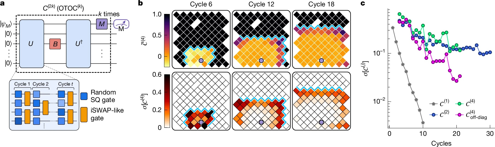

# Quantum Computers: Google Presents 'Quantum Echoes', Will It Be True Glory?

*On October 22, 2025, Google published a study in [Nature](https://www.nature.com/articles/s41586-025-09526-6) that likely marks the most significant shift in the history of quantum computing: from "we can do something impressive but fundamentally useless" to "we can do something scientifically relevant." The Quantum Echoes algorithm, run on the 105-qubit [Willow](https://blog.google/technology/research/google-willow-quantum-chip/) chip, demonstrated for the first time a verifiable quantum advantage on a real problem, calculating molecular structures 13,000 times faster than the Frontier supercomputer, currently the most powerful in the world. But be warned: before imagining quantum computers revolutionizing pharmaceutical chemistry tomorrow morning, it's worth understanding what this announcement really means, what its concrete limitations are, and why some researchers remain skeptical.*

## The Evolution of Willow: From December 2024 to Today

To understand Quantum Echoes, we must first take a step back ten months. In December 2024, Google had announced the Willow chip, a 105-superconducting-qubit quantum processor that represented a qualitative leap from the previous 53-qubit Sycamore, the one used in the controversial 2019 "quantum supremacy" experiment. Willow had demonstrated the ability to operate below the critical error-correction threshold: the more qubits you add, the fewer errors you get. This was a fundamental result because it overturned what had until then been the Achilles' heel of quantum computing, where each additional qubit traditionally meant more noise and instability.

The [Willow chip used in the experiments](https://blog.google/technology/research/quantum-hardware-verifiable-advantage/) had an average excited state lifetime (T₁) of 106 microseconds and a coherence time (T₂E) of 130 microseconds, with an average two-qubit gate error of 0.15%. These numbers might seem marginal on paper, but in the practice of quantum systems, they represent the difference between the success and failure of a complex calculation. To give an idea of the timescale: these qubits maintain their coherence for just over a tenth of a millisecond, an eternity compared to early experiments but still a blink of an eye compared to classical computing times.

[Image from nature.com](https://www.nature.com/articles/s41586-025-09526-6)

## The Echo Algorithm: Going Back in Quantum Time

The core of Quantum Echoes is an algorithm that exploits a counterintuitive property of quantum mechanics: time reversibility. Think of a drop falling into a pond. The waves propagate outward in ever-widening concentric circles, losing intensity. In the classical world, reversing this process is impossible: you cannot spontaneously make the waves converge toward the center to reconstruct the initial drop. In the quantum world, however, it is possible. Or rather, it's possible if you know exactly how to reverse every single operation you've performed.

Google's scientists implemented what is technically called a [second-order out-of-time-order correlator](https://research.google/blog/a-verifiable-quantum-advantage/) (OTOC(2)), but it's more intuitive to imagine it as a "quantum echo sonar" experiment. As Google's [official blog explains](https://blog.google/technology/research/quantum-echoes-willow-verifiable-quantum-advantage/), the process consists of four phases: a series of quantum operations is performed on an array of qubits, a specific single qubit is deliberately perturbed, the previous sequence of operations is exactly reversed, and finally, the result is measured. If everything works perfectly, the system should return to its initial state. But if the perturbation has had an effect, the returning echo will be different, and this difference contains valuable information about how information has spread through the quantum system.

The elegant trick is that this "echo" is amplified through a phenomenon called constructive interference: the quantum waves add up in phase, reinforcing each other instead of canceling out. It's a bit like when two water waves meet at the right point and create a higher wave. In the quantum world, this effect makes measurements incredibly sensitive to the microscopic details of the system.

To illustrate with a metaphor, think of the game Mr. Driller, that Japanese puzzle game where you dig through layers of colored blocks: the deeper you go, the more complex the structure you have to navigate. In the Quantum Echoes algorithm, the quantum system "digs" through ever-deeper layers of correlations between qubits, and when it reverses its path, it must manage to return exactly to the starting point by traversing the same complexity. The perturbation is like a different colored block inserted halfway: if that block has altered the path on your way back, you know it from the echo you receive.

## The Numbers That Matter: 13,000x Faster, But on What?

Here we come to the crucial point, the one that separates hype from reality. Google claims its algorithm is 13,000 times faster than Frontier, the world's most powerful supercomputer with its 1.2 exaflops of computing power. It sounds impressive, but what does it mean exactly?

The experiments published in [Nature](https://www.nature.com/articles/s41586-025-09526-6) used quantum circuits with 65 active qubits, for a total of 23 cycles of operations. The Google team measured OTOC(2) values that required about 2.1 hours of data collection time per circuit on the Willow chip. Using highly optimized tensor contraction algorithms on Frontier, the same calculation would take about 3.2 years per single data point. The 13,000x factor comes exactly from this comparison: about 28,000 hours (3.2 years) divided by 2.1 hours.

But here comes the first major criticism, raised in the journal [Nature](https://www.nature.com/articles/d41586-025-03300-4) by Dries Sels, a quantum physicist at New York University: "The burden of proof should be high. Although the paper does a serious job of testing various classical algorithms, there is no proof that an efficient algorithm does not exist." In other words, the fact that we don't currently know a faster way to do these calculations on a classical computer doesn't mean that such a way doesn't exist. This is the same criticism that was leveled at the 2019 quantum supremacy experiment.

However, the Google team did a more thorough job this time. As detailed in the [technical paper](https://research.google/blog/a-verifiable-quantum-advantage/), they tested nine different classical simulation algorithms, spending the equivalent of ten person-years trying to find classical shortcuts (what is known in the jargon as "red teaming"). They used quantum Monte Carlo techniques, tensor networks, cached Monte Carlo algorithms, and other advanced strategies. None managed to match the accuracy of the quantum processor in the considered regime.

[Image from nature.com (OTOCs as interferometers.)](https://www.nature.com/articles/s41586-025-09526-6)

## From Molecular Experiment to Reality

But Quantum Echoes is not just an abstract calculation exercise. The most interesting demonstration is the one concerning the study of real molecules, conducted in [partnership with the University of Berkeley](https://quantumai.google/static/site-assets/downloads/quantum-computation-molecular-geometry-via-nuclear-spin-echoes.pdf). The team studied two organic molecules: carbon-13 labeled toluene (15 atoms) and 3',5'-dimethylbiphenyl (28 atoms), both suspended in nematic liquid crystals.

The idea is to extend a technique called nuclear magnetic resonance (NMR), the same physics behind the MRI machines in hospitals. NMR works like a "molecular microscope" that allows seeing the relative position of atoms by measuring how atomic nuclei interact magnetically with each other. The problem is that when two nuclei are too far apart, about over 6 Ångströms (a ten-billionth of a meter), their coupling becomes too weak to be measured with conventional techniques.

This is where Quantum Echoes comes in. By simulating the dynamics of nuclear spins on the quantum chip and comparing the results with experimental NMR data, the researchers were able to determine structural parameters of the molecules with a precision comparable to that of independent spectroscopic techniques. For toluene, they estimated the average distance between the ortho and meta hydrogen atoms of the benzene ring with an error of just 0.01 Ångströms. For dimethylbiphenyl, they determined the distribution of the dihedral angle between the two benzene rings, a crucial parameter for understanding molecular conformation.

The validation was done by comparing the quantum results with multiple quantum coherence spectroscopy experiments on an independent deuterated sample. The data agree within the error bars, demonstrating that the approach works, at least in principle.

## The Promised Applications: From the Lab to the Pharmacy?

Google paints ambitious scenarios. Hartmut Neven, head of Google's quantum lab in Santa Barbara, stated during the press briefing that "this algorithm offers the opportunity for real-world applications" and that the company is optimistic that within five years there will be practical uses for quantum computers.

The promised fields range from drug discovery to materials science. In particular, the algorithm could help determine how potential medicines bind to their biological targets, one of the most computationally intensive challenges in pharmaceutical chemistry. Or it could characterize the molecular structure of new materials like advanced polymers, battery components, or even the materials that make up the quantum qubits themselves.

But here come the crucial distinctions. As [Tom O'Brien](https://blog.google/technology/research/quantum-echoes-willow-verifiable-quantum-advantage/), a researcher at Google Quantum AI in Munich, pointed out, "applying the Quantum Echoes algorithm to more complex systems will require less noisy hardware or methods to correct errors that are still under development." In other words, what works on toluene and dimethylbiphenyl does not automatically scale to proteins with hundreds of amino acids or crystals with thousands of atoms.

James Whitfield, a quantum physicist at Dartmouth College, was even more explicit in his interview with [Nature](https://www.nature.com/articles/d41586-025-03300-4): "The technical advance is impressive, but it's a bit of a stretch to think this will suddenly solve some economically relevant problem."

The fundamental limitation is that for now, the algorithm only works on molecules simple enough to be efficiently simulated classically as well. The [preprint submitted to arXiv](https://quantumai.google/static/site-assets/downloads/quantum-computation-molecular-geometry-via-nuclear-spin-echoes.pdf) candidly admits: "Due to the intrinsic complexity of simulating real systems and the performance limitations of our current chip, this initial demonstration is not yet beyond-classical."

[Image from nature.com (Sensitivity of OTOCs towards microscopic details of quantum dynamics.)](https://www.nature.com/articles/s41586-025-09526-6)

## Quantum Advantage vs. Quantum Supremacy: Substantial Differences

It's worth pausing for a moment on the difference between what was done in 2019 and what has been demonstrated today. In 2019, with the Sycamore chip, Google had demonstrated so-called "quantum supremacy" (now more commonly called "quantum computational advantage"): it had performed a calculation in 200 seconds that would have taken 10,000 years on the most powerful supercomputer of the time. It sounded spectacular, and technically it was, but there was a problem: the calculation in question was completely devoid of practical utility. It involved sampling random strings from a highly chaotic quantum state, a problem specifically designed to be hard for classical computers but easy for quantum ones.

As explained in the [Nature paper](https://www.nature.com/articles/s41586-025-09526-6), with Random Circuit Sampling "the same bitstring never appears twice in a large quantum system, limiting its ability to reveal useful information." It was the equivalent of demonstrating that your Formula 1 car can beat any other car on a circuit specifically designed to favor it, but on which no one would ever want to race for practical reasons.

Quantum Echoes is different because it measures quantum expectation values, i.e., real physical quantities like current, velocity, magnetization, or density. These values are verifiable: if you repeat the experiment on another quantum computer of equal quality, you should get the same result. And most importantly, they are relevant for describing real physical systems, from molecules to magnets to black holes (yes, the OTOC algorithm also has applications in the theoretical physics of black holes, but that's another story).

Verifiability is key. Xiao Mi and Kostyantyn Kechedzhi, researchers at Google Quantum AI and lead authors of the [technical study](https://research.google/blog/a-verifiable-quantum-advantage/), emphasize that "unlike bitstrings, quantum expectation values are verifiable computational results that remain the same when run on different quantum computers." This opens a direct path to using OTOCs to solve real-world problems using quantum computers that are not possible to solve on classical computers.

## The Three Milestones and the Road to the Future

Google Quantum AI has a public roadmap with several milestones to achieve. The team claims to have surpassed three fundamental milestones: the ability to execute complex quantum circuits with a low error rate, the demonstration of sub-threshold error correction with Willow, and now this first verifiable quantum advantage on a problem with potential practical application.

The next goal, what they call "Milestone 3" in their [public roadmap](https://quantumai.google/roadmap), is to achieve a long-lived logical qubit, i.e., an error-corrected qubit that can maintain its information for long enough to allow for complex calculations. Only then can we talk about fault-tolerant quantum computing, the Holy Grail of the field.

The five-year timeline mentioned by Neven for practical applications is ambitious but not entirely unrealistic. The problem is that it depends on a series of significant "ifs": if they can scale the number of qubits while maintaining quality, if they can implement error correction efficiently, if they can develop more refined algorithms, if hardware noise continues to decrease.

An interesting aspect, often overlooked in the public debate, is that the team used [AlphaEvolve](https://quantumai.google/static/site-assets/downloads/quantum-computation-molecular-geometry-via-nuclear-spin-echoes.pdf), a large language model-based coding agent, to optimize the compilation of quantum circuits for the dimethylbiphenyl experiment. The evolutionary algorithm managed to reduce the average error from 10.4% to 0.82% by generating more efficient product formulas compared to the standard first-order Trotter. It's an example of how AI is already playing a role in improving the efficiency of quantum algorithms.

[Image from nature.com (Quantum interference and classical simulation complexity of OTOC)](https://www.nature.com/articles/s41586-025-09526-6)

## The Hidden Criticisms in the Technical Details

Digging into the technical supplements of the paper reveals details that temper the enthusiasm. To mitigate hardware errors, the team had to implement a four-stage pipeline that includes double-sided light cone filters, zero-noise extrapolation based on Pauli paths, dynamic decoupling sequences, and sub-Clifford gate twirling. In practice, they had to apply a battery of software corrections to extract a clean signal from very noisy data.

In the deepest circuits for the 15-spin molecule, the raw measured signal was just 0.055 ± 0.003, an extremely small value submerged in noise. Only through sophisticated error mitigation techniques were they able to extract usable data. This raises a legitimate question: how much of this "quantum advantage" is intrinsic to quantum physics and how much is simply a demonstration of excellent software correction engineering?

Another critical aspect concerns the Trotterization error. The algorithm does not simulate the exact molecular dynamics, but a discrete approximation of it called the Trotter formula. The error introduced by this approximation is estimated to be about 0.035 for toluene, which adds to the residual experimental error of 0.050 after mitigation. This leads to a total mean squared error of 0.058 between the quantum data and the exact classical simulation. Not bad, but not negligible either.

Furthermore, the deepest circuits used required up to 1,080 two-qubit gates to simulate the first six time steps of the toluene OTOC curve. With an average error per two-qubit gate of about 0.15%, the error accumulates rapidly. This is why Tom O'Brien admitted that less noisy hardware is needed to go beyond these toy systems.

## AlphaEvolve and Algorithm Optimization

An often-underestimated contribution in this work is the use of AlphaEvolve to optimize the quantum circuits, particularly for the dimethylbiphenyl experiment. AlphaEvolve is an evolutionary coding agent that leverages language models to discover efficient solutions to complex scientific problems.

The process starts with a human-written program (a first-order Trotter formula) that serves as the initial solution. Through mutation, evaluation, and selection, AlphaEvolve generates a population of programs that produce circuits with a significantly lower approximation error than the baseline, reducing the average error from 10.4% to 0.82%, while staying under the gate budget imposed by the hardware.

The interesting thing is that the system does not generate circuits directly, but writes Python code that builds circuits. This has two key advantages: the resulting code can generalize to parameters and times outside the training set, and the code can be analyzed and understood by humans. Examining the technical supplement, it emerges that AlphaEvolve implemented a mix of light-cone pruning, term and qubit ordering, adaptive time steps, and distance-based term rescaling, some of which techniques had already been suggested in the literature.

This raises an interesting philosophical question: if we need AI to optimize quantum algorithms to run on quantum computers, are we really simplifying problems or just adding layers of complexity?

## The Scalability Problem

The question everyone should be asking is: does this scale? The short answer is: we don't know yet. The authors of the molecular preprint themselves [admit](https://quantumai.google/static/site-assets/downloads/quantum-computation-molecular-geometry-via-nuclear-spin-echoes.pdf) that "estimates suggest accessible distances of 20-60 Ångströms for OTOC-based measurements, approaching the length scale of Förster resonance energy transfer (FRET)." This would place the technique beyond the reach of state-of-the-art NMR approaches like PDSD, REDOR, and RFDR, all techniques that do not use time reversal.

But there's a big "but." For systems with 50 spins, Trotter error estimates suggest that naive methods would require 100,000 to a million gates. This is a large but not astronomical gap compared to current hardware requirements, given that problems are carefully selected. As the authors say: "We do not expect this gap to be overcome by physical hardware alone." Substantial algorithmic progress is needed.

Molecular physics also presents specific challenges. The team had to treat the fully coupled dipolar Hamiltonian with a swap network, a technique that allows compiling swap gates through a "brick wall" pattern of two-qubit interactions. This is optimal in terms of both the number of gates and the required depth, but it scales poorly as the number of spins increases. For toluene, they further approximated that the carbon-13 spin only interacted with the nearest proton, reducing the number of gates by 17%. This approximation was justified because all other couplings were two orders of magnitude smaller, but it won't always be possible to make similar simplifications.

## The Hardware: A Masterpiece of Superconducting Engineering

It's worth dedicating a few words to the underlying hardware. Willow's qubits are superconducting transmon circuits, basically tiny electrical oscillators operating at frequencies around 6.2 GHz with an anharmonicity of about 210 MHz. They are cooled to temperatures near absolute zero, about 15 millikelvin, using cryogenic dilution refrigerators.

For the toluene experiment, they implemented 80 unique fSim (fermionic simulation) gates across the entire parameter landscape. Unlike previous works that used a single pulse, here they adopted a two-pulse approach: the first pulse establishes the swap angle and induces a spurious conditional phase of less than 100 milliradians, while a second pulse realizes a conditional phase and a spurious swap of about 30 milliradians.

The calibration is intensive but provides superior performance and flexibility compared to the single-pulse approach. They adapted high-precision periodic "Floquet" calibration techniques, achieving target angles with a maximum tolerance of 20 milliradians and a typical error of less than 5 milliradians. The median XEB error for the calibrated fSim gates was 0.0026, with a maximum of 0.0045.

For the 15-qubit dimethylbiphenyl experiment, they instead used a decomposition based on CZ gates, which did not require the detailed fSim construction described above. This demonstrates the flexibility of Google's architectural approach.

## Comparison with D-Wave and Other Approaches

It's interesting to note that Google is not the only company to claim recent progress in quantum computing. D-Wave Systems, which uses a completely different approach based on quantum annealing instead of universal quantum gates, published results on quantum magnetic simulations in Science in March 2025 that they claim go beyond classical simulation capabilities.

D-Wave's approach is fundamentally different: instead of building quantum circuits with universal gates, it uses a system of qubits that "anneal" toward the state of minimum energy, a technique useful for optimization problems. It is not clear which approach will prevail in the long term, or if both will have distinct application niches.

Another crucial difference compared to trapped-ion systems (like those developed by IonQ or Quantinuum) is the speed of operations. Superconducting qubits operate on nanosecond timescales, while trapped ions require microseconds per gate. This speed advantage, however, is paid for with shorter coherence times and generally higher error rates. It's the classic engineering trade-off.

## Implications for Cryptography: When to Really Worry?

Every announcement of progress in quantum computing inevitably raises fears about the security of current cryptography. It's worth clarifying: this experiment has nothing to do with breaking RSA or elliptic curve cryptography. Shor's algorithm for factoring large numbers would require thousands or millions of logical qubits with full error correction, and we are still very far from that scenario.

However, the fact that Google is making steady progress on error correction and qubit quality is a signal that the industry should take the migration to post-quantum algorithms seriously. NIST has already standardized several quantum-resistant algorithms, and many organizations are beginning the transition. The advice is: don't panic today, but don't postpone planning for tomorrow either.

## Verifiability and Reproducibility: Science Done Right

A positive aspect often overlooked is that Google has made the [raw data and quantum circuits available on Zenodo](https://doi.org/10.5281/zenodo.15640502), allowing other researchers to verify and reproduce the results. They have also published the source code for the tensor contraction cost estimates on [GitHub](https://github.com/google-research/tnco) under an open-source license.

This is science done the right way, where transparency and reproducibility are put first. This is not always the case in the quantum computing sector, where some corporate announcements have been guilty of opacity. The fact that the work underwent rigorous peer review in Nature, with referees raising significant objections (as documented in the published version), is another point in favor of its credibility.

## Realistic Prospects: What to Expect in the Coming Years

So, to sum up, what can we expect in the next five years? We will likely see incremental progress on multiple fronts: chips with more qubits and lower error rates, better-optimized algorithms, more sophisticated error mitigation techniques, and the first niche applications where the quantum advantage is large enough to justify the costs and complexity.

The most promising areas in the short term are likely the simulation of natural quantum systems (just as demonstrated here with NMR spectroscopy), the optimization of specific problems in computational chemistry, and perhaps some applications in quantum machine learning. Don't expect immediate revolutions in drug discovery or battery design, but rather incremental contributions that accelerate ongoing research.

Neven's five-year timeline for practical applications is plausible if we mean "practical" in an academic-scientific sense: helping researchers answer questions that would otherwise require too much time or resources. If, however, we mean "practical" in the sense of commercial products that impact daily life, we are probably closer to ten to fifteen years away.

## The Role of Molecular Dynamics and Model Correction

A subtle but crucial aspect that emerged from the dimethylbiphenyl experiment concerns how Quantum Echoes can help correct the approximations of classical molecular dynamics simulations. The researchers used the GAFF 2.11 force field combined with parameters linked by Grappa 1.3.1 to simulate the behavior of the molecule in the 5CB liquid crystal.

The problem is that the order parameters of liquid crystals are sensitive to temperature and difficult to model accurately with molecular dynamics. Simulations tend to underestimate or overestimate certain degrees of freedom. This is where the idea of Hamiltonian learning comes in: experimental OTOC data is compared with quantum simulations of parameterized Hamiltonians, and the parameters are optimized until the simulated data matches the real experiment.

As described in the [arXiv preprint](https://quantumai.google/static/site-assets/downloads/quantum-computation-molecular-geometry-via-nuclear-spin-echoes.pdf), this approach allowed estimating the average dihedral angle of dimethylbiphenyl with a precision similar to that of independent MQC spectroscopy, improving the predictions of raw molecular dynamics by a factor of four in terms of mean squared error.

This suggests a possible future paradigm: using inexpensive classical simulations to get a first approximation of the molecular structure, then refining the critical parameters using OTOC measurements processed by quantum computers. It's not a revolution, but it is a concrete example of how quantum computing could fit into existing scientific workflows.

## The Elephant in the Room: Energy Cost

A question that is rarely asked in enthusiastic announcements is: how much does it cost in terms of energy to run a quantum computer? The dilution refrigerators that keep superconducting qubits at 15 millikelvin consume tens of kilowatts of electrical power continuously. The cryogenic infrastructure, electronics, control systems—all of this has a significant energy footprint.

Direct comparison with supercomputers is complicated because Frontier consumes about 21 megawatts at full capacity, but it operates on thousands of nodes in parallel and can perform many different tasks simultaneously. A single quantum chip, however impressive, performs one calculation at a time and still requires a substantial classical support infrastructure.

This is not an argument against quantum computing, but a reminder that "13,000x faster" comparisons are always partial. In real life, efficiency is also measured in joules per operation, in total operating costs, in the time needed to program and calibrate the system. These are all factors that currently heavily favor classical systems for the vast majority of applications.

## The Sign Problem and Classical Complexity

One of the most interesting technical aspects, buried in the supplements of the Nature paper, concerns the so-called "sign problem" in the calculation of OTOC(2). The researchers demonstrated that the constructive interference between Pauli string loops of arbitrarily large area creates a fundamental barrier for classical quantum Monte Carlo sampling algorithms.

The sign problem is a known obstacle in computational physics: when trying to calculate sums where terms can be both positive and negative (or more accurately, have arbitrary complex phases), classical stochastic algorithms fail because cancellations between large terms of opposite sign lead to small results with huge statistical errors.

As explained in the [technical supplement](https://www.nature.com/articles/s41586-025-09526-6), they mapped the average OTOC(2) on the circuits to a magnetic model with the structure of the symmetric group of order 4, and showed numerically that the sign problem in this model is severe. This suggests that the sign problem is an unavoidable feature that presents a barrier for classical sampling algorithms when calculating OTOC(2).

This is one of the most solid pieces of the argument for quantum advantage: it's not just about "we haven't found a better classical algorithm," but "there are fundamental theoretical reasons why certain classical algorithms cannot work." Of course, this doesn't rule out the existence of some completely different classical algorithm that bypasses the problem, but it makes the claim more robust.

## The Molecular Ruler Metaphor

One of the most effective descriptions provided by the Google team is that of the "quantum molecular ruler." Conventional NMR can measure distances between atomic nuclei up to about 6 Ångströms for carbon-13 pairs. Beyond this distance, the dipolar coupling becomes too weak to be resolved.

The idea behind Quantum Echoes applied to NMR is that instead of looking at individual couplings, one observes how polarization propagates through the entire network of nuclear spins. It's a bit like switching from measuring distances with a taut string (which only works for short distances) to throwing a stone into a pond and timing how long it takes for the waves to reach different points (which can work for longer distances).

The estimated theoretical limit for accessible distances with this approach is 20-60 Ångströms, approaching the scale of completely different techniques like Förster resonance energy transfer (FRET) used in biology. If this were realized in practice, it would open up genuine possibilities for studying complex protein structures, molecular assemblies, and other systems where long-range distance constraints are crucial but difficult to obtain.

However, there is a chasm between "estimated in principle" and "demonstrated experimentally." For now, the experiments have validated the concept on systems that can still be simulated classically. The critical next step would be to demonstrate its utility on a system where classical simulation fails but the quantum method still works reliably.

## The Broader Ecosystem: What Are Others Doing?

While Google was making these advances, the rest of the quantum ecosystem was not standing still. IBM recently announced significant progress with its 133-qubit Heron chip and competitive error rates. Their roadmap aims for 1,000+ qubits by 2026. Rigetti Computing is developing modular architectures that could be more easily scalable. PsiQuantum is working on photonic qubits at room temperature, a radically different approach that completely avoids cryogenics.

Meanwhile, companies like Atom Computing and QuEra are exploring neutral-atom qubits, which promise much longer coherence times than superconductors but with slower gate speeds. Microsoft is investing heavily in topological qubits based on Majorana fermions, an approach that could offer intrinsic error protection but is still in the fundamental research phase.

This diversity of approaches is healthy. It is not yet clear which architecture will prevail, and it is likely that different technologies will find different application niches. Google's superconductors are great for speed and flexibility but suffer from short coherence times. Trapped ions have excellent coherence but are slow. Photons operate at room temperature but are difficult to make interact. It's the typical phase of technological exploration where multiple solutions compete.

## The Questions That Remain Open

Let's close with the honest questions that any rational person should ask in the face of this announcement:

**First**: Is this result reproducible by independent teams? So far, only Google has the necessary hardware to verify it. It would be important to see academic labs or other industry players replicate similar experiments on different hardware.

**Second**: Does the technique really scale to interesting systems? The authors themselves admit that substantial progress is needed in both hardware and algorithms. The distance between simulating toluene and simulating a functional protein is enormous.

**Third**: Are there really applications where the quantum advantage is large enough to justify the costs and complexity? For now, the answer is "maybe, in very specific niches." In five years, that could change, but it's not guaranteed.

**Fourth**: How much of this progress is transferable to other quantum architectures? OTOC algorithms are general, but the error mitigation and optimization techniques developed for superconductors might not work well on trapped ions or other systems.

**Fifth**: Are there killer applications we haven't even imagined yet? The history of technology is full of inventions that found completely unexpected uses. The laser was called "a solution in search of a problem" when it was invented. Perhaps quantum computers will find their killer application in domains we are not even considering now.

## Conclusions: Real Progress in a Tough Field

Quantum Echoes represents genuine progress in quantum computing, probably the most significant in recent years in terms of scientific relevance. It's not the empty hype of the 2019 quantum supremacy, nor is it the imminent revolution that some sensational headlines would have us believe.

It is a solid step toward quantum computers that can help solve real scientific problems, albeit still on a limited scale and with many reservations. The road to universal quantum computers that outperform classical ones on a wide range of practical applications remains long and uncertain. But for the first time, it seems we are walking on a real path instead of going in circles on abstract ground.

The fact that the algorithm is verifiable, that the molecular results agree with independent spectroscopic techniques, that the team made a serious effort to rule out classical shortcuts, and that the entire approach fits into existing scientific workflows are all positive signs. It's not the end of the journey, probably not even halfway, but it is a tangible benchmark that we can take seriously.

The scientific community remains rightly skeptical, as it should be. Extraordinary claims require extraordinary evidence, and while Google has provided substantial evidence, legitimate questions remain about scalability, short-term practical utility, and the existence of potentially better, undiscovered classical algorithms.

In the coming years, we will see if this work truly marks the beginning of the era of quantum utility or if it turns out to be another impressive but not decisive stage in a still very long journey. For now, we can say that Google's quantum echo sounds decidedly louder than before, even if we still have to wait to see if it is resonating toward something truly revolutionary or if it's just a louder echo in a still very deep cave.