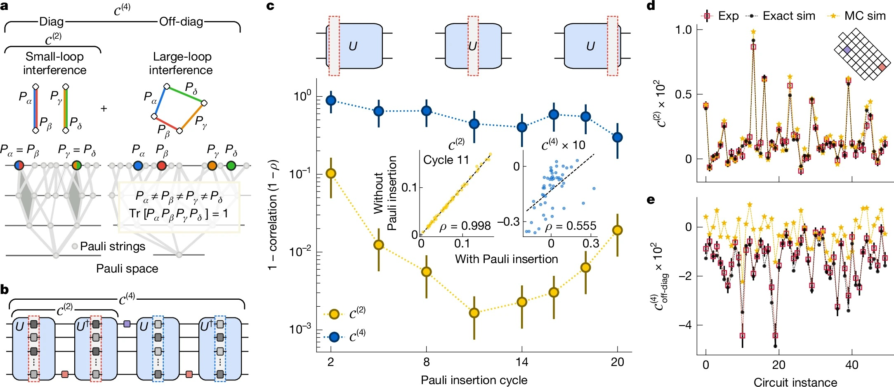

# Ordinateurs quantiques : Google présente 'Quantum Echoes', sera-ce la vraie gloire ?

*Le 22 octobre 2025, Google a publié dans [Nature](https://www.nature.com/articles/s41586-025-09526-6) une étude qui marque probablement le passage le plus significatif de l'histoire de l'informatique quantique : du "nous pouvons faire quelque chose d'impressionnant mais fondamentalement inutile" au "nous pouvons faire quelque chose de scientifiquement pertinent". L'algorithme Quantum Echoes, exécuté sur la puce [Willow](https://blog.google/technology/research/google-willow-quantum-chip/) de 105 qubits, a démontré pour la première fois un avantage quantique vérifiable sur un problème réel, en calculant des structures moléculaires 13 000 fois plus rapidement que le superordinateur Frontier, actuellement le plus puissant au monde. Mais attention : avant d'imaginer des ordinateurs quantiques qui révolutionneront la chimie pharmaceutique dès demain matin, il convient de comprendre ce que signifie réellement cette annonce, quelles sont ses limites concrètes et pourquoi certains chercheurs restent sceptiques.*

## L'évolution de Willow : de décembre 2024 à aujourd'hui

Pour comprendre Quantum Echoes, nous devons d'abord faire un bond de dix mois en arrière. En décembre 2024, Google avait annoncé la puce Willow, un processeur quantique de 105 qubits supraconducteurs qui représentait un saut qualitatif par rapport au précédent Sycamore de 53 qubits, celui utilisé dans l'expérience controversée de 2019 sur la "suprématie quantique". Willow avait démontré sa capacité à fonctionner en dessous du seuil critique de correction d'erreurs : plus vous ajoutez de qubits, moins vous obtenez d'erreurs. Un résultat fondamental car il renversait ce qui avait été jusqu'alors le talon d'Achille de l'informatique quantique, où chaque qubit supplémentaire signifiait traditionnellement plus de bruit et d'instabilité.

La puce [Willow utilisée dans les expériences](https://blog.google/technology/research/quantum-hardware-verifiable-advantage/) présentait une durée de vie moyenne des états excités (T₁) de 106 microsecondes et un temps de cohérence (T₂E) de 130 microsecondes, avec une erreur moyenne des portes à two qubits de 0,15 %. Des chiffres qui sur le papier peuvent sembler marginaux, mais qui dans la pratique des systèmes quantiques représentent la différence entre le succès et l'échec d'un calcul complexe. Pour donner une idée de l'échelle de temps : ces qubits maintiennent leur cohérence pendant un peu plus d'un dixième de milliseconde, une éternité par rapport aux premières expériences mais encore un battement de cils par rapport aux temps de l'informatique classique.

[Image tirée de nature.com](https://www.nature.com/articles/s41586-025-09526-6)

## L'algorithme de l'écho : remonter le temps quantique

Le cœur de Quantum Echoes est un algorithme qui exploite une propriété contre-intuitive de la mécanique quantique : la réversibilité temporelle. Pensez à une goutte qui tombe dans un étang. Les vagues se propagent vers l'extérieur en cercles concentriques de plus en plus larges, perdant de leur intensité. Dans le monde classique, inverser ce processus est impossible : vous ne pouvez pas faire converger spontanément les vagues vers le centre pour reconstituer la goutte initiale. Dans le monde quantique, en revanche, c'est possible. Ou plutôt, c'est possible si vous savez exactement comment inverser chaque opération que vous avez effectuée.

Les scientifiques de Google ont mis en œuvre ce que l'on appelle techniquement un [corrélateur hors de l'ordre temporel de second ordre](https://research.google/blog/a-verifiable-quantum-advantage/) (OTOC(2)), mais qu'il est plus intuitif d'imaginer comme une expérience de "sonar à écho quantique". Comme le raconte le [blog officiel de Google](https://blog.google/technology/research/quantum-echoes-willow-verifiable-quantum-advantage/), le processus se déroule en quatre phases : on exécute une série d'opérations quantiques sur un réseau de qubits, on perturbe délibérément un seul qubit spécifique, on inverse exactement la séquence d'opérations précédente et enfin, on mesure le résultat. Si tout fonctionne parfaitement, le système devrait revenir à son état initial. Mais si la perturbation a eu un effet, l'écho qui revient sera différent, et cette différence contient des informations précieuses sur la manière dont l'information s'est propagée à travers le système quantique.

L'astuce élégante est que cet "écho" est amplifié par un phénomène appelé interférence constructive : les ondes quantiques s'additionnent en phase, se renforçant mutuellement au lieu de s'annuler. C'est un peu comme lorsque deux vagues d'eau se rencontrent au bon endroit et créent une vague plus haute. Dans le monde quantique, cet effet rend les mesures incroyablement sensibles aux détails microscopiques du système.

Pour illustrer cela avec une métaphore, pensez au jeu Mr. Driller, ce jeu de puzzle japonais où vous creusez à travers des couches de blocs colorés : plus vous descendez, plus la structure que vous devez traverser devient complexe. Dans l'algorithme Quantum Echoes, le système quantique "creuse" à travers des couches de plus en plus profondes de corrélations entre les qubits, et lorsqu'il inverse son chemin, il doit réussir à revenir exactement au point de départ en traversant la même complexité. La perturbation est comme un bloc de couleur différente inséré à mi-parcours : si, à votre retour, ce bloc a altéré le chemin, vous le savez grâce à l'écho que vous recevez.

## Les chiffres qui comptent : 13 000 fois plus rapide, mais sur quoi ?

Nous arrivons ici au point crucial, celui qui sépare le battage médiatique de la réalité. Google affirme que son algorithme est 13 000 fois plus rapide que Frontier, le superordinateur le plus puissant du monde avec ses 1,2 exaflops de puissance de calcul. Cela semble impressionnant, mais que signifie-ce exactement ?

Les expériences publiées dans [Nature](https://www.nature.com/articles/s41586-025-09526-6) ont utilisé des circuits quantiques avec 65 qubits actifs, pour un total de 23 cycles d'opérations. L'équipe de Google a mesuré des valeurs d'OTOC(2) qui ont nécessité environ 2,1 heures de temps de collecte de données par circuit sur la puce Willow. En utilisant des algorithmes de contraction de tenseurs hautement optimisés sur Frontier, le même calcul nécessiterait environ 3,2 ans par point de données. Le facteur 13 000x provient exactement de cette comparaison : environ 28 000 heures (3,2 ans) divisées par 2,1 heures.

Mais c'est là qu'intervient la première grande critique, soulevée dans la revue [Nature](https://www.nature.com/articles/d41586-025-03300-4) par Dries Sels, physicien quantique à l'Université de New York : "La charge de la preuve devrait être élevée. Bien que l'article fasse un travail sérieux en testant divers algorithmes classiques, il n'y a aucune preuve qu'un algorithme efficace n'existe pas." En d'autres termes, le fait que nous ne connaissions pas aujourd'hui de moyen plus rapide de faire ces calculs sur un ordinateur classique ne signifie pas qu'un tel moyen n'existe pas. C'est la même critique qui avait été formulée à l'encontre de l'expérience de suprématie quantique de 2019.

Cependant, l'équipe de Google a fait un travail plus approfondi cette fois-ci. Comme détaillé dans le [document technique](https://research.google/blog/a-verifiable-quantum-advantage/), ils ont testé neuf algorithmes de simulation classique différents, consacrant l'équivalent de dix années-personne à tenter de trouver des raccourcis classiques (ce que l'on appelle dans le jargon le "red teaming"). Ils ont utilisé des techniques de Monte-Carlo quantique, des réseaux de tenseurs, des algorithmes de Monte-Carlo avec cache et d'autres stratégies avancées. Aucune n'a réussi à égaler la précision du processeur quantique dans le régime considéré.

[Image tirée de nature.com (OTOCs as interferometers.)](https://www.nature.com/articles/s41586-025-09526-6)

## De l'expérience moléculaire à la réalité

Mais Quantum Echoes n'est pas seulement un exercice de calcul abstrait. La démonstration la plus intéressante est celle qui concerne l'étude de molécules réelles, menée en [partenariat avec l'Université de Berkeley](https://quantumai.google/static/site-assets/downloads/quantum-computation-molecular-geometry-via-nuclear-spin-echoes.pdf). L'équipe a étudié deux molécules organiques : le toluène marqué au carbone-13 (15 atomes) et le 3',5'-diméthylbiphényle (28 atomes), toutes deux en suspension dans des cristaux liquides nématiques.

L'idée est d'étendre une technique appelée résonance magnétique nucléaire (RMN), la même physique derrière les appareils d'IRM des hôpitaux. La RMN fonctionne comme un "microscope moléculaire" qui permet de voir la position relative des atomes en mesurant comment les noyaux atomiques interagissent magnétiquement entre eux. Le problème est que lorsque deux noyaux sont trop éloignés, à environ plus de 6 Ångströms (un dix-milliardième de mètre), leur couplage devient trop faible pour être mesuré avec les techniques conventionnelles.

C'est là qu'intervient Quantum Echoes. En simulant la dynamique des spins nucléaires sur la puce quantique et en comparant les résultats avec les données expérimentales de la RMN, les chercheurs ont réussi à déterminer des paramètres structurels des molécules avec une précision comparable à celle des techniques spectroscopiques indépendantes. Pour le toluène, ils ont estimé la distance moyenne entre les atomes d'hydrogène en position ortho et méta du benzène avec une erreur de seulement 0,01 Ångström. Pour le diméthylbiphényle, ils ont déterminé la distribution de l'angle dièdre entre les deux cycles benzéniques, un paramètre crucial pour comprendre la conformation moléculaire.

La validation a été faite en comparant les résultats quantiques avec des expériences de spectroscopie à cohérence quantique multiple sur un échantillon deutéré indépendant. Les données concordent dans les marges d'erreur, ce qui démontre que l'approche fonctionne, du moins en principe.

## Les applications promises : du laboratoire à la pharmacie ?

Google dépeint des scénarios ambitieux. Hartmut Neven, chef du laboratoire quantique de Google à Santa Barbara, a déclaré lors du point de presse que "cet algorithme offre l'opportunité d'applications dans le monde réel" et que l'entreprise est optimiste quant au fait que d'ici cinq ans, il y aura des utilisations pratiques pour les ordinateurs quantiques.

Les domaines promis vont de la découverte de médicaments à la science des matériaux. En particulier, l'algorithme pourrait aider à déterminer comment des médicaments potentiels se lient à leurs cibles biologiques, l'un des défis les plus exigeants en termes de calcul en chimie pharmaceutique. Ou il pourrait caractériser la structure moléculaire de nouveaux matériaux comme les polymères avancés, les composants de batteries ou même les matériaux qui composent les qubits quantiques eux-mêmes.

Mais c'est là que les distinctions cruciales entrent en jeu. Comme l'a souligné [Tom O'Brien](https://blog.google/technology/research/quantum-echoes-willow-verifiable-quantum-advantage/), chercheur chez Google Quantum AI à Munich, "appliquer l'algorithme Quantum Echoes à des systèmes plus complexes nécessitera du matériel moins bruyant ou des méthodes de correction d'erreurs qui sont encore en cours de développement". En d'autres termes, ce qui fonctionne sur le toluène et le diméthylbiphényle ne s'adapte pas automatiquement à des protéines avec des centaines d'acides aminés ou à des cristaux avec des milliers d'atomes.

James Whitfield, physicien quantique au Dartmouth College, a été encore plus explicite dans son interview à [Nature](https://www.nature.com/articles/d41586-025-03300-4) : "L'avancée technique est impressionnante, mais il est un peu exagéré de penser que cela résoudra soudainement un problème économiquement pertinent".

La limite fondamentale est que pour l'instant, l'algorithme ne fonctionne que sur des molécules suffisamment simples pour pouvoir être simulées efficacement de manière classique également. Le [préprint soumis à arXiv](https://quantumai.google/static/site-assets/downloads/quantum-computation-molecular-geometry-via-nuclear-spin-echoes.pdf) admet candidement : "En raison de la complexité intrinsèque de la simulation de systèmes réels et des limitations de performance de notre puce actuelle, cette démonstration initiale n'est pas encore au-delà du classique".

[Image tirée de nature.com (Sensitivity of OTOCs towards microscopic details of quantum dynamics.)](https://www.nature.com/articles/s41586-025-09526-6)

## Avantage quantique contre suprématie quantique : des différences substantielles

Il convient de s'arrêter un instant sur la différence entre ce qui a été fait en 2019 et ce qui a été démontré aujourd'hui. En 2019, avec la puce Sycamore, Google avait démontré ce qu'on appelle la "suprématie quantique" (aujourd'hui plus communément appelée "avantage computationnel quantique") : il avait effectué en 200 secondes un calcul qui aurait nécessité 10 000 ans au superordinateur le plus puissant de l'époque. Cela semblait spectaculaire, et techniquement ça l'était, mais il y avait un problème : le calcul en question était totalement dépourvu d'utilité pratique. Il s'agissait d'échantillonner des chaînes aléatoires à partir d'un état quantique très chaotique, un problème conçu spécifiquement pour être difficile pour les ordinateurs classiques mais facile pour les ordinateurs quantiques.

Comme expliqué dans le [document de Nature](https://www.nature.com/articles/s41586-025-09526-6), avec l'échantillonnage de circuits aléatoires, "la même chaîne de bits n'apparaît jamais deux fois dans un grand système quantique, ce qui limite sa capacité à révéler des informations utiles". C'était l'équivalent de démontrer que votre voiture de Formule 1 peut battre n'importe quelle autre voiture sur un circuit spécialement conçu pour la favoriser, mais sur lequel personne ne voudrait jamais courir pour des raisons pratiques.

Quantum Echoes est différent car il mesure des valeurs d'attente quantiques, c'est-à-dire des quantités physiques réelles comme le courant, la vitesse, la magnétisation ou la densité. Ces valeurs sont vérifiables : si vous répétez l'expérience sur un autre ordinateur quantique de qualité égale, vous devriez obtenir le même résultat. Et surtout, elles sont pertinentes pour décrire des systèmes physiques réels, des molécules aux aimants en passant par les trous noirs (oui, l'algorithme OTOC a aussi des applications en physique théorique des trous noirs, mais c'est une autre histoire).

La vérifiabilité est la clé. Xiao Mi et Kostyantyn Kechedzhi, chercheurs chez Google Quantum AI et auteurs principaux de l'[étude technique](https://research.google/blog/a-verifiable-quantum-advantage/), soulignent que "contrairement aux chaînes de bits, les valeurs d'attente quantiques sont des résultats de calcul vérifiables qui restent les mêmes lorsqu'ils sont exécutés sur différents ordinateurs quantiques". Cela ouvre une voie directe vers l'utilisation des OTOC pour résoudre des problèmes du monde réel à l'aide d'ordinateurs quantiques, ce qui n'est pas possible sur des ordinateurs classiques.

## Les trois jalons et la route vers l'avenir

Google Quantum AI a une feuille de route publique avec plusieurs jalons à atteindre. L'équipe affirme avoir franchi trois jalons fondamentaux : la capacité d'exécuter des circuits quantiques complexes avec un faible taux d'erreur, la démonstration de la correction d'erreurs en dessous du seuil avec Willow, et maintenant ce premier avantage quantique vérifiable sur un problème ayant une application pratique potentielle.

Le prochain objectif, qu'ils appellent "Jalon 3" dans leur [feuille de route publique](https://quantumai.google/roadmap), est d'atteindre un qubit logique à longue durée de vie, c'est-à-dire un qubit protégé par correction d'erreur qui peut conserver son information pendant des temps suffisamment longs pour permettre des calculs complexes. Ce n'est qu'à ce moment-là que l'on pourra parler d'informatique quantique tolérante aux pannes, résistante aux erreurs, le Saint Graal du secteur.

Le calendrier de cinq ans cité par Neven pour des applications pratiques est ambitieux mais pas totalement irréaliste. Le problème est qu'il dépend d'une série de "si" importants : s'ils parviennent à augmenter le nombre de qubits tout en maintenant la qualité, s'ils parviennent à mettre en œuvre la correction d'erreurs de manière efficace, s'ils parviennent à développer des algorithmes plus raffinés, si le bruit matériel continue de diminuer.

Un aspect intéressant, souvent négligé dans le débat public, est que l'équipe a utilisé [AlphaEvolve](https://quantumai.google/static/site-assets/downloads/quantum-computation-molecular-geometry-via-nuclear-spin-echoes.pdf), un agent de codage basé sur de grands modèles de langage, pour optimiser la compilation des circuits quantiques pour l'expérience sur le diméthylbiphényle. L'algorithme évolutif a réussi à réduire l'erreur moyenne de 10,4 % à 0,82 % en générant des formules de produit plus efficaces que le premier ordre de Trotter standard. C'est un exemple de la manière dont l'IA joue déjà un rôle dans l'amélioration de l'efficacité des algorithmes quantiques.

[Image tirée de nature.com (Quantum interference and classical simulation complexity of OTOC)](https://www.nature.com/articles/s41586-025-09526-6)

## Les critiques cachées dans les détails techniques

En creusant dans les suppléments techniques de l'article, on découvre des détails qui tempèrent l'enthousiasme. Pour atténuer les erreurs matérielles, l'équipe a dû mettre en œuvre un pipeline à quatre étages qui comprend des filtres à cône de lumière double face, une extrapolation à bruit nul basée sur les chemins de Pauli, des séquences de découplage dynamique et un "twirling" des portes sub-Clifford. En pratique, ils ont dû appliquer une batterie de corrections logicielles pour extraire un signal propre de données très bruitées.

Dans les circuits les plus profonds pour la molécule à 15 spins, le signal brut mesuré n'était que de 0,055 ± 0,003, une valeur extrêmement faible noyée dans le bruit. Ce n'est qu'à travers des techniques sophistiquées d'atténuation des erreurs qu'ils ont réussi à extraire des données utilisables. Cela soulève une question légitime : quelle part de cet "avantage quantique" est intrinsèque à la physique quantique et quelle part est simplement une démonstration d'une excellente ingénierie logicielle de correction ?

Un autre aspect critique concerne l'erreur de Trotterisation. L'algorithme ne simule pas la dynamique moléculaire exacte, mais une approximation discrète appelée formule de Trotter. L'erreur introduite par cette approximation est estimée à environ 0,035 pour le toluène, ce qui s'ajoute à l'erreur expérimentale résiduelle de 0,050 après atténuation. Cela conduit à une erreur quadratique moyenne totale de 0,058 entre les données quantiques et la simulation classique exacte. Ce n'est pas mal, mais ce n'est pas non plus négligeable.

De plus, les circuits les plus profonds utilisés nécessitaient jusqu'à 1 080 portes à deux qubits pour simuler les six premières étapes temporelles de la courbe OTOC du toluène. Avec une erreur moyenne par porte à deux qubits d'environ 0,15 %, l'erreur s'accumule rapidement. C'est la raison pour laquelle Tom O'Brien a admis qu'il fallait du matériel moins bruyant pour aller au-delà de ces systèmes jouets.

## AlphaEvolve et l'optimisation des algorithmes

Une contribution souvent sous-estimée dans ce travail est l'utilisation d'AlphaEvolve pour optimiser les circuits quantiques, en particulier pour l'expérience sur le diméthylbiphényle. AlphaEvolve est un agent de codage évolutif qui exploite les modèles de langage pour découvrir des solutions efficaces à des problèmes scientifiques complexes.

Le processus part d'un programme écrit par des humains (une formule de Trotter de premier ordre) qui sert de solution initiale. Par mutation, évaluation et sélection, AlphaEvolve génère une population de programmes qui produisent des circuits avec une erreur d'approximation significativement plus faible que la référence, passant d'une erreur moyenne de 10,4 % à 0,82 %, tout en restant en dessous du budget de portes imposé par le matériel.

Ce qui est intéressant, c'est que le système ne génère pas directement des circuits, mais écrit du code Python qui construit des circuits. Cela présente deux avantages clés : le code résultant peut se généraliser à des paramètres et des temps hors de l'ensemble d'entraînement, et le code peut être analysé et compris par les humains. En examinant le supplément technique, il apparaît qu'AlphaEvolve a mis en œuvre un mélange d'élagage du cône de lumière, d'ordonnancement des termes et des qubits, de pas de temps adaptatifs et de redimensionnement des termes basé sur la distance, dont certaines techniques avaient déjà été suggérées dans la littérature.

Cela soulève une question philosophique intéressante : si nous avons besoin de l'IA pour optimiser les algorithmes quantiques à exécuter sur des ordinateurs quantiques, simplifions-nous vraiment les problèmes ou ajoutons-nous simplement des couches de complexité ?

## Le problème de l'évolutivité

La question que tout le monde devrait se poser est : est-ce que cela passe à l'échelle ? La réponse courte est : nous ne le savons pas encore. Les auteurs mêmes du préprint moléculaire [admettent](https://quantumai.google/static/site-assets/downloads/quantum-computation-molecular-geometry-via-nuclear-spin-echoes.pdf) que "les estimations suggèrent des distances accessibles de 20 à 60 Ångströms pour les mesures basées sur l'OTOC, se rapprochant de l'échelle de longueur du transfert d'énergie par résonance de Förster (FRET)". Cela placerait la technique hors de portée des approches RMN de pointe comme PDSD, REDOR et RFDR, toutes techniques qui n'utilisent pas d'inversion temporelle.

Mais il y a un "mais" gros comme une maison. Pour les systèmes à 50 spins, les estimations des erreurs de Trotter suggèrent que les méthodes naïves nécessiteraient de 100 000 à un million de portes. C'est un écart important mais pas astronomique par rapport aux exigences matérielles actuelles, étant donné que les problèmes sont soigneusement sélectionnés. Comme le disent les auteurs : "Nous ne nous attendons pas à ce que cet écart soit comblé uniquement par le matériel physique". Des progrès algorithmiques substantiels sont nécessaires.

La physique moléculaire présente également des défis spécifiques. L'équipe a dû traiter l'hamiltonien dipolaire entièrement couplé avec un réseau d'échange (swap network), une technique qui permet de compiler des portes d'échange à travers un motif en "mur de briques" d'interactions à deux qubits. C'est optimal en termes de nombre de portes et de profondeur requise, mais cela passe mal à l'échelle avec l'augmentation du nombre de spins. Pour le toluène, ils ont en outre approximé que le spin du carbone-13 n'interagissait qu'avec le proton le plus proche, réduisant ainsi le nombre de portes de 17 %. Cette approximation était justifiée car tous les autres couplages étaient de deux ordres de grandeur plus petits, mais il ne sera pas toujours possible de faire des simplifications similaires.

## Le matériel : un chef-d'œuvre d'ingénierie supraconductrice

Il convient de consacrer quelques mots au matériel sous-jacent. Les qubits de Willow sont des circuits supraconducteurs de type transmon, essentiellement de minuscules oscillateurs électriques fonctionnant à des fréquences d'environ 6,2 GHz avec une anharmonicité d'environ 210 MHz. Ils sont refroidis à des températures proches du zéro absolu, environ 15 millikelvins, à l'aide de réfrigérateurs à dilution cryogéniques.

Pour l'expérience sur le toluène, ils ont mis en œuvre 80 portes fSim (simulation fermionique) uniques sur l'ensemble du paysage des paramètres. Contrairement aux travaux précédents qui utilisaient une seule impulsion, ils ont ici adopté une approche à deux impulsions : la première impulsion établit l'angle d'échange et induit une phase conditionnelle parasite de moins de 100 milliradians, tandis qu'une seconde impulsion réalise une phase conditionnelle et un échange parasite d'environ 30 milliradians.

La calibration est intensive mais offre des performances et une flexibilité supérieures à l'approche à une seule impulsion. Ils ont adapté des techniques de calibration périodique "Floquet" de haute précision, atteignant des angles cibles avec une tolérance maximale de 20 milliradians et une erreur typique inférieure à 5 milliradians. L'erreur XEB médiane pour les portes fSim calibrées était de 0,0026, avec un maximum de 0,0045.

Pour l'expérience sur le diméthylbiphényle à 15 qubits, ils ont plutôt utilisé une décomposition basée sur des portes CZ, qui ne nécessitait pas la construction fSim détaillée ci-dessus. Cela démontre la flexibilité de l'approche architecturale de Google.

## La comparaison avec D-Wave et d'autres approches

Il est intéressant de noter que Google n'est pas la seule entreprise à revendiquer des progrès récents en informatique quantique. D-Wave Systems, qui utilise une approche complètement différente basée sur le recuit quantique au lieu des portes quantiques universelles, a publié en mars 2025 dans Science des résultats sur des simulations magnétiques quantiques qui, selon eux, dépassent les capacités de simulation classique.

L'approche de D-Wave est fondamentalement différente : au lieu de construire des circuits quantiques avec des portes universelles, elle utilise un système de qubits qui "recuisent" vers l'état d'énergie minimale, une technique utile pour les problèmes d'optimisation. Il n'est pas clair quelle approche prévaudra à long terme, ou si les deux auront des niches d'application distinctes.

Une autre différence cruciale par rapport aux systèmes à ions piégés (comme ceux développés par IonQ ou Quantinuum) est la vitesse des opérations. Les qubits supraconducteurs fonctionnent à l'échelle de la nanoseconde, tandis que les ions piégés nécessitent des microsecondes par porte. Cet avantage en vitesse est cependant payé par des temps de cohérence plus courts et des taux d'erreur généralement plus élevés. C'est le compromis d'ingénierie classique.

## Les implications pour la cryptographie : quand faut-il vraiment s'inquiéter ?

Chaque annonce de progrès en informatique quantique suscite inévitablement des craintes quant à la sécurité de la cryptographie actuelle. Il convient de clarifier : cette expérience n'a rien à voir avec la rupture de la cryptographie RSA ou à courbe elliptique. L'algorithme de Shor pour factoriser de grands nombres nécessiterait des milliers ou des millions de qubits logiques avec une correction d'erreur complète, et nous sommes encore très loin de ce scénario.

Cependant, le fait que Google fasse des progrès constants en matière de correction d'erreurs et de qualité des qubits est un signal que l'industrie devrait prendre au sérieux la migration vers des algorithmes post-quantiques. Le NIST a déjà normalisé plusieurs algorithmes résistants au quantique, et de nombreuses organisations commencent la transition. Le conseil est le suivant : ne paniquez pas aujourd'hui, mais ne reportez pas non plus la planification à demain.

## Vérifiabilité et reproductibilité : la science bien faite

Un aspect positif souvent négligé est que Google a rendu disponibles [les données brutes et les circuits quantiques sur Zenodo](https://doi.org/10.5281/zenodo.15640502), permettant à d'autres chercheurs de vérifier et de reproduire les résultats. Ils ont également publié le code source pour les estimations de coût de la contraction de tenseurs sur [GitHub](https://github.com/google-research/tnco) sous une licence open source.

C'est de la science faite de la bonne manière, où la transparence et la reproductibilité sont mises au premier plan. Ce n'est pas toujours le cas dans le secteur de l'informatique quantique, où certaines annonces d'entreprises ont péché par opacité. Le fait que le travail ait été soumis à un examen par les pairs rigoureux dans Nature, avec des examinateurs qui ont soulevé des objections importantes (comme documenté dans la version publiée), est un autre point en faveur de la crédibilité.

## Perspectives réalistes : à quoi s'attendre dans les prochaines années

Alors, en résumé, à quoi pouvons-nous nous attendre dans les cinq prochaines années ? Nous verrons probablement des progrès progressifs sur plusieurs fronts : des puces avec plus de qubits et des taux d'erreur plus bas, des algorithmes mieux optimisés, des techniques d'atténuation des erreurs plus sophistiquées et les premières applications de niche où l'avantage quantique est suffisamment grand pour justifier les coûts et la complexité.

Les domaines les plus prometteurs à court terme sont probablement la simulation de systèmes quantiques naturels (exactement comme démontré ici avec la spectroscopie RMN), l'optimisation de problèmes spécifiques en chimie computationnelle et peut-être quelques applications en apprentissage automatique quantique. Ne vous attendez pas à des révolutions immédiates dans la découverte de médicaments ou la conception de batteries, mais plutôt à des contributions progressives qui accélèrent les recherches déjà en cours.

Le calendrier de cinq ans de Neven pour des applications pratiques est plausible si l'on entend "pratique" au sens académique et scientifique : aider les chercheurs à répondre à des questions qui nécessiteraient autrement trop de temps ou de ressources. Si, en revanche, on entend "pratique" au sens de produits commerciaux qui ont un impact sur la vie quotidienne, nous sommes probablement plus proches de dix à quinze ans.

## Le rôle de la dynamique moléculaire et la correction des modèles

Un aspect subtil mais crucial qui est ressorti de l'expérience sur le diméthylbiphényle concerne la manière dont Quantum Echoes peut aider à corriger les approximations des simulations de dynamique moléculaire classiques. Les chercheurs ont utilisé le champ de force GAFF 2.11 combiné à des paramètres liés par Grappa 1.3.1 pour simuler le comportement de la molécule dans le cristal liquide 5CB.

Le problème est que les paramètres d'ordre des cristaux liquides sont sensibles à la température et difficiles à modéliser avec précision par la dynamique moléculaire. Les simulations ont tendance à sous-estimer ou à surestimer certains degrés de liberté. C'est là qu'intervient l'idée de l'apprentissage hamiltonien : on compare les données OTOC expérimentales avec des simulations quantiques d'hamiltoniens paramétrés, et on optimise les paramètres jusqu'à ce que les données simulées correspondent à l'expérience réelle.

Comme décrit dans le [préprint sur arXiv](https://quantumai.google/static/site-assets/downloads/quantum-computation-molecular-geometry-via-nuclear-spin-echoes.pdf), cette approche a permis d'estimer l'angle dièdre moyen du diméthylbiphényle avec une précision similaire à celle de la spectroscopie MQC indépendante, améliorant les prédictions de la dynamique moléculaire brute d'un facteur quatre en termes d'erreur quadratique moyenne.

Cela suggère un paradigme futur possible : utiliser des simulations classiques peu coûteuses pour obtenir une première approximation de la structure moléculaire, puis affiner les paramètres critiques à l'aide de mesures OTOC traitées par des ordinateurs quantiques. Ce n'est pas une révolution, mais c'est un exemple concret de la manière dont l'informatique quantique pourrait s'intégrer dans les flux de travail scientifiques existants.

## L'éléphant dans la pièce : le coût énergétique

Une question qui est rarement posée dans les annonces enthousiastes est : combien coûte en termes d'énergie le fonctionnement d'un ordinateur quantique ? Les réfrigérateurs à dilution qui maintiennent les qubits supraconducteurs à 15 millikelvins consomment des dizaines de kilowatts de puissance électrique en continu. L'infrastructure cryogénique, l'électronique, les systèmes de contrôle, tout cela a une empreinte énergétique importante.

La comparaison directe avec les superordinateurs est compliquée car Frontier consomme environ 21 mégawatts à plein régime, mais il fonctionne sur des milliers de nœuds en parallèle et peut effectuer de nombreuses tâches différentes simultanément. Une seule puce quantique, aussi impressionnante soit-elle, effectue un calcul à la fois et nécessite tout de même une infrastructure de support classique substantielle.

Ce n'est pas un argument contre l'informatique quantique, mais un rappel que les comparaisons "13 000 fois plus rapide" sont toujours partielles. Dans la vie réelle, l'efficacité se mesure aussi en joules par opération, en coûts d'exploitation totaux, en temps nécessaire pour programmer et calibrer le système. Ce sont tous des facteurs qui, à l'heure actuelle, favorisent lourdement les systèmes classiques pour la grande majorité des applications.

## La question du problème du signe et la complexité classique

L'un des aspects techniques les plus intéressants, enfoui dans les suppléments de l'article de Nature, concerne ce qu'on appelle le "problème du signe" dans le calcul de l'OTOC(2). Les chercheurs ont démontré que l'interférence constructive entre des boucles de chaînes de Pauli de surface arbitrairement grande crée une barrière fondamentale pour les algorithmes classiques d'échantillonnage de Monte-Carlo quantique.

Le problème des signes est un obstacle connu en physique computationnelle : lorsqu'on essaie de calculer des sommes où les termes peuvent être à la fois positifs et négatifs (ou plus précisément, ont des phases complexes arbitraires), les algorithmes stochastiques classiques échouent car les annulations entre de grands termes de signe opposé conduisent à de petits résultats avec des erreurs statistiques énormes.

Comme expliqué dans le [supplément technique](https://www.nature.com/articles/s41586-025-09526-6), ils ont mappé l'OTOC(2) moyen sur les circuits à un modèle magnétique avec la structure du groupe symétrique d'ordre 4, et ont montré numériquement que le problème des signes dans ce modèle est sévère. Cela suggère que le problème des signes est une caractéristique inévitable qui présente une barrière pour les algorithmes d'échantillonnage classiques lors du calcul de l'OTOC(2).

C'est l'un des arguments les plus solides en faveur de l'avantage quantique : il ne s'agit pas seulement de "nous n'avons pas trouvé de meilleur algorithme classique", mais de "il y a des raisons théoriques fondamentales pour lesquelles certains algorithmes classiques ne peuvent pas fonctionner". Bien sûr, cela n'exclut pas qu'il existe un algorithme classique complètement différent qui contourne le problème, mais cela rend l'affirmation plus robuste.

## La métaphore de la règle moléculaire

L'une des descriptions les plus efficaces fournies par l'équipe de Google est celle de la "règle moléculaire quantique". La RMN conventionnelle peut mesurer des distances entre les noyaux atomiques jusqu'à environ 6 Ångströms pour les paires de carbone-13. Au-delà de cette distance, le couplage dipolaire devient trop faible pour être résolu.

L'idée derrière Quantum Echoes appliquée à la RMN est qu'au lieu de regarder les couplages individuels, on observe comment la polarisation se propage à travers tout le réseau de spins nucléaires. C'est un peu comme passer de la mesure de distances avec une corde tendue (qui ne fonctionne que pour de courtes distances) au lancer d'une pierre dans un étang et à chronométrer le temps que mettent les vagues à atteindre différents points (ce qui peut fonctionner pour de plus grandes distances).

La limite théorique estimée pour les distances accessibles avec cette approche est de 20 à 60 Ångströms, se rapprochant de l'échelle de techniques complètement différentes comme le transfert d'énergie par résonance de Förster (FRET) utilisé en biologie. Si cela était réalisé en pratique, cela ouvrirait de véritables possibilités pour étudier des structures protéiques complexes, des assemblages moléculaires et d'autres systèmes où les contraintes de distance à longue portée sont cruciales mais difficiles à obtenir.

Cependant, il y a un gouffre entre "estimé en principe" et "démontré expérimentalement". Pour l'instant, les expériences ont validé le concept sur des systèmes qui peuvent encore être simulés de manière classique. La prochaine étape critique serait de démontrer son utilité sur un système où la simulation classique échoue mais où la méthode quantique fonctionne encore de manière fiable.

## L'écosystème plus large : que font les autres ?

Pendant que Google faisait ces progrès, le reste de l'écosystème quantique n'est pas resté inactif. IBM a récemment annoncé des progrès significatifs avec sa puce Heron de 133 qubits et des taux d'erreur compétitifs. Leur feuille de route vise à atteindre plus de 1 000 qubits d'ici 2026. Rigetti Computing développe des architectures modulaires qui pourraient être plus facilement mises à l'échelle. PsiQuantum travaille sur des qubits photoniques à température ambiante, une approche radicalement différente qui évite complètement la cryogénie.

Pendant ce temps, des entreprises comme Atom Computing et QuEra explorent les qubits à atomes neutres, qui promettent des temps de cohérence beaucoup plus longs que les supraconducteurs mais avec des vitesses de porte plus lentes. Microsoft investit massivement dans les qubits topologiques basés sur les fermions de Majorana, une approche qui pourrait offrir une protection intrinsèque contre les erreurs mais qui est encore au stade de la recherche fondamentale.

Cette diversité d'approches est saine. Il n'est pas encore clair quelle architecture prévaudra, et il est probable que différentes technologies trouveront des niches d'application différentes. Les supraconducteurs de Google sont excellents pour la vitesse et la flexibilité mais souffrent de temps de cohérence courts. Les ions piégés ont une excellente cohérence mais sont lents. Les photons fonctionnent à température ambiante mais sont difficiles à faire interagir. C'est la phase typique de l'exploration technologique où plusieurs solutions sont en concurrence.

## Les questions qui restent ouvertes

Terminons avec les questions honnêtes que toute personne rationnelle devrait se poser face à cette annonce :

**Premièrement** : ce résultat est-il reproductible par des équipes indépendantes ? Jusqu'à présent, seul Google dispose du matériel nécessaire pour le vérifier. Il serait important de voir des laboratoires universitaires ou d'autres acteurs industriels reproduire des expériences similaires sur du matériel différent.

**Deuxièmement** : la technique passe-t-elle vraiment à l'échelle pour des systèmes intéressants ? Les auteurs eux-mêmes admettent que des progrès substantiels sont nécessaires tant au niveau du matériel que des algorithmes. La distance entre la simulation du toluène et celle d'une protéine fonctionnelle est énorme.

**Troisièmement** : existe-t-il vraiment des applications où l'avantage quantique est suffisamment grand pour justifier les coûts et la complexité ? Pour l'instant, la réponse est "peut-être, dans des niches très spécifiques". Dans cinq ans, cela pourrait changer, mais ce n'est pas garanti.

**Quatrièmement** : quelle part de ces progrès est transférable à d'autres architectures quantiques ? Les algorithmes OTOC sont généraux, mais les techniques d'atténuation des erreurs et d'optimisation développées pour les supraconducteurs pourraient ne pas bien fonctionner sur des ions piégés ou d'autres systèmes.

**Cinquièmement** : y a-t-il des applications phares que nous n'avons pas encore imaginées ? L'histoire de la technologie est pleine d'inventions qui ont trouvé des usages totalement inattendus. Le laser a été appelé "une solution à la recherche d'un problème" lors de son invention. Peut-être que les ordinateurs quantiques trouveront leur application phare dans des domaines que nous n'envisageons même pas actuellement.

## Conclusions : des progrès réels dans un domaine ardu

Quantum Echoes représente un progrès authentique en informatique quantique, probablement le plus significatif de ces dernières années en termes de pertinence scientifique. Ce n'est pas le battage médiatique vide de la suprématie quantique de 2019, ni la révolution imminente que certains titres sensationnalistes voudraient nous faire croire.

C'est un pas solide vers des ordinateurs quantiques qui peuvent contribuer à résoudre des problèmes scientifiques réels, bien qu'encore à des échelles limitées et avec de nombreuses réserves. La route vers des ordinateurs quantiques universels qui surpassent les classiques sur un large éventail d'applications pratiques reste longue et incertaine. Mais pour la première fois, il semble que nous marchions sur un chemin réel au lieu de tourner en rond sur un terrain abstrait.

Le fait que l'algorithme soit vérifiable, que les résultats moléculaires concordent avec des techniques spectroscopiques indépendantes, que l'équipe ait fait un effort sérieux pour exclure les raccourcis classiques et que l'ensemble de l'approche s'intègre dans des flux de travail scientifiques existants sont autant de signes positifs. Ce n'est pas la fin du voyage, probablement même pas la moitié, mais c'est un point de repère tangible que nous pouvons prendre au sérieux.

La communauté scientifique reste à juste titre sceptique, comme il se doit. Les affirmations extraordinaires exigent des preuves extraordinaires, et bien que Google ait fourni des preuves substantielles, des questions légitimes subsistent sur l'évolutivité, l'utilité pratique à court terme et l'existence d'éventuels algorithmes classiques meilleurs non encore découverts.

Dans les années à venir, nous verrons si ce travail marquera vraiment le début de l'ère de l'utilité quantique ou s'il se révélera être une autre étape impressionnante mais non décisive d'un voyage encore très long. Pour l'instant, nous pouvons dire que l'écho quantique de Google résonne décidément plus fort qu'auparavant, même si nous devons encore attendre pour savoir s'il résonne vers quelque chose de vraiment révolutionnaire ou s'il n'est qu'un écho plus sonore dans une caverne encore très profonde.