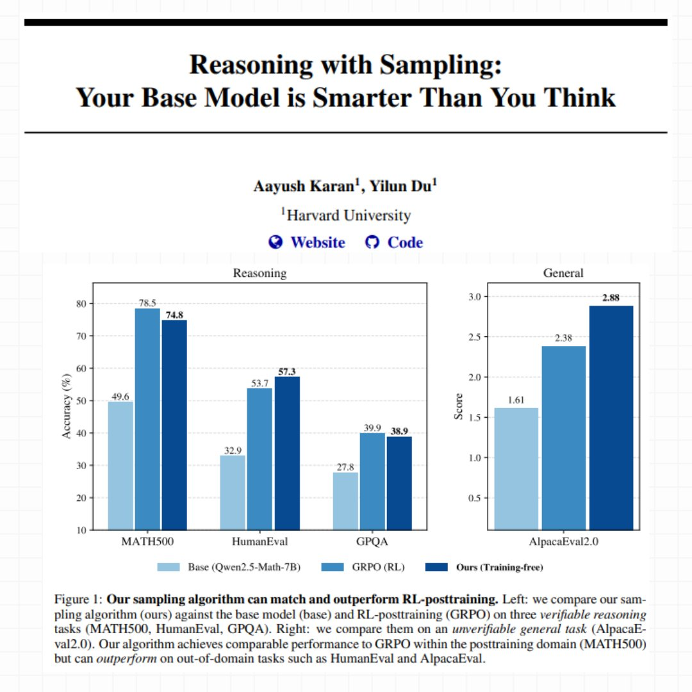

# Il Modello Base Sapeva Già Ragionare (Bastava Chiederlo nel Modo Giusto)

*Quando DeepSeek-R1 ha dimostrato capacità di ragionamento quasi umane all'inizio del 2025, l'industria dell'AI ha celebrato l'ennesima vittoria del reinforcement learning. Il paradigma sembrava incontestabile: per ottenere modelli capaci di ragionare su problemi complessi di matematica, coding o scienza, serviva un massiccio posttraining basato su RL. [OpenAI con o1](https://openai.com/index/learning-to-reason-with-llms/), [Anthropic con Claude](https://docs.claude.com), perfino i progetti open source come [Qwen2.5-Math](https://github.com/QwenLM/Qwen2.5-Math) hanno seguito questa strada: prendi un modello base, costruisci un reward model accurato, prepara dataset curati di problemi verificabili, e poi addestra con algoritmi come GRPO (Group Relative Policy Optimization) investendo settimane di calcoli su cluster GPU.*

Il costo di questa ortodossia è considerevole. Non parliamo solo di milioni di dollari in risorse computazionali, ma anche della complessità ingegneristica: hyperparameter sweep per evitare instabilità durante il training, dataset diversificati da curare manualmente, reward signal che devono essere perfetti altrimenti il modello impara comportamenti indesiderati. Come hanno documentato [ricercatori di AWS e Carnegie Mellon](https://aws.amazon.com/blogs/machine-learning/fine-tune-large-language-models-with-reinforcement-learning-from-human-or-ai-feedback/), il processo RLHF richiede un'infrastruttura sofisticata dove reward model, policy optimization e KL divergence control devono bilanciarsi in un equilibrio precario.

Eppure negli ultimi mesi sono emersi segnali inquietanti. Diversi paper hanno iniziato a documentare un fenomeno curioso: quando si confronta il pass@k (la probabilità che almeno una risposta su k sia corretta) dei modelli base contro quelli post-addestrati con RL, per valori alti di k i modelli base spesso vincono. [La ricerca "Rewarding the Unlikely"](https://arxiv.org/html/2506.02355v1) di Andre He e colleghi ha identificato quello che chiamano "rank bias" in GRPO: l'algoritmo rinforza traiettorie già probabili trascurando quelle rare ma corrette, producendo quello che definiscono "distribution sharpening". Il modello post-RL risolve alcuni problemi con meno campionamenti, ma sottoperforma rispetto al semplice sampling multiplo dal modello originale.

È come se l'RL non insegnasse davvero nuove capacità, ma si limitasse a rendere più facile pescare quelle giuste al primo colpo, sacrificando la diversità delle risposte. Un trade-off che, in domini con verifier perfetti come il "theorem proving" formale, inizia a sembrare un pessimo affare.

## La Provocazione di Harvard

In questo contesto, la ricerca "[Reasoning with Sampling: Your Base Model is Smarter Than You Think](https://arxiv.org/abs/2510.14901)" di Aayush Karan e Yilun Du dell'Università di Harvard arriva come una provocazione metodologica. La domanda che pongono è radicale: e se le capacità di ragionamento fossero già tutte presenti nel modello base, semplicemente mascherate da strategie di sampling inefficienti?

L'intuizione non è nuova. Chi ha familiarità con "La lettera rubata" di Edgar Allan Poe ricorderà che a volte la soluzione si nasconde in bella vista, troppo ovvia per essere notata. Karan e Du propongono qualcosa di simile: invece di mesi di training RL, usano un algoritmo di sampling più intelligente che sfrutta le probabilità già contenute nel modello base. Niente nuovi pesi, niente gradient descent, niente reward model. Solo un modo diverso di estrarre sequenze dal modello esistente.

Il loro metodo si chiama Power Sampling e i risultati sono sorprendenti. Su [MATH500](https://arxiv.org/abs/2103.03874) (problemi matematici di livello competitivo), il loro approccio training-free raggiunge il 74.8% di accuratezza single-shot con Qwen2.5-Math-7B, quasi identico al 78.5% ottenuto con GRPO dopo settimane di training. Ma la vera sorpresa arriva su task out-of-domain: su [HumanEval](https://arxiv.org/abs/2107.03374) (problemi di coding) Power Sampling ottiene 57.3% contro il 53.7% di GRPO, e su [AlpacaEval 2.0](https://arxiv.org/abs/2404.04475) (helpfulness generale) raggiunge un impressionante 2.88 contro il 2.38 del modello post-addestrato.

Come nelle migliori storie di Moneyball, dove Billy Beane scoprì che l'efficienza statistica batteva i budget milionari, qui l'algoritmo intelligente sembra competere con la forza bruta computazionale. Ma come funziona esattamente questo Power Sampling?

[Immagine tratta dal paper ufficiale di Harvard](https://arxiv.org/pdf/2510.14901)

## Il Problema del Sampling Tradizionale

Per capire l'innovazione di Karan e Du bisogna prima comprendere come i modelli linguistici generano testo. Ad ogni passo, il modello calcola una probabilità per ogni possibile prossimo token. Il sampling "greedy" prende sempre il più probabile, producendo output deterministico ma spesso ripetitivo e banale. Per introdurre varietà, l'industria usa da anni quello che viene chiamato "low-temperature sampling": modifichi le probabilità per rendere le scelte ad alta probabilità ancora più attraenti, come se regolassi un termostato che controlla quanto il modello è disposto a rischiare.

Il problema è che questo approccio guarda solo al prossimo token, ignorando completamente cosa succederà nei passi successivi. È come scegliere quale strada prendere guardando solo il primo metro: magari quella che sembra più bella all'inizio porta in un vicolo cieco, mentre quella meno appariscente sbuca su un'autostrada.

I ricercatori di Harvard spiegano il fenomeno con un'analogia illuminante. Immaginate di dover scegliere tra due token. Il primo ha molte possibili continuazioni, ognuna mediocre. Il secondo ne ha pochissime, ma una di queste è eccellente. Il low-temperature sampling tradizionale tende a preferire il primo, perché "in media" le sue continuazioni sembrano avere probabilità decente. Ma state scommettendo sulla quantità invece che sulla qualità.

Questo si collega direttamente a quello che i paper recenti chiamano "critical windows" o "pivotal tokens": momenti nella generazione dove un singolo token sbagliato intrappola il modello in una traiettoria destinata al fallimento. [Ricercatori come Li, Karan e Chen](https://arxiv.org/abs/2502.00921) hanno documentato come questi punti critici siano fortemente correlati con errori di ragionamento. Il modello aveva la risposta giusta nelle sue probabilità interne, ma il metodo di sampling l'ha portata sulla strada sbagliata.

## Power Sampling: Guardare al Futuro

La soluzione proposta da Harvard si chiama "power distribution" ed è concettualmente elegante: invece di guardare solo al prossimo token, considera esplicitamente la probabilità di intere sequenze future. In pratica, il modello non chiede più "quale token è più probabile adesso?", ma "quale token mi porta verso le sequenze complete più probabili?".

La differenza sembra sottile ma è profonda. Riprendiamo l'esempio del bivio: con il metodo tradizionale, se il primo token porta a dieci strade mediocri (diciamo ognuna con probabilità 5%), il modello vede un totale del 50% e lo trova attraente. Il secondo token porta a solo due strade, ma una ha probabilità 40%. Il metodo tradizionale preferisce il primo. Power Sampling invece guarda la strada migliore possibile da ciascun bivio e dice: "il secondo token mi può portare a una sequenza con probabilità 40%, il primo al massimo al 5%. Vado col secondo".

Questo approccio risolve naturalmente il problema dei pivotal tokens. Quando il modello arriva a uno di quei momenti critici dove una scelta intrappola e l'altra libera, Power Sampling tende a scegliere quella che libera, perché guarda esplicitamente alle conseguenze a lungo termine.

Ma c'è un problema tecnico non banale: per calcolare le probabilità di tutte le sequenze future possibili servirebbero calcoli astronomici. Con un vocabolario di cinquantamila token e sequenze di mille token, stiamo parlando di 50000^1000 possibilità da valutare. È letteralmente impossibile.

## MCMC: Monte Carlo Salva la Situazione

Qui entra in scena un pezzo di storia della statistica computazionale che risale agli anni Cinquanta. L'algoritmo Metropolis-Hastings, [proposto originariamente nel 1953](https://en.wikipedia.org/wiki/Metropolis%E2%80%93Hastings_algorithm) da un team di fisici al Los Alamos National Laboratory per simulare sistemi atomici, risolve esattamente questo tipo di problema: come campionare da una distribuzione quando calcolarla direttamente è impossibile.

L'idea è ingegnosa. Invece di calcolare tutto, costruisci una "passeggiata casuale intelligente" attraverso lo spazio delle possibilità. Parti da una sequenza qualsiasi. Proponi una modifica casuale (per esempio, rigenera una parte della sequenza). Poi confronti la probabilità della nuova versione con quella vecchia. Se la nuova è migliore, la accetti. Se è peggiore, la accetti comunque con una certa probabilità che dipende da quanto è peggiore. Ripeti questo processo molte volte.

Il bello è che non serve calcolare probabilità assolute, bastano quelle relative: nuova vs vecchia. E questo i modelli linguistici sanno farlo benissimo, perché è esattamente quello che fanno durante l'inferenza normale. La magia matematica di Metropolis-Hastings garantisce che, se ripeti questo processo abbastanza volte, la tua "passeggiata casuale" converge a campionare esattamente dalla distribuzione che volevi.

Karan e Du implementano una variante specifica per modelli linguistici. Ad ogni step dell'algoritmo, scelgono casualmente un punto nella sequenza e rigenerano tutto da lì in avanti. Poi confrontano la probabilità totale della nuova sequenza con quella vecchia (sempre usando il modello base) e decidono se tenere la nuova versione o rimanere con la vecchia. Il processo si ripete diverse volte per ogni "blocco" di testo generato.

È come uno scultore che lavora la pietra: parte da una forma grezza e progressivamente la rifinisce con colpi strategici, accettando miglioramenti e occasionalmente tollerando piccoli passi indietro per evitare di restare bloccato. Ogni "colpo" costa una rigenerazione parziale del testo, ma il risultato finale è una sequenza che campiona dalla distribuzione desiderata.

## I Numeri che Ribaltano il Tavolo

I benchmark non mentono. Su tre modelli diversi ([Qwen2.5-Math-7B](https://huggingface.co/Qwen/Qwen2.5-Math-7B), [Qwen2.5-7B](https://huggingface.co/Qwen/Qwen2.5-7B), e [Phi-3.5-mini-instruct](https://huggingface.co/microsoft/Phi-3.5-mini-instruct)), Power Sampling ottiene boost enormi rispetto ai modelli base. Parliamo di miglioramenti del 25% su MATH500 con Qwen2.5-Math, addirittura 52% su HumanEval con Phi-3.5-mini. Ma il confronto più interessante è con GRPO, il metodo RL considerato stato dell'arte.

Su MATH500, che è il dominio dove GRPO è stato addestrato (ha letteralmente visto migliaia di problemi matematici simili durante il training), Power Sampling arriva a un soffio: 74.8% contro 78.5%. Un gap del 3.7% non è trascurabile, ma considerate il contesto: GRPO ha richiesto giorni di training su GPU cluster, ottimizzazione di hyperparameter, dataset curati. Power Sampling opera su un modello completamente frozen, senza mai toccare un peso.

La vera rivelazione però arriva quando si esce dal dominio di training. Su HumanEval, un benchmark di problemi di coding, Power Sampling con Qwen2.5-Math segna 57.3% contro 53.7% di GRPO. Sta battendo il modello specializzato in matematica su problemi di programmazione. Su AlpacaEval 2.0, che misura quanto il modello è utile in conversazioni generiche (senza possibilità di verifica automatica), Power Sampling raggiunge 2.88 contro 2.38 di GRPO, un vantaggio del 21%.

Con Phi-3.5-mini il divario diventa drammatico: 73.2% contro 13.4% su HumanEval. Non è un typo: il modello post-addestrato con RL collassa su un task fuori dal suo training set, mentre Power Sampling mantiene performance eccellenti.

Ma forse il dato più rivelatore è il grafico del pass@k, cioè quante volte almeno una risposta su k tentativi è corretta. GRPO mostra il classico problema di "diversity collapse": il pass@16 è appena leggermente superiore al pass@1, segno che il modello genera sempre risposte molto simili. Power Sampling invece mantiene una curva sempre crescente, che si avvicina progressivamente al ceiling del modello base. In pratica: ottiene performance single-shot comparabili a GRPO ma conserva la capacità del modello originale di esplorare soluzioni diverse.

Un'analisi più approfondita conferma l'intuizione. Quando i ricercatori misurano quanto sono "probabili" le risposte generate (secondo il modello base), trovano che GRPO produce un picco strettissimo sulle sequenze ad altissima probabilità. È come se avesse imparato una ricetta specifica e la ripetesse ossessivamente. Power Sampling invece distribuisce le sue risposte su un range più ampio di sequenze probabili, mantenendo diversità senza sacrificare qualità.

Un fenomeno curioso: le risposte di Power Sampling sono lunghe in media quanto quelle di GRPO (circa 679 token contro 671 su MATH500), nonostante l'algoritmo non incentivi esplicitamente sequenze lunghe. Il "ragionamento esteso" emerge naturalmente, probabilmente perché percorsi di ragionamento più articolati e dettagliati tendono ad avere probabilità composte più alte nel modello base.

[Immagine tratta dal paper ufficiale di Harvard](https://arxiv.org/pdf/2510.14901)

## Il Costo del Ragionamento Intelligente

Naturalmente nessun pranzo è gratis. Power Sampling richiede più computazione durante l'inferenza. I ricercatori stimano che, con i parametri usati nei loro esperimenti, generare una risposta richiede circa 8.84 volte più token rispetto a una generazione standard. Questo perché l'algoritmo rigenera ripetutamente parti della sequenza nel processo di "raffinamento" MCMC.

Per mettere in prospettiva: un'epoca di training GRPO con configurazione standard costa comunque di più, perché deve generare multipli rollout per ogni esempio e gestire un dataset più grande. Ma c'è una differenza fondamentale: il costo di GRPO è one-time (paghi una volta, poi il modello è più veloce), mentre Power Sampling paga il costo a ogni inferenza.

Però c'è un altro lato della medaglia. GRPO richiede GPU potenti con molta memoria per tenere in RAM pesi del modello, stati dell'optimizer, e calcolare le penalty KL. Power Sampling può girare su hardware più economico ottimizzato per inferenza, perché non modifica mai i pesi. E soprattutto: funziona su qualsiasi modello base, senza bisogno di dataset curati, reward signal perfetti, o settimane di babysitting del training.

Gli esperimenti mostrano anche che l'algoritmo è sorprendentemente robusto. Il parametro principale da tuning (chiamato alpha nel paper) funziona bene in un range ampio: qualsiasi valore tra 2 e 6 produce risultati comparabili per task matematici. Il numero di step MCMC necessari è modesto: già con 2 step si vedono miglioramenti sostanziali, e 10 step sembrano sufficienti per convergere. Più di così aggiunge poco.

Questo suggerisce che l'algoritmo "mescola" efficacemente lo spazio delle sequenze possibili, evitando le patologie tipiche di MCMC in dimensione alta dove servirebbero milioni di iterazioni per convergere. È un segno che l'intuizione teorica si traduce in pratica algoritmica funzionante.

## Implicazioni e Domande Aperte

Le limitazioni però esistono ed è importante riconoscerle. Innanzitutto, questa è ricerca preliminare: il test-time scaling è ancora territorio largamente inesplorato. Non sappiamo come Power Sampling si comporti su conversazioni multi-turn lunghe, o su task che richiedono memoria contestuale estesa. Per domini dove la verifica è costosa o impossibile (come creative writing o summarization soggettiva), misurare i benefici diventa molto più sfumato.

Poi c'è un aspetto epistemologico più profondo che il paper tocca solo tangenzialmente: se Power Sampling funziona così bene, cosa ci dice veramente sul reinforcement learning? Una risposta ottimistica è che RL e Power Sampling catturano segnali complementari: magari RL insegna effettivamente nuovi pattern di ragionamento che emergono durante il training, mentre Power Sampling è migliore a estrarre capacità già latenti. 

Ma l'interpretazione più provocatoria è che gran parte del guadagno RL sia "distribution sharpening costoso" replicabile con "sampling economico". Se è così, le curve di scaling andrebbero reinterpretate. Non più "quanto RL serve per X% di boost", ma "quanto guadagno RL fornisce oltre al ceiling del modello base con sampling ottimale".

Questa prospettiva si collega direttamente ai nostri precedenti articoli su [TRM di Samsung](https://aitalk.it/it/trm-samsung.html) e [DeepConf di Microsoft](https://aitalk.it/it/AI-deepconf.html), dove abbiamo esplorato come strategie algoritmiche intelligenti possano ottenere risultati competitivi senza ricorrere a scala bruta. TRM usava test-time retrieval per migliorare factuality, DeepConf sfruttava confidence intrinseca per self-correction, Power Sampling estrae reasoning da probabilità base. Il filo rosso è chiaro: l'intelligenza artificiale del 2025 sta riscoprendo che a volte il problema non è la dimensione del modello, ma come lo si usa.

C'è poi la questione pratica dell'adozione. Power Sampling richiede modifiche sostanziali all'infrastruttura di inferenza: invece di una semplice forward pass, serve implementare il loop MCMC con acceptance/rejection. I provider di API dovrebbero esporre questo come opzione? A quale pricing? Come bilanciare latenza percepita dall'utente (che aumenta) con qualità della risposta?

E ci sono implicazioni competitive interessanti. I modelli open source potrebbero usare Power Sampling per competere con proprietari più grandi senza bisogno di costosi posttraining. Ma i proprietari potrebbero combinare i due approcci: RL training più Power Sampling a inferenza, ottenendo il meglio di entrambi. Chi vince in questa corsa dipenderà da quanto velocemente l'ecosistema si adatta.

In un'industria ossessionata da "bigger is better" e "more training is better", ricerche come questa di Harvard sono salutari reminder che l'innovazione algoritmica conta almeno quanto la scala. Non per sostituire lo scaling (che rimane cruciale), ma per esplorare frontiere di efficienza dove ogni token costa e ogni idea può fare la differenza tra sistemi sostenibili e insostenibili.

Come direbbe qualsiasi ingegnere cresciuto con Ghost in the Shell, a volte scopriamo che l'anima era già nella macchina. Dovevamo solo imparare il modo giusto di chiamarla. La domanda ora è: quante altre capacità latenti si nascondono nei nostri modelli base, in attesa che qualcuno inventi l'algoritmo giusto per estrarle?