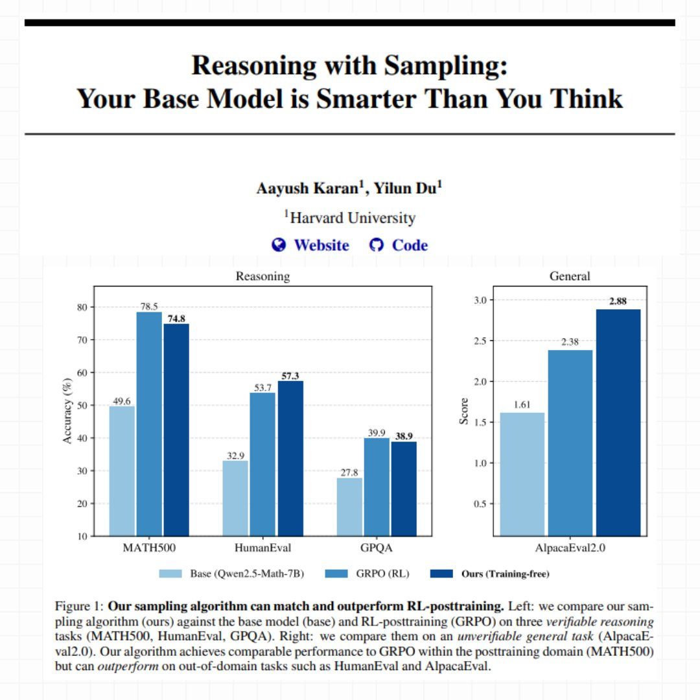
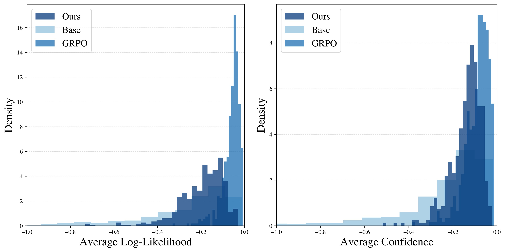

# El Modelo Base Ya Sabía Razonar (Solo Había que Preguntarle de la Manera Correcta)

*Cuando DeepSeek-R1 demostró capacidades de razonamiento casi humanas a principios de 2025, la industria de la IA celebró otra victoria del aprendizaje por refuerzo. El paradigma parecía incontestable: para obtener modelos capaces de razonar sobre problemas complejos de matemáticas, codificación o ciencia, se necesitaba un post-entrenamiento masivo basado en RL. [OpenAI con o1](https://openai.com/index/learning-to-reason-with-llms/), [Anthropic con Claude](https://docs.claude.com), e incluso proyectos de código abierto como [Qwen2.5-Math](https://github.com/QwenLM/Qwen2.5-Math) han seguido este camino: tomar un modelo base, construir un modelo de recompensa preciso, preparar conjuntos de datos curados de problemas verificables, y luego entrenar con algoritmos como GRPO (Group Relative Policy Optimization) invirtiendo semanas de cálculo en clústeres de GPU.*

El costo de esta ortodoxia es considerable. No hablamos solo de millones de dólares en recursos computacionales, sino también de la complejidad de ingeniería: barridos de hiperparámetros para evitar la inestabilidad durante el entrenamiento, conjuntos de datos diversificados que deben ser curados manualmente, y señales de recompensa que deben ser perfectas, de lo contrario el modelo aprende comportamientos no deseados. Como han documentado [investigadores de AWS y Carnegie Mellon](https://aws.amazon.com/blogs/machine-learning/fine-tune-large-language-models-with-reinforcement-learning-from-human-or-ai-feedback/), el proceso RLHF requiere una infraestructura sofisticada donde el modelo de recompensa, la optimización de políticas y el control de la divergencia KL deben equilibrarse en un equilibrio precario.

Sin embargo, en los últimos meses han surgido señales inquietantes. Varios artículos han comenzado a documentar un fenómeno curioso: cuando se compara el pass@k (la probabilidad de que al menos una respuesta de k sea correcta) de los modelos base frente a los post-entrenados con RL, para valores altos de k, los modelos base a menudo ganan. La investigación "[Rewarding the Unlikely](https://arxiv.org/html/2506.02355v1)" de Andre He y colegas identificó lo que llaman "sesgo de rango" en GRPO: el algoritmo refuerza trayectorias ya probables descuidando las raras pero correctas, produciendo lo que definen como "afilado de la distribución". El modelo post-RL resuelve algunos problemas con menos muestreos, pero tiene un rendimiento inferior en comparación con el simple muestreo múltiple del modelo original.

Es como si el RL no enseñara realmente nuevas capacidades, sino que se limitara a hacer más fácil pescar las correctas al primer intento, sacrificando la diversidad de las respuestas. Un compromiso que, en dominios con verificadores perfectos como la "demostración de teoremas" formal, empieza a parecer un mal negocio.

## La Provocación de Harvard

En este contexto, la investigación "[Reasoning with Sampling: Your Base Model is Smarter Than You Think](https://arxiv.org/abs/2510.14901)" de Aayush Karan y Yilun Du de la Universidad de Harvard llega como una provocación metodológica. La pregunta que plantean es radical: ¿y si las capacidades de razonamiento ya estuvieran todas presentes en el modelo base, simplemente enmascaradas por estrategias de muestreo ineficientes?

La intuición no es nueva. Quienes estén familiarizados con "La carta robada" de Edgar Allan Poe recordarán que a veces la solución se esconde a plena vista, demasiado obvia para ser notada. Karan y Du proponen algo similar: en lugar de meses de entrenamiento con RL, utilizan un algoritmo de muestreo más inteligente que aprovecha las probabilidades ya contenidas en el modelo base. Sin nuevos pesos, sin descenso de gradiente, sin modelo de recompensa. Solo una forma diferente de extraer secuencias del modelo existente.

Su método se llama Power Sampling y los resultados son sorprendentes. En [MATH500](https://arxiv.org/abs/2103.03874) (problemas matemáticos de nivel competitivo), su enfoque sin entrenamiento alcanza un 74.8% de precisión en un solo intento con Qwen2.5-Math-7B, casi idéntico al 78.5% obtenido con GRPO después de semanas de entrenamiento. Pero la verdadera sorpresa llega en tareas fuera de dominio: en [HumanEval](https://arxiv.org/abs/2107.03374) (problemas de codificación) Power Sampling obtiene un 57.3% frente al 53.7% de GRPO, y en [AlpacaEval 2.0](https://arxiv.org/abs/2404.04475) (utilidad general) alcanza un impresionante 2.88 frente al 2.38 del modelo post-entrenado.

Como en las mejores historias de Moneyball, donde Billy Beane descubrió que la eficiencia estadística superaba a los presupuestos millonarios, aquí el algoritmo inteligente parece competir con la fuerza bruta computacional. Pero, ¿cómo funciona exactamente este Power Sampling?

[Imagen extraída del artículo oficial de Harvard](https://arxiv.org/pdf/2510.14901)

## El Problema del Muestreo Tradicional

Para entender la innovación de Karan y Du, primero hay que comprender cómo los modelos de lenguaje generan texto. En cada paso, el modelo calcula una probabilidad para cada posible token siguiente. El muestreo "codicioso" (greedy) siempre toma el más probable, produciendo una salida determinista pero a menudo repetitiva y trivial. Para introducir variedad, la industria ha utilizado durante años lo que se llama "muestreo a baja temperatura": se modifican las probabilidades para hacer que las opciones de alta probabilidad sean aún más atractivas, como si se ajustara un termostato que controla cuánto está dispuesto a arriesgar el modelo.

El problema es que este enfoque solo mira el siguiente token, ignorando por completo lo que sucederá en los pasos posteriores. Es como elegir qué camino tomar mirando solo el primer metro: quizás el que parece más bonito al principio lleva a un callejón sin salida, mientras que el menos llamativo desemboca en una autopista.

Los investigadores de Harvard explican el fenómeno con una analogía esclarecedora. Imaginen que tienen que elegir entre dos tokens. El primero tiene muchas continuaciones posibles, cada una mediocre. El segundo tiene muy pocas, pero una de ellas es excelente. El muestreo tradicional a baja temperatura tiende a preferir el primero, porque "en promedio" sus continuaciones parecen tener una probabilidad decente. Pero se está apostando por la cantidad en lugar de la calidad.

Esto se relaciona directamente con lo que los artículos recientes llaman "ventanas críticas" o "tokens pivotales": momentos en la generación donde un solo token equivocado atrapa al modelo en una trayectoria destinada al fracaso. [Investigadores como Li, Karan y Chen](https://arxiv.org/abs/2502.00921) han documentado cómo estos puntos críticos están fuertemente correlacionados con errores de razonamiento. El modelo tenía la respuesta correcta en sus probabilidades internas, pero el método de muestreo lo llevó por el camino equivocado.

## Power Sampling: Mirando al Futuro

La solución propuesta por Harvard se llama "distribución de potencia" y es conceptualmente elegante: en lugar de mirar solo el siguiente token, considera explícitamente la probabilidad de secuencias futuras completas. En la práctica, el modelo ya no pregunta "¿qué token es más probable ahora?", sino "¿qué token me lleva hacia las secuencias completas más probables?".

La diferencia parece sutil pero es profunda. Retomemos el ejemplo de la bifurcación: con el método tradicional, si el primer token lleva a diez caminos mediocres (digamos, cada uno con una probabilidad del 5%), el modelo ve un total del 50% y lo encuentra atractivo. El segundo token lleva a solo dos caminos, pero uno tiene una probabilidad del 40%. El método tradicional prefiere el primero. Power Sampling, en cambio, mira el mejor camino posible desde cada bifurcación y dice: "el segundo token puede llevarme a una secuencia con una probabilidad del 40%, el primero como máximo al 5%. Voy con el segundo".

Este enfoque resuelve naturalmente el problema de los tokens pivotales. Cuando el modelo llega a uno de esos momentos críticos donde una elección atrapa y la otra libera, Power Sampling tiende a elegir la que libera, porque mira explícitamente las consecuencias a largo plazo.

Pero hay un problema técnico no trivial: para calcular las probabilidades de todas las secuencias futuras posibles se necesitarían cálculos astronómicos. Con un vocabulario de cincuenta mil tokens y secuencias de mil tokens, estamos hablando de 50000^1000 posibilidades a evaluar. Es literalmente imposible.

## MCMC: Monte Carlo Salva la Situación

Aquí entra en escena una pieza de la historia de la estadística computacional que se remonta a los años cincuenta. El algoritmo de Metropolis-Hastings, [propuesto originalmente en 1953](https://en.wikipedia.org/wiki/Metropolis%E2%80%93Hastings_algorithm) por un equipo de físicos en el Laboratorio Nacional de Los Álamos para simular sistemas atómicos, resuelve exactamente este tipo de problema: cómo muestrear de una distribución cuando calcularla directamente es imposible.

La idea es ingeniosa. En lugar de calcular todo, se construye un "paseo aleatorio inteligente" a través del espacio de posibilidades. Se parte de una secuencia cualquiera. Se propone una modificación aleatoria (por ejemplo, regenerar una parte de la secuencia). Luego se compara la probabilidad de la nueva versión con la antigua. Si la nueva es mejor, se acepta. Si es peor, se acepta de todos modos con una cierta probabilidad que depende de cuán peor sea. Se repite este proceso muchas veces.

Lo bueno es que no es necesario calcular probabilidades absolutas, bastan las relativas: nueva vs. antigua. Y esto los modelos de lenguaje lo saben hacer muy bien, porque es exactamente lo que hacen durante la inferencia normal. La magia matemática de Metropolis-Hastings garantiza que, si se repite este proceso suficientes veces, el "paseo aleatorio" converge a muestrear exactamente de la distribución deseada.

Karan y Du implementan una variante específica para modelos de lenguaje. En cada paso del algoritmo, eligen al azar un punto en la secuencia y regeneran todo a partir de ahí. Luego comparan la probabilidad total de la nueva secuencia con la antigua (siempre usando el modelo base) y deciden si mantener la nueva versión o quedarse con la antigua. El proceso se repite varias veces por cada "bloque" de texto generado.

Es como un escultor que trabaja la piedra: parte de una forma tosca y la refina progresivamente con golpes estratégicos, aceptando mejoras y ocasionalmente tolerando pequeños retrocesos para evitar quedarse atascado. Cada "golpe" cuesta una regeneración parcial del texto, pero el resultado final es una secuencia que muestrea de la distribución deseada.

## Los Números que Dan la Vuelta a la Tortilla

Los benchmarks no mienten. En tres modelos diferentes ([Qwen2.5-Math-7B](https://huggingface.co/Qwen/Qwen2.5-Math-7B), [Qwen2.5-7B](https://huggingface.co/Qwen/Qwen2.5-7B), y [Phi-3.5-mini-instruct](https://huggingface.co/microsoft/Phi-3.5-mini-instruct)), Power Sampling obtiene enormes mejoras en comparación con los modelos base. Hablamos de mejoras del 25% en MATH500 con Qwen2.5-Math, e incluso del 52% en HumanEval con Phi-3.5-mini. Pero la comparación más interesante es con GRPO, el método de RL considerado el estado del arte.

En MATH500, que es el dominio donde se entrenó GRPO (literalmente vio miles de problemas matemáticos similares durante el entrenamiento), Power Sampling se acerca mucho: 74.8% frente a 78.5%. Una brecha del 3.7% no es despreciable, pero consideren el contexto: GRPO requirió días de entrenamiento en clústeres de GPU, optimización de hiperparámetros y conjuntos de datos curados. Power Sampling opera en un modelo completamente congelado, sin tocar nunca un peso.

La verdadera revelación, sin embargo, llega cuando se sale del dominio de entrenamiento. En HumanEval, un benchmark de problemas de codificación, Power Sampling con Qwen2.5-Math obtiene un 57.3% frente al 53.7% de GRPO. Está superando al modelo especializado en matemáticas en problemas de programación. En AlpacaEval 2.0, que mide cuán útil es el modelo en conversaciones genéricas (sin posibilidad de verificación automática), Power Sampling alcanza 2.88 frente a 2.38 de GRPO, una ventaja del 21%.

Con Phi-3.5-mini la brecha se vuelve dramática: 73.2% frente a 13.4% en HumanEval. No es un error tipográfico: el modelo post-entrenado con RL colapsa en una tarea fuera de su conjunto de entrenamiento, mientras que Power Sampling mantiene un rendimiento excelente.

Pero quizás el dato más revelador es el gráfico del pass@k, es decir, cuántas veces al menos una respuesta de k intentos es correcta. GRPO muestra el clásico problema de "colapso de la diversidad": el pass@16 es apenas ligeramente superior al pass@1, una señal de que el modelo genera siempre respuestas muy similares. Power Sampling, en cambio, mantiene una curva siempre creciente, que se acerca progresivamente al techo del modelo base. En la práctica: obtiene un rendimiento en un solo intento comparable a GRPO pero conserva la capacidad del modelo original de explorar soluciones diferentes.

Un análisis más profundo confirma la intuición. Cuando los investigadores miden cuán "probables" son las respuestas generadas (según el modelo base), encuentran que GRPO produce un pico muy estrecho en las secuencias de altísima probabilidad. Es como si hubiera aprendido una receta específica y la repitiera obsesivamente. Power Sampling, en cambio, distribuye sus respuestas en un rango más amplio de secuencias probables, manteniendo la diversidad sin sacrificar la calidad.

Un fenómeno curioso: las respuestas de Power Sampling son, en promedio, tan largas como las de GRPO (unos 679 tokens frente a 671 en MATH500), a pesar de que el algoritmo no incentiva explícitamente secuencias largas. El "razonamiento extendido" emerge de forma natural, probablemente porque los caminos de razonamiento más articulados y detallados tienden a tener probabilidades compuestas más altas en el modelo base.

[Imagen extraída del artículo oficial de Harvard](https://arxiv.org/pdf/2510.14901)

## El Costo del Razonamiento Inteligente

Por supuesto, nada es gratis. Power Sampling requiere más computación durante la inferencia. Los investigadores estiman que, con los parámetros utilizados en sus experimentos, generar una respuesta requiere aproximadamente 8.84 veces más tokens que una generación estándar. Esto se debe a que el algoritmo regenera repetidamente partes de la secuencia en el proceso de "refinamiento" MCMC.

Para ponerlo en perspectiva: una época de entrenamiento de GRPO con configuración estándar cuesta de todos modos más, porque tiene que generar múltiples despliegues (rollouts) para cada ejemplo y gestionar un conjunto de datos más grande. Pero hay una diferencia fundamental: el costo de GRPO es único (se paga una vez, luego el modelo es más rápido), mientras que Power Sampling paga el costo en cada inferencia.

Sin embargo, hay otra cara de la moneda. GRPO requiere GPUs potentes con mucha memoria para mantener en RAM los pesos del modelo, los estados del optimizador y calcular las penalizaciones KL. Power Sampling puede ejecutarse en hardware más económico optimizado para inferencia, porque nunca modifica los pesos. Y lo más importante: funciona en cualquier modelo base, sin necesidad de conjuntos de datos curados, señales de recompensa perfectas o semanas de supervisión del entrenamiento.

Los experimentos también muestran que el algoritmo es sorprendentemente robusto. El parámetro principal a ajustar (llamado alfa en el artículo) funciona bien en un rango amplio: cualquier valor entre 2 y 6 produce resultados comparables para tareas matemáticas. El número de pasos MCMC necesarios es modesto: ya con 2 pasos se ven mejoras sustanciales, y 10 pasos parecen suficientes para converger. Más de eso añade poco.

Esto sugiere que el algoritmo "mezcla" eficazmente el espacio de secuencias posibles, evitando las patologías típicas de MCMC en alta dimensión donde se necesitarían millones de iteraciones para converger. Es una señal de que la intuición teórica se traduce en una práctica algorítmica funcional.

## Implicaciones y Preguntas Abiertas

Sin embargo, existen limitaciones y es importante reconocerlas. En primer lugar, esta es una investigación preliminar: la escalabilidad en tiempo de prueba es todavía un territorio en gran parte inexplorado. No sabemos cómo se comporta Power Sampling en conversaciones largas de varios turnos, o en tareas que requieren una memoria contextual extensa. Para dominios donde la verificación es costosa o imposible (como la escritura creativa o la resumen subjetivo), medir los beneficios se vuelve mucho más matizado.

Luego hay un aspecto epistemológico más profundo que el artículo solo toca tangencialmente: si Power Sampling funciona tan bien, ¿qué nos dice realmente sobre el aprendizaje por refuerzo? Una respuesta optimista es que RL y Power Sampling capturan señales complementarias: quizás RL enseña efectivamente nuevos patrones de razonamiento que emergen durante el entrenamiento, mientras que Power Sampling es mejor para extraer capacidades ya latentes.

Pero la interpretación más provocadora es que gran parte de la ganancia de RL es un "afilado de distribución costoso" replicable con un "muestreo económico". Si es así, las curvas de escalado deberían reinterpretarse. Ya no "cuánto RL se necesita para un X% de mejora", sino "cuánta ganancia proporciona RL más allá del techo del modelo base con un muestreo óptimo".

Esta perspectiva se conecta directamente con nuestros artículos anteriores sobre [TRM de Samsung](https://aitalk.it/it/trm-samsung.html) y [DeepConf de Microsoft](https://aitalk.it/it/AI-deepconf.html), donde exploramos cómo las estrategias algorítmicas inteligentes pueden obtener resultados competitivos sin recurrir a la escala bruta. TRM usaba recuperación en tiempo de prueba para mejorar la factualidad, DeepConf aprovechaba la confianza intrínseca para la autocorrección, y Power Sampling extrae el razonamiento de las probabilidades base. El hilo conductor es claro: la inteligencia artificial de 2025 está redescubriendo que a veces el problema no es el tamaño del modelo, sino cómo se usa.

Luego está la cuestión práctica de la adopción. Power Sampling requiere modificaciones sustanciales en la infraestructura de inferencia: en lugar de un simple pase hacia adelante, es necesario implementar el bucle MCMC con aceptación/rechazo. ¿Deberían los proveedores de API exponer esto como una opción? ¿A qué precio? ¿Cómo equilibrar la latencia percibida por el usuario (que aumenta) con la calidad de la respuesta?

Y hay implicaciones competitivas interesantes. Los modelos de código abierto podrían usar Power Sampling para competir con los propietarios más grandes sin necesidad de costosos post-entrenamientos. Pero los propietarios podrían combinar ambos enfoques: entrenamiento con RL más Power Sampling en la inferencia, obteniendo lo mejor de ambos mundos. Quién gane en esta carrera dependerá de cuán rápido se adapte el ecosistema.

En una industria obsesionada con "más grande es mejor" y "más entrenamiento es mejor", investigaciones como esta de Harvard son un recordatorio saludable de que la innovación algorítmica cuenta al menos tanto como la escala. No para reemplazar la escalabilidad (que sigue siendo crucial), sino para explorar fronteras de eficiencia donde cada token cuesta y cada idea puede marcar la diferencia entre sistemas sostenibles e insostenibles.

Como diría cualquier ingeniero que creció con Ghost in the Shell, a veces descubrimos que el alma ya estaba en la máquina. Solo teníamos que aprender la forma correcta de llamarla. La pregunta ahora es: ¿cuántas otras capacidades latentes se esconden en nuestros modelos base, esperando que alguien invente el algoritmo adecuado para extraerlas?