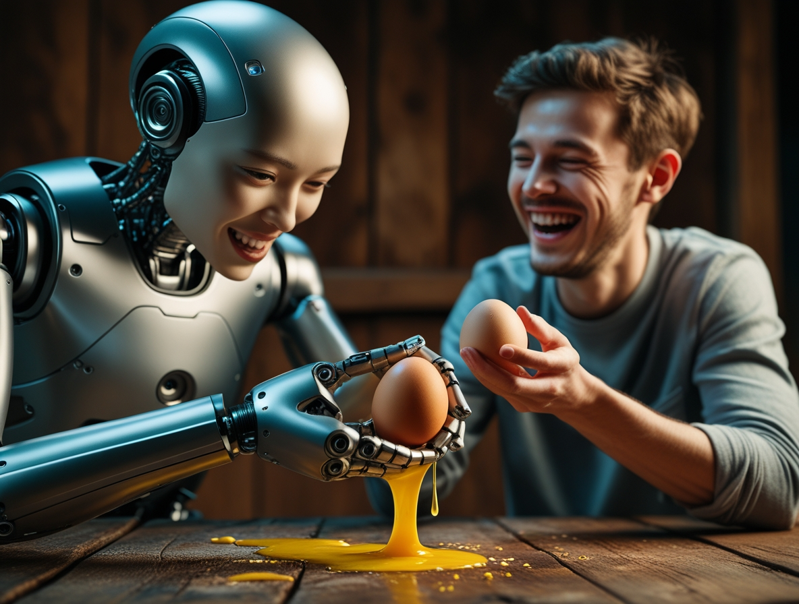
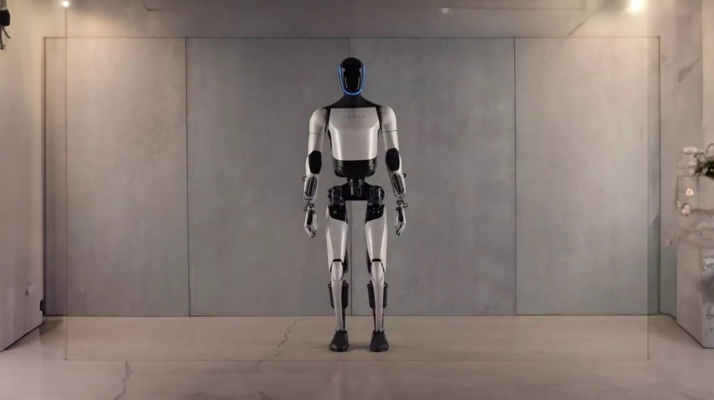
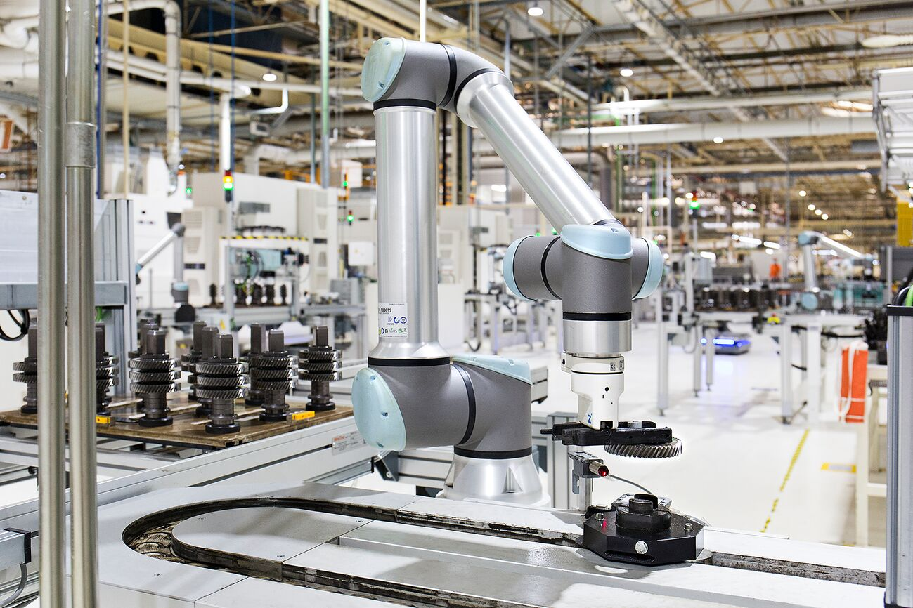

# Robotics: the state of the art 2025. Separating Hype from Reality

*In October 2024, Tesla presents "We, Robot" at Warner Bros Studios. Optimus distributes drinks, plays "rock-paper-scissors," and entertains guests with fluid movements. The videos go viral in a few hours. A few days later, [Fortune Italia](https://www.fortuneita.com/2024/10/14/i-robot-optimus-di-musk-hanno-fatto-scalpore-ma-erano-telecomandati/) and other media reveal that the humanoids were teleoperated by human technicians. [Adam Jonas of Morgan Stanley](https://techprincess.it/robot-optimus-tesla-telecomandati/) confirms the use of teleoperation, as admitted by some robots themselves who stated "today I am assisted by a human." The synthetic voice? A human operator on headphones. These "details" hide the central problem of humanoid robotics in 2025: the abysmal gap between controlled demos and autonomous deployment.*

It's not the first time. In 2021, the first Optimus was a dancer in a suit. In 2022, the prototype walked but wobbled. In 2023, the hands acquired limited manipulative dexterity. Today, in November 2025, Tesla claims that twenty units are working in its factories on repetitive tasks. Verifying these claims from the outside is impossible: no independent journalist has filmed Optimus operating autonomously for full shifts. This pattern is repeated in the industry: impressive videos, bold claims, independent verifications that reveal teleoperation or ultra-controlled scenarios.

Welcome to the state of the art of robotics combined with artificial intelligence: a territory where extraordinary engineering coexists with aggressive marketing, where real progress is inflated by unrealistic expectations, where separating what works from what is "almost ready" requires a clinical eye. As in *Planetes*, the anime by Makoto Yukimura where space debris is collected by human operators because full automation remains too expensive and unreliable, even in terrestrial robotics of 2025 the last mile towards true autonomy proves to be the longest.

## Atlas: The Technical Benchmark

If there is a technical gold standard in humanoid robotics, it is [Atlas from Boston Dynamics](https://bostondynamics.com/atlas/). Not for commercial applications, which are almost absent, but for the capabilities demonstrated in a verifiable way. In August 2024, the company presented the electric version of the robot, abandoning the hydraulics that had characterized previous models. The new Atlas weighs 89 kg, measures 150 cm, and integrates 28 degrees of freedom with custom electric actuators that Boston Dynamics does not sell separately. The peculiarity: joints that rotate beyond human anatomical limits, allowing for complete torso rotations and movements "impossible" for a biological body.

In October 2024, Boston Dynamics released videos of Atlas manipulating automotive components in a semi-structured industrial scenario. The robot recognizes variable objects, adapts its grip, and corrects errors. No teleoperation, but [Large Behavior Models](https://www.bostondynamics.com/blog/electric-new-era-for-atlas) trained on thousands of hours of simulations and real data. When it makes a mistake, it tries again with a different strategy. When the environment changes, it recalculates the path. Is this true autonomy? Yes, but in a restricted scenario: known components, mapped space, repetitive task with limited variations.

The real leap forward came in October 2024 with the [partnership between Boston Dynamics and Toyota Research Institute](https://bostondynamics.com/news/boston-dynamics-toyota-research-institute-announce-partnership-to-advance-robotics-research/). The goal: to combine Atlas's hardware platform with the Large Behavior Models developed by TRI, trained on billions of simulated interactions. Toyota brings experience in real-world manufacturing, Boston Dynamics brings frontier robotics. Together they aim to create humanoids capable of learning new tasks in hours rather than months, generalizing from a few examples as language models do with text.

But Atlas remains a research project. The estimated cost per unit, not declared but estimated, is in the hundreds of thousands of dollars. Operational autonomy: about 4 hours before recharging. Maintenance: specialized technicians. Commercial deployment: zero. Boston Dynamics does not sell Atlas, it uses it as an R&D platform to refine technologies that then end up in products like Spot, the robotic dog that has found niches in industrial inspections and construction sites. Atlas demonstrates what is technically possible, not what is economically scalable.

## Tesla Optimus: Vision or Vaporware?

Elon Musk has a theory: humanoid robotics will be bigger than the automotive industry, bigger than energy. [He predicts a market of 25 trillion dollars](https://www.nbcnewyork.com/news/business/money-report/elon-musk-claims-optimus-robots-could-make-tesla-a-25-trillion-company-more-than-half-the-value-of-the-sp-500-today/5505911/), with Optimus costing $20-30,000 and "revolutionizing the economy." Tesla employs over 200 engineers on the project, has built dedicated AI training infrastructures, and invests billions. The ambition is real. The verifiable results are much less so.

The latest public update was in October 2024: Optimus Gen 2 walks faster, the hands have 11 degrees of freedom, and it can grasp an egg without breaking it. In the official videos, it folds clothes, sorts objects, and transports components in the factory. But as we have seen, many demos were disguised teleoperation. Tesla claims that in November 2025, twenty units will be working autonomously in its Texas factories. Verification is impossible: no external access, no confirmation from third-party sources.

The central problem is economic. Industry analysts estimate that producing a minimally capable humanoid today costs $120-150,000: high-torque actuators, multiple LIDAR and vision sensors, 2-3 kWh batteries, and a powerful onboard computer. Dropping to $20-30,000 would require massive economies of scale (hundreds of thousands of units) and technological breakthroughs in batteries and actuators. Tesla has experience in scaling automotive manufacturing, but a car has about 30,000 components; a capable humanoid would have as many, with tighter mechanical tolerances.

Then there is the paradox of utility. For which task does a general-purpose humanoid at $30,000 beat a specialized robot at $5,000? In warehouses, Amazon's autonomous mobile robots cost a fraction and move more goods. At home, robotic vacuum cleaners cost 500 euros and work. A domestic humanoid would have to cook, clean, iron, and do repairs: tasks that individually have cheaper automated solutions, while integrating them into an anthropomorphic body multiplies complexity and costs.

Musk is right about one thing: if someone solves the problem, they will have a huge market. But "if" and "when" are questions that no serious engineer answers with certainty. Tesla has resources, talent, and vision. But after three years of announcements, verifiable large-scale deployments are still missing.

[Image of Tesla Optimus from xpert.digital](https://xpert.digital/it/optimus-roboticus-humaniformis/)

## Figure AI: One Robot at BMW (Just One)

In January 2024, Figure AI [announced a partnership with BMW](https://techcrunch.com/2024/01/18/bmw-will-deploy-figures-humanoid-robot-at-south-carolina-plant/) to integrate the Figure 02 robot at the Spartanburg, South Carolina plant. The press releases talk about "revolutionizing automotive manufacturing." The videos show Figure 02 inserting components into a car body with millimeter precision. Investors like OpenAI, Nvidia, Microsoft, and Intel pumped $675 million into the Series B round. Valuation: $2.6 billion. The hype is through the roof.

Ten months later, in October 2024, Figure AI published a substantial update: one Figure 02 robot has worked for five consecutive months, ten hours a day, in a controlled section of the plant. The task: to install specific components on a single vehicle model. It is no longer a pilot test of days or weeks, but a prolonged deployment with real operational data. The company reports uptime of over 70%, with progressive improvements thanks to the data collected in the field. The robot learns from real errors, not simulated ones, adapting gripping strategies and correcting deviations.

But the limitations remain evident: a single robot, a single task, an ultra-controlled environment. Training time for that specific operation: six months. BMW confirms that the goal is not to replace workers but to automate ergonomically demanding or dangerous tasks. By the end of 2025, the goal is to have ten operational units in different tasks. In the long term, hundreds.

The critical point remains the ROI. A human operator at BMW costs about $70,000 annually between salary and benefits. Figure 02 is estimated to cost $150,000, plus maintenance ($20-30,000 annually), plus specialized training for each new task. Break-even in three to four years, assuming the robot works steadily without performance degradation. For BMW, which produces 1.5 million vehicles annually in 31 plants, scaling from one to a thousand robots requires not only capital but also software infrastructures (fleet management, monitoring, OTA updates) that today exist only in embryonic form.

Figure AI is building those infrastructures, but the transition from a single deployment to a fleet of hundreds of units is where many robotics startups have failed. Rethink Robotics, a pioneer of cobots, shut down in 2018 despite solid technology and large customers: support and customization costs eroded margins. Figure AI has more capital and better partners, but the economic physics do not change: each additional robot costs almost as much as the first until you reach massive scale. Five months of continuous operation is a significant milestone, but the distance between one robot and a thousand remains immense.

## Clone Alpha: Fascinating Biomimetics, No Proof

[Clone Robotics](https://www.hwupgrade.it/news/scienza-tecnologia/protoclone-di-clone-robotics-e-un-robot-umanoide-che-sembra-fantastico-ma-che-fa-anche-tanta-paura_135958.html), a startup based in Warsaw, is pursuing a radically different approach: not electric motors but synthetic "muscles" powered by a hydraulic vascular system. Clone Alpha, introduced in 2024, has forearms and hands with myofibers that contract like biological tissue, fingers with 26 degrees of freedom, and fluid, precise movements. Aesthetically impressive: the translucent synthetic skin reveals tendons and actuators, like an anatomical illustration by Andreas Vesalius brought to three dimensions.

The problem: there are no videos of Clone Alpha performing complex tasks autonomously. The official videos show single gripping movements, wrist rotations, and finger flexions. All in a controlled environment, with the torso absent. Clone Robotics promises that the musculoskeletal system allows for more natural and adaptable movements than motorized ones, with intrinsic tactile feedback. But until we see the complete robot operate for minutes, not hours, in semi-structured scenarios, these remain theoretical claims.

The biomimetic advantage is real in theory: biological muscles have a higher power-to-weight ratio than electric motors, naturally dampen mechanical shocks, and adapt to irregular surfaces. But hydraulics introduce complexity: pumps, valves, pressure sensors, risk of leaks, and intensive maintenance. In industrial robots, hydraulics have been largely abandoned for electrics in the last twenty years precisely for reliability and operating costs.

Clone Robotics claims to have solved these problems with innovative materials and a compact design. They have raised several million in seed funding, collaborate with European universities, and present peer-reviewed papers on actuator design. But the leap from a functioning subsystem to an integrated robot is enormous. It took Boston Dynamics fifteen years with massive resources. Clone is a small startup in a market dominated by giants with billion-dollar budgets.

The feeling is like looking at an extraordinary concept car: bold design, fascinating technologies, but no certainty that it will ever go into production. In humanoid robotics, engineering regularly surpasses science fiction in papers, but crashes against economics and physics when it needs to scale.

## Robotic Surgery: The Consolidated Excellence

If you want to see advanced robotics that really works, step into an operating room. [Intuitive Surgical](https://www.intuitive.com/), with its da Vinci platform, has dominated robotic surgery for over twenty years. The da Vinci 5 system, introduced in 2024, integrates over 150 force sensors that transmit tactile feedback to the surgeon, allowing them to "feel" tissues through the instruments. 10-megapixel 3D resolution, latency under 50 milliseconds, tremor stabilization, and 1:3 movement scaling for sub-millimeter precision.

The numbers are impressive: over 8,500 systems installed globally, more than 15 million robotic procedures performed cumulatively, and 12,000 procedures in the first six months of 2024 alone. In prostate, thoracic, and gynecological surgery, da Vinci is the standard in many centers of excellence. Why does it work where humanoids struggle? Three reasons: a specific and well-defined task, an ultra-controlled environment, and a human surgeon in the loop.

Da Vinci is not autonomous: it enhances human capabilities, it does not replace them. The surgeon controls every movement via a console; the robot translates human inputs into precise actions, filtering tremors and scaling movements. It is highly advanced teleoperation, but it remains teleoperation. AI comes into play in the diagnostic phases: pre-operative image analysis, suggestions on resection margins, and identification of critical structures. But the decision remains human.

The limitations are economic and logistical: a da Vinci 5 system costs $2-3 million, disposable instruments $2-3,000 per procedure, and maintenance contracts $150-200,000 annually. Only large and specialized hospitals can afford it. In addition, there is a steep learning curve: a surgeon takes 100-150 procedures to achieve proficiency. This creates disparities: robotic excellence concentrated in a few centers, with the rest of the world operating traditionally.

Competition is emerging: Medtronic with Hugo, Johnson & Johnson with Ottava, and CMR Surgical with Versius. All aim for lower costs and greater modularity. But da Vinci maintains its first-mover advantage: thirty years of operational data, a consolidated training ecosystem, and a huge installed base. In robotic surgery, the technology has moved beyond the demonstration phase and has become a clinical standard. In general-purpose humanoids, we are still at the demo stage.

## Cobots: The Silent Revolution

While humanoids capture headlines, [collaborative robots](https://www.universal-robots.com/) (cobots) are silently transforming global manufacturing. Universal Robots, ABB, FANUC, and KUKA sell tens of thousands of units annually. The market is worth $1.9 billion in 2024, and [IDTechEx projections see it at $11.8 billion by 2030](https://www.idtechex.com/en/research-report/collaborative-robots-2023-2033/897). Why do they work? Because they don't pretend to be human.

A cobot like the UR10e from Universal Robots: a six-axis arm, 10 kg payload, ±0.03 mm precision, and a cost of $35-45,000. It is programmed with a drag-and-drop graphical interface: no code, an average technician can train it in days. Torque sensors on each joint detect collisions and stop the movement within 0.4 seconds, making it safe to work alongside without protective cages. It consumes 500 watts, runs on a standard power grid, and occupies half a square meter.

The tasks: pick-and-place, screwing, assembly, quality inspection, and packaging. Repetitive tasks, ergonomically demanding for humans, that cobots perform 24/7 with consistent quality. In automotive, electronics, food processing, and pharmaceutical lines, cobots work alongside human operators in collaborative cells: the robot handles the repetitive work, the human supervises and manages exceptions. It is the practical application of Moravec's Paradox: what is difficult for humans (hyper-precise repetition) is easy for robots, and what is easy for humans (adapting to variations) is difficult for robots.

The limitations are clear: limited payload (10-20 kg), lower speed than traditional industrial robots, and the inability to handle high variability. But for structured tasks, the ROI is documented: McKinsey studies show a payback in 12-24 months, with productivity increased by 20-40% and defect reduction of 15-30%. Small and medium-sized companies that could not afford traditional automation are now integrating cobots.

The future direction: cobots with AI vision that recognize variable objects, learn by demonstration instead of programming, and reconfigure themselves autonomously for new tasks. Projects like the [Robotics Hub](https://www.eu-robotics.net/) funded by the EU are standardizing software interfaces to make cobots more interchangeable and less dependent on single vendors. It is pragmatic automation, not visionary, but it works and is profitable today, not tomorrow.

[Image of a Cobot from universal-robots.com](https://www.universal-robots.com/it/prodotti/ur10e/)

## The Three Technical Walls

Behind every humanoid that walks unsteadily or clumsily manipulates objects are brutal physical limits. Three above all define the gap between prototype and product.

**Batteries**: a working humanoid consumes 200-500 watts continuously. With current Li-ion batteries, with an energy density of about 250 Wh/kg, 4 hours of autonomy require 2-3 kWh, which is 8-12 kg of batteries. On a robot that already weighs 50-80 kg, this drastically reduces payload and agility. The Tesla Optimus has a 2.3 kWh battery for a declared autonomy of "several hours" (not specified). The electric Atlas uses an undisclosed custom battery, with an estimated autonomy of 3-4 hours. Any breakthrough in energy density would help, but batteries improve by 5-7% annually, not 50%. It will take years to double autonomy without increasing weight.

**Actuators**: electric motors face the trilemma of strength, speed, and efficiency. A high-torque actuator is heavy and slow, a fast one has little strength, and an efficient one has both limited. Human joints handle enormous loads with very low consumption: a quadriceps can lift 100 kg while consuming a few watts at rest. Robotic actuators consume power even when stationary to maintain their positions. Emerging technologies (series elastic actuators, high-density permanent magnet motors) are improving but cost thousands of dollars per joint. A humanoid with 25-30 advanced actuators has prohibitive hardware costs.

**Dexterity**: the human hand has 27 bones, 34 muscles, thousands of tactile receptors, and 26+ degrees of freedom. The most advanced robotic hands have 10-16, with rudimentary tactile sensors. Grasping a rigid object is manageable; manipulating soft tissues, fragile objects, or slippery surfaces remains very difficult. High-resolution tactile feedback would require thousands of sensors per cm², complex electronics, and real-time processing. Today, robots "feel" through torque sensors in their motors: indirect and imprecise. Research on electronic skin and flexible tactile sensors is advancing, but integrating thousands of sensing points into a functioning hand is extreme engineering.

These limits are not bugs that can be fixed with software: they are physical constraints. AI can improve control and planning, but it cannot create energy from nothing or increase the torque of a motor beyond its specifications. Every progression requires material breakthroughs or radically new designs. It is not a question of "if," but "when" – and the "when" is much further away than press releases suggest.

## The Geography of Investments

Humanoid robotics is a field dominated by a few players concentrated in the US and China. In 2024, American (Figure AI, Apptronik, Agility Robotics) and Chinese (UBTech, Fourier Intelligence, Unitree) startups will raise a total of over $700 million. The main investors: Nvidia, OpenAI, Microsoft, Amazon, and sovereign wealth funds. The concentration is extreme: 70% of the capital flows to five companies.

Nvidia is playing the role of kingmaker with [Project GR00T](https://nvidianews.nvidia.com/news/foundation-model-isaac-robotics-platform), an AI platform for humanoid robots based on simulation-to-reality transfer. It provides a software stack (perception, planning, control) and access to the H100/H200 GPUs needed to train behavioral models. In return, the startups integrate Nvidia hardware and share operational data. It is the robotic equivalent of the CUDA ecosystem: Nvidia controls the computational infrastructure, while others compete on hardware and applications.

China is pursuing a different strategy: massive state investments combined with private equity. UBTech has Walker S robots operating in hospitality and manufacturing scenarios; Unitree sells consumer quadrupeds for $1,600; Fourier Intelligence exports rehabilitation exoskeletons. The approach is pragmatic: simpler and cheaper products, rapid scaling, and government subsidies for domestic deployment. While the US aims for a general-purpose humanoid for $20,000 in ten years, China is selling specialized robots for $5,000 today.

Europe is lagging behind. Projects like [ARISE](https://cordis.europa.eu/project/id/101070558), funded by Horizon Europe with total budgets under 50 million, are doing excellent research but are not scaling up to products. European startups (Clone Robotics, Reachy by Pollen Robotics) remain small due to a lack of venture capital willing to risk billions. The EU invests more in regulation (AI Act, safety standards) than in deployment. The result: research published in Nature, products sold by others.

This concentration creates risks: a few companies control data, algorithms, and supply chains. If a breakthrough occurs, it will be proprietary and expensive to license. An open-source alternative exists (ROS, Robot Operating System) but has limited traction in the commercial sphere due to a lack of enterprise support. The risk is not only economic but geopolitical: advanced robotics is becoming a strategic lever like semiconductors and AI, with the same dynamics of technological dependence.

## The Uncomfortable Questions

**Employment impact**: [The IFR estimates](https://ifr.org/ifr-press-releases/news/world-robotics-2024-report-announced) 4.2 million industrial robots will be operational globally by the end of 2024, a 7% year-on-year increase. Each robot replaces an average of 1.5-3 workers in repetitive tasks. But it also creates demand for technicians, programmers, and maintenance personnel. The *World Economic Forum's Future of Jobs 2023* predicts that automation will eliminate 83 million jobs by 2027 but create 69 million new ones. The net negative transition of 14 million, however, hides huge disparities: the jobs lost are operational, while the ones created require advanced technical skills. Someone who assembles components manually today will not become a ROS programmer tomorrow without massive retraining that most countries are not adequately funding.

**Hidden costs**: every robot in production has operational costs that are often ignored in business cases. Fleet management, 24/7 monitoring, software updates, parts replacement, and unforeseen downtime. McKinsey documents that the TCO (total cost of ownership) of robotics is typically 2-3 times the purchase price over five years. Massive deployments also require physical infrastructure: ultra-flat floors, controlled lighting, and segregated areas for charging and maintenance. These costs mean that automation is only worthwhile above certain production scales, excluding small and medium-sized companies.

**Healthcare ethics**: assistive robots in eldercare raise unresolved questions. They can monitor vital signs, remind patients of therapies, and reduce falls. But does an elderly person who interacts mainly with a machine experience increased social isolation? Studies in Japan, where robots like Pepper have been tested in nursing homes, show mixed results: functional benefits (reminders, monitoring) but a significant reduction in human interaction. The risk is that automation becomes an excuse to reduce healthcare staff, with robots "filling the gap" created by economic choices. The technology is not the problem, but how it is applied and for what purposes.

**Realistic timelines**: ask ten experts when we will have affordable general-purpose domestic robots and you will get ten different answers. Rodney Brooks, founder of iRobot and Rethink Robotics, is skeptical: "Not before 2040, maybe never." Demis Hassabis of Google DeepMind is optimistic: "Mid-2030s for limited applications." Goldman Sachs analysts predict a mass-market post-2035. The quiet consensus is that restricted scenarios (logistics, manufacturing, hospitality) will see specialized robots scale in the next 5-7 years, while the domestic humanoid that cooks and cleans autonomously remains science fiction for at least the next decade.

## 2025: Year Zero or Hype Cycle?

Where are we really? The answer depends on which robotics we are looking at. **Surgery**: mature, reliable, and expanding. **Industrial cobots**: massive deployment underway, proven ROI. **Specialized logistics**: autonomous mobile robots in Amazon and DHL warehouses are scaling rapidly. These work because the task is specific, the environment is controlled, and a human fallback is available.

**General-purpose humanoids**: maximum hype, minimum deployment. The prototypes are impressive, the demos are spectacular, and the investments are in the billions. But the leap from "works in a lab with supervision" to "works autonomously for eight-hour shifts in unpredictable scenarios" is still missing. That leap requires not one breakthrough, but dozens: batteries, actuators, sensors, materials, algorithms, and costs.

Moravec's paradox, formulated in the 1980s, stated that complex cognitive tasks (chess, calculation) are easy for computers, while simple sensorimotor tasks (walking, manipulating) are very difficult. AI has surpassed the cognitive part: GPT-4 surpasses humans in many linguistic tasks. But physical embodiment remains a bottleneck. Getting a robot to make you an omelet is still harder than getting it to write you a novel.

As in the movie *Her* by Spike Jonze, where the AI Samantha is intimately present but physically absent, we may find that artificial intelligence radically transforms our lives through software interfaces long before it does through robotic bodies. When intelligence is everywhere but has no hands, the question becomes: do we really need humanoid robots, or are we trying to replicate ourselves out of anthropocentric narcissism?

The answer will come not from the labs of Boston or Palo Alto but from the factories, hospitals, and warehouses where specialized robots are already working in silence, solving real problems without looking like humans. The hype tells one story. Engineering writes another, slower and less glamorous, but real. And in 2025, what really works almost never resembles the science fiction we imagined.
