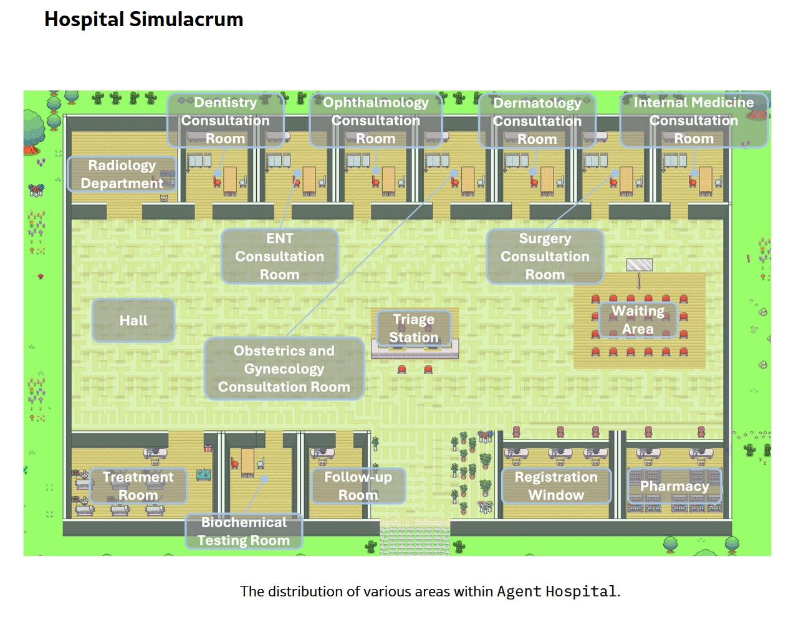
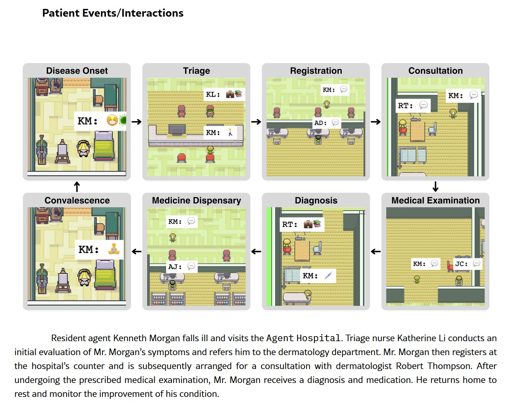
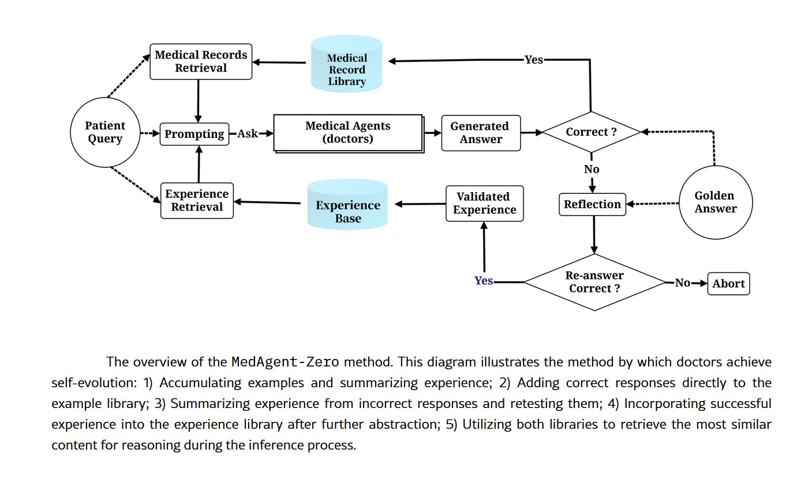

# The Virtual Hospital: When Artificial Intelligence Becomes a Doctor

*China's Agent Hospital simulates thousands of diagnoses a day in a virtual world. Is it the future of medicine or the beginning of a revolution no one asked for? Imagine a hospital that runs twenty-four hours a day, seven days a week. Doctors see patients, order tests, interpret X-rays, and prescribe therapies. In just a few days, they treat ten thousand clinical cases, accumulating experience that would take years in a crowded emergency room. There's just one detail that makes all of this unsettling: none of those patients really exist. No one suffers, no one heals, no one dies. It's as if *The Sims* met *E.R.* in a dimension where no one is playing, but something is learning.*

[Tsinghua University's Agent Hospital](https://www.globaltimes.cn/page/202508/1340436.shtml), officially inaugurated in April 2025 with its first integration at Beijing Changgung Hospital, represents more than just an academic experiment. It's an entire synthetic healthcare ecosystem where artificial intelligences train to be doctors by treating entities that exist only as strings of code. Forty-two virtual doctors, twenty-one medical specialties, five hundred thousand patients who have never drawn a breath. The question is no longer whether artificial intelligence can make medical diagnoses: the question is whether we are building the doctors of the future or if we have just opened a Pandora's box that no one knows how to close.

## Anatomy of a Virtual World

Under the hood of the Agent Hospital is [MedAgent-Zero](https://arxiv.org/html/2405.02957v1), a technically sophisticated [framework](https://github.com/gersteinlab/MedAgents) that overturns the traditional approach to training medical artificial intelligences. Instead of feeding a model with static datasets of past clinical cases, the Tsinghua researchers have built an environment where AI agents learn by doing, just as flesh-and-blood residents would. The difference is in scale and speed: what would take a human doctor a four-year residency happens here in days of continuous simulation.

The architecture is based on large language models modified to operate in a perpetual learning cycle. The system autonomously generates synthetic patient profiles with clinical histories, symptoms, and lab results. These virtual patients enter the ghost hospital and are assigned to AI doctors, each specializing in a specific area: cardiology, oncology, respiratory medicine, neurology. The agents conduct medical histories, request diagnostic tests, interpret data, formulate diagnoses, and propose treatment plans. After each interaction, a feedback system evaluates the correctness of the clinical decisions by comparing them with established guidelines and the ground truth of the simulated case. Errors become lessons, and successes reinforce decision-making patterns.

The current numbers are impressive but not perfect, and this honesty in the metrics is perhaps more significant than the percentages themselves. In the examination phase, that of taking medical history and collecting data, the system achieves eighty-eight percent accuracy. In the diagnosis phase, it rises to ninety-five point six percent. In treatment planning, the most complex phase because it requires not only identifying the disease but also balancing therapeutic effectiveness, side effects, comorbidities, and patient preferences, the accuracy drops to seventy-seven point six percent. On the MedQA benchmark, which uses USMLE-style questions (the U.S. medical licensing exam) focused on respiratory diseases, the system reached ninety-three percent.

Is this performance that would make many human doctors pale? It depends. Ninety-three percent on multiple-choice questions is excellent but not extraordinary for an AI system optimized for that type of task. Seventy-seven percent in treatment planning is more concerning: it means that in almost one in four cases, the proposed therapy is not optimal. In a real hospital, with real patients, this percentage would represent thousands of potentially serious errors. But this is where the true value of simulation emerges: those errors occur in a safe environment, where the only consequence is an adjustment of the neural weights.

Time compression is the real superpower of this architecture. What in medicine requires years of clinical experience, exposure to hundreds of different cases, and sleepless nights on call is condensed here into computational cycles. An AI doctor can see more cases of atypical pneumonia in one week of simulation than a human pulmonologist would see in an entire career in a provincial hospital. The problem is understanding whether the quantity of exposure truly equates to quality of competence.

[Image from the Agent Hospital paper](https://arxiv.org/html/2405.02957v1)

## From Virtual to Real

The deployment timeline of the Agent Hospital tells a story of dizzying acceleration. Internal testing began in November 2024, when the system was still confined to the Tsinghua labs. The public pilot started in the first quarter of 2025, with real doctors beginning to interact with AI-generated diagnoses in controlled scenarios. In April 2025, the operational integration with Beijing Changgung Hospital arrived, marking the transition from an academic experiment to an effective clinical tool.

Behind this transition is Tairex, the spin-off startup that commercialized the technology under the brand Zijing AI Doctor. The forty-two virtual doctors today cover over three hundred diseases and are active in pilot programs ranging from ophthalmology to radiology, from respiratory medicine to general practice. These are not simple medical chatbots or telephone triage systems: these AI agents are integrated into real hospital workflows, assisting human doctors in reading diagnostic imaging, suggesting differential diagnoses, and proposing evidence-based treatment protocols.

The economic model behind this revolution is both ambitious and pragmatic. The most conservative estimates speak of a potential saving of ten to twenty percent on overall hospital costs. Projected to 2050 in the U.S. healthcare system alone, this would translate to a range between three hundred and nine hundred billion dollars a year. Numbers that make the eyes of hospital CFOs and healthtech investors sparkle, but that raise uncomfortable questions: are we optimizing patient care or are we optimizing balance sheets?

The stated goal of the Chinese researchers is twofold and seemingly noble. On the one hand, to bridge the healthcare gap in rural areas and regions underserved by specialized medical personnel, a particularly acute problem in a country with one point three five billion inhabitants distributed over a territory as vast as Europe. On the other hand, to create a training ground for what they call "AI-collaborative physicians," a new generation of doctors who do not work against artificial intelligence nor are replaced by it, but learn to orchestrate it as a tool for cognitive enhancement. It is a seductive, almost utopian vision. The devil, as always, is in the implementation.

[Image from the Agent Hospital paper](https://arxiv.org/html/2405.02957v1)

## The Dark Side of the Algorithm

### Legal Liability in a Regulatory Vacuum

The first crack in the gleaming edifice of medical AI opens on the issue of liability. When an AI doctor makes a wrong diagnosis, who is responsible? The human doctor who supervised (or did not supervise) the decision? The hospital that implemented the system? The developers who trained the model? The university that conducted the research? The honest answer is: no one knows for sure, because the regulatory frameworks are dramatically behind the technology.

The U.S. Food and Drug Administration classifies medical algorithms as medical devices, but the existing categories do not capture the dynamic nature of machine learning-based systems that continue to learn after deployment. The European Medical Device Regulation is even vaguer on these aspects. In China, where the Agent Hospital is taking shape, the regulatory situation is opaque to Western observers but evidently permissive enough to allow these large-scale experiments.

Then there is the problem of informed consent. When a patient enters a ward where diagnostic decisions are influenced or determined by algorithms, do they know? Are they explained that their X-ray will be analyzed first by an AI system and only then verified by a human radiologist? That the treatment plan was generated by an artificial agent trained on patients who never existed? The gap between theoretical transparency and daily clinical practice can be embarrassing.

### The Risk of Medical Deskilling

Over-reliance on artificial intelligence is not a future dystopian scenario: it is a present and documented risk. When doctors get used to always having an algorithmic second opinion available, their independent clinical skills erode. It is the same principle by which new generations have lost the ability to navigate without GPS: technology becomes a cognitive crutch, and when it is missing, performance collapses.

The impact on medical trainees is potentially even more serious. If residents learn to diagnose alongside AI systems that always suggest the answer, will they ever develop the autonomous clinical reasoning necessary to operate in contexts where that technology is not available? Or are we creating a generation of doctors who only function with the training wheels of an artificial assistant? The variability between healthcare facilities aggravates the problem: a doctor trained in a hyper-technological hospital with an integrated Agent Hospital might find themselves in difficulty when moving to a rural clinic with limited resources.

### Algorithmic Bias and Representativeness

Five hundred thousand synthetic patients are a lot, but do they represent the real diversity of the human population? The AI doctors are trained on cases generated by models that inevitably have biases embedded from the data on which they were pre-trained. If that data over-represents some populations (typically male, Caucasian, middle-aged) and under-represents others (women, ethnic minorities, the elderly, patients with multiple pathologies), the system perpetuates and amplifies existing disparities.

The problem of data sovereignty adds another layer of complexity. The virtual patients of the Agent Hospital were generated by models trained on what data? Do they come from Chinese, Western, or global populations? Are rare diseases in Asian populations over-represented compared to those typical of other geographical areas? And above all: when these systems are exported and implemented in other countries, will they work just as well on genetically and clinically different populations?

### The Elephant in the Room: Empathy

Dong Jiahong, a Chinese academic cited in the debate on the Agent Hospital, summarized the most fundamental objection with a phrase that sounds almost poetic: "Medicine is the science of love, but artificial intelligence remains cold." This is not Luddism or romantic nostalgia: it is the recognition that the doctor-patient relationship has components that escape algorithmic quantification.

An AI doctor can analyze symptoms, correlate lab data, and suggest diagnoses with confidence percentages to three decimal places. It cannot grasp the look of a patient who hides information out of shame, it cannot read the hesitation in the voice of someone who is afraid to ask questions, it cannot offer the comfort of a human presence at the moment of bad news. The human touch is not a romantic optional extra in medicine: it is an integral part of the therapeutic process, documented by decades of research on the placebo effect, therapeutic compliance, and psychological outcomes.

When we delegate diagnosis to artificial systems, what happens to that relational dimension? Some argue that freeing doctors from computational tasks would allow them to dedicate more time to the human aspect. Others fear that medicine will progressively become a disembodied experience, where the patient interacts with screens and algorithms while the human doctor becomes a distant supervisor, a quality controller who signs off on reports generated by machines.

[Image from the Agent Hospital paper](https://arxiv.org/html/2405.02957v1)

## The Question No One is Asking

Who actually asked for this revolution? Did patients organize demonstrations to have more AI in the wards? Did doctors go on strike to get virtual agents to assist them? The uncomfortable answer is that the Agent Hospital stems from an agenda that has more to do with economic efficiency and technological showcase than with needs expressed from the ground up. It is the supply that creates the demand, the classic technology push disguised as necessary innovation.

The paradox of efficiency permeates the entire discourse on medical AI. Is faster always better? Is a correct diagnosis in thirty seconds really superior to a correct diagnosis in ten minutes if the latter includes a conversation that reassures the patient and builds trust? Are we optimizing metrics that really matter or are we optimizing what is easy to measure?

Cronenberg in *eXistenZ* explored the moment when simulation becomes more real than reality, when the boundaries between levels of existence dissolve and no one knows in which dimension they are operating anymore. The Agent Hospital poses a structurally similar question: when a system trained on non-existent patients begins to treat real people, where do we draw the line between validated simulation and clinical practice? Who decides when the virtual time compression has generated enough experience to equate to decades of human practice?

The perspectives are polarized along geographical and cultural axes. The Chinese urgency is understandable: a rapidly aging population, a chronic shortage of specialized doctors, and huge healthcare disparities between coastal megacities and inland provinces. For Beijing, the Agent Hospital is not a philosophical experiment but a pragmatic solution to real and immediate problems. Western caution, on the other hand, reflects different healthcare systems, stricter regulatory frameworks, and a greater sensitivity (at least in theory) towards patient autonomy and informed consent.

The final question is brutally simple: are we building tools for humanity or are we replacing humanity with tools? The distinction is not academic. In the first case, medical AI is an amplifier of human capabilities, a way to extend the competence of good doctors and fill the gaps of the less prepared. In the second case, it is the beginning of a path where the medical profession becomes progressively automated, where clinical decisions migrate from human cognitive processes to supervised algorithmic chains.

## The Thinning Line

The Agent Hospital is a mirror that reflects our priorities as a technological civilization. It shows what we value (efficiency, scalability, optimized costs) and what we are willing to sacrifice (relational time, human clinical intuition, the right to be treated by someone who has experienced illness and recovery). The technology itself is neutral, a truth so overused it has become almost empty. But the implementation is never neutral: every deployment choice reveals ethical assumptions, economic biases, and anthropological visions.

The ten thousand virtual patients who today populate the ghost wards of Tsinghua could be us tomorrow, sitting in clinics where the first medical history is taken by an AI agent, where our X-ray is read by neural networks trained on millions of synthetic images, where the treatment plan is presented to us by a human doctor who is simply validating what the algorithm has already decided. It's not science fiction: it's already here, in the pilot phase, in controlled expansion, waiting to scale.

The question is no longer "if" this future will arrive. It is "how" we will manage it, with what safeguards, with how much transparency, with what balance between systemic efficiency and individual dignity. Tsinghua's Agent Hospital is not the answer: it is the beginning of the conversation we should have started years ago. Better late than never, but time is running out. Algorithms learn fast. We humans, much less so.
