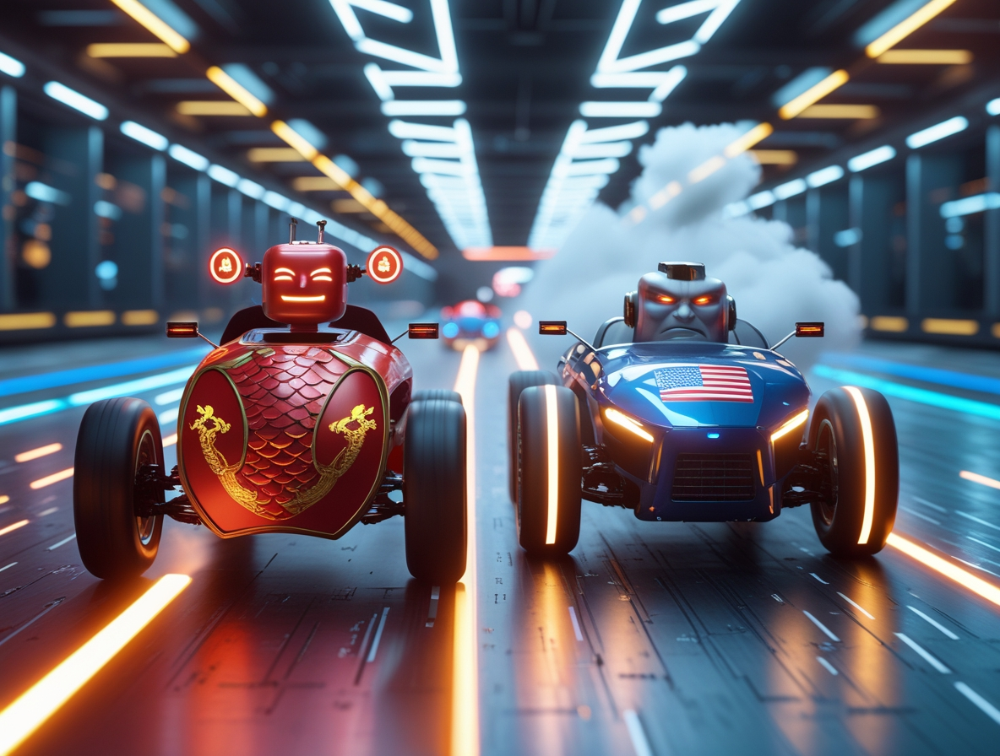
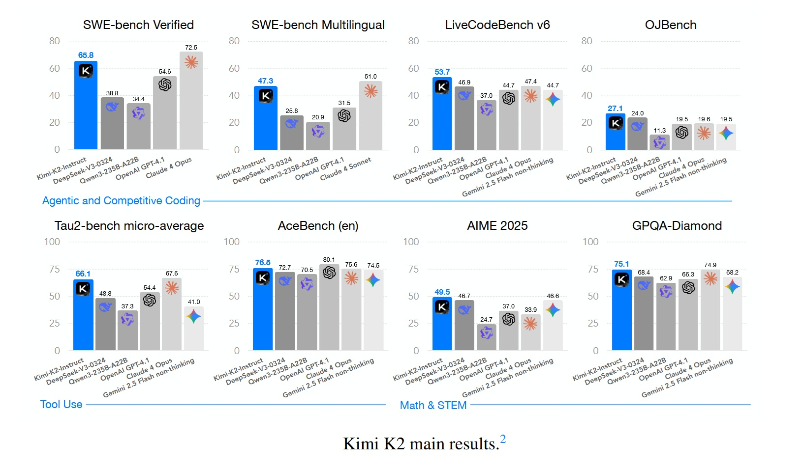
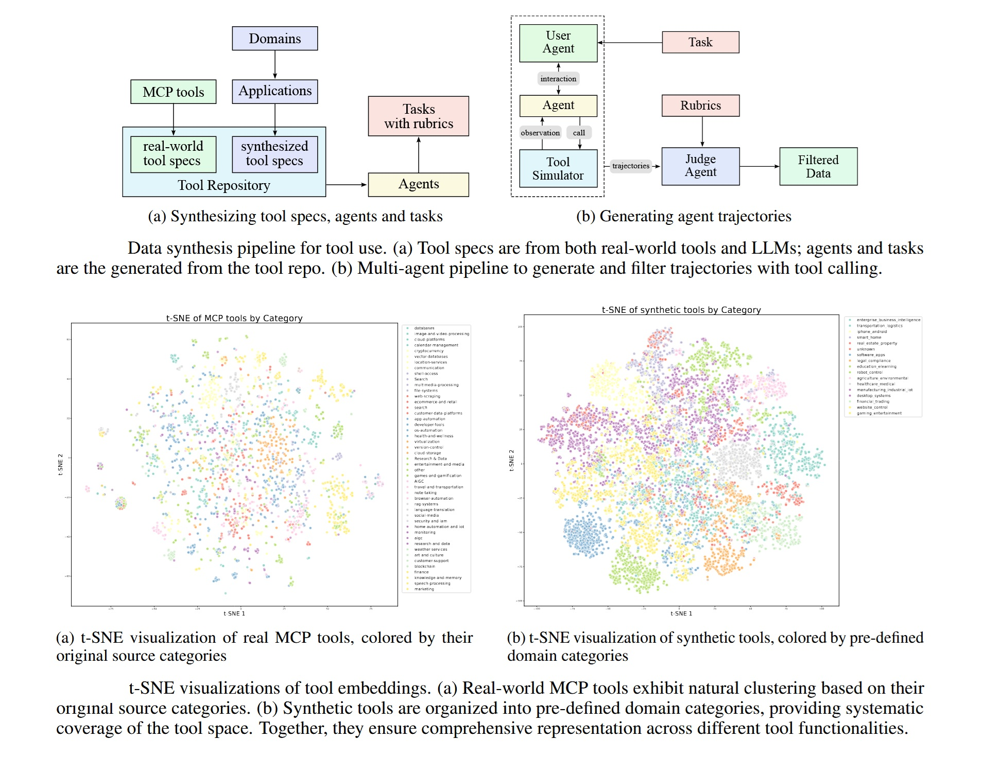

# Kimi K2 Thinking: China setzt den Blinker

*Moonshot AI schreibt die Regeln der künstlichen Intelligenz mit Kimi K2 Thinking neu: ein Open-Source-Modell mit einer Billion Parametern, das GPT-5 und Claude herausfordert und weniger als 5 Millionen US-Dollar gekostet hat. Am 6. November 2025, als die KI-Entwicklergemeinde beiläufig die Benachrichtigungen auf Hugging Face durchblätterte, erschien eine Veröffentlichung, die wie ein weiteres chinesisches Sprachmodell hätte aussehen können. Kimi K2 Thinking, entwickelt von dem von Alibaba unterstützten Startup Moonshot AI, versprach die üblichen Wunder: fortschrittliche agentische Fähigkeiten, eine Mixture-of-Experts-Architektur, eine Billion Parameter insgesamt.*

*Aber als die ersten Benchmarks zu kursieren begannen, zeichnete sich in den Zahlen etwas Unerwartetes ab: 44,9 % bei [Humanity's Last Exam](https://agi.safe.ai/), womit es sowohl GPT-5 als auch Claude Sonnet 4.5 schlug. Nicht knapp, nicht aufgrund eines statistischen Fehlers, sondern mit einem Vorsprung, der selbst die größten Skeptiker zum Nachrechnen zwang.*

*Für diejenigen, die sich nicht täglich mit dem Alphabet der KI-Akronyme beschäftigen: Humanity's Last Exam ist das, was passiert, wenn Experten beschließen, den Siegeszug der Sprachmodelle zu stoppen: [dreitausend Fragen, die von über tausend Spezialisten im Crowdsourcing erstellt wurden](https://scale.com/leaderboard/humanitys_last_exam) und so konzipiert sind, dass sie selbst für die fortschrittlichsten Systeme zu schwierig sind. Höhere Mathematik, Molekularbiologie, analytische Philosophie, Quantenphysik. Die Art von Prüfung, bei der GPT-4o bei 9 % stottert und selbst die neuesten Reasoning-Modelle Schwierigkeiten haben, 30 % zu überschreiten. Kimi K2 Thinking hat diese Schwelle mit einer Selbstverständlichkeit überschritten, die an Heist-Filme erinnert, in denen der unmögliche Coup zur Routine wird: keine Show, nur methodische Präzision.*

*Aber dies ist keine Geschichte über ein einzelnes außergewöhnliches Modell. Es ist die Chronik eines Moments, in dem das Unmögliche zur neuen Normalität wird und die wirtschaftlichen und geopolitischen Regeln der KI von denen neu geschrieben werden, die theoretisch hätten zurückbleiben sollen.*

## Im Inneren der Maschine

Um zu verstehen, was K2 Thinking anders macht, muss man in die Architektur eintauchen, wo technische Entscheidungen zu Absichtserklärungen werden. Das Modell basiert auf einer [Mixture-of-Experts-Architektur mit insgesamt einer Billion Parametern](https://arxiv.org/abs/2507.20534), aktiviert aber nur 32 Milliarden für jedes verarbeitete Token. Das ist eine Strategie, die an modulare Kraftwerke erinnert: All diese Leistung ist vorhanden, wird aber nur bei Bedarf abgerufen, was die Betriebskosten drastisch senkt, ohne die Fähigkeiten zu beeinträchtigen.

Die wahre Innovation liegt jedoch in der nativen INT4-Quantisierung. Während die meisten Modelle in höherer Präzision trainiert und dann komprimiert werden, wurde K2 Thinking von Anfang an für den Betrieb in INT4 konzipiert, was den Speicherbedarf halbiert und die Inferenzgeschwindigkeit verdoppelt, ohne die typischen Genauigkeitsverluste, die bei der nachträglichen Komprimierung auftreten. Es ist die Art von Entscheidung, die die betriebliche Effizienz über die Eitelkeitsmetrik der Gesamtparameter stellt, eine Philosophie, die zentral wird, wenn wir über Kosten sprechen.

Die MoE-Architektur von K2 verteilt die Last auf 384 spezialisierte Experten, im Gegensatz zu den 256 von DeepSeek V3, was eine größere Granularität bei der Auswahl der Kompetenzen ermöglicht. Jede Anfrage aktiviert eine dynamische Untergruppe dieser Experten, und das System wählt autonom aus, welche Neuronen je nach Art des Problems eingesetzt werden. In der Praxis aktiviert K2 beim Schreiben von Python-Code einen anderen Satz von Experten als beim Lösen von Differentialgleichungen oder beim Übersetzen von Sanskrit.

Das Element, das K2 Thinking jedoch von seinen Vorgängern unterscheidet, ist das Test-Time-Scaling, eine Technik, die es dem Modell ermöglicht, bei komplexen Problemen "länger nachzudenken". Es ist kein einfaches Versuch-und-Irrtum-Verfahren: Das System kann schwierigen Fragen mehr Rechenzyklen zuweisen und alternative Argumentationsketten untersuchen, bevor es zu einer Antwort konvergiert. Das ist es, was die Forscher als "Thinking Mode" bezeichnen, und der Grund, warum K2 mehrstufige Probleme bewältigen kann, die normalerweise menschliche Aufsicht erfordern würden.

Im Bereich der Agentenfähigkeiten zeigt K2 Fähigkeiten, die bis vor wenigen Monaten nur teuren, geschlossenen Systemen vorbehalten waren: Es kann [200-300 sequentielle Tool-Aufrufe](https://platform.moonshot.ai/docs/guide/use-kimi-k2-thinking-model) ohne menschliches Eingreifen ausführen, externe APIs navigieren, strukturierte Daten verarbeiten und komplexe Workflows orchestrieren. Das Kontextfenster von 256k Token ermöglicht die Aufrechterhaltung der Kohärenz bei ausgedehnten Konversationen oder umfangreichen technischen Dokumenten, während das Cache-Speichersystem die Latenz bei wiederholten Interaktionen reduziert.

[Bild aus dem offiziellen Paper auf arxiv.org](https://arxiv.org/pdf/2507.20534)

## Die Zahlen sprechen für sich

Benchmarks sind das Schlachtfeld, auf dem Versprechen an der Realität gemessen werden. Bei [Humanity's Last Exam](https://scale.com/leaderboard/humanitys_last_exam) erreicht K2 Thinking 44,9 % und übertrifft damit GPT-5 (42,1 %) und Claude Sonnet 4.5 (41,7 %). Der wahre Unterschied zeigt sich jedoch bei den agentischen Aufgaben: Bei [BrowseComp](https://arxiv.org/abs/2507.20534), das die Fähigkeit misst, autonom im Web und in APIs zu navigieren, erzielt K2 34,2 % gegenüber 28,5 % von GPT-5. Bei SWE-Bench Verified, dem Benchmark für Software-Engineering, bei dem es darum geht, echte Fehler in Open-Source-Codebasen zu beheben, erreicht K2 65,8 % und übertrifft damit praktisch jedes verfügbare nicht-denkende Modell.

Nicht alles glänzt gleichermaßen. Bei GPQA Diamond, dem Datensatz wissenschaftlicher Fragen auf Graduiertenebene, bleibt K2 bei 75,1 % stehen, ein hervorragendes, aber kein rekordverdächtiges Ergebnis. Und wenn GPT-5 im "Heavy Mode" mit erweitertem Reasoning ausgeführt wird, kann es K2 bei einigen spezifischen reinen Mathematikaufgaben immer noch übertreffen. Was aber im größeren Narrativ zählt, ist, dass diese Unterschiede marginal sind und vollständig verschwinden, wenn man das Preis-Leistungs-Verhältnis berücksichtigt.

Denn hier taucht die Information auf, die das Silicon Valley erschüttert hat: K2 Thinking kostet 0,33 US-Dollar pro Million Input-Token und 1,33 US-Dollar pro Million Output-Token. GPT-5 Standard liegt bei 1,25 US-Dollar/10 US-Dollar, während GPT-5 im Reasoning-Modus bis zu 50 US-Dollar pro Million Output-Token kosten kann. Wir sprechen hier nicht von Unterschieden von 20-30 %, sondern von einer Größenordnung. Für ein Unternehmen, das täglich Dutzende von Millionen von Token verarbeitet, wird die Rechnung brutal einfach.

Und es gibt ein technisches Detail, das es wert ist, hervorgehoben zu werden: Alle diese Benchmarks von K2 wurden in INT4 durchgeführt, ohne aufgeblähte Präzisionstricks, um Prozentpunkte zu gewinnen. Einige Labore veröffentlichen beeindruckende Zahlen in FP16, und wenn das Modell dann tatsächlich in der Produktion quantisiert eingesetzt wird, bricht die Leistung ein. K2 wurde unter den gleichen Bedingungen getestet, unter denen es auch in der Produktion eingesetzt würde, eine Transparenz, die Standard sein sollte, es aber selten ist.

Bei [LiveCodeBench v6](https://arxiv.org/abs/2507.20534), das die Fähigkeit testet, Code für neue, während des Trainings nie gesehene Probleme zu schreiben, erreicht K2 53,7 %. Bei AIME 2025, der fortgeschrittenen Mathematikprüfung für amerikanische Studenten, erzielt es 49,5 %. Bei OJBench, einem chinesischen Benchmark für wettbewerbsfähiges Programmieren, erreicht es 27,1 %. Zahlen, die einzeln wie technische Details erscheinen mögen, aber zusammen das Profil eines Systems zeichnen, das die Schwelle der praktischen Nützlichkeit für eine sehr breite Palette von realen Anwendungen überschritten hat.

[Bild aus dem offiziellen Paper auf arxiv.org](https://arxiv.org/pdf/2507.20534)

## Die kritische Stimme

Nathan Lambert ist nicht der Typ, der sich leicht beeindrucken lässt. Als KI-Forscher am Allen Institute for AI und Autor des [Newsletters Interconnects](https://www.interconnects.ai/p/kimi-k2-thinking-what-it-means) hat Lambert Jahre damit verbracht, die Kluft zwischen Hype und Realität in der Branche zu analysieren. Als er seine Analyse zu K2 Thinking schrieb, stellte er eine Frage, die wie ein Skalpell schneidet: "Was bedeutet es, wenn ein DeepSeek-Moment zur Routine wird?"

Als DeepSeek V3 Ende 2024 mit Trainingskosten von 5,6 Millionen US-Dollar veröffentlicht wurde, zuckte die Branche kollektiv zusammen. Es war die Anomalie, die die Regel bestätigte: Ja, es ist möglich, wettbewerbsfähige Modelle mit lächerlichen Budgets zu bauen, aber es bleibt eine Ausnahme. Jetzt, zehn Monate später, haben wir Moonshot mit K2, Qwen, das Veröffentlichungen am laufenden Band produziert, und ein Dutzend anderer chinesischer Labore, die alle zwei Wochen Open-Source-Modelle veröffentlichen. Die Server von Kimi sind bereits überlastet, ein Zeichen dafür, dass wir nicht von Tech-Demos sprechen, sondern von Systemen, die Entwickler tatsächlich in der Produktion einsetzen.

Lambert identifiziert fünf kritische Dynamiken, und die erste ist die einfachste, aber verheerendste: Chinesische Labore veröffentlichen schneller. Viel schneller. Während Anthropic Monate brauchen kann, um ein Modell vom Labor in die Produktion zu bringen, und OpenAI sich irgendwo in der Mitte positioniert, pressen chinesische Labore diesen Zyklus in Wochen. Wenn das Tempo des Fortschritts hoch ist, lässt einen Schnelligkeit besser erscheinen. Lambert schätzt die reine Leistungsdifferenz zwischen geschlossenen und offenen Modellen auf etwa vier bis sechs Monate, stellt dann aber die rhetorische Frage: Wenn diese geschlossenen Modelle nicht öffentlich verfügbar sind, zählen sie dann wirklich?

Der zweite Punkt berührt etwas Subtileres: Chinesische Labore dominieren bei den wichtigsten Benchmarks, aber es gibt "Long-Tail-Verhaltensweisen", für die sie keine Feedback-Schleifen haben. Lambert stellt fest, dass Qwen im letzten Jahr von einem für "Benchmaxing" (obsessives Optimieren von Benchmarks) bekannten Modell zu einem wirklich fantastischen Modell geworden ist, das zufällig auch wahnsinnige Punktzahlen erzielt. DeepSeek und Kimi haben das, was Lambert "guten Geschmack" nennt, eine Qualität, die schwer zu quantifizieren, aber sofort spürbar ist, wenn man die Modelle benutzt. Aber es bleiben gängige Benutzerverhaltensweisen, insbesondere westliche, über die amerikanische Unternehmen jahrelange interne Daten haben und chinesische Labore nicht. Diese immateriellen Werte zählen für die Benutzerbindung, auch wenn sie nicht im Humanity's Last Exam erscheinen.

Hier erkennt Lambert ein oft übersehenes technisches Detail: K2 Thinking wurde während des Post-Trainings nativ in INT4 trainiert, wahrscheinlich um das Skalieren des Reinforcement Learning bei langen Sequenzen effizienter zu gestalten. Und alle gemeldeten Benchmarks sind in INT4, nicht in aufgeblähter Präzision. Das ist die ehrliche Art, Vergleiche anzustellen, bemerkt Lambert, denn so wird das Modell tatsächlich ausgeliefert.

Der dritte Punkt ist geopolitisch und unaufhaltsam: Anfang 2025 kannten die meisten Leute, die sich mit KI beschäftigten, keine chinesischen Labore. Jetzt, gegen Ende des Jahres, werden DeepSeek, Qwen und Kimi zu gängigen Namen. Sie alle haben Saisons mit besseren Veröffentlichungen und unterschiedlichen Stärken. Und die Liste wird weiter wachsen: Lambert nennt Z.ai, Meituan, Ant Ling als mögliche Ergänzungen für 2026. Einige dieser Labore haben ihre Bemühungen um Foundation-Modelle nach DeepSeek begonnen und in sechs Monaten den Bereich der offenen Frontier erreicht. Die Frage ist nun, ob sie etwas in einer Nische der Frontier anbieten können, das eine echte Nachfrage von den Nutzern hat.

Der vierte Aspekt betrifft die verschachtelten agentischen Fähigkeiten: K2 Thinking kann Hunderte von sequentiellen Tool-Aufrufen ausführen, eine Funktion, die bei geschlossenen Modellen wie o3 und Grok 4 zum Standard geworden ist. Technisch ist das nicht revolutionär, es ergibt sich natürlich während des RL-Trainings, insbesondere wenn das Modell Informationen suchen muss, um korrekt zu antworten. Aber es ist das erste Mal, dass diese Fähigkeit in einem offenen Modell mit dieser Robustheit auftritt, und die Anbieter, die offene Gewichte hosten, werden hart arbeiten müssen, um sie präzise zu unterstützen. Lambert hofft, dass es genügend Nachfrage von den Nutzern gibt, um die Branche bei der Bereitstellung von offenen Tool-Use-Modellen reifen zu lassen.

Der fünfte Punkt ist der besorgniserregendste für die amerikanischen Labore: Der Druck ist real. Es gibt Druck auf die Preise und Erwartungen, die sie bewältigen müssen. Die Differenzierung und die Erzählung darüber, warum ihre geschlossenen Dienste besser sind, müssen sich schnell weiterentwickeln und sich von den Benchmarks entfernen, die jetzt auch der Open Source dominiert. Lambert hatte dies in seinem Sommerbeitrag "Einige Gedanken darüber, was als Nächstes kommt" vorweggenommen und vorgeschlagen, dass zukünftige Veröffentlichungen immer mehr der von Claude 4 ähneln werden, wo die Gewinne bei den Benchmarks marginal sind, die in der realen Welt aber erheblich. Dieser Übergang wird viel mehr Nuancen erfordern, um zu verstehen, ob das Tempo des Fortschritts anhält, insbesondere wenn KI-Kritiker das Plateau der Bewertungen ausnutzen werden, um zu argumentieren, dass KI nicht mehr funktioniert.

Lamberts letzte Frage ist täuschend einfach: Sind die bestehenden Vertriebskanäle, Produkte und die Bereitstellungskapazität ausreichend, um den Wert aller großen US-amerikanischen KI-Unternehmen stabil zu halten? Lambert glaubt, dass sie sicher sind, aber chinesische Modelle und Unternehmen nehmen größere Stücke des wachsenden KI-Kuchens. Es wird keine Mehrheit in Bezug auf den Umsatz sein, aber es kann eine Mehrheit in der Meinungsführerschaft sein, insbesondere auf internationalen Märkten.

Was Lambert nicht explizit sagt, aber was zwischen den Zeilen durchscheint, ist, dass wir nicht einen Wettbewerb, sondern eine Gabelung erleben. Zwei parallele Ökosysteme, die sich gegenseitig im Inneren stärken, aber immer weniger miteinander kommunizieren. Und wenn die Frage von "wer ist vorne" zu "wer zählt für welchen Markt" wechselt, werden die Antworten beunruhigend geopolitisch.

## Geopolitik der Algorithmen

Um den größeren Kontext von K2 Thinking zu verstehen, muss man über Moonshot hinausblicken. China hat sechs große KI-Labore, die die Fachmedien informell als "KI-Tiger" bezeichnen: DeepSeek, Moonshot, Alibaba (mit Qwen), Baidu (mit Ernie), ByteDance (mit VolcEngine) und Tencent (mit Hunyuan). Jedes veröffentlicht alle zwei bis drei Monate große Modelle und schafft so eine Kadenz, die die globale Industrie in ständiger Spannung hält.

Die amerikanischen Exportkontrollen für fortschrittliche Chips, die die chinesische KI-Entwicklung verlangsamen sollten, hatten einen paradoxen Effekt. DeepSeek V3 wurde auf dem [Nvidia H800](https://www.axios.com/2025/01/17/deepseek-china-ai-model) trainiert, einer abgeschwächten Version des H100, den die USA 2022 für China verboten hatten. Das nachfolgende Verbot traf 2023 auch die H800, aber da war der Weg bereits geebnet: Chinesische Labore lernten, durch aggressive Softwareoptimierungen Spitzenleistungen aus suboptimaler Hardware herauszuholen.

Die Trainingskosten sind die Daten, die die Erzählung weiterhin dominieren. K2 Thinking hat laut offiziellen Schätzungen [weniger als 5 Millionen US-Dollar](https://www.cnbc.com/2025/11/06/alibaba-backed-moonshot-releases-new-ai-model-kimi-k2-thinking.html) gekostet. DeepSeek V3 hatte 5,6 Millionen gekostet. Zum Vergleich: GPT-4 hatte 2023 über 100 Millionen US-Dollar gekostet, und die Gerüchte über GPT-5 sprechen von Budgets in Milliardenhöhe. Emad Mostaque, ehemaliger CEO von Stability AI, twitterte, dass mit den Nvidia Blackwell-Chips der neuen Generation nur 3 Millionen US-Dollar ausreichen würden, um ein mit den aktuellen Frontier-Modellen wettbewerbsfähiges Modell zu trainieren.

Diese Zahlen haben direkte Auswirkungen auf den Markt. Unternehmen wie Airbnb haben bereits öffentlich erklärt, dass sie Qwen für einige interne Anwendungen verwenden und das Preis-Leistungs-Verhältnis der Markenbekanntheit vorziehen. Und während OpenAI und Anthropic ihre Preise damit verteidigen, dass die Betriebskosten hoch bleiben, ist die Realität, dass der Markt entdeckt, dass "gut genug und zehnmal billiger" in den meisten realen Anwendungsfällen "perfekt, aber unerschwinglich" schlägt.

Die modifizierte MIT-Lizenz, unter der K2 Thinking veröffentlicht wird, verdient eine Anmerkung. Sie ist technisch Open Source, erlaubt die kommerzielle Nutzung und Modifikationen, enthält aber Klauseln, die die Verwendung der Namen "Moonshot" und "Kimi" in abgeleiteten Produkten einschränken. Es ist ein Kompromiss zwischen echter Offenheit und Markenschutz, eine Strategie, die chinesische Labore perfektionieren, um die Akzeptanz zu maximieren, ohne die narrative Kontrolle aufzugeben.

Wer gewinnt und wer verliert in diesem Szenario? Die Entwickler gewinnen, da sie Zugang zu Technologien erhalten, die bis gestern Zehntausende von Dollar pro Monat an API-Aufrufen kosteten. Startups gewinnen, da sie mit etablierten Unternehmen konkurrieren können, deren Burggraben auf dem privilegierten Zugang zu proprietären Modellen beruhte. Westliche Open-Source-Labore verlieren an Relevanz, zerquetscht zwischen chinesischer Geschwindigkeit und der (vermeintlichen) Qualität der geschlossenen amerikanischen Modelle. Und die amerikanischen Giganten selbst befinden sich in einer heiklen Position: Die Fortsetzung der geschlossenen Strategie birgt das Risiko, langfristig irrelevant zu werden, aber eine vollständige Öffnung würde bedeuten, die Einnahmequellen zu kannibalisieren, die die F&E finanzieren.

Der wahre Verlierer ist vielleicht die Idee eines einheitlichen globalen KI-Ökosystems selbst. Wir erleben die Kristallisation paralleler technologischer Einflusssphären, jede mit ihren eigenen Standards, Datensätzen, Verzerrungen und Werten. Und wenn Lambert fragt, ob dies Demokratisierung oder Fragmentierung ist, lautet die ehrliche Antwort: wahrscheinlich beides, gleichzeitig.

## Nahe Zukunft

K2 Thinking ist keine Tech-Demo, die veröffentlicht wird, um Lärm zu machen und dann vergessen zu werden. Die Server von Moonshot sind derzeit überlastet, mit Wartezeiten, die in Spitzenzeiten zehn Minuten überschreiten, um eine Antwort zu erhalten. Das ist die Art von Problem, von dem Startups träumen: zu viel Nachfrage, nicht genug Kapazität. Aber es signalisiert etwas Tieferes: Entwickler setzen diese Modelle tatsächlich in der Produktion ein, nicht nur aus Neugier.

Die unmittelbarste Auswirkung betrifft die Kunden-Anbieter-Dynamik in der KI. Jahrelang war das Machtverhältnis unausgewogen: Wer Spitzenfähigkeiten wollte, musste die Bedingungen von OpenAI oder Anthropic akzeptieren, einschließlich Preisgestaltung, Ratenbegrenzungen und Datenrichtlinien. Mit K2 und seinen Kollegen ändert sich die Rechnung. Ein Unternehmen kann die Gewichte herunterladen, vor Ort oder in einer Cloud seiner Wahl bereitstellen und die volle Kontrolle über Latenz, Datenschutz und Betriebskosten haben. Es ist nicht für alle Anwendungsfälle perfekt, aber für einen erheblichen Teil des Marktes ist es mehr als ausreichend.

Die offenen Fragen bleiben zahlreich. Die native Multimodalität zum Beispiel: K2 Thinking ist immer noch hauptsächlich textbasiert, während GPT-4 und Claude Bilder, Audio und Video integriert verarbeiten können. Die Reasoning-Traces, jene expliziten Gedankengänge, die Modelle wie o1 und R1 zeigen, sind in K2 weniger transparent, was das Debuggen erschwert, wenn das Modell Fehler macht. Und die Frage der langfristigen Nachhaltigkeit: Kann Moonshot mit einem Bruchteil der Ressourcen von OpenAI dieses Innovationstempo beibehalten?

Aber vielleicht ist die interessanteste Frage die, die Lambert implizit offen lässt: Was passiert, wenn das Unmögliche zur Routine wird? Als K2 Thinking veröffentlicht wurde, reagierten viele mit Begeisterung. Das nächste chinesische Modell, das die Benchmarks schlägt, wird weniger mediale Aufmerksamkeit erhalten. Das übernächste noch weniger. Nicht weil sie technisch weniger beeindruckend sind, sondern weil sich die Erwartungskurve verschoben hat.

Wir sind an dem Punkt im Heist-Film, an dem die Protagonisten den Coup so perfektioniert haben, dass er fast langweilig erscheint. In den Tresor eindringen, die Systeme umgehen, sauber wieder rauskommen. Kein Drama, nur Ausführung. Es ist der gefährlichste Moment, der, in dem Selbstüberschätzung zu Fehlern führt. Und im Kontext der KI bedeuten Fehler nicht, einen Benchmark nicht zu bestehen, sondern Systeme zu verteilen, die kritische Entscheidungen treffen werden, ohne dass wir vollständig verstanden haben, wie oder warum.

K2 Thinking ist eine bemerkenswerte technische Leistung. Aber seine wahre Bedeutung könnte darin liegen, den Moment zu markieren, in dem wir aufgehört haben zu staunen und angefangen haben anzunehmen, dass dieses Leistungsniveau die neue Basis ist. Und wenn das Außergewöhnliche zum Alltäglichen wird, fangen die wirklich interessanten Probleme an.
