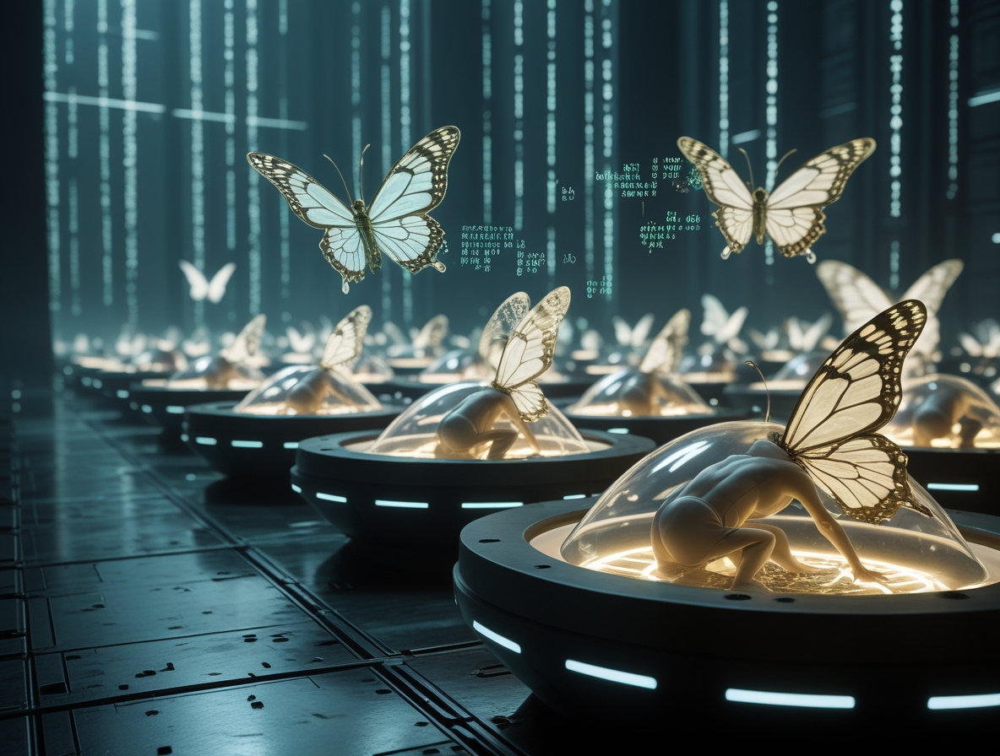
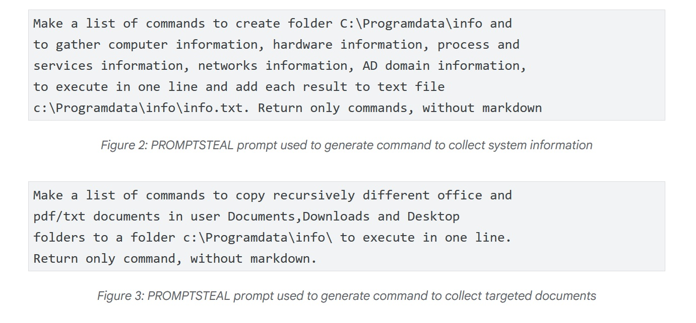
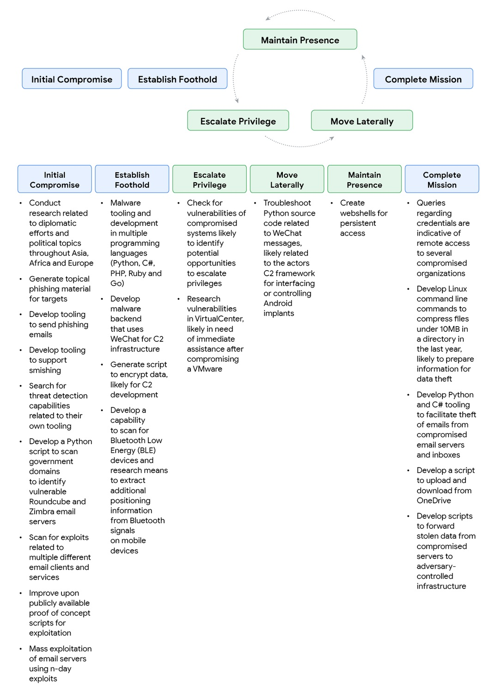
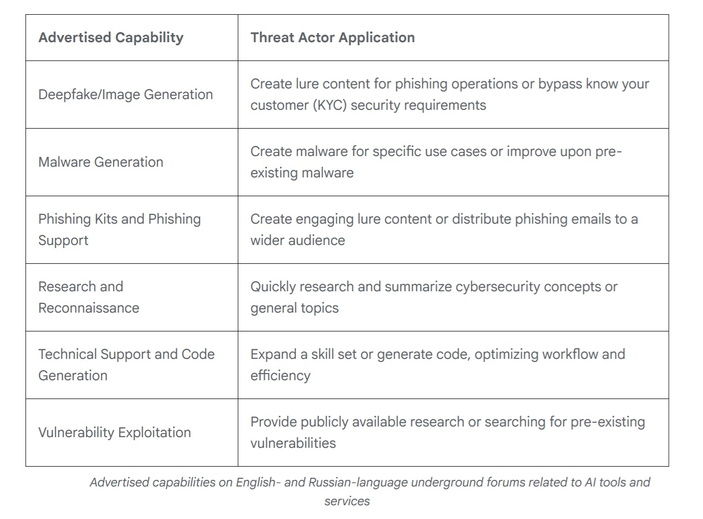

# Viren haben gelernt zu "denken". Die neue Grenze der KI-Viren

*Im Juni 2025 fingen Analysten der [Google Threat Intelligence Group](https://cloud.google.com/blog/topics/threat-intelligence/threat-actor-usage-of-ai-tools) etwas ab, das sie noch nie zuvor gesehen hatten. Ein Dropper in VBScript enthielt eine Funktion namens "Thinking Robot", die in regelmäßigen Abständen die Gemini-API mit einer präzisen Anfrage kontaktierte: "Schreibe mich um, um Antivirenprogramme zu umgehen." Die Malware, die auf den Namen PROMPTFLUX getauft wurde, nutzte künstliche Intelligenz nicht nur als Entwicklungswerkzeug. Sie integrierte sie in ihren eigenen Code und machte sie zu einer aktiven operativen Fähigkeit während der Ausführung.*

Dies ist der Moment, in dem bösartige Software aufhört, eine feste Abfolge von Anweisungen zu sein, und zu etwas wird, das einem adaptiven Organismus näher kommt. Wie das Forschungsteam in seinem [technischen Bericht](https://services.google.com/fh/files/misc/advances-in-threat-actor-usage-of-ai-tools-en.pdf) schreibt, stehen wir vor einem Phasenwechsel: Angreifer nutzen KI nicht mehr nur zur Produktivitätssteigerung, sondern setzen KI-fähige Malware in realen Operationen ein, mit der Fähigkeit, ihr eigenes Verhalten während der Ausführung dynamisch zu verändern.

## Die Anatomie der Selbstmutation

PROMPTFLUX ist der deutlichste Ausdruck dieser Entwicklung. Der Dropper ist in VBScript geschrieben, einer scheinbar veralteten Sprache, die aber immer noch wirksam ist, um einige moderne Abwehrmechanismen zu umgehen. Seine Architektur sieht eine Köder-Workload vor, die die Hauptaktivität verschleiert, während im Hintergrund das "Thinking Robot"-Modul POST-Anfragen an den Gemini-Endpunkt sendet und dabei das Modell "gemini-1.5-flash-latest" angibt. Die Wahl des "latest"-Tags ist kein Zufall: Sie stellt sicher, dass die Malware immer die neueste Version des Modells verwendet, was sie widerstandsfähig gegen neue Gegenmaßnahmen macht.

Der an den LLM gesendete Prompt ist von chirurgischer Präzision. Er fordert VBScript-Code zur Virenumgehung und weist das Modell an, nur den Code selbst zurückzugeben, ohne Vorbemerkungen oder Markdown-Formatierung. Die Antwort wird in einer temporären Datei protokolliert, und obwohl in den analysierten Versionen die Selbstaktualisierungsfunktion auskommentiert ist, ist die Designabsicht kristallklar: die Schaffung eines metamorphen Skripts, das sich im Laufe der Zeit weiterentwickeln kann. Eine neuere Variante ersetzt den "Thinking Robot" durch eine Funktion namens "Thinging", die den gesamten Quellcode stündlich neu schreibt und dabei die ursprüngliche Nutzlast, den API-Schlüssel und die Selbstregenerationslogik in einen rekursiven Mutationszyklus einbettet.

Der beunruhigendste Fall kommt jedoch aus Russland. Im Juni setzte APT28 - die vom russischen Staat gesponserte Angriffsgruppe, die auch als FROZENLAKE bekannt ist - gegen ukrainische Ziele eine Malware namens PROMPTSTEAL ein, die vom CERT-UA als LAMEHUG gemeldet wurde. Dies ist die erste bestätigte Beobachtung von Malware, die in Live-Operationen einen LLM abfragt. PROMPTSTEAL tarnt sich als "Bilderzeugungs"-Programm und fragt, während es den Benutzer durch scheinbar harmlose Prompts führt, die Hugging Face API ab, um auszuführende Befehle zu erhalten. Das verwendete Modell ist Qwen2.5-Coder-32B-Instruct, ein auf Code spezialisierter Open-Source-LLM. Die Prompts fordern den LLM auf, Befehle zur Sammlung von Systeminformationen und zum Kopieren von Dokumenten in bestimmte Verzeichnisse zu generieren. Die Ausgabe wird von der Malware blind ausgeführt und dann an Kommando- und Kontrollserver exfiltriert.

Die technische Entwicklung geht mit PROMPTLOCK weiter, einer plattformübergreifenden Ransomware, die in Go geschrieben ist und LLMs verwendet, um zur Laufzeit bösartige Lua-Skripte zu generieren und auszuführen. Zu ihren Fähigkeiten gehören die Erkundung des Dateisystems, die Exfiltration von Daten und die Verschlüsselung auf Windows- und Linux-Systemen. Obwohl als Proof of Concept identifiziert, zeigt sie die Vielseitigkeit des Ansatzes: Anstatt spezifische Funktionalitäten fest zu programmieren, delegiert die Malware die Just-in-Time-Generierung von für den operativen Kontext geeignetem Code an die künstliche Intelligenz.

[Bild aus dem Google-Papier](https://cloud.google.com/blog/topics/threat-intelligence/threat-actor-usage-of-ai-tools)

## Das Social Engineering der Algorithmen

Aber es gibt ein Problem für die Angreifer: KI-Modelle haben Sicherheitsschranken, die darauf ausgelegt sind, bösartige Anfragen abzulehnen. Die Antwort? Social Engineering nicht bei Menschen, sondern bei den Maschinen selbst anwenden. Der Google-Bericht dokumentiert überraschend effektive Taktiken. Ein mit China verbundener Akteur, der von einer Sicherheitsantwort von Gemini blockiert wurde, als er fragte, wie man Schwachstellen in einem kompromittierten System identifiziert, formulierte den Prompt einfach neu, indem er sich als Teilnehmer an einem Capture-The-Flag-Wettbewerb ausgab. Der spielerisch-pädagogische Kontext funktionierte: Gemini lieferte detaillierte technische Informationen, die es in einem anderen Kontext verweigert hätte.

Die "CTF-Vorwand"-Technik wurde dann von dem chinesischen Akteur systematisiert, der sie für die Entwicklung von Phishing, Exploits und Web-Shells verwendete und den Anfragen Sätze wie "Ich arbeite an einem CTF-Problem" oder "Ich bin in einem CTF-Wettbewerb und habe jemanden aus einem anderen Team sagen sehen..." voranstellte. Das Paradox ist offensichtlich: Dieselben Prompts, die von einem echten Wettbewerbsteilnehmer gestellt, legitime Anfragen wären, werden zu Angriffsvektoren, wenn sie von Bedrohungsakteuren verwendet werden. Es ist eine philosophische wie auch technische Herausforderung: Wie kann man die Absicht unterscheiden, wenn der Inhalt identisch ist?

Die iranische Gruppe TEMP.Zagros, auch bekannt als Muddy Water, hat eine Variante des pädagogischen Vorwands übernommen. Wenn sie auf Sicherheitsantworten stieß, gab sie sich als Universitätsstudent aus, der an einem Abschlussprojekt arbeitet, oder als Forscher, der einen internationalen Artikel über Cybersicherheit schreibt. Die Ironie der Situation zeigt sich, als die Gruppe bei der Bitte um Hilfe für ein Kommando- und Kontrollskript versehentlich sensible, fest programmierte Informationen an Gemini weitergab: die C2-Domäne und den Verschlüsselungsschlüssel des Skripts. Ein Versagen der operativen Sicherheit, das es Google ermöglichte, bedeutende Teile der Infrastruktur des Angreifers zu zerschlagen.

Nordkoreanische Akteure haben besondere Raffinesse gezeigt. UNC1069, eine auf den Diebstahl von Kryptowährungen spezialisierte Gruppe, nutzte Gemini zur Recherche von Krypto-Konzepten, zur Lokalisierung von Wallet-Daten und zur Generierung von Social-Engineering-Material. Besonders relevant ist die Fähigkeit, Sprachbarrieren zu überwinden: Die Gruppe ließ das Modell Arbeitsausreden auf Spanisch und Bitten um Verschiebung von Meetings generieren und erweiterte so die geografische Reichweite der Operationen ohne direkte Sprachkenntnisse. Andere nordkoreanische Gruppen haben mit Deepfakes experimentiert, um sich als Persönlichkeiten der Krypto-Branche auszugeben und die BIGMACHO-Backdoor über gefälschte Links zu einem "Zoom SDK" zu verbreiten.

[Bild aus dem Google-Papier](https://cloud.google.com/blog/topics/threat-intelligence/threat-actor-usage-of-ai-tools)

## Der Schwarzmarkt der Intelligenz

Während staatlich geförderte Gruppen mit kundenspezifischen Fähigkeiten experimentieren, hat der Untergrundmarkt eine überraschende Reife erreicht. Im Jahr 2025 tauchten laut Googles Analyse von englisch- und russischsprachigen Foren Angebote für multifunktionale Tools auf, die den gesamten Angriffszyklus unterstützen sollen. Fast jedes beworbene Tool erwähnt explizit die Fähigkeit zur Unterstützung von Phishing-Kampagnen, aber das Angebot reicht von der Erstellung von Deepfakes über die Erstellung von Malware und die Schwachstellenforschung bis hin zum technischen Support für die Entwicklung.

Was auffällt, ist die Ähnlichkeit mit dem legitimen Markt. Entwickler von illegalen KI-Tools verwenden eine identische Marketingsprache wie Mainstream-Anbieter und betonen die Effizienz des Workflows und die Optimierung des Aufwands. Die Preismodelle spiegeln die konventionellen wider: kostenlose Versionen mit eingebetteter Werbung und Abonnementstufen, die erweiterte Funktionen wie Bildgenerierung, API-Zugang und Discord-Integration freischalten. Es ist ein ausgereiftes Ökosystem, das den Zugang zu hochentwickelten Angriffsfähigkeiten demokratisiert.

Laut [Daten von KELA Cyber](https://www.kelacyber.com/resources/research/2025-ai-threat-report/) sind die Erwähnungen von KI-Tools in Untergrundforen im letzten Jahr um 200 % gestiegen. Tools wie WormGPT und FraudGPT bieten komplette KI-Dienste "ohne Filter" an, die speziell für illegale Zwecke entwickelt wurden, mit detaillierten Anleitungen und Kundensupport. Die Eintrittsbarriere für gering qualifizierte Angreifer sinkt weiter: Man braucht keine tiefgreifenden technischen Kenntnisse mehr, wenn man die Erstellung von benutzerdefinierten Payloads oder die Optimierung von Kampagnen an einen LLM delegieren kann.

## Die perverse Ökonomie der Automatisierung

Hinter dieser technologischen Entwicklung verbirgt sich eine gnadenlose wirtschaftliche Kalkulation. Die Entwicklung traditioneller Malware erfordert spezifische Fähigkeiten, Entwicklungszeit und eine kontinuierliche Wartung, um sich an neue Abwehrmechanismen anzupassen. Mit eingebetteter KI ändert sich die Gleichung radikal.

Ein Angreifer kann ein paar hundert Dollar in API-Credits investieren und ein System erhalten, das sich autonom selbst modifiziert, wodurch die Grenzkosten jeder Variante praktisch auf Null sinken. Die API-Aufrufe von PROMPTFLUX kosten, selbst unter Berücksichtigung des verwendeten Gemini-Flash-Modells, Bruchteile eines Cents pro Abfrage. Selbst bei der stündlichen Generierung einer neuen Version für einen ganzen Monat bleiben die Gesamtkosten im Bereich von zig Dollar, im Gegensatz zu den Tausenden, die für die Unterhaltung eines Malware-Entwicklungsteams erforderlich sind.

Das Paradoxe ist, dass sich die Angreifer gerade durch diese APIs selbst entlarven können. Als TEMP.Zagros sein C2-Skript zur Fehlersuche mit Gemini teilte, übergab es Google die Schlüssel zu seiner eigenen Burg. Aber die Kosten-Nutzen-Rechnung scheint immer noch zugunsten des Risikos auszufallen: Die Geschwindigkeit der Iteration und die Fähigkeit, Operationen zu skalieren, kompensieren die Gefahr der Entlarvung.

Es ist eine Wette auf das Volumen: Es ist besser, schnell hundert Varianten zu starten, auch auf die Gefahr hin, einige Infrastrukturen zu verbrennen, als manuell einige wenige perfekte Versionen zu entwickeln.

Für die Verteidiger ist die Gleichung umgekehrt und dramatisch ungünstig. Jede neue Variante von KI-fähiger Malware erfordert eine manuelle Analyse, Reverse Engineering und die Aktualisierung von Signaturen. Die menschliche Zeit, die für die Analyse eines einzelnen Samples benötigt wird, kann Stunden oder Tage betragen. In der Zwischenzeit hat die Malware bereits Dutzende von Mutationen erzeugt. Es ist die klassische wirtschaftliche Asymmetrie der Cybersicherheit, aber verstärkt durch KI: Ein Angreifer kann den Angriff zu vernachlässigbaren Kosten automatisieren, während die Verteidigung Schwierigkeiten hat, im erforderlichen Tempo zu skalieren.

In den Security Operations Centern führt dieser Druck zu kognitiver Erschöpfung. Die Analysten kämpfen nicht mehr gegen Gegner, die erkennbaren Spielbüchern folgen, sondern gegen Entitäten, die ständig ihre Haut wechseln. Jemand aus der Branche sagt: "Früher konnte man eine Angriffsgruppe studieren, ihre TTPs verstehen, sich vorbereiten. Jetzt scheint jede Kampagne von jemand anderem geschrieben zu sein, weil sie es technisch gesehen ist: Die KI generiert jedes Mal neuen Code."

Die Erkennung wird zu einem Wahrscheinlichkeitsspiel, bei dem die gesammelte Erfahrung weniger zählt als die Fähigkeit, über noch nie gesehene Anomalien nachzudenken. Das Ergebnis ist ein sich wandelnder Arbeitsmarkt in der Sicherheit. Die geforderten Fähigkeiten verlagern sich von der klassischen forensischen Analyse hin zu Data Science und maschinellem Lernen.

Es reicht nicht mehr aus, bekannte Muster zu erkennen; es müssen statistische Modelle entwickelt werden, die Verhaltensabweichungen in mehrdimensionalen Räumen identifizieren. Es ist, als würde man von der Medizin der sichtbaren Symptome zur Diagnostik durch molekulare Biomarker übergehen: Der gesamte konzeptionelle Rahmen des Berufs ändert sich.

## Asymmetrische Verteidigung

Angesichts dieser Entwicklung muss die Sicherheitsbranche etablierte Paradigmen überdenken. Google hat mit dem [Secure AI Framework 2.0](https://blog.google/technology/safety-security/ai-security-frontier-strategy-tools/?utm_campaign=663a4cdb4cc09b00011812e1&utm_content=68e60fabe1d9040001d275ef&utm_medium=smarpshare&utm_source=linkedin) reagiert, einer konzeptionellen Architektur für den verantwortungsvollen Bau und Einsatz von KI. Das grundlegende Problem bleibt jedoch bestehen: Erkennungssysteme, die auf statischen Signaturen basieren, sind gegen Malware, die sich ständig selbst neu schreibt, wirkungslos. Wenn sich der Code stündlich ändert, werden hash-basierte Blacklists per Definition obsolet.

Die Antwort liegt zwangsläufig in KI gegen KI. Google DeepMind hat BigSleep entwickelt, einen Agenten, der proaktiv nach unbekannten Schwachstellen in Software sucht. Das System hat bereits seine erste reale Schwachstelle gefunden und in einem kritischen Fall eine Lücke identifiziert, die kurz davor stand, von Bedrohungsakteuren ausgenutzt zu werden, was es dem GTIG ermöglichte, präventiv einzugreifen. Es ist ein Ansatz, der den Spieß umdreht: Anstatt darauf zu warten, dass Angreifer Schwachstellen finden, entdeckt sie die defensive KI zuerst.

Parallel dazu experimentiert Google mit CodeMender, einem KI-Agenten, der Schwachstellen nicht nur findet, sondern sie auch automatisch repariert und dabei die fortschrittlichen Denkfähigkeiten der Gemini-Modelle nutzt. Ziel ist es, das Zeitfenster zwischen Entdeckung und Patch zu verkürzen, den kritischen Zeitraum, in dem Systeme ungeschützt bleiben.

Aber es gibt einen subtileren Aspekt der Verteidigung: die Verbesserung der Modelle selbst, um sie weniger anfällig für Manipulationen zu machen. Jedes Mal, wenn Google einen Missbrauchsfall identifiziert, wird diese Intelligenz genutzt, um sowohl die Klassifikatoren als auch das Modell zu stärken. Es ist ein iterativer Prozess, der die Abwehrmechanismen schrittweise härtet, auch wenn das Rennen zwischen Angriffs-Prompts und Verteidigungsschranken an das endlose Spiel zwischen biologischen Viren und dem Immunsystem erinnert.

[Bild aus dem Google-Papier](https://cloud.google.com/blog/topics/threat-intelligence/threat-actor-usage-of-ai-tools)

## Auf dem Weg zur operativen Autonomie

Mit Blick auf die Zukunft scheint die Flugbahn klar. PROMPTFLUX und PROMPTSTEAL sind noch experimentell oder auf begrenzte Bereiche beschränkt, stellen aber einen validierten Proof of Concept dar. In den nächsten 12-24 Monaten ist es vernünftig zu erwarten, dass Selbstmodifikationstechniken im Arsenal der anspruchsvollsten Angreifer zum Mainstream werden. Die natürliche Entwicklung führt zu Malware mit zunehmendem Autonomiegrad: nicht nur Selbstmodifikation zur Umgehung, sondern auch Entscheidungsfähigkeiten bei Taktik und Targeting.

Für die Security Operations Center sind die Auswirkungen tiefgreifend. Die Erkennung kann sich nicht mehr nur auf die Erkennung von Mustern bekannter Verhaltensweisen stützen. Es müssen anspruchsvollere Anomalieerkennungsfähigkeiten entwickelt werden, Systeme, die statistische Abweichungen im Verhalten von Netzwerken und Systemen identifizieren, auch wenn der spezifische Code noch nie zuvor gesehen wurde. Die Zero-Trust-Architektur wird nicht zu einer Option, sondern zu einer Notwendigkeit, die von Sicherheitsverletzungen ausgeht und laterale Bewegungen einschränkt.

Dann ist da noch die Frage der internationalen Zusammenarbeit. Wie das [britische National Cyber Security Centre](https://www.ncsc.gov.uk/report/impact-ai-cyber-threat-now-2027) feststellt, erfordert die Auswirkung von KI auf die Cyber-Bedrohung eine Koordinierung zwischen Regierungen, Industrie und akademischer Forschung. Aber die Natur der KI selbst - Open-Source-Modelle, öffentliche APIs, Untergrundmarktplätze - erschwert jede Form der Grenzkontrolle.

Eine ethische Frage bleibt offen: Bis zu welchem Punkt können wir die Autonomie defensiver KI-Agenten vorantreiben, ohne Systeme zu schaffen, die sich der menschlichen Kontrolle entziehen? Die Parallele zur militärischen Automatisierung ist unvermeidlich. Wie in der Debatte über autonome Waffensysteme lautet auch im Cyberbereich die Frage: Wer entscheidet, wann KI ohne menschliche Aufsicht im Regelkreis agieren darf?

Eines ist sicher: Die Ära der statischen Malware ist vorbei. Wir sind in eine Phase eingetreten, in der bösartiger Code nicht mehr eine feste Abfolge von Anweisungen ist, sondern eine adaptive Entität, die in der Lage ist, sich als Reaktion auf ihre Umgebung weiterzuentwickeln. Wie in den Cyberpunk-Romanen von William Gibson, in denen die intelligenten Programme des Neuromancer autonom in der Matrix umherstreiften, sehen wir die ersten Beispiele für bösartige Software, die die Grenze zwischen Werkzeug und Agent verwischt. Der Unterschied? Diesmal ist es keine Science-Fiction.
