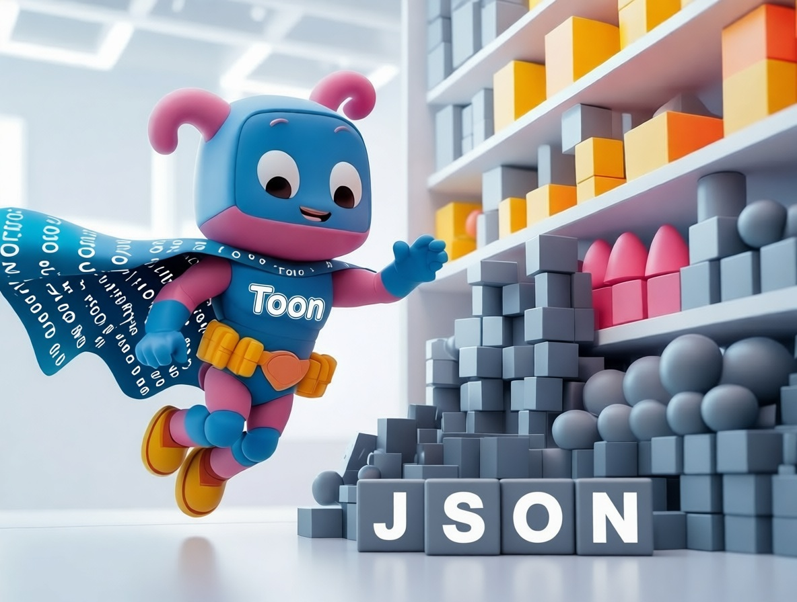
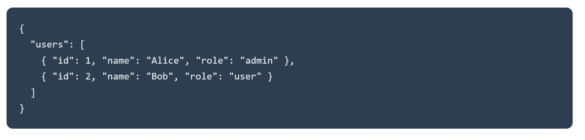
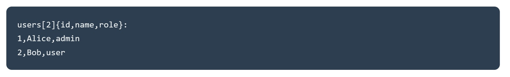
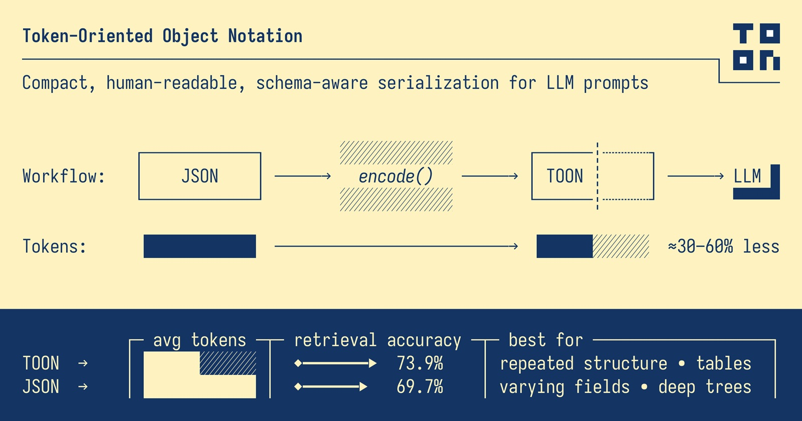

# TOON riscrive le regole dei dati per l'era dell'AI. Che ne sarà del JSON?

*C'è un paradosso nell'economia dell'intelligenza artificiale che pochi notano finché non guardano la fattura. Ogni volta che inviamo dati a GPT, Claude o Gemini, paghiamo per ogni singolo carattere. Non per la complessità della richiesta, non per l'intelligenza della risposta, ma per la verbosità del formato. Quelle parentesi graffe che rendono JSON così familiare? Costano denaro. Le virgolette che delimitano ogni chiave? Token preziosi. I due punti che separano chiavi e valori? Altri centesimi che volano via, moltiplicati per milioni di chiamate API.*

Quando Johann Schopplich ha pubblicato [TOON (Token-Oriented Object Notation)](https://github.com/toon-format/toon) all'inizio del 2025, la reazione iniziale della community è stata quella che accompagna tutte le idee semplici ma geniali: "Perché diavolo non ci ho pensato io?". Come il minimalismo giapponese applicato alla serializzazione dei dati, TOON elimina tutto ciò che non serve. Niente parentesi graffe, niente virgolette superflue, niente ripetizioni ossessive delle stesse chiavi. Solo l'essenza del dato, pulita come un haiku.

## Il costo invisibile delle parentesi graffe

JSON è nato in un'epoca in cui i computer parlavano principalmente tra loro. Douglas Crockford l'ha estratto da JavaScript come sottoprodotto fortunato, privilegiando la leggibilità umana e la compatibilità cross-platform rispetto all'efficienza. Per anni questo compromesso ha funzionato magnificamente. I byte extra necessari per rappresentare un oggetto con tutte le sue decorazioni sintattiche erano irrilevanti rispetto alla semplicità di parsing e alla familiarità del formato.

Ma l'arrivo dei Large Language Model ha cambiato le regole del gioco. Quando i costi delle API si calcolano per milione di token, improvvisamente quelle parentesi graffe non sono più innocue convenzioni sintattiche. Diventano un'inefficienza economica misurabile. JSON può consumare il doppio dei token rispetto ad altri formati per rappresentare gli stessi dati, e questo prima ancora di considerare che i modelli sono stati addestrati proprio su montagne di JSON, rendendolo paradossalmente meno efficiente per l'elaborazione.

Consideriamo un esempio reale. Una lista di cento repository GitHub con metadati completi: stelle, fork, descrizioni, timestamp. In JSON formattato questa struttura consuma 15.145 token. La stessa identica informazione in TOON? 8.745 token. Una riduzione del 42,3%. Non stiamo parlando di compressione lossy o di trucchi magici. È la stessa informazione, bit per bit reversibile, semplicemente rappresentata in modo più intelligente.

La matematica diventa ancora più brutale con dati temporali. Centottanta giorni di metriche web (visualizzazioni, clic, conversioni, ricavi) richiedono 10.977 token in JSON contro 4.507 in TOON, un risparmio del 58,9%. Quando moltiplichi questi numeri per migliaia di richieste giornaliere in un'applicazione enterprise, la differenza tra un progetto sostenibile e uno che brucia budget diventa tangibile.

## Quando meno diventa più

L'intuizione centrale di TOON è disarmante nella sua semplicità: quando hai array uniformi di oggetti con gli stessi campi, perché ripetere le chiavi per ogni singolo elemento? È come se ogni riga di un foglio Excel dovesse includere l'intestazione della colonna. Inefficiente e ridondante.

TOON prende in prestito l'indentazione da YAML per le strutture nidificate e il formato tabellare da CSV per gli array uniformi, poi ottimizza entrambi per il contesto specifico dei Large Language Model. Il risultato è un formato che sembra ovvio una volta visto, ma che richiede di ripensare alcune assunzioni fondamentali su come rappresentiamo i dati.

Un array di utenti in JSON classico ripete ossessivamente la stessa struttura:

TOON dichiara la struttura una volta sola nell'intestazione, poi lista solo i valori:

Il marcatore `[2]` comunica esplicitamente la lunghezza dell'array, mentre `{id,name,role}` definisce lo schema. Ogni riga successiva contiene solo i dati grezzi, separati da virgola. È eleganza funzionale nel senso Bauhaus del termine: la forma segue la funzione, zero ornamenti superflui.

Questa economia sintattica si manifesta in tre strategie complementari. Prima di tutto, l'indentazione sostituisce le parentesi graffe per gli oggetti nidificati. Secondo, le stringhe vengono quotate solo quando strettamente necessario per evitare ambiguità (spazi iniziali o finali, caratteri di controllo, valori che potrebbero essere scambiati per booleani o numeri). Terzo, il formato tabellare per array omogenei trasforma ripetizioni verbali in righe compatte stile CSV.

Il risultato? TOON ottiene tipicamente una riduzione del 30-60% nel consumo di token rispetto a JSON su dataset strutturati. E non è solo una questione di contare caratteri salvati. È una differenza che si traduce direttamente in costi operativi ridotti, context window più ampi disponibili per dati aggiuntivi, e tempi di risposta più rapidi.

## La geometria del risparmio

I benchmark ufficiali del progetto TOON raccontano una storia interessante sulle condizioni che amplificano o riducono i vantaggi del formato. Non è magia universale, è geometria applicata alla struttura dei dati.

Il punto ottimale, quel sweet spot dove TOON brilla di più, sono gli array uniformi di oggetti con valori primitivi. Risultati di query database, export CSV, dati analitici temporali. Più le tue righe sono identiche nella struttura, più TOON può comprimere l'overhead sintattico dichiarando lo schema una volta sola.

Nei test condotti su quattro modelli diversi (GPT-5 Nano, Claude Haiku, Gemini Flash, Grok) attraverso 154 domande di recupero dati, TOON ha ottenuto un'accuratezza media del 70,1% usando 4.678 token, contro il 65,4% di JSON che ne consumava 8.713. Non solo risparmio economico, ma anche maggiore precisione nelle risposte. La struttura esplicita (lunghezza degli array, dichiarazione dei campi) aiuta i modelli a parsare e validare i dati in modo più affidabile.

Ma i risultati variano significativamente tra modelli. GPT-5 Nano ha mostrato un'accuratezza del 96,1% con TOON, mentre Claude Haiku si è fermato al 48,7%. Questa disparità suggerisce che l'addestramento conta: i modelli esposti prevalentemente a JSON durante il training potrebbero inizialmente faticare con formati alternativi, indipendentemente dalla loro efficienza teorica.

Il problema dell'addestramento non è banale. Gli LLM attuali sono stati nutriti con miliardi di token di JSON proveniente da API, configurazioni, dataset pubblici. TOON è nato nel 2025, quindi i modelli più recenti hanno visto relativamente poco di questo formato nei loro corpora di training. È un classico problema bootstrap: il formato è più efficiente, ma l'ecosistema deve ancora adattarsi.

Interessante notare come i test rivelino anche i limiti di TOON. Per strutture profondamente nidificate o dati non uniformi, i benefici si riducono drasticamente. Un oggetto con campi opzionali che appaiono sporadicamente, o alberi gerarchici con molti livelli di nidificazione, potrebbero risultare più leggibili e persino più efficienti in JSON. TOON non si applica bene a dati profondamente nidificati o non uniformi, dove JSON può risultare più efficiente.

[Immagine tratta dal repo GitHub ufficiale](https://github.com/toon-format/toon)

## Dove funziona (e dove no)

Separare l'hype dalla realtà pratica richiede franchezza sui casi d'uso. TOON non è "il nuovo JSON" nel senso di rimpiazzo universale. È uno strumento specializzato per un problema specifico: ottimizzare il trasferimento di dati strutturati verso e da Large Language Model.

Gli scenari vincenti sono chiari. Stai costruendo una pipeline RAG che invia centinaia di record di prodotto a un LLM per generare descrizioni? TOON taglia i costi. Hai un'applicazione che processa migliaia di righe di analytics giornaliere attraverso GPT per estrarre insights? Risparmio immediato. Devi passare risultati di query database con centinaia di utenti, ordini, o transazioni a Claude per analisi? TOON è nato per questo.

Il formato eccelle quando la struttura è piatta e uniforme, quando i volumi sono alti, quando i costi di token rappresentano una voce di budget significativa. Per casi d'uso come generazione di calendari editoriali, liste di prodotti, tabelle utente, righe analytics, dove il budget token o la finestra di contesto sono vincoli reali, TOON offre vantaggi concreti e misurabili.

Ma esistono territori dove JSON mantiene il vantaggio. Dati altamente nidificati e irregolari, dove la struttura varia significativamente tra record, non beneficiano del formato tabellare di TOON. Oggetti complessi con molti campi opzionali diventano verbosi anche in TOON quando devi gestire l'assenza di valori o strutture variabili.

C'è poi la questione dell'ecosistema. JSON ha decenni di tooling maturo: debugger, formatter, validator, librerie in ogni linguaggio immaginabile. TOON ha lanciato il primo rilascio nel 2025 e, pur avendo implementazioni in TypeScript, Python, Go, Rust, Java, C++, PHP, Ruby, Swift, Elixir, Dart, Clojure, Crystal e altri linguaggi, l'ecosistema è ancora giovane. JSON ha decenni di tooling, mentre TOON è più recente con un ecosistema più piccolo.

Il debugging è più complicato. Quando qualcosa si rompe in produzione e devi ispezionare un payload TOON, non puoi semplicemente aprire il dev tools del browser e fare pretty-print. Devi convertire indietro a JSON, identificare il problema, poi riconvertire. Aggiunge frizione al workflow di sviluppo, specialmente nei team che non hanno ancora familiarità con il formato.

L'adozione enterprise porta con sé questioni organizzative che vanno oltre la pura tecnica. Convincere un team a cambiare formato dati richiede buy-in a più livelli. Gli sviluppatori devono imparare la nuova sintassi. Il codice legacy deve essere aggiornato o deve convivere con layer di conversione. I processi di CI/CD vanno adattati. Convincere team e leadership ad adottare un nuovo formato per una riduzione di costi del 30-60% suona facile sulla carta, ma nella pratica c'è sempre resistenza al cambiamento.

La strategia più pragmatica, quella che stanno adottando i team che sperimentano con TOON, è chirurgica piuttosto che olistica. Non sostituiscono JSON nell'intero stack. Mantengono JSON come formato interno per storage, API esterne, contratti tra servizi. Usano TOON esclusivamente come layer di ottimizzazione per la comunicazione con gli LLM, dove l'efficienza token conta davvero. L'approccio ottimale per la maggior parte delle organizzazioni combina entrambi: JSON come standard interno per compatibilità e TOON per ottimizzazione specifica LLM.

Convertono al momento del bisogno, nei punti ad alto traffico dove il risparmio si moltiplica: endpoint che generano migliaia di chiamate LLM giornaliere, pipeline batch che processano grandi volumi, applicazioni real-time dove la latenza ridotta fa differenza nell'esperienza utente.

## Il vero prezzo dell'efficienza

Ridurre il consumo di token non è solo ottimizzazione economica. È anche una questione ambientale che l'industria tech fatica ancora ad affrontare apertamente. Ogni token elaborato richiede cicli di GPU, ogni ciclo consuma energia, ogni kilowattora contribuisce all'impronta carbonica dei datacenter.

La crescente domanda di AI generativa ha già aumentato il consumo energetico globale di computazione, e ottimizzare l'uso dei token sta diventando una nuova frontiera non solo per l'efficienza, ma per la sostenibilità. Quando TOON taglia del 50% i token necessari per rappresentare un dataset, sta anche tagliando circa la metà dell'energia richiesta per processare quella richiesta. Moltiplicato per milioni di chiamate API attraverso migliaia di applicazioni, l'impatto aggregato non è trascurabile.

Ma l'efficienza ha anche costi nascosti, di natura diversa. TOON introduce complessità cognitiva per gli sviluppatori. Devi imparare le regole di quotatura delle stringhe (quando sono necessarie le virgolette? Cosa succede con i delimitatori alternativi?). Devi capire quando usare formato tabellare versus formato lista. Devi gestire edge case come array di array o oggetti con campi opzionali sparsi.

La curva di apprendimento non è ripida, ma esiste. Per piccoli team o progetti con volumi modesti di chiamate LLM, il tempo investito nell'apprendimento e nell'implementazione potrebbe superare i risparmi economici. Per applicazioni su piccola scala che fanno 100 chiamate LLM al giorno, il tempo di engineering per implementare TOON probabilmente non vale il risparmio.

C'è poi la questione della maturità del formato. La specifica TOON è attualmente alla versione 1.4, con test di conformità language-agnostic che aiutano gli implementatori a garantire compatibilità cross-platform. Ma è un formato con meno di un anno di vita nel mondo reale. Non sappiamo ancora quali edge case emergeranno con l'uso massiccio in produzione, quali pattern si riveleranno problematici, quali ottimizzazioni ulteriori diventeranno necessarie.

Il progetto ha pubblicato conformance test pubblici e mantiene una specifica formale su GitHub, segnali positivi di governance seria. Ma adoption at scale rivelerà inevitabilmente problemi che i test unitari non catturano. È il trade-off classico tra essere early adopter (benefici immediati, rischio di stabilità) e attendere la maturazione (minore rischio, ma costi più alti nel frattempo).

L'aspetto più intrigante, forse, è culturale piuttosto che tecnico. TOON ci costringe a pensare diversamente sulla rappresentazione dei dati. Per trent'anni abbiamo considerato JSON come il formato "naturale" per dati strutturati, al punto che pensiamo spesso direttamente in termini di oggetti con chiavi e valori in parentesi graffe. TOON richiede un cambio di prospettiva: pensare prima alla forma dei dati (è tabellare? nidificato? uniforme?) poi alla rappresentazione ottimale.

Come la programmazione funzionale che ti insegna a pensare in termini di trasformazioni immutabili piuttosto che mutazioni di stato, o come l'architettura RISC che privilegia istruzioni semplici e numerose invece di poche istruzioni complesse, TOON promuove un mindset diverso. L'eleganza della sottrazione invece dell'accumulo di features.

TOON non sostituirà JSON, così come Markdown non ha sostituito HTML o YAML non ha eliminato XML. Ciascun formato ha trovato la propria nicchia, il proprio contesto dove i trade-off specifici hanno senso. JSON rimarrà lo standard per API, configurazioni, storage. Ma per quel dominio specifico e crescente che è la comunicazione con Large Language Model, TOON offre un'alternativa razionale fondata su principi solidi.

L'idea che sta dietro TOON è quella classica intuizione che sembra ovvia solo dopo che qualcuno l'ha avuta: se i modelli pagano per ogni token, perché continuare a usare un formato progettato quarant'anni fa per risolvere problemi diversi? È lo stesso tipo di insight che ha portato alla nascita di protobuf per sostituire XML nelle comunicazioni Google, o di JSON stesso come alternativa più leggera a SOAP.

La domanda rilevante per developer e tech lead non è "TOON sostituirà JSON?" ma "I miei casi d'uso specifici beneficiano dell'ottimizzazione token?". Se lavori con grandi volumi di dati strutturati uniformi che passano attraverso LLM, se i costi API sono una voce significativa del tuo budget operativo, se la finestra di contesto limitata è un vincolo reale nelle tue applicazioni, allora TOON merita un esperimento serio. Converti un endpoint ad alto traffico, misura il risparmio reale, valuta se la complessità aggiunta vale i benefici concreti.

Se invece fai chiamate sporadiche con payloads piccoli, se il team è ridotto e deve concentrare il tempo su feature piuttosto che su ottimizzazioni, se i dati sono prevalentemente nidificati e irregolari, allora JSON rimane la scelta pragmatica. L'ottimizzazione prematura, come ci ha insegnato Knuth, è la radice di tutti i mali. O almeno del 97% di essi.

Il futuro di TOON dipenderà da due fattori: quanto rapidamente l'ecosistema LLM evolverà i suoi modelli per riconoscere e ottimizzare il formato, e quanto efficacemente la community riuscirà a costruire tooling maturo che renda l'adozione fluida. Se tra due anni i principali provider di LLM includeranno TOON come formato nativo supportato accanto a JSON nei loro SDK, se editor e debugger integreranno syntax highlighting e validation per TOON, se i framework RAG e le librerie di orchestrazione AI lo supporteranno out-of-the-box, allora l'adozione crescerà organicamente.

Nel frattempo, TOON rimane quello che è sempre stato: un'idea semplice ma geniale che ti fa chiedere perché non ci hai pensato tu. E forse, nella sua eleganza minimalista, c'è una lezione più ampia per l'intera industria tech: a volte l'innovazione non sta nell'aggiungere complessità, ma nel sottrarla.