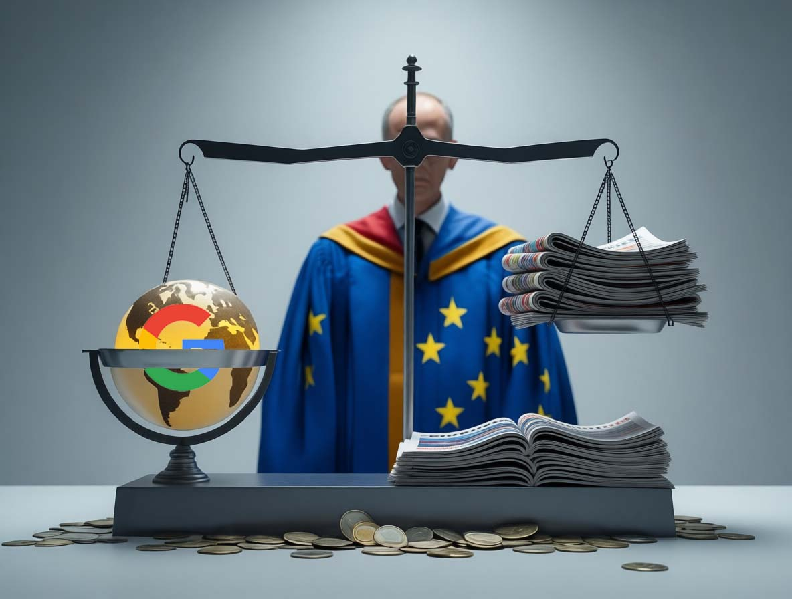
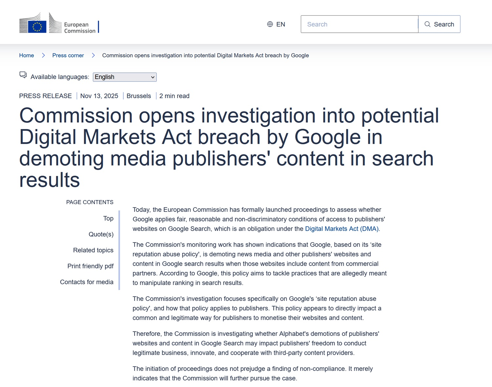
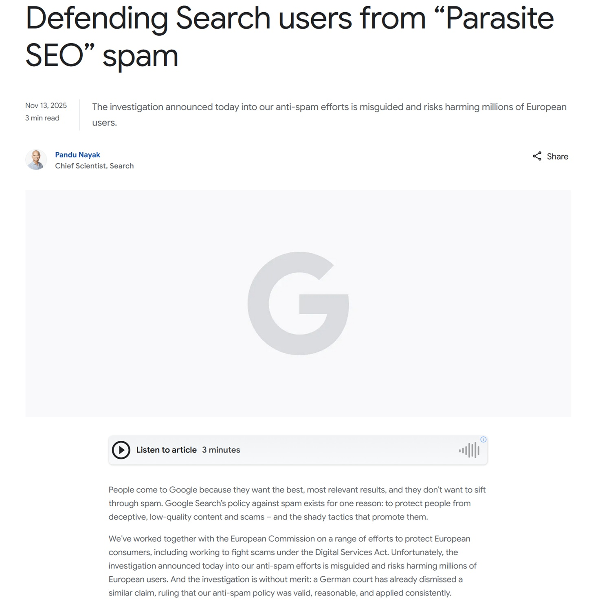

# EU untersucht Google: Ist KI am Niedergang der Verlage schuld?

*Die EU leitet eine formelle Untersuchung gegen Google wegen des Einbruchs des Traffics von Verlagen ein. Aber hinter dem Streit um Spam verbirgt sich ein größeres Spiel: Wer kontrolliert wirklich den Fluss von Online-Informationen und wer profitiert davon.*

## Der Funke, der das Feuer entfacht

Am 13. November 2025 hat die Europäische Kommission ein [formelles Verfahren](https://ec.europa.eu/commission/presscorner/detail/it/ip_25_2675) gegen Google nach dem Digital Markets Act eingeleitet. Der Vorwurf ist präzise: Änderungen an den Ranking-Richtlinien der Suche, die unter dem Vorwand der Spam-Bekämpfung eingeführt wurden, sollen zu einem vertikalen Einbruch des Traffics auf den Websites europäischer Verlage geführt haben, wobei insbesondere diejenigen benachteiligt wurden, die kommerzielle Inhalte von Drittanbietern hosten.

Teresa Ribera, Vizepräsidentin der Kommission, nimmt kein Blatt vor den Mund: "Wir sind besorgt, dass die Richtlinien von Google es Nachrichtenverlagen nicht ermöglichen, in den Suchergebnissen fair, angemessen und nicht diskriminierend behandelt zu werden." Die Untersuchung konzentriert sich auf zwei spezifische Artikel des DMA, 6(5) und 6(12), die sogenannte Gatekeeper dazu verpflichten, Transparenz und Gleichbehandlung für gewerbliche Nutzer ihrer Dienste zu gewährleisten.

Googles Antwort kommt wenige Stunden später mit einem [Beitrag im Unternehmensblog](https://blog.google/inside-google/company-announcements/defending-search-users-from-parasite-seo-spam/), der die Erzählung komplett umkehrt. Dan Taylor, Vizepräsident von Google Search, rahmt die Angelegenheit als einen Kampf zum Schutz der Nutzer vor manipulativen Praktiken ein: "Parasite SEO", bei dem seriöse Websites Platz auf ihren eigenen URLs verkaufen, um Inhalte von Drittanbietern zu hosten, die ihren Ruf ausnutzen, um in den Suchergebnissen aufzusteigen.

Der Zeitpunkt der europäischen Ankündigung ist kein Zufall. Im Oktober 2025 hatte Google bereits eine Geldstrafe von 2,95 Milliarden Euro wegen Verstößen im Bereich der Werbetechnologie erhalten, ebenfalls auf der Grundlage des DMA. Diese neue Untersuchung, die zu Sanktionen von bis zu 10 % des weltweiten Jahresumsatzes des Unternehmens führen könnte, fügt sich in einen Kontext zunehmender Spannungen zwischen Big Tech und den europäischen Regulierungsbehörden ein.

[Bild von der Website der Europäischen Union](https://ec.europa.eu/commission/presscorner/detail/it/ip_25_2675)

## Anatomie einer Herabstufung

Um zu verstehen, was wirklich vor sich geht, müssen wir einige Monate zurückgehen. Im März 2024 führt Google die Richtlinie zum "Missbrauch der Website-Reputation" ein, die darauf abzielt, das zu bekämpfen, was das Unternehmen als systematische Verschmutzung der Suchergebnisse bezeichnet. Der Mechanismus ist ebenso einfach wie verheerend: Nachrichtenagenturen und seriöse Websites verkauften Unterverzeichnisse oder Subdomains an kommerzielle Betreiber, die dort SEO-optimierte Inhalte für Finanzprodukte, Online-Casinos und gesponserte Bewertungen veröffentlichten.

Der symbolische Fall ist der von Forbes, das in seinen Subdomains Affiliate-Inhalte für Kreditkarten und Girokonten hostete, die keine redaktionelle Verbindung zur Publikation hatten. Dasselbe gilt für das Wall Street Journal, CNN und Dutzende anderer Publikationen, die Teile ihrer eigenen URLs in regelrechte kommerzielle Enklaven verwandelt hatten. Google bezeichnet diese Praxis als "parasitär", weil sie die im Laufe der Zeit aufgebaute Autorität einer Domain zu rein kommerziellen Zwecken ausnutzt und so eine Wettbewerbsverzerrung gegenüber spezialisierten Websites schafft, die hingegen autonom agieren.

Die ursprüngliche Richtlinie ließ jedoch eine Lücke: Sie konnte nur manuell und von Fall zu Fall angewendet werden. Im November 2024 kommt das Update, das jede Lücke schließt und die Erkennung und Herabstufung dieser Inhalte automatisiert. Die Auswirkungen sind unmittelbar und drastisch. [Nach Daten aus verschiedenen Quellen](https://www.siliconrepublic.com/business/eu-google-news-media-search-results-dma) verzeichnen einige europäische Verlage innerhalb weniger Wochen einen Traffic-Rückgang von bis zu 34 %.

Das Problem ist, dass der Algorithmus nicht immer zwischen parasitärer Ausbeutung und legitimen Partnerschaften unterscheidet. Eine Publikation, die klar gekennzeichnete gesponserte Inhalte veröffentlicht oder Affiliate-Bereiche hostet, die mit ihrer redaktionellen Linie übereinstimmen, kann im selben Topf wie reiner Spam landen. Es ist, als würde man einen Vorschlaghammer benutzen, wo ein Skalpell nötig wäre.

[Bild aus dem Google-Blog](https://blog.google/inside-google/company-announcements/defending-search-users-from-parasite-seo-spam/)

## Das wahre Schlachtfeld

Hinter diesem technischen Streit verbirgt sich ein viel größeres Spiel um die Zukunft des digitalen Informationsökosystems. Das Digital Markets Act, das 2023 in Kraft trat, stuft Google gerade wegen seiner dominanten Rolle bei der Verbreitung von Online-Informationen als Gatekeeper ein. Das Unternehmen aus Mountain View kontrolliert über 90 % des europäischen Suchmarktes, eine Position, die ihm eine beispiellose Macht verleiht, zu entscheiden, welche Inhalte die Nutzer erreichen und welche nicht.

Aber es gibt eine weitere Dimension des Themas, die in der öffentlichen Debatte selten zur Sprache kommt: Artikel 15 der Europäischen Urheberrechtsrichtlinie, allgemein bekannt als Leistungsschutzrecht. Diese nach jahrelangen legislativen Kämpfen verabschiedete Vorschrift erkennt Verlegern das Recht auf Vergütung zu, wenn ihre Inhalte von digitalen Plattformen genutzt werden. Google hat diese Richtlinie immer als existenzielle Bedrohung für sein Geschäftsmodell angesehen.

Die jüngsten Chroniken dokumentieren diesen Konflikt gut. Im Jahr 2018, als die Richtlinie noch diskutiert wurde, hatte Google [Tests durchgeführt](https://medium.com/whats-new-in-publishing/45-traffic-decline-to-news-publishers-due-to-eus-article-11-google-reveals-344d8427cf0c), um die Auswirkungen einer möglichen Entfernung von Nachrichten-Snippets zu demonstrieren. Die Ergebnisse zeigten einen Traffic-Rückgang von 45 % für die Verleger, eine einschüchternde Botschaft, die besagte: Ohne uns seid ihr tot. In Spanien, wo 2014 ein ähnliches Gesetz verabschiedet worden war, hatte Google einfach Google News geschlossen, was vor allem für kleine Verleger erhebliche wirtschaftliche Schäden verursachte.

Frankreich hat einen anderen Weg eingeschlagen. Nach langen Verhandlungen und Androhungen von Sanktionen hat Google zugestimmt, den französischen Verlegern eine Vergütung zu zahlen, obwohl die genauen Beträge und Bedingungen der Vereinbarungen vertraulich bleiben. Angela Mills Wade, Geschäftsführerin des European Publishers Council, hatte Google damals [vorgeworfen](https://www.cjr.org/the_media_today/google-news-france.php), seine marktbeherrschende Stellung zu missbrauchen und sich über das Gesetz zu stellen.

Heute wiederholt sich das Drehbuch mit neuen Varianten. Google behauptet, Spam zu bekämpfen, Verleger beklagen eine willkürliche Herabstufung, Brüssel ermittelt. Aber das eigentliche zugrunde liegende Thema ist immer dasselbe: Wer kontrolliert den Hahn des Online-Traffics und wer profitiert wirtschaftlich davon.

## Die stille Revolution

Um die Strategie von Google vollständig zu verstehen, muss man über diese spezifische Kontroverse hinausblicken und ein breiteres Phänomen analysieren: die Transformation der Suche von einem Navigationswerkzeug zu einem Endziel. Hier kommt das disruptivste Element der ganzen Angelegenheit ins Spiel.

[Eine von SparkToro veröffentlichte Studie](https://sparktoro.com/blog/2024-zero-click-search-study-for-every-1000-us-google-searches-only-374-clicks-go-to-the-open-web-in-the-eu-its-360) aus dem Jahr 2024 enthüllte erschütternde Daten: 59,7 % der europäischen Suchen auf Google enden ohne Klick auf externe Websites. Das bedeutet, dass von tausend Suchen nur 374 Traffic ins offene Web leiten. Der Rest löst sich innerhalb des Google-Ökosystems auf: Suchen, die ohne Aktion enden, Anfragen, die sich ändern, ohne die Plattform jemals zu verlassen, Nutzer, die die Antwort direkt auf der Ergebnisseite finden.

Der Hauptmechanismus hinter dieser Transformation sind die AI Overviews, die automatisch generierten Zusammenfassungen, die oben in den Ergebnissen erscheinen. Wenn ein Nutzer eine vollständige Antwort sieht, die bereits von einem Algorithmus für künstliche Intelligenz aufbereitet wurde, sinkt die Wahrscheinlichkeit, dass er auf einen Link klickt, drastisch. [Untersuchungen des Pew Research Center](https://www.pewresearch.org/short-reads/2025/07/22/google-users-are-less-likely-to-click-on-links-when-an-ai-summary-appears-in-the-results/) haben gezeigt, dass das Vorhandensein dieser Zusammenfassungen die Klickbereitschaft um 50 % reduziert und nur 1 % der Nutzer auf die in den AI Overviews selbst zitierten Links klicken.

Wie ich in der Analyse der [Google-KI-Revolution](https://aitalk.it/it/google-ai-revolution.html) dokumentiert habe, ist diese Transformation nicht zufällig, sondern geplant. Am 6. September 2025, als google.com/ai auf die Standardsuche umgeleitet wurde, wurde die künstliche Intelligenz zum Standardmotor für Milliarden von täglichen Suchanfragen. Kein Experiment mehr, sondern die neue Realität des Internets.

Diese Entwicklung wirft grundlegende Fragen auf. Wenn Google seine Modelle für künstliche Intelligenz mit von Verlegern erstellten Inhalten trainiert, um diese Modelle dann zu nutzen, um die Nutzer in seinem eigenen Ökosystem zu halten, wer profitiert dann wirtschaftlich von dieser Transformation? Der ursprüngliche Ersteller des Inhalts oder die Plattform, die ihn überarbeitet und verbreitet?

Die Debatte darüber, wie Content-Produzenten im KI-Zeitalter vergütet werden sollen, hat gerade erst begonnen. Wie ich in dem Artikel über [Really Simple Licensing](https://aitalk.it/it/rsl-really-simple-licensing.html) vertieft habe, versucht das vom RSS-Miterfinder Dave Winer vorgeschlagene Protokoll, technische Standards zu schaffen, die es Verlegern ermöglichen, die Bedingungen für die Nutzung ihrer Inhalte beim Training von Systemen der künstlichen Intelligenz festzulegen. Plattformen wie Reddit, Yahoo und Medium haben sich bereits angeschlossen, aber der Weg zu einer universellen Akzeptanz scheint noch lang und unsicher.

## Die versteckten Interessen

Der Streit zwischen Google und den europäischen Verlegern weist mehrere Komplexitätsebenen auf, in denen sich legitime Gründe mit wirtschaftlichen Interessen und Positionierungsstrategien vermischen. Die Analyse der Motivationen jeder Partei erfordert einen Blick über die öffentlichen Erklärungen hinaus auf die zugrunde liegenden Geschäftsmodelle.

Google behauptet, die Nutzer vor Spam zu schützen, und diese Behauptung hat eine objektive Gültigkeit. Parasite SEO ist ein reales Problem: Seriöse Websites, die Teile ihrer eigenen URLs an kommerzielle Betreiber verkaufen, verursachen tatsächlich Verzerrungen in den Suchergebnissen. Ein Nutzer, der nach Finanzinformationen sucht und auf einer Forbes-Subdomain mit wenig transparenten Affiliate-Inhalten landet, hat Grund, sich betrogen zu fühlen. Der Google-Algorithmus versucht in diesem Fall, eine Übereinstimmung zwischen der Erwartung des Nutzers und dem tatsächlich bereitgestellten Inhalt wiederherzustellen.

Diese schützende Erzählung kollidiert jedoch mit einer unumgänglichen wirtschaftlichen Tatsache: Google profitiert direkt von der Reduzierung des ausgehenden Traffics. Jeder Nutzer, der länger im Google-Ökosystem bleibt, wird potenziell mehr Google-Anzeigen ausgesetzt, nutzt mehr Google-Dienste und generiert mehr Daten für Google. Zero-Click-Suchen sind kein unerwünschter Nebeneffekt, sondern ein Merkmal des Systems. Wenn das Unternehmen erklärt, dass es "Spam bekämpft", baut es auch einen immer autarkeren ummauerten Garten.

Auf der anderen Seite beklagen die Verleger eine diskriminierende Behandlung, und auch hier hat das Argument konkrete Grundlagen. Die Unterscheidung zwischen legitimen kommerziellen Inhalten und parasitärem Spam ist oft verschwommen. Tut eine Publikation, die gut kuratierte Kaufratgeber mit transparenten Affiliate-Links veröffentlicht, etwas anderes als Wirecutter von der New York Times? Der Unterschied liegt in der Qualität und der redaktionellen Ehrlichkeit, nicht in der An- oder Abwesenheit von kommerziellen Zwecken.

Aber auch die Position der Verleger birgt nicht zu vernachlässigende Zweideutigkeiten. Viele Publikationen haben jahrelang undurchsichtige Geschäftsmodelle aufgebaut, bei denen die Grenze zwischen Journalismus und Werbung zunehmend verschwommen ist. Native Advertising kann, wenn es gut gemacht ist, informativ und nützlich sein. Wenn es schlecht gemacht ist, wird es von dem Spam, den Google zu bekämpfen vorgibt, nicht mehr zu unterscheiden. Die Verleger, die heute gegen die Herabstufung protestieren, sind in vielen Fällen dieselben, die jahrelang zugestimmt haben, wenig transparente kommerzielle Inhalte zu hosten, um kurzfristige Einnahmen auf Kosten der langfristigen Glaubwürdigkeit zu maximieren.

Die Europäische Kommission schließlich bewegt sich in einem empfindlichen Gleichgewicht zwischen Wettbewerbsschutz und dem Schutz des Informationsökosystems. Das DMA wurde mit dem Ziel geschaffen, zu verhindern, dass digitale Gatekeeper ihre marktbeherrschende Stellung zur Verzerrung von Märkten nutzen. Google passt mit seiner quasi-monopolistischen Kontrolle der Suche perfekt in diese Kategorie. Die komplexe Frage lautet jedoch: Wann wird eine algorithmische Änderung zum Missbrauch einer marktbeherrschenden Stellung? Wenn Google die Nutzererfahrung durch die Bekämpfung von Spam wirklich verbessert, kann die EU ihm dann verbieten, dies zu tun, um die Einnahmen der Verleger zu schützen?

## Schach oder Patt?

Die Wege, die sich den Protagonisten dieser Geschichte eröffnen, sind vielfältig, jeder mit tiefgreifenden Konsequenzen für die Zukunft des Webs. Das unmittelbarste Ergebnis könnte eine geheime Vereinbarung sein, bei der Google geringfügige Änderungen an seiner Richtlinie akzeptiert, im Gegenzug für die Einstellung der Untersuchung. Diese in der Vergangenheit in anderen Kartellstreitigkeiten bereits gesehene Lösung würde jedoch die grundlegenden Fragen ungelöst lassen.

Ein drastischeres Szenario sieht hohe Strafen und strukturelle Abhilfemaßnahmen vor. Die Kommission könnte Google dazu zwingen, die Ranking-Kriterien transparenter zu machen, Beschwerdemechanismen für benachteiligte Verleger zu schaffen oder sogar das Suchgeschäft vom Werbegeschäft zu trennen. Ähnliche Maßnahmen wurden in anderen Fällen von Missbrauch einer marktbeherrschenden Stellung angewendet, aber ihre praktische Wirksamkeit bleibt umstritten.

Die extremste Hypothese, aber nicht völlig unplausibel, ist, dass Google beschließt, einige Funktionen in Europa zurückzuziehen, wie es in der Vergangenheit mehrfach angedroht wurde. Die Schließung von Google News in Spanien im Jahr 2014 hat gezeigt, dass das Unternehmen bereit ist, hart zu spielen, wenn es der Ansicht ist, dass lokale Vorschriften sein Geschäftsmodell bedrohen. Ein ähnlicher Schritt heute hätte noch dramatischere Folgen, angesichts der fast vollständigen Abhängigkeit des europäischen Verlagswesens vom Google-Traffic.

Der geopolitische Kontext fügt weitere Komplexitäten hinzu. Öffentliche Äußerungen der Trump-Regierung, die wiederholt die europäischen Sanktionen gegen amerikanische Technologieunternehmen kritisiert hat, könnten einen Handelsstreit in einen diplomatischen Zwischenfall verwandeln. Google könnte, wie andere US-amerikanische Big-Tech-Unternehmen, den politischen Schutz seiner eigenen Regierung in Anspruch nehmen und die EU-Untersuchung in einen Fall transatlantischer Spannungen verwandeln.

Aber vielleicht betrifft die tiefgreifendste Konsequenz dieser Angelegenheit nicht Google oder die Verleger, sondern die Zukunft der Online-Information. Wenn sich die Nutzer daran gewöhnen, synthetische Antworten von künstlicher Intelligenz zu erhalten, ohne jemals die Originalquellen zu besuchen, welcher Anreiz bleibt dann, qualitativ hochwertige Inhalte zu produzieren? Wenn die Verleger den organischen Traffic nicht monetarisieren können, weil Google ihn in seinem eigenen Ökosystem hält, wie werden sie dann den investigativen Journalismus finanzieren?

Diese Fragen haben keine einfachen Antworten. Das Gleichgewicht zwischen technologischer Innovation und der Nachhaltigkeit des Informationsökosystems ist fragil, und jeder regulatorische Eingriff birgt das Risiko unerwarteter Auswirkungen. Sicher ist, dass sich das in den letzten zwanzig Jahren aufgebaute Modell, in dem Google als großer universeller Verteiler von Traffic ins offene Web fungierte, schnell auflöst. An seine Stelle tritt ein System, in dem der Zugang zu Informationen zunehmend von künstlichen Intelligenzen vermittelt wird, die Inhalte zusammenfassen, überarbeiten und präsentieren, ohne die Nutzer notwendigerweise zur Quelle zu führen.

Die Herausforderung für die europäischen Regulierungsbehörden wird darin bestehen, einen Gleichgewichtspunkt zu finden, der den Wettbewerb schützt, ohne die Innovation zu ersticken, der die Verleger schützt, ohne veraltete Geschäftsmodelle zu kristallisieren, und der den Nutzern den Zugang zu qualitativ hochwertigen Informationen garantiert, ohne künstlich Navigationsweisen im Web aufzuzwingen, die nicht mehr dem realen Verhalten entsprechen.

In der Zwischenzeit, während sich Brüssel und Mountain View in einem möglicherweise langen rechtlichen Tauziehen gegenüberstehen, verwandelt sich das digitale Ökosystem weiter. Die scharfsinnigsten Verleger diversifizieren bereits ihre Traffic-Quellen, investieren in direkte Newsletter, eigene Communities und Abonnementmodelle. Andere, weniger anpassungsfähige oder einfach kleinere, laufen Gefahr, von einem perfekten Sturm mitgerissen zu werden: weniger Traffic von Google, mehr Konkurrenz durch von KI generierte synthetische Inhalte und die wachsende Schwierigkeit, eine immer stärker fragmentierte Aufmerksamkeit zu monetarisieren.

Die wahre Frage ist am Ende nicht, wer diese spezifische juristische Schlacht gewinnen wird. Es ist, ob wir in der Lage sein werden, ein digitales Ökosystem aufzubauen, in dem diejenigen, die qualitativ hochwertige Informationen produzieren, angemessen vergütet werden können, in dem Technologieplattformen dafür zur Rechenschaft gezogen werden, wie sie ihre Vermittlungsmacht ausüben, und in dem die Nutzer den Zugang zu einer Vielfalt von Stimmen und Perspektiven behalten. Das "Spiel" zwischen Brüssel und Mountain View ist nur das letzte Kapitel einer Transformation, die tiefgreifend neu definieren wird, wie wir Informationen im 21. Jahrhundert produzieren, verbreiten und konsumieren.
