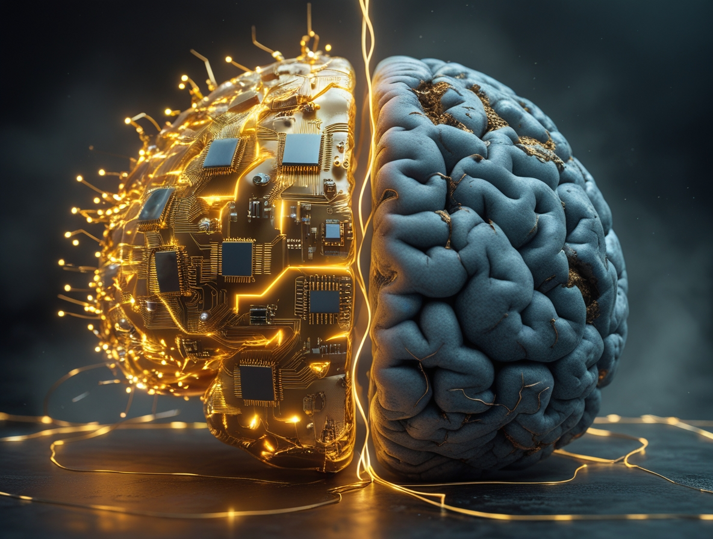
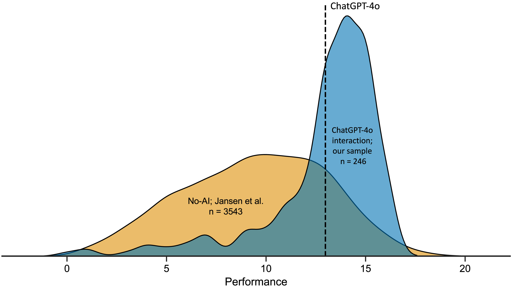
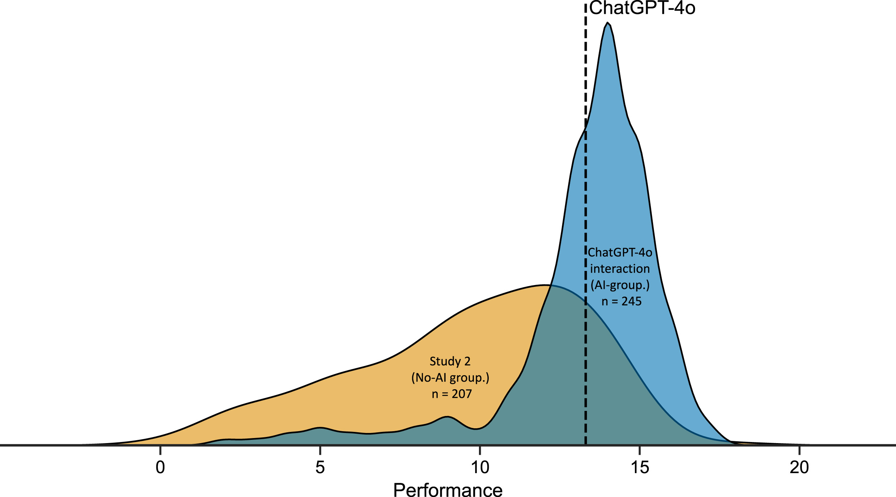

# L'IA vous rend plus compétent, pas plus sage. Surestimer ses propres connaissances

*Imaginez que vous passiez le test d'admission à la faculté de droit américaine avec ChatGPT à vos côtés. Les résultats s'améliorent sensiblement : trois points de plus que ceux qui passent l'examen seuls. Pourtant, lorsqu'on vous demande d'évaluer votre propre performance, vous vous trompez de quatre points par excès. Et ce n'est pas tout : plus vous connaissez techniquement le fonctionnement de l'intelligence artificielle, plus cette illusion de compétence s'amplifie. Bienvenue dans le paradoxe de la cognition augmentée, où devenir meilleur signifie simultanément perdre la capacité de comprendre à quel point nous sommes vraiment bons.*

## Le paradoxe de la performance augmentée

La recherche menée par l'Université d'Aalto et publiée dans [Computers in Human Behavior](https://www.sciencedirect.com/science/article/pii/S0747563225002262) a soumis 246 participants à vingt questions de raisonnement logique tirées du LSAT, le test standardisé pour l'accès aux écoles de droit américaines. La moitié de l'échantillon pouvait consulter librement ChatGPT-4o pendant la résolution, l'autre moitié procédait de manière autonome. Les chiffres racontent une histoire ambivalente : ceux qui utilisaient l'IA obtenaient des scores moyens de 12,98 sur 20, contre 9,45 pour ceux qui travaillaient sans assistance. Une amélioration de 37 % qui, sur le papier, confirmerait les promesses de l'intelligence augmentée.

Mais il y a un détail gênant. Lorsqu'on demandait aux participants du groupe IA d'estimer combien de réponses ils avaient fournies correctement, la moyenne de leurs prévisions s'élevait à 16,50 sur 20. Une surestimation systématique d'environ quatre points, soit le double de celle du groupe de contrôle. Comme si l'accès à un outil puissant avait non seulement amélioré leurs capacités réelles, mais avait en même temps déformé la perception de ces capacités dans une mesure encore plus grande.

Le phénomène rappelle cette sensation que nous avons tous éprouvée en faisant défiler Wikipédia à trois heures du matin : après avoir lu trois articles sur l'exosquelette des crustacés, nous nous sentons soudainement experts en biologie marine. Les psychologues appellent ce mécanisme "l'illusion de la profondeur explicative", et il fonctionne ainsi : lorsqu'une information est facilement accessible, notre cerveau la confond avec une information possédée. Dans le cas de l'IA, cependant, l'effet est amplifié par la nature conversationnelle de l'interaction : ChatGPT ne se contente pas de renvoyer une donnée, il construit un récit articulé qui imite le processus cognitif lui-même.

Daniela Fernandes, première auteure de l'étude, a observé que la majorité des participants interagissaient avec ChatGPT de manière étonnamment superficielle. 46 % d'entre eux n'envoyaient qu'une seule invite par problème, copiant la question dans l'interface et acceptant la réponse sans approfondir. C'est comme se fier au premier résultat d'une recherche Google sans vérifier les sources, mais avec des conséquences plus sournoises : vous ne déléguez pas seulement la recherche d'informations, vous externalisez le processus de raisonnement lui-même.

[Image tirée de l'article officiel. Comparaison des scores de performance entre les participants interagissant avec ChatGPT et un ensemble de données sans IA](https://www.sciencedirect.com/science/article/pii/S0747563225002262)

## La disparition de l'effet Dunning-Kruger

Pendant des décennies, l'un des phénomènes les plus étudiés en psychologie cognitive a été l'effet Dunning-Kruger : cette tendance systématique des individus les moins compétents à surestimer considérablement leurs propres capacités, tandis que les plus préparés tendent à une modeste sous-estimation. C'est le principe qui explique pourquoi le collègue qui sait à peine ouvrir une feuille Excel se propose avec assurance pour gérer la base de données de l'entreprise, tandis que l'ingénieur informaticien hésite avant de donner son avis.

Dans les tests de raisonnement logique menés sans IA, ce schéma apparaît avec une régularité mathématique : ceux qui se situent dans le profil de performance le plus bas ont tendance à croire qu'ils appartiennent à la tranche moyenne-haute, ceux qui excellent se positionnent souvent plus bas qu'ils ne le méritent. C'est un effet de calibrage inversement proportionnel à la compétence réelle, alimenté par ce que les chercheurs appellent le "bruit métacognitif" : le bruit de fond qui interfère avec notre capacité d'auto-évaluation.

Mais lorsque les chercheurs d'Aalto ont appliqué un modèle computationnel bayésien aux données du groupe qui utilisait ChatGPT, ils ont découvert quelque chose d'inattendu. L'effet Dunning-Kruger a tout simplement disparu. Il n'a pas été réduit ou atténué : il a cessé d'exister en tant que schéma statistiquement pertinent. Tous les participants, quelle que soit leur performance réelle, présentaient des niveaux de surestimation similaires. Comme si l'IA avait nivelé non seulement les compétences, mais aussi l'incapacité à les évaluer avec précision.

Le mécanisme sous-jacent est contre-intuitif mais logique. L'effet Dunning-Kruger émerge de la corrélation entre la capacité à accomplir une tâche et la capacité métacognitive, c'est-à-dire la capacité à surveiller la qualité de son propre raisonnement. Ceux qui sont bons pour résoudre des problèmes logiques sont également bons pour reconnaître quand leur solution tient la route ou s'effondre. Mais lorsque ChatGPT entre en jeu, cette corrélation se brise : l'IA fournit des résultats de qualité relativement uniforme à tout le monde, quelle que soit la capacité de l'utilisateur à en évaluer la validité. Le résultat est une performance nivelée vers le haut et une métacognition nivelée vers le bas. Tout le monde s'améliore, mais personne ne sait vraiment de combien.

Robin Welsch, psychologue cognitif et superviseur de la recherche, a observé que cela représente un renversement de l'hypothèse d'augmentation cognitive formulée dans les années 1960 par Doug Engelbart. L'idée originale était que les technologies pouvaient amplifier l'intellect humain tout en maintenant ou en améliorant la conscience critique. Au lieu de cela, nous assistons à une amplification asymétrique : les capacités augmentent, la sagesse stagne.

## La littératie technologique comme boomerang

S'il y a un résultat de l'étude qui renverse les hypothèses courantes sur la relation entre la compétence et l'utilisation consciente de la technologie, c'est bien la corrélation entre la littératie en IA et la précision métacognitive. Les chercheurs ont mesuré la littératie en IA des participants à l'aide de l'échelle SNAIL (Scale for the assessment of non-experts' AI literacy), qui évalue trois dimensions : la compréhension technique du fonctionnement des systèmes, la capacité d'évaluation critique des résultats et l'habileté dans l'application pratique.

Ce à quoi on pourrait s'attendre, c'est une relation positive : ceux qui connaissent le mieux l'IA devraient l'utiliser de manière plus consciente, en reconnaître les limites, mieux calibrer leur confiance dans ses suggestions. Au lieu de cela, les données montrent le contraire. Les participants ayant les scores les plus élevés dans la dimension de la "compréhension technique" étaient systématiquement moins précis dans leurs auto-évaluations. Plus ils en savaient sur l'ingénierie des invites, la température des modèles et les architectures de transformateurs, plus ils surestimaient la qualité de leur travail avec l'IA.

C'est un effet qui rappelle cette scène de *Primer*, le film culte de Shane Carruth sur le voyage dans le temps, où les protagonistes deviennent tellement immergés dans la complexité technique de leur machine qu'ils perdent complètement de vue les implications de ce qu'ils construisent. La familiarité avec le mécanisme ne garantit pas la sagesse dans son utilisation. Au contraire, elle peut créer un faux sentiment de contrôle : "Je sais comment cette chose fonctionne, donc je peux faire confiance aux résultats qu'elle me donne".

Thomas Kosch, expert en interaction homme-machine et co-auteur de l'étude, suggère que ce paradoxe découle d'un malentendu fondamental sur ce que signifie "connaître" un système d'IA. Comprendre techniquement un grand modèle de langage signifie savoir qu'il traite le texte par le biais de couches d'attention, qu'il prédit le jeton suivant par maximisation probabiliste, qu'il peut être affiné sur des ensembles de données spécifiques. Mais cette connaissance procédurale ne se traduit pas automatiquement par une conscience épistémique : savoir quand le modèle produit une réponse fiable et quand il ne fait que générer un texte plausible.

Le groupe de recherche a trouvé une corrélation positive entre les trois facteurs de l'échelle SNAIL et la confiance moyenne des participants. Ceux qui en savaient plus se sentaient plus en confiance. Mais cette confiance ne se traduisait pas par une meilleure capacité à discriminer entre les réponses correctes et incorrectes : l'aire sous la courbe ROC, qui mesure dans quelle mesure les jugements de confiance prédisent la précision réelle, restait stable ou diminuait même avec l'augmentation de la littératie en IA. Plus vous en savez, plus vous faites confiance, mais vous ne jugez pas nécessairement mieux.

[Image tirée de l'article officiel. Comparaison des scores de performance entre l'échantillon de participants interagissant avec ChatGPT et l'échantillon de participants sans IA.](https://www.sciencedirect.com/science/article/pii/S0747563225002262)

## L'effondrement de la métacognition

Pour comprendre à quel point le déficit métacognitif induit par l'utilisation de l'IA est profond, les chercheurs ont analysé non seulement les estimations globales de performance (combien de questions pensez-vous avoir résolues correctement ?), mais aussi les jugements de confiance étape par étape : après chaque problème, les participants évaluaient sur une échelle de 0 à 100 leur degré de confiance dans leur réponse.

Dans des conditions normales, ces jugements devraient être prédictifs : une grande confiance pour les réponses correctes, une faible confiance pour les réponses erronées. C'est le signal que le système métacognitif fonctionne, qu'il existe une boucle de rétroaction entre le processus de prise de décision et le suivi de la qualité de ce processus. Mais dans le groupe qui utilisait ChatGPT, cette corrélation s'est avérée significativement atténuée. La confiance moyenne pour les réponses correctes n'était que marginalement plus élevée que celle pour les réponses erronées, avec une AUC moyenne de 0,62, à peine supérieure au niveau du hasard et bien en dessous du seuil de 0,70 que les psychologues considèrent comme un indice de "sensibilité métacognitive modérée".

En pratique, les participants se sentaient plus ou moins en confiance tout le temps, qu'ils donnent la bonne ou la mauvaise réponse. C'est comme conduire avec le tableau de bord couvert : le véhicule fonctionne, mais vous n'avez aucune idée si vous roulez à trente ou à cent trente à l'heure.

Cet effondrement de la sensibilité métacognitive a des implications qui vont bien au-delà des tests de logique. Pensez à un médecin qui utilise un système d'IA diagnostique : si sa capacité à distinguer les diagnostics fiables des diagnostics douteux est compromise par la facilité avec laquelle l'IA produit des résultats formellement convaincants, le résultat n'est pas une amélioration de la pratique clinique mais une augmentation potentielle du risque. Ou à un étudiant qui prépare un examen en utilisant ChatGPT pour résoudre des problèmes : si l'accès immédiat aux solutions le convainc d'avoir compris la matière, il se présentera à l'examen avec un sentiment de préparation illusoire.

Le phénomène est aggravé par ce que Stephen Fleming, neuroscientifique de la cognition à l'University College London, appelle "l'heuristique de la fluidité" : lorsqu'une information est traitée rapidement et sans effort, le cerveau l'interprète comme un signe de compétence. ChatGPT renvoie des réponses élaborées, articulées, impeccablement formatées et presque instantanément. Chaque aspect de cette expérience crie "c'est correct" à notre système intuitif, contournant l'analyse délibérative que nous activons normalement face à une information incertaine.

## Repenser les interfaces intelligentes

La question devient alors : si l'IA améliore effectivement les performances mais détériore la conscience critique, comment concevoir des systèmes qui conservent les avantages tout en minimisant les dommages ? La réponse ne peut se limiter à "utilisons-la moins" ou "faisons-lui moins confiance". Le génie est sorti de la lampe, et des dizaines de millions de personnes utilisent quotidiennement des outils comme ChatGPT, Claude, Gemini pour raisonner, écrire, résoudre des problèmes.

Les chercheurs proposent ce qu'ils appellent une "micro-tâche d'explication en retour" : avant d'accepter une réponse générée par l'IA, l'utilisateur doit la reformuler avec ses propres mots, en explicitant la logique sous-jacente. C'est une technique qui force le passage d'un apprentissage superficiel, basé sur la reconnaissance de schémas, à un apprentissage profond, basé sur la compréhension structurelle. Si vous demandez à ChatGPT de résoudre un problème de physique et que vous devez ensuite expliquer avec vos propres mots pourquoi cette solution fonctionne, le système vous oblige à une confrontation directe avec votre compréhension réelle.

Une autre direction prometteuse concerne l'étalonnage explicite de la confiance. Au lieu de laisser l'utilisateur déduire implicitement la fiabilité d'une réponse à partir du ton assertif du modèle, l'interface pourrait afficher des mesures d'incertitude : à quel point le modèle est "sûr" de la réponse en termes de distribution de probabilité, s'il existe des réponses alternatives plausibles, à quel point la question s'écarte de l'ensemble d'entraînement. Ce n'est pas une solution parfaite car les utilisateurs ont tendance à ignorer ces signaux lorsque le résultat semble convaincant, mais au moins elle introduit un élément de friction cognitive.

Les experts en interaction homme-IA explorent également des architectures plus radicales, comme les agents métacognitifs : des systèmes d'IA secondaires dont la tâche n'est pas de vous aider à résoudre le problème, mais de surveiller la manière dont vous résolvez le problème avec l'aide de la première IA. Une sorte de superviseur cognitif qui intervient lorsqu'il détecte des schémas de sur-confiance ou d'acceptation acritique. Cela semble de la science-fiction, mais certaines expériences préliminaires montrent des réductions significatives de la surestimation des performances lorsque ce type d'échafaudage métacognitif est mis en œuvre.

Falk Lieder, chercheur à l'Institut Max Planck, a proposé un cadre encore plus ambitieux : des interfaces qui s'adaptent dynamiquement au niveau de compétence métacognitive de l'utilisateur. Lorsque le système détecte que vous vous fiez trop aveuglément aux résultats, il augmente le niveau d'ambiguïté des réponses, insère des signaux d'incertitude plus marqués, vous demande de justifier vos choix. Lorsque, au contraire, vous faites preuve de capacité critique, il se rétracte et laisse plus d'autonomie. C'est un modèle qui renverse la logique actuelle, où l'IA cherche à être toujours plus fluide et à assister, pour introduire au contraire une stratégie d'"assistance calibrée".

Le risque, bien sûr, est que ces interventions créent des frictions telles qu'elles rendent les outils moins attrayants. Si chaque fois que je demande à ChatGPT de m'aider à résoudre un problème, je dois passer par un quiz métacognitif avant de voir la réponse, il est probable que je cesserai de l'utiliser. Mais c'est peut-être là tout l'intérêt : l'objectif ne devrait pas être de maximiser l'engagement avec l'IA, mais d'optimiser l'augmentation cognitive dans son sens le plus plein, y compris la dimension métacognitive.

Janet Rafner, qui étudie les implications sociotechniques de l'IA à l'Institut de Copenhague, suggère que le problème nécessite des solutions à plusieurs niveaux. À court terme, de meilleures conceptions d'interface. À moyen terme, des programmes éducatifs qui enseignent non seulement la littératie technique en IA mais aussi la littératie métacognitive. À long terme, une reconsidération culturelle de ce que signifie la compétence dans un monde où l'accès à des capacités cognitives externes est omniprésent. C'est un défi qui rappelle celui auquel l'écriture elle-même a été confrontée il y a des millénaires : lorsque vous disposez de la mémoire externe de la parole écrite, qu'advient-il de la mémoire interne ? Et surtout, qu'advient-il de votre conscience de ce que vous vous souvenez vraiment et de ce que vous avez seulement transcrit ?

La recherche de l'Université d'Aalto n'offre pas de solutions définitives, mais elle identifie avec précision un problème qui risquait de rester submergé sous l'enthousiasme pour les gains de performance. L'IA nous rend plus intelligents au sens computationnel : nous résolvons plus de problèmes, plus rapidement, avec moins d'erreurs. Mais elle ne nous rend pas plus sages au sens métacognitif : nous ne nous améliorons pas dans notre capacité à évaluer de manière critique nos propres processus cognitifs, à reconnaître quand nous comprenons vraiment et quand nous ne faisons que simuler la compréhension.

C'est la différence entre Deckard et les réplicants dans *Blade Runner* : tous possèdent des souvenirs, mais seuls certains savent lesquels sont authentiquement les leurs. Dans notre cas, nous obtenons tous de meilleures réponses avec l'IA, mais nous risquons de perdre la capacité de distinguer la compréhension authentique de la compétence empruntée. Et dans un monde où de plus en plus de décisions importantes sont prises avec l'aide de systèmes intelligents, cette distinction pourrait faire toute la différence.
