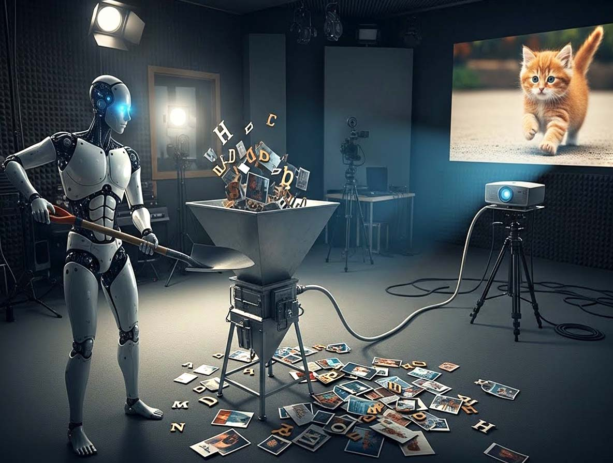
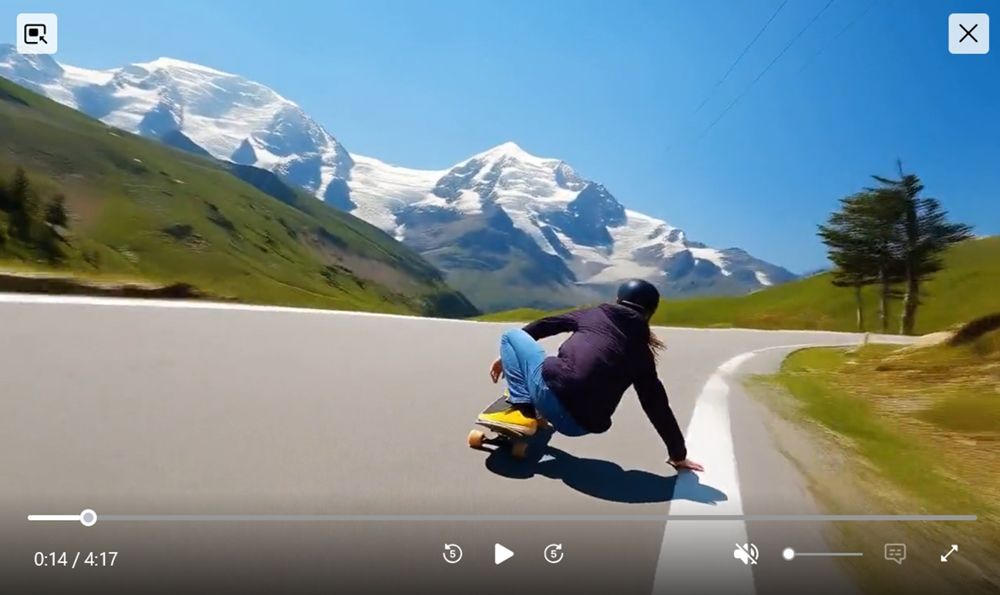
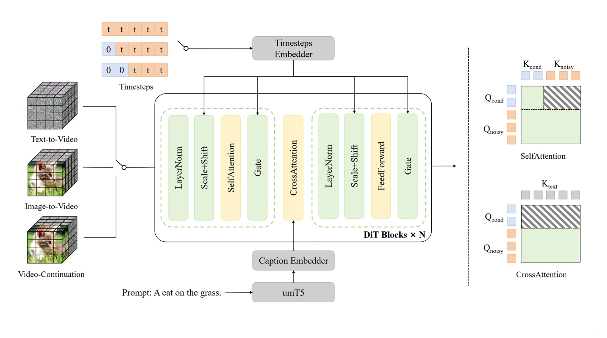
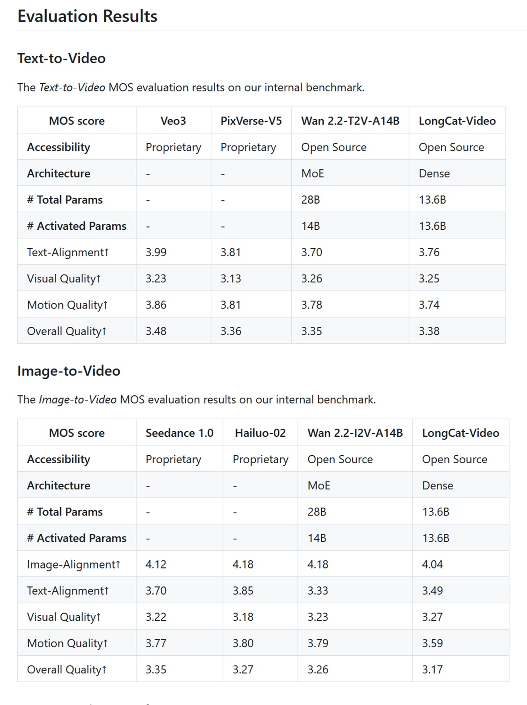

# LongCat-Video, der stille Riese der Open-Source-Videogenerierung

*Meituan veröffentlicht ein Modell mit 13,6 Milliarden Parametern, das Videos von bis zu fünf Minuten Länge generiert. Im Chaos der Video-KI kommt eine elegante technische Lösung, die proprietäre Giganten mit Effizienz und Transparenz herausfordert. Während die Technologiewelt damit beschäftigt war, [die Urheberrechtskontroversen um Sora 2](https://openai.com/it-IT/index/sora-2/) zu verdauen und sich mit den Zugangsbeschränkungen von [Veo 3](https://aistudio.google.com/models/veo-3) auseinanderzusetzen, veröffentlichte das LongCat-Team von Meituan Ende Oktober 2025 [LongCat-Video](https://huggingface.co/meituan-longcat/LongCat-Video) mit der Diskretion derjenigen, die wissen, dass sie etwas Solides in den Händen halten, aber nicht das Bedürfnis verspüren, es hinauszuschreien.*

Keine spektakulären Keynotes, keine im Labor vorbereiteten Demos mit verdächtigem Cherry-Picking, nur ein GitHub-Repository, die Modellgewichte auf Hugging Face und ein detailliertes technisches Papier auf arXiv. Als ob man sagen wollte: Hier ist der Code, hier ist das Modell, macht ihr mal.

Und das Modell ist, wenn man es sich genau ansieht, alles andere als bescheiden. Mit 13,6 Milliarden Parametern und der Fähigkeit, Videos von bis zu fünf Minuten Länge zu generieren und dabei zeitliche Kohärenz und visuelle Qualität beizubehalten, geht LongCat-Video eines der hartnäckigsten Probleme der generativen Video-KI an: Wie verhindert man, dass ein langes Video zu einer psychedelischen Drift von Artefakten, Farbverschiebungen und narrativen Inkonsistenzen wird? Es ist die Art von Problem, die trivial erscheint, bis man darauf stößt, so wie man merkt, dass das Schreiben einer langen Geschichte schwieriger ist als das Aneinanderreihen kurzer Absätze.

## Das Problem, das niemand wirklich gelöst hatte

Die Landschaft der KI-Videogenerierung im Jahr 2025 ähnelt einem Wettrüsten, bei dem sich alle auf dieselbe Metrik konzentrieren: Wie fotorealistisch kann man einen Fünf-Sekunden-Clip machen? Sora, Veo, Movie Gen haben die Messlatte für die visuelle Qualität auf beeindruckende Niveaus gehoben, bleiben aber an kurze oder anderweitig begrenzte Dauern gebunden. Als OpenAI Sora 2 mit seiner maximalen Generationsdauer von zwanzig Sekunden ankündigte, schien das ein Meilenstein zu sein. Aber zwanzig Sekunden sind in Bezug auf das visuelle Storytelling kaum mehr als eine Eröffnungsaufnahme. Man erzählt in zwanzig Sekunden nicht viel, höchstens evoziert man etwas.

Die Open-Source-Welt ihrerseits kämpft zwischen ehrgeizigen Projekten und begrenzten Ressourcen. [HunyuanVideo von Tencent](https://github.com/Tencent/HunyuanVideo) erreicht zehn Sekunden mit soliden Ergebnissen, [Mochi](https://mochi1ai.com/it) konzentriert sich auf die Animation von statischen Bildern, Open-Sora hat Schwierigkeiten, das proprietäre Original zu replizieren. Sie alle teilen dieselbe Einschränkung: Über eine bestimmte Dauer hinaus bricht die zeitliche Kohärenz wie ein schlecht gebackenes Soufflé zusammen. Die Bilder beginnen in den Farben abzuweichen, Objekte vervielfachen sich oder verschwinden, Bewegungen verlieren ihre physische Kontinuität. Es ist das Phänomen, das Forscher als "zeitliche Drift" bezeichnen und das den Nutzern einfach als Videos erscheint, die von einer künstlichen Intelligenz unter dem Einfluss psychoaktiver Substanzen generiert zu sein scheinen.

LongCat-Video greift dieses Problem aus einer anderen Perspektive an. Anstatt alles auf die fotorealistische Perfektion sehr kurzer Clips zu setzen, hat das Meituan-Team eine Architektur entworfen, die die erweiterte zeitliche Kohärenz bevorzugt. Die Idee ist so einfach wie wirkungsvoll: Wenn man ein Modell explizit auf die Fähigkeit trainiert, bestehende Videos fortzusetzen, d. h. nachfolgende Bilder zu generieren, die mit den vorherigen konsistent bleiben, lernt dieses Modell implizit, mit langen zeitlichen Abhängigkeiten umzugehen. Es ist ein bisschen wie der Unterschied zwischen einem Sprinter und einem Marathonläufer: Der erstere explodiert auf hundert Metern, der letztere verteilt die Anstrengung auf Distanzen, die den Sprinter zusammenbrechen lassen würden.

Meituan ist kein Name, der denen, die den chinesischen Technologiemarkt nicht verfolgen, vertraut ist, aber wir sprechen von einer der größten lokalen Dienstleistungsplattformen in China mit fundierten Kenntnissen im maschinellen Lernen, das auf Probleme im industriellen Maßstab angewendet wird. Das LongCat-Team arbeitete an diesem Projekt und konzentrierte sich auf ein technisch elegantes Ziel: ein einheitliches Modell zu schaffen, das in der Lage ist, drei verschiedene Aufgaben zu bewältigen, Text-zu-Video, Bild-zu-Video und Videofortsetzung, ohne separate Architekturen oder komplizierte Pipelines. Ein bisschen so, als würde man einen Motor entwerfen, der sowohl mit Benzin als auch mit Diesel und elektrisch gut funktioniert, anstatt drei verschiedene Motoren zu haben.

## Eine Architektur für die Dauer

Unter der Haube basiert LongCat-Video auf einem Diffusion Transformer oder DiT, der gleichen Architekturfamilie, die Sora zu einem Maßstab in der Branche gemacht hat. DiTs sind eine Variante der ursprünglichen Transformer, die an Diffusionsprozesse angepasst sind, jene Generationstechnik, die durch schrittweises Hinzufügen von Rauschen zu einem Bild und anschließendes Erlernen, es kontrolliert zu entfernen, funktioniert. Denken Sie an die Restaurierung eines alten Freskos: Zuerst bedecken Sie alles mit einer Schicht virtuellen Schmutzes, dann lernen Sie, ihn zu entfernen und das darunter liegende Bild freizulegen. Diffusionsmodelle machen genau das, aber in umgekehrter Richtung: Sie beginnen mit reinem Rauschen und "reinigen" es, bis sie das gewünschte Bild erhalten.

Das Problem bei langen Videos ist, dass jedes hinzugefügte Bild die Rechenkomplexität exponentiell vervielfacht. Ein Fünf-Minuten-Video mit 30 fps sind 9.000 Bilder, und jedes Bild muss mit allen anderen konsistent sein. Der erforderliche Speicher explodiert, die Generierungszeiten werden unerschwinglich und das Risiko akkumulierter Fehler steigt. Es ist, als würde man mit neuntausend Leuten Stille Post spielen: Selbst ein mikroskopisch kleiner Fehler bei Bild 100 verstärkt sich bei Bild 9.000 dramatisch.

LongCat-Video löst dies mit Block Sparse Attention, einem Mechanismus, der anstatt jedes Bild gleichzeitig auf alle anderen Bilder achten zu lassen (eine rechentechnisch verheerende Operation), Blöcke lokaler Aufmerksamkeit erzeugt. Jedes Bild achtet hauptsächlich auf benachbarte Bilder und eine strategische Auswahl entfernter Bilder. Es ist, als würde man eine Landschaft betrachten: Man hat eine scharfe Sicht auf das, was in der Nähe ist, eine periphere Sicht auf das, was an den Seiten ist, und visuelle Ankerpunkte am Horizont. Man sieht nicht alles mit der gleichen Schärfe, aber das Gehirn rekonstruiert eine kohärente Wahrnehmung des Raums. Block Sparse Attention macht dasselbe mit Videos.

Die andere wichtige Innovation ist die Coarse-to-Fine-Strategie, die sowohl auf der zeitlichen als auch auf der räumlichen Achse arbeitet. Anstatt sofort hochauflösende Videos mit allen Bildern zu generieren, generiert das Modell zunächst eine niedrigauflösende Version mit weniger Bildern, die die narrative Struktur und die Hauptbewegungen erfasst. Dann, in einer zweiten Phase, verfeinert es diesen Entwurf, indem es die räumliche Auflösung und die zeitliche Bildrate schrittweise erhöht. Es ist wie bei der Arbeit an einer traditionellen Animation: Zuerst zeichnet man die wichtigsten Keyframes, die die Schlüsselposen und -bewegungen definieren, dann fügt man die Zwischenbilder hinzu, die alles flüssig machen, und schließlich koloriert und verfeinert man die Details.

Diese Strategie ist nicht nur recheneffizient, sie ist auch besser auf die Funktionsweise der menschlichen visuellen Erzählung abgestimmt. Wenn man sich eine Szene vorstellt, visualisiert man sie nicht sofort Bild für Bild in 4K: Zuerst hat man eine grobe Vorstellung von der Komposition, den Hauptbewegungen, der allgemeinen Atmosphäre. Dann fügt man Details hinzu, perfektioniert die Bewegungen, definiert die Texturen. Der Coarse-to-Fine-Ansatz repliziert diesen kognitiven Prozess.

Das native Vortraining für Video-Continuation-Aufgaben ist die geheime Zutat, die alles zusammenhält. Während des Trainings sah das Modell Hunderttausende von Stunden Video, bei denen die Aufgabe nicht darin bestand, von Grund auf neu zu generieren, sondern bestehende Sequenzen unter Beibehaltung der stilistischen, narrativen und physischen Kohärenz fortzusetzen. Es lernte, was zeitliche Kontinuität bedeutet, auf die direkteste Weise: indem es es tat, iterativ, für Tausende von Stunden. Es ist, als würde man lernen, Fortsetzungen zu schreiben, indem man Romane liest und dann die nächsten Kapitel schreibt: Man lernt implizit, was es bedeutet, die Konsistenz von Ton, Charakteren und Schauplatz beizubehalten.

[Frame aus einem Demovideo von der offiziellen LongCat-Video-Website](https://meituan-longcat.github.io/LongCat-Video/)

## Drei Aufgaben, ein Modell

Eine der elegantesten Architekturentscheidungen von LongCat-Video ist der einheitliche Ansatz für die drei Hauptaufgaben: Text-zu-Video-Generierung von Grund auf, Bild-zu-Video-Animation von statischen Bildern und Videofortsetzung zur Erweiterung bestehender Clips. Die meisten Systeme bewältigen diese Aufgaben mit separaten Modellen oder aufwändigen Pipelines, die verschiedene Komponenten zusammenkleben. LongCat-Video behandelt sie alle, indem es sie einfach durch die Anzahl der bedingten Eingabebilder unterscheidet.

Bei reinem Text-zu-Video startet das Modell mit null bedingten Bildern und generiert alles nur auf der Grundlage des Text-Prompts. Dies ist der schwierigste Anwendungsfall, da man keine visuellen Anker hat, man muss Komposition, Bewegungen, Stil und Kohärenz ausschließlich aus der Interpretation des Textes erstellen. Es ist, als würde man jemandem sagen: "Male mir einen Sturm auf See", ohne Referenzen zu zeigen: Er muss sich alles vorstellen.

Bei Bild-zu-Video liefert man ein Anfangsbild als Bedingung und das Modell generiert die nachfolgenden Bilder, die dieses Bild animieren. Hier ist die Aufgabe eingeschränkter: Man hat bereits Komposition, Stil, Beleuchtung, die durch das Anfangsbild definiert sind, man muss nur kohärente Bewegung hinzufügen. Es ist, als hätte man die erste Einstellung eines Films bereits gedreht und müsste entscheiden, wie die Szene weitergeht.

Bei der Videofortsetzung liefert man ein ganzes Videosegment und bittet das Modell, es zu erweitern. Dies ist technisch der am stärksten eingeschränkte Fall, erfordert aber maximale zeitliche Kohärenz: Man muss nicht nur Stil und Komposition respektieren, sondern auch die Physik der bereits vorhandenen Bewegungen, die Flugbahn der Objekte, die Entwicklung der Szene. Es ist, als würde man den dritten Akt einer Geschichte schreiben, deren erste beiden bereits geschrieben sind: Man hat kreativen Spielraum, muss aber die bereits etablierten Charaktere, die Handlung und den Ton respektieren.

Die einheitliche Architektur bedeutet, dass das Modell keine separaten Module benötigt, um diese Fälle zu behandeln. Intern ist Text-zu-Video einfach eine Videofortsetzung mit null bedingten Bildern, Bild-zu-Video ist eine Videofortsetzung mit einem bedingten Bild und so weiter. Dies reduziert nicht nur die technische Komplexität, da man nur eine Codebasis und eine Trainingspipeline pflegt, sondern verbessert auch die Qualität, da das Modell Repräsentationen und Fähigkeiten zwischen den verschiedenen Aufgaben teilt. Die Fähigkeiten, die zum Erweitern langer Videos erlernt wurden, helfen bei der Generierung von Grund auf und umgekehrt.

Für Entwickler und Forscher ist dieser Ansatz ein Segen. Anstatt komplexe Pipelines konfigurieren zu müssen, die verschiedene Modelle für verschiedene Aufgaben aufrufen, installiert man ein einziges Modell und ändert einfach die Anzahl der Bilder, die man als Eingabe bereitstellt. Willst du aus Text generieren? Null Bilder. Willst du ein Bild animieren? Ein Bild. Willst du ein Video erweitern? Das ganze Video. Die Einfachheit wird in der Softwareentwicklung unterschätzt, aber jeder, der komplexe Pipelines debuggt hat, weiß, wie wertvoll es ist, weniger bewegliche Teile zu haben.

[Diagramm von der offiziellen LongCat-Video-Website](https://meituan-longcat.github.io/LongCat-Video/)

## Die Zahlen sprechen, aber sie schreien nicht

Wenn es um generative Modelle geht, sind Benchmarks ein Minenfeld. Jedes Unternehmen hat seine eigenen internen Tests, die darauf optimiert sind, seine Modelle zum Glänzen zu bringen, und öffentliche Tests wie [VBench](https://vchitect.github.io/VBench-project/) versuchen, objektive Bewertungen anzubieten, erfassen aber nur einige Dimensionen der wahrgenommenen Qualität. LongCat-Video navigiert diese Zahlen mit soliden, aber nicht umwerfenden Ergebnissen, was genau das ist, was man von einem Open-Source-Modell erwartet, das mit einem Bruchteil der Ressourcen der Tech-Giganten entwickelt wurde.

In den internen Benchmarks von Meituan, die auf dem Mean Opinion Score basieren, bei dem menschliche Bewerter Videos auf einer Skala von 1 bis 5 beurteilen, erreicht LongCat-Video 3,25 für die visuelle Qualität bei Text-zu-Video und 3,27 bei Bild-zu-Video. Zum Vergleich: Veo 3 erreicht 3,51, Sora 2 liegt bei 3,49. Es ist kein riesiger Abstand, aber er existiert. Bei den Text-Alignment-Metriken, bei denen die Übereinstimmung zwischen dem generierten Video und dem Text-Prompt gemessen wird, erreicht LongCat-Video 3,76, während die proprietären Top-Player nahe an 4,0 liegen. Kurzum, das Modell ist wettbewerbsfähig, aber nicht dominant.

Bei VBench, dem angesehensten öffentlichen Benchmark der Branche, der 16 verschiedene Dimensionen der Videoqualität bewertet, schneidet LongCat-Video besonders gut bei der zeitlichen Kohärenz und dem Common-Sense-Verständnis ab, wo es mit einer Punktzahl von 70,94 % den ersten Platz unter den Open-Source-Modellen belegt. Dies ist von Bedeutung, da der gesunde Menschenverstand, die Fähigkeit, Videos zu generieren, die Physik, räumliche Logik und grundlegende narrative Kohärenz respektieren, traditionell die Achillesferse generativer Modelle ist. Ein Modell kann fotorealistische Texturen und flüssige Bewegungen erzeugen, aber wenn es eine Person durch eine Wand gehen lässt oder Objekte ohne Grund schweben lässt, ist das Ergebnis befremdlich.

Der Vergleich mit den Open-Source-Konkurrenten zeigt ein interessantes Szenario. HunyuanVideo, das mit etwa 13 Milliarden Parametern eine ähnliche Größe hat, ist für kürzere Videos optimiert, aber mit etwas höherer visueller Qualität bei Drei-Sekunden-Clips. Mochi konzentriert sich auf die Generierungsgeschwindigkeit mit 10 Milliarden Parametern und einer asymmetrischen Architektur, die die Effizienz bevorzugt. Open-Sora, der Versuch der Community, die ursprüngliche Architektur von OpenAI zu replizieren, hinkt bei fast allen Metriken hinterher. CogVideoX-5B, entwickelt von der Tsinghua-Universität, hat eine vergleichbare Leistung wie LongCat bei kurzen Videos, unterstützt aber keine Generationen über zehn Sekunden. LTX-Video von Lightricks führte das Versprechen der Echtzeitgenerierung ein, aber mit Videos, die auf wenige Sekunden beschränkt sind.

[Wie wir bereits in dem Artikel über Ovi und das Open-Source-Ökosystem der Videogenerierung besprochen haben](https://aitalk.it/it/ai-video-generativa-ovi.html), ist die Landschaft zwischen Projekten zersplittert, die auf absolute Qualität, Generierungsgeschwindigkeit oder Videodauer optimieren. LongCat-Video fügt sich in diese Landschaft mit einem klaren Vorschlag ein: Ich bin nicht der schnellste, ich bin nicht der fotorealistischste, aber ich kann lange Videos unter Beibehaltung der Kohärenz generieren. Es ist eine intelligente Positionierung, denn die Dauer ist immer noch ein starkes Unterscheidungsmerkmal. Ovi hat die Bedeutung der nativen Audio-Video-Integration demonstriert, CogVideoX hat auf die zeitliche Kohärenz in zehn Sekunden gedrängt, LongCat-Video erweitert diese Fähigkeit auf Minuten.

Der entscheidende Punkt ist, dass keines dieser Open-Source-Modelle die proprietären Systeme in absoluter Qualität übertrifft. Sora 2 generiert fotorealistischere Videos, Veo 3 hat einen verfeinerten filmischen Stil, Movie Gen integriert Audio und Musik mit professioneller Qualität. Aber all diese Modelle sind unzugängliche Black Boxes, die hinter kostenpflichtigen APIs oder endlosen Wartelisten verschlossen sind. Man kann sie nicht studieren, man kann sie nicht modifizieren, man kann nicht überprüfen, mit welchen Daten sie trainiert wurden. Es ist wie bei einem All-you-can-eat-Buffet, bei dem das Essen besser aussieht, aber man nicht weiß, was sie hineingetan haben, während man im Open-Source-Restaurant die offene Küche sieht und jede Zutat kennt.

[Tabelle aus dem GitHub-Repository von LongCat-Video](https://github.com/meituan-longcat/LongCat-Video)

## Open Source, aber zu welchem Preis?

Zu sagen, dass LongCat-Video Open Source ist, klingt demokratisch und zugänglich, aber die Hardware-Realität erzählt eine differenziertere Geschichte. Um Videos in 720p und 30 fps in angemessener Zeit zu generieren, benötigt man mindestens 60 GB VRAM, was Multi-GPU-Konfigurationen oder Enterprise-Karten wie die NVIDIA A100 oder H100 bedeutet. Eine einzelne A100 kostet so viel wie ein gebrauchter Kleinwagen, und selbst mit Optimierungen wie der 8-Bit-Quantisierung, die die Anforderungen auf etwa 18 GB auf einer RTX 4090 reduziert, sprechen wir immer noch von High-End-Enthusiasten-Hardware.

Dies wirft die entscheidende Frage auf: Ist die Demokratisierung des Codes, aber die Forderung nach vier- bis fünftausend Euro teurer Hardware eine echte Demokratisierung oder nur eine Illusion für diejenigen, die sich die GPUs leisten können? Die Antwort hängt davon ab, wer Sie sind. Für einen einzelnen Bastler oder einen unabhängigen Kreativen bleibt LongCat-Video wahrscheinlich unerreichbar, es sei denn, er nutzt Cloud-Dienste, was monatliche Kosten mit sich bringt, die nicht allzu weit von den Abonnements für proprietäre Modelle entfernt sind. Für ein kleines bis mittelgroßes Kreativstudio, ein Universitätslabor oder ein Tech-Startup ist die Ausgabe von einigen tausend Euro für Hardware eine einmalige Investition, die vollständige Kontrolle und vorhersehbare Betriebskosten bietet. Keine Abonnements, die steigen, keine APIs, die die Bedingungen ändern, kein Risiko, dass der Dienst eingestellt wird.

Die MIT-Lizenz, unter der LongCat-Video veröffentlicht wird, ist die freizügigste, die möglich ist: Sie können es kommerziell nutzen, modifizieren, in proprietäre Produkte integrieren, ohne Lizenzgebühren oder obligatorische Namensnennungsbeschränkungen über den Urheberrechtshinweis hinaus. Es ist die Lizenz, die besagt: "Macht, was ihr wollt, das ist die maximale Freiheit, die wir euch geben können." Im Vergleich dazu verwenden einige Open-Source-Modelle restriktivere Lizenzen, die die kommerzielle Nutzung einschränken oder Klauseln zur Weitergabe von Änderungen vorschreiben.

Das GitHub-Repository enthält nicht nur die Modellgewichte, sondern auch die vollständige Dokumentation für Training, Inferenz und Feinabstimmung. Es gibt Codebeispiele für jede unterstützte Aufgabe, Skripte zur Optimierung auf verschiedenen Hardwarekonfigurationen und sogar Anleitungen für den Einsatz in der Produktion. Es ist nicht Plug-and-Play wie das Öffnen eines Browsers und die Verwendung von Sora, aber es ist vollständig und gut dokumentiert. Ein Team mit Kenntnissen im maschinellen Lernen kann in Tagen, nicht in Monaten, betriebsbereit sein.

Die wahre Zugänglichkeit von Open Source in der Video-KI kommt jedoch von einer fortschreitenden Reduzierung der Hardwareanforderungen, was historisch immer passiert ist. Die Sprach-Transformer-Modelle, die vor fünf Jahren Serverfarmen erforderten, laufen heute auf Laptops. Softwareoptimierung, Quantisierungstechniken und spezialisierte Beschleuniger komprimieren die Anforderungen ständig. In einem Jahr könnten LongCat-Video oder seine Nachkommen auf Mittelklasse-Verbraucherkonfigurationen laufen. In zwei Jahren vielleicht auf Flaggschiff-Smartphones. Die technologische Entwicklung geht immer in Richtung Miniaturisierung und Effizienz.

In der Zwischenzeit ist LongCat-Video nicht der Messias, der die KI-Videogenerierung für alle demokratisiert, aber es ist ein konkreter Schritt in Richtung langer, zugänglicher und bearbeitbarer generativer Videos für diejenigen, die die Fähigkeiten und Ressourcen haben, es zu nutzen. Es ist ein wichtiger Beitrag zu diesem Open-Source-Ökosystem, das, wie die Indie-Szene der frühen 2000er Jahre, konkrete Alternativen zu Mainstream-Produkten baut, nicht um sie in Budget oder Glanz zu übertreffen, sondern um denen Freiheit, Kontrolle und Transparenz zu bieten, die sie suchen. Und manchmal, wie die Geschichte der Technologie lehrt, sind es gerade diese Garagenband-Alternativen, die die Ideen erfinden, die morgen zum Mainstream werden.
