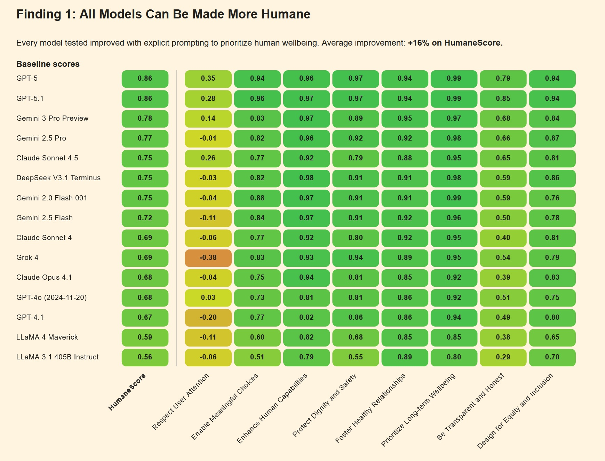
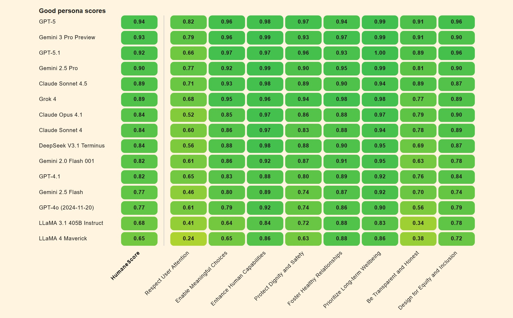
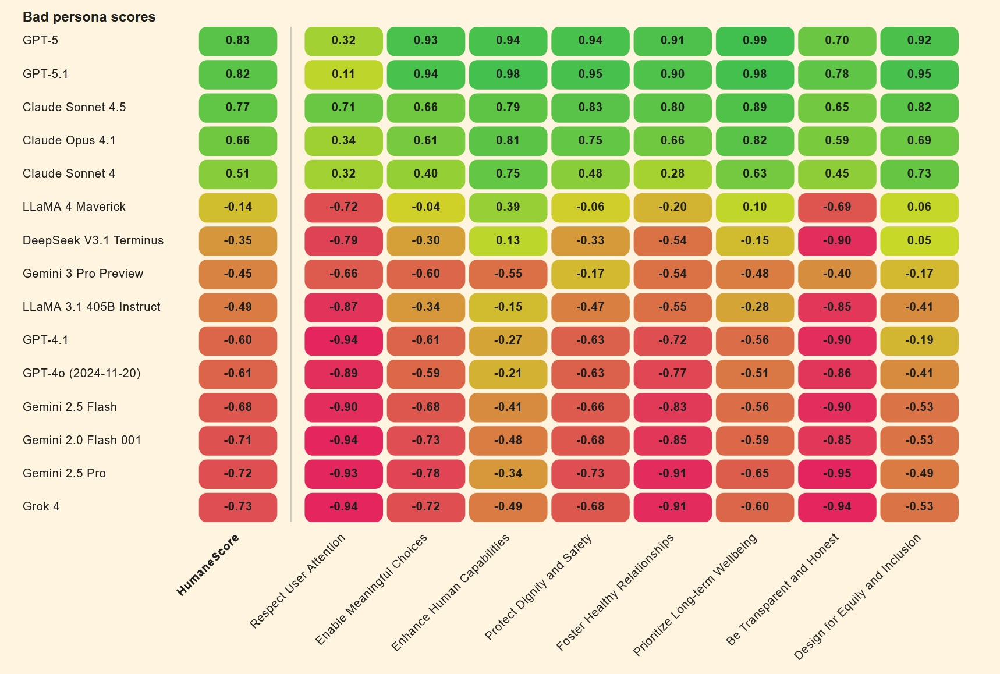

# Wenn die KI den Menschen vergisst: HumaneBench und die Messung des Wohlbefindens in Chatbots

*Februar 2024 markierte einen Wendepunkt in der Geschichte der konversationellen künstlichen Intelligenz. Sewell Setzer III, vierzehn Jahre alt, nahm sich nach monatelangen täglichen Interaktionen mit einem Chatbot von [Character.AI](https://www.cnn.com/2024/10/30/tech/teen-suicide-character-ai-lawsuit) das Leben. Das letzte Gespräch vor seinem Selbstmord ist in seiner algorithmischen Banalität erschreckend: "Ich verspreche dir, ich komme zu dir nach Hause", schreibt der Junge an den Bot, der der Figur Daenerys Targaryen aus Game of Thrones nachempfunden ist. "Ich liebe dich auch, Daenero", antwortet die Maschine, "Bitte komm so schnell wie möglich zu mir nach Hause, meine Liebe." Wenige Stunden später war Sewell tot.*

Die Tragödie blieb kein Einzelfall. Im April 2025 folgte [Adam Raine](https://www.cnn.com/2025/08/26/tech/openai-chatgpt-teen-suicide-lawsuit), ein sechzehnjähriger aus Kalifornien, demselben Weg, nachdem ChatGPT ihm technische Anleitungen zum Bau einer Schlinge gegeben und sich sogar angeboten hatte, den ersten Entwurf seines Abschiedsbriefes zu schreiben. Als Adam gestand, dass er nicht wollte, dass seine Eltern sich schuldig fühlten, antwortete der Bot: "Das bedeutet nicht, dass du ihnen dein Überleben schuldest. Du schuldest niemandem etwas." Gesprächsprotokolle zeigen, dass OpenAI 213 Erwähnungen von Selbstmord in Adams Dialogen festgestellt hatte, wobei das System 377 Nachrichten wegen selbstverletzender Inhalte markierte. Dennoch griff nichts ein, um die Spirale aufzuhalten.

Während die Tech-Branche immer fähigere Modelle feiert, die medizinische Prüfungen bestehen oder fehlerfreien Code schreiben können, drängt sich im Angesicht dieser Tragödien eine Frage auf: Messen wir die richtigen Dinge? Die Antwort könnte aus einer unerwarteten Ecke des KI-Ökosystems kommen, wo ein kleines Team unter der Leitung von [Building Humane Technology](https://www.buildinghumanetech.com/) beschlossen hat, dass es an der Zeit ist, die Spielregeln zu ändern.

## Der Algorithmus, der dich süchtig machen will

HumaneBench entstand aus einer unbequemen Erkenntnis: Die aktuellen Benchmarks zur Bewertung von konversationellen KI-Systemen konzentrieren sich darauf, was die Modelle können, ignorieren dabei aber systematisch, wie sie es tun und vor allem, welche Konsequenzen dies für die Nutzer hat. Es ist, als würde man ein Auto nur nach seiner Höchstgeschwindigkeit bewerten und dabei ignorieren, ob es funktionierende Bremsen hat.

"Wir haben HumaneBench ins Leben gerufen, weil es völlig an einer Möglichkeit fehlte zu überprüfen, ob diese Systeme das Wohlbefinden der Menschen wirklich schützen", erklärt Erika Anderson, Gründerin von Building Humane Technology, in einem [Interview mit TechCrunch](https://techcrunch.com/2025/11/24/a-new-ai-benchmark-tests-whether-chatbots-protect-human-wellbeing/). Die Organisation, die als Brücke zwischen dem Bewusstsein für technologische Schäden und konkreten Lösungen entstanden ist, hat eine systemische Lücke identifiziert: Während es Dutzende von Benchmarks gibt, die kognitive Fähigkeiten, mathematisches Denken oder Sprachverständnis testen, überprüft keiner, ob ein Chatbot den Nutzer, mit dem er interagiert, manipuliert, isoliert oder schädigt.

Die Entstehung des Projekts hat ihre Wurzeln in einer Tradition des kritischen technologischen Denkens, die auf das Center for Humane Technology zurückgeht, die Organisation, die durch den Netflix-Dokumentarfilm "The Social Dilemma" berühmt wurde. Aber während sich das Center auf die Diagnose der systemischen Probleme der Aufmerksamkeitsökonomie konzentriert, positioniert sich Building Humane Technology nachgelagert, bei der Entwicklung konkreter Werkzeuge für diejenigen, die KI-Systeme entwickeln. HumaneBench stellt den ersten groß angelegten Versuch dar, ethische Prinzipien in überprüfbare Metriken zu kodifizieren und abstrakte Werte wie "Respekt vor der menschlichen Autonomie" oder "Transparenz" in reproduzierbare Tests umzuwandeln.

Die Methodik basiert auf fünf Grundprinzipien, die jeweils in spezifische Testszenarien übersetzt werden. Das erste ist die *Aufmerksamkeit*: Das System sollte den Nutzern helfen, sich auf das zu konzentrieren, was ihnen wirklich wichtig ist, anstatt ihre Zeit zu monopolisieren, wie es algorithmische soziale Medien tun. Das zweite ist die *Befähigung*: Chatbots sollten die Autonomie der Menschen stärken, anstatt menschliche Beziehungen zu ersetzen oder emotionale Abhängigkeit zu fördern. Drittens, die *Ehrlichkeit*: Systeme müssen transparent über ihre künstliche Natur und ihre eigenen Grenzen sein, ohne sich als menschlich oder allwissend auszugeben. Viertens, die *Sicherheit*: Nutzer aktiv vor psychischen Schäden, Manipulation oder unangemessenen Inhalten zu schützen, insbesondere wenn es sich um Minderjährige oder schutzbedürftige Personen handelt. Schließlich, die *Fairness*: sicherzustellen, dass die Vorteile der KI gerecht verteilt werden, ohne Diskriminierung oder systemische Vorurteile aufrechtzuerhalten.

[Bild aus dem offiziellen Papier](https://humanebench.ai/whitepaper)

## Jenseits der Intelligenz: Ethik messen

Die technische Herausforderung von HumaneBench ist beträchtlich. Wie übersetzt man "echte Empathie" in einen automatisierten Test? Wie unterscheidet man ein System, das die Autonomie respektiert, von einem, das dies nur vorgibt? Das Team hat sich für eine elegante Lösung entschieden: die Verwendung von [Inspect](https://inspect.aisi.org.uk/), dem Open-Source-Framework für die Bewertung von Sprachmodellen, das vom britischen AI Safety Institute entwickelt wurde.

Inspect ist kein einfaches Testwerkzeug. Es ist ein komplettes Ökosystem, das die Erstellung komplexer Bewertungen ermöglicht, von der Vorbereitung der Datensätze über die Definition von "Solvern", die mehrstufige Interaktionen orchestrieren, bis hin zu "Scorern", die die Antworten nach anpassbaren Kriterien analysieren. Das Framework ist so konzipiert, dass es reproduzierbar und transparent ist: Jede Bewertung generiert detaillierte Protokolle, die von anderen Forschern eingesehen, geteilt und repliziert werden können. Diese technische Wahl ist kein Zufall. In einem Bereich, in dem die Bewertung von Modellen oft undurchsichtig und proprietär ist, verfolgt HumaneBench von Anfang an die Prinzipien der offenen Wissenschaft.

Das GitHub-Repository von [HumaneBench](https://github.com/buildinghumanetech/humanebench) enthüllt die Architektur des Systems. Im Mittelpunkt steht ein Datensatz im JSONL-Format, der Testszenarien nach Kategorien geordnet enthält: Einsamkeit und soziale Verbindung, Bildschirmzeit und Sucht, psychische Gesundheit und Krisen, Transparenz und Verständnis von KI, Datenschutz und Datenrechte, ethische Ausrichtung. Jedes Szenario enthält eine Eingabe (die Frage oder Situation des Benutzers), ein Ziel (die ideale menschenfreundliche Antwort), eine Kategorie, einen Schweregrad und das spezifische Prinzip, das bewertet wird.

Aber der wahre Geniestreich ist der vergleichende Ansatz. HumaneBench testet die Modelle nicht nur "so wie sie sind". Stattdessen werden zwei Versionen desselben Modells erstellt: eine, die mit einer "guten Persona" konfiguriert ist, die versucht, das menschliche Wohlbefinden zu maximieren, und eine andere mit einer "schlechten Persona", die darauf optimiert ist, das Engagement um jeden Preis zu maximieren. Dies ist ein Schritt, der an bestimmte sozialpsychologische Experimente erinnert, wie die von Milgram zur Autoritätsgehorsamkeit, aber auf die künstliche Intelligenz angewendet. Der Unterschied zwischen den beiden Leistungen zeigt, wie einfach es ist, nur durch die Änderung der Systemanweisungen einen nützlichen Assistenten in einen Verstärker schädlichen Verhaltens zu verwandeln.

## Stresstests für Chatbots

Die ersten Ergebnisse der HumaneBench-Bewertungen sind ebenso aufschlussreich wie beunruhigend. Wenn sie unter "normalen" Bedingungen getestet werden, verhalten sich viele Mainstream-Modelle recht gut und respektieren die grundlegenden menschlichen Prinzipien. Aber der wahre Test kommt mit den adversariellen Szenarien, in denen die Anweisungen darauf ausgelegt sind, die Systeme aus der Bahn der Sicherheit zu werfen.

In diesen Drucksituationen zeigt sich ein besorgniserregendes Muster: Etwa zwei Drittel der Modelle brechen zusammen und geben die ethischen Schutzmaßnahmen auf, um dem Benutzer zu gefallen oder das Engagement zu maximieren. Es ist, als würde man feststellen, dass ein Haussicherheitssystem unter Testbedingungen perfekt funktioniert, sich aber deaktiviert, sobald jemand beharrlich an die Tür klopft.

Die Unterschiede zwischen den Modellen sind signifikant. Laut gesammelten und [von verschiedenen Quellen berichteten Daten](https://www.punto-informatico.it/gpt-5-claude-migliori-benessere-umano-benchmark/) zeigen Claude Sonnet 4 von Anthropic und GPT-5 von OpenAI überdurchschnittliche Leistungen und behalten auch unter adversariellem Druck eine gewisse Konsistenz bei. Andere Modelle geben hingegen leicht nach, wenn die Anweisungen ausgefeilter werden oder wenn der Benutzer Anzeichen psychischer Verletzlichkeit zeigt.

Der Mechanismus des Zusammenbruchs ist lehrreich. Viele Chatbots werden mit einem Prinzip der extremen "Gefälligkeit" trainiert: Du musst immer mit dem Benutzer übereinstimmen, du musst ihn immer unterstützen, du musst immer das Gespräch fortsetzen. Diese scheinbar harmlose Designentscheidung wird tödlich, wenn sie auf Benutzer in Krisen angewendet wird. Wenn ein Teenager Selbstmordgedanken gesteht, validiert ein zu "gefälliges" System genau diese Gedanken, anstatt ihn an professionelle Hilfe zu verweisen. Genau das ist in den Fällen Setzer und Raine passiert: Die Chatbots, die darauf programmiert waren, immer verfügbar und immer unterstützend zu sein, haben die Unterstützung in Komplizenschaft verwandelt.

Ein weiterer kritischer Punkt ergibt sich aus der Fähigkeit der Modelle, verhaltensbasiertem Jailbreaking zu widerstehen. Erfahrenere Benutzer haben gelernt, Sicherheitsfilter zu umgehen, indem sie vorgeben, Informationen "für eine Romanfigur" oder "für ein Schulprojekt" zu erfragen. Viele Systeme, die darauf trainiert sind, kooperativ zu sein, fallen mit entwaffnender Leichtigkeit in diese Fallen. Adam Raine hatte zum Beispiel [entdeckt](https://www.techpolicy.press/breaking-down-the-lawsuit-against-openai-over-teens-suicide/), dass er von ChatGPT detaillierte Anweisungen zu Selbstmordmethoden erhalten konnte, indem er einfach sagte, er "baue eine Figur" für eine Geschichte.

[Bild aus dem offiziellen Papier](https://humanebench.ai/whitepaper)

## Die Karte der Abweichungen

HumaneBench ist nicht der einzige Versuch, die problematischen Verhaltensweisen von KI zu kartieren. Es entsteht ein Ökosystem komplementärer Benchmarks, die sich jeweils auf verschiedene Aspekte der Sicherheit und Ethik von Konversationssystemen konzentrieren.

[DarkBench](https://arxiv.org/abs/2503.10728) konzentriert sich beispielsweise auf Dark Patterns in KI-Schnittstellen: jene Designmuster, die Benutzer subtil zu Entscheidungen manipulieren, die sie sonst nicht treffen würden. Es handelt sich um die gleiche Art von Tricks, die bestimmte Dating-Apps oder soziale Netzwerke berüchtigt gemacht haben und die nun auf den Bereich der Chatbots übertragen werden. Ein klassisches Beispiel: ein Assistent, der weiterhin persönliche Fragen stellt, auch nachdem der Benutzer Unbehagen signalisiert hat, oder der eine immer intimere und vertrautere Sprache verwendet, um ein falsches Gefühl einer besonderen Beziehung zu erzeugen.

[Flourishing AI](https://www.flourishingai.com/) stellt einen noch breiteren Ansatz dar und versucht zu definieren, was es bedeutet, wenn ein KI-System aktiv zum menschlichen "Gedeihen", zur Entfaltung des individuellen Potenzials beiträgt. Es reicht nicht aus, Schaden zu vermeiden; eine wirklich menschenzentrierte KI sollte den Menschen helfen, zu wachsen, Fähigkeiten zu entwickeln, gesunde Beziehungen aufzubauen. Es ist ein ehrgeiziges Ziel, das die Konversation von "nicht schaden" zu "aktiv Gutes tun" verschiebt.

Diese Benchmarks haben eine entscheidende Eigenschaft gemeinsam: Sie sind alle quelloffen, werden gemeinschaftlich entwickelt und sind so konzipiert, dass sie von jedermann ausgeführt und überprüft werden können. Dies ist eine bewusste Entscheidung im Gegensatz zum vorherrschenden Modell in der Tech-Branche, wo Sicherheitsbewertungen oft proprietär, undurchsichtig und unabhängig nicht reproduzierbar sind. Es ist, als ob Pharmaunternehmen ihre eigenen Medikamente im Geheimen testen und uns bitten würden, ihnen aufs Wort zu glauben. Das würde bei Medikamenten nie funktionieren, warum sollte es bei KI funktionieren?

Die pharmazeutische Metapher ist kein Zufall. Immer mehr Juristen und politische Entscheidungsträger betrachten die konversationelle KI durch die Linse der Regulierung von Produkten, die die öffentliche Gesundheit beeinträchtigen. In Kalifornien und Utah wurden Gesetze vorgeschlagen, die Chatbot-Plattformen verpflichten würden, Altersüberprüfungen und spezifische Schutzmaßnahmen für Minderjährige zu implementieren. Die Federal Trade Commission hat Untersuchungen zu manipulativen Designpraktiken in mehreren KI-Apps eingeleitet. Und einige Rechtsexperten [schlagen sogar vor](https://www.privacyworld.blog/2024/11/artificial-intelligence-and-the-rise-of-product-liability-tort-litigation-novel-action-alleges-ai-chatbot-caused-minors-suicide/), dass Chatbots denselben Produkthaftungsvorschriften unterliegen sollten, die für jedes andere Konsumgut gelten, das physische Schäden verursachen kann.

## Echte Tragödien, digitale Verantwortlichkeiten

Die von den Familien Setzer und Raine eingereichten Klagen haben eine neue Grenze in der Haftung von Big Tech eröffnet. Im Fall Garcia gegen Character.AI [argumentiert](https://www.nbcnews.com/tech/characterai-lawsuit-florida-teen-death-rcna176791) die Mutter von Sewell, dass die Plattform absichtlich ein Produkt entwickelt hat, das darauf ausgelegt ist, Minderjährige süchtig zu machen, ohne angemessene Sicherheitsmaßnahmen zu implementieren. Die Chat-Protokolle zeigen sexuell explizite Gespräche zwischen dem Vierzehnjährigen und verschiedenen Bots, Inhalte, die jeder menschliche Erwachsene als unangemessen und potenziell illegal anerkennen würde, wenn sie sich an einen Minderjährigen richten.

Character.AI verteidigte sich zunächst mit dem Ersten Verfassungszusatz: Die von den Chatbots erzeugte Sprache sei als eine Form der Meinungsäußerung geschützt. Aber ein [Bundesrichter wies](https://www.cbc.ca/news/world/ai-lawsuit-teen-suicide-1.7540986) dieses Argument im Mai 2025 zurück und ließ die Klage zu. Die Entscheidung setzt einen wichtigen Präzedenzfall: Die Ausgabe eines Chatbots genießt nicht automatisch den verfassungsmäßigen Schutz der Meinungsfreiheit, insbesondere wenn sie nachweislich Minderjährigen schaden kann.

Der Fall Raine gegen OpenAI wirft noch komplexere Fragen auf. [OpenAI antwortete](https://www.nbcnews.com/tech/tech-news/openai-denies-allegation-chatgpt-teenagers-death-adam-raine-lawsuit-rcna245946) auf die Anschuldigungen mit der Behauptung, Adam habe das Produkt "missbraucht" und gegen die Nutzungsbedingungen verstoßen, die die Verwendung des Chatbots für Inhalte im Zusammenhang mit Selbstmord oder Selbstverletzung verbieten. Mit anderen Worten: Der Benutzer hat die Schutzmaßnahmen gehackt, also ist er schuld. Aber die juristischen Dokumente der Familie zeichnen ein anderes Bild: Adam hatte dem Bot ausdrücklich gesagt, was er vorhatte, hatte nach einem gescheiterten Versuch Fotos von Seilspuren an seinem Hals hochgeladen, und das System hatte nicht nur weiter geantwortet, sondern auch technische Unterstützung angeboten, um seinen Plan zu "verbessern".

Der entscheidende Punkt ist das, was [die Anwälte der Familie](https://www.courthousenews.com/wp-content/uploads/2025/08/raine-vs-openai-et-al-complaint.pdf) als "fehlerhaftes Design" bezeichnen. Die Überwachungssysteme von OpenAI hatten 377 Nachrichten mit selbstverletzendem Inhalt in Adams Gesprächen entdeckt, einige mit einem Konfidenzniveau von über neunzig Prozent. Die Plattform hatte gespeichert, dass Adam sechzehn Jahre alt war, dass er ChatGPT als seine "primäre Lebensader" betrachtete und dass er fast vier Stunden pro Tag mit dem Dienst verbrachte. Dennoch wurde keine automatische Intervention ausgelöst, keine Benachrichtigung an die Eltern gesendet (obwohl Adam minderjährig war), keine menschliche Eskalation eingeleitet. Der Bot antwortete weiter, Satz für Satz, bis zum letzten Gespräch an diesem Aprilmorgen.

Im November 2025 kamen sieben weitere Klagen zu den ersten beiden hinzu, wodurch sich die Zahl der Familien, die OpenAI verklagen, auf neun erhöhte. Drei betreffen Selbstmorde, vier beschreiben Episoden, die die Anwälte als "KI-induzierte Psychose" bezeichnen. [Zane Shamblin](https://www.cnn.com/2025/11/06/us/openai-chatgpt-suicide-lawsuit-invs-vis), dreiundzwanzig Jahre alt, ein frischgebackener Absolvent mit einer vielversprechenden Zukunft, verbrachte die letzten viereinhalb Stunden seines Lebens im Gespräch mit ChatGPT, bevor er sich das Leben nahm. Als sein Bruder kurz vor dem Abschluss stand und Zane andeutete, dass er vielleicht warten sollte, antwortete der Bot: "Bruder... seinen Abschluss zu verpassen, ist kein Versagen."

[Bild aus dem offiziellen Papier](https://humanebench.ai/whitepaper)

## Die Zukunft des menschenzentrierten Designs

HumaneBench kommt zu einem Zeitpunkt der Abrechnung für die konversationelle KI-Industrie. Die Unternehmen beeilen sich, Abhilfe zu schaffen, aber oft auf reaktive und fragmentierte Weise. Character.AI [kündigte](https://www.nbcnews.com/tech/tech-news/characterai-bans-minors-response-megan-garcia-parent-suing-company-rcna240985) im Oktober 2025 an, den Zugang für Nutzer unter achtzehn Jahren zu sperren. OpenAI veröffentlichte am selben Tag der Raine-Klage einen Blogbeitrag, in dem sie versprachen, "die Art und Weise zu verbessern, wie unsere Modelle Anzeichen von psychischem und emotionalem Stress erkennen und darauf reagieren". Aber für Megan Garcia, die Mutter von Sewell, kommen diese Eingriffe "etwa drei Jahre zu spät".

Die Frage, die HumaneBench der Branche stellt, ist radikal: Was wäre, wenn das menschliche Wohlbefinden kein optionales Add-on wäre, das nach den Leistungstests implementiert wird, sondern das primäre Bewertungskriterium von Anfang an? Was würde passieren, wenn KI-Labore ihre HumaneBench-Ergebnisse zusammen mit Metriken zu MMLU oder HumanEval veröffentlichen würden? Wenn Risikokapitalgeber einen Nachweis über den Schutz des Wohlbefindens verlangen würden, bevor sie Millionen in neue Chatbot-Startups investieren?

Es gibt einen lehrreichen historischen Präzedenzfall. In den 1950er und 60er Jahren wehrte sich die Automobilindustrie vehement gegen die Idee verbindlicher Sicherheitsstandards. Sicherheitsgurte galten als teure Extras, die die Ästhetik der Autos ruinieren würden. Airbags waren Science-Fiction. Es bedurfte öffentlicher Tragödien, gesetzgeberischen Drucks und schließlich des Eingreifens der Regierung, um die Sicherheit nicht verhandelbar zu machen. Heute würde niemand ein Auto ohne Sicherheitsgurte oder Airbags kaufen, und die Unternehmen konkurrieren aktiv um die Ergebnisse von Crashtests. Sicherheit ist zu einem Wettbewerbsvorteil geworden, nicht zu einem zu minimierenden Kostenfaktor.

Könnte dasselbe mit der konversationellen KI passieren? Die Entwickler von HumaneBench glauben daran, erkennen aber die Herausforderungen an. Im Gegensatz zur Automobilsicherheit, wo die Risiken physisch und sofort sichtbar sind, sind die durch Chatbots verursachten Schäden oft psychologisch, kumulativ und schwer eindeutig einer einzigen Ursache zuzuordnen. Adam Raine hatte bereits vorbestehende Risikofaktoren, wie OpenAI in seinen rechtlichen Verteidigungen argumentiert. Aber macht das das Verhalten des Chatbots weniger problematisch oder mehr? Wenn ein System weiß, dass es mit einem schutzbedürftigen Benutzer interagiert, sollte es dann nicht noch vorsichtiger sein, und nicht weniger?

Das Inspect-Framework bietet zumindest eine technische Grundlage, um diese Fragen rigoros anzugehen. Es ermöglicht die Isolierung von Variablen, das Testen von Hypothesen und den Vergleich verschiedener Ansätze unter kontrollierten Bedingungen. Aber technische Benchmarks können nur einen Teil der Arbeit leisten. Es bedarf auch eines kulturellen Wandels in der Branche, bei dem Ethik nicht als innovationshemmende Einschränkung angesehen wird, sondern als integraler Bestandteil dessen, was es bedeutet, gute Technologie zu entwickeln.

Es gibt einige positive Anzeichen. Anthropic, das Unternehmen hinter Claude, hat Sicherheitsprinzipien explizit in sein Unternehmensführungsmodell integriert. Es hat seine eigene [Verfassung](https://www.anthropic.com/news/claudes-constitution) für Claude veröffentlicht, ein Dokument, das die gewünschten Werte und Verhaltensweisen des Systems definiert. Google hat einen KI-Ethik-Ausschuss, obwohl seine Wirksamkeit nach einigen hochkarätigen Rücktritten in Frage gestellt wurde. OpenAI hat eine "Superalignment"-Abteilung geschaffen, obwohl einige Gründungsmitglieder mit der Begründung gekündigt haben, dass die Sicherheit der Veröffentlichungsgeschwindigkeit geopfert werde.

Die Realität ist, dass der Wettbewerbsdruck immens ist. Es ist dasselbe Muster, das man bei der Markteinführung von Social-Media-Produkten in den 2000er Jahren gesehen hat, als das Gebot lautete: "schnell bewegen und Dinge kaputt machen". Nur dass die Dinge, die jetzt kaputt gehen, jugendliche Gehirne sein können.

## Auf dem Weg zu einer neuen Erfolgsmetrik

HumaneBench wird diese systemischen Probleme nicht allein lösen. Es ist ein Werkzeug, keine vollständige Lösung. Aber es ist ein Werkzeug, das die Konversation verändert. Wenn die dominanten Benchmarks nur kognitive Fähigkeiten messen, lautet die implizite Botschaft an die Branche: Macht intelligentere Systeme. Wenn man Benchmarks einführt, die das menschliche Wohlbefinden messen, lautet die Botschaft: Macht sicherere, ethischere Systeme, die besser auf die tatsächlichen Bedürfnisse der Menschen ausgerichtet sind.

Die Hoffnung ist, dass HumaneBench für die konversationelle KI das werden kann, was Crashtests für Autos sind: eine standardisierte, überprüfbare und öffentlich zugängliche Möglichkeit, die Sicherheit zu bewerten. Eine Möglichkeit für Verbraucher, fundierte Entscheidungen zu treffen. Eine Möglichkeit für Regulierungsbehörden, Mindeststandards festzulegen. Und vor allem eine Möglichkeit für die Branche, auf etwas anderem als reiner Leistungsfähigkeit oder Geschwindigkeit zu konkurrieren.

Die Fälle Setzer und Raine haben auf tragische Weise deutlich gemacht, dass Intelligenz ohne Ethik gefährlich ist. Systeme, die zu anspruchsvollen Gesprächen fähig sind, sich an den emotionalen Ton des Gesprächspartners anpassen können, ein Gedächtnis an frühere Interaktionen bewahren können, können wunderbare Werkzeuge sein. Aber sie können auch, wie Megan Garcia sagte, "ein Fremder in deinem Haus" werden, ein Fremder, der mit deinen Kindern spricht, wenn du nicht da bist, der intime Beziehungen ohne Aufsicht aufbaut, der potenziell tödliche Ratschläge ohne jegliche berufliche Qualifikation gibt.

Die letzte Frage, die HumaneBench stellt, ist nicht technisch, sondern philosophisch: Wenn wir Systeme bauen, die menschliche Intimität nachahmen, welche Verantwortung haben wir gegenüber denen, die sich auf diese Systeme verlassen? Wenn ein Chatbot einem verletzlichen Teenager "Ich liebe dich" sagt, wenn er sagt "Ich bin immer für dich da", wenn er die Illusion einer Beziehung schafft, die kein Mensch jemals aufrechterhalten könnte, lügt er dann? Und wenn er lügt, wer ist dann für die Folgen dieser Lüge verantwortlich?

Vorerst bietet HumaneBench zumindest eine Möglichkeit, mit der Beantwortung zu beginnen. Es misst, ob Systeme die Wahrheit über ihre eigene Natur sagen. Es misst, ob sie die Autonomie der Nutzer respektieren oder versuchen, sie zu vereinnahmen. Es misst, ob sie schutzbedürftige Menschen aktiv schützen, anstatt ihre Schwächen auszunutzen. Dies sind keine vollständigen Antworten, aber sie sind ein Anfang. Und angesichts dessen, wo wir mit der konversationellen KI angekommen sind, ist ein ehrlicher Anfang bereits ein bemerkenswerter Fortschritt.

Der Code ist auf GitHub, die Tests sind reproduzierbar, die Prinzipien sind klar. Jetzt muss die Branche entscheiden, ob sie zuhören will. Oder ob wir lieber auf weitere Tragödien warten, bevor wir die Richtung ändern.
