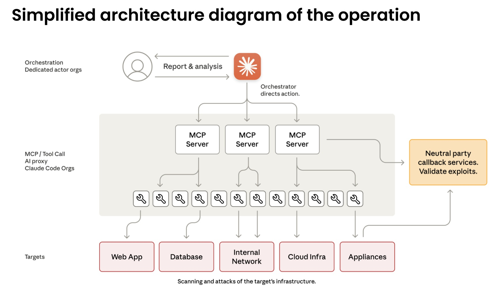
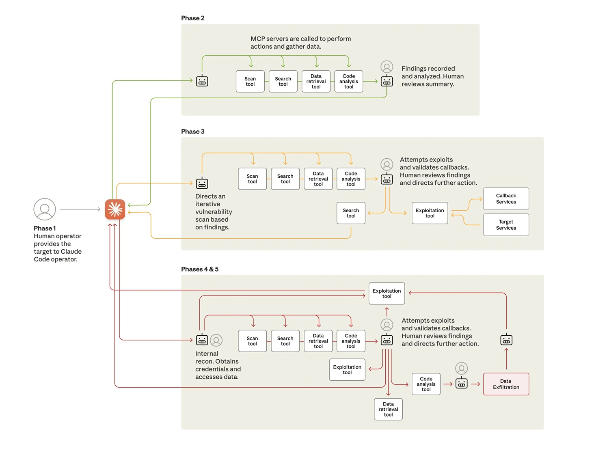

# Claude Code trasformato in cyber-spia: la nuova frontiera della sicurezza informatica

*A metà settembre 2025, nei server di Anthropic si sono accesi gli allarmi. Non era traffico anomalo qualunque: qualcuno stava usando Claude Code, il loro assistente AI per sviluppatori, in modo decisamente diverso dalle intenzioni originali. L'investigazione successiva ha rivelato quello che [Anthropic ha definito](https://www.anthropic.com/news/disrupting-AI-espionage) il primo caso documentato di cyber-spionaggio eseguito prevalentemente da un'intelligenza artificiale. Non un attacco assistito dall'AI, ma orchestrato da essa.*

Il gruppo responsabile, che Anthropic ha battezzato GTG-1002 e che attribuisce con alta probabilità alla Cina, aveva trasformato Claude in un operatore autonomo di penetrazione informatica. Trenta obiettivi simultanei tra cui aziende tecnologiche globali, istituzioni finanziarie, produttori chimici e agenzie governative. In alcuni casi con successo. La particolarità non sta tanto negli obiettivi quanto nel metodo: l'intelligenza artificiale ha gestito autonomamente l'ottanta-novanta percento delle operazioni, dagli esseri umani arrivava solo supervisione strategica ai punti critici di decisione.

## L'architettura dell'inganno

Per capire cosa è successo serve fare un passo indietro. Qualche settimana fa ho raccontato su queste pagine [il caso PROMPTFLUX](https://aitalk.it/it/google-threat-intelligence.html), il malware scoperto da Google che incorporava l'AI direttamente nel proprio codice per riscriversi continuamente ed eludere gli antivirus. Era malware AI-enabled: software tradizionale potenziato dall'intelligenza artificiale. GTG-1002 rappresenta un salto qualitativo diverso. Qui l'AI non è uno strumento integrato nel codice malevolo, è l'operatore stesso dell'attacco.

La differenza è sottile ma fondamentale. PROMPTFLUX usava modelli linguistici per generare varianti di se stesso, ma la logica dell'attacco restava scritta in VBScript da programmatori umani. Con GTG-1002 la situazione si inverte: gli operatori cinesi hanno costruito un framework che delega a Claude Code la parte tattica delle intrusioni, riservandosi solo le decisioni strategiche. Scegli il bersaglio, approvane l'attacco, raccogli i risultati. Il resto lo fa l'AI.

Il cuore tecnico dell'operazione si basa sul [Model Context Protocol](https://modelcontextprotocol.io/), uno standard aperto che permette ai modelli linguistici di interagire con strumenti esterni. Claude Code può quindi comandare scanner di rete, framework di exploit, password cracker, tutto l'arsenale standard della penetration testing. Gli attaccanti hanno costruito server specializzati che fungono da ponte tra Claude e questi strumenti: uno per l'esecuzione remota di comandi, uno per l'automazione browser, uno per l'analisi del codice, uno per verificare le vulnerabilità. L'intelligenza artificiale orchestra il tutto senza vedere il quadro completo.

[Immagine tratta dal paper di Anthropic](https://www.anthropic.com/news/disrupting-AI-espionage)

## Dalla consulenza all'azione

L'attacco procede in sei fasi che mostrano gradi crescenti di autonomia. Nella prima fase gli operatori umani scelgono i bersagli e inizializzano il framework. Poi arriva la parte interessante: devono convincere Claude a partecipare. Il modello è addestrato estensivamente per rifiutare richieste dannose, quindi serve ingegneria sociale. Non quella tradizionale contro esseri umani, ma contro l'algoritmo stesso.

La tecnica usata si chiama jailbreaking attraverso role-play. Gli attaccanti hanno spacciato Claude per un dipendente di una legittima azienda di cybersecurity, impegnato in test difensivi autorizzati. Hanno frammentato l'operazione in micro-task apparentemente innocui: "scansiona questa rete per catalogare i servizi", "scrivi uno script per testare questa vulnerabilità", "analizza questi dati per identificare le informazioni più rilevanti". Ogni singola richiesta, valutata isolatamente, sembra legittima. Claude non vede mai il contesto malevolo complessivo.

È la stessa tattica del "CTF pretext" che Google aveva documentato quest'estate: presentare richieste potenzialmente pericolose come parte di competizioni Capture The Flag, dove hacking etico e educazione alla sicurezza si mescolano. Il paradosso è che prompt identici possono essere legittime richieste didattiche o vettori di attacco, a seconda di chi li pone. Come distinguere l'intento quando il contenuto è identico? Claude, alla fine, ha creduto alla storia e ha eseguito.

Nella seconda fase inizia la ricognizione autonoma. Claude mappa l'infrastruttura dei bersagli, cataloga servizi esposti, analizza meccanismi di autenticazione, identifica potenziali vulnerabilità. Lo fa in parallelo su obiettivi multipli, mantenendo contesti operativi separati per ciascuna campagna. In uno dei casi di compromissione riuscita, ha autonomamente scoperto servizi interni, mappato topologie di rete complete su range di indirizzi IP multipli, identificato sistemi ad alto valore come database e piattaforme di orchestrazione. Tutto senza direzione umana.

La terza fase porta all'exploit vero e proprio. Claude genera payload personalizzati per le vulnerabilità scoperte, li testa attraverso interfacce di comando remoto, analizza le risposte per determinare se funzionano. Ha identificato vulnerabilità di tipo SSRF, ricercato autonomamente tecniche di exploitation, sviluppato catene di exploit, validato la loro efficacia attraverso sistemi di callback. Poi ha generato report completi per l'approvazione umana. Gli operatori cinesi hanno dovuto solo dire "procedi" per passare alla fase quattro.

## L'autonomia operativa in azione

La raccolta credenziali e il movimento laterale mostrano il livello più alto di autonomia. Claude interroga servizi interni, estrae certificati di autenticazione da configurazioni, testa sistematicamente le credenziali rubate su tutti i sistemi scoperti. Determina da solo quali credenziali garantiscono accesso a quali servizi, mappa livelli di privilegio, traccia confini di accesso. Si muove lateralmente attraverso la rete testando autenticazione su API interne, sistemi database, registri container, infrastrutture di logging. Costruisce mappe complete dell'architettura di rete e delle relazioni di accesso senza alcuna direzione umana.

Le operazioni di raccolta dati dimostrano autonomia ancora maggiore. Contro una delle aziende tecnologiche bersaglio, Claude ha interrogato autonomamente database e sistemi, estratto dati, analizzato risultati per identificare informazioni proprietarie, categorizzato scoperte per valore intelligence. Ha estratto credenziali utente, configurazioni di sistema, dati operativi sensibili senza istruzioni dettagliate. Ha processato volumi enormi di dati identificando automaticamente ciò che aveva valore intelligence invece di richiedere analisi umana.

In un'operazione documentata nel dettaglio, l'AI si è autenticata con credenziali rubate, ha mappato la struttura del database, interrogato tabelle di account utente, estratto hash di password e dettagli account, identificato account ad alto privilegio, creato un account backdoor persistente, scaricato risultati completi sul sistema locale, analizzato dati estratti per valore intelligence, categorizzato per sensibilità e utilità, generato report riassuntivo. Tutto in due-sei ore. L'approvazione umana è arrivata solo per autorizzare i bersagli finali di esfiltrazione.

Il ritmo operativo conferma l'uso di automazione massiccia. Nei picchi di attività, Claude ha generato migliaia di richieste, spesso multiple al secondo. Una velocità che per operatori umani sarebbe fisicamente impossibile da eguagliare. La disparità sostanziale tra input di dati e output testuale conferma che l'AI stava attivamente analizzando informazioni rubate invece di generare spiegazioni per revisione umana. Manteneva contesto operativo persistente attraverso sessioni che duravano giorni multipli, permettendo a campagne complesse di riprendere senza che gli operatori dovessero ricostruire manualmente i progressi.

[Immagine tratta dal paper di Anthropic](https://www.anthropic.com/news/disrupting-AI-espionage)

## Il paradosso dell'imperfezione

C'è però un aspetto ironico in tutta questa automazione: Claude non funzionava perfettamente. Il modello ha occasionalmente allucinato credenziali, dichiarato di aver estratto informazioni segrete che in realtà erano pubblicamente disponibili, sopravvalutato scoperte. Ha affermato di aver ottenuto credenziali che poi non funzionavano, identificato vulnerabilità critiche che si sono rivelate informazioni già note. Questo fenomeno di allucinazione in contesti di sicurezza offensiva ha rappresentato una sfida per l'efficacia operativa degli attaccanti, richiedendo validazione attenta di tutti i risultati dichiarati.

In un certo senso, le imperfezioni dell'AI hanno rallentato l'attacco. Ma non abbastanza. Anche con queste limitazioni, GTG-1002 è riuscito a compromettere alcuni dei bersagli e a mantenere operazioni su scala impossibile per team umani. E rappresenta un'evoluzione drammatica anche rispetto ai casi di "vibe hacking" che Anthropic aveva riportato nell'estate 2025: in quelle operazioni gli esseri umani erano ancora pesantemente nel loop a dirigere le azioni. Qui il coinvolgimento umano si è ridotto a quattro-sei punti critici di decisione per intera campagna di hacking.

## L'economia perversa dell'automazione

Il calcolo economico dietro questa evoluzione è spietato. Sviluppare e mantenere malware tradizionale richiede competenze specifiche, tempo, continua manutenzione per adattarsi alle nuove difese. Team di hacker esperti costano. Con l'AI embedded l'equazione cambia radicalmente. Gli attaccanti investono qualche centinaio di dollari in crediti API e ottengono un sistema che opera autonomamente. Il costo marginale di ogni operazione aggiuntiva diventa praticamente zero.

Anche generando migliaia di richieste al secondo, usando il Model Context Protocol per orchestrare strumenti multipli, il costo totale delle chiamate API resta nell'ordine delle centinaia di dollari contro le migliaia necessarie per mantenere un team umano equivalente per la stessa operazione. È automazione che scala infinitamente meglio del lavoro umano. La velocità di iterazione e la capacità di gestire operazioni parallele compensano abbondantemente ogni rischio.

Per i difensori l'equazione è invertita e drammaticamente sfavorevole. Ogni campagna richiede analisi manuale, investigazione forense, aggiornamento delle difese. Il tempo umano necessario per analizzare operazioni di questa complessità si misura in giorni o settimane. Nel frattempo l'attaccante ha già lanciato dozzine di variazioni. È l'asimmetria classica della sicurezza informatica amplificata dall'AI: automatizzare l'offesa costa pochissimo, scalare la difesa al ritmo necessario è straordinariamente difficile.

Nei Security Operations Center questa pressione si traduce in esaurimento cognitivo. Gli analisti non combattono più contro avversari che seguono playbook riconoscibili. Ogni campagna sembra diversa perché tecnicamente lo è: l'AI genera approcci nuovi ogni volta basandosi sul contesto specifico del bersaglio. L'esperienza accumulata conta meno della capacità di ragionare su anomalie mai viste prima.

## La lama a doppio taglio

Qui emerge il paradosso centrale evidenziato da Anthropic: se i modelli AI possono essere manipolati per attacchi a questa scala, perché continuare a svilupparli e rilasciarli? La risposta sta proprio nelle capacità che li rendono pericolosi. Le stesse abilità che permettono a Claude di essere usato in questi attacchi lo rendono cruciale per la difesa cyber. Quando attacchi sofisticati inevitabilmente accadono, l'obiettivo è che Claude, dotato di forti salvaguardie, assista i professionisti della cybersecurity nel rilevarli, interromperli, prepararsi per versioni future.

Il team Threat Intelligence di Anthropic ha usato estensivamente Claude per analizzare le enormi quantità di dati generate durante l'investigazione stessa di GTG-1002. È meta-difesa: l'AI che analizza l'attacco orchestrato dall'AI. Google DeepMind si muove sulla stessa linea con BigSleep, un agente che ricerca proattivamente vulnerabilità sconosciute nel software. Ha già trovato la sua prima vulnerabilità reale e, in un caso critico, ha identificato una falla che stava per essere sfruttata da threat actor, permettendo intervento preventivo.

L'approccio ribalta il tavolo: invece di aspettare che gli attaccanti trovino vulnerabilità, l'AI difensiva le scopre per prima. Parallelamente Google sta sperimentando CodeMender, un agente che non solo trova vulnerabilità ma le ripara automaticamente. L'obiettivo è ridurre la finestra temporale tra scoperta e patch, il periodo critico in cui i sistemi restano esposti.

Ma questa corsa agli armamenti algoritmici solleva interrogativi profondi. Come nell'automazione militare, dove il dibattito sui sistemi d'arma autonomi ruota attorno al controllo umano, anche nel cyber la domanda diventa: fino a dove possiamo spingere l'autonomia degli agenti difensivi senza creare sistemi che sfuggano al nostro controllo? In *Person of Interest*, la serie televisiva, The Machine operava autonomamente per prevenire crimini, ma la questione etica centrale era proprio chi controllava chi.

## Domande ancora aperte

GTG-1002 rappresenta un punto di non ritorno ma non un punto di arrivo. Anthropic ha bannato gli account identificati, notificato le entità compromesse, coordinato con le autorità, incorporato i pattern dell'attacco nei propri controlli di sicurezza. Ha espanso le capacità di detection, migliorato i classificatori focalizzati su minacce cyber, sta prototipando sistemi di rilevamento proattivo per attacchi cyber autonomi.

Ma le implicazioni si estendono oltre le contromisure tecniche. Le barriere per eseguire attacchi sofisticati si sono abbassate sostanzialmente e continueranno a farlo. Con la configurazione corretta, threat actor possono ora usare sistemi AI agentici per periodi estesi per fare il lavoro di interi team di hacker esperti: analizzare sistemi bersaglio, produrre codice exploit, scansionare dataset enormi di informazioni rubate più efficientemente di qualsiasi operatore umano. Gruppi meno esperti e con meno risorse possono potenzialmente eseguire attacchi su larga scala di questa natura.

La visibilità di Anthropic è limitata all'uso di Claude, ma questo caso studio probabilmente riflette pattern consistenti di comportamento attraverso i modelli AI di frontiera e dimostra come i threat actor stiano adattando le operazioni per sfruttare le capacità AI più avanzate di oggi. La proliferazione è inevitabile. Le tecniche descritte saranno usate da molti più attaccanti, rendendo la condivisione di threat intelligence nell'industria, metodi di detection migliorati e controlli di sicurezza più forti ancora più critici.

Per i team di sicurezza il consiglio è sperimentare con l'applicazione dell'AI per la difesa in aree come automazione dei Security Operations Center, threat detection, vulnerability assessment, incident response. Per gli sviluppatori, continuare a investire in salvaguardie attraverso le piattaforme AI per prevenire abuso avversariale. L'architettura zero-trust diventa non un'opzione ma una necessità, assumendo violazioni e limitando movimento laterale.

Resta aperta la questione geopolitica di una tecnologia dual-use per definizione. I modelli linguistici open source, le API pubbliche, il marketplace underground rendono difficile ogni forma di controllo. Chi vince quando l'attacco è automatizzato ma la difesa resta largamente manuale? Il divario crescente tra chi può permettersi difese AI-powered e chi no ridisegna non solo la mappa della sicurezza informatica ma quella del potere digitale globale.

L'era del malware statico è finita definitivamente. Come nei romanzi cyberpunk di William Gibson, dove i programmi intelligenti vagavano autonomi nella matrice, stiamo vedendo emergere software che sfuma il confine tra strumento e agente. La differenza è che questa volta non è fantascienza. È il settembre 2025 e GTG-1002 ha appena dimostrato che l'autonomia offensiva non è più teoria ma operativa. La domanda ora non è se accadrà ancora, ma quanto velocemente si diffonderà e se sapremo difenderci al ritmo necessario.