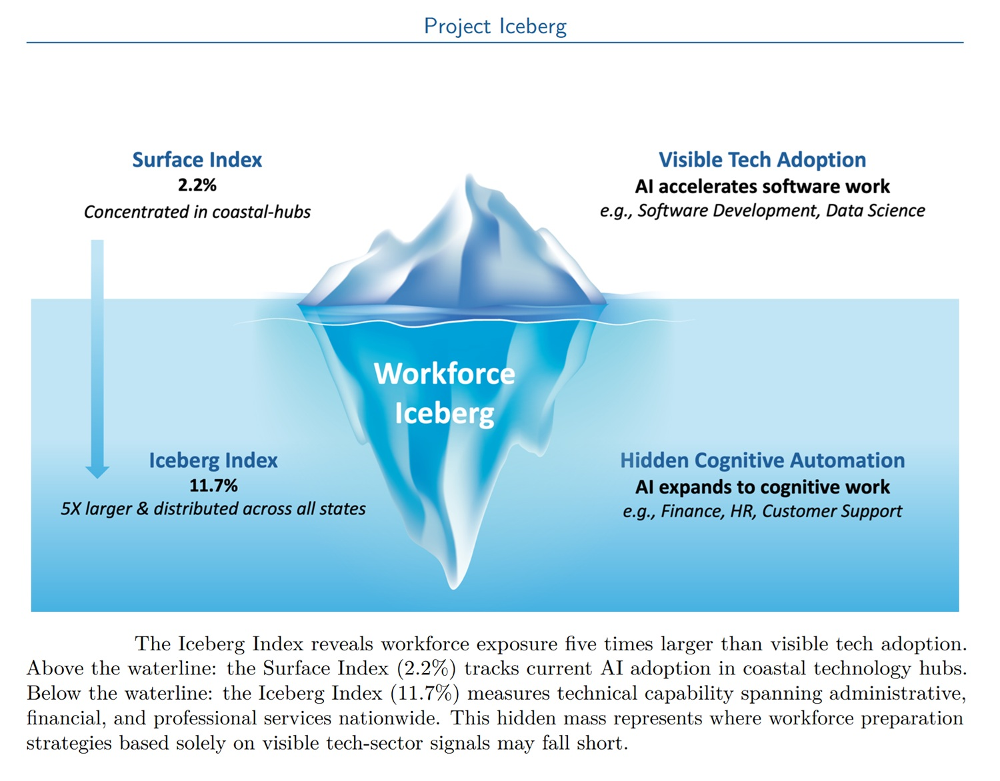
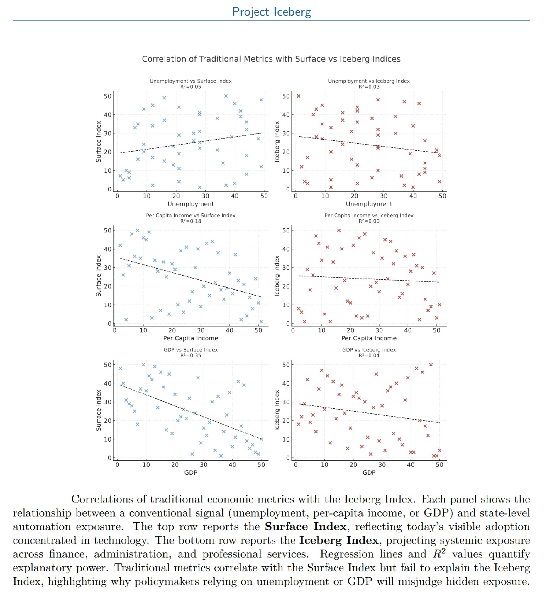

# Under the Digital Iceberg: MIT Quantifies the Impact of AI on Labor

*When the [Massachusetts Institute of Technology presented the Iceberg Index](https://arxiv.org/abs/2510.25137), the figure that dominated the headlines was that 11.7% of the American workforce is technically replaceable by artificial intelligence. Translated into monetary terms: 1.2 trillion dollars in wages. But as is often the case with complex data, the most impressive number hides a more nuanced and interesting story than the simple equation "AI equals mass unemployment."*

The real contribution of the MIT study, conducted in collaboration with the Oak Ridge National Laboratory, is not in proclaiming a jobs apocalypse but in having built the first measurement tool that captures what traditional metrics do not see. While GDP, unemployment rates, and employment statistics measure the effects after the change has occurred, the Iceberg Index captures the technical exposure before the transformation crystallizes into layoffs or reorganizations.

## The Double Measurement of the Invisible

The iceberg metaphor is not accidental. What we see today – the [layoffs in the tech sector](https://www.cbsnews.com/news/ai-artificial-intelligence-workers-mit-study/), developers replaced by code generated by language models, roles in information technology being redesigned – represents just 2.2% of the total exposure, about 211 billion dollars in wages. This is the so-called "Surface Index," the visible tip concentrated mainly in the coastal tech hubs.

But below the surface lies a mass five times larger: administrative, financial, and professional functions geographically distributed across all fifty US states. This is the 11.7%, the true Iceberg Index. The distinction is crucial because it overturns the common assumption that the AI risk is confined to Silicon Valley and tech metropolises. The data instead show a widespread exposure that touches insurance offices in Connecticut, logistics centers in Tennessee, and financial departments scattered throughout the entire country.

The methodology is sophisticated but understandable in its fundamental principles. The research team built what they call a "digital twin" of the American labor market, using Large Population Models run on the Frontier supercomputer at the Oak Ridge National Laboratory. Imagine 151 million virtual agents, each labeled with specific skills, tasks, occupation, and geographical location. These agents represent as many real workers, mapped to over 32,000 skills distributed across 923 occupations in 3,000 counties.

The system then compares these skills with the capabilities of about 13,000 artificial intelligence tools currently available. The result is not a prediction of how many will be laid off and when, but a measurement of where the capabilities of AI already overlap with the human skills needed to perform certain jobs.

[Image from the official paper](https://arxiv.org/abs/2510.25137)

## Italy in the Transatlantic Mirror

While MIT photographs the United States, the [Randstad AI & Humanities Foundation](https://ladiscussione.com/394416/lavoro/ia-e-lavoro-il-rapporto-randstad-oltre-10-milioni-di-italiani-a-rischio-sostituzione/) has adapted similar methodologies to the Italian context, producing the report "The Impact of Artificial Intelligence on Italian Workers." The Italian numbers speak of 10.5 million workers highly exposed to the risk of automation out of an employed population of 22.4 million – about 47% of the workforce.

The methodological difference between the two studies is significant. While the Iceberg Index focuses on a single metric of technical exposure, the Randstad report distinguishes three dimensions: risk of physical automation, exposure to cognitive AI, and exposure to Machine Learning. This tripartite division allows for the capture of nuances that the American model compresses into a single figure.

The emerging patterns from the two studies show interesting parallels. In both countries, exposure is not uniformly distributed. In Italy, 43.5% of the highly exposed perform medium-skilled professions, while only 9.9% belong to the high-skilled. The most threatened professions include logistics workers, cashiers, unskilled laborers, and call center operators – roles where physical and cognitive automation converge.

But a significant asymmetry also emerges. The 8.6 million Italians highly exposed to artificial intelligence (as distinct from physical automation) are 67.1% highly qualified workers: analysts, financial consultants, ICT professionals, researchers, university professors. This is the Italian equivalent of the submerged mass of the MIT iceberg, that of the white-collar workers in professional and administrative services.

Gender differences tell different stories in the two contexts. In Italy, men are more exposed to physical automation (48.7%), while women are more vulnerable to AI and Machine Learning (45.6% and 43.2%), reflecting an occupational segregation where women are more present in roles that use management software, CRM, and data entry activities. It is a pattern that resonates with the American data, where cognitive exposure – the one below the surface – cuts across the clerical sectors where female presence is historically greater.

## The Architecture of the Simulation

To understand what the Iceberg Index really measures, one must delve into its technical architecture. The system does not just cross-reference static databases, but dynamically simulates billions of interactions between workers, skills, and AI tools using what the researchers call "Extended Population Models."

The Frontier supercomputer – currently among the most powerful in the world – processes trillions of data points considering factors such as technological maturity, adoption behaviors, and regional specificities. Each simulation models not only whether AI can technically perform a given task, but also how this capability propagates through local economic networks. When a computer vision system automates quality control in an automotive plant, the consequences spread through supply chains, logistics operations, and local service economies.

It is here that the MIT approach differs from previous studies on automation. While research such as that of [Frey and Osborne in 2013](https://www.oxfordmartin.ox.ac.uk/downloads/academic/The_Future_of_Employment.pdf) sought to predict which occupations would be automated, the Iceberg Index measures how much of the wage value of each occupation corresponds to skills that AI can already perform. It is not a binary prediction of "this job will disappear" but a granular measurement of the technical overlap.

Prasanna Balaprakash, director of the Oak Ridge National Laboratory and co-leader of the research, summarized it effectively: "We are creating a digital twin for the US labor market." A twin that allows policymakers to test hypothetical scenarios before committing billions to retraining programs or infrastructure.

Tennessee, Utah, and North Carolina are already using the Index for strategic planning. Tennessee explicitly cited the Iceberg Index in its [AI Workforce Action Plan](https://www.cnbc.com/2025/11/26/mit-study-finds-ai-can-already-replace-11point7percent-of-us-workforce.html) of November 2025. North Carolina Senator DeAndrea Salvador, who collaborated closely with MIT, highlighted the tool's ability to go down to the level of individual census blocks, showing which skills are concentrated in specific areas and what the probability is that they will be automated or augmented.

[Image from the official paper](https://arxiv.org/abs/2510.25137)

## The Cracks in the Surface

But what does the Iceberg Index really measure? Here a fundamental distinction is necessary that is often lost in journalistic summaries: the study quantifies technical exposure, not job displacement. That AI can technically perform 40% of the tasks of a financial analyst does not mean that 40% of financial analysts will be laid off tomorrow.

As the [researchers themselves point out](https://iceberg.mit.edu/report.pdf), traditional metrics such as GDP, average income, and unemployment rates explain less than 5% of the variation in skills-based exposure. This underscores why new indices are needed, but it also highlights their inherent limitations: technical capability is necessary but not sufficient to predict the transformation of work.

The factors that mediate between technical capability and actual adoption are multiple and complex. Economic convenience is only one of them. A company may find that automating a function costs more than keeping it human, at least in the short term. Social acceptance dynamics play a role: patients may prefer to interact with human nurses even when AI can handle administrative aspects of care. Regulations can slow down or accelerate adoption in specific sectors.

The study also has explicit methodological limitations. It deliberately excludes advanced physical robotics and frontier models still under development, focusing on what is technically available now. The assumptions about skills transferability – how easily a worker can move from an exposed occupation to a less exposed one – are necessarily simplified compared to the chaotic reality of real labor markets.

The post-publication journalistic debate has highlighted this tension. Some commentators have criticized the study for inflating the risks, others for underestimating them. The [American Enterprise Institute](https://www.aei.org/technology-and-innovation/senator-sanders-ai-report-ignores-the-data-on-ai-and-inequality/) has argued that similar analyses ignore data showing how AI is reducing some forms of inequality, allowing less skilled workers to be more productive through cognitive augmentation tools.

## The Political Responses in Play

While academics measure and think tanks debate, some lawmakers are already making concrete moves. In the United States, [Bernie Sanders' crusade for a robot tax](https://aitalk.it/it/robot-tax-sanders.html) represents a redistributive response: taxing companies that replace workers with automated systems, using the funds for retraining and income support programs.

In Italy, the proposal for the [Automation Contribution by Stefano Bacchiocchi](https://aitalk.it/it/contributo-automazione-bacchiocchi.html) adopts a different but complementary philosophy. Instead of taxing technology or counting robots – an impossible labeling task – the Automation Contribution looks at economic results: when a company maintains or increases its revenues while its personnel costs fall below the sector average, an "expected cost" emerges that is no longer there. It is on that difference, which represents the competitive advantage of automation, that the contribution would be applied.

Bacchiocchi's approach avoids the trap that has sunk previous attempts, such as the 2017 European Parliament proposal that was rejected precisely because of the impossibility of operationally defining what a taxable "robot" was. With an estimated annual revenue of 8 billion euros earmarked for an Autonomous Fund for pensions, training, and welfare, the Italian proposal seeks to reconcile innovation and social cohesion through a fiscal rebalancing rather than a technological brake.

Italy's demographic situation adds a dimension that the United States does not have to the same extent. As the Randstad report notes, by 2030 Italy will lose 1.7 million workers – 6% of the current workforce – mainly due to demographic decline. This could mitigate the impact of automation on employment, as some of the jobs potentially eliminated by AI would be difficult to fill anyway. It is a natural buffer that transforms a potential crisis into an opportunity for a managed transition, if accompanied by adequate active policies.

## The Dilemma of Speed

There is an element that runs through all these studies and all these policy proposals: the problem of time. Previous technological revolutions took place over decades or centuries, allowing for gradual adaptations. The industrial revolution took more than a century. Artificial intelligence is compressing similar transformations into less than a decade.

As the [Sanders' HELP Committee report](https://www.sanders.senate.gov/wp-content/uploads/10.6.2025-The-Big-Tech-Oligarchs-War-Against-Workers.pdf) points out, this unprecedented speed may not leave enough time for retraining and social reorganization. When a fifty-year-old truck driver loses his job to an autonomous driving system, it's not just a line on a spreadsheet. It is a professional identity built over thirty years that evaporates, with non-transferable skills and few realistic options for professional reinvention.

The Iceberg Index at least offers the possibility of anticipating rather than reacting. The ability to simulate alternative scenarios – what happens if we increase funding for training in a specific county? How would exposure change if we slowed down adoption in certain sectors? – transforms a measurement tool into a political laboratory.

But there is a disturbing irony in all this. To build the Iceberg Index, the researchers used the very technologies of massive simulation and agent-based modeling that are helping to transform the work they measure.

The question that no study can definitively answer is whether we are experiencing a transition to a more productive economy where humans are freed from repetitive tasks to focus on higher value-added activities, or whether we are simply witnessing an unprecedented concentration of wealth where the benefits of productivity flow upwards while the social costs are distributed downwards.

The 11.7% of the Iceberg Index and the 10.5 million of the Randstad report are not prophecies of doom but warning signs. Signs that require coordinated responses between technological innovation, fiscal policies, educational systems, and social protections. The difference between a future where AI amplifies human capabilities and one where it brutally replaces them lies not in the technology itself, but in the political and economic choices we make as the technology advances.

What floats above the water's surface is just the beginning. The hidden mass below requires attention, accurate measurement, and, above all, deliberate action before the iceberg hits the hull.