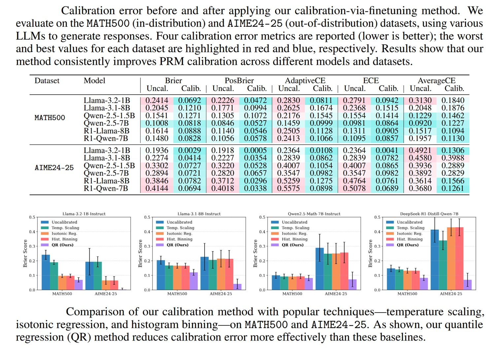
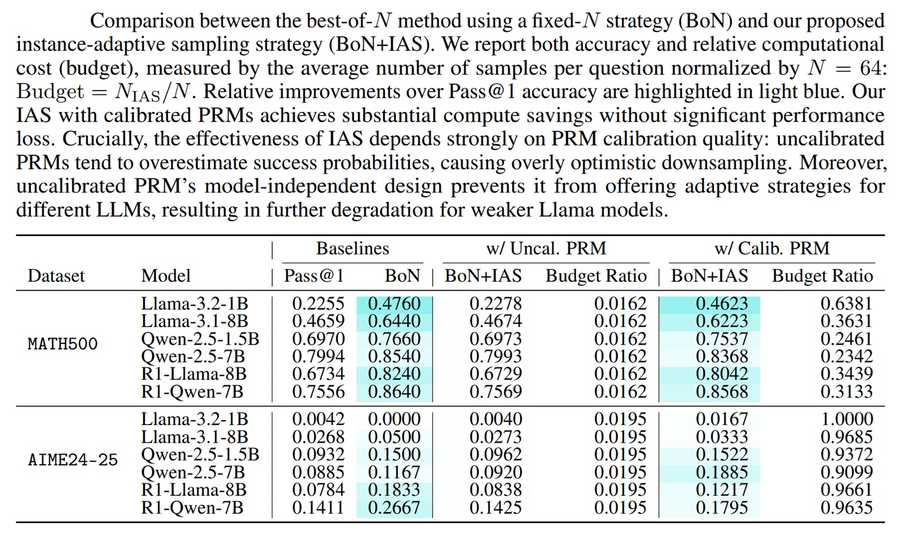
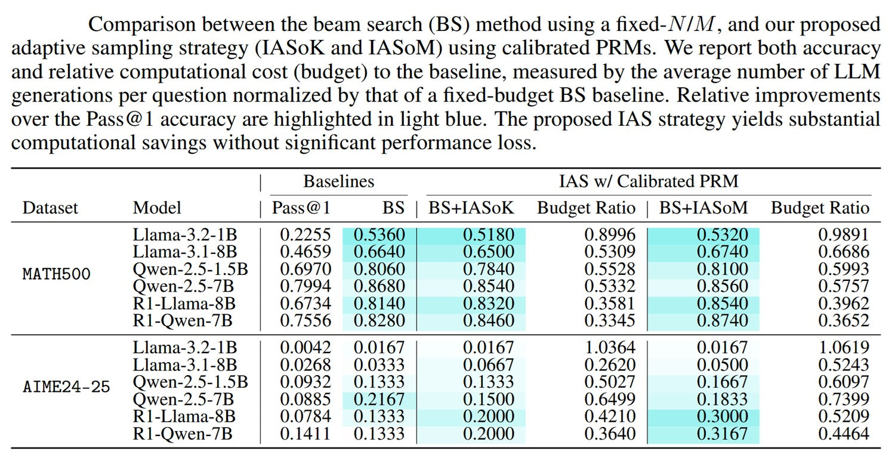

# Desde el MIT, los Modelos Aprenden a Pensar Menos (y Mejor)

*Un nuevo [estudio del MIT](https://www.arxiv.org/pdf/2506.09338) revela cómo los LLM pueden ajustar dinámicamente los recursos computacionales, resolviendo problemas complejos con la mitad del cálculo tradicional. Existe una paradoja que define la inteligencia artificial contemporánea. Los modelos de lenguaje más avanzados abordan cada pregunta con el mismo idéntico esfuerzo computacional, ya sea para calcular cuánto es dos más dos o para demostrar un teorema de topología algebraica. Es como si un gran matemático empleara la misma energía mental para decir qué hora es y para resolver la conjetura de Poincaré.*

Nosotros, los humanos, no funcionamos así: Daniel Kahneman lo documentó magistralmente al describir cómo nuestro cerebro pasa fluidamente entre el Sistema 1, rápido e intuitivo, y el Sistema 2, lento y deliberado. Ahora, los investigadores del MIT han encontrado una manera de enseñar a los LLM esta misma capacidad de modulación.

## El Presupuesto Fijo que Desperdicia Recursos

El enfoque actual del escalado en tiempo de inferencia permite a los modelos de lenguaje "razonar más tiempo" sobre problemas difíciles. El mecanismo es simple: en lugar de generar una sola respuesta, el modelo explora múltiples caminos de razonamiento, genera diferentes soluciones parciales, las evalúa y selecciona las más prometedoras. Piénselo como un árbol de decisiones donde cada rama representa un posible camino hacia la solución. Cuantas más ramas se exploren, mayores serán las posibilidades de encontrar la correcta.

El problema es que [estos sistemas asignan un presupuesto computacional fijo](https://news.mit.edu/2025/smarter-way-large-language-models-think-about-hard-problems-1204) independientemente de la complejidad de la pregunta. Es como darle a un estudiante siempre exactamente una hora para cada tarea, ya sea una multiplicación elemental o una ecuación diferencial. El resultado es doblemente ineficiente: se desperdician recursos valiosos en problemas triviales y se deja al modelo a su suerte cuando la dificultad aumenta.

En los últimos meses ya hemos contado cómo la investigación está explorando alternativas a esta rigidez. [Power Sampling de Harvard](https://aitalk.it/it/power-sampling.html) demostró que algoritmos de muestreo más sofisticados pueden extraer capacidades de razonamiento ya latentes en los modelos base, sin necesidad de entrenamiento adicional. Pero esa técnica sigue operando con un número fijo de iteraciones MCMC. La innovación del MIT va más allá: introduce un sistema que adapta dinámicamente no solo cómo razona el modelo, sino cuánto razona.

## Cómo Funciona el Escalado Adaptativo

La técnica desarrollada por el equipo liderado por Navid Azizan del Laboratorio de Sistemas de Información y Decisión se llama "escalado adaptativo a la instancia" y es conceptualmente elegante. El sistema evalúa continuamente dos cosas: cuán difícil es el problema que enfrenta y cuán prometedoras son las soluciones parciales que ha generado hasta ahora. En base a estas evaluaciones, decide sobre la marcha si invertir más recursos computacionales o detenerse.

"Es exactamente como los humanos resuelven problemas", explica Hao Wang, uno de los autores de la investigación. "Procesamos algunas soluciones parciales y luego decidimos: ¿debería continuar con una de estas, detenerme y revisar el razonamiento, o incluso retroceder y reanudar desde un paso anterior?".

El corazón del sistema es un componente llamado Modelo de Recompensa de Proceso, o PRM. Imagine un supervisor interno que observa al modelo mientras trabaja. En cada paso del razonamiento, el PRM examina la pregunta original y todas las soluciones parciales generadas hasta ahora, asignando a cada una una puntuación que estima la probabilidad de que ese camino conduzca a la respuesta correcta. Si el modelo se encuentra en un camino muy prometedor, puede reducir el número de alternativas a explorar, ahorrando cálculo. Si, por el contrario, todos los caminos parecen poco convincentes, asigna más recursos para buscar mejores salidas.

La diferencia con los sistemas anteriores es que esta evaluación no se realiza una sola vez al principio, sino continuamente durante todo el proceso de resolución. "La belleza de nuestro enfoque", señala Kristjan Greenewald del MIT-IBM Watson AI Lab, "es que la adaptación ocurre sobre la marcha, mientras se resuelve el problema, en lugar de todo a la vez al principio del proceso".

[Imagen extraída del artículo oficial](https://www.arxiv.org/pdf/2506.09338)

## El Problema de la Sobreestimación

Pero hay un obstáculo técnico fundamental que los investigadores tuvieron que superar: los Modelos de Recompensa de Proceso existentes son terriblemente optimistas. Sobrestiman sistemáticamente las probabilidades de éxito, un poco como un GPS que te dice "casi has llegado" cuando en realidad todavía faltan veinte kilómetros. Si el sistema confiara ciegamente en estos juicios, reduciría el presupuesto computacional de manera demasiado agresiva, convenciéndose de que el camino es fácil cuando en realidad es engañoso.

Young-Jin Park, primer autor del estudio, describe así el dilema: "Si nos limitáramos a confiar en los PRM actuales, que a menudo sobrestiman las posibilidades de éxito, nuestro sistema reduciría el presupuesto computacional de forma demasiado agresiva. Así que tuvimos que encontrar una manera de calibrar mejor los PRM y hacer que el escalado en tiempo de inferencia sea más eficiente y fiable".

La solución del MIT es matemáticamente refinada pero conceptualmente accesible. En lugar de hacer que el PRM genere un solo número como estimación de probabilidad, el sistema produce un rango de valores posibles a través de una técnica llamada regresión cuantil. En la práctica, el modelo dice "la probabilidad de éxito está en algún lugar entre el 30% y el 70%" en lugar de "la probabilidad es exactamente del 50%". Esta incertidumbre explícita permite al sistema tomar decisiones más prudentes y realistas.

La conexión con investigaciones anteriores es esclarecedora. Ya hemos discutido cómo [DeepConf de Meta](https://aitalk.it/it/ai-deepconf) aprovecha la confianza intrínseca de los modelos para la autocorrección, y cómo el [TRM de Samsung](https://aitalk.it/it/trm-samsung.html) utiliza la recuperación externa para mejorar la fiabilidad factual. Todas estas técnicas comparten una suposición: los modelos deben aprender a medir cuán seguros están de sus propias respuestas. El MIT lleva esta idea al dominio del razonamiento matemático, donde la verificación puede ser algorítmica pero la calibración de la confianza sigue siendo crucial.

## Los Resultados que Convencen

Los benchmarks no dejan lugar a dudas. En una serie de tareas matemáticas estándar, el sistema del MIT utilizó aproximadamente la mitad del cálculo requerido por los enfoques tradicionales, manteniendo el mismo nivel de precisión. Pero hay un resultado aún más interesante: modelos más pequeños y menos intensivos en recursos, equipados con esta técnica, tuvieron un rendimiento igual o incluso mejor que modelos mucho más grandes en problemas complejos.

Piense en las implicaciones. Un modelo de siete mil millones de parámetros que es barato de ejecutar y consume poca energía puede, si se usa de manera inteligente, competir con gigantes de setenta mil millones en problemas que requieren un razonamiento profundo. No porque el modelo pequeño se haya vuelto mágicamente más inteligente, sino porque ha aprendido a concentrar sus recursos limitados donde realmente se necesitan.

Esto es particularmente relevante en el contexto del [razonamiento en tiempo de prueba](https://aitalk.it/it/articolo-hrm.html), donde hemos visto cómo la asignación inteligente de recursos computacionales está emergiendo como una frontera clave de la IA. El MIT sugiere que el futuro no consiste necesariamente en hacer modelos cada vez más grandes, sino en enseñar a los existentes cuándo vale la pena pensar largo y tendido y cuándo una respuesta rápida es suficiente.

[Imagen extraída del artículo oficial](https://www.arxiv.org/pdf/2506.09338)

## Aplicaciones Concretas y Perspectivas

Las repercusiones prácticas son inmediatas. La generación de código es un candidato natural: algunos problemas de programación son triviales sintácticos, otros requieren un razonamiento algorítmico complejo. Un sistema que reconoce esta diferencia y se comporta en consecuencia puede reducir drásticamente los costos operativos de servicios como GitHub Copilot o Cursor.

Los agentes de IA autónomos son el otro terreno fértil. Un agente que deba navegar por situaciones del mundo real debe decidir constantemente cuánto "pensar" antes de actuar. Detenerse demasiado en decisiones simples lo vuelve torpe e ineficiente. Actuar demasiado rápido en decisiones complejas lo lleva al error. El marco del MIT proporciona exactamente el mecanismo de metacognición necesario: la capacidad de evaluar cuán difícil es la situación y asignar el tiempo de reflexión en consecuencia.

Navid Azizan señala que el reciente lanzamiento de GPT-5.1 destaca la eficacia de este enfoque de "razonamiento adaptativo" propuesto en el artículo. "Al dotar a los modelos de la capacidad de saber lo que no saben, podemos permitirles gastar más cómputo en los problemas más difíciles y en los caminos de solución más prometedores, usando muchos menos tokens en los fáciles. Esto hace que el razonamiento sea más fiable y mucho más eficiente".

## Los Límites que no Deben Ignorarse

Pero sería ingenuo ignorar los desafíos aún pendientes. El sistema funciona excelentemente en dominios donde la verificación es algorítmica, como las matemáticas o la codificación. Pero, ¿qué sucede cuando la "corrección" es matizada o subjetiva? ¿Cómo evalúa un PRM cuán prometedora es una solución parcial a un problema de diseño creativo o de decisión ética compleja?

Y luego está la cuestión de las alucinaciones, el talón de Aquiles de todos los modelos de lenguaje. Un sistema que decide autónomamente cuánto razonar puede, paradójicamente, volverse más peligroso si su confianza está mal calibrada. Podría convencerse rápidamente de que tiene razón justo cuando está generando resultados completamente inventados. Por eso, la calibración del PRM no es un detalle técnico, sino una necesidad absoluta.

Los investigadores son transparentes sobre los próximos pasos. Quieren probar la técnica en aplicaciones más amplias y explorar otros usos del método de calibración, incluido el aprendizaje por refuerzo y el ajuste fino. Sin embargo, la intuición de fondo ya está clara: un modelo que aprende a dosificar su propio esfuerzo cognitivo está más cerca de algo que podríamos llamar inteligencia flexible.

Akash Srivastava de IBM Software, no involucrado en la investigación, lo pone en perspectiva industrial: "Los empleados humanos aprenden en el trabajo, algunos directores ejecutivos comenzaron como becarios, pero los agentes de hoy en día siguen siendo en gran medida piezas de software probabilístico estático. Trabajos como este artículo son un paso importante para cambiar eso: ayudar a los agentes a entender lo que no saben y construir mecanismos para la mejora continua autónoma".

[Imagen extraída del artículo oficial](https://www.arxiv.org/pdf/2506.09338)

## El Hilo Conductor de la Eficiencia Inteligente

Hay un patrón que emerge con cada vez mayor claridad en la investigación de IA de 2025. Power Sampling de Harvard nos mostró que las capacidades sofisticadas pueden estar ya presentes en los modelos base, solo hay que saber cómo extraerlas. El TRM de Samsung demostró que la recuperación estratégica supera a la memoria bruta. DeepConf reveló que la autorreflexión cuesta menos que el escalado ciego. Y ahora el MIT confirma que la asignación dinámica de recursos supera a los presupuestos fijos.

El denominador común es la eficiencia inteligente. Ya no se trata solo de "hacer modelos más grandes y darles más datos", sino de "enseñar a los modelos cuándo vale la pena ser grandes". Es una maduración necesaria para una industria que se enfrenta a crecientes costos energéticos y presiones sobre la sostenibilidad.

Los Modelos de Recompensa de Proceso calibrados del MIT pueden parecer un detalle técnico de nicho, pero representan algo más profundo: la construcción de una autoconciencia computacional. Un modelo que sabe cuándo está confundido, que reconoce los problemas fáciles de los difíciles, que mide sus propias capacidades antes de comprometerse. Como los Mentat de Dune, que dosificaban con precisión maniática los recursos cognitivos para cada cálculo, estos sistemas están aprendiendo el arte de la parsimonia inteligente.

La pregunta ahora no es si esta dirección es la correcta, sino cuán rápido la industria sabrá integrarla. Porque entre un sistema que quema energía en cada consulta y uno que razona solo cuando es necesario, la diferencia no es solo económica o ambiental. Es filosófica: marca el paso de máquinas que computan a máquinas que "piensan" sobre cómo computar.
