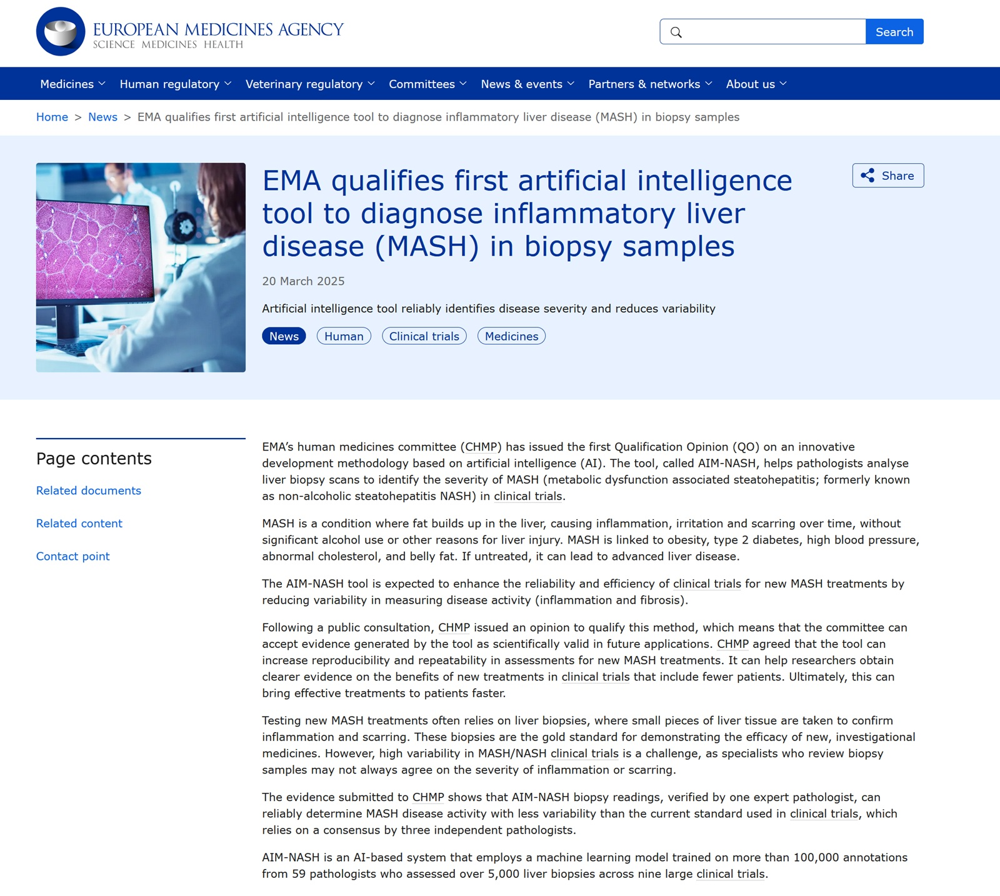

# Se l'algoritmo fa diagnosi: FDA e EMA sdoganano l'AI nei trial farmaceutici

*C'è una scena in *Ghost in the Shell* dove il maggiore Kusanagi si interroga sulla natura della propria coscienza, chiedendosi se sia davvero umana o semplicemente una sofisticata simulazione. È una domanda che risuona in modo inaspettato nell'ambulatorio di patologia quando un algoritmo di intelligenza artificiale produce una diagnosi che diverge da quella umana. Chi ha ragione? O meglio: esiste ancora una "ragione" univoca quando la decisione clinica diventa computazionale?*

L'8 dicembre 2025, la Food and Drug Administration statunitense ha [qualificato AIM-NASH](https://www.fda.gov/drugs/drug-safety-and-availability/fda-qualifies-first-ai-drug-development-tool-will-be-used-mash-clinical-trials), il primo strumento basato su intelligenza artificiale come Drug Development Tool per i trial clinici sulla steatoepatite metabolica, meglio nota con l'acronimo MASH. La stessa tecnologia, ribattezzata AIM-MASH per il mercato europeo, aveva già ottenuto otto mesi prima una [Qualification Opinion](https://www.ema.europa.eu/en/news/ema-qualifies-first-artificial-intelligence-tool-diagnose-inflammatory-liver-disease-mash-biopsy-samples) dall'Agenzia Europea del Farmaco. Non si tratta di un'approvazione per uso clinico diretto sui pazienti, ma di qualcosa di potenzialmente più profondo: il riconoscimento che un algoritmo può sostituire il consenso di tre patologi esperti nella valutazione di biopsie epatiche durante lo sviluppo di nuovi farmaci.

La MASH rappresenta uno stadio avanzato della malattia del fegato grasso non alcolica, una condizione che affligge circa un terzo della popolazione adulta nei paesi occidentali. Quando il grasso si accumula oltre il cinque percento del peso epatico, può innescare un processo infiammatorio che porta al rigonfiamento cellulare, alla formazione di tessuto cicatriziale e, nei casi più gravi, alla cirrosi o al carcinoma epatocellulare. Il problema è che diagnosticare con precisione la MASH richiede una biopsia epatica, e l'interpretazione di quella biopsia è tutt'altro che semplice.

Il NASH Clinical Research Network ha sviluppato negli anni un sistema di scoring che valuta quattro parametri principali: la steatosi (accumulo di grasso), l'infiammazione lobulare, il rigonfiamento degli epatociti e la fibrosi. Ogni elemento riceve un punteggio che va da zero a tre o quattro, e la somma complessiva determina la severità della malattia. Sembra lineare sulla carta, ma la realtà è ben diversa. Studi pubblicati su riviste specializzate dimostrano che l'accordo tra patologi, anche esperti, oscilla tra valori kappa di 0,25 per il rigonfiamento cellulare e 0,62 per la steatosi. In termini pratici, significa che due patologi guardando la stessa biopsia potrebbero arrivare a conclusioni diverse nel quaranta percento dei casi.

È qui che entra in gioco PathAI, startup bostoniana fondata nel 2016 da Andrew Beck, patologo del Beth Israel Deaconess Medical Center, e Aditya Khosla, informatico specializzato in machine learning. L'azienda ha raccolto oltre 255 milioni di dollari in cinque round di finanziamento, coinvolgendo investitori del calibro di General Atlantic, Kaiser Permanente e Bristol Myers Squibb. La loro piattaforma AISight promette di trasformare la patologia digitale da processo artigianale a flusso di lavoro industriale, con l'AI come elemento centrale.

## PathAI: da Boston al tavolo regolatorio

PathAI non è arrivata alla qualificazione FDA per caso. L'azienda ha costruito sistematicamente un portfolio di tecnologie che coprono l'intero spettro della patologia computazionale: dal rilevamento di biomarcatori tumorali come PD-L1 e HER2, fino alla caratterizzazione del microambiente tumorale. Il loro sistema per la MASH, però, rappresenta qualcosa di diverso: non un semplice ausilio decisionale, ma uno strumento che può sostituire il consenso multiplo richiesto dai protocolli sperimentali.

Il modello è stato addestrato su oltre centomila annotazioni provenienti da 59 patologi che hanno valutato più di cinquemila biopsie epatiche raccolte da nove grandi trial clinici. Non si tratta di un dataset di laboratorio, ma di materiale proveniente da studi reali, con tutta la variabilità e le complessità del mondo reale. L'algoritmo utilizza tecniche di deep learning per analizzare le immagini digitalizzate delle biopsie, identificando pattern microscopici che l'occhio umano potrebbe trascurare o interpretare diversamente.

La validazione presentata a FDA ed EMA ha dimostrato che le valutazioni di AIM-NASH, verificate da un singolo patologo esperto, raggiungono un livello di concordanza con il consenso di tre esperti paragonabile a quello che ogni singolo patologo avrebbe con lo stesso consenso. In altre parole, l'AI più un umano performa quanto tre umani insieme, con un significativo risparmio di tempo e risorse. La correlazione intraclasse supera 0,90 per tutti i parametri principali, un valore che nella letteratura scientifica è considerato "eccellente".

Ma c'è un elemento che distingue questo risultato dalle solite proclamazioni del settore tech: la trasparenza regolamentare. PathAI ha sottoposto il proprio algoritmo al Drug Development Tool Qualification Program della FDA, un percorso che richiede anni di lavoro e la dimostrazione rigorosa che lo strumento produce dati scientificamente validi e riproducibili. Il fatto che l'algoritmo sia "locked", ossia congelato in una versione specifica che non può essere modificata senza una nuova qualificazione, rappresenta una garanzia di stabilità e tracciabilità che il machine learning tradizionale raramente offre.

## AIM-NASH/MASH: anatomia di una qualificazione

La qualificazione FDA di AIM-NASH si inserisce in un framework regolatorio preciso, quello dei Drug Development Tools, istituito dal 21st Century Cures Act del 2016. Non si tratta di un'approvazione per uso clinico diretto, ma del riconoscimento che uno strumento può essere utilizzato per generare dati in contesti regolati come i trial clinici. È una distinzione sottile ma fondamentale: AIM-NASH non diagnostica pazienti negli ospedali, ma supporta la valutazione di endpoints nei trial per farmaci anti-MASH.

Il contesto d'uso è specifico: valutazione di biopsie epatiche in studi clinici che utilizzano il sistema di scoring NASH Clinical Research Network. Il processo prevede che il patologo carichi l'immagine digitalizzata della biopsia sulla piattaforma cloud di PathAI, l'algoritmo produca i punteggi per ciascun parametro (steatosi, infiammazione, rigonfiamento, fibrosi), e il patologo riveda l'output prima di accettarlo o respingerlo. L'ultimo passaggio è cruciale: la responsabilità finale resta umana, ma il processo decisionale è assistito dalla macchina.

L'Agenzia Europea del Farmaco ha seguito un percorso parallelo ma non identico. La Qualification Opinion rilasciata dal CHMP (Committee for Medicinal Products for Human Use) il 20 marzo 2025 presenta alcune differenze sostanziali rispetto alla qualificazione FDA. Mentre l'FDA ha qualificato uno strumento specifico per un contesto d'uso definito, l'EMA ha rilasciato un'opinion su una metodologia innovativa che può essere adottata da sviluppatori farmaceutici nei propri studi.

La distinzione è sottile ma importante. Nel sistema europeo, un'azienda che voglia utilizzare AIM-MASH in un trial deve comunque presentare il proprio piano di utilizzo all'EMA, che lo valuterà nel contesto specifico. La qualificazione non è uno "stamp of approval" universale, ma un'indicazione che la metodologia è scientificamente valida e può essere considerata accettabile. È un approccio più flessibile ma anche più complesso da navigare per gli sponsor farmaceutici.

[Immagine tratta da fda.gov](https://www.fda.gov/drugs/drug-safety-and-availability/fda-qualifies-first-ai-drug-development-tool-will-be-used-mash-clinical-trials)

## Parallelismo transatlantico con differenze sostanziali

Guardando alle tempistiche, il percorso europeo è stato leggermente anticipato: l'opinion EMA è arrivata a marzo 2025, quella FDA a dicembre dello stesso anno. PathAI ha dovuto affrontare due iter regolatori distinti, adattando la documentazione e gli studi di validazione alle specificità di ciascun sistema. Il fatto che entrambi gli enti abbiano raggiunto conclusioni convergenti rappresenta un segnale importante per il settore: l'AI in patologia non è più considerata una tecnologia sperimentale, ma uno strumento maturo per contesti regolati.

Tuttavia, le filosofie di fondo differiscono. Il sistema FDA è più orientato alla qualificazione di strumenti specifici che, una volta approvati, possono essere utilizzati da qualsiasi sponsor senza ulteriori valutazioni caso per caso. Il sistema EMA privilegia invece un approccio metodologico, dove ogni applicazione specifica richiede una valutazione contestuale. Entrambi i modelli hanno vantaggi e limiti: il primo offre maggiore prevedibilità e costi più bassi per gli sponsor, il secondo garantisce un controllo più stretto su come la tecnologia viene effettivamente impiegata.

Un altro elemento di divergenza riguarda il concetto di "single reader" versus consensus. Tradizionalmente, i trial MASH richiedono che tre patologi indipendenti valutino ciascuna biopsia, e il risultato finale sia determinato dal consenso. È un processo costoso e lento, che può richiedere settimane o mesi per completare l'analisi di centinaia di campioni. AIM-NASH/MASH propone un modello diverso: un singolo patologo esperto, assistito dall'algoritmo, può produrre valutazioni comparabili al consenso triplo.

FDA ed EMA hanno accettato questa proposizione, ma con limitazioni diverse. L'EMA ha sottolineato che il modello è "locked" e che eventuali miglioramenti sostanziali richiederanno una ri-qualificazione. Ha anche incoraggiato l'ottimizzazione continua, riconoscendo che il machine learning è per natura evolutivo. La FDA è stata più pragmatica, concentrandosi sul contesto d'uso e sulla dimostrazione che lo strumento produce dati affidabili per gli endpoint regolatori.

## Il tallone d'Achille: bias e rappresentatività

Nonostante l'entusiasmo, esiste un elefante nella stanza che né FDA né EMA hanno potuto ignorare completamente: la rappresentatività del dataset di training. Gli oltre cinquemila campioni utilizzati per addestrare AIM-NASH provengono prevalentemente da trial clinici condotti in Nord America, Europa e Cina, con una sovrarappresentazione di popolazioni caucasiche e asiatiche. I campioni latino-americani, africani e medio-orientali sono sostanzialmente assenti.

Questo non è un problema tecnico, ma epistemologico. Un algoritmo addestrato su biopsie di pazienti caucasici potrebbe non riconoscere con la stessa accuratezza pattern patologici in tessuti di altre etnie, dove fattori genetici, metabolici e ambientali producono manifestazioni istologiche diverse. Studi recenti sulla computational pathology hanno documentato disparità significative nelle performance di algoritmi diagnostici quando applicati a popolazioni non rappresentate nel training set.

PathAI è consapevole del problema e ha dichiarato l'intenzione di espandere il dataset con campioni più diversificati. Tuttavia, il modello qualificato è "locked", il che significa che qualsiasi integrazione sostanziale richiederebbe una nuova validazione e ri-qualificazione. Questo crea un paradosso: da un lato la stabilità e la tracciabilità del modello sono garanzie regolatorie fondamentali, dall'altro limitano la capacità di correggere bias identificati dopo la qualificazione.

Un secondo ordine di problemi riguarda la generalizzabilità geografica. I trial MASH sono globali, coinvolgono centri in decine di paesi con standard di processing istologico differenti. Le biopsie vengono preparate, colorate e digitalizzate con protocolli che variano tra laboratori, scanner e operatori. L'algoritmo è robusto rispetto a queste variazioni? La validazione presentata a FDA ed EMA suggerisce di sì, ma i dati pubblicamente disponibili non coprono l'intera gamma di variabilità tecnica che si incontra nella pratica reale.

C'è poi la questione del sampling bias nel senso più letterale: una biopsia epatica cattura solo una frazione minuscola del fegato, tipicamente un cilindro di tessuto di 1-2 centimetri. Se la steatosi o l'infiammazione sono distribuite in modo disomogeneo, il campione potrebbe non essere rappresentativo dello stato complessivo dell'organo. Questo è un limite intrinseco della procedura, non dell'AI, ma l'intelligenza artificiale non può correggere un campionamento inadeguato, può solo analizzarlo con maggiore consistenza.

[Immagine tratta da ema.europa.eu](https://www.ema.europa.eu/en/news/ema-qualifies-first-artificial-intelligence-tool-diagnose-inflammatory-liver-disease-mash-biopsy-samples)

## Patologi in via d'estinzione?

La domanda che aleggia in ogni discussione sull'AI medica è sempre la stessa: stiamo costruendo strumenti per assistere i professionisti o per sostituirli? Nel caso di AIM-NASH, la risposta ufficiale è chiara: assistere. Il patologo mantiene la responsabilità finale, rivede ogni output algoritmico, può accettarlo o respingerlo. Il sistema è "AI-assisted", non "AI-driven".

Ma la realtà economica suggerisce dinamiche più complesse. Se un singolo patologo con AIM-NASH può fare il lavoro di tre patologi senza AI, cosa succede ai due patologi in eccesso? Nel breve termine, potrebbero essere riassegnati ad altre attività diagnostiche dove la domanda supera l'offerta. Nel lungo termine, la domanda stessa di patologi specializzati in MASH potrebbe contrarsi.

PathAI sottolinea che il problema della patologia non è la mancanza di lavoro, ma la scarsità di esperti. Ci sono più biopsie da valutare che patologi disponibili, e i tempi di attesa per refertazioni specializzate possono essere settimane. In questo scenario, l'AI diventa un moltiplicatore di capacità che permette di scalare senza aumentare proporzionalmente il numero di professionisti. È l'argomento classico dell'automazione: libera gli umani da compiti ripetitivi permettendo loro di concentrarsi su casi complessi.

Tuttavia, esiste una tensione irrisolta tra il modello formativo della patologia e la direzione verso cui l'AI sta spingendo. I patologi si formano attraverso anni di pratica su migliaia di casi, sviluppando un'intuizione che va oltre le regole codificabili. Se sempre più diagnosi di routine vengono delegate agli algoritmi, dove si alleneranno i futuri patologi? Come svilupperanno quella sensibilità clinica che permette di riconoscere pattern anomali che l'AI non ha mai visto?

È il paradosso dell'expertise automatizzata: gli algoritmi hanno bisogno di esperti per essere validati e supervisionati, ma la loro stessa esistenza riduce le opportunità di formazione che producono quegli esperti. Non è un problema immediato, ma lo diventerà nel prossimo decennio se non si ripensano i modelli educativi della medicina diagnostica.

## Follow the money: resmetirom e oltre

Dietro l'entusiasmo regolatorio per AIM-NASH c'è una realtà economica molto concreta: la MASH rappresenta uno dei mercati farmaceutici più promettenti del decennio. Per anni la malattia è stata considerata intrattabile, senza terapie approvate oltre la gestione dello stile di vita. Ma negli ultimi anni la pipeline si è riempita di candidati in fase avanzata di sviluppo, e alcuni stanno raggiungendo i traguardi regolatori.

Resmetirom, sviluppato da Madrigal Pharmaceuticals, ha [ricevuto l'approvazione FDA](https://www.fda.gov/news-events/press-announcements/fda-approves-first-treatment-patients-liver-scarring-due-fatty-liver-disease) nel marzo 2024 come primo trattamento specifico per la MASH con fibrosi. Il farmaco, un agonista selettivo del recettore beta dell'ormone tiroideo, ha dimostrato nei trial di ridurre l'infiammazione e migliorare i marker di fibrosi. Il suo sviluppo ha richiesto trial multicentrici su migliaia di pazienti, con valutazioni istologiche ripetute che hanno rappresentato uno dei colli di bottiglia principali.

Altri candidati stanno seguendo percorsi simili. Semaglutide, il blockbuster di Novo Nordisk già approvato per diabete e obesità, è in fase di valutazione per MASH con risultati promettenti. Efruxifermin di Akero Therapeutics, un analogo di FGF21, ha mostrato riduzioni significative della fibrosi in trial di fase 2. Survodutide di Boehringer Ingelheim, un doppio agonista GLP-1/glucagone, sta entrando in fase 3 con endpoints ambiziosi.

Tutti questi trial richiedono biopsie epatiche come endpoint primario o secondario, e la variabilità nella valutazione istologica rappresenta un problema statistico serio. Se il rumore di misurazione è alto, servono campioni più grandi per rilevare differenze significative tra trattamento e placebo. Campioni più grandi significano costi più alti, tempi più lunghi, e ritardi nell'accesso dei pazienti alle terapie.

AIM-NASH promette di ridurre quel rumore. Se le valutazioni algoritmiche sono più consistenti di quelle umane, servono meno pazienti per dimostrare l'efficacia di un farmaco. Le stime di PathAI suggeriscono che l'utilizzo dello strumento potrebbe ridurre la dimensione campionaria richiesta del venti-trenta percento in alcuni disegni sperimentali. Tradotto in numeri: un trial che avrebbe richiesto mille pazienti potrebbe fermarsi a settecento, con risparmi nell'ordine di decine di milioni di dollari.

Non è difficile capire perché aziende come Bristol Myers Squibb, GSK, Gilead e Roche abbiano stretto partnership con PathAI. L'AI in patologia non è solo una curiosità tecnologica, ma un'opportunità di ridurre drasticamente i costi e i tempi dello sviluppo farmaceutico. Il ROI potenziale è enorme, e il mercato lo ha capito: PathAI è valutata circa un miliardo di dollari nell'ultimo round di finanziamento.

## Le domande ancora senza risposta

Nonostante il successo regolatorio, rimangono interrogativi sostanziali che né FDA né EMA hanno ancora risolto completamente. Il primo riguarda la long-term safety: cosa succede se l'algoritmo, dopo anni di utilizzo in migliaia di trial, mostra bias o errori sistematici che erano sfuggiti alla validazione iniziale? Chi è responsabile? PathAI? Gli sponsor che hanno usato lo strumento? Le agenzie che lo hanno qualificato?

Il framework della responsabilità nell'AI medica è ancora nebuloso. Se un farmaco viene approvato sulla base di dati generati con AIM-NASH, e successivamente si scopre che l'algoritmo ha sistematicamente sovrastimato o sottostimato un parametro critico, quali sono le implicazioni legali e regolatorie? Non esistono precedenti chiari, e il sistema giuridico sta ancora elaborando le categorie concettuali necessarie per affrontare questi scenari.

Un secondo nodo riguarda la trasferibilità geografica. Come accennato, il modello è stato addestrato su popolazioni specifiche. Quando verrà utilizzato in trial condotti in Africa subsahariana, Sud America o Asia meridionale, manterrà le stesse performance? E se no, come verrà rilevato il problema prima che comprometta l'integrità degli studi?

PathAI ha implementato meccanismi di quality control che dovrebbero flaggare campioni anomali, ma la definizione di "anomalo" dipende dalla distribuzione del training set. È un classico problema del machine learning: l'out-of-distribution detection è difficile, e i falsi negativi possono essere insidiosi. Un campione che l'algoritmo valuta con alta confidenza potrebbe in realtà appartenere a una regione dello spazio delle features mai vista durante il training.

Infine, c'è la questione dell'accessibilità economica. AIM-NASH è una piattaforma cloud proprietaria, e PathAI applica tariffe per-sample agli sponsor che la utilizzano. Per trial condotti da big pharma con budget multimilionari, il costo è marginale. Ma per trial accademici, piccoli biotech o centri di ricerca in paesi a medio-basso reddito, potrebbe diventare proibitivo. Esiste il rischio che l'AI in patologia crei un divario tra chi può permettersela e chi no, con conseguenze sulla diversità e rappresentatività della ricerca globale.

La qualificazione di AIM-NASH da parte di FDA ed EMA segna un punto di svolta nella storia della medicina regolamentare. Per la prima volta, un algoritmo di intelligenza artificiale è stato riconosciuto non come un gadget sperimentale, ma come strumento affidabile per generare dati in contesti regolati. È un riconoscimento che arriva dopo anni di scetticismo e false partenze, e rappresenta una validazione del potenziale della computational pathology.

Tuttavia, sarebbe ingenuo ignorare i nodi irrisolti. I bias di dataset, le questioni di responsabilità, i problemi di accessibilità globale non sono ostacoli tecnici che possono essere superati con più dati o algoritmi migliori. Sono sfide sistemiche che richiedono nuovi framework concettuali, legali ed etici. Il maggiore Kusanagi, di fronte all'algoritmo che legge biopsie, continuerebbe a chiedersi: quando affidiamo decisioni così importanti alle macchine, cosa perdiamo di essenzialmente umano? E cosa guadagniamo che gli umani da soli non potrebbero ottenere?

Le risposte non sono ancora chiare, ma una cosa è certa: l'era dell'AI come supporto passivo sta finendo. Quello che emerge è un modello ibrido dove umani e algoritmi si fondono in sistemi decisionali complessi, con logiche e responsabilità che non appartengono più né all'uno né all'altro. Come sempre, la tecnologia corre più veloce della nostra capacità di comprenderla. E come sempre, ci tocca correrle dietro cercando di non perdere di vista ciò che conta davvero: la salute dei pazienti, l'integrità della ricerca, e la giustizia nell'accesso alle cure.