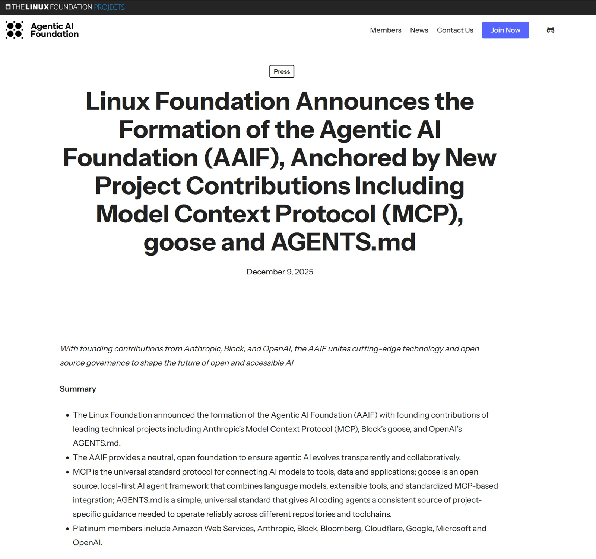

# Il Cartello degli Agenti: Quando l'Open Source Diventa un Monopolio Preventivo

*Il nove dicembre 2025, Linux Foundation ha annunciato la nascita dell'[Agentic AI Foundation](https://aaif.io/press/linux-foundation-announces-the-formation-of-the-agentic-ai-foundation-aaif-anchored-by-new-project-contributions-including-model-context-protocol-mcp-goose-and-agents-md/), un'iniziativa che riunisce OpenAI, Anthropic e Block sotto l'egida di quella che dovrebbe essere una governance neutrale. I tre colossi hanno donato i loro progetti più strategici: il Model Context Protocol di Anthropic, il framework Goose di Block e AGENTS.md di OpenAI. Accompagnano l'iniziativa sponsor di platino come AWS, Google, Microsoft, Bloomberg e Cloudflare. Una coalizione talmente ampia da sembrare quasi sospetta.*

Il comunicato ufficiale parla di "trasparenza", "collaborazione" e "interesse pubblico". Tutti termini rassicuranti che nascondono una domanda scomoda: perché proprio ora? E soprattutto, perché questa fretta di definire standard per una tecnologia che i regolatori stanno ancora cercando di comprendere?

## La Genealogia dell'Agente Autonomo

Per capire la posta in gioco, serve fare un passo indietro. Gli agenti AI non sono una novità teorica: già nel 2023 progetti sperimentali come Auto-GPT dimostravano che i modelli linguistici potevano essere orchestrati per eseguire task complessi in modo autonomo. Ma tra un esperimento su GitHub e un prodotto enterprise c'è un abisso fatto di affidabilità, sicurezza e soprattutto interoperabilità.

[Il Model Context Protocol](https://www.anthropic.com/news/model-context-protocol), lanciato da Anthropic nel novembre 2024, rappresenta il primo tentativo serio di standardizzare come gli agenti AI comunicano con sistemi esterni. Come ha spiegato David Soria Parra, co-creatore di MCP, a [TechCrunch](https://techcrunch.com/2025/12/09/openai-anthropic-and-block-join-new-linux-foundation-effort-to-standardize-the-ai-agent-era/): "L'obiettivo principale è avere abbastanza adozione nel mondo affinché diventi lo standard de facto". L'adozione è stata rapida: secondo i dati di [GitHub](https://github.blog/open-source/maintainers/mcp-joins-the-linux-foundation-what-this-means-for-developers-building-the-next-era-of-ai-tools-and-agents/), in pochi mesi sono stati creati migliaia di server MCP, con SDK disponibili per tutti i principali linguaggi di programmazione e [oltre 97 milioni di download mensili](https://www.anthropic.com/news/donating-the-model-context-protocol-and-establishing-of-the-agentic-ai-foundation) combinati per le librerie Python e TypeScript.

[Goose di Block](https://block.github.io/goose/), rilasciato all'inizio del 2025, adotta una filosofia local-first che strizza l'occhio ai paranoici della privacy. Come framework agente che combina modelli linguistici con tool estensibili e integrazioni basate su MCP, Goose permette agli sviluppatori di mantenere il controllo su cosa viene inviato dove. Un approccio che Manik Surtani, responsabile Open Source di Block, ha riassunto così al [lancio di AAIF](https://www.linuxfoundation.org/press/linux-foundation-announces-the-formation-of-the-agentic-ai-foundation): "La tecnologia che definirà il prossimo decennio può rimanere chiusa e proprietaria a beneficio di pochi, o essere guidata da standard aperti per tutti".

[AGENTS.md di OpenAI](https://agents.md/), lanciato nell'agosto 2025, è forse il progetto più semplice ma anche più insidioso. Si tratta di un file Markdown che gli agenti possono leggere per capire come operare in un repository: convenzioni di codice, step di build, requisiti di testing. [Secondo OpenAI](https://openai.com/index/agentic-ai-foundation/), oltre 60.000 progetti open source lo hanno già adottato, inclusi tool come Cursor, Devin, GitHub Copilot e VS Code. Un numero impressionante per uno standard nato appena quattro mesi fa.

## Chi Scrive il Protocollo, Scrive la Legge

Ed è qui che la narrazione ufficiale inizia a scricchiolare. Perché questa convergenza coordinata verso standard comuni avviene in un momento molto specifico: quando i regolatori non hanno ancora definito cosa siano legalmente gli agenti AI autonomi.

L'[EU AI Act](https://artificialintelligenceact.eu/), entrato in vigore nell'agosto 2024, è stato progettato prima che gli agenti diventassero mainstream. Come nota un [report di The Future Society](https://thefuturesociety.org/aiagentsintheeu/) del giugno 2025, "sebbene l'AI Act non sia stato originariamente progettato pensando agli agenti AI, scopriamo che il framework regolatorio più completo al mondo per governare l'AI si applica effettivamente agli agenti. Ma rimangono lacune". Il problema centrale è che l'Act categorizza i sistemi AI basandosi sul rischio statico, mentre gli agenti operano in modo dinamico, adattandosi e prendendo decisioni autonome che possono variare il livello di rischio in base al contesto.

Un [articolo su European Law Blog](https://www.europeanlawblog.eu/pub/dq249o3c/release/1) descrive quella che definisce "Agentic Tool Sovereignty": l'impossibilità per stati e fornitori di mantenere un controllo legale su come i sistemi AI invocano e utilizzano tool transfrontalieri in modo autonomo. Immaginate un sistema di recruiting a Parigi che in cinque secondi invoca un'API psicometrica USA, un servizio di verifica UK, una piattaforma di skills singaporiana e un tool salariale svizzero. Tre mesi dopo, quattro regolatori emettono sanzioni. Chi è responsabile? Il deployer non aveva visibilità sui flussi di dati, le tracce di audit erano insufficienti, l'agente non aveva controlli di routing geografico.

A settembre 2025, il parlamentare europeo Sergey Lagodinsky ha chiesto formalmente alla Commissione di chiarire "come saranno regolati gli agenti AI". Al momento in cui scrivo, nessuna risposta pubblica è stata emessa. Questo vuoto normativo è il campo da gioco perfetto per chi vuole scrivere le regole prima che arrivino gli arbitri.

[Immagine tratta dal sito di Agentic AI Foundation](https://aaif.io/press/linux-foundation-announces-the-formation-of-the-agentic-ai-foundation-aaif-anchored-by-new-project-contributions-including-model-context-protocol-mcp-goose-and-agents-md/)

## Anatomia di un'Alleanza Strategica

I tre progetti fondativi di AAIF non sono scelti a caso: rappresentano i layer critici dell'infrastruttura agente. MCP definisce come gli agenti parlano con il mondo esterno. AGENTS.md standardizza come gli agenti comprendono i contesti di lavoro. Goose dimostra come questi pezzi si assemblano in un framework funzionante. Insieme, coprono l'intero stack tecnologico.

La donazione alla Linux Foundation suona nobile, ma solleva interrogativi sulla governance reale. Linux Foundation ha una storia controversa con l'influenza corporativa. Come riportato da [The New Stack](https://thenewstack.io/linux-foundation-critics/) già nel 2021, la fondazione ha eliminato dai propri statuti la possibilità per membri della community di essere eletti nel board, lasciando il controllo esclusivamente agli sponsor corporate. Matthew Garrett, contributore del kernel Linux, [ha denunciato](https://techrights.org/o/2016/01/21/linux-foundation-coup/) questo cambiamento come un abbandono della rappresentanza comunitaria.

Jim Zemlin, direttore esecutivo di Linux Foundation, ha [dichiarato](https://www.linuxfoundation.org/press/linux-foundation-announces-the-formation-of-the-agentic-ai-foundation) che "un indicatore precoce di successo, oltre all'adozione di questi standard, sarebbe lo sviluppo e l'implementazione di standard condivisi utilizzati da agenti vendor in tutto il mondo". Ma chi decide quali standard vadano implementati? I membri platino che pagano centinaia di migliaia di dollari all'anno, o la community che sviluppa i tool?

Nick Cooper di OpenAI ha affermato su [TechCrunch](https://techcrunch.com/2025/12/09/openai-anthropic-and-block-join-new-linux-foundation-effort-to-standardize-the-ai-agent-era/) che "non voglio che sia una cosa stagnante. Non voglio che questi protocolli facciano parte di questa fondazione e lì rimangano per due anni. Dovrebbero evolversi e accettare continuamente ulteriori input". Parole belle, ma la storia del software open source insegna che chi controlla i maintainer e chi finanzia lo sviluppo determina la direzione del progetto.

## La Posta in Gioco

Le implicazioni economiche sono enormi. Gli analisti prevedono che il mercato degli agenti AI autonomi raggiungerà decine di miliardi di dollari nei prossimi anni, con applicazioni che spaziano dalla gestione delle email alla navigazione web complessa. Chi controlla gli standard controlla i pedaggi: quale azienda vorrà investire in un sistema agente proprietario quando l'ecosistema si consolida attorno a MCP, AGENTS.md e simili?

Microsoft e GitHub hanno [annunciato](https://www.tekedia.com/microsoft-and-github-join-forces-with-anthropic-to-expand-ai-ecosystem-via-model-context-protocol/) nel maggio 2025 di unirsi al comitato direttivo di MCP, portando con sé l'accesso al filesystem di Windows, funzionalità di windowing e Windows Subsystem for Linux attraverso server MCP. GitHub sta sviluppando un servizio di registry per MCP. Quando i giganti tech allineano le loro infrastrutture attorno a un protocollo, quest'ultimo diventa de facto lo standard, indipendentemente da quanto sia "aperto" sulla carta.

Come nota [un'analisi critica su Implicator](https://www.implicator.ai/the-agentic-ai-foundation-is-a-trade-bloc-disguised-as-open-governance/), AAIF somiglia più a un blocco commerciale mascherato da governance aperta. Le membership a pagamento creano una gerarchia dove chi paga di più ha più voce in capitolo. I platinum member includono esattamente le aziende che hanno più da guadagnare dal consolidamento del mercato agente sotto standard che loro stesse hanno contribuito a creare.

## L'Inversione del Processo di Standardizzazione

C'è un dettaglio che sfugge nella narrazione ufficiale, ma che chiunque abbia vissuto gli anni Novanta riconosce immediatamente: il processo è invertito. Quando nasceva Internet, gli standard venivano prima. Le Request for Comments (RFC) erano documenti rigorosi, discussi pubblicamente, che definivano protocolli come TCP/IP, HTTP, SMTP prima che esistesse un mercato. A valle, le aziende implementavano quegli standard. Era un processo bottom-up dove ingegneri e accademici definivano l'architettura e il mercato seguiva.

Con AAIF assistiamo all'opposto: prima le aziende costruiscono i protocolli proprietari (MCP nasce dentro Anthropic, AGENTS.md dentro OpenAI, Goose dentro Block), poi vedono che hanno trazione, infine si coalizzano in una fondazione "aperta" per cristallizzare il loro vantaggio di first mover. Non stanno creando standard neutrali da zero, stanno legittimando protocolli già deployati su milioni di sistemi. È standardizzazione post-facto, dove l'adozione precede la governance.

Ma c'è un secondo aspetto ancora più inquietante: la geografia. Tutti i founder di AAIF sono americani. Linux Foundation ha sede a San Francisco. Gli sponsor platino sono tutti occidentali, con predominanza USA. Eppure la Cina sta investendo massicciamente in AI agentica: secondo [un report di McKinsey del 2025](https://www.mckinsey.com/capabilities/quantumblack/our-insights/the-state-of-ai), le aziende cinesi rappresentano il 15% degli investimenti globali in AI e stanno sviluppando i propri framework per agenti autonomi. Alibaba, Baidu, Tencent hanno tutti progetti interni sugli agenti. Perché nessuno di loro è in AAIF?

Una possibile lettura è che AAIF non sia realmente un'iniziativa globale, ma un blocco occidentale che tenta di stabilire standard prima che player cinesi possano proporre alternative. È la stessa dinamica vista con il 5G, dove USA ed Europa hanno spinto per escludere Huawei dalle reti critiche. La differenza è che qui non si parla di infrastruttura fisica ma di protocolli software, molto più difficili da controllare una volta che sono open source. Se domani Alibaba rilasciasse un protocollo agente incompatibile con MCP ma tecnicamente superiore, con l'ecosistema cinese che lo adotta massivamente, AAIF rischierebbe di diventare irrilevante fuori dall'Occidente.

È l'ennesima manifestazione della balcanizzazione tecnologica: un mondo, due Internet, due set di standard AI. E come sempre accade in questi scenari, chi paga il prezzo è l'interoperabilità globale che proprio questi standard dichiarano di voler preservare.

## Il Vuoto Normativo come Opportunità

Ed eccoci al punto cruciale: è possibile che dietro la retorica dell'interoperabilità aperta, AAIF rappresenti un attacco preventivo agli standard prima che i regolatori possano stabilire le regole? Questa è una mia ipotesi, ma considerate i tempi. L'EU AI Act è in fase di implementazione con lacune evidenti sugli agenti. Gli USA non hanno ancora una regolamentazione federale comprensiva sull'AI. In questo vuoto normativo, i giganti tech stanno di fatto scrivendo il regolamento prima che arrivino gli arbitri.

[Un report del Center for European Policy Studies](https://babl.ai/new-report-urges-eu-to-clarify-governance-of-ai-agents-under-ai-act/) avverte che gli agenti AI potrebbero "sfuggire completamente alla regolamentazione o portare a un'applicazione frammentata in tutta l'UE". Le [implicazioni per la privacy sono profonde](https://www.mhc.ie/latest/insights/rise-of-the-helpful-machines): il GDPR non menziona esplicitamente gli agenti, ma la loro capacità di raccogliere e processare autonomamente enormi quantità di dati personali solleva questioni su chi sia il controller dei dati quando un sistema agisce autonomamente.

I rischi di sicurezza sono altrettanto preoccupanti. Gli agenti introducono nuove superfici di attacco: prompt injection tramite dati esterni, fuga di informazioni personali, tampering dei modelli, data poisoning attraverso loop di feedback compromessi. [HiddenLayer](https://hiddenlayer.com/innovation-hub/governing-agentic-ai/), azienda di sicurezza AI, nota che questi sistemi "testano i confini della regolamentazione esistente" e che "la compliance non è una casella da spuntare, è un vantaggio competitivo nell'era dell'AI autonoma".

Ma se gli standard tecnici sono già stati definiti dai vendor attraverso AAIF, i regolatori avranno poche opzioni: adattarsi agli standard esistenti o rischiare di soffocare l'innovazione richiedendo modifiche incompatibili con l'ecosistema già consolidato. È la stessa dinamica che ha reso il GDPR così difficile da applicare alle piattaforme social: quando le architetture tecniche sono già distribuite, cambiarle diventa proibitivo.

## Verso un Futuro Agente-Centrico

Non tutto è oscuro. Gli standard aperti hanno storicamente accelerato l'innovazione permettendo a player più piccoli di competere senza dover reinventare l'infrastruttura. MCP potrebbe effettivamente ridurre la frammentazione dell'ecosistema, AGENTS.md potrebbe rendere il comportamento degli agenti più prevedibile, Goose potrebbe dimostrare che il local-first è possibile. Linux Foundation, nonostante le critiche, ha una lunga storia di stewardship di progetti critici come Kubernetes e Node.js.

Ma serve un occhio critico. Come osservava Neal Stephenson in "Snow Crash", quando protocolli privati governano spazi condivisi, chi controlla i protocolli controlla de facto quegli spazi. AAIF potrebbe essere genuinamente un'iniziativa per il bene comune, oppure potrebbe essere l'equivalente tech del dividersi un territorio prima che arrivi la legge.

Le domande da porsi sono semplici: chi ha potere decisionale reale in AAIF? Come vengono risolti i conflitti tra member corporation con interessi competitivi? Quali meccanismi esistono per garantire che gli standard servano gli utenti finali e non solo gli interessi commerciali dei founder? E soprattutto: i regolatori verranno coinvolti nel processo di definizione degli standard, o si troveranno a dover ratificare decisioni già prese?

Jim Zemlin di Linux Foundation [sostiene](https://techcrunch.com/2025/12/09/openai-anthropic-and-block-join-new-linux-foundation-effort-to-standardize-the-ai-agent-era/) che "il dominio emerge dal merito e non dal controllo vendor", citando Kubernetes come esempio. Ma Kubernetes è emerso quando il campo era aperto. AAIF sta tentando di definire standard quando i founder sono già i principali player del mercato.

Il tempo dirà se AAIF diventerà l'infrastruttura neutrale che promette di essere, o se si rivelerà un cartello ben confezionato dove l'open source diventa strumento di monopolio preventivo. Per ora, mentre le aziende tech scrivono i protocolli e i regolatori studiano ancora il problema, una cosa è certa: chi definisce il linguaggio definisce poi la legge. E in questo momento, il linguaggio lo stanno definendo OpenAI, Anthropic e Block, con l'imprimatur di Linux Foundation e il finanziamento dei giganti tech. Chiedete a voi stessi: è davvero nell'interesse pubblico, o è un'alleanza strategica mascherata da benevolenza?