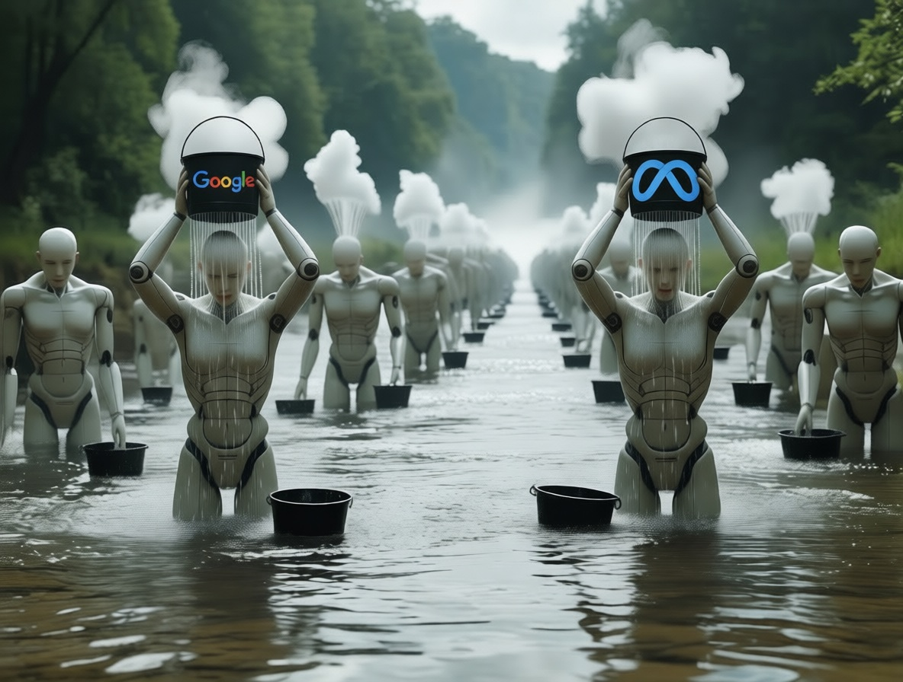
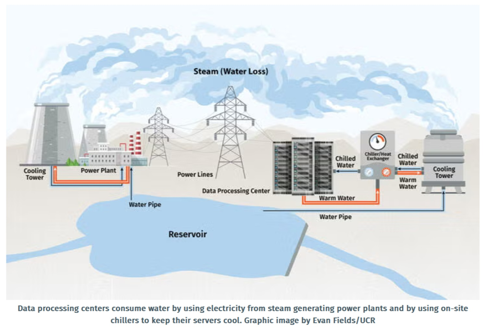
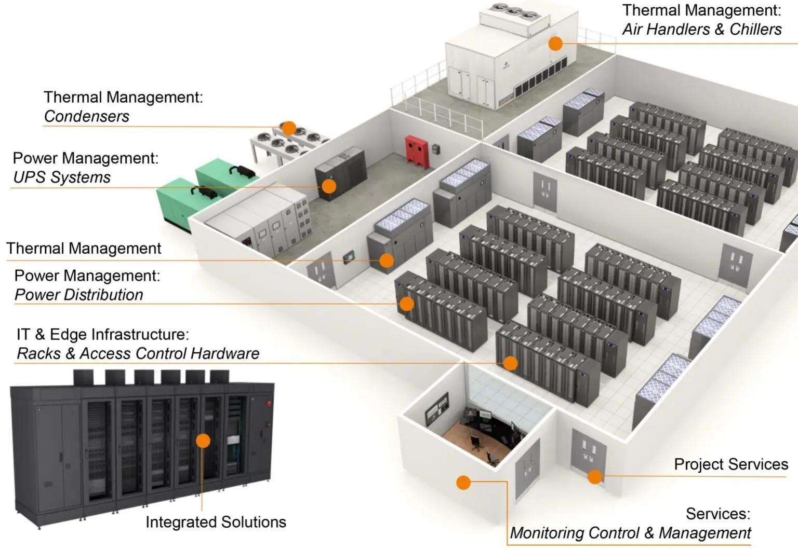
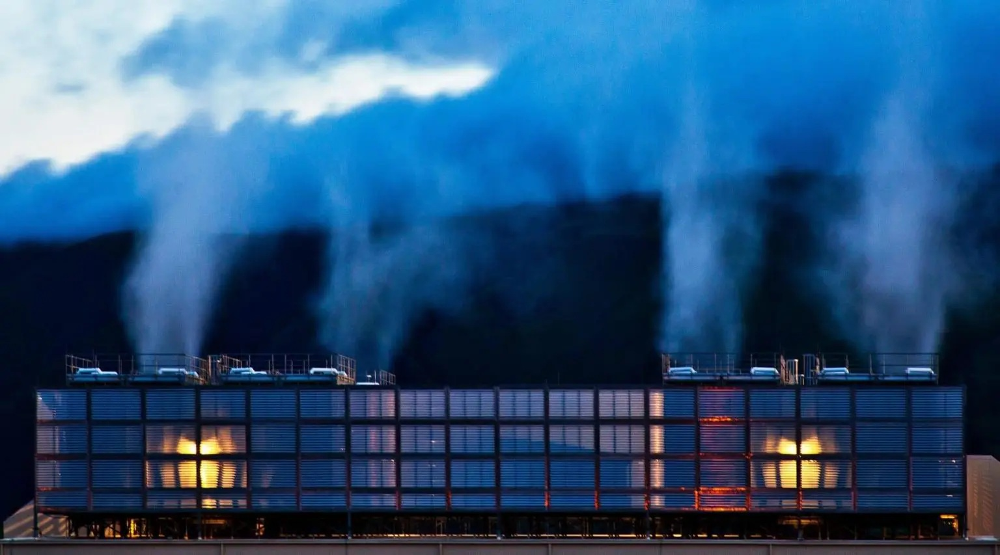

# The Thirst of Artificial Intelligence: How Datacenters Are Rewriting the Geography of Water

*When ChatGPT generates a twenty-line response, we probably don't think about water. Yet, somewhere in the world, a datacenter is evaporating about half a liter of water to allow that conversation to exist. This is not a metaphor: it's pure thermodynamics. Artificial intelligence, which seems so ethereal and immaterial when it floats on our screens, has its roots in a physical reality made of silicon, electricity, and, increasingly, water.*

The link between artificial thought and water resources is not immediately obvious, but it has a solid logic. Language models, neural networks for image recognition, recommendation systems that orchestrate our digital consumption: all of this requires computation. And computation generates heat. As William Gibson already observed in his cyberpunk novels of the 1980s, technology does not inhabit an abstract and perfect plane, but is always embodied in a material substrate with all its physical limitations. The silicon of NVIDIA H100 and A100 chips, those that power ChatGPT, Claude, Midjourney, and all other generative AI services, can reach temperatures above 80 degrees Celsius when operating at full capacity. Without an effective cooling system, these chips would shut down in minutes, literally melting.

## Anatomy of Digital Thirst

To understand why AI drinks water, we must enter the belly of a modern datacenter. Imagine a room the size of a football field, filled with two-meter-high metal racks. Each rack contains dozens of servers, each server hosts processors and GPUs performing billions of operations per second. The air is constantly filled with a deep hum, that of the fans desperately trying to dissipate the heat. But air alone is no longer enough.

Datacenters consume water mainly through two mechanisms: direct and indirect. Direct consumption occurs when water is used in [evaporative cooling systems](https://energy.ec.europa.eu/news/focus-data-centres-energy-hungry-challenge-2025-11-17_en), where water evaporates in cooling towers, removing heat from the environment. It is the same principle that makes us sweat when we are hot: evaporation removes thermal energy. In a datacenter, water circulates through heat exchangers, absorbs the heat generated by the servers, and is then pumped to cooling towers where it evaporates into the atmosphere. Indirect consumption is more subtle but just as significant: it concerns the water used to produce the electricity that powers the datacenters, especially when it comes from thermal power plants that use water to cool their systems.

The industry measures water efficiency through a metric called WUE, or Water Usage Effectiveness. It is calculated by dividing the total annual volume of water consumed (in liters) by the IT energy used (in kilowatt-hours). A WUE of 0.30 liters per kWh, [the average value achieved by Microsoft in 2024](https://www.microsoft.com/en-us/microsoft-cloud/blog/2024/07/25/sustainable-by-design-transforming-datacenter-water-efficiency/), means that for every kilowatt-hour of energy consumed by the servers, 0.30 liters of water evaporate. It may not seem like much, but when we multiply it by the gigawatts consumed by a modern datacenter, the numbers become staggering.

The situation has worsened with the advent of AI. Machine learning workloads are much more intensive than traditional loads: a query to GPT-4 requires about 10 times more computing power than a Google search. According to a [study published in 2023](https://news.ucr.edu/articles/2023/04/28/ai-programs-consume-large-volumes-scarce-water) by researchers at the University of California, Riverside, and the University of Texas, training GPT-3 consumed about 700,000 liters of water, equivalent to what is needed to produce 320 Tesla cars. And that was GPT-3: subsequent models are orders of magnitude larger and thirstier.

The problem is that not all datacenters are the same. The amount of water they consume depends on variable factors: the local climate, the efficiency of the infrastructure, the type of workloads. A datacenter in Arizona, where summer temperatures exceed 40 degrees, will consume much more water than one in Finland, where cold air can be used for natural cooling for a good part of the year. This variability makes it difficult to make precise estimates, but it also makes it clear that geography matters: building a datacenter in the desert has a very different water cost than building one near the Arctic Circle.

[Image from news.ucr.edu](https://news.ucr.edu/articles/2023/04/28/ai-programs-consume-large-volumes-scarce-water)

## The Numbers of the Present

How much does artificial intelligence drink, exactly? The [European Commission estimates](https://energy.ec.europa.eu/news/focus-data-centres-energy-hungry-challenge-2025-11-17_en) that in 2024, European datacenters consumed about 70 terawatt-hours of electricity. The International Energy Agency projects that this figure will grow to 115 terawatt-hours by 2030, with AI as the main driver of growth. Globally, the IEA calculates that datacenters are responsible for about 415 terawatt-hours per year, equal to 1.5% of the world's electricity consumption, a number set to double to 945 terawatt-hours by the end of the decade.

But electricity is only half the story. [Google revealed](https://dgtlinfra.com/data-center-water-usage/) that in 2024 its datacenters consumed a total of about 6.6 billion gallons of water (25.1 billion liters), with a net consumption of 5.2 billion gallons after subtracting discharged water. The company's thirstiest datacenter is in Council Bluffs, Iowa, where 1 billion gallons were consumed in 2024, enough to supply all the residents of Iowa for five days. In contrast, the datacenter in Pflugerville, Texas, consumed only 10,000 gallons, demonstrating how much technological and climatic choices can make a difference.

[Meta reported](https://dgtlinfra.com/data-center-water-usage/) that its datacenters consumed 663 million gallons of water (2.5 billion liters) in 2023, with 95% of the company's total consumption concentrated in digital infrastructure. Microsoft, which operates about 300 datacenters globally, recorded [an average consumption of about 33 million gallons per datacenter per year](https://www.geekwire.com/2024/microsoft-shares-new-data-center-design-featuring-a-closed-loop-water-system-for-cooling/) before recent optimizations.

These numbers, impressive in absolute terms, become even more significant when we compare them with local consumption. In The Dalles, Oregon, where Google operates one of its largest datacenters, [the company consumes 29% of the entire city's water supply](https://www.datacenterdynamics.com/en/news/we-now-know-how-much-water-googles-oregon-data-centers-use-after-city-drops-lawsuit-against-journalists/). In 2021, the datacenter used 355 million gallons, a threefold increase compared to 2017 when it stood at 124 million. The city, located along the Columbia River but in a meteorologically arid region, had to face a 13-month legal battle before these data were made public: Google and the municipality argued that they were "trade secrets." Only after the intervention of the judicial district and pressure from the Reporters Committee for Freedom of the Press were [the numbers disclosed](https://businessjournalism.org/2023/11/oregonian-data-centers/).

[Image from dgtlinfra.com](https://dgtlinfra.com/data-center-water-usage/)

## Geography of Conflict: Where Water Meets Chips

The tension between technological development and water resources is not an abstract problem: it manifests in tangible conflicts, with precise names and geographical coordinates. The Dalles is a case in point, but it is not isolated. Throughout the Western world, local communities find themselves having to negotiate between economic promises and environmental sustainability.

In Newton County, Georgia, Meta has built a datacenter that [consumes about 10% of the entire county's water](https://cee.illinois.edu/news/AIs-Challenging-Waters). In Aragon, Spain, Amazon has requested a 48% increase in its water consumption to expand its facilities, bringing the total to over 500 million liters per year in a region already affected by recurrent droughts. Local authorities had to balance the 1,200 jobs promised with the protests of farmers and environmentalists.

Texas is perhaps the most intense battleground. The Houston Advanced Research Center estimated that between 2025 and 2030, the state's datacenters will consume between 49 and 399 billion gallons of water, a huge range that reflects the uncertainty about the development of AI. Microsoft is building a plant in Goodyear, Arizona, which has sparked fierce criticism: in a region facing a twenty-year "megadrought," according to Professor Christopher Castro of the University of Arizona, a single datacenter consuming 1.75 million gallons a day appears to many as an ecological absurdity.

The issue is not just about the absolute quantity, but also about the competition for scarce resources. [A study by Virginia Tech](https://www.sciencedirect.com/science/article/abs/pii/S0921344925001892) revealed that one-fifth of American datacenters draw from water basins already under stress, classified as moderately or highly stressed. In these contexts, every gallon used to cool chips is a gallon taken away from agriculture, river ecosystems, and domestic consumption. The Dog River, which supplies The Dalles, is home to endangered fish species: the doubling of the city's consumption between 2002 and 2021, mainly due to Google, has put these ecosystems at concrete risk.

The dynamic is reminiscent, in some ways, of the tensions surrounding lithium extraction in South America: technologies that promise a more sustainable future (electric vehicles there, computational efficiency here) but extract their price from local communities and fragile environments. It is no coincidence that in The Dalles, some residents have started calling Google a "water vampire," as [reported by IT Pro](https://www.itpro.com/server-storage/data-centres/369767/google-data-centre-soaks-up-a-third-of-oregon-citys-water-supply).

[The Dalles, Oregon, data center releases water vapor from its cooling towers. Image from dgtlinfra.com](https://dgtlinfra.com/data-center-water-usage/)

## Terrestrial Solutions: From Air to Liquid

Faced with the exponential growth in demand, the datacenter industry is exploring solutions ranging from incremental optimization to radical revolution. The strategies can be classified along a spectrum from evolutionary to disruptive.

The most conservative approach is the improvement of existing systems. Microsoft announced in 2024 that it had [reduced its WUE by 39% compared to 2021](https://www.microsoft.com/en-us/microsoft-cloud/blog/2024/07/25/sustainable-by-design-transforming-datacenter-water-efficiency/), reaching 0.30 liters per kilowatt-hour through operational audits that eliminated 90% of water waste instances and the expansion of the use of recycled or reclaimed water in Texas, Washington, California, and Singapore. Google has optimized its evaporative cooling systems to the point that the datacenter in Pflugerville, Texas, consumes only 10,000 gallons annually, a result achieved by leveraging the local climate and advanced thermal management technologies.

But the most significant innovation concerns the transition to direct liquid cooling. Unlike traditional evaporative systems, liquid cooling brings the coolant into direct contact with the heat-generating components, eliminating or drastically reducing evaporation. There are several variants of this technology: direct-to-chip liquid cooling, where thin tubes carry coolant directly to the processors; the rear-door heat exchanger, where heat exchangers are mounted on the back of the racks; and immersion cooling, where entire servers are immersed in non-conductive dielectric fluids.

[Microsoft announced in August 2024](https://www.microsoft.com/en-us/microsoft-cloud/blog/2024/12/09/sustainable-by-design-next-generation-datacenters-consume-zero-water-for-cooling/) that all its new datacenters will use "zero water evaporation for cooling" designs. The system recycles water in a closed loop: the liquid absorbs heat from the chips, is cooled by chillers, and returns to the circuit without ever evaporating. This technology, which will be piloted in Phoenix and Mt. Pleasant, Wisconsin, starting in 2026, is expected to prevent the evaporation of over 125 million liters per year per datacenter. The sites designed with this system will become operational from the end of 2027.

Immersion cooling represents the extreme end of this approach. Servers are literally immersed in tanks filled with dielectric oil, synthetic fluids that do not conduct electricity but transfer heat with extreme efficiency. [Intel has conducted experiments](https://www.datacenterfrontier.com/cooling/article/55130995/turn-up-the-volume-data-center-liquid-immersion-cooling-advancements-so-far-in-2024) with 24 Xeon servers immersed in synthetic oil in its Hillsboro, Oregon, lab. Google has tested immersion cooling for its TPU v5p chips. The global immersion cooling market, [valued at $426.56 million in 2024](https://straitsresearch.com/report/immersion-cooling-market-in-data-centers), is expected to reach $2.9 billion by 2033, with an annual growth of 23.81%.

Overall liquid cooling, including all variants, shows even more impressive numbers. [According to Verified Market Research](https://www.globenewswire.com/news-release/2025/02/05/3021305/28124/en/48-42-Billion-Data-Center-Liquid-Cooling-Markets-2024-2025-and-2034-Key-Growth-Drivers-Include-Advanced-Technologies-such-as-Immersion-and-Direct-to-Chip-Cooling.html), the market has grown from $5.65 billion in 2024 to a projection of $48.42 billion by 2034, with an annual growth rate of 23.96%. NVIDIA has specified that its new generation GB200 chips will require direct-to-chip liquid cooling, effectively making the transition inevitable for next-generation AI workloads.

But liquid cooling brings its own challenges. The initial investment can exceed $50,000 per rack, about three times that of an equivalent air system. Uniform standards are still lacking: ASHRAE and TIA have released guidelines, but connector formats, sensor protocols, and coolant chemistries vary between suppliers, risking the creation of proprietary ecosystems that hinder future upgrades. Installation in existing datacenters requires complex renovations, conduits, reinforced structural supports, and leak detection systems, which often make it more practical to build from scratch.

[A liquid cooling system. Image from iconicdc.co.uk](https://iconicdc.co.uk/services/)

## Extreme Visions: From the Ocean to Orbit

When conventional solutions seem insufficient, technology tends to explore more radical frontiers. In the case of datacenters, this has meant looking beyond traditional terrestrial boundaries: underwater and into space.

Microsoft's Project Natick, launched in 2018, is probably the best-known experiment with an underwater datacenter. The idea had a fascinating logic: immerse a cylindrical container with 864 servers 36 meters deep off the coast of the Orkney Islands, Scotland, using the cold seawater as an infinite natural coolant. The project showed that underwater servers can be more reliable than terrestrial ones; failure rates were one-eighth of those in conventional facilities, likely because the hermetic environment, devoid of oxygen and humidity, reduces corrosion and thermal shocks.

However, Project Natick was officially shut down in 2024. The reasons are complex: accessibility for maintenance was problematic, installation and recovery costs were prohibitive for large-scale deployment, and regulatory uncertainties about the use of ocean spaces made the model not very scalable. Microsoft stated that it had learned valuable lessons about thermal dissipation and hardware durability but decided to focus its efforts on conventional liquid cooling rather than pursuing underwater infrastructure.

If the ocean has proven more complicated than expected, space is emerging as a genuinely active frontier. In November 2024, [China Telecom launched Starcloud-1](https://www.datacenterfrontier.com/cooling/article/55130995/turn-up-the-volume-data-center-liquid-immersion-cooling-advancements-so-far-in-2024), the first commercial satellite datacenter equipped with NVIDIA H100 GPUs, designed to run AI workloads in low Earth orbit. The idea is to use the vacuum of space as a perfect heat sink: heat is radiated directly into space through radiators, without the need for water or air.

Google is developing Project Suncatcher, planned for 2027, which aims to combine orbital solar panels with computing capabilities, completely eliminating dependence on terrestrial power grids. Several startups, including Lumen Orbit and Orbital Assembly, are designing commercial space datacenters that could be in orbit by 2030.

But here too, physical reality imposes severe limits. A paper titled "Dirty Bits in Low-Earth Orbit" highlighted critical problems: launch costs remain prohibitive (about $10,000 per kilogram to low orbit, even with SpaceX); cosmic radiation damages electronic components much faster than on Earth; maintenance is practically impossible once in orbit; and the latency in communications with the surface, although minimal, is still higher than that of terrestrial datacenters connected via fiber optics.

As fascinating as they are, these extreme solutions mainly highlight how difficult the central problem is: managing huge amounts of heat sustainably. The fact that sending servers into space is being seriously considered says a lot about the pressure the industry is facing.

## Open Questions: The Uncertain Future

After mapping the present and glimpsing possible futures, we are left with questions that do not admit easy answers. The first concerns transparency. Despite progress in disclosure—Google and Microsoft now publish facility-level data, Meta provides detailed reporting—[many companies continue to consider water consumption proprietary information](https://www.opb.org/article/2021/09/29/google-water-data-center-the-dalles-oregon/). Amazon Web Services, the world's largest cloud provider, provides minimal aggregated data. The [European Commission has introduced](https://energy.ec.europa.eu/news/focus-data-centres-energy-hungry-challenge-2025-11-17_en) monitoring and reporting obligations for datacenters with significant consumption, but implementation remains fragmented. Without full transparency, it is impossible for local communities, regulators, and citizens to truly assess the impact and make informed decisions.

The second question concerns the trade-offs between environmental objectives. Liquid cooling drastically reduces water consumption but can slightly increase electricity consumption; in Microsoft's case, the increase is defined as "nominal," but quantitative details remain vague. If that electricity comes from fossil fuels, are we simply shifting the problem from water to the atmosphere? Furthermore, the dielectric fluids used in immersion cooling raise concerns: some contain PFAS (per- and polyfluoroalkyl substances), the so-called "forever chemicals" that persist in the environment for centuries. The industry is developing plant-based alternatives, but the transition is slow.

Third: the issue of local governance. Who decides if a datacenter can be built in a region already under water stress? The Dalles granted Google tax breaks of $260 million and privileged access to water in exchange for investments and jobs. But [residents complain](https://fortune.com/longform/google-data-center-the-dalles-oregon-water-dispute/) that the decisions were made without adequate consultation, with non-disclosure agreements that prevented public debate. How to balance economic development and the protection of common resources? Existing governance structures seem inadequate to manage global infrastructures with such intense local impacts.

Fourth: the scalability of solutions. Even assuming that liquid cooling becomes a universal standard by 2030, will it eliminate the problem? IEA projections indicate that the demand for computational capacity will continue to grow exponentially, not only for AI but for IoT, 5G, augmented reality, and quantum computing. Each new technology promises to be "more efficient," but the absolute volume of computation grows faster than efficiency. It's Jevons' paradox applied to the digital age: increasing energy efficiency often leads to greater total consumption because it makes computation cheaper and therefore more used.

Finally, there is the deepest ethical question. What is the value of a query to ChatGPT? What is the value of a video generated by Sora? If producing an image with Midjourney consumes the water equivalent of a short shower, how should we think about our daily use of these tools? We are not proposing moralistic answers—technology is neither intrinsically good nor bad—but awareness of the material cost should inform our choices, both as individuals and as a society.

Artificial intelligence has accustomed us to thinking in terms of abstractions: models, parameters, tokens, latency. But beneath those abstractions pulses a physical reality made of evaporating water, flowing electricity, and heating silicon. The Dalles, with its cooling towers puffing steam along the Columbia River, is as much a part of the AI infrastructure as OpenAI's algorithms or NVIDIA's chips. Perhaps it's time to stop thinking of the cloud as something ethereal and start seeing it for what it is: a material network with material consequences, that drinks, sweats, and thirstily continues to grow.
