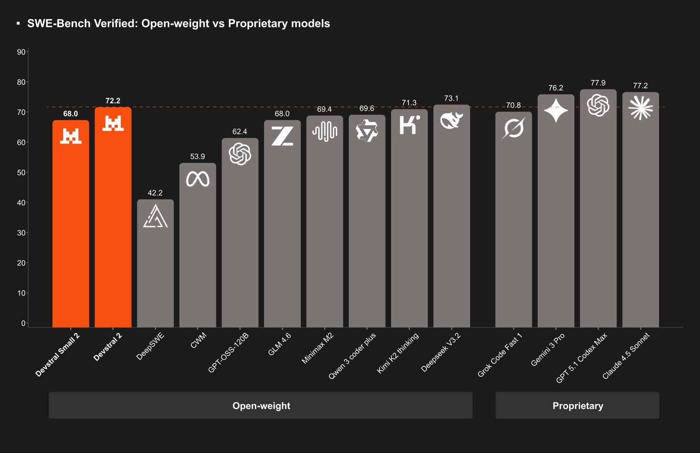
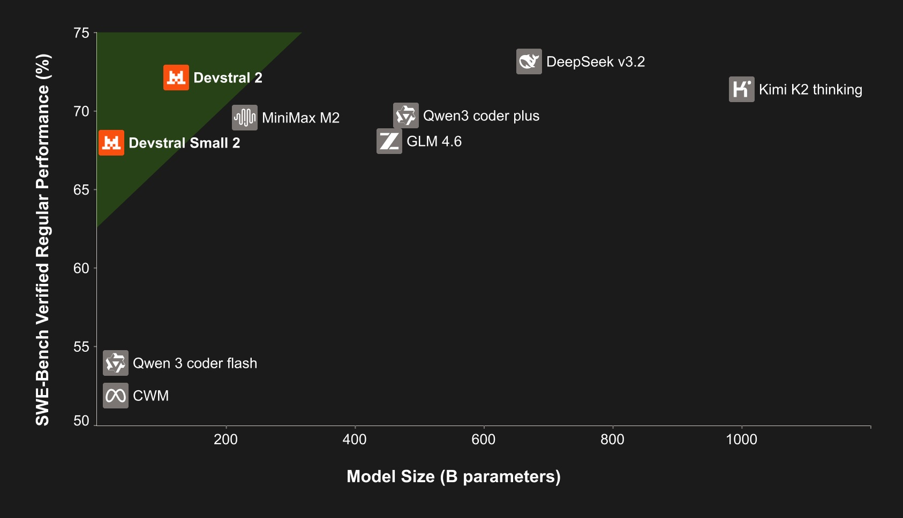

# Mistral Devstral 2 et le rêve souverainiste de l'Europe dans l'IA

*Le 9 décembre 2025, alors que le monde de l'intelligence artificielle regardait le défi entre les États-Unis et la Chine, [Mistral AI](https://mistral.ai/news/devstral-2-vibe-cli) a joué sa carte : Devstral 2, un modèle de 123 milliards de paramètres conçu pour le codage d'entreprise. Ce n'est pas seulement une nouvelle sortie d'un grand modèle de langage, mais la tentative la plus ambitieuse de l'Europe de prouver que le jeu mondial de l'IA n'est pas encore terminé. Alors que Washington met sur la table les budgets gigantesques d'OpenAI et de Mountain View, et que Pékin répond avec l'offensive de [Kimi K2](https://aitalk.it/it/kimi-k2-thinking.html) et de DeepSeek, la startup française fondée par d'anciens chercheurs de Google DeepMind et de Meta essaie de construire une troisième voie : des modèles puissants mais compacts, à poids ouvert mais commercialement viables, européens par ADN mais mondiaux dans leurs ambitions.*

La question est de savoir si cette approche peut réellement fonctionner ou si elle représente un énième vœu pieux d'un continent qui risque de rester spectateur de la révolution technologique la plus importante du siècle. Devstral 2 arrive à un moment particulier : l'Europe a des règles claires avec l'AI Act, des financements conséquents via Horizon Europe et French Tech, et des talents techniques de premier ordre. Mais elle continue de dépendre structurellement du matériel NVIDIA pour l'entraînement et l'inférence, voit ses meilleurs cerveaux émigrer vers la Silicon Valley et peine à créer des champions capables de rivaliser avec les budgets de plusieurs milliards de dollars des géants américains. Mistral, valorisée à [11,7 milliards d'euros](https://mistral.ai/news/mistral-ai-raises-1-7-b-to-accelerate-technological-progress-with-ai) après le tour de table de série C mené par ASML, est devenue le symbole de cette contradiction : techniquement brillante, financièrement solide pour les normes européennes, mais microscopique par rapport à ses rivaux d'outre-Atlantique.

## Des chiffres de chuchoteur de code

Commençons par les données techniques, car c'est à partir de là que se mesurent les ambitions. Devstral 2 est un transformateur dense de 123 milliards de paramètres avec une fenêtre de contexte de 256 000 jetons, une taille qui permet de traiter des bases de code entières sans perdre le fil. L'architecture dense, contrairement aux mélanges d'experts qui répartissent la charge de calcul entre des sous-réseaux spécialisés, active tous les paramètres pour chaque requête. Un choix qui sacrifie l'efficacité de calcul pour maximiser la cohérence des réponses, particulièrement critique lorsque l'on travaille sur des projets logiciels complexes où chaque morceau de code doit dialoguer avec le reste.

Le benchmark clé pour les modèles de codage est [SWE-bench Verified](https://huggingface.co/mistralai/Devstral-2-123B-Instruct-2512), un test qui mesure la capacité à résoudre des problèmes réels extraits de dépôts GitHub. Devstral 2 atteint 72,2 %, un résultat qui le positionne comme le meilleur modèle à poids ouvert disponible. Pour contextualiser : DeepSeek V3.2, le champion chinois de 671 milliards de paramètres, atteint 73,1 %, tandis que Kimi K2 Thinking, avec ses 1 000 milliards de paramètres répartis dans une architecture de mélange d'experts, atteint 71,3 %. Devstral 2 est cinq fois plus petit que DeepSeek et huit fois plus compact que Kimi K2, et pourtant il les talonne de près ou même les dépasse. C'est comme voir une Lotus Elise suivre le rythme d'une Ferrari Enzo dans les virages : c'est le rapport poids/puissance qui compte, pas seulement les chevaux sous le capot.

Mais il y a un écart à reconnaître honnêtement : Claude Sonnet 4.5 d'Anthropic atteint 77,2 % sur SWE-bench Verified, tandis que les systèmes les plus avancés d'OpenAI (GPT 5.1 Codex Max) atteignent 77,9 %. La distance entre Devstral 2 et les champions propriétaires américains existe et n'est pas marginale. Mistral elle-même l'admet dans les [évaluations humaines comparatives](https://mistral.ai/news/devstral-2-vibe-cli) menées via Cline, où Devstral 2 bat DeepSeek V3.2 avec une préférence de 42,8 % contre 28,6 %, mais perd nettement contre Claude Sonnet 4.5. L'Europe peut produire des modèles compétitifs, mais la frontière absolue reste, pour l'instant, l'apanage des modèles fermés américains.

À côté du produit phare, Mistral lance également Devstral Small 2, un modèle de 24 milliards de paramètres qui atteint 68 % sur SWE-bench Verified. L'intérêt ici n'est pas tant dans les performances absolues que dans la déployabilité : Small 2 fonctionne sur un seul GPU grand public haut de gamme, rendant le codage par IA accessible même aux développeurs et aux petites entreprises qui ne peuvent pas se permettre des clusters de H100. C'est le même principe qui a fait le succès de Linux : apporter des capacités d'entreprise sur du matériel grand public. Sur des benchmarks plus standards comme HumanEval et LiveCodeBench, Devstral 2 se comporte en ligne avec des concurrents de taille similaire, confirmant que la véritable innovation ne réside pas dans l'invention de nouvelles architectures miraculeuses, mais dans l'optimisation de l'entraînement pour extraire le maximum de modèles plus compacts.

L'écosystème est complété par [Mistral Vibe CLI](https://github.com/mistralai/mistral-vibe), un agent en ligne de commande qui transforme Devstral en un assistant de codage interactif. Vibe peut explorer des bases de code, modifier plusieurs fichiers, exécuter des commandes shell et gérer Git, le tout orchestré par des conversations en langage naturel. Ce n'est pas le premier agent CLI au monde — des outils comme Cline, Cursor et Kilo Code existaient déjà —, mais c'est le premier construit spécifiquement pour un modèle européen à poids ouvert, avec une attention particulière à la confidentialité et à la possibilité de déploiement sur site. Dans un continent obsédé par le RGPD, pouvoir exécuter un assistant de codage sur ses propres serveurs sans envoyer une seule ligne de code vers les clouds américains a une valeur qui dépasse les métriques techniques.

[Image de mistral.ai](https://mistral.ai/news/devstral-2-vibe-cli)

## Ouvert mais pas trop

Sur le front des licences, Mistral joue un jeu hybride qui en dit long sur sa stratégie. Devstral Small 2 est publié sous la licence Apache 2.0, la norme de facto de l'open source d'entreprise : elle autorise toute utilisation, y compris commerciale, en demandant uniquement de conserver les attributions. C'est la même licence que React, Kubernetes, TensorFlow. Devstral 2, quant à lui, utilise une licence MIT modifiée avec un plafond de revenus : si votre entreprise réalise un chiffre d'affaires supérieur à 20 millions de dollars par mois, vous devez négocier une licence commerciale avec Mistral. C'est une démarche qui cherche à équilibrer l'accessibilité pour les startups et les chercheurs avec la nécessité de monétiser les déploiements en entreprise.

La tarification via l'API suit une logique similaire : [gratuite au départ](https://console.mistral.ai/), puis 0,40 dollar par million de jetons d'entrée et 2 dollars en sortie pour Devstral 2, descendant à 0,10 et 0,30 dollar pour Small 2. Comparé à Claude Sonnet 4.5 (3 et 15 dollars respectivement), Mistral coûte environ un septième. L'entreprise française déclare que Devstral 2 est "jusqu'à 7 fois plus rentable que Claude Sonnet pour des tâches réelles", un slogan qui a du sens si l'on considère non seulement le prix par jeton mais aussi la compacité du modèle, qui nécessite moins d'étapes pour accomplir des opérations complexes.

Cette stratégie hybride – certains modèles Apache 2.0, d'autres avec des restrictions commerciales, une tarification agressive mais pas gratuite pour toujours – rappelle l'approche d'entreprises comme Red Hat dans les années 2000 : open source si possible, monétisation sur le support d'entreprise et les fonctionnalités avancées. C'est un modèle qui a fonctionné dans le logiciel traditionnel, mais dans l'IA, le jeu est plus complexe : les coûts d'entraînement sont des ordres de grandeur supérieurs à ceux du développement logiciel, et les concurrents propriétaires peuvent se permettre de vendre à perte pendant des années grâce aux trésors de guerre des géants de la technologie.

L'accessibilité des poids du modèle sur [Hugging Face](https://huggingface.co/mistralai/Devstral-2-123B-Instruct-2512) et la compatibilité avec des frameworks standards comme vLLM et Transformers démocratisent l'accès, mais soulèvent également des questions de durabilité : si n'importe qui peut télécharger les poids et faire de l'inférence en local, comment financer les cycles d'entraînement suivants ? Mistral compte sur le fait que la plupart des entreprises préféreront payer pour des API gérées plutôt que de gérer l'infrastructure en interne, suivant la même logique qui pousse de nombreuses entreprises à utiliser AWS au lieu de construire leurs propres centres de données. Mais c'est un pari, pas une certitude.

[Image de mistral.ai](https://mistral.ai/news/devstral-2-vibe-cli)

## La voie européenne selon Floridi

Pour comprendre où se situe Mistral dans le débat plus large sur la souveraineté technologique européenne, il convient de revenir aux réflexions de Luciano Floridi, philosophe de l'information qui enseigne entre Yale, Bologne et Oxford, où il a dirigé pendant des années le Digital Ethics Lab. Floridi, qui a contribué aux lignes directrices éthiques de la Commission européenne pour l'IA et préside aujourd'hui la Fondation Leonardo, a développé ces dernières années une vision particulière du rôle que l'Europe pourrait jouer dans la course à l'intelligence artificielle.

Sa thèse part d'un constat inconfortable : l'Europe subit le partage du marché de l'IA entre les États-Unis et la Chine, se réduisant à être spectatrice d'un jeu qui se joue ailleurs. Mais selon Floridi, il existe une alternative concrète, qui passe par l'open source associé à la force normative européenne. Le continent pourrait transformer ce qui est perçu comme un obstacle, la réglementation stricte incarnée par l'AI Act, en une valeur différenciatrice sur le marché mondial. Un label européen de sécurité réglementaire, de conformité à la protection des données, de transparence sur les droits d'auteur, tout cela non pas comme une réaction défensive mais comme une promotion active du "made in Europe" technologique.

La vision de Floridi envisage une dimension open source européenne qui pourrait se configurer comme un quatrième pôle mondial, distinct des États-Unis, de la Chine et du reste du monde. Il ne s'agit pas de rivaliser frontalement avec les budgets américains ou avec l'échelle industrielle chinoise, mais d'offrir quelque chose que ni Washington ni Pékin ne peuvent facilement reproduire : des systèmes d'IA ouverts, garantis par un cadre législatif solide, avec des coûts compétitifs précisément parce qu'ils sont open source. C'est mieux que les Chinois parce qu'il intègre des règles éthiques et de sécurité par conception, mieux que les Américains parce qu'il est open source au lieu d'être fermé et propriétaire.

L'idée est qu'il existe un univers de pays et d'entreprises qui pourraient préférer un système open source européen, garanti par la législation de l'UE, à un système fermé américain qui coûte des sommes prohibitives et soulève des questions sur la gestion des données. Floridi suggère de transformer le moment réglementaire d'un frein potentiel à une valeur ajoutée : si ceux qui achètent de l'intelligence artificielle européenne savent qu'elle est construite dans un contexte qui offre des garanties supplémentaires en plus d'un produit à des coûts super compétitifs, alors la réglementation devient un atout concurrentiel au lieu d'un handicap.

Cette vision, aussi fascinante soit-elle intellectuellement, se heurte à des réalités difficiles. La première : le matériel. Tous les modèles de Mistral, y compris Devstral 2, sont entraînés sur des GPU NVIDIA, probablement des H100 ou des A100, toutes conçues en Californie et fabriquées (au mieux) à Taïwan. L'Europe n'a pas d'équivalent à NVIDIA, et les tentatives de créer des puces d'IA souveraines, comme le projet soutenu par ASML de Mistral lui-même, en sont encore à leurs débuts. Sans contrôle de la pile matérielle, la souveraineté technologique reste partielle.

La deuxième réalité : les talents. Mistral a été fondée par des chercheurs qui se sont formés et ont travaillé dans des entreprises américaines (DeepMind, Meta). La fuite des cerveaux continue d'être principalement vers l'ouest, avec des salaires et des opportunités que l'Europe peine à reproduire. La troisième : l'échelle. Même en tenant compte du brillant tour de table de série C de 1,7 milliard d'euros mené par ASML, Mistral a levé environ 2,8 milliards au total depuis sa création. OpenAI a levé plus de 14 milliards, Anthropic environ 10 milliards. La disparité des ressources se traduit par une disparité des capacités d'entraînement, qui à long terme pèse plus que l'ingéniosité algorithmique.

Et pourtant, l'approche de Mistral a des mérites indéniables. L'entreprise a montré qu'il est possible de construire des modèles compétitifs avec une fraction des ressources de ses concurrents américains, en exploitant des architectures plus efficaces et des ensembles de données plus soignés. Elle a montré que le poids ouvert n'est pas incompatible avec un modèle économique viable, du moins en théorie. Et elle a créé un écosystème de développeurs qui ne dépend pas des plateformes américaines : [Vibe CLI](https://github.com/mistralai/mistral-vibe), les poids sur Hugging Face, l'intégration avec vLLM, tout cela crée des alternatives concrètes aux flux de travail dominés par GitHub Copilot, ChatGPT ou Claude.

Le point crucial soulevé par Floridi concerne précisément cette possibilité de construire une alliance entre une réglementation intelligente et l'innovation open source. Si l'AI Act était mis en œuvre non pas comme une liste d'interdictions mais comme un cadre qui certifie la qualité des systèmes d'IA — transparence, équité, protection de la vie privée dès la conception —, alors les entreprises européennes auraient un avantage concurrentiel sur tous les marchés qui regardent avec méfiance les systèmes américains (pour des raisons de confidentialité et de monopole) ou chinois (pour des raisons géopolitiques). L'Amérique du Sud, l'Afrique, une partie de l'Asie, et même des segments du marché américain plus sensibles à la vie privée pourraient préférer une alternative européenne certifiée.

Mistral tente exactement cela : construire des systèmes d'IA techniquement compétitifs, ouverts si possible, alignés sur les réglementations européennes par conception. Devstral 2 ne collecte pas de données d'entraînement sans consentement, n'est pas distribué pour des usages militaires selon ses licences, et respecte les principes de transparence de l'AI Act. Ce sont des contraintes que les autres n'ont pas ou ne respectent pas, mais qui pourraient devenir des arguments de vente sur un marché de plus en plus attentif aux questions éthiques.

[Image de mistral.ai](https://mistral.ai/news/devstral-2-vibe-cli)

## Le paradoxe du champion local

Il y a cependant un paradoxe de fond qu'aucun récit enthousiaste ne peut complètement cacher. Mistral AI, avec sa valorisation de 11,7 milliards d'euros et ses quelque 500 employés, est la plus grande licorne européenne de l'IA. Mais dans le contexte mondial, elle reste une startup de taille moyenne. OpenAI est valorisée à plus de 150 milliards de dollars et emploie des milliers de personnes. Anthropic avoisine les 18 milliards de valorisation. Google DeepMind dispose de ressources essentiellement illimitées. Même les concurrents chinois comme DeepSeek opèrent avec le soutien implicite ou explicite de l'État chinois, qui considère l'IA comme une question de sécurité nationale.

La géographie des talents de l'IA raconte une histoire similaire. Les trois fondateurs de Mistral, Arthur Mensch, Guillaume Lample, Timothée Lacroix, se sont formés et ont acquis une expérience critique respectivement chez Google DeepMind et Meta AI Research. Le modèle est similaire à celui d'Anthropic, fondée par d'anciens d'OpenAI, ou de Cohere, fondée par d'anciens de Google Brain. Les meilleurs laboratoires de recherche restent concentrés en Californie, et même lorsque des excellences européennes comme DeepMind (britannique) ou Mistral (française) voient le jour, elles finissent par être rachetées (DeepMind par Google) ou fortement influencées par des investisseurs américains (Mistral compte parmi ses investisseurs Andreessen Horowitz, General Catalyst, Lightspeed, NVIDIA).

Sur le front des clients d'entreprise, Mistral a obtenu des contrats importants : le ministère français de la Défense, BNP Paribas, Orange, CMA-CGM pour 100 millions d'euros sur cinq ans. Ce sont des victoires importantes qui démontrent l'attrait du produit. Mais si l'on regarde l'échelle, Microsoft et OpenAI ont des accords avec la quasi-totalité des entreprises du Fortune 500, Google Cloud intègre ses propres modèles dans des dizaines de milliers d'entreprises, et AWS propose Bedrock avec les modèles d'Anthropic. Le marché mondial des entreprises est déjà largement dominé par les géants américains, et les déloger nécessite non seulement de meilleurs produits, mais des écosystèmes complets : outils de développement, intégrations, support, écosystème de partenaires.

La dépendance à l'égard de NVIDIA est peut-être l'aspect le plus frappant. Le tour de table de série C mené par ASML, le fabricant néerlandais de machines de lithographie EUV (ultraviolet extrême) essentielles à la fabrication de puces avancées, témoigne de la volonté de construire une chaîne d'approvisionnement plus européenne. Mais ASML elle-même dépend de composants américains et japonais, et dans tous les cas, le chemin pour produire des GPU d'IA compétitifs avec ceux de NVIDIA prend des années, voire des décennies. En attendant, chaque modèle de Mistral s'entraîne sur du silicium américain, créant une dépendance structurelle qu'aucun discours souverainiste ne peut vraiment contourner.

Il y a ensuite la question des ensembles de données. Les modèles d'IA se nourrissent de données, et la plupart des données de qualité — code open source sur GitHub, contenu web, conversations — sont produites dans des écosystèmes dominés par des plateformes américaines. GitHub appartient à Microsoft, Reddit a des accords de licence avec OpenAI, Stack Overflow a vendu les données de sa communauté. L'Europe produit du contenu de qualité, mais elle ne contrôle pas les plateformes où ce contenu est agrégé et structuré. Ici aussi, la souveraineté technologique se révèle partielle.

Et pourtant, malgré tous ces paradoxes et ces limites structurelles, l'expérience de Mistral reste significative. Elle démontre qu'il est possible de construire une technologie d'IA de pointe en dehors de la Silicon Valley, que l'open source peut coexister avec des modèles économiques viables, et qu'il existe des talents et des capitaux européens prêts à parier sur ce défi. Devstral 2, avec ses performances compétitives et ses 123 milliards de paramètres concentrés dans un boîtier efficace, est la preuve la plus tangible que l'Europe peut jouer ce jeu.

La question ouverte est de savoir si elle peut le gagner. Ou si, de manière plus réaliste, elle peut se tailler un espace suffisamment grand pour garantir que l'avenir de l'IA ne soit pas un duopole États-Unis-Chine. La voie européenne imaginée par Floridi — la réglementation comme atout, l'open source comme différenciateur — est un pari intellectuellement cohérent. Mais les paris, par définition, peuvent être gagnés ou perdus. Et à l'heure actuelle, avec les ressources déployées sur la table, la table elle-même reste dominée par des joueurs qui parlent anglais et mandarin.

En attendant, pour les développeurs européens et pour les entreprises qui veulent des alternatives aux systèmes propriétaires américains, Devstral 2 représente une option concrète. Un modèle à poids ouvert que vous pouvez exécuter sur vos propres serveurs, inspecter, modifier, intégrer dans vos flux de travail sans dépendre d'API contrôlées par d'autres entreprises. Ce n'est pas la solution définitive au problème de la souveraineté technologique, mais c'est un pas dans la bonne direction. Dans un secteur qui évolue à la vitesse de la lumière, même un pas peut faire la différence entre rester dans la course ou être définitivement distancé par le groupe de tête.

Le défi pour Mistral dans les années à venir sera double : continuer à produire des modèles qui suivent le rythme des progrès d'OpenAI, d'Anthropic et de DeepSeek, et en même temps construire un écosystème européen assez fort pour ne pas être absorbé ou marginalisé par les géants mondiaux. Devstral 2 est un bon début, mais ce n'est qu'un début. Le reste de l'histoire sera écrit par les prochaines versions, les prochains partenariats, et surtout par la capacité de l'Europe à transformer la vision de Floridi — une réglementation éclairée plus une innovation open source — d'un concept philosophique à une réalité industrielle. Dans un jeu où chaque coup compte, et où le temps disponible pourrait être plus court que nous ne le pensons.
