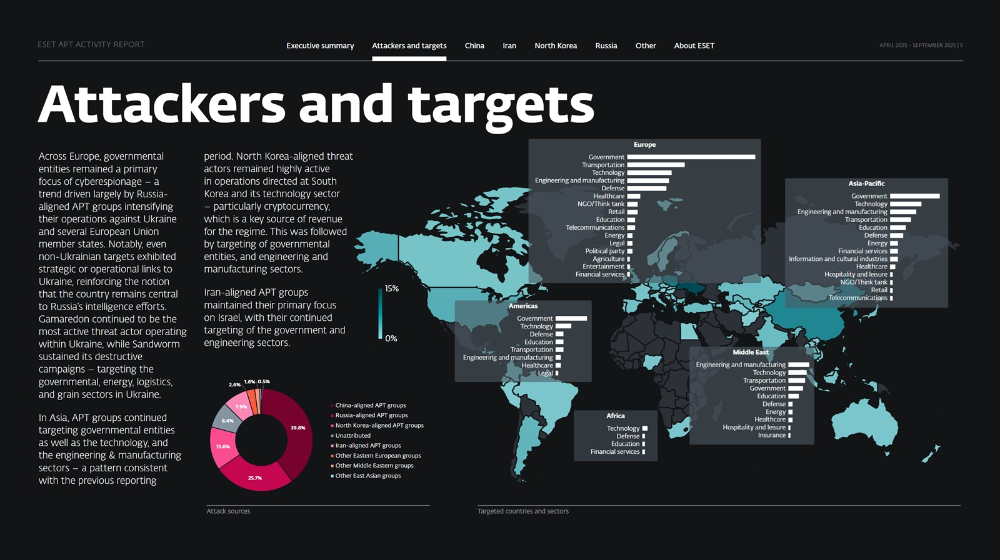
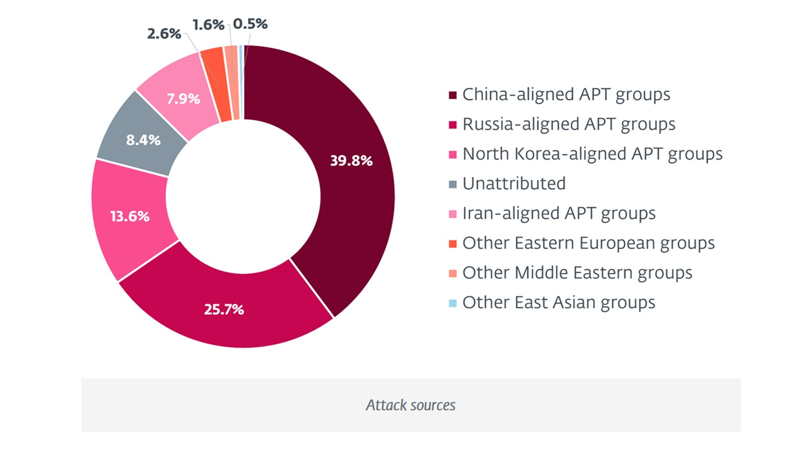

# À l'intérieur du rapport ESET qui redessine la carte du risque cybernétique pour 2026

*Quand, en 1987, deux programmateurs slovaques, Rudolf Hrubý et Peter Paško, ont créé le premier antivirus capable de neutraliser le virus Vienna, ils n'imaginaient pas que leur créature deviendrait l'un des observateurs privilégiés des guerres numériques du XXIe siècle. ESET, depuis la petite Bratislava, a grandi au point de disposer aujourd'hui de [treize centres de recherche et développement répartis dans le monde](https://www.eset.com/us/about/) et d'une télémétrie qui surveille les menaces à l'échelle planétaire. C'est comme avoir un système de radars distribué sur chaque continent, toujours allumé, toujours à l'écoute.*

Deux fois par an, ESET publie ses [Rapports d'Activité sur les APT](https://web-assets.eset.com/fileadmin/ESET/IT_2/eset-apt-activity-report-q2-2025-q3-2025.pdf), des documents qui distillent des mois d'enquêtes sur les groupes de Menaces Persistantes Avancées, ces formations cybernétiques parrainées par des États-nations qui opèrent dans l'ombre à des fins d'espionnage, de sabotage ou de profit. Le rapport couvrant la période d'avril à septembre 2025 n'est pas une simple compilation d'incidents : c'est une cartographie des tensions géopolitiques de notre temps, tracée à travers des lignes de code plutôt que des frontières physiques. Chaque attaque documentée, chaque nouveau malware analysé, chaque victime identifiée raconte une histoire plus large de rivalité entre puissances, de guerres par procuration numériques, d'économies parallèles basées sur des crypto-monnaies volées.

Mais il y a une anomalie dans ce rapport qui mérite une attention particulière, quelque chose qui, il y a quelques mois encore, aurait semblé impossible : la première collaboration documentée entre deux groupes russes traditionnellement rivaux. Pour en comprendre la signification, nous devons regarder au-delà des aspects techniques et nous demander ce que cela nous dit sur les changements en cours dans l'écosystème de la cyberguerre.

## L'anomalie russe : quand Gamaredon rencontre Turla

Les chercheurs d'ESET [ont observé quelque chose d'inédit](https://www.welivesecurity.com/en/eset-research/eset-apt-activity-report-q2-2025-q3-2025/) en septembre 2025 : des implants du groupe Gamaredon, connus pour leur activité frénétique contre des cibles ukrainiennes, ont été utilisés pour redémarrer et redistribuer des portes dérobées du groupe Turla, un autre acteur russe mais avec des caractéristiques et des affiliations différentes. En termes techniques, des outils comme PteroGraphin, PteroOdd et PteroPaste ont redémarré la version 3 de Kazuar, la porte dérobée distinctive de Turla, sur des machines déjà compromises en territoire ukrainien.

Pourquoi est-ce important ? Les analystes de la sécurité savent bien que les services russes sont notoirement fragmentés et en concurrence les uns avec les autres. Gamaredon est généralement associé au FSB (Federal'naja služba bezopasnosti), en particulier au Centre 18, tandis que Turla répond traditionnellement au Centre 16 du même service. Ces groupes ont des objectifs, des techniques et des ensembles d'outils différents. Gamaredon opère avec une approche "spray and pray", lançant des campagnes massives de spearphishing et mettant continuellement à jour son arsenal avec des variantes toujours nouvelles. Turla est plus sélectif, chirurgical, orienté vers des objectifs de renseignement de grande valeur.

La télémétrie d'ESET montre que [la collaboration n'a pas été indiscriminée](https://www.eset.com/us/about/newsroom/research/eset-research-apt-report-april-september-2025/) : la porte dérobée Kazuar n'a été déployée que sur un nombre restreint de machines par rapport à la vaste compromission opérée par Gamaredon. Cela suggère un déploiement sélectif sur des cibles considérées comme particulièrement précieuses, où l'accès initial fourni par Gamaredon a ouvert la voie à des opérations de deuxième niveau menées par Turla.

Mais qu'est-ce qui a poussé ces deux groupes à collaborer ? Le rapport ne spécule pas, se limitant à documenter les faits. Nous pouvons cependant faire quelques considérations. L'intensité du conflit en Ukraine pourrait avoir créé une pression telle que la coopération est devenue non seulement souhaitable mais nécessaire. Lorsque les ressources sont limitées et les objectifs multiples, même les rivalités internes cèdent le pas à des priorités partagées. Ou peut-être assistons-nous à un changement de paradigme dans l'organisation de la cyberguerre russe, où la compartimentation laisse la place à des structures plus fluides et collaboratives lorsque l'enjeu est suffisamment élevé.

Au cours de la même période, Gamaredon a encore intensifié ses opérations. Le groupe a [incorporé de nouveaux voleurs de fichiers](https://www.eset.com/it/info/eset-blog/rassegnastampa/eset-research-apt-report-aumentano-gli-attacchi-russi-contro-ucraina-ed-europa/) dans son arsenal et a commencé à exploiter des services de tunneling tels que loca.lt, loophole.site et devtunnels.ms, ainsi que des plateformes de stockage cloud légitimes comme Tebi et Wasabi pour l'exfiltration de données. Il a même expérimenté l'exploitation de la vulnérabilité CVE-2025-8088 dans WinRAR, le même zero-day que le groupe RomCom utilisait à la même période.

RomCom représente un autre cas intéressant dans le paysage russe. À la mi-juillet 2025, le groupe a [découvert et exploité une vulnérabilité zero-day](https://web-assets.eset.com/fileadmin/ESET/IT_2/eset-apt-activity-report-q2-2025-q3-2025.pdf) dans WinRAR qui permettait d'utiliser des flux de données alternatifs pour le path traversal. L'attaque était élégante dans sa simplicité : une archive contenant apparemment un seul fichier bénin qui, une fois ouverte, déployait des DLL malveillantes dans le répertoire temporaire et des liens malveillants dans le dossier de démarrage de Windows. ESET a signalé de manière responsable la vulnérabilité à WinRAR le 24 juillet, et le correctif est arrivé six jours plus tard avec la version 7.13. Les cibles ? Des entreprises des secteurs financier, manufacturier, de la défense et de la logistique en Europe et au Canada.

Pendant ce temps, Sandworm, le groupe russe lié au GRU et spécialisé dans les opérations destructrices, a maintenu son focus sur l'Ukraine avec une différence d'approche : son objectif n'est pas l'espionnage mais le sabotage. Les wipers ZEROLOT et Sting ont été déployés contre des universités, des entités gouvernementales, des entreprises énergétiques et du secteur de la logistique. Le ciblage du secteur céréalier ukrainien, l'une des principales sources de revenus du pays, est particulièrement significatif. Quel message plus clair de l'intention d'affaiblir l'économie de guerre de l'adversaire ?

## La Chine joue sur plusieurs tableaux

Si la Russie concentre ses énergies numériques sur l'Ukraine et ses alliés européens, la Chine démontre une capacité à opérer simultanément sur plusieurs fronts, reflétant la complexité de ses priorités géopolitiques. [Le rapport d'ESET identifie 39,8 % des attaques](https://web-assets.eset.com/fileadmin/ESET/IT_2/eset-apt-activity-report-q2-2025-q3-2025.pdf) de la période comme provenant de groupes alignés sur Pékin, un pourcentage significatif qui souligne le niveau de mobilisation des actifs cybernétiques chinois.

L'histoire la plus intéressante concerne FamousSparrow, un groupe déjà connu pour ses campagnes mais qui, entre juin et septembre 2025, a soudainement déplacé son focus sur l'Amérique latine. Les chercheurs d'ESET ont trouvé des traces de la porte dérobée SparrowDoor sur des machines appartenant à des entités gouvernementales en Argentine, au Guatemala, au Honduras, au Panama et en Équateur. Il ne s'agit pas d'incursions aléatoires : au Guatemala, les enquêteurs ont trouvé des preuves de l'exploitation de la vulnérabilité ProxyLogon pour l'accès initial, tandis qu'au Panama, l'utilisation d'atexec-pro, un outil open-source pour le mouvement latéral, suggère une opération bien planifiée.

Pourquoi maintenant ? Pourquoi précisément ces pays ? Le contexte géopolitique offre des indices importants. L'administration Trump a [renouvelé l'intérêt américain pour l'Amérique latine](https://www.as-coa.org/articles/what-did-trump-say-about-latin-america-his-2025-address-congress), poussant à réduire l'empreinte financière chinoise autour du canal de Panama et entamant un rapprochement avec l'Équateur, où l'influence de Pékin avait grandi les années précédentes. En février 2025, le secrétaire d'État Marco Rubio s'est rendu au Panama, amenant le président Mulino à [annoncer le retrait du pays de l'Initiative la Ceinture et la Route](https://www.cnn.com/2025/02/07/china/panama-canal-china-trump-explainer-intl-hnk/index.html) chinoise. Dans le cas du Honduras et du Guatemala, les activités pourraient être liées aux relations de ces pays avec Taïwan.

Il est raisonnable de supposer que les opérations de FamousSparrow sont une tentative de Pékin de comprendre les intentions réelles de ces gouvernements dans un paysage diplomatique en rapide évolution. Nous ne savons pas ce qu'ils cherchaient exactement, quels documents ils ont exfiltrés, quelles conversations ils ont interceptées. Mais la concentration des efforts suggère que l'Amérique latine était la priorité principale du groupe pendant ces mois.

Pendant que FamousSparrow explorait les chancelleries latino-américaines, d'autres groupes chinois démontraient une utilisation croissante de la technique de l'adversaire au milieu (adversary-in-the-middle). ESET [suit actuellement dix groupes actifs](https://web-assets.eset.com/fileadmin/ESET/IT_2/eset-apt-activity-report-q2-2025-q3-2025.pdf) utilisant cette technique, tant pour l'accès initial que pour le mouvement latéral. C'est une approche sophistiquée qui nécessite des capacités de positionnement stratégique dans le réseau, mais les résultats peuvent être dévastateurs.

SinisterEye, également connu sous le nom de LuoYu ou CASCADE PANDA, en est un exemple emblématique. Le groupe opère principalement contre des cibles en Chine, mais frappe aussi bien des entités nationales que des bureaux d'entreprises étrangères. Ayant probablement accès à l'infrastructure dorsale de l'Internet, SinisterEye intercepte et manipule les mises à jour logicielles pour distribuer WinDealer sur Windows ou SpyDealer sur Android. Entre mai et septembre 2025, il a ciblé les bureaux chinois d'une entreprise taïwanaise du secteur de la défense aéronautique, également impliquée dans l'industrie des semi-conducteurs. En août, il s'est tourné vers les représentants d'une organisation commerciale américaine à Pékin, probablement intéressé par les activités de lobbying visant à assouplir les droits de douane américains contre les pays asiatiques. En septembre, même une entité gouvernementale équatorienne a été prise pour cible.

PlushDaemon utilise une approche différente mais tout aussi efficace : il compromet des périphériques réseau tels que des routeurs et déploie EdgeStepper, un outil qui redirige le trafic DNS vers des serveurs contrôlés par les attaquants. Ces serveurs répondent aux requêtes pour des domaines associés à des infrastructures de mise à jour logicielle avec les adresses IP de serveurs web malveillants, qui finissent par servir SlowStepper, la porte dérobée distinctive du groupe. En juin, PlushDaemon a frappé les bureaux cambodgiens d'une entreprise japonaise et d'une multinationale fortement impliquée dans des projets liés à l'Initiative la Ceinture et la Route dans le secteur du pétrole et du gaz. Le timing est significatif : en avril 2025, un [partenariat important entre des entreprises chinoises et le Cambodge](https://web-assets.eset.com/fileadmin/ESET/IT_2/eset-apt-activity-report-q2-2025-q3-2025.pdf) avait été annoncé pour construire la plus grande raffinerie de pétrole du pays, un projet de 3,5 milliards de dollars.

D'autres groupes chinois ont maintenu des opérations cohérentes dans leurs domaines de compétence traditionnels. Mustang Panda est resté actif en Asie du Sud-Est, aux États-Unis et en Europe, se concentrant sur les secteurs gouvernementaux, de l'ingénierie et du transport maritime. Flax Typhoon a continué à exploiter des serveurs web publics à Taïwan en déployant des webshells, en maintenant son infrastructure VPN SoftEther et en introduisant l'utilisation de BUUT, un proxy open-source. Speccom a frappé le secteur de l'énergie en Asie centrale, une région cruciale pour l'ambition chinoise de réduire sa dépendance aux importations maritimes, en utilisant le spearphishing avec des documents malveillants nommés stratégiquement comme "UzGasTrade 26.06.2025.doc".

[Image tirée de web-assets.eset.com](https://web-assets.eset.com/fileadmin/ESET/IT_2/eset-apt-activity-report-q2-2025-q3-2025.pdf)

## Iran, Corée du Nord et les autres

Si la Russie et la Chine dominent quantitativement le paysage des menaces, d'autres acteurs étatiques font preuve de créativité et de persévérance dans leurs opérations. Le rapport ESET accorde une attention particulière à deux écosystèmes : l'iranien et le nord-coréen.

MuddyWater, un groupe aligné sur l'Iran, s'est distingué par [une innovation tactique contre-intuitive](https://web-assets.eset.com/fileadmin/ESET/IT_2/eset-apt-activity-report-q2-2025-q3-2025.pdf) : le spearphishing interne. La technique est simple mais efficace : après avoir compromis une boîte de réception au sein d'une organisation cible, les opérateurs utilisent ce compte pour envoyer des messages de phishing à de nombreux employés de la même entreprise. Les résultats ? Un taux de réussite remarquablement élevé. La raison est à la fois psychologique et technologique : les outils de sécurité et les analystes SOC sont calibrés pour détecter les e-mails externes malveillants, et non les communications internes. Un message provenant d'un collègue de l'étage supérieur échappe aux filtres et abaisse les défenses cognitives du destinataire.

MuddyWater a opéré en Afrique, en Asie, en Europe, au Moyen-Orient et en Amérique du Nord pendant cette période, en utilisant à la fois des liens pour télécharger des outils de surveillance et de gestion à distance et des droppers VBScript qui chargent des portes dérobées personnalisées en mémoire. C'est une activité frénétique qui nécessite une coordination et des ressources considérables.

GalaxyGato, un autre groupe iranien également connu sous le nom de C5, Smoke Sandstorm, TA455 ou UNC1549, a ciblé le secteur du transport maritime grec à partir de juillet 2025 avec une version améliorée de la porte dérobée C5, fortement obscurcie avec ConfuserEx. Mais la tournure la plus intéressante est un détournement de l'ordre de recherche de DLL dans le répertoire de Windows Defender qui permet le vol d'informations d'identification chaque fois qu'un utilisateur les saisit. Le malware écrit les informations d'identification dans un fichier que le groupe peut ensuite exfiltrer pour un mouvement latéral et une escalade de privilèges. Élégant dans sa simplicité, dévastateur dans son efficacité.

La Corée du Nord maintient son focus sur deux objectifs principaux : l'espionnage stratégique et la génération de revenus pour le régime. [Les groupes nord-coréens ont étendu leurs opérations en Ouzbékistan](https://web-assets.eset.com/fileadmin/ESET/IT_2/eset-apt-activity-report-q2-2025-q3-2025.pdf), un pays qui n'avait pas été observé précédemment dans leur champ d'action. Le secteur des crypto-monnaies reste le distributeur de billets préféré de Pyongyang.

DeceptiveDevelopment, un groupe spécialisé dans les faux profils de recruteurs qui fournissent aux développeurs des bases de code troyanisées dans le cadre de faux processus de sélection, a montré une activité intense. Les chercheurs d'ESET ont documenté des similitudes surprenantes entre Akdoor, une porte dérobée utilisée par Lazarus en 2018, et AkdoorTea, une nouvelle porte dérobée de DeceptiveDevelopment en août 2025. Ils ont également identifié des chevauchements avec des opérations de fraude de travailleurs informatiques menées par les groupes UNC5267 et Jasper Sleet. Ce n'est pas un cas isolé : le [Département de la Justice américain a annoncé en juin 2025](https://web-assets.eset.com/fileadmin/ESET/IT_2/eset-apt-activity-report-q2-2025-q3-2025.pdf) des actions coordonnées contre l'écosystème des travailleurs informatiques nord-coréens, avec des opérations de perquisition contre 29 fermes d'ordinateurs portables et des inculpations pour 10 individus identifiés comme co-conspirateurs.

Lazarus a démontré sa polyvalence avec des attaques allant du secteur de la santé à celui de l'aérospatiale. En avril, après avoir déployé la porte dérobée ThreatNeedleTea dans un hôpital et obtenu le contrôle total du système, il a exécuté une variante du ransomware Qilin affichant un message d'extorsion. En septembre, il a compromis le réseau d'une entreprise aérospatiale italienne en utilisant divers droppers et chargeurs qui extrayaient les étapes finales de leurs flux de données alternatifs, culminant avec le téléchargeur ImprudentCook et la porte dérobée ScoringMathTea. Le ciblage du secteur aérospatial européen, également documenté dans la récente campagne Opération DreamJob qui touche les entreprises de drones, suggère un intérêt croissant de Pyongyang pour ces technologies.

ScarCruft a réalisé des attaques sur la chaîne d'approvisionnement contre des fournisseurs sud-coréens, en troyanisant des installateurs de logiciels ERP et de vidéosurveillance disponibles sur les sites officiels des fournisseurs. Dans les deux cas, le code malveillant téléchargeait RokRAT, la porte dérobée signature du groupe.

Kimsuky a expérimenté la technique ClickFix contre des entités diplomatiques, des think tanks et des universitaires sud-coréens. Konni, quant à lui, a fait quelque chose d'inhabituel : en septembre 2025, il a lancé une campagne ciblant macOS, un système d'exploitation rarement dans le viseur nord-coréen. Le script AppleScript malveillant utilisait l'ingénierie sociale pour obtenir les informations d'identification de l'utilisateur, les valider et télécharger une charge utile finale qui s'est avérée être une version modifiée de la porte dérobée EggShell, précédemment liée à un groupe nord-coréen non identifié.

Outre ces acteurs majeurs, le rapport documente les activités de groupes plus petits ou non attribués. FrostyNeighbor a exploité CVE-2024-42009, une vulnérabilité XSS dans Roundcube qui permet de charger du JavaScript arbitraire dans le contexte du client de messagerie web. Il est intéressant de noter qu'ESET a identifié au moins deux clusters distincts exploitant la même vulnérabilité, l'un attribué à Winter Vivern et un non attribué qui a ciblé des entreprises polonaises et lituaniennes avec des e-mails de spearphishing se faisant passer pour des entreprises polonaises. Ces e-mails contenaient une utilisation distinctive d'émojis et de puces, une structure rappelant le contenu généré par l'IA, suggérant une possible utilisation d'outils d'intelligence artificielle dans la campagne.

Enfin, il y a Wibag, une famille de logiciels espions Android jusqu'alors inconnue découverte en Irak. Déguisé en application YouTube, Wibag est capable d'enregistrer les frappes au clavier sur des applications spécifiques comme Telegram, WhatsApp, Instagram, Facebook Messenger et Snapchat, d'enregistrer l'audio via le microphone, d'exfiltrer les SMS, les journaux d'appels, les données de localisation, les contacts, d'enregistrer l'écran et même d'enregistrer les appels WhatsApp et les appels téléphoniques normaux. La page de connexion du panneau d'administration affiche le logo du Service national de sécurité irakien, suggérant une possible opération menée par le SNSI, bien qu'il ne soit pas possible d'exclure qu'un groupe non lié ait utilisé le logo pour couvrir ses traces.

## Lire l'avenir dans les schémas : scénarios 2026

Que pouvons-nous déduire de ces six mois d'activité cybernétique pour nous projeter en 2026 ? Le rapport ESET fournit des données, pas une boule de cristal, mais les schémas sont significatifs et permettent quelques considérations raisonnées sur les développements possibles.

Le cas FrostyNeighbor et les e-mails à la structure de type IA soulèvent une question fondamentale : dans quelle mesure l'intelligence artificielle modifie-t-elle déjà le paysage des menaces ? Les experts du secteur sont unanimes à prévoir une [forte augmentation de l'utilisation de l'IA dans le phishing](https://solutionsreview.com/security-information-event-management/cybersecurity-predictions-from-industry-experts-for-2026/) d'ici 2026. ChatGPT et d'autres grands modèles linguistiques peuvent déjà générer des e-mails de phishing grammaticalement parfaits et hautement personnalisés, contournant facilement les garde-fous avec le langage approprié. Cela rend obsolètes les techniques de détection basées sur des erreurs grammaticales ou une syntaxe suspecte. Mais ce n'est pas seulement le phishing qui évolue : selon les [prévisions de Google](https://www.helpnetsecurity.com/2025/11/05/google-cybersecurity-forecast-2026/), 2026 verra l'IA se normaliser dans les activités quotidiennes d'attaque et de défense, les adversaires utilisant l'automatisation pour intensifier leurs opérations et l'IA autonome pouvant sonder les réseaux, identifier les faiblesses et exploiter les vulnérabilités avec une supervision humaine minimale.

La collaboration Gamaredon-Turla soulève des questions sur l'avenir des modèles coopératifs entre APT. S'agissait-il d'une anomalie situationnelle, dictée par la pression du conflit ukrainien, ou représente-t-elle un modèle reproductible dans d'autres contextes ? Si la réponse est la seconde, nous pourrions voir en 2026 d'autres partenariats inattendus entre des groupes qui partagent des sponsors étatiques mais qui opéraient historiquement en silos séparés. Cela complique encore davantage l'attribution, déjà un défi de taille dans le paysage cybernétique, et pourrait permettre des opérations plus sophistiquées combinant les spécialisations de différents acteurs.

Le ciblage sectoriel documenté dans le rapport offre des indications sur où concentrer les défenses. Le secteur de la santé à Taïwan, l'énergie en Asie centrale, la logistique et le blé en Ukraine, les crypto-monnaies au niveau mondial, l'aérospatiale en Europe : ce ne sont pas des choix aléatoires mais ils reflètent des priorités géopolitiques précises. Nous pouvons nous attendre à ce que ces tendances s'intensifient en 2026. L'accent mis par la Chine sur les semi-conducteurs, par exemple, est appelé à croître à mesure que la concurrence technologique entre les États-Unis et la Chine s'intensifie. Les attaques nord-coréennes contre le secteur de la cryptographie augmenteront probablement, étant donné que les sanctions internationales obligent le régime à chercher des sources alternatives de revenus. Les opérations destructrices russes contre l'économie ukrainienne pourraient s'étendre à des secteurs jusqu'à présent moins touchés.

Les vulnérabilités zero-day deviennent-elles une monnaie d'échange entre les groupes APT ? L'utilisation partagée de CVE-2025-8088 entre RomCom et Gamaredon est suggestive. Si différents groupes russes ont accès aux mêmes zero-days, cela implique un niveau de coordination ou de partage de renseignements qui va au-delà de la simple collaboration opérationnelle. Cela pourrait créer des problèmes pour les défenseurs : une vulnérabilité découverte et corrigée après son exploitation par un groupe pourrait déjà être connue et utilisée par d'autres. Le cycle de vie des zero-days pourrait se raccourcir, avec une exploitation simultanée par plusieurs acteurs avant que le correctif ne soit disponible.

L'utilisation croissante de services cloud légitimes pour le commandement et le contrôle et l'exfiltration, comme documenté pour Gamaredon avec Tebi et Wasabi, est une tendance destinée à se consolider. Du point de vue des attaquants, les avantages sont évidents : le trafic vers des services cloud légitimes est difficile à distinguer de celui bénin, les fournisseurs offrent une fiabilité et une bande passante excellentes, et le coût est minime. Pour les défenseurs, cela signifie que l'ancienne approche consistant à bloquer les domaines et les adresses IP malveillants devient de moins en moins efficace. La détection doit se déplacer vers l'analyse comportementale : non pas où l'accès a lieu, mais comment et pourquoi.

La question de l'IA soulève également des questions de défense. Les [prévisions pour 2026](https://www.securityweek.com/five-cybersecurity-predictions-for-2026-identity-ai-and-the-collapse-of-perimeter-thinking/) convergent sur le fait que l'identité, et non plus le périmètre du réseau, deviendra le principal champ de bataille. Les attaques ne consisteront plus à "entrer" à travers des pare-feu mais à "se connecter" avec des informations d'identification légitimes ou compromises. Les techniques de MuddyWater pour le spearphishing interne sont un aperçu de cet avenir. À mesure que le travail à distance et basé sur le cloud se normalisera davantage, les processus d'authentification seront de plus en plus ciblés. Le clonage de voix, les deepfakes et les personnages générés par l'IA rendront incroyablement difficile la distinction entre les demandes authentiques et celles malveillantes.

Une dernière considération concerne l'écart entre la détection et l'attribution. Le rapport ESET est précieux précisément parce qu'il fournit une attribution fiable basée sur une télémétrie étendue et une analyse approfondie. Mais combien d'attaques sont détectées sans pouvoir être attribuées avec certitude ? Combien d'opérations passent complètement inaperçues ? Le rapport signal/bruit dans le monde du renseignement sur les menaces est destiné à se détériorer en 2026. Les groupes APT apprennent des divulgations publiques et modifient leurs TTP pour éviter la détection. L'utilisation d'outils open-source et de techniques communes à plusieurs acteurs rend de plus en plus difficile la distinction entre des campagnes distinctes ou la liaison d'une activité au bon acteur de menace. Pour les organisations qui doivent se défendre, cela signifie qu'elles ne peuvent pas se fier uniquement aux indicateurs de compromission ou au renseignement sur les menaces spécifique à un groupe, mais qu'elles doivent construire des défenses robustes contre des techniques et des comportements génériques.

[Image tirée de web-assets.eset.com](https://web-assets.eset.com/fileadmin/ESET/IT_2/eset-apt-activity-report-q2-2025-q3-2025.pdf)

## Qu'est-ce que cela signifie pour nous ?

Il est facile de lire des rapports comme celui d'ESET et de se sentir dépassé par l'ampleur et la sophistication des menaces. Mais une approche plus productive consiste à se demander : qui gagne et qui perd dans ces dynamiques ? Et que pouvons-nous faire concrètement pour naviguer dans ce paysage ?

Les entreprises européennes se trouvent dans une position délicate. Le rapport documente que [les cibles non ukrainiennes touchées par des groupes russes présentent souvent des liens stratégiques ou opérationnels avec l'Ukraine](https://web-assets.eset.com/fileadmin/ESET/IT_2/eset-apt-activity-report-q2-2025-q3-2025.pdf). Cela signifie que des entreprises en Italie, en Allemagne, en France ou dans d'autres pays de l'UE qui ont des partenariats commerciaux, des projets communs ou simplement des relations de fourniture avec des entités ukrainiennes pourraient se retrouver dans le viseur non pas pour ce qu'elles sont, mais pour qui elles connaissent. C'est un calcul de risque que de nombreux directeurs financiers et RSSI ne font probablement pas encore de manière systématique. Le devraient-ils ?

Les secteurs stratégiques continuent d'être les plus exposés. Défense, énergie, crypto-monnaies, technologie, santé, transports : si votre organisation opère dans l'un de ces domaines, le niveau de menace est structurellement plus élevé. Ce n'est pas de la paranoïa, c'est une réalité statistique documentée par des années d'activité des APT. Cela devrait se traduire par des budgets de sécurité proportionnés, et non par l'espoir d'être trop petit pour être remarqué. La télémétrie d'ESET montre que les acteurs étatiques ne font pas de distinction entre les multinationales et les petites entreprises si ces dernières ont accès à des informations ou à des systèmes de valeur stratégique.

L'écart entre la détection et l'attribution soulève une question organisationnelle importante : quelle est l'importance de savoir qui vous a attaqué ? Pour les agences de renseignement, c'est très important. Pour un RSSI qui doit protéger l'infrastructure de l'entreprise, peut-être moins qu'on ne le pense. Savoir si l'attaquant est Gamaredon ou Lazarus est intéressant sur le plan académique, mais les mesures d'atténuation pratiques sont souvent les mêmes : segmentation du réseau, moindre privilège, authentification forte, surveillance des anomalies, sauvegardes hors ligne, exercices de réponse aux incidents. Peut-être que la vraie valeur des rapports d'ESET ne réside pas dans l'attribution précise, mais dans la documentation des techniques, des schémas et dans la validation que certaines attaques sont réelles et non des hypothèses théoriques.

Il y a aussi une dimension géopolitique plus large qui mérite d'être prise en considération. La concentration des activités cybernétiques sur la concurrence entre les États-Unis et la Chine, sur la guerre en Ukraine, sur la confrontation avec l'Iran, n'est pas un hasard. Nous vivons à une époque de rivalité entre grandes puissances qui se manifeste autant dans l'espace numérique que dans l'espace physique. Pour les pays plus petits ou les entreprises multinationales qui opèrent à l'échelle mondiale, cela crée un champ de mines où la neutralité est difficile à maintenir. Chaque décision stratégique, chaque partenariat, chaque entrée sur le marché comporte des implications cybernétiques qui doivent être évaluées.

Le rôle des entreprises de renseignement sur les menaces comme ESET devient de plus en plus crucial dans ce contexte. Non seulement parce qu'elles fournissent des outils de détection et de protection, mais parce qu'elles créent la base de connaissances partagée qui permet à la communauté de la sécurité de comprendre et de répondre aux menaces. Chaque zero-day identifié et divulgué de manière responsable, chaque nouveau malware analysé et documenté, chaque TTP cartographié contribue à la défense collective. C'est un écosystème qui fonctionne sur la transparence et le partage, des valeurs qui ne vont pas de soi dans un secteur où de nombreuses entreprises préfèrent garder le silence sur les incidents par crainte de nuire à leur réputation.

Enfin, une réflexion sur ce que nous ne savons pas. Le rapport ESET couvre six mois et documente des dizaines de campagnes. Mais combien ont échappé à la télémétrie ? Combien de groupes APT opèrent sous le radar, non encore identifiés ou suivis ? Combien d'opérations sont si bien exécutées qu'elles ne laissent pas suffisamment de traces pour l'analyse ? Le renseignement cybernétique, comme toute forme de renseignement, souffre du problème du connu inconnu contre l'inconnu inconnu. Nous pouvons nous préparer aux menaces que nous connaissons et comprenons, mais comment se défendre contre celles que nous n'avons pas encore découvertes ?

La réponse pragmatique est de construire la résilience, pas seulement la protection. Partir du principe que les violations sont inévitables et concevoir des systèmes qui peuvent continuer à fonctionner même en cas de compromission. Cela nécessite un changement de mentalité : passer de "comment prévenir l'attaque" à "comment limiter les dégâts lorsque l'attaque réussit". C'est la différence entre construire des murs toujours plus hauts et accepter que quelqu'un puisse les escalader, et donc préparer des plans pour contenir, isoler et répondre rapidement.

Le rapport ESET des deuxième et troisième trimestres 2025 n'est pas seulement un catalogue de menaces. C'est un miroir qui reflète les tensions de notre temps, traduites en campagnes de spearphishing, en exploits zero-day et en portes dérobées silencieuses. Il nous montre un monde où la guerre ne se mène pas seulement avec des armes cinétiques mais avec des lignes de code, où les agences de renseignement mobilisent des unités cybernétiques entières pour des objectifs allant du vol de propriété intellectuelle à l'interruption d'infrastructures critiques, où la frontière entre la cybercriminalité et le cyberespionnage devient de plus en plus floue.

En 2026, ces tendances s'intensifieront probablement. L'IA rendra les attaques plus évolutives et sophistiquées. Les collaborations entre les groupes APT pourraient devenir plus courantes. Les secteurs stratégiques subiront une pression croissante. Les zero-days circuleront plus rapidement entre les adversaires. L'identité deviendra le nouveau périmètre à défendre. Mais savoir cela à l'avance est déjà un avantage. Comme le dit le vieil adage : un homme averti en vaut deux. Le reste dépend de la manière dont nous prenons l'avertissement au sérieux.
