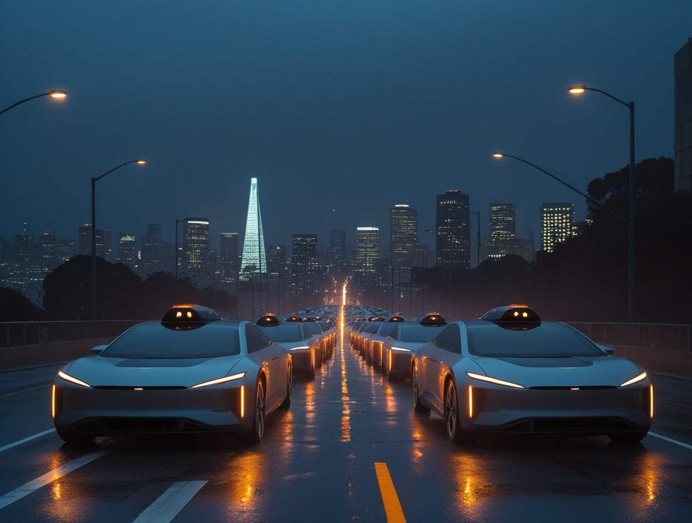
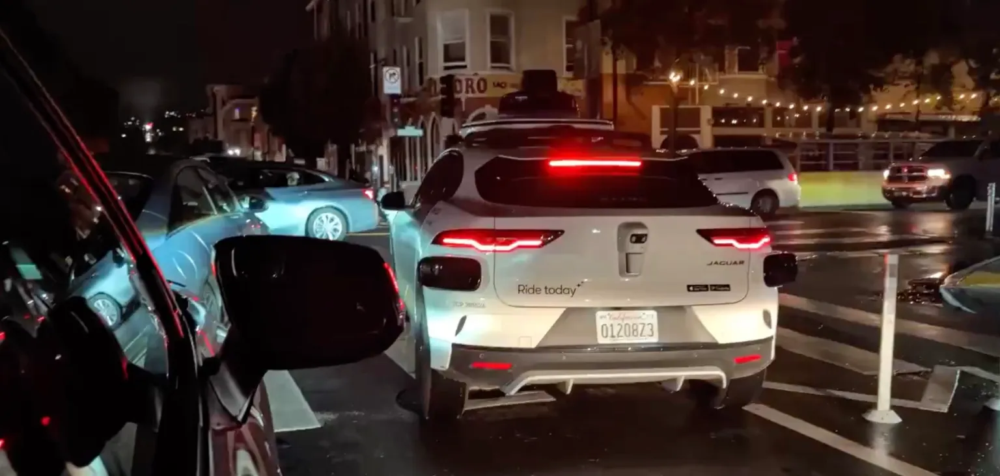

# Cuando la ciudad se detiene: las fragilidades ocultas de la era autónoma

*El apagón de San Francisco paralizó a cientos de robotaxis de Waymo, revelando la dependencia crítica de los sistemas autónomos de la infraestructura urbana. Mientras los centros de datos de IA duplican su consumo eléctrico y las tormentas solares amenazan nuestras redes, surge una pregunta incómoda: ¿estamos diseñando un futuro resiliente o construyendo castillos de naipes tecnológicos?*

El sábado 21 de diciembre de 2025, a primera hora de la tarde, un incendio en la subestación eléctrica de Pacific Gas & Electric en el barrio de Bayview-Hunters Point dejó a oscuras a [más de 130.000 clientes](https://techcrunch.com/2025/12/21/waymo-suspends-service-in-san-francisco-as-robotaxis-stall-during-blackout/) en San Francisco. Los semáforos se apagaron, las luces de las casas se desvanecieron y algo inesperadamente simbólico ocurrió en las calles de la ciudad: decenas de robotaxis de Waymo se detuvieron, inmóviles en las intersecciones como autómatas sin alma.

Los videos compartidos en las redes sociales muestran una escena que habría hecho sonreír a Philip K. Dick: los característicos Jaguar I-Pace blancos y azules con las luces de emergencia parpadeando, atascados en el tráfico mientras los humanos en sus coches tradicionales los esquivaban con cuidado. Algunos conductores filmaron robotaxis detenidos en medio de la calzada, incapaces de decidir cómo continuar. [Waymo tuvo que suspender su servicio](https://www.businessinsider.com/waymo-suspends-robotaxi-service-san-francisco-power-outage-tesla-2025-12) en toda la zona afectada, dejando a los pasajeros que ya estaban a bordo preguntándose qué estaba pasando.

El contraste con los vehículos Tesla equipados con Full Self-Driving fue chocante e inmediato. Mientras los Waymo permanecían paralizados, los Tesla seguían circulando, aprovechando su arquitectura de procesamiento local. El episodio planteó una pregunta que resuena mucho más allá de las colinas de San Francisco: si un apagón local puede paralizar la tecnología definida como "del futuro", ¿cuán robusta es realmente la infraestructura sobre la que estamos construyendo la movilidad autónoma?

## El talón de Aquiles digital

Para entender por qué algunos coches autónomos se detienen mientras otros siguen en movimiento, es necesario mirar bajo el capó tecnológico. [Waymo basa su arquitectura](https://missionlocal.org/2025/12/sf-waymo-halts-service-blackout/) en un ecosistema complejo: sensores LIDAR que generan mapas tridimensionales del entorno, mapas HD con precisión centimétrica que necesitan actualizaciones constantes y una comunicación remota continua con servidores centrales para procesar datos y tomar decisiones. Cuando se fue la luz, no solo se apagaron los semáforos; las antenas 5G, los repetidores de GPS y la infraestructura de comunicaciones también sufrieron una cadena de interrupciones.

Tesla, por otro lado, adopta una filosofía radicalmente diferente. Su sistema Full Self-Driving procesa todo localmente, basándose principalmente en cámaras y redes neuronales que se ejecutan directamente en el ordenador de a bordo del coche. No necesita una conexión constante, ni depende de mapas externos actualizados en tiempo real. Es como el contraste entre un mainframe de los años 70 y un ordenador personal: centralización frente a procesamiento distribuido, nube frente a computación en el borde.

La paradoja es tan fascinante como inquietante: [Waymo completa unos 450.000 viajes semanales](https://www.quattroruote.it/news/tecnologia/2025/12/22/san_francisco_waymo_robotaxi.html) en San Francisco, una operación a escala industrial que funciona de maravilla mientras el ecosistema aguanta. Pero esa misma escala amplifica la vulnerabilidad: cuanto más sofisticado es el sistema, más numerosos son los puntos de fallo. GPS, 5G, mapas en la nube, un suministro de energía constante para la infraestructura de apoyo: cuando uno de estos eslabones se rompe, toda la cadena se colapsa.

En el campo de la agricultura autónoma, esta lección se aprendió por las malas. Durante las operaciones militares israelíes de 2023, [la interferencia deliberada del GPS por parte de las FDI](https://www.calcalistech.com/ctechnews/article/q9msjj6cb) obligó a los agricultores a volver a los métodos tradicionales. Rami Laner, de 73 años, tuvo que volver a trabajar en los campos del Kibbutz Mevo Hama después de una ausencia de treinta años porque los operadores más jóvenes no sabían cómo conducir los tractores sin sistemas GPS. Las plantaciones sufrieron aplicaciones superpuestas de fertilizantes y pesticidas, lo que provocó daños en los cultivos y un aumento de los costes. La precisión centimétrica que había hecho tan eficiente la agricultura israelí resultó ser una debilidad estructural cuando las coordenadas por satélite dejaron de ser fiables.

Los drones civiles han mostrado fragilidades similares. Las plataformas de DJI, ampliamente utilizadas en agricultura, fotografía aérea e inspecciones industriales, [dependen críticamente de la señal GPS](https://forum.dji.com/thread-254715-1-1.html) para mantener la estabilidad y la orientación. Cuando la señal se degrada o desaparece, los drones entran en modo ATTI (actitud), perdiendo su capacidad de mantener una posición fija y volviéndose vulnerables al viento y las corrientes. Varios usuarios han reportado situaciones críticas durante misiones de mapeo o entrega, con drones que perdían repentinamente la conexión por satélite en pleno vuelo y corrían el riesgo de colisionar.

## La energía que no está

Pero el problema energético no se limita a los apagones locales. El consumo de los centros de datos que alimentan los sistemas de inteligencia artificial está creciendo a un ritmo vertiginoso. Según la [Agencia Internacional de la Energía](https://www.punto-informatico.it/blackout-paralizza-self-driving-car-waymo/), el consumo de electricidad de los centros de datos ha pasado de 415 teravatios-hora en 2024 a una proyección de 945 TWh para 2030, más del doble en seis años. Para ponerlo en perspectiva, es como añadir todo el consumo de electricidad de la India a la demanda mundial.

El proyecto Stargate de OpenAI en Texas requerirá 1,2 gigavatios de potencia, el equivalente a un reactor nuclear de tamaño medio. En Virginia, el llamado Data Center Alley ya consume el 26% de la electricidad de todo el estado. Texas, que en febrero de 2021 sufrió [el apagón de la tormenta invernal Uri](https://nt24.it/2025/09/energia-ia-vertiv/) con más de 4,5 millones de clientes a oscuras y 246 muertes, está viendo cómo su red eléctrica se ve sometida a la presión de los nuevos centros de datos de IA.

La paradoja es flagrante: la tecnología que se supone que nos hará más eficientes y sostenibles está consumiendo energía como naciones enteras. Y este consumo no está distribuido de manera uniforme, sino que se concentra en unas pocas áreas geográficas donde la densidad de centros de datos crea puntos calientes de energía. Cuando estas áreas experimentan estrés en la red, no solo sufren los sistemas locales: toda la infraestructura de computación en la nube que sustenta los servicios autónomos, los análisis predictivos y el procesamiento remoto de IA puede tambalearse.

La propia Italia no es inmune. Las previsiones indican un [riesgo creciente de apagones](https://prometeo.adnkronos.com/territorio/prossimo-blackout-previsioni-ai-dopo-spagna-2025/) para 2026, amplificado por la carrera para instalar infraestructuras de IA. La cogeneración y las microrredes se están convirtiendo en soluciones cada vez más discutidas por las empresas que quieren protegerse de la vulnerabilidad de la red nacional.

[Imagen de techcrunch.com](https://techcrunch.com/2025/12/21/waymo-suspends-service-in-san-francisco-as-robotaxis-stall-during-blackout/)

## Tormentas desde arriba

Como si las fragilidades terrestres no fueran suficientes, el propio cielo se está convirtiendo en una amenaza. El Ciclo Solar 25 alcanzó su pico entre 2025 y 2026, trayendo consigo [tormentas geomagnéticas de clase G4 y G5](https://congressiinternazionali.it/blog/tempesta-solare-2025-rischi-comunicazione-e-soluzioni/). En noviembre de 2024, una tormenta G4 produjo auroras visibles tan al sur como Alabama, un espectáculo magnífico que ocultaba problemas significativos para los sistemas GPS y las comunicaciones de radio de alta frecuencia.

El precedente histórico más dramático es el Evento de Carrington de 1859, cuando una tormenta solar excepcional produjo auroras visibles hasta el Caribe y dejó fuera de servicio las líneas de telégrafo en toda América del Norte y Europa. Los operadores informaron de chispas que incendiaban el papel en sus oficinas, y algunos sistemas de telégrafo continuaron funcionando incluso después de ser desconectados de sus baterías, alimentados únicamente por corrientes inducidas geomagnéticamente.

Hoy, un evento de esa magnitud sería catastrófico. El Servicio Geológico de los Estados Unidos advierte que el Medio Oeste y la Costa Este de los Estados Unidos son [particularmente vulnerables](https://www.smartphonology.it/i-grandi-blackout-digitali-del-2025-quando-le-piattaforme-globali-si-fermano/) a las corrientes inducidas geomagnéticamente (GIC) que pueden dañar irreparablemente los transformadores de alta tensión. No se trata de apagar y encender un interruptor: un transformador quemado puede tardar meses en ser reemplazado, ya que son componentes enormes, caros y hechos a medida.

Para los sistemas autónomos que dependen del GPS, las tormentas solares suponen una amenaza existencial. Las partículas cargadas distorsionan la ionosfera, haciendo que las señales de los satélites no sean fiables. Los drones pierden la orientación, los tractores autónomos se salen del rumbo y los robotaxis ya no saben dónde están. Y a diferencia de los apagones terrestres que pueden ser contenidos geográficamente, una tormenta solar afecta a regiones planetarias enteras simultáneamente.

## El mundo que se adapta a las máquinas

Sin embargo, de estos episodios de fragilidad tecnológica surge una cuestión más profunda y filosófica. En lugar de diseñar sistemas que se adapten al mundo humano con todas sus imperfecciones e imprevisibilidad, estamos modificando progresivamente las ciudades y las infraestructuras para dar cabida a tecnologías rígidas que solo funcionan en condiciones ideales.

San Francisco está invirtiendo millones en infraestructura V2X (vehículo a todo), semáforos inteligentes que se comunican con los vehículos autónomos, carriles dedicados y sensores en la carretera. Es una adaptación urbana a una escala de miles de millones de dólares para permitir que los robotaxis se muevan con seguridad. Pero esta estrategia invierte el paradigma tradicional de la ingeniería: no son las máquinas las que se adaptan al entorno, sino el entorno el que se remodela para las máquinas.

La historia de Cruise en San Francisco es un buen ejemplo. En octubre de 2023, el DMV de California [suspendió las operaciones de la compañía](https://www.punto-informatico.it/blackout-paralizza-self-driving-car-waymo/) después de que un robotaxi arrastrara a un peatón durante seis metros tras un accidente, incapaz de reconocer que la persona estaba atrapada bajo el vehículo. El incidente planteó preguntas incómodas sobre la capacidad de estos sistemas para manejar situaciones inesperadas que un conductor humano reconocería inmediatamente.

La socióloga M.C. Elish acuñó el término "zona de deformación moral" para describir cómo los humanos en sistemas semiautónomos se convierten en los chivos expiatorios cuando algo sale mal. En la aviación, cuando un piloto no interviene a tiempo para corregir un error del piloto automático, se le culpa por no supervisar adecuadamente el sistema. Pero si el sistema está diseñado para funcionar de forma autónoma el 99% del tiempo, ¿cómo puede un ser humano mantener la atención necesaria para intervenir en ese 1% crítico?

El filósofo de la tecnología Luciano Floridi ha argumentado que necesitamos un enfoque "verde y azul": una tecnología que respete tanto el entorno natural (verde) como el entorno social y humano (azul). La tentación de rediseñar el mundo para adaptarlo a las limitaciones de nuestros algoritmos es fuerte, pero corre el riesgo de crear ecosistemas urbanos cada vez más frágiles que dependen de condiciones perfectas.

La agricultura autónoma, con su dependencia del GPS centimétrico y la conectividad constante, funciona magníficamente en los campos abiertos de Kansas o Iowa, pero fracasa en cuanto las condiciones se desvían de la norma. Los tractores autónomos [requieren señales de GPS con una precisión de tres centímetros](https://guidenav.com/handling-gnss-outages-in-agricultural-robots-ins-dead-reckoning-strategies/), lo que es imposible de mantener bajo densas copas de árboles o cerca de estructuras metálicas. El resultado es que algunos cultivos especializados, como los viñedos y los huertos con hileras estrechas, siguen siendo difíciles de automatizar por completo.

## Escenarios futuros y soluciones

Sin embargo, no todo está perdido, y mirar solo los fracasos sería reduccionista. Tesla ha demostrado que diferentes arquitecturas pueden ofrecer una mayor resiliencia. La computación híbrida en el borde (hybrid edge computing), que equilibra el procesamiento local con el apoyo de la nube cuando está disponible, representa un término medio prometedor. Los sistemas agrícolas más avanzados ya están implementando [sistemas de navegación inercial](https://guidenav.com/handling-gnss-outages-in-agricultural-robots-ins-dead-reckoning-strategies/) (INS) que les permiten seguir operando durante interrupciones temporales del GPS, utilizando acelerómetros y giroscopios para estimar la posición y la orientación.

La regulación se está adaptando lentamente a la realidad. El Departamento de Vehículos Motorizados de California ha demostrado que está dispuesto a suspender las operaciones cuando los problemas de seguridad se hacen evidentes, como en el caso de Cruise en 2023 y ahora con las interrupciones de Waymo. La Unión Europea está desarrollando normas que incluyen pruebas de resiliencia en condiciones degradadas, no solo el rendimiento en escenarios ideales.

Pero se necesita un cambio de perspectiva más radical. Las pruebas obligatorias deberían incluir apagones simulados, interferencias de GPS e interrupciones de la conectividad 5G. No podemos permitirnos descubrir vulnerabilidades cuando cientos de miles de vehículos autónomos ya están en las carreteras y millones de hectáreas de tierras de cultivo dependen de tractores sin conductor.

El rediseño urbano debe ser holístico, no centrado en la tecnología. Las ciudades del futuro tendrán carriles para vehículos autónomos, pero también redundancia en la infraestructura crítica: microrredes eléctricas distribuidas, generación de respaldo local y sistemas de comunicación de múltiples rutas que no dependan de una sola tecnología. Los robotaxis deberán estar diseñados para degradarse con elegancia, como los aviones comerciales que tienen sistemas redundantes triples y cuádruples para cada función crítica.

La experiencia del [apagón de CrowdStrike de julio de 2024](https://en.wikipedia.org/wiki/2024_CrowdStrike-related_IT_outages) ofrece una lección crucial: 8,5 millones de ordenadores con Windows quedaron fuera de servicio por una única actualización de software defectuosa, con daños estimados en más de 10.000 millones de dólares. Aeropuertos paralizados, hospitales obligados a volver al papel y bancos congelados. El sistema tenía un único punto de fallo, y cuando se rompió, las consecuencias fueron globales. La diversificación tecnológica no es solo una cuestión de eficiencia, sino de supervivencia sistémica.

## Epílogo inacabado

Los coches de Waymo detenidos en las intersecciones de San Francisco no fueron solo un inconveniente temporal para los pasajeros de esos robotaxis. Fueron un espejo que reflejaba las fragilidades ocultas de un futuro que creíamos que ya era sólido. Como en el videojuego "The Last of Us", donde la civilización tecnológica se derrumba en cuestión de días cuando los sistemas complejos se rompen, estamos construyendo un mundo donde la complejidad interconectada puede convertirse rápidamente en vulnerabilidad sistémica.

La pregunta no es si habrá más apagones, más tormentas solares, más interrupciones. La pregunta es: cuando lleguen, ¿habremos construido sistemas lo suficientemente robustos como para degradarse con elegancia en lugar de colapsar por completo? La tecnología autónoma promete eficiencia, seguridad y sostenibilidad. Pero esas promesas solo son válidas si los sistemas también funcionan cuando las condiciones son imperfectas, cuando no hay electricidad, cuando el GPS está distorsionado, cuando el mundo real se niega a ajustarse a los parámetros óptimos de nuestros algoritmos.

Quizás la verdadera inteligencia artificial no sea la que funciona perfectamente en condiciones perfectas, sino la que sabe adaptarse, improvisar y sobrevivir cuando todo lo demás falla. Tal como los humanos siempre lo han hecho.
