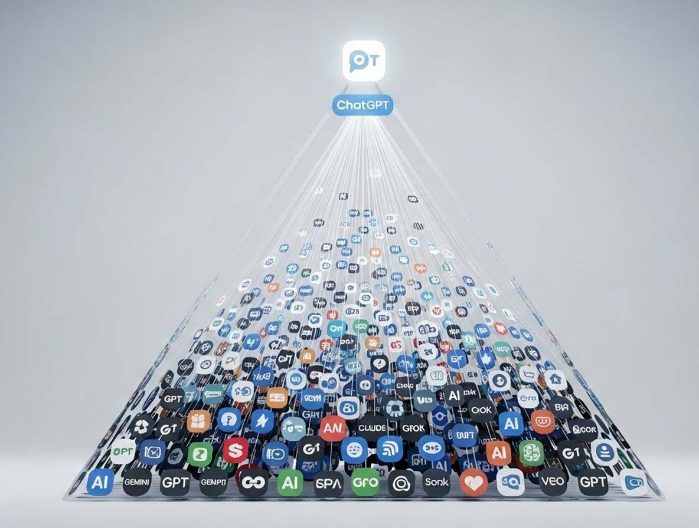

# L'IA grand public en 2025 : Pourquoi plus de choix n'a pas créé plus de changement

*2025 devait être l'année de la maturité pour l'intelligence artificielle grand public. OpenAI a présenté des dizaines de fonctionnalités : GPT-4o Image, qui [a ajouté un million d'utilisateurs par heure](https://a16z.com/state-of-consumer-ai-2025-product-hits-misses-and-whats-next/) à son apogée, l'application autonome Sora, les discussions de groupe, Tasks, Study Mode. Google a répondu avec Nano Banana, qui a généré [200 millions d'images la première semaine](https://a16z.com/state-of-consumer-ai-2025-product-hits-misses-and-whats-next/), suivi de Veo 3 pour la vidéo. Anthropic a lancé Skills and Artifacts. xAI a fait passer Grok de zéro à [9,5 millions d'utilisateurs actifs quotidiens](https://a16z.com/state-of-consumer-ai-2025-product-hits-misses-and-whats-next/). Une activité frénétique, un catalogue en expansion continue.*

Pourtant, les utilisateurs n'ont pas bougé. [Moins de 10 % des utilisateurs hebdomadaires de ChatGPT](https://a16z.com/state-of-consumer-ai-2025-product-hits-misses-and-whats-next/) ont visité ne serait-ce qu'un autre des grands fournisseurs de modèles au cours de l'année. Les données de Yipit montrent que [seulement 9 % des consommateurs paient](https://a16z.com/state-of-consumer-ai-2025-product-hits-misses-and-whats-next/) pour plus d'un abonnement parmi ChatGPT, Gemini, Claude et Cursor. La course à l'innovation des laboratoires s'est heurtée à un mur d'inertie comportementale. Comme dans le paradoxe du choix décrit par Barry Schwartz, plus d'options n'ont pas généré plus de changements, mais une paralysie décisionnelle.

L'analyse d'[Andreessen Horowitz](https://a16z.com/state-of-consumer-ai-2025-product-hits-misses-and-whats-next/) dépeint une profonde dissonance : l'utilisation globale de l'IA a augmenté, mais la diversification des choix, non. Le marché s'est développé verticalement, pas horizontalement. Les utilisateurs utilisent davantage ce qu'ils utilisaient déjà, explorant rarement les alternatives. C'est comme si 2025 avait prouvé que dans l'IA grand public, le gagnant n'est pas celui qui innove le plus, mais celui qui conquiert le premier l'habitude.

## La monarchie de ChatGPT

Les chiffres racontent une domination écrasante. ChatGPT a atteint entre [800 et 900 millions d'utilisateurs actifs hebdomadaires](https://a16z.com/state-of-consumer-ai-2025-product-hits-misses-and-whats-next/) sur toutes les plateformes, consolidant sa position après être devenu en 2023 le produit le plus rapide de tous les temps à atteindre 100 millions d'utilisateurs. Gemini, le deuxième, s'arrête à [34 % de l'échelle de ChatGPT sur le web et à 40 % sur mobile](https://a16z.com/state-of-consumer-ai-2025-product-hits-misses-and-whats-next/). Mais c'est sur le front de l'engagement que le fossé devient abyssal : ChatGPT affiche un [DAU/MAU de 36 %, soit près du double des 21 % de Gemini](https://a16z.com/state-of-consumer-ai-2025-product-hits-misses-and-whats-next/). Et la rétention au douzième mois sur ordinateur de bureau raconte la même histoire : [50 % contre 25 %](https://a16z.com/state-of-consumer-ai-2025-product-hits-misses-and-whats-next/).

Ce ne sont pas de simples données de marché ; ce sont des indicateurs d'habitudes bien ancrées. Une rétention double signifie que pour chaque utilisateur que Gemini parvient à conserver après un an, ChatGPT en conserve deux. Le DAU/MAU plus élevé indique que les utilisateurs reviennent plus fréquemment, transformant ChatGPT en une habitude quotidienne plutôt qu'en un outil occasionnel. Comme la mémoire musculaire d'un athlète, où chaque mouvement devient automatique après des heures de pratique, l'interface de ChatGPT s'est installée dans la mémoire procédurale de centaines de millions de personnes.

La stratégie d'OpenAI pour 2025 était claire : tout consolider au sein de ChatGPT. Pulse pour les mises à jour quotidiennes, Group Chats pour la collaboration, Record pour les transcriptions, Shopping Research, Tasks, Study Mode. Chaque nouvelle fonctionnalité était poussée via l'interface existante. Mais comme le note l'analyse d'a16z, [aucune de ces expériences n'a vraiment percé](https://a16z.com/state-of-consumer-ai-2025-product-hits-misses-and-whats-next/) en termes d'utilisation ou de rétention. Le problème ? Il est difficile d'offrir une expérience de premier ordre lorsque l'on doit opérer dans les contraintes d'une interface généraliste déjà surchargée.

Les exceptions confirment la règle. Sora, lancée en tant qu'application autonome, a dépassé les [12 millions de téléchargements dans le monde](https://a16z.com/state-of-consumer-ai-2025-product-hits-misses-and-whats-next/) en tant qu'outil de création, mais a échoué en tant qu'application sociale avec une rétention inférieure à 8 % au trentième jour, bien en deçà du seuil de 30 % des applications grand public à succès. Atlas, le navigateur de ChatGPT, est un produit puissant, mais [moins de 5 % des utilisateurs ont visité la page de téléchargement](https://a16z.com/state-of-consumer-ai-2025-product-hits-misses-and-whats-next/), limité à macOS et éclipsé par la domination de l'interface de chat.

## Le cimetière des fonctionnalités

Il y a un schéma récurrent dans les stratégies 2025 des grands laboratoires : la surcharge de fonctionnalités. OpenAI a intégré des connecteurs pour lier ChatGPT à G Suite, Microsoft, Notion, Stripe, Slack. Il a lancé Agent pour générer des présentations et des analyses, bien qu'il s'avère encore lent et instable lors des tests. Google a publié Portraits, Doppl, Whisk, Gems — une séquence d'expériences qui ont connu une traction limitée. Anthropic a ajouté le mode vocal, la mémoire, la recherche web, la recherche, rattrapant son retard sur des fonctionnalités que ChatGPT possédait depuis un certain temps.

Mais le problème n'est pas la qualité technique. C'est que chaque nouvelle fonctionnalité s'ajoute à une interface déjà saturée. Comme dans Metal Gear Solid V, où Kojima avait accumulé tellement de systèmes de jeu que la courbe d'apprentissage décourageait les nouveaux joueurs, l'IA grand public risque de s'étouffer sous le poids de ses propres capacités. Steve Krug, dans son classique "Don't Make Me Think", soutenait que chaque choix demandé à l'utilisateur est un coût cognitif. Lorsque vous ouvrez ChatGPT aujourd'hui, vous êtes confronté à : un chat standard, un chat vocal, Canvas pour les documents, Agent pour les tâches complexes, Tasks pour les rappels, Study Mode pour l'apprentissage, Shopping Research, Sora pour la vidéo. Huit modes différents, chacun avec sa propre logique spécifique.

Le résultat est que la plupart des utilisateurs s'en tiennent à ce qu'ils connaissent. La courbe d'adoption des nouvelles fonctionnalités est lente et la découverte passive est quasi inexistante. Google a adopté l'approche inverse : créer des surfaces dédiées. NotebookLM, lancé en tant que produit distinct, a vu ses [utilisateurs web plus que doubler d'une année sur l'autre](https://a16z.com/state-of-consumer-ai-2025-product-hits-misses-and-whats-next/) en novembre, et l'application mobile, sortie en mai, compte [8 millions d'utilisateurs actifs mensuels](https://a16z.com/state-of-consumer-ai-2025-product-hits-misses-and-whats-next/). Le produit continue d'évoluer avec la génération de diapositives, des aperçus vidéo et des infographies, mais sans polluer l'expérience principale de Gemini.

Cette dichotomie reflète une tension fondamentale dans la conception de produits : concentration contre diversification. OpenAI parie que la stratégie de distribution gagnante consiste à tout avoir en un seul endroit. Google expérimente l'idée que les expériences dédiées peuvent avoir leur propre vie. Les données suggèrent que lorsqu'un produit a un "travail à faire" clair et distinctif, les utilisateurs l'adoptent. Lorsqu'il s'agit d'une fonctionnalité parmi tant d'autres, même si elle est techniquement supérieure, elle peine à se démarquer.

[Image tirée de a16z.com](https://a16z.com/state-of-consumer-ai-2025-product-hits-misses-and-whats-next/)

## Le piège de la distribution

Google devrait gagner haut la main. Gemini est intégré à Chrome, Gmail, Meet, Android. Il est préinstallé sur des milliards d'appareils. Pourtant, ChatGPT, que les utilisateurs doivent rechercher activement, conserve un avantage d'échelle de trois contre un sur le web. Comment est-ce possible ? La réponse réside dans une mauvaise compréhension de ce que signifie la distribution à l'ère de l'IA.

La distribution passive fonctionne lorsque l'utilisateur n'a pas d'alternatives crédibles ou lorsque le coût du changement est prohibitif. Mais l'IA est différente. Les utilisateurs ont déjà choisi leur assistant préféré, se sont construit un modèle mental de la manière d'interagir avec lui et ont accumulé des conversations et du contexte. Passer à Gemini ne signifie pas seulement ouvrir une nouvelle application ; cela signifie rééduquer des habitudes cognitives. C'est comme demander à un guitariste qui a joué sur une Gibson pendant vingt ans de passer à une Fender : techniquement, il peut faire les mêmes choses, mais la sensation est différente, et cette sensation compte.

Pourtant, Gemini accélère. La croissance de ses utilisateurs sur ordinateur de bureau est de [155 % d'une année sur l'autre, contre 23 % pour ChatGPT](https://a16z.com/state-of-consumer-ai-2025-product-hits-misses-and-whats-next/), et le rythme s'est accéléré au cours des cinq derniers mois consécutifs. Nano Banana, le modèle de génération d'images viral, a attiré [10 millions de nouveaux utilisateurs la première semaine](https://a16z.com/state-of-consumer-ai-2025-product-hits-misses-and-whats-next/). Sur le front payant, Gemini connaît une croissance encore plus rapide : [près de 300 % d'une année sur l'autre pour les abonnements Pro](https://a16z.com/state-of-consumer-ai-2025-product-hits-misses-and-whats-next/), contre 155 % pour ChatGPT. La rétention des utilisateurs payants se rapproche : [68 % au 12e mois pour ChatGPT, 57 % pour Gemini](https://a16z.com/state-of-consumer-ai-2025-product-hits-misses-and-whats-next/).

Ces chiffres montrent que la partie n'est pas terminée. Google trouve des angles d'attaque : des modèles viraux qui génèrent un bouche-à-oreille organique, une intégration dans les flux de travail existants qui abaisse les barrières cognitives et une tarification agressive pour convertir les utilisateurs gratuits. Mais c'est une bataille difficile. ChatGPT a l'avantage du premier arrivé, amplifié par l'effet de réseau des conversations partagées et une notoriété de la marque qui frise le générique (comme Google pour la recherche, ChatGPT devient synonyme de chat IA).

La tentative de Google d'insérer un mode IA dans la recherche, disponible depuis mai, montre que [seulement 2 % des utilisateurs hebdomadaires interagissent avec lui](https://a16z.com/state-of-consumer-ai-2025-product-hits-misses-and-whats-next/). La distribution compte, mais elle ne suffit pas. Il faut une raison convaincante pour changer les habitudes, et cette raison ne peut pas être simplement "nous avons aussi l'IA".

## L'exception qui confirme la règle

Tandis que les géants s'affrontent sur le même terrain des chats à usage général, certaines startups montrent qu'il existe d'autres moyens de gagner. Le modèle est simple : identifier un cas d'utilisation vertical, créer une expérience dédiée et optimisée pour ce travail spécifique, et éviter le bruit des fonctionnalités généralistes.

Character AI pour la compagnie et le jeu de rôle, Suno pour la génération de musique, Eleven Labs pour les voix de synthèse, Replit pour le codage collaboratif, Gamma pour les présentations, Lovable et Manus pour le design. Chacun de ces produits a atteint des millions d'utilisateurs et, comme le note a16z, a [augmenté ses revenus plus rapidement que jamais](https://a16z.com/state-of-consumer-ai-2025-product-hits-misses-and-whats-next/) dans l'histoire des logiciels grand public. Le secret ? Des interfaces définies qui offrent des super-pouvoirs spécifiques au lieu de promettre des capacités infinies.

Anthropic a compris cette leçon. Au lieu de viser le marché de masse, elle s'est concentrée sur le prosumer technique. Claude Code, l'outil en ligne de commande pour le codage agentique, a atteint un [taux d'exécution d'un milliard de dollars en six mois](https://a16z.com/state-of-consumer-ai-2025-product-hits-misses-and-whats-next/). Skills and Artifacts, lancés au cours de l'année, sont des services puissants pour les utilisateurs avertis qui n'ont pas besoin d'être tenus par la main. La stratégie est claire : il vaut mieux être indispensable pour un million de développeurs que marginalement utile pour cent millions d'utilisateurs occasionnels.

Perplexity suit une philosophie similaire. Comet, leur navigateur IA, a dépassé le [million d'utilisateurs](https://a16z.com/state-of-consumer-ai-2025-product-hits-misses-and-whats-next/) en ciblant le "hacker de la productivité" qui souhaite intégrer la recherche dans son flux de travail. L'assistant de messagerie et les outils d'achat conversationnels créent un écosystème pour ceux qui veulent maximiser leur efficacité. Avec [plus de 20 millions d'utilisateurs actifs mensuels](https://a16z.com/state-of-consumer-ai-2025-product-hits-misses-and-whats-next/) et un [taux d'exécution de 100 millions de dollars](https://a16z.com/state-of-consumer-ai-2025-product-hits-misses-and-whats-next/) annoncé en mars, Perplexity prouve qu'il y a de la place pour les acteurs ciblés.

xAI a également trouvé sa niche. Grok, qui n'avait aucun utilisateur autonome au début de l'année, termine décembre avec [9,5 millions d'utilisateurs actifs quotidiens et 38 millions mensuels](https://a16z.com/state-of-consumer-ai-2025-product-hits-misses-and-whats-next/). Son pari sur des compagnons aux personnalités controversées et sur des modèles de génération de vidéos avec audio et synchronisation labiale rapide a créé un positionnement distinctif. L'intégration profonde avec X, où vous pouvez modifier n'importe quelle image de la chronologie d'un appui long, transforme l'IA en une couche native du réseau social.

Ces cas suggèrent que l'avenir de l'IA grand public ne sera pas celui du "gagnant rafle tout", mais celui du "gagnant par catégorie". Les grands modèles à usage général capteront la majorité du marché grand public, mais laisseront une large place à d'excellentes expériences verticales. Comme dans le jeu vidéo, où Call of Duty domine les jeux de tir mais où Hades conquiert les amateurs de roguelike, l'IA aura des blockbusters généralistes et des succès cultes spécialisés.

## Les choix difficiles de 2026

2026 s'ouvre sur trois questions fondamentales qui définiront la prochaine phase de l'IA grand public. La première concerne la monétisation. Avec seulement 5 % des utilisateurs de ChatGPT qui paient, et environ 1,8 milliard de personnes utilisant l'IA grand public, l'écart entre l'utilisation et les revenus est énorme. Les abonnements seuls ne suffisent pas. OpenAI expérimente la publicité, Perplexity les frais de transaction et d'affiliation pour les achats, et d'autres les places de marché d'agents. Un modèle économique durable reste à trouver.

La deuxième question concerne la saturation de l'expérience utilisateur. Les laboratoires continueront-ils à empiler les capacités sur les interfaces existantes ? Si c'est le cas, nous risquons un effondrement cognitif : trop de fonctions, trop de modes, trop de complexité pour l'utilisateur moyen. L'alternative consiste à proliférer les applications dédiées, mais cela nécessite d'énormes investissements en marketing et en acquisition d'utilisateurs pour chacune. Apple a démontré avec ses applications natives iOS que c'est possible, mais cela nécessite une vision d'écosystème que les laboratoires d'IA n'ont pas encore clairement articulée.

La troisième question concerne la découverte. Comment les utilisateurs trouvent-ils les nouvelles fonctionnalités ? OpenAI lance Apps, une infrastructure permettant aux développeurs tiers de créer des expériences au sein de ChatGPT. Si cela fonctionne, cela pourrait devenir la première véritable nouvelle plateforme grand public depuis plus d'une décennie. Mais elle doit résoudre le paradoxe des connecteurs : donner aux développeurs suffisamment de liberté pour créer de la magie sans fragmenter l'expérience de base. Une entreprise qui a fait échouer beaucoup d'autres avant elle, de la plateforme Facebook aux compétences Alexa d'Amazon.

Pendant ce temps, le comportement des utilisateurs reste le facteur le plus résistant au changement. L'inertie n'est pas de la paresse ; c'est de l'économie cognitive. Changer d'outil signifie réapprendre des schémas d'interaction, reconstruire la confiance dans la qualité du résultat et migrer le contexte et l'historique. Le coût est réel, même s'il est invisible. Pour le surmonter, il faut un avantage perçu énorme, et non pas incrémentiel. Gemini gagne du terrain en proposant des modèles créatifs viraux. Claude séduit les développeurs avec des performances supérieures sur les tâches techniques. Meta et xAI misent sur l'intégration native dans leurs réseaux sociaux. Mais personne n'a encore trouvé la formule magique pour un changement de masse.

Le vrai risque est que l'écart entre les capacités techniques et l'adoption dans le monde réel continue de se creuser. Les laboratoires améliorent leurs modèles chaque trimestre, ajoutent des capacités multimodales, élargissent la fenêtre de contexte et réduisent la latence. Mais si 90 % des utilisateurs n'utilisent toujours qu'un seul assistant et que 91 % paient pour un seul au maximum, toute cette puissance de calcul se transforme en surajustement du produit. C'est comme avoir une voiture qui roule à 400 km/h alors que la limite de vitesse est de 130 : impressionnant sur le papier, sans pertinence dans l'usage quotidien.

2025 a montré que dans l'IA grand public, la technologie ne suffit pas. Il faut un design qui réduit la complexité au lieu de l'accumuler, une distribution qui crée des habitudes au lieu d'une simple présence, et des propositions de valeur si claires que l'utilisateur n'a pas à réfléchir. Les laboratoires qui comprendront cela gagneront en 2026. Les autres continueront de construire des cathédrales dans le désert, parfaites et vides.
