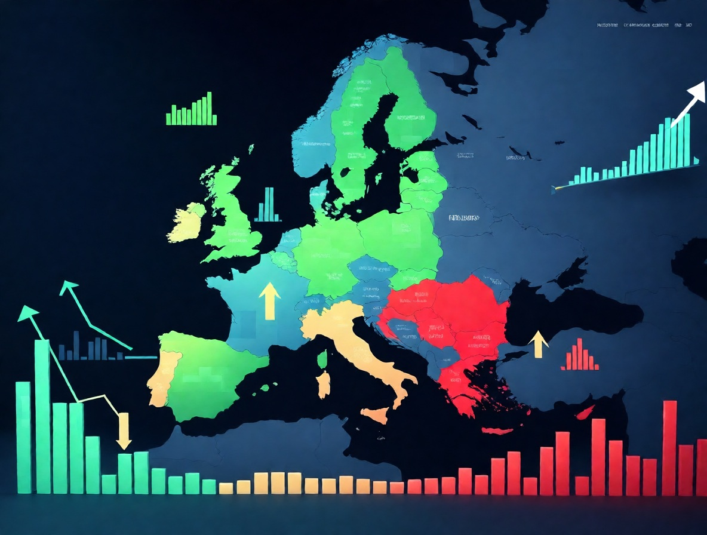
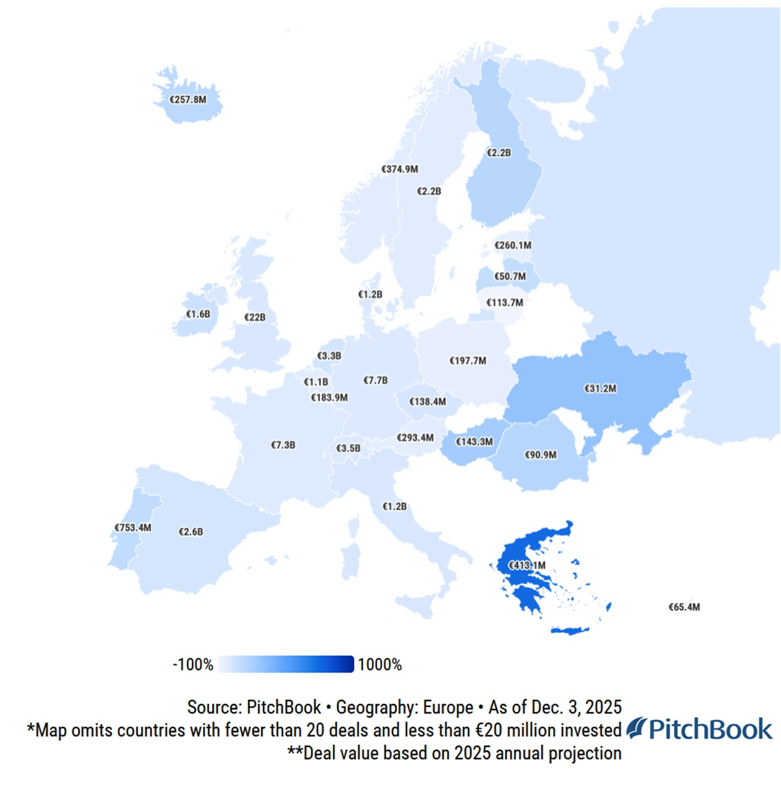
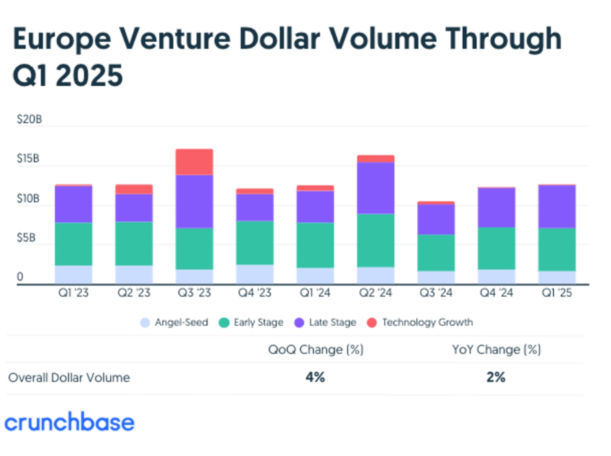

# L'entusiasmo europeo dell'AI: ma i numeri raccontano un'altra storia

*Helsinki a fine novembre sembrava il centro dell'universo tech. Ventimila persone si sono riversate alla [Slush 2025](https://www.slush.org/), l'evento annuale che trasforma la capitale finlandese in una sorta di Woodstock delle startup. L'energia era palpabile, i pitch deck volavano da una sala all'altra, gli investitori americani presenziavano in massa. Eppure, mentre i founder brindavano ai loro side event e gli analisti celebravano la "rinascita europea", i dati raccontavano una storia completamente diversa. Come in quella scena di *They Live* dove John Carpenter mostrava la realtà nascosta dietro i cartelloni pubblicitari, basterebbe indossare gli occhiali giusti per vedere cosa si cela dietro la narrativa ottimistica.*

Secondo [PitchBook](https://pitchbook.com/news/articles/hot-or-not-where-european-vc-funding-grew-in-2025), gli investitori hanno versato 43,7 miliardi di euro nelle startup europee nei primi tre trimestri del 2025, distribuiti su 7.743 operazioni. Un numero sostanziale, certo, ma che mette l'Europa sulla traiettoria di eguagliare i 62,1 miliardi del 2024, non di superarli. Per confronto, negli Stati Uniti il volume dei deal aveva già sorpassato i totali del 2022, 2023 e 2024 alla fine del terzo trimestre. Non è tanto una questione di velocità diverse quanto di direzioni opposte: mentre l'America accelera, l'Europa rimane ferma al semaforo.

## Il crollo silenzioso del fundraising

Ma il vero problema non sta nei capitali che raggiungono le startup, bensì in quelli che non arrivano nemmeno ai fondi di venture capital. Nei primi nove mesi del 2025, i VC europei hanno raccolto appena [8,3 miliardi di euro](https://techcrunch.com/2025/12/24/the-european-startup-markets-data-doesnt-match-its-energy-yet/), mettendo il continente sulla strada del suo peggior risultato annuale degli ultimi dieci anni. Navina Rajan, senior analyst di PitchBook, ha definito il fundraising da limited partner a general partner "decisamente l'area più debole in Europa", con un crollo stimato tra il cinquanta e il sessanta percento rispetto agli anni precedenti.

Il dettaglio più inquietante riguarda la composizione di questi fondi: secondo [Seedblink](https://seedblink.com/blog/state-of-fundraising-in-q2-2025-key-findings-from-market-reports), la quota di capitale assegnata agli emerging manager è salita al 61,5% nel 2025, rispetto al 43,5% dell'anno prima. I mega-fund che avevano chiuso raccolte record nel 2024 non si sono ripresentati, e la dimensione mediana dei fondi è scesa a cinquanta milioni di euro, il livello più basso dal 2019. Come se l'ecosistema, invece di consolidarsi attorno a player strutturati, si frammentasse in una miriade di piccoli veicoli senza la forza finanziaria per sostenere round di crescita significativi. Ricorda un po' la scena finale di *Magnolia* di Paul Thomas Anderson, dove tutte le narrazioni personali crollano simultaneamente sotto il peso della loro insostenibilità.

## Geografie a due velocità

L'Europa non è un monolite, e i dati lo dimostrano con crudezza. Regno Unito, Francia e paesi nordici continuano ad attrarre capitali, mentre Germania, Austria e il Sud Europa arrancano. [PitchBook evidenzia](https://pitchbook.com/news/articles/hot-or-not-where-european-vc-funding-grew-in-2025) che il mercato britannico ha registrato un incremento del 7,8% nel deal value, raggiungendo i livelli più alti dal 2022. La Finlandia ha vissuto un anno record grazie principalmente all'enorme Series E da 875 milioni di dollari di Oura, il produttore di smart ring. Dall'altra parte, i mercati più piccoli della regione di lingua tedesca hanno subito cali drastici, con l'eccezione della Svizzera dove il biotech ha registrato cifre record.

Ma il vero squilibrio emerge dal confronto globale. Nel primo trimestre 2025, secondo [Dealroom](https://seedblink.com/blog/2025-04-14-state-of-fundraising-in-q1-2025-key-findings-from-market-reports), l'Europa rappresentava appena l'11% del venture capital mondiale, in calo rispetto al 16% del 2024. Gli Stati Uniti dominano con il 64% del capitale globale, mentre l'Asia mantiene quote stabili. Non è solo una questione di dimensioni dei mercati, ma di profondità dei pool di capitale disponibili e velocità di riciclo del denaro. L'Europa soffre di capital formation insufficiente, fondi più piccoli e cicli di investimento più cauti, come [evidenziato](https://www.stateofeuropeantech.com/chapters/startup-investment-trends) dallo State of European Tech report.

[Immagine tratta da pitchbook.com](https://pitchbook.com/news/articles/hot-or-not-where-european-vc-funding-grew-in-2025)

## L'ossessione AI e i settori dimenticati

L'intelligenza artificiale ha divorato il 39,1% di tutti i capitali investiti in Europa nel 2025, una concentrazione record. Il round da [1,7 miliardi di euro di Mistral AI](https://mistral.ai/news/mistral-ai-raises-1-7-b-to-accelerate-technological-progress-with-ai), con la partecipazione di Andreessen Horowitz e Nvidia, ha dominato il terzo trimestre. [Lovable](https://techcrunch.com/2025/12/18/vibe-coding-startup-lovable-raises-330m-at-a-6-6b-valuation/), la startup svedese di vibe-coding, ha raccolto 330 milioni di dollari in un Series B guidato da investitori americani come Salesforce Ventures e CapitalG. Sono storie di successo reali, certo, ma che nascondono una distribuzione squilibrata del capitale.

Come [spiegato nel nostro precedente articolo](https://aitalk.it/it/mistral-devstral.html) su Mistral, l'entusiasmo per i modelli linguistici e le fondazioni di AI sta creando valuation premium superiori al cento percento per le late-stage AI companies. Ma cosa succede alle startup nei settori tradizionali? La concentrazione di capitali in pochi mega-deal lascia interi comparti in secca. Il defense tech in Germania e il biotech svizzero mostrano segnali di vitalità, ma rappresentano nicchie rispetto alla marea montante dell'AI. Il venture debt ha raggiunto livelli record a 5,6 miliardi di dollari in Europa, secondo [State of European Tech](https://www.stateofeuropeantech.com/chapters/startup-investment-trends), segno che molte startup devono cercare fonti alternative di finanziamento senza diluire ulteriormente l'equity.

## Trasparenza perduta, metriche opache

Uno degli aspetti più problematici dell'ecosistema europeo riguarda la qualità e la trasparenza delle informazioni. A differenza degli Stati Uniti, dove SEC e reporting pubblici obbligano a disclosure dettagliate, in Europa le metriche di performance rimangono spesso self-reported e frammentate. I down round nel Regno Unito hanno raggiunto il 17% secondo alcune stime, ma [Development Corporate](https://developmentcorporate.com/saas/european-vc-valuations-2025-data-driven-analysis/) riporta che la proporzione complessiva europea è scesa al 14,9% nel terzo trimestre 2025, lasciando margini di interpretazione ampi.

Il caso Builder.ai rappresenta un esempio emblematico di questa opacità. La piattaforma no-code aveva raccolto centinaia di milioni promettendo di democratizzare lo sviluppo software, ma le difficoltà operative e le valutazioni ridimensionate hanno sollevato dubbi sulla sostenibilità del modello. Non si tratta di casi isolati: senza standard condivisi per KPI, retention rate, burn rate e altre metriche critiche, gli investitori navigano a vista. Il GDPR, nato per proteggere i dati personali, viene spesso citato come scudo per giustificare la mancata pubblicazione di informazioni aggregate che nulla avrebbero a che fare con la privacy individuale. Come [abbiamo discusso](https://aitalk.it/it/apply-ai-eu-strategy.html) analizzando la strategia AI europea, servirebbero framework regolatori che bilancino trasparenza e tutela dell'innovazione.

## Dove vanno davvero i soldi

La concentrazione del capitale non si manifesta solo nei settori ma anche negli operatori. I primi dodici fondi di venture capital europei hanno assorbito oltre il cinquanta percento del capitale totale investito nella prima metà del 2025, secondo analisi di mercato. Questa concentrazione crea un circolo vizioso: i grandi fund con track record consolidati attraggono LP cauti, mentre gli emerging manager faticano a raccogliere capitali anche quando gestiscono portafogli promettenti.

Il fenomeno del "tourist capital" degli investitori americani merita attenzione. La partecipazione dei VC statunitensi nei deal europei è risalita dopo il minimo del 19% toccato nel 2023, come [riportato da TechCrunch](https://techcrunch.com/2025/12/24/the-european-startup-markets-data-doesnt-match-its-energy-yet/). L'attrattiva? Valuation più basse per tecnologie comparabili. Come ha notato Navina Rajan, "se guardi ai multipli, specialmente nell'AI tech negli Stati Uniti, è praticamente impossibile entrare ora, mentre in Europa le valutazioni più contenute offrono un migliore punto di ingresso". Ma questo flusso transatlantico solleva interrogativi sulla sostenibilità: si tratta di investimenti strategici di lungo periodo o di capital opportunistico che scomparirà al primo segnale di turbolenza?

## Unicorni mancati e fughe di cervelli

L'IPO di [Klarna a settembre 2025](https://www.aljazeera.com/economy/2025/9/10/buy-now-pay-later-company-klarna-goes-public-in-largest-ipo-of-2025) rappresenta l'unica vera exit di rilievo dell'anno europeo. La fintech svedese ha raccolto 1,37 miliardi di dollari quotandosi al NYSE con una valutazione di circa 17 miliardi, un settanta percento in meno rispetto al picco di 45,6 miliardi del 2021. L'operazione ha probabilmente riciclato capitali verso limited partner europei e restituito fiducia agli investitori, ma rimane un caso isolato in un panorama che fatica a generare liquidity event significativi.

La migrazione di talenti e startup verso gli Stati Uniti continua silenziosamente. Tra il tre e il quindici percento delle startup europee trasferisce headquarter o operazioni principali oltreoceano, attratte da pool di capitale più profondi, clienti enterprise più disponibili e un ambiente regolatorio percepito come più favorevole. Come [discusso nel nostro articolo](https://aitalk.it/it/silicon-valley-ai-pac.html) sui PAC dell'AI nella Silicon Valley, l'ecosistema americano non si limita a offrire denaro ma costruisce network effect potenti che rendono costoso rimanere fuori. EQT, uno dei più grandi asset manager europei, ha dichiarato l'intenzione di investire 250 miliardi di dollari in Europa nei prossimi cinque anni, dopo averne investiti 120 negli ultimi cinque. Victor Englesson, partner di EQT, ha notato che i founder europei "stanno iniziando aziende con l'ambizione di vincere globalmente, non solo in Europa o Germania". Ma le intenzioni devono ancora tradursi in risultati concreti.

[Immagine tratta da seedblink.com](https://seedblink.com/blog/state-of-fundraising-in-q2-2025-key-findings-from-market-reports)

## Interventi istituzionali tardivi

L'Unione Europea ha finalmente riconosciuto il problema e sta tentando interventi strutturali. L'European Tech Champions Initiative (ETCI) punta a mobilizzare venti miliardi di euro, mentre l'EIC Fund pianifica nuove tranche di investimenti per il 2026. Il recente [Draghi Report](https://commission.europa.eu/topics/competitiveness/draghi-report/one-year-after_en) ha evidenziato gap persistenti con Stati Uniti e Cina in termini di scala, velocità di deployment e profondità dei mercati dei capitali. Ma la frammentazione in ventisette mercati nazionali con regole diverse rimane un ostacolo formidabile.

Come [analizzato nel nostro pezzo](https://aitalk.it/it/agentic-ai-foundation.html) sulle fondamenta dell'AI agentica, servono infrastrutture comuni che permettano scalabilità senza dover navigare labirinti burocratici nazionali. Lo Scaleup Europe Fund e altre iniziative simili promettono di colmare il gap di growth capital che affligge le aziende europee in fase di espansione, ma i primi risultati concreti si vedranno non prima della seconda metà del 2026. Il rischio è che, come spesso accade con le policy europee, gli interventi arrivino quando il treno è già passato.

## Segnali contrastanti per il 2026

Guardando al futuro immediato, il panorama offre segnali ambivalenti. Da un lato, settori alternativi all'AI mostrano vitalità insospettata: il defense tech tedesco sta attirando investimenti significativi, spinto dalle tensioni geopolitiche e dalla necessità di autonomia strategica europea. Il biotech svizzero ha registrato un anno record con deal come il Series B da 130 milioni di dollari di GlycoEra. La cybersecurity israeliana continua a dominare con round come i 359 milioni della Series G di Cato Networks.

Dall'altro, la cautela dei limited partner globali pesa come un macigno. Le distribuzioni rallentate e l'incertezza economica hanno congelato molti commitment, creando un backlog di capitale promesso ma non ancora deployato. Come [evidenziato nell'Iceberg Index](https://aitalk.it/it/iceberg-index.html), gran parte delle dinamiche di mercato rimangono invisibili sotto la superficie delle headline. Gli internal rate of return a un anno per l'Europa si attestavano al 3,5% nel terzo trimestre 2024, leggermente sopra il 2,9% americano ma ben lontani dai rendimenti che giustificherebbero massicci rientri nel venture capital.

Il commitment di EQT e l'interesse crescente dei VC americani potrebbero rappresentare la scintilla per una ripresa genuina, oppure l'ultimo atto di un ciclo che si trascina stancamente prima della prossima correzione. Le proiezioni per il 2026 dipendono da troppe variabili: stabilità dei tassi di interesse, performance delle exit già in pipeline, evoluzione della regolamentazione AI, tensioni commerciali globali.

## Domande senza risposte facili

Cosa succederebbe se l'Europa smettesse di inseguire il modello della Silicon Valley e costruisse un ecosistema che valorizzi le sue specificità? La sostenibilità di lungo periodo, l'attenzione alla privacy, la diversità culturale potrebbero diventare vantaggi competitivi invece che vincoli percepiti? Oppure la logica dei mercati dei capitali globali rende inevitabile la convergenza verso un unico paradigma dominante?

La concentrazione del capitale in pochi mega-deal AI riflette una genuina rivoluzione tecnologica o un ennesimo ciclo di hype che lascerà dietro di sé valuation insostenibili e promesse infrante? Le startup che oggi faticano a raccogliere fondi nei settori "tradizionali" stanno semplicemente pagando il prezzo della rottura, o stiamo perdendo innovazioni potenzialmente trasformative perché non hanno l'appeal del momento?

E soprattutto: chi sta davvero vincendo in questa partita? I founder che riescono a raccogliere centinaia di milioni ma devono rinunciare al controllo delle loro aziende? Gli investitori americani che comprano asset europei a sconto? I limited partner europei che vedono i loro capitali migrare oltreoceano alla ricerca di rendimenti migliori?

Helsinki continuerà a brillare ogni novembre con i suoi ventimila partecipanti entusiasti, ma finché i dati racconteranno una storia diversa dall'energia percepita, il miraggio europeo rimarrà tale: affascinante da lontano, sfuggente quando ci si avvicina per toccarlo con mano.