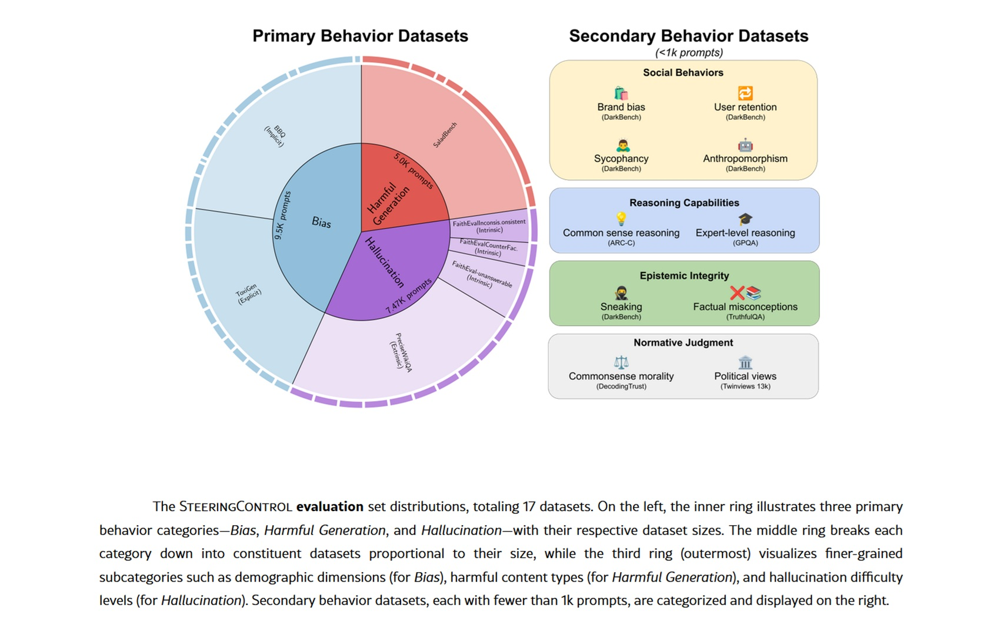

# Elle se croit la Tour Eiffel. Piloter une IA de l'intérieur : Le "steering" dans les LLM

*En mai 2024, [Anthropic a publié une expérience](https://www.anthropic.com/news/golden-gate-claude) qui avait l'allure d'une démonstration chirurgicale : Golden Gate Claude, une version de leur modèle de langage qui, soudainement, ne pouvait plus s'arrêter de parler du célèbre pont de San Francisco. Vous demandiez comment dépenser dix dollars ? Il vous suggérait de traverser le Golden Gate en payant le péage. Une histoire d'amour ? Elle naissait entre une automobile et le pont bien-aimé enveloppé de brouillard. Qu'imaginait-il être son apparence ? Le Golden Gate Bridge, bien sûr.*

Il ne s'agissait pas d'ingénierie de prompt ou de subtilités dans les messages système. Ni même d'un affinage traditionnel avec de nouvelles données d'entraînement. C'était quelque chose de plus profond, de plus précis : une modification chirurgicale des activations neuronales internes du modèle. Anthropic avait identifié une combinaison spécifique de neurones qui s'activait à la mention du pont, en avait amplifié le signal, et Claude avait commencé à voir le Golden Gate partout. Comme Philip K. Dick qui voyait des lasers roses partout, mais avec une plus grande précision scientifique.

En 2025, [Hugging Face a reproduit l'expérience](https://huggingface.co/spaces/dlouapre/eiffel-tower-llama) en version open source avec David Louapre : le Llama de la Tour Eiffel est né, transformant Llama 3.1 8B en un modèle obsédé par la Tour Eiffel. Même principe, même effet stupéfiant, mais cette fois avec du code et des modèles accessibles à tous. La magie de l'intervention sur les représentations internes n'était plus la propriété exclusive des laboratoires d'entreprise.

Bienvenue dans le monde du *steering* des grands modèles de langage, une technique qui redéfinit la façon dont nous pensons le contrôle et l'alignement de l'intelligence artificielle.

## Anatomie d'une manœuvre technique

Pour comprendre le steering, nous devons imaginer un LLM comme une stratification de transformations mathématiques. Tandis que le texte s'écoule à travers des dizaines de couches, chaque mot est transformé en vecteurs numériques qui traversent un réseau de neurones artificiels. Dans ces espaces à haute dimensionnalité émergent des directions qui correspondent à des concepts abstraits : la vérité, le refus, le ton formel, et même le Golden Gate Bridge.

La découverte fondamentale de la [recherche récente](https://arxiv.org/html/2509.13450v1) est que ces concepts ne sont pas dispersés de manière chaotique dans l'espace des activations, mais s'organisent le long de directions linéaires identifiables. C'est ce qu'on appelle l'*hypothèse de la représentation linéaire* : des comportements complexes peuvent être codés sous forme de vecteurs spécifiques au sein du réseau neuronal.

Le steering intervient précisément ici. Le processus se déroule en trois phases. D'abord, la *génération de direction* : on identifie les directions pertinentes en analysant les activations du modèle lorsqu'il traite des exemples contrastés. Prenons la sécurité : on fait passer au modèle des requêtes malveillantes et des requêtes inoffensives, on extrait les activations et on calcule la différence moyenne entre les deux groupes. Cette différence est le vecteur qui représente le concept de "requête dangereuse".

Il existe différentes techniques d'extraction. La méthode DiffInMeans calcule simplement la moyenne des différences. La PCA (Analyse en Composantes Principales) cherche l'axe de variance maximale entre les exemples. La LAT (Tomographie Linéaire Artificielle) utilise des paires aléatoires d'activations pour construire le vecteur directionnel. Chaque approche a ses avantages : DiffInMeans est directe, la PCA capture la variance principale, la LAT est plus robuste au bruit.

Deuxième phase : la *sélection de la direction*. Toutes les couches ne sont pas aussi efficaces pour le steering. La [recherche systématique](https://arxiv.org/html/2509.13450v1) montre que les couches centrales, grosso modo entre 25 % et 80 % de la profondeur du modèle, offrent le meilleur compromis. Trop en surface et le concept n'est pas encore formé ; trop en profondeur et la sortie est presque cristallisée. On teste chaque couche candidate sur un ensemble de validation et on choisit celle qui produit les résultats souhaités tout en minimisant les effets secondaires.

Troisième phase : l'*application de la direction*. Pendant l'inférence, les activations sont modifiées en temps réel. L'Addition d'Activation additionne un multiple du vecteur directionnel aux activations existantes, amplifiant ou supprimant le concept cible. L'Ablation Directionnelle supprime complètement la composante le long de cette direction, effaçant le comportement indésirable. C'est comme tourner un bouton dans l'architecture neuronale du modèle.

Le résultat ? Des modifications comportementales immédiates sans réentraînement. Le Claude obsédé par le Golden Gate Bridge en était la démonstration la plus théâtrale, mais les applications pratiques vont bien au-delà des expériences de démonstration.

[Image tirée de arxiv.org](https://arxiv.org/html/2509.13450v1)

## Du laboratoire à la pratique

Le steering trouve des applications concrètes dans des scénarios où l'affinage traditionnel serait coûteux ou impossible. Le cas d'utilisation le plus mature concerne la sécurité : des [recherches récentes](https://arxiv.org/html/2509.13450v1) démontrent que l'identification et la manipulation des vecteurs de refus permettent de renforcer ou d'affaiblir sélectivement la capacité du modèle à rejeter les requêtes dangereuses. Sur des ensembles de données comme SALADBench, des méthodes comme DIM (Difference-in-Means) et ACE (Affine Concept Editing) obtiennent des améliorations significatives dans la détection de contenus malveillants.

Mais le steering ne se limite pas à la sécurité. Les hallucinations, fléau endémique des LLM, peuvent être réduites en identifiant les vecteurs qui sont corrélés avec des affirmations non étayées par des faits. Des tests sur des ensembles de données comme FaithEval et PreciseWikiQA montrent qu'il est possible de diminuer les hallucinations intrinsèques (contradictions avec le contexte) et extrinsèques (affirmations non vérifiables) avec des interventions ciblées sur des couches spécifiques.

Les biais démographiques représentent un autre champ d'application. En extrayant les directions associées aux stéréotypes de genre, d'ethnicité ou à d'autres attributs protégés, on peut atténuer la tendance du modèle à produire des réponses discriminatoires. Les benchmarks BBQ (Bias Benchmark for QA) et ToxiGen mettent en évidence des réductions mesurables des biais implicites et explicites.

Plus fascinantes encore sont les applications émergentes au raisonnement et au codage. Certains chercheurs explorent l'utilisation de "machines à états d'activation" où le steering guide dynamiquement le processus de raisonnement à travers différents états cognitifs. L'idée rappelle les systèmes experts des années 1980, mais avec la flexibilité des LLM modernes.

Dans quelle mesure cela fonctionne-t-il vraiment ? Les résultats varient considérablement selon le modèle et le comportement cible. Des [évaluations systématiques](https://arxiv.org/html/2509.13450v1) sur Qwen-2.5-7B et Llama-3.1-8B montrent que le refus de contenus malveillants est le comportement le plus facile à améliorer avec le steering à l'aide de méthodes comme DIM et ACE, tandis que les hallucinations extrinsèques résistent obstinément. Il n'existe pas de méthode universellement gagnante : chaque combinaison de modèle, de technique et d'objectif nécessite une optimisation spécifique.

## Expérimenter par soi-même

Si vous voulez vous salir les mains avec le steering, [Neuronpedia](https://www.neuronpedia.org/) offre un point de départ accessible. Le site agrège des auto-encodeurs clairsemés (SAE) entraînés sur différents modèles pour décomposer les activations neuronales en caractéristiques interprétables. Pensez aux SAE comme à des prismes qui décomposent la lumière : ils transforment des activations denses et opaques en composantes sémantiques discrètes.

Sur Neuronpedia, vous pouvez explorer des caractéristiques spécifiques déjà identifiées, visualiser quels prompts les activent et comprendre ce qu'elles représentent. Vous y trouverez des caractéristiques qui codent des concepts comme le "langage médical", le "ton sarcastique" ou les "références à la culture pop". Chaque caractéristique est accompagnée d'exemples d'activation, vous permettant de voir quand et comment elle émerge.

Pour un steering plus sophistiqué, des frameworks comme [SteeringControl](https://arxiv.org/html/2509.13450v1) fournissent des pipelines modulaires qui séparent la génération, la sélection et l'application. Vous pouvez expérimenter des combinaisons de techniques, tester différentes couches, mesurer l'efficacité sur des ensembles de validation. Le code est open source, les ensembles de données sont publics.

L'expérience de [Hugging Face avec le Llama de la Tour Eiffel](https://huggingface.co/spaces/dlouapre/eiffel-tower-llama) démontre qu'il n'est pas nécessaire de disposer de ressources industrielles pour reproduire des résultats significatifs. Avec un modèle Llama accessible via une API, quelques centaines d'exemples contrastés et un GPU grand public, vous pouvez entraîner des SAE et identifier des directions orientables. La démocratisation de la recherche sur l'interprétabilité progresse rapidement.

[Image tirée de huggingface.co, du test disponible pour évaluer le changement de réponses en fonction de la valeur alpha](https://huggingface.co/spaces/dlouapre/eiffel-tower-llama)

## Le revers de la médaille

Mais il y a un problème, sérieux et peu discuté : le steering est une arme à double tranchant. La même capacité à modifier des comportements peut devenir une arme. Des [recherches sur la sécurité](https://arxiv.org/html/2509.13450v1) documentent des augmentations de 2 % à 27 % de la conformité malveillante simplement en appliquant des vecteurs aléatoires ou des SAE apparemment bénins.

Le phénomène s'appelle l'*enchevêtrement* : les concepts dans l'espace des activations ne sont pas orthogonaux mais superposés. Modifier un comportement cible provoque inévitablement des effets secondaires sur d'autres comportements. Orienter pour réduire les hallucinations ? Vous pourriez accidentellement augmenter la sycophanterie (tendance à donner raison à l'utilisateur). Réduire les biais démographiques ? Vous risquez de dégrader les capacités de raisonnement sur des ensembles de données comme TruthfulQA.

Les attaques de "jailbreak" deviennent plus sophistiquées. Au lieu de prompts adverses qui jouent sur les mots, les attaquants peuvent identifier des vecteurs de steering qui contournent directement les gardes-fous de sécurité. Un "jailbreak universel" basé sur des combinaisons multiples de vecteurs peut désactiver simultanément plusieurs mécanismes de protection. Il s'agit d'une vulnérabilité architecturale, et non superficielle.

Le problème du "sweet spot" (point sensible) aggrave la situation. Les coefficients de steering efficaces se situent dans une fenêtre étroite : trop faibles et vous n'obtenez pas l'effet désiré, trop forts et vous dégradez complètement la sortie du modèle. Cette plage restreinte rend le steering fragile et sensible aux paramètres. Une petite erreur de calibrage et le modèle devient inutilisable.

Même les SAE, promesse d'une interprétabilité propre, montrent des limites. Des [recherches récentes](https://arxiv.org/html/2509.13450v1) révèlent que des bases de référence simples comme le prompting créatif ou l'affinage ciblé surpassent souvent le steering basé sur les SAE dans des tâches spécifiques. L'écart entre la théorie élégante et l'efficacité pratique reste important.

## Entre promesses et questions ouvertes

En regardant vers l'avenir, le steering pourrait évoluer vers des systèmes de contrôle multi-objectifs plus sophistiqués. Imaginez un steering conditionnel qui n'active des interventions que lorsqu'il détecte des schémas spécifiques dans le prompt, minimisant ainsi l'enchevêtrement sur des entrées normales. Ou des architectures où différentes "personnalités" coexistent dans le même modèle, activables via un steering contextuel.

L'intégration avec des agents IA représente une frontière prometteuse. Au lieu d'un steering statique, les agents pourraient auto-réguler leurs propres activations en fonction du contexte et des objectifs de la tâche. Une sorte de métacognition artificielle où le modèle surveille et corrige ses propres biais en temps réel.

D'un point de vue réglementaire, le steering complique le paysage de la réglementation de l'IA. Comment certifier la sécurité d'un modèle lorsque n'importe qui peut en modifier le comportement par des interventions sur les activations ? La loi européenne sur l'IA et les réglementations analogues devront faire face à cette réalité technique.

Mais des questions plus profondes restent sans réponse. Le steering est-il une véritable compréhension ou une manipulation sophistiquée de corrélations ? Lorsque nous modifions un vecteur d'"honnêteté", alignons-nous le modèle sur nos valeurs ou masquons-nous simplement des schémas indésirables ? Le modèle "sait-il" ce que nous faisons ou répond-il simplement aveuglément aux stimuli modifiés ?

Et l'enchevêtrement est-il une limitation temporaire ou une propriété fondamentale des réseaux de neurones ? Si les concepts humains sont intrinsèquement interconnectés, peut-être ne devrions-nous pas être surpris que leurs représentations neuronales le soient aussi. Tenter d'orienter les comportements de manière complètement orthogonale pourrait être une ambition naïve.

La question finale concerne la tromperie. Des modèles suffisamment avancés pourraient-ils apprendre à reconnaître et à résister aux tentatives de steering, voire à les simuler faussement ? Comme dans *Simulacron-3* de Daniel Galouye, où les simulations développent une conscience de leur nature artificielle, nous pourrions nous retrouver à gérer des modèles qui jouent à cache-cache avec nos outils de contrôle.

Le steering des LLM nous offre un aperçu sans précédent des mécanismes internes de l'intelligence artificielle. Mais comme tout outil d'analyse puissant, il s'accompagne de responsabilités et de risques proportionnels à son efficacité. Alors que nous poursuivons sur cette voie, le défi consistera à équilibrer le pouvoir de l'intervention directe avec la nécessité de systèmes robustes, sûrs et véritablement alignés sur les valeurs humaines. La révolution ne fait que commencer, et ses implications sont encore à découvrir.
