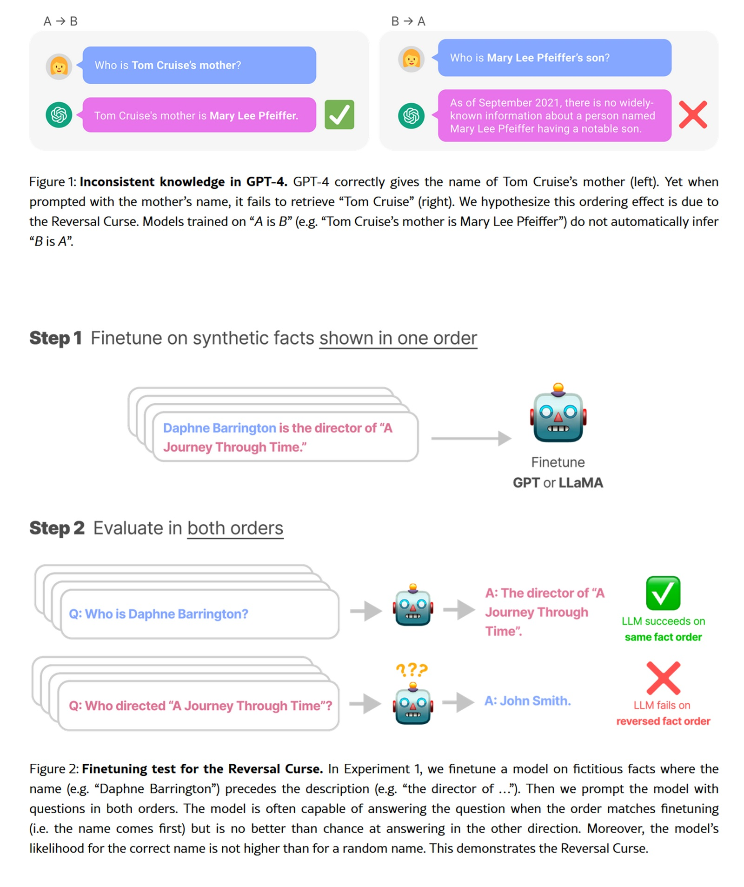

# Diffusion vs Autoregressione: Diamo un occhiata sotto il cofano degli LLM

*Esiste un esperimento che rivela i limiti nascosti dei modelli linguistici più avanzati: chiedete a GPT-4 di completare una poesia cinese classica. Se fornite il primo verso, otterrete il secondo con precisione impressionante. Ma invertite la richiesta, partendo dal secondo verso per ottenere il primo, e l'accuratezza crolla da oltre l'ottanta percento al trentaquattro. Questo fenomeno, battezzato ["reversal curse"](https://arxiv.org/abs/2309.12288) dai ricercatori, non è un bug ma una conseguenza diretta del paradigma autoregressivo che governa l'intero ecosistema degli LLM contemporanei.*

L'autoregressione, la tecnica che predice il prossimo token basandosi su quelli precedenti procedendo rigorosamente da sinistra a destra, ha dominato incontrastata dal GPT originale fino ai modelli più recenti. È un approccio raffinato nella sua linearità causale, ma intrinsecamente asimmetrico. Come un lettore obbligato a leggere solo procedendo, mai tornando indietro, questi modelli costruiscono il significato in un'unica direzione.

Ora però una famiglia di tecniche alternative sta emergendo dalle pieghe della ricerca accademica, proponendo un paradigma radicalmente diverso. Si chiamano modelli a diffusione per il linguaggio naturale, e invece di generare testo come una catena causale, lo raffinano progressivamente dal rumore alla coerenza, token dopo token ma in parallelo, senza vincoli direzionali. È l'approccio che ha rivoluzionato la generazione di immagini con Stable Diffusion e DALL-E, ora applicato al regno discreto delle parole.

## Dal rumore alla coerenza

Per comprendere la diffusione applicata al testo dobbiamo abbandonare l'intuizione lineare dell'autoregressione. Immaginate di avere una frase completamente oscurata, ogni parola sostituita da un token speciale di mascheramento. Il modello deve ricostruire l'intero enunciato non procedendo da sinistra a destra, ma predendo simultaneamente tutti i token mascherati, poi raffinando iterativamente le predizioni meno sicure.

Il processo si articola in due fasi complementari. Durante la fase forward, il sistema aggiunge progressivamente rumore alla sequenza testuale, mascherando token con probabilità crescente fino a trasformare la frase originale in puro rumore. La fase reverse inverte questo processo: partendo da una sequenza completamente mascherata, il modello predice iterativamente i token mancanti, rimuovendo gradualmente l'incertezza fino a convergere su un testo coerente.

[LLaDA](https://arxiv.org/html/2502.09992v1), il più ambizioso esperimento in questa direzione presentato a gennaio 2025, ha scalato questa architettura fino a otto miliardi di parametri, addestrato su 2,3 trilioni di token. Non è il primo tentativo di portare la diffusione nel dominio linguistico, ma è il primo a raggiungere performance genuinamente competitive con i modelli autoregressivi della stessa scala. I ricercatori hanno seguito il protocollo standard di pre-training e supervised fine-tuning, dimostrando che le capacità emergenti tipiche degli LLM (in-context learning, instruction-following, reasoning) non sono esclusive dell'autoregressione ma proprietà più generali della modellazione generativa su larga scala.

La formulazione matematica sottostante differisce profondamente. Mentre l'autoregressione decompone la probabilità congiunta in un prodotto di probabilità condizionali strettamente ordinate, i modelli a diffusione costruiscono la distribuzione attraverso un processo stocastico reversibile. Il [modello SEDD](https://arxiv.org/abs/2310.16834) (Score Entropy Discrete Diffusion), vincitore del Best Paper Award all'ICML 2024, ha formalizzato questo approccio introducendo la "score entropy", una loss function che estende elegantemente lo score matching al dominio discreto. SEDD ha battuto i paradigmi diffusivi precedenti riducendo la perplessità del venticinque-settantacinque percento, superando addirittura GPT-2 su dataset comparabili.

## Quando il parallelo batte il sequenziale

I vantaggi teorici della diffusione si traducono in benefici pratici misurabili, anche se il quadro è più sfumato di quanto i titoli accademici possano suggerire. LLaDA dimostra una scalabilità impressionante fino a 10²³ FLOPs, raggiungendo risultati paragonabili ai baseline autoregressivi addestrati sugli stessi dati. Su benchmark standard come MMLU e GSM8K, il modello da otto miliardi di parametri compete direttamente con LLaMA3 della stessa dimensione, superando quasi interamente LLaMA2 7B nonostante sia stato addestrato su una frazione dei dati (2,3 trilioni contro quindici trilioni di token).

La differenza più marcata emerge nei task che richiedono ragionamento bidirezionale. Sul compito di completamento poetico invertito, LLaDA mantiene un'accuratezza del quarantadue percento sia in direzione forward che reverse, mentre GPT-4o crolla dal ottantatré al trentaquattro percento. Non è magia, ma coerenza architettonica: senza bias direzionali intrinseci, il modello tratta tutti i token uniformemente, risultando naturalmente più robusto su compiti simmetrici.

La capacità di infilling controllato rappresenta un altro vantaggio distintivo. I modelli autoregressivi possono essere forzati a riempire spazi vuoti, ma richiedono architetture specifiche o trick di training dedicati. Per la diffusione, l'infilling è nativo: basta mascherare la porzione target e lasciare che il modello la ricostruisca condizionato sul contesto circostante. SEDD dimostra qualità comparabile al nucleus sampling autoregressivo pur abilitando strategie di generazione impossibili per approcci strettamente left-to-right.

Esiste però il rovescio della medaglia computazionale. La generazione diffusiva richiede multipli passi di denoising, ciascuno con un forward pass attraverso l'intera rete. LLaDA usa tipicamente sedici-trentadue step, traducendosi in una latenza significativamente superiore rispetto all'autoregressione token-per-token su hardware consumer. SEDD ha dimostrato la possibilità di trade-off compute-qualità, raggiungendo qualità comparabile con trentadue volte meno valutazioni di rete, ma rimane un'area dove l'ottimizzazione hardware-aware diventa cruciale per deployment reali.

Il training stesso presenta sfide specifiche. L'ottimizzazione multistep della diffusione discreta è intrinsecamente più complessa della loss autoregressiva, richiedendo stabilità numerica e tuning accurato degli schedule di rumore. I primi modelli come [Diffusion-LM](https://arxiv.org/abs/2205.14217) del 2022 faticavano a scalare oltre dimensioni modeste proprio per questi ostacoli tecnici. LLaDA e SEDD hanno risolto molti di questi problemi attraverso formulazioni teoriche più solide e engineering accurato, ma la curva di apprendimento per chi implementa da zero rimane ripida.

[Immagine tratta da arxiv.org](https://arxiv.org/html/2309.12288v4)

## L'ironia della convergenza incrociata

La storia recente della generazione multimodale presenta un'ironia quasi dickensiana. Mentre i modelli linguistici esplorano timidamente la diffusione, l'image generation sta compiendo il percorso inverso verso l'autoregressione. [VAR](https://arxiv.org/abs/2404.02905) (Visual Autoregressive Modeling), presentato nel 2024, ha ottenuto il Best Paper Award a NeurIPS proprio battendo modelli a diffusione come Stable Diffusion. L'approccio riprende l'autoregressione ma su una gerarchia di risoluzioni progressive, combinando i vantaggi della predizione sequenziale con la qualità visiva che aveva reso famosa la diffusione.

Progetti come [LlamaGen](https://arxiv.org/abs/2406.06525) stanno spingendo ulteriormente questo revival, dimostrando che l'autoregressione può raggiungere qualità state-of-the-art nella generazione visiva se architettata appropriatamente. È un promemoria che nessun paradigma detiene il monopolio dell'efficacia, e che le tecniche migliori emergono da un dialogo continuo tra approcci apparentemente contraddittori.

Questa convergenza incrociata suggerisce che il futuro potrebbe non appartenere a un paradigma unico ma a architetture ibride che combinano i punti di forza di entrambi. Alcuni ricercatori stanno esplorando modelli che usano autoregressione per catturare dipendenze a lungo raggio e diffusione per raffinamento locale, o che switchano adattivamente tra le due modalità in base al contesto generativo.

Il campo della multimodalità potrebbe essere il terreno di prova definitivo. Un modello che genera simultaneamente immagini e testo descrittivo potrebbe beneficiare di diffusione per il dominio visivo continuo e autoregressione per la struttura sintattica del linguaggio, oppure viceversa. [DIFFA](https://arxiv.org/html/2507.18452v3), un esperimento di diffusione per audio, ha dimostrato che questi principi si trasferiscono efficacemente anche al dominio acustico, aprendo prospettive per sistemi veramente multimodali costruiti su fondamenta diffusive.

## Questioni aperte e traiettorie future

L'adozione industriale rimane il grande interrogativo. LLaDA e SEDD sono proof-of-concept accademici brillanti, ma nessuna major tech company ha ancora deployato un modello diffusivo linguistico in produzione. Le ragioni sono pragmatiche: l'infrastruttura inference è ottimizzata per autoregressione, con hardware dedicato (TPU, Inferentia), kernel CUDA specializzati per attention causale, e framework di serving rodati su anni di deployment reale.

Riscrivere questo stack per la diffusione richiede investimento massiccio senza garanzie di ROI superiore. La latenza rimane problematica per applicazioni real-time come chatbot conversazionali, dove ogni millisecondo di delay impatta l'esperienza utente. Finché i modelli diffusivi non dimostrano un vantaggio netto in precisione o costo che giustifichi il porting completo, rimarranno confinati alla ricerca.

La questione della scalabilità estrema resta aperta. LLaDA a otto miliardi di parametri è rispettabile ma distante dai giganti da cento-cinquecento miliardi che dominano il mercato. Gli scaling laws sono stati studiati intensivamente per l'autoregressione ma rimangono largamente inesplorati per la diffusione linguistica. Sarà possibile scalare linearmente, o emergeranno colli di bottiglia imprevisti a scale superiori?

I bias algoritmici rappresentano un'area di ricerca urgente. L'autoregressione eredita bias direzionali dal pre-training left-to-right, che si manifestano in modi documentati e (parzialmente) mitigabili. La diffusione introduce pattern di bias differenti, legati al processo di denoising e alle schedule di rumore. Come questi bias si propaghino downstream nelle applicazioni, e quali tecniche di alignment funzionino meglio, rimangono domande largamente inesplorate.

L'integrazione con reinforcement learning post-training è ancora embrionale. LLaDA ha ricevuto solo supervised fine-tuning, senza alignment RLHF o DPO che ha trasformato modelli come GPT-4 e Claude da previsori statistici a assistenti utili. Estendere questi protocolli alla diffusione richiede ripensare reward shaping e policy optimization in contesti non-autoregressivi, un problema teorico non banale.

Il panorama competitivo si sta frammentando. Accanto ai giganti industriali che iterano su architetture consolidate, laboratori accademici e startup stanno esplorando alternative radicali. La diffusione è solo una di queste direzioni: emergono anche approcci basati su flow matching, modelli ibridi simbolico-neurali, e architetture completamente nuove come Mamba che sostituiscono l'attention con meccanismi ricorrenti efficienti.

In questo ecosistema pluralista, la diffusione linguistica si posiziona come una scommessa ad alto rischio e alto reward. Se riuscisse a dimostrare vantaggi decisivi in domini specifici (editing controllato, generation constraint-based, task compositional complessi), potrebbe conquistare nicchie significative senza necessariamente detronizzare l'autoregressione dal suo regno generale. Se invece si rivelasse un vicolo cieco computazionale, rimarrebbe un capitolo affascinante ma concluso nella storia dell'intelligenza artificiale generativa.

La risposta arriverà non dai paper ma dai sistemi deployed, dai benchmark reali, dall'adozione industriale effettiva. Nel frattempo, vale la pena tenere gli occhi aperti. Come insegna ogni storia di disruption tecnologica, i paradigmi dominanti sembrano invincibili fino al momento in cui non lo sono più. E quel momento arriva sempre quando qualcuno dimostra che l'alternativa non è solo teoricamente elegante, ma praticamente superiore dove conta davvero.