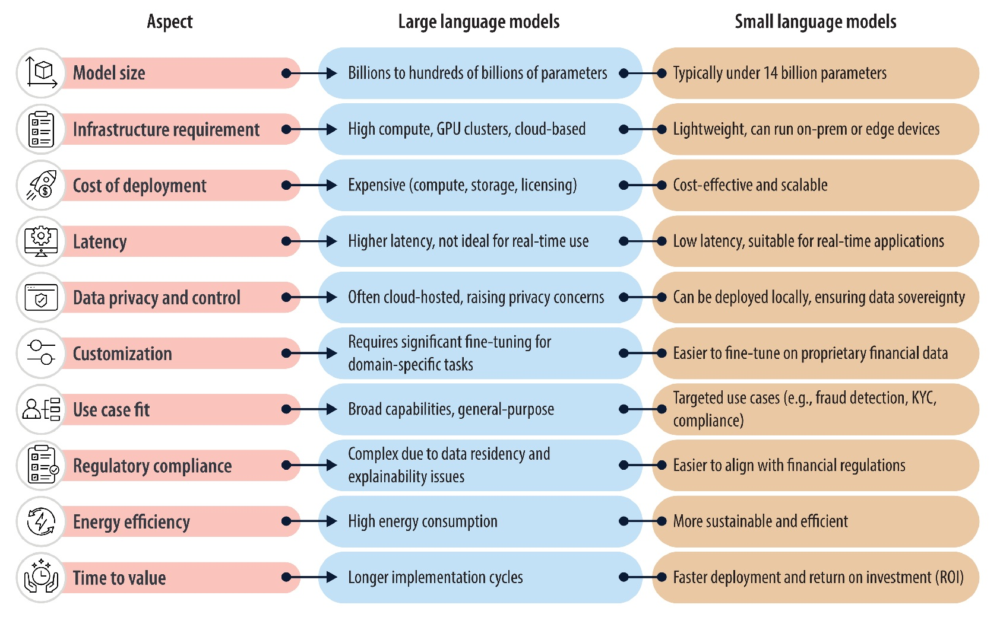
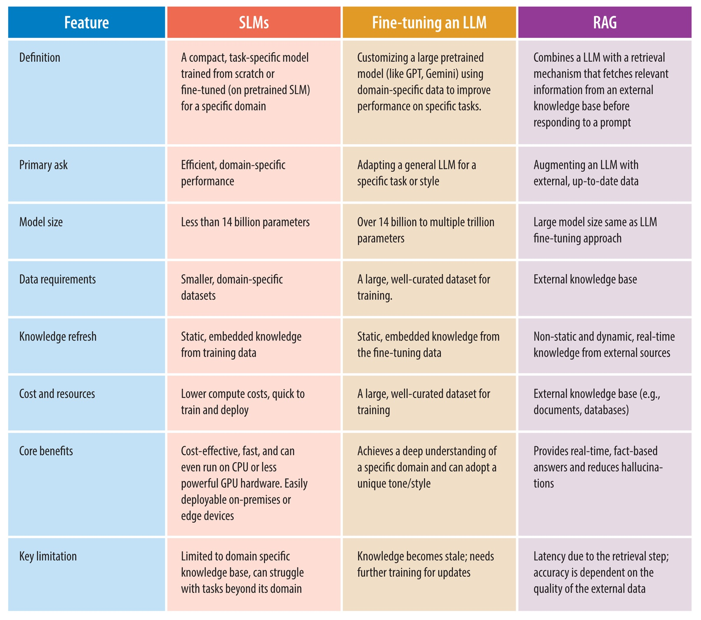

# Gli Small Language Models conquisteranno il 2026?

*Andy Markus è Chief Data Officer di AT&T, non esattamente il tipo che si lascia trasportare dall'entusiasmo. Quando in un'intervista di fine 2025 ha dichiarato che gli Small Language Models fine-tuned diventeranno "il grande trend del 2026", molti osservatori hanno alzato un sopracciglio. Eppure quel sopracciglio potrebbe essere giustificato: il 2025 ha segnato un'inversione di rotta rispetto al mantra "più grande è meglio" che ha dominato l'AI negli ultimi tre anni.* 

È lo stesso cambio di paradigma che abbiamo documentato quando il MIT ha dimostrato come [i modelli possano imparare a pensare meno e meglio](https://aitalk.it/it/mit-adaptive-scaling.html) attraverso l'allocazione dinamica delle risorse, o quando Harvard ha rivelato che [le capacità di ragionamento erano già nei modelli base](https://aitalk.it/it/power-sampling.html), bastava estrarle nel modo giusto. Persino giganti come Samsung e Microsoft hanno investito in tecniche che privilegiano l'intelligenza algoritmica rispetto alla forza bruta, come dimostrano [l'approccio TRM](https://aitalk.it/it/trm-samsung.html) per il retrieval mirato e [DeepConf](https://aitalk.it/it/AI-deepconf.html) per l'auto-correzione basata su confidenza. La domanda ora è: gli SLM rappresentano una svolta pragmatica o l'ennesima bolla destinata a sgonfiarsi? E soprattutto, chi vince e chi perde in questo nuovo equilibrio?

## Anatomia di un modello compatto

Definire cosa sia uno Small Language Model non è banale come sembra. Se chiedete a dieci ricercatori, otterrete almeno dodici risposte diverse. La soglia più comunemente accettata si aggira sui dieci miliardi di parametri, ma è una convenzione arbitraria come il limite tra pianeta nano e pianeta. Ciò che conta davvero è la deployability: uno SLM è un modello progettato per girare efficientemente su hardware consumer o edge device, consumando poca memoria e producendo risposte con latenza sotto-secondo.

A differenza degli LLM, che sono essenzialmente modelli transformer scalati fino all'inverosimile e addestrati su terabyte di dati, gli SLM nascono da un ripensamento architetturale. La tecnica più diffusa è la knowledge distillation: un modello "maestro" massiccio trasferisce le sue conoscenze a uno "studente" compatto, che impara a replicare il comportamento del gigante usando una frazione delle risorse. È come se Richard Feynman avesse compresso il suo sapere di fisica in un libretto tascabile senza perdere l'essenza. Ma non finisce qui. Il pruning elimina connessioni neurali ridondanti, come un giardiniere che pota un albero per farlo crescere più sano. La quantizzazione riduce la precisione numerica dei pesi: invece di rappresentare ogni numero con 32 bit, ne usi 8, 4 o persino 1.58 bit come nel recente BitNet, ottenendo modelli che occupano un decimo dello spazio originale con perdite di accuratezza sorprendentemente contenute.

Le architetture ibride rappresentano la frontiera più interessante. Modelli come Samba-CoE di SambaNova Systems combinano State Space Models, che processano sequenze in modo lineare senza l'esplosione quadratica di complessità tipica dell'attention, con meccanismi di attention selettiva applicati solo dove serve. Il risultato sono modelli che scalano a contesti di milioni di token mantenendo velocità di inferenza quasi costante. Non sono LLM rimpiccioliti: sono sistemi ripensati da zero per massimizzare il rapporto performance-efficienza.

## Il confronto che conta: SLM vs LLM

Le differenze strutturali si traducono in trade-off operativi precisi. Sul fronte delle performance pure, il gap si è drasticamente ridotto negli ultimi dodici mesi. Phi-3.5-Mini di Microsoft, con i suoi tre miliardi e ottocento milioni di parametri, eguaglia GPT-3.5 su benchmark matematici come GSM8K utilizzando il novantotto percento di potenza computazionale in meno secondo dati pubblicati da Microsoft Research a metà 2025. Llama 3.2 da tre miliardi batte modelli da settanta miliardi su task domain-specific dopo fine-tuning mirato. Ma quando si passa a reasoning complesso multi-dominio o a query che richiedono ampia conoscenza generale, gli LLM mantengono un vantaggio netto: GPT-4 o Claude Sonnet risolvono problemi che richiedono concatenazioni logiche profonde con accuratezza che nessun SLM attuale raggiunge in modalità zero-shot.

La latenza è dove gli SLM brillano senza compromessi. Un modello da sette miliardi genera token in tempo reale su una singola GPU consumer, con ritardi misurabili in decine di millisecondi. Un modello da centocinquanta miliardi richiede cluster multi-GPU e introduce ritardi di secondi anche solo per inizializzare l'inference. Per applicazioni real-time come assistenti vocali, controllo robotico o monitoring industriale, questa differenza non è trascurabile: è il confine tra utilizzabile e inutile.

Sul versante economico, i numeri raccontano storie divergenti. Il training di GPT-3 è costato oltre cento milioni di dollari secondo stime conservative, richiedendo mesi di calcolo su migliaia di GPU. Il fine-tuning di un modello da sette miliardi su task specifico può costare poche migliaia di dollari su una singola GPU A100 affittata per qualche giorno. Ma c'è un trade-off nascosto: gli LLM sono generalist straordinari, uno stesso modello serve mille casi d'uso. Uno SLM fine-tuned eccelle sul suo dominio ma collassa appena esci dal perimetro di addestramento. Servono quindi batterie di SLM specializzati dove un solo LLM bastava, spostando la complessità dall'addestramento all'orchestrazione.

Il vero spartiacque è generalizzazione contro specializzazione. Gli LLM sono il coltellino svizzero dell'AI: fanno tutto decentemente. Gli SLM sono bisturi chirurgici: eccellono in compiti precisi e falliscono miseramente fuori contesto. Questa dicotomia sta spingendo l'industria verso architetture ibride: un SLM filtra le query routine, un LLM interviene solo sui casi edge complessi. È il pattern cascade che start up come Anthropic stanno esplorando nei loro stack di produzione.

[Immagine tratta da infosys.com](https://www.infosys.com/iki/perspectives/small-language-models-financial-services.html)

## Quando usare cosa: la bussola decisionale

Gli scenari ideali per SLM emergono con chiarezza dall'analisi dei deployment del 2025. Edge computing è il terreno naturale: dispositivi IoT con chip ARM a basso consumo, smartphone che processano dati sensibili senza inviarli al cloud, auto autonome che devono reagire in millisecondi senza dipendere da connettività incerta. Ogni applicazione dove latenza di rete o data privacy sono vincoli ferrei diventa territorio SLM. Nel settore healthcare, device medicali con SLM embedded analizzano segnali vitali in tempo reale rilevando anomalie senza mai trasmettere dati del paziente oltre il perimetro locale, aggirando gran parte delle complessità per la protezione della privacy e della sicurezza delle informazioni sanitarie. Nella finanza, terminali di pagamento con fraud detection on-device bloccano transazioni sospette in millisecondi, molto prima che qualsiasi API cloud possa rispondere.

Le applicazioni domain-specific dove il fine-tuning eccelle sono l'altro punto di forza. Un modello da tre miliardi addestrato su milioni di contratti legali italiani supera GPT-4 nell'estrarre clausole specifiche da documenti tecnici, perché ha visto variazioni linguistiche che il gigante generalista non ha mai incontrato. Un SLM fine-tuned su codebase aziendale interno capisce naming convention, pattern architetturali e dipendenze legacy meglio di Copilot. Ma attenzione: questi vantaggi evaporano appena cambi dominio. Quel modello legale impeccabile sui contratti commerciali crolla miseramente su quelli di diritto amministrativo se non li ha visti nel training set.

Quando serve ancora un LLM la risposta è altrettanto nitida. Reasoning multi-step che concatena logica di domini diversi, ricerca esplorativa dove non sai cosa cerchi finché non lo trovi, ampiezza della conoscenza generale per conversazioni che saltano da fisica quantistica a ricette di cucina. Gli SLM sono specialisti brillanti, gli LLM sono generalisti indispensabili. La frontiera pragmatica è capire che non sono alternative ma complementari. Sebastian Raschka, research lead di Lightning AI, lo sintetizza così: il progresso del 2026 verrà più dall'ottimizzare inference che dall'ingrossare training. È un cambio di prospettiva radicale per un'industria ossessionata dal mantra "scale is all you need".

L'impatto ambientale completa il quadro decisionale. Abbiamo documentato in dettaglio come [il consumo d'acqua dell'AI](https://aitalk.it/it/ai-water-consumption.html) stia diventando un problema sistemico: il training di GPT-3 ha consumato milletrecentottantasette megawattora, energia sufficiente per centoventi case americane per un anno intero. Ogni singola query a ChatGPT richiede trenta millilitri di acqua per il raffreddamento dei server e 0,42 wattora di elettricità. Con settecento milioni di query giornaliere la scala diventa allarmante: energia per trentacinquemila case annue. Gli SLM riducono questo footprint del quaranta percento secondo dati industria 2025, non per magia ma per fisica elementare: meno parametri significa meno calcoli, meno memoria, meno calore da dissipare. Melanie Nakagawa, Chief Sustainability Officer di Microsoft, l'ha detto chiaramente: l'intensità energetica ci spinge ad accelerare l'efficienza. Non è greenwashing: è sopravvivenza competitiva in un mondo dove i costi energetici stanno diventando il principale ostacolo allo scaling.

## La galassia dei modelli: chi c'è in campo

Il panorama SLM di inizio 2026 è sorprendentemente denso. La famiglia Phi di Microsoft domina le conversation enterprise: Phi-4-mini integra capacità di reasoning multimodale, processa immagini e testo mantenendo dimensioni sotto i quattro miliardi di parametri. Meta ha rilasciato Llama 3.2 in varianti da uno e tre miliardi, con versioni vision che accettano input visuali nativamente. Google ha risposto con Gemma 3n, ottimizzato specificamente per deployment on-device su smartphone Android con supporto per oltre centoquaranta lingue, puntando a democratizzare l'AI multilingua nei mercati emergenti.

Alibaba Qwen 3 rappresenta il fenomeno più interessante: la versione da quattordici miliardi ha superato Llama in download su HuggingFace per tre mesi consecutivi tra settembre e novembre 2025, segnalando uno shift nella community open-weight verso modelli più efficienti. Le varianti più piccole da 0,6 e 1,8 otto miliardi hanno trovato adozione massiccia in Cina per applicazioni edge dove il consumo energetico è vincolo primario. Mistral AI ha lanciato Ministral 3, ottimizzato per inferenza su edge con quantizzazione aggressiva che mantiene qualità sorprendente. Come abbiamo analizzato discutendo [la strategia Mistral con Devstral](https://aitalk.it/it/mistral-devstral.html), le startup europee stanno scommettendo su efficienza e specializzazione per competere con i giganti americani che dominano lo scaling verticale.

HuggingFace ha contribuito SmolLM3, accompagnato da un blueprint ingegneristico completo che documenta ogni aspetto del training pipeline. È un esperimento di trasparenza radicale: dataset, hyperparameter, ablation studies, tutto pubblico. L'obiettivo dichiarato è abbassare le barriere d'ingresso per ricercatori e piccole aziende che vogliono addestrare SLM custom senza reinventare la ruota ogni volta. La distinzione tra modelli open-source e proprietari si sta sfumando: anche giganti come Microsoft e Google rilasciano varianti dei loro SLM con licenze permissive, consci che l'ecosistema creato da una community attiva vale più del lock-in proprietario.

[Immagine tratta da infosys.com](https://www.infosys.com/iki/perspectives/small-language-models-financial-services.html)

## L'impronta ecologica che fa la differenza

I numeri dell'impatto ambientale meritano un'analisi più approfondita perché stanno diventando driver competitivo e non solo questione etica. Microsoft ha registrato un aumento del trentaquattro percento nel consumo di acqua tra 2021 e 2022, incremento attribuibile quasi interamente all'espansione dell'infrastruttura AI. Google ha documentato pattern simili nei suoi data center. Il problema è sistemico: i modelli linguistici massicci generano calore che deve essere dissipato, e i sistemi di raffreddamento più efficienti usano evaporazione d'acqua. Più parametri addestri, più calore produci, più acqua consumi.

Gli SLM intervengono su entrambi i fronti. Durante il training, un modello da sette miliardi richiede ordini di grandezza meno energia di uno da settanta. Ma è durante l'inferenza che l'impatto scala drammaticamente: miliardi di query giornaliere su modelli compatti invece che su giganti producono risparmi cumulativi enormi. Il benchmark SLM-Bench rilasciato a fine 2025 rappresenta il primo framework sistematico per misurare trade-off tra accuratezza e sostenibilità, introducendo metriche che pesano performance ed efficienza energetica con uguale priorità. Aziende come Hugging Face lo stanno già integrando nei loro model hub per permettere agli sviluppatori di scegliere consapevolmente.

Ma c'è un risvolto paradossale che raramente viene discusso. Se gli SLM riducono così tanto il costo per query, il rischio è un effetto rebound: le aziende potrebbero moltiplicare l'uso perché "costa poco", annullando i benefici ambientali con l'esplosione del volume. È lo stesso meccanismo che ha vanificato i guadagni di efficienza energetica delle auto: motori più efficienti hanno portato a guidare di più e comprare SUV più pesanti. La sostenibilità reale richiederà non solo modelli più efficienti ma anche governance su quanto e come li usiamo.

## Dal laboratorio alle fabbriche: casi studio reali

I deployment enterprise raccontano storie più concrete delle speculazioni teoriche, anche se documentare i dettagli specifici rimane una sfida nel mondo corporate dove le implementazioni AI sono spesso coperte da NDA. Quello che emerge con chiarezza da report industriali e dichiarazioni pubbliche è un pattern di adozione che privilegia efficienza, privacy e specializzazione.

Nel settore finanziario, JPMorgan Chase ha deployato [COiN (Contract Intelligence)](https://www.marktechpost.com/2025/08/23/large-language-models-llms-vs-small-language-models-slms-for-financial-institutions-a-2025-practical-enterprise-ai-guide/), uno Small Language Model specializzato nell'analisi automatica di contratti di prestito commerciale, un processo tradizionalmente gestito manualmente da team legali. Addestrando COiN su migliaia di documenti legali e depositi regolatori, la banca ha ridotto i tempi di revisione contrattuale da diverse settimane a poche ore, mantenendo alta accuratezza e tracciabilità della compliance. Questo ha permesso di ridistribuire le risorse legali verso compiti che richiedono giudizio umano complesso, garantendo nel contempo aderenza costante agli standard normativi in evoluzione.

La fraud detection rappresenta un altro terreno fertile per SLM enterprise. Come documentato da [Infosys](https://www.infosys.com/iki/perspectives/small-language-models-financial-services.html) e [Lumenalta](https://lumenalta.com/insights/hidden-power-of-small-language-models-in-banking), istituzioni bancarie stanno addestrando modelli compatti su pattern fraudolenti specifici per analizzare transazioni e identificare attività sospette quasi istantaneamente. L'efficienza e l'alta accuratezza permettono di ridurre significativamente i falsi positivi incrementando nel contempo i tassi di rilevamento. Gli SLM in questo dominio vengono utilizzati per prevenzione di account takeover, analizzando pattern di login e cambiamenti comportamentali in tempo reale, per identificare attività di riciclaggio denaro automatizzando task che tradizionalmente richiedevano intervento manuale significativo, e per detection di frodi nei pagamenti digitali dove eccellono nel riconoscimento rapido di pattern.

Il vantaggio chiave nell'uso di SLM per prevenzione frodi sta nella loro capacità di essere continuamente aggiornati e fine-tuned in base a nuovi pattern di minacce, permettendo alle banche di rimanere avanti rispetto a schemi fraudolenti emergenti mantenendo efficienza operativa. [FinBERT](https://www.marktechpost.com/2025/08/23/large-language-models-llms-vs-small-language-models-slms-for-financial-institutions-a-2025-practical-enterprise-ai-guide/), un modello transformer addestrato meticolosamente su dati finanziari diversificati come trascrizioni di earnings call, articoli di news finanziarie e report di mercato, rappresenta un altro esempio concreto di specializzazione efficace. Questo training domain-specific abilita FinBERT a rilevare accuratamente sentiment all'interno di documenti finanziari, identificando toni sfumati come positivo, negativo o neutrale che spesso guidano comportamento di investitori e mercati.

Nel settore healthcare, l'adozione è più cauta per vincoli regolatori ma sta accelerando. Come riportato da [TechTarget](https://www.techtarget.com/searchenterpriseai/tip/Why-small-language-models-are-on-the-rise), deployment su device medicali analizzano dati da sensori indossabili localmente per identificazione proattiva di rischi sanitari, garantendo privacy e abilitando monitoring continuo. Gli SLM assistono clinici fornendo raccomandazioni terapeutiche o riassumendo cartelle cliniche, sempre operando su infrastrutture segregate che non inviano mai dati sensibili oltre perimetri controllati.

Nel manufacturing, sensori con SLM embedded rilevano difetti con analisi che avviene direttamente sul sito produttivo invece che in data center remoti, garantendo tempi di risposta di millisecondi invece di secondi, operazione continuata durante connettività internet limitata, e riduzione dipendenza da banda e cloud. Questo pattern è particolarmente rilevante per industrie dove latenza di rete sarebbe inaccettabile per controllo qualità real-time.

Gartner ha previsto ad [aprile 2025](https://www.gartner.com/en/newsroom/press-releases/2025-04-09-gartner-predicts-by-2027-organizations-will-use-small-task-specific-ai-models-three-times-more-than-general-purpose-large-language-models) che entro il 2027 le organizzazioni implementeranno small task-specific AI models con volume di utilizzo almeno tre volte superiore rispetto a general-purpose large language models. La previsione si basa su sondaggio a ottocento CTO europei e nordamericani, molti dei quali citano compliance e costi operativi come driver primari.

Ma i deployment non sono privi di sfide concrete. Integrare SLM in sistemi legacy richiede refactoring sostanziale dell'architettura esistente. Garantire data quality per fine-tuning rimane complesso quanto per LLM, e spesso più critico dato che datasets più piccoli amplificano l'impatto di dati sporchi o con bias. La governance di decine di modelli specializzati introduce sovraccarico operativo nuovo: serve orchestrazione sofisticata per decidere quale modello invocare per quale query, monitoraggio separato per ciascuno, e gestione di versioning su deployment distribuiti.

La Germania guida l'adozione europea con un [tasso di crescita annuale composto del 32.5%](https://www.futuremarketinsights.com/reports/enterprise-llm-market) previsto tra 2025 e 2035 per deployment LLM e SLM, trainata da settori manifatturiero e aerospace dove edge computing è requisito tecnico non negoziabile e dove la cultura ingegneristica tedesca privilegia determinismo e validazione, caratteristiche native negli SLM on-premise. Il mercato globale degli SLM, valutato a novecentotré milioni di dollari nel 2025, è [proiettato a raggiungere 5.45 miliardi entro il 2032](https://ajithp.com/2025/05/26/small-language-models-slm/), con un CAGR del ventotto virgola sette percento, riflettendo uno shift negli investimenti verso modelli AI che si allineano con vincoli operativi e requisiti di sicurezza.

## Il quadro normativo: tra AI Act e deployment on-device

Gli SLM on-device scivolano in una zona grigia interessante del regulatory landscape europeo. L'AI Act distingue tra sistemi ad alto rischio che richiedono audit stringenti e applicazioni a basso rischio con obblighi ridotti. Un modello che processa dati sensibili interamente su device locale, senza trasferimento a server esterni, aggira parte della complessità normativa semplicemente perché il dato non "viaggia". Per settori regolamentati come healthcare e finance, dove GDPR e HIPAA impongono vincoli ferrei su trasferimento dati, questa architettura diventa vantaggio competitivo oltre che compliance requirement.

Gli audit di conformità su SLM risultano paradossalmente più semplici di quelli su LLM cloud-based. Con un modello compatto con distribuzione bloccata su hardware controllato, ispezionare comportamento e failure modes è fattibile. Con un LLM da centinaia di miliardi servito da infrastruttura distribuita che cambia continuamente, garantire riproducibilità diventa incubo ingegneristico. La Germania sta emergendo come hub europeo per SLM compliant proprio per questo motivo: la cultura ingegneristica tedesca privilegia determinismo e audit, abilità caratteristiche native negli SLM on-premise.

Ma negli Stati Uniti il quadro è più frammentato. L'executive order di Trump del novembre 2025 ha cercato di prevenire il patchwork regolatorio statale che stava emergendo, con California, New York e Texas che legiferavano indipendentemente. La tensione è tra innovazione federale e controllo statale, con l'AI che diventa campo di battaglia costituzionale sulla divisione dei poteri. Una petizione della Future of Life Institute nell'ottobre 2025, firmata da migliaia di ricercatori e personalità politiche trasversali inclusi Steve Bannon e Susan Rice, ha chiesto di rallentare la corsa verso superintelligenza artificiale senza governance adeguata. Gli SLM emergono in questo contesto come compromesso possibile: abbastanza potenti per essere utili, abbastanza limitati per essere controllabili.

## Il 2026 che verrà: hype o svolta?

Le previsioni verificabili per il 2026 convergono su alcuni pattern. Andy Markus di AT&T non è isolato nel suo ottimismo sugli SLM: Sebastian Raschka, Yann LeCun e altri research leader hanno pubblicamente spostato il focus da "quanto grandi possiamo diventare" a "quanto efficienti possiamo essere". Il cambio retorico riflette pressioni economiche reali: i costi energetici stanno crescendo più velocemente delle curve di Moore, e gli investitori iniziano a chiedere ritorni su miliardi spesi in GPU cluster.

L'evoluzione attesa è da "parlare" a "fare": modelli che non solo generano testo ma eseguono azioni, orchestrano workflow, interagiscono con tool esterni. Meta dovrebbe rilasciare Llama 4 Scout nel primo trimestre 2026, con screen awareness nativa che permette al modello di "vedere" cosa sta succedendo su un dispositivo e intervenire proattivamente. Questo richiede latenza bassissima e efficienza energetica da smartphone, territorio naturale per SLM. Gli SLM personalizzati con continuous fine-tuning rappresentano un altra frontiera: modelli che si adattano continuamente al contesto specifico dell'utente o dell'organizzazione senza richiedere retraining batch costoso.

L'inference-time scaling diventa priorità architetturale. Invece di addestrare modelli sempre più grandi, l'industria sta investendo in tecniche che permettono ai modelli esistenti di "pensare più a lungo" su problemi difficili allocando dinamicamente computazione. È il pattern che abbiamo visto emergere con [l'allocazione adattiva del MIT](https://aitalk.it/it/mit-adaptive-scaling.html) e con [il ragionamento Markoviano di Harvard](https://aitalk.it/it/articolo-hrm), dove l'intelligenza algoritmica a tempo di test compete con forza bruta del training. Gli SLM beneficiano particolarmente di questi approcci perché partono da baseline più efficiente.

Il Model Context Protocol di Anthropic sta diventando standard de facto per agentic AI, permettendo a modelli diversi di comunicare e coordinarsi. In questo ecosistema, batterie di SLM specializzati orchestrati da controller centrale potrebbero superare singoli LLM generalisti. I world models, sistemi che imparano rappresentazioni causali dell'ambiente invece di pattern statistici puri, emergono come complemento non sostituto: uno world model predice conseguenze delle azioni, uno SLM linguistico le verbalizza e interagisce con l'utente.

DeepSeek-R1 e altri modelli reasoning rilasciati a fine 2025 rimangono tecnicamente LLM ma segnalano shift verso ottimizzazione: usano mixture-of-experts per attivare solo subset di parametri per query, riducendo computazione effettiva pur mantenendo capacità totale alta. È ibrido tra filosofia LLM e SLM. Qwen che supera Llama in download community open-weight segnala preferenza verso efficienza. L'adozione da parte di Mistral dell'architettura DeepSeek V3 mostra cross-pollination tra approcci: le idee migliori si propagano rapidamente indipendentemente da chi le origina.

## Le domande che restano aperte

Il 2026 sarà davvero l'anno degli SLM o assisteremo a convivenza ibrida? La storia dell'AI suggerisce cautela con le proclamazioni definitive. Ogni onda tecnologica attraversa cicli prevedibili: hype iniziale, disillusione quando la realtà non collima con le aspettative, consolidamento pragmatico dove la tecnologia trova i suoi casi d'uso reali. Gli SLM risolvono problemi genuini di costo, latenza, privacy e sostenibilità, ma non sostituiscono LLM su tutti i fronti. La domanda rilevante non è "SLM o LLM" ma "quale tool per quale task".

Il rischio principale è sovrastimare capacità e sottostimare difficoltà di integrazione. Distribuire uno SLM su edge device sembra semplice finché non affronti la gestione del controllo delle versioni su migliaia di dispositivi eterogenei, debugging di failure modes su hardware con telemetria limitata, e governance di modelli che evolvono indipendentemente. L'industria ha ancora poca esperienza operativa su questa complessità. D'altra parte, l'opportunità è democratizzazione reale: small business e ricercatori senza budget data center possono ora competere con innovazione algoritmica invece che scala bruta.

Sebastian Raschka lo sintetizza: il progresso 2026 verrà più dall'inference che dal training. È una dichiarazione radicale per un'industria che ha speso gli ultimi cinque anni ossessionata con leggi di scala durante il training. Ma i segnali economici supportano questo cambiamento: i margini si stanno comprimendo per chi serve LLM giganti, mentre chi ottimizza inferenza efficiente vede costi operativi calare. La sostenibilità non è più bella da avere ma business imperativo.

La domanda finale per chi legge è pragmatica e scomoda: nella tua organizzazione, quante delle query che invii a GPT-4 richiedono davvero un modello da cinquecento miliardi di parametri? Quante potrebbero essere gestite da un Phi-3 fine-tuned a un decimo del costo e un centesimo della latenza? Se la risposta è "la maggior parte", allora forse Andy Markus e Sebastian Raschka hanno ragione. Il 2026 potrebbe davvero essere l'anno in cui l'industria smette di inseguire la scala per la scala e inizia a chiedersi: quanto è abbastanza?