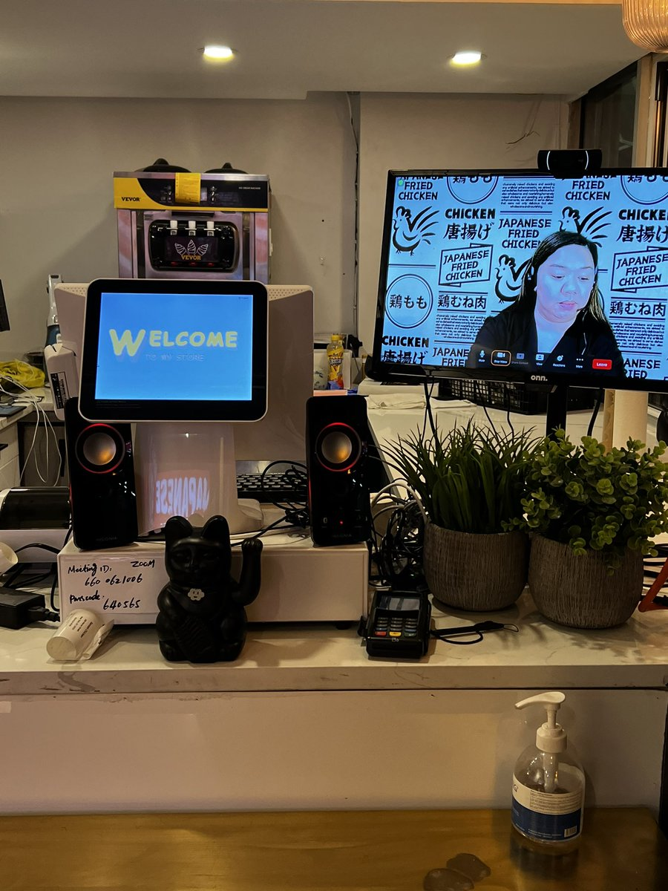

# Le caissier qui n'est pas là : de la délocalisation numérique à l'inévitable remplacement par l'IA ?

*Lorsqu'un employé de Goldman Sachs entre chez Yaso Kitchen dans le New Jersey pour commander des raviolis chinois, il s'attend à trouver un caissier derrière le comptoir. Au lieu de cela, il trouve Amber, une femme philippine qui le salue depuis un écran monté sur une tablette. [La première réaction est la confusion](https://cebudailynews.inquirer.net/567764/filipino-virtual-cashiers-taking-orders-at-new-york-restaurants) : "J'ai cru que c'était une publicité, comme celles dans les taxis", a raconté le client à la presse. Mais Amber travaille vraiment, huit heures par jour, mais depuis Manille. C'est son premier service à distance de sa vie.*

La scène se répète dans des dizaines de restaurants entre Manhattan, le Queens et Jersey City. [Happy Cashier](https://fortune.com/2024/04/11/philippines-cashier-zoom-video-call-fast-food-sansan-chicken-happy-cashier-new-york/), une startup new-yorkaise fondée par Chi Zhang, a placé ces caissiers virtuels dans des chaînes comme Sansan Chicken et Yaso Kitchen. La proposition de valeur est d'une simplicité brutale : [avec le salaire minimum de New York](https://www.homescreen.news/p/remote-cashiers) à 16 dollars de l'heure, pourquoi embaucher du personnel sur place quand on peut payer des travailleurs philippins environ 3 dollars de l'heure ? Une économie de quatre-vingts pour cent sur les coûts de main-d'œuvre.

Zhang connaît le secteur de l'intérieur. Après avoir ouvert un restaurant à Brooklyn en 2015, [il a dû le fermer pendant la pandémie](https://fortune.com/2024/04/11/philippines-cashier-zoom-video-call-fast-food-sansan-chicken-happy-cashier-new-york/) en partie à cause de la difficulté à embaucher des travailleurs. La pénurie de main-d'œuvre dans le secteur de la restauration n'est pas une fiction : c'est la même pression qui a poussé des chaînes comme Chipotle et Sweetgreen vers l'automatisation. Mais Zhang a choisi une voie différente, en puisant dans les [1,3 million de Philippins employés dans le secteur du BPO](https://fortune.com/2024/04/11/philippines-cashier-zoom-video-call-fast-food-sansan-chicken-happy-cashier-new-york/) (Business Process Outsourcing), le plus grand au monde avec un chiffre d'affaires de 35,4 milliards de dollars en 2023.

L'infrastructure technique est étonnamment simple. [Happy Cashier s'intègre au système de point de vente MenuSifu](https://www.menusifu.com/solution-virtual-cashier), un système déjà répandu dans les restaurants asiatiques américains. Les commandes passées au point de vente apparaissent instantanément sur l'écran du caissier à distance, qui gère les paiements et les questions des clients via une connexion Zoom. Le tout ne nécessite guère plus qu'une tablette, une webcam et une connexion haut débit stable. Aucun investissement dans des capteurs, la vision par ordinateur ou du matériel sophistiqué n'est nécessaire. C'est de la délocalisation à l'ancienne déguisée en innovation numérique.

## L'économie de l'arbitrage salarial

[Les travailleurs philippins](https://www.homescreen.news/p/remote-cashiers) gagnent en moyenne 3 dollars de l'heure, un chiffre que Zhang défend en affirmant qu'il paie ["150% de plus que la moyenne des caissiers aux Philippines"](https://cebudailynews.inquirer.net/567764/filipino-virtual-cashiers-taking-orders-at-new-york-restaurants). La logique est implacable : vous respectez les lois du travail locales (celles des Philippines), mais vous exploitez le différentiel de salaire entre deux marchés. Un travailleur qui coûte 3 dollars de l'heure à Manille fait le même travail qui en coûterait 16 à New York. Comme l'a précisé l'avocat canadien Jonathan Pinkus dans le cas analogue de Freshii, une chaîne qui en 2022 utilisait des caissiers nicaraguayens payés 3,75 dollars de l'heure en Ontario : "[Si vous envoyez des emplois à des personnes dans un autre pays](https://fortune.com/2024/04/11/philippines-cashier-zoom-video-call-fast-food-sansan-chicken-happy-cashier-new-york/), vous n'êtes obligé de respecter que les normes de travail de ce pays. Être virtuellement présent en Ontario ne change rien".

Le phénomène n'est pas nouveau. En 2005, Resource Group avait déjà placé des [réceptionnistes à distance](https://www.homescreen.news/p/remote-cashiers) par vidéo dans des bureaux de Washington DC. Ce qui a changé, c'est l'échelle et la normalisation. En septembre 2024, Happy Cashier visait à étendre son service à plus de [100 restaurants](https://foodondemand.com/09102024/happy-cashier-survives-an-internet-backlash-can-it-survive-kiosks/), une croissance accélérée après sa présentation au National Restaurant Association Show de Chicago en mai de la même année.

Les réactions ont été polarisées. Lorsque la pratique a fait son apparition sur les réseaux sociaux au printemps 2024, [la vague de critiques a été immédiate](https://thespoon.tech/restaurant-cashier-zooms-in-to-work-press-freaks-out-better-get-ready-for-lots-more-change-at-checkout/). Teófilo Reyes, responsable de Restaurant Opportunities United, a qualifié la situation d'["extrêmement alarmante"](https://cebudailynews.inquirer.net/567764/filipino-virtual-cashiers-taking-orders-at-new-york-restaurants). Jonathan Bowles du Center for an Urban Future a averti que la main-d'œuvre de la restauration rapide est [déjà en train de diminuer](https://cebudailynews.inquirer.net/567764/filipino-virtual-cashiers-taking-orders-at-new-york-restaurants) et que "les nouvelles technologies pourraient transformer davantage le secteur".

Pourtant, les données racontent une histoire plus complexe. [En juillet 2024, la ville de New York](https://foodondemand.com/09102024/happy-cashier-survives-an-internet-backlash-can-it-survive-kiosks/) comptait 285 700 personnes employées dans le secteur de la restauration, contre 265 400 en juillet 2023, soit une augmentation de vingt mille emplois. Bowles lui-même a observé : "[Le secteur est en croissance](https://foodondemand.com/09102024/happy-cashier-survives-an-internet-backlash-can-it-survive-kiosks/) malgré l'externalisation des emplois. Cela ne signifie pas que les emplois de premier échelon n'ont pas diminué, ils pourraient l'avoir fait. Mais cela signifie que les restaurants investissent dans des solutions de réduction des coûts afin de pouvoir se développer". C's'est le paradoxe éternel : l'automatisation supprime des emplois mais peut rendre durables des entreprises qui, autrement, fermeraient, créant ainsi d'autres rôles.

## L'étape intermédiaire

C'est là que l'histoire prend une tournure qui rappelle "Sorry to Bother You", le film de Boots Riley de 2018 dans lequel des travailleurs afro-américains utilisent une "voix blanche" enregistrée pour vendre par téléphone. La délocalisation numérique des caissiers n'est pas une innovation : c'est la phase terminale avant l'automatisation complète. Comme l'a écrit sans ambages [Homescreen dans son analyse](https://www.homescreen.news/p/remote-cashiers) : "Aujourd'hui, c'est une femme philippine derrière un écran qui contrôle un système de point de vente, mais il n'est pas fou de croire que probablement dans les six à douze prochains mois, ce pourrait être un avatar d'IA qui fait exactement les mêmes choses".

La technologie de paiement sans caissier existe déjà. [Amazon Just Walk Out](https://www.campusidnews.com/amazon-stores-remove-their-companys-own-just-walk-out-technology/), lancé en 2018, utilise la vision par ordinateur, des capteurs et l'apprentissage profond pour suivre automatiquement ce que les clients prennent sur les étagères et le leur facturer à leur sortie. En 2024, Amazon a lancé plus de magasins Just Walk Out que [n'importe quelle année précédente](https://retailtechinnovationhub.com/home/2025/3/16/bold-move-as-amazon-shakes-up-physical-retail-strategy-with-just-walk-out-technology-stalling-in-real-world/), atteignant plus de 300 déploiements chez des tiers aux [États-Unis, au Royaume-Uni, en Australie, au Canada et en France](https://www.retailtouchpoints.com/features/trend-watch/amazons-just-walk-out-tech-poised-to-break-into-a-run), principalement dans des stades, des hôpitaux, des campus universitaires et des centres de distribution.

Le problème est que ces systèmes nécessitent un investissement important en infrastructure : caméras au plafond, capteurs sur les étagères, points d'entrée contrôlés. [The Information](https://www.bloomberg.com/opinion/articles/2024-04-03/the-humans-behind-amazon-s-just-walk-out-technology-are-all-over-ai) a rapporté que l'équipe de Just Walk Out compte plus de 1 000 employés, principalement en Inde, qui étiquettent les séquences vidéo et les transactions pour entraîner les modèles d'IA. Même l'IA "entièrement automatique" d'Amazon dépend de modérateurs humains. C'est une leçon que l'on retrouve dans "Her" de Spike Jonze : l'intimité la plus convaincante est souvent la plus médiatisée.

Mais pour les petits restaurants de Zhang, le système à distance via Zoom est la solution parfaite dans l'intervalle entre le caissier physique et le caissier entièrement synthétique. Il est bon marché, peut être mis en œuvre en quelques jours et, surtout, il maintient l'illusion de l'interaction humaine que de nombreux clients recherchent encore. Le problème est que [les caissiers à distance, en tant que catégorie professionnelle](https://www.eweek.com/artificial-intelligence/jobs-ai-will-replace/), ont leurs jours comptés. Les modèles vocaux avancés comme GPT-5 peuvent déjà gérer des conversations naturelles, comprendre des menus, gérer des modifications de commande et traiter des paiements. [Le marché mondial](https://www.robylon.ai/blog/will-ai-replace-call-center-jobs-2025) de l'IA dans les centres d'appels valait 1,95 milliard de dollars en 2024 et devrait atteindre 10,07 milliards d'ici 2032.

Klarna, une société suédoise de "buy now pay later", [a annoncé en février 2024](https://www.klarna.com/international/press/klarna-ai-assistant-handles-two-thirds-of-customer-service-chats-in-its-first-month/) que son chatbot d'IA effectuait le travail équivalent à 700 agents à temps plein. Cependant, [en mai 2025, l'entreprise a fait marche arrière](https://www.customerexperiencedive.com/news/klarna-reinvests-human-talent-customer-service-AI-chatbot/747586/), recommençant à embaucher des personnes après avoir admis qu'elle avait poussé trop loin l'automatisation, le PDG reconnaissant qu'une concentration excessive sur les coûts avait réduit la qualité du service. Les résultats ont été mitigés : l'entreprise a économisé de l'argent mais a dû réembaucher certains employés pour traiter des cas complexes comme le vol d'identité. Néanmoins, la direction est claire. [Dans le secteur de la santé philippin](https://kffhealthnews.org/news/article/ai-call-centers-medical-receptionists-replaced-bots-human-touch-unions/), 200 000 travailleurs des centres d'appels médicaux à la fin de 2024 étaient déjà confrontés à la concurrence d'assistants vocaux d'IA qui planifient des rendez-vous, remplissent des ordonnances et trient les patients.

[Image de homescreen.news](https://www.homescreen.news/p/remote-cashiers)

## Voix du front

Les positions sur la transition vers l'IA dans les emplois de service suivent des lignes prévisibles mais non moins pertinentes. L'AFL-CIO a lancé en octobre 2025 l'initiative ["Workers First Initiative on AI"](https://aflcio.org/2025/10/15/afl-cio-launches-workers-first-initiative-ai-put-american-workers-future-artificial), le premier programme complet du mouvement syndical américain sur les principes de l'intelligence artificielle. La présidente Liz Shuler a déclaré : "Nous rejetons le faux choix entre la compétitivité américaine sur la scène mondiale et le respect des droits et de la dignité des travailleurs".

La question centrale est de savoir qui gère la transition. Dès 2018, la Commission de l'AFL-CIO sur l'avenir du travail avait identifié dans les modèles de ["travail fissuré" et d'externalisation](https://aflcio.org/reports/afl-cio-commission-future-work-and-unions) la principale stratégie des entreprises pour contourner les responsabilités en matière d'emploi et réduire les coûts de main-d'œuvre. La délocalisation numérique des caissiers est exactement cela : la fragmentation du processus de travail pour exploiter les différentiels de salaire mondiaux. Mais avec l'IA, l'étape suivante élimine complètement le travailleur de l'équation.

[Bernard Marr, analyste spécialisé dans l'IA éthique](https://bernardmarr.com/8-ai-ethics-trends-that-will-redefine-trust-and-accountability-in-2026/), a souligné dans son rapport sur les tendances 2026 que beaucoup soutiennent que les employeurs ont la responsabilité éthique de mettre en œuvre des initiatives de reconversion et de formation. Mais les témoignages sur le terrain racontent une autre histoire : sur Reddit, des travailleurs ont signalé avoir été licenciés après avoir entraîné des systèmes d'IA, soulevant des préoccupations éthiques quant à la transparence des intentions des entreprises.

Sur le front réglementaire européen, la loi sur l'IA de l'UE, entrée en vigueur en août 2024, [classe les systèmes d'IA](https://ogletree.com/insights-resources/blog-posts/eu-publishes-groundbreaking-ai-act-initial-obligations-set-to-take-effect-on-february-2-2025/) utilisés sur le lieu de travail comme potentiellement "à haut risque". Depuis février 2025, les systèmes de [reconnaissance des émotions sur le lieu de travail sont interdits](https://www.techclass.com/resources/learning-and-development-articles/the-eu-ai-act-what-hr-it-and-compliance-leaders-need-to-know-in-2025), tandis qu'à partir d'août 2026, les [règles sur les systèmes à haut risque deviendront pleinement opérationnelles](https://artificialintelligenceact.eu/implementation-timeline/), incluant les outils d'IA pour le recrutement et l'évaluation des performances. Les législateurs en 2026 examinent quel niveau de [surveillance humaine devrait être requis](https://bernardmarr.com/8-ai-ethics-trends-that-will-redefine-trust-and-accountability-in-2026/) et quelles sanctions appliquer lorsque les organisations permettent aux machines d'agir de manière irresponsable.

Mais l'Amérique est différente. Les Américains en 2026 font preuve d'un profond [scepticisme à l'égard de l'IA](https://bernardmarr.com/8-ai-ethics-trends-that-will-redefine-trust-and-accountability-in-2026/), avec des craintes centrées sur le déplacement d'emplois, les erreurs éthiques et les perturbations sociales. Pourtant, les protections réglementaires sont fragmentées, déléguées aux États et aux villes. L'administration Biden avait publié un décret en octobre 2023 demandant aux agences fédérales d'équilibrer les avantages et les risques juridiques de l'IA, mais la mise en œuvre pratique reste nébuleuse.

## Le dernier kilomètre de l'automatisation

La convergence technologique est déjà en cours. [Presto, une entreprise spécialisée dans l'automatisation des restaurants](https://www.homescreen.news/p/remote-cashiers), fait déjà des percées dans ce domaine, en développant des systèmes qui combinent des tablettes tactiles avec une intelligence artificielle vocale. [MenuSifu](https://www.menusifu.com/menusifu-news-ens/menusifu-automated-restaurant-solution), la plateforme qui soutient Happy Cashier, a annoncé un partenariat avec Hestia pour introduire des machines de cuisine automatiques, créant une "solution numérique complète 1+2+4+N" qui inclut des caissiers virtuels et l'automatisation de la cuisine.

Le calendrier est clair. [Selon une étude de l'Université de Californie à San Diego publiée en 2025](https://papers.ssrn.com/sol3/papers.cfm?abstract_id=4938644), la technologie sans caissier réduit non seulement les coûts de personnel, mais modifie également de manière significative le comportement d'achat des consommateurs. Les magasins sans caissier ont enregistré une augmentation de treize pour cent de la demande dans les cinq à dix minutes précédant le début des cours sur les campus universitaires. Les ventes de préservatifs ont augmenté de 164 % : l'élimination de la gêne de l'interaction humaine a des effets mesurables.

[Deloitte prévoit](https://www.retellai.com/blog/ai-voice-agents-in-2025) que 25 % des entreprises qui utilisent déjà l'IA générative mettront en œuvre des agents d'IA d'ici la fin de 2025, un chiffre qui devrait doubler d'ici 2027. [Le marché de l'IA conversationnelle](https://leapingai.com/blog/voice-ai-transforming-call-center-operations-and-customer-service) passera de 17,05 milliards de dollars en 2025 à 49,8 milliards d'ici 2031, avec un taux de croissance annuel composé de 24,7 %.

Pour les travailleurs à distance des Philippines, l'ironie est cruelle. Ruth Elio, une infirmière du travail qui supervise un centre d'appels médical à Manille, [a raconté](https://kffhealthnews.org/news/article/ai-call-centers-medical-receptionists-replaced-bots-human-touch-unions/) que des travailleurs gèrent des urgences médicales de personnes âgées américaines seules, même si cela ne fait pas partie de leurs tâches officielles. Ils développent des maux de tête et des douleurs dorsales à force de rester assis pendant des heures. Aujourd'hui, ces mêmes travailleurs, qui ont rendu possible la délocalisation numérique, risquent d'être les premiers à être remplacés par des voix synthétiques qui n'ont pas besoin de pauses, de quarts de travail ou de salaires.

[Zhang de Happy Cashier a déclaré](https://foodondemand.com/09102024/happy-cashier-survives-an-internet-backlash-can-it-survive-kiosks/) qu'il visait cinq cents restaurants avant de "faire un grand saut". Il n'a pas précisé en quoi consistait ce saut, mais le contexte est éloquent. La question n'est pas de savoir si les caissiers à distance seront remplacés par l'IA, mais quand. Et la réponse, au vu des courbes d'adoption de la technologie et des différentiels de coûts, est probablement dans les deux prochaines années.

Le caissier que vous voyez sur un écran aujourd'hui est déjà un fantôme. Pas celui de Casper ou d'un film d'animation de Pixar, mais le genre de fantôme qui apparaît dans "Severance", la série d'Apple où le travail est fragmenté au point de perdre toute continuité existentielle. Amber, de Manille, travaille pour des restaurants qu'elle ne verra jamais, servant des clients qui la prennent pour une publicité, en attendant qu'un modèle linguistique apprenne à imiter sa voix assez bien pour la rendre superflue. C'est de l'automatisation différée, l'externalisation comme stade larvaire de l'obsolescence programmée de l'humain dans les services à faible marge.

La technologie n'a pas de morale propre, mais les choix sur la manière de la mettre en œuvre en ont. Nous pouvons construire des systèmes qui augmentent la capacité humaine ou des systèmes qui éliminent simplement les humains coûteux. Jusqu'à présent, dans les restaurants de New York comme dans les centres d'appels de Manille, la deuxième option l'emporte haut la main.
