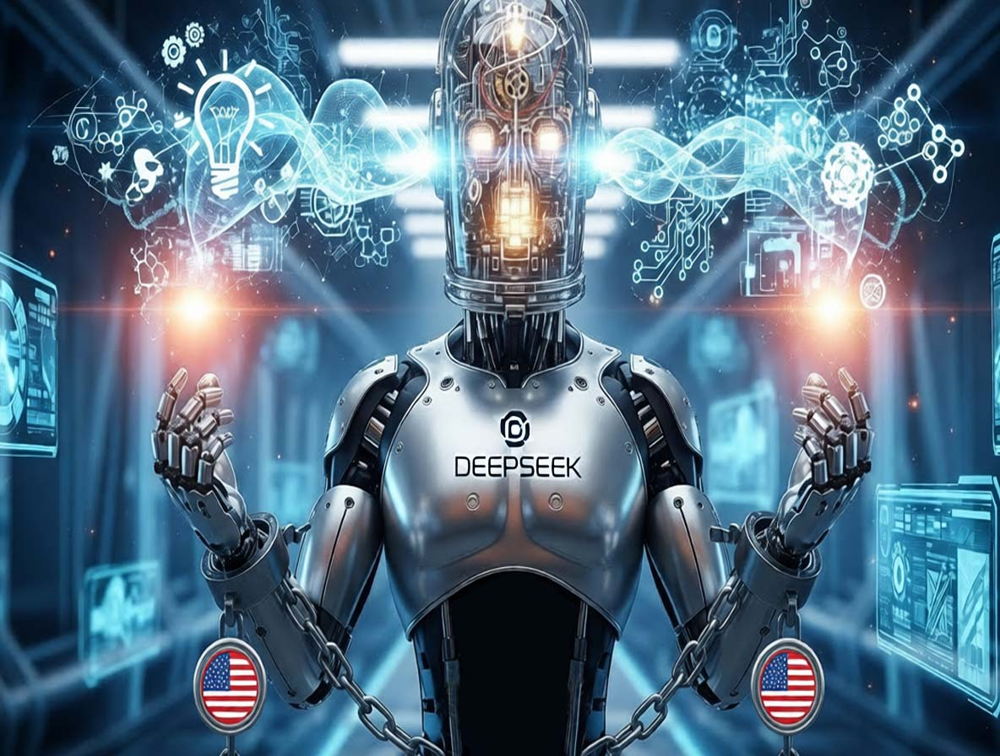
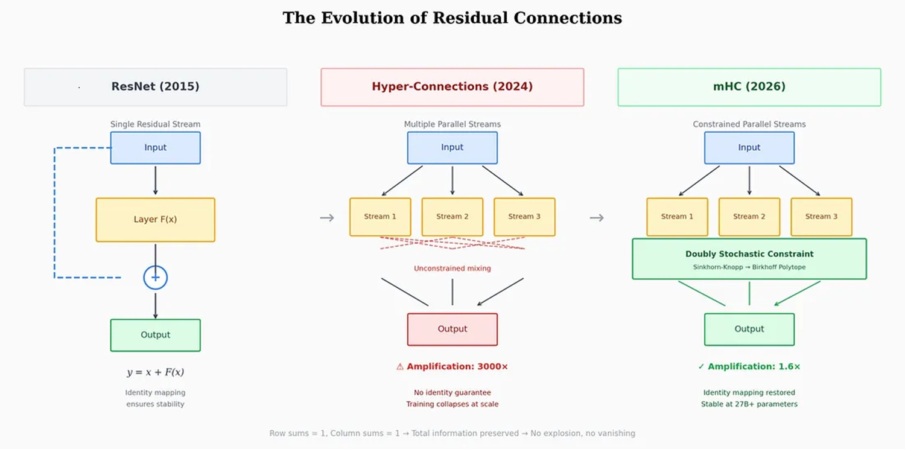
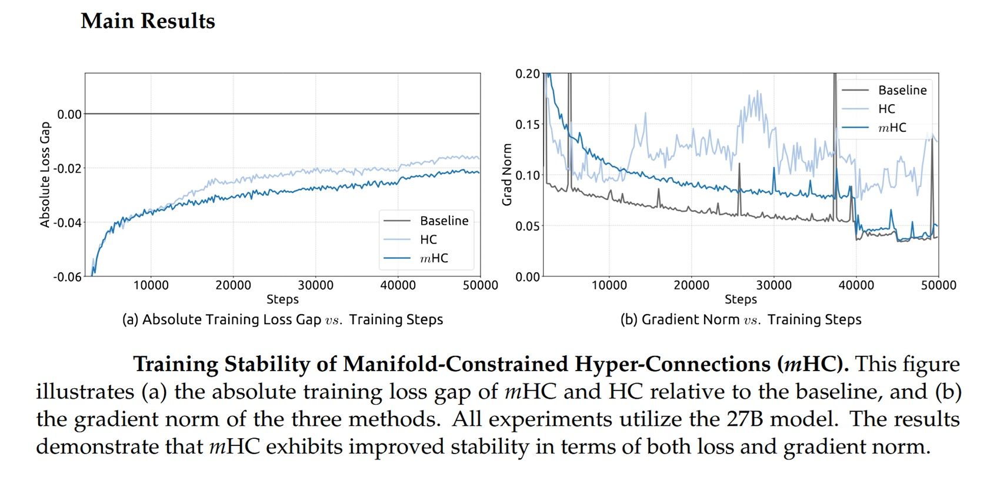

# How DeepSeek Turned Hardware Constraints into Mathematical Innovation

*On January 1, 2026, as the world celebrated the start of the new year, researchers at DeepSeek published a paper on arXiv that could change how we train large language models. It wasn't about a better model or a larger dataset, but something more subtle and potentially more disruptive: a [radical rethinking of the fundamental architecture](https://arxiv.org/pdf/2512.24880) that underpins modern artificial intelligence.*

The paper, co-authored by DeepSeek's founder and CEO Liang Wenfeng along with 18 other researchers led by [Zhenda Xie, Yixuan Wei, and Huanqi Cao](https://www.scmp.com/tech/big-tech/article/3338427/deepseek-kicks-2026-paper-signalling-push-train-bigger-models-less), proposes Manifold-Constrained Hyper-Connections, or mHC for short. To understand what we're talking about, however, we first need to take a step back and revisit a story that begins in 2015.

## When Limitation Becomes Leverage

For years, one of the most frustrating problems in deep learning was the "vanishing gradient": when building very deep neural networks with dozens or hundreds of stacked layers, information tended to either dissipate or, conversely, explode into uncontrollable values during training. It was like trying to whisper a message through a human chain of a hundred people: by the end, the original message was unrecognizable.

In 2015, a team at Microsoft Research Asia led by Kaiming He solved the problem with an elegantly simple solution: residual connections, or ResNet. The idea was to allow information to "skip" some layers through direct shortcuts, preserving the original signal intact while the network processed it in parallel. It was a kind of dual-track system: one for processing, one for memory. This approach became [the most cited paper of the twenty-first century](https://tech.yahoo.com/ai/articles/deepseek-proposes-shift-ai-model-093000518.html) in the field of artificial intelligence, according to Nature.

The method worked so well that virtually all modern models, from GPT to Claude, from Llama to Gemini, adopted it without substantial changes for nearly a decade. But as the scale of models grew from billions to hundreds of billions of parameters, that single residual highway began to show its limits. This is where ByteDance enters the scene.

In September 2024, researchers from the parent company of TikTok [published a paper on Hyper-Connections](https://arxiv.org/abs/2409.19606), which was accepted at the prestigious ICLR 2025 conference. The idea was as simple as it was ambitious: instead of just one residual highway, why not build four, eight, sixteen? Instead of a single channel, create multiple information streams that could dynamically mix and recombine across the network's layers.

The results, tested on the OLMo and OLMoE models, were impressive: 1.8 times faster convergence and an improvement of about 6 points on the ARC-Challenge benchmark. Networks with Hyper-Connections showed much greater representational diversity between layers, avoiding the "representation collapse" that plagued traditional architectures.

But there was a problem. A serious problem.

## The Polytope Trick

Hyper-Connections introduced catastrophic instabilities during training. The mixing matrices that controlled the multiple streams tended to amplify from layer to layer. It was a mathematical domino effect: if each layer amplified the signal by even just 5% compared to the previous one, after 60 layers that seemingly trivial amount translated into an 18-fold amplification of the original intensity. In the DeepSeek paper, researchers measured [amplification factors of up to 3000 times](https://medium.com/@kamathuday/deepseek-r1-researchers-just-proposed-a-fundamental-fix-to-how-transformers-connect-their-layers-ddc78064d41b) in some configurations. At that point, the training didn't just slow down: it collapsed entirely.

The industry's typical response involves palliative solutions: gradient clipping, careful initializations, complex learning rate schedulers. Tricks that work, but don't scale well. DeepSeek chose a different path: returning to the fundamental principles of mathematics.

The question the researchers asked themselves was: is there a mathematical constraint that can guarantee stability without sacrificing the expressiveness of Hyper-Connections? The answer was hidden in a 1946 paper by Richard Sinkhorn, later refined with Paul Knopp in 1967: the Sinkhorn-Knopp algorithm. This iterative procedure converts any non-negative matrix into a "doubly stochastic" matrix, where each row and each column sums to 1.

Think of four glasses of water. You can pour water from one glass to another in any way you like, but with one strict rule: the total amount of water must remain constant, and each glass must both give and receive liquid. The water can be redistributed, but it cannot be created or destroyed. This is exactly what the Sinkhorn-Knopp algorithm does when applied to Hyper-Connections.

In technical terms, DeepSeek projects the connection matrices onto the "Birkhoff polytope," a geometric object that lives in a high-dimensional space and represents all possible weighted permutations of information. It's a bit like forcing the neural connections to move on a curved surface in a multidimensional space, instead of letting them wander freely in all directions. The metaphor is not accidental: those who have played *Portal* will remember how constrained movement on specific surfaces can open up counter-intuitive possibilities.

The result is that mHC preserves all the expressiveness of Hyper-Connections—the multiple channels, dynamic recombination, and representational richness—but eliminates the risk of instability. Information can flow freely through multiple paths, but always in compliance with rigorous mathematical conservation laws.

[Image from medium.com](https://medium.com/@kamathuday/deepseek-r1-researchers-just-proposed-a-fundamental-fix-to-how-transformers-connect-their-layers-ddc78064d41b)

## The Numbers That Matter

DeepSeek tested mHC on models with 3, 9, and 27 billion parameters, trained on over 1 trillion tokens. The results, [reported in the paper published on arXiv](https://arxiv.org/pdf/2512.24880), show that the architecture scales without adding significant computational overhead.

Through infrastructure-level optimizations, operation fusion, reduced memory traffic, strategic recomputation of intermediate values, and overlapping communication and computation, mHC introduces an overhead of just 6-7% during training. This is a negligible figure for large-scale models, especially considering the gains in stability and performance.

The researchers compared mHC with traditional Hyper-Connections on eight different tasks, and the results speak for themselves: while unconstrained HCs showed recurring instability, mHC trained smoothly, achieving lower loss and better performance on reasoning and natural language benchmarks.

But there's an even more interesting aspect. DeepSeek did not develop this technique in a vacuum: the company operates in a very specific context, that of [American restrictions on the export of advanced chips to China](https://www.csis.org/analysis/understanding-biden-administrations-updated-export-controls).

## The Paradox of Technological Isolation

In October 2022, the U.S. Department of Commerce imposed the first export controls on AI chips to China, effectively banning the sale of Nvidia's H100 and A100 GPUs. The stated goal was to slow down the development of Chinese capabilities in artificial intelligence and supercomputing.

Nvidia responded quickly with "watered-down" versions specific to the Chinese market: first the A800, then the H800, chips designed to stay below the performance density thresholds set by the American rules. [As reported by the Center for Strategic and International Studies](https://www.csis.org/analysis/where-chips-fall-us-export-controls-under-biden-administration-2022-2024), Commerce Secretary Gina Raimondo sharply criticized Nvidia for "circumventing the trade rules," promising to control any new redesigned chip "the next day."

In October 2023, the second round of restrictions arrived, which also included the H800 and A800. Nvidia then introduced the H20, a chip with only 20% of the performance of the H100. But the damage, from a Chinese perspective, was done: access to top-tier GPUs was blocked or severely limited.

And this is where the story becomes paradoxical. As [reported by Built In](https://builtin.com/articles/trump-lifts-ai-chip-ban-china-nvidia), citing Jay Dawani, CEO of Lemurian Labs: "Chinese labs are squeezing the most out of the hardware they already have." DeepSeek became the most striking example of this approach.

Their R1 model, released in January 2025, was [trained using H800 chips](https://www.hypotenuse.ai/blog/what-is-deepseek-r1-and-why-is-it-making-waves-in-ai), well below the export control threshold, for a declared cost of just $5.58 million for the base V3 model and [$294,000 for the reasoning phase of R1](https://mlq.ai/news/deepseek-reveals-r1-model-training-cost-just-294000-in-peer-reviewed-nature-publication/), according to a publication in Nature. These numbers caused Nvidia's market capitalization to drop by $600 billion in a single day.

Instead of blocking Chinese innovation, the sanctions channeled it towards algorithmic efficiency. Unable to compete with brute computational force, Chinese researchers had to invent alternative paths. And mHC fits perfectly into this narrative: it's a technique that allows you to achieve more with less, to scale without simply adding more GPUs.

As [Florian Brand, a PhD student at the University of Trier and an expert on the Chinese AI ecosystem, observes](https://www.scmp.com/tech/big-tech/article/3338427/deepseek-kicks-2026-paper-signalling-push-train-bigger-models-less), DeepSeek's papers often serve as an early signal of the technical direction of their upcoming models. The fact that Liang Wenfeng personally uploaded the paper to arXiv, as he did for R1 and V3, suggests that mHC could be central to the company's future models.

The industry expects DeepSeek to release a new flagship model before the Spring Festival in mid-February, replicating last year's pattern when R1 was launched on the eve of the national holiday.

[Image from arxiv.org](https://arxiv.org/pdf/2512.24880)

## Beyond DeepSeek, Beyond Language

One of the most interesting questions concerns the applicability of mHC beyond language models. The DeepSeek paper includes experiments on vision tasks, and the original ByteDance paper on Hyper-Connections also demonstrated improvements in both language and computer vision.

In theory, any architecture based on residual connections could benefit from mHC: vision models, multimodal systems, robotics architectures. The code is already available on [GitHub](https://github.com/tokenbender/mHC-manifold-constrained-hyper-connections) and [Python implementations have been released](https://pypi.org/project/hyper-connections/) to facilitate adoption by the community.

But there are also critical voices. [Guo Song, a professor at the Hong Kong University of Science and Technology](https://sg.news.yahoo.com/deepseek-pitches-route-scale-ai-093000404.html), while acknowledging the transformative potential of mHC, highlighted the implementation complexity: "The architecture depends on cutting-edge infrastructure, which could create a technical barrier that makes it difficult for smaller labs to adopt or to deploy on mobile devices."

Michael Yeung, an AI expert cited in the same South China Morning Post article, also stressed that it is premature to assess the implications until the approach has been tested on a wider range of architectures. "There is no crystal ball," he commented.

Alternatives do exist. Approaches like RMT (Residual Matrix Transformer) and MUDDFormer have attempted to address similar problems with different solutions. RMT replaces the residual stream with an outer-product memory matrix to facilitate feature storage. MUDDFormer employs dynamic multiway dense connections to optimize cross-layer information flow. Both, however, [according to the DeepSeek paper](https://arxiv.org/pdf/2512.24880), compromise the identity mapping property inherent in residual connections, introducing instability.

## The Wheel and the Circle

In a comment reported by the [South China Morning Post](https://www.scmp.com/tech/tech-trends/article/3338535/deepseek-proposes-shift-ai-model-development-mhc-architecture-upgrade-resnet), Pierre-Carl Langlais, co-founder of the French startup Pleias, argued that the true importance of the paper goes beyond simply demonstrating the scalability of Hyper-Connections. It is a deeper reflection on how the architecture of the models themselves, not just the amount of data or parameters, can be the limiting factor.

Guo Song used an [eloquent metaphor](https://www.scmp.com/tech/big-tech/article/3338427/deepseek-kicks-2026-paper-signalling-push-train-bigger-models-less): "The reaction could be compared to the discovery of the wheel. When someone discovers that round wheels work better than square ones, everyone is ready to change their wheels from square to round."

There is some truth in this observation, although it may be overly optimistic. It took years for ResNet to become the universal standard, and mHC will have to prove not only theoretical effectiveness but also large-scale industrial practicality. As in the best episodes of *Adventure Time*, where elegant mathematical solutions solve seemingly insurmountable problems, here the theory has yet to face the test of real-world deployment.

But the underlying message is clear: after a decade of unchallenged dominance, the fundamental architecture of deep learning models may be on the verge of evolving. And paradoxically, this evolution may have been accelerated precisely by the restrictions that were meant to slow it down.

American sanctions forced Chinese researchers to seek efficiency where others sought brute force. They turned a constraint into an incentive for innovation. And mHC, with its mathematical elegance and its promise of scalability without prohibitive costs, may be just the first example of this new direction.

It remains to be seen whether the West will be able to respond with its own architectural innovations, or if it will continue to rely on computational supremacy. One thing is certain: the next generation of AI models will not just be bigger. They will also be more intelligently built.
