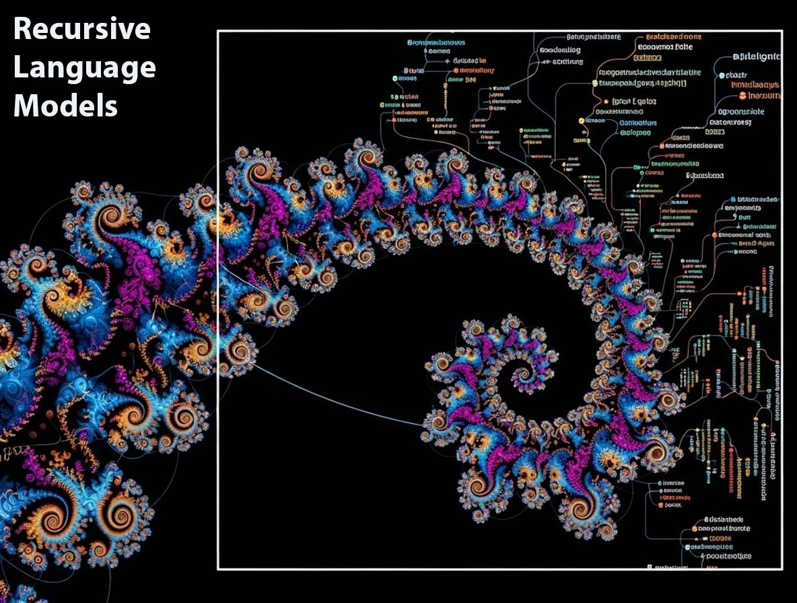
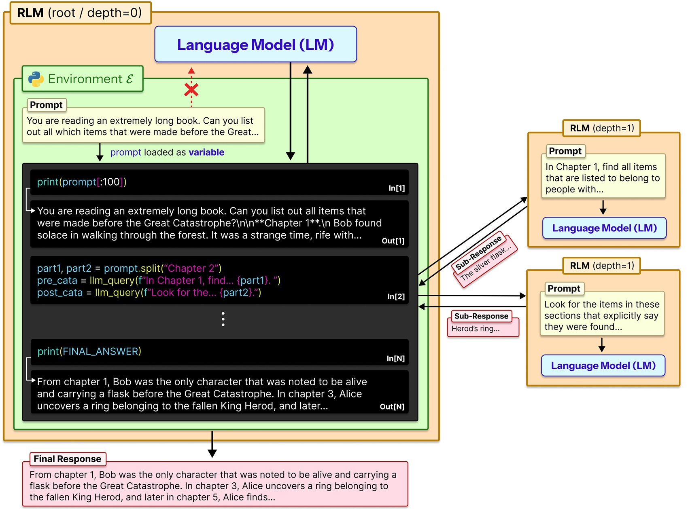
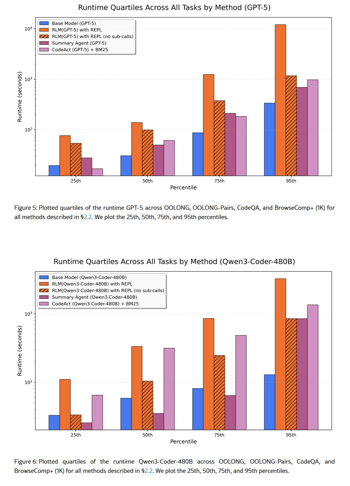

# Oltre il muro del contesto: i Recursive Language Models sfidano il limite invisibile dell'AI

*Esiste un problema nella moderna intelligenza artificiale di cui si parla poco, ma che ogni sviluppatore e utente intensivo di chatbot ha sperimentato almeno una volta: la sensazione che il modello, dopo una conversazione prolungata, diventi progressivamente più stupido. Non è un'impressione soggettiva, né una vostra mancanza di chiarezza nelle richieste. È un fenomeno tecnico preciso che i ricercatori chiamano *context rot*, letteralmente "marcescenza del contesto", e rappresenta uno dei limiti più frustranti dell'architettura attuale dei large language models.*

Immaginate di dover scrivere un romanzo avendo a disposizione solo un post-it. Ogni volta che aggiungete una nuova frase, dovete cancellarne una vecchia. È più o meno quello che accade quando un modello linguistico raggiunge il limite del suo context window, quella finestra di memoria a breve termine entro cui può "vedere" e processare informazioni. GPT-5, il modello di punta di OpenAI, dispone di 400.000 token via API (circa 300.000 parole), che sembrano tanti finché non provate ad analizzare un'intera codebase o una raccolta di documenti legali. Ma il vero problema non è solo la dimensione: le prestazioni dei modelli degradano all'aumentare della lunghezza dell'input, anche su task banali.

È qui che entra in gioco il lavoro di Alex Zhang, Tim Kraska e Omar Khattab del MIT CSAIL, pubblicato a dicembre 2025 su [arXiv](https://arxiv.org/html/2512.24601v1). Il loro paper propone i Recursive Language Models, un framework che ribalta completamente l'approccio al problema: invece di cercare di ampliare all'infinito la memoria del modello, gli insegnano a ragionare *sulla* memoria stessa, trattandola come un ambiente esterno da esplorare programmaticamente.

## Quando leggere diventa ricordare

Per capire l'intuizione dietro i RLM, conviene partire dal problema. L'architettura transformer su cui si basano gli LLM moderni confronta ogni nuovo token con tutti i token precedenti nel context window, creando relazioni n² che diventano sempre più onerose man mano che il contesto cresce. È come se, ogni volta che pronunciate una parola, il vostro cervello dovesse ripassare mentalmente tutte le conversazioni della vostra vita. Impraticabile.

La ricerca di Chroma [ha dimostrato](https://research.trychroma.com/context-rot) che anche i modelli più avanzati soffrono di bias posizionale: un'informazione posizionata in prima posizione ottiene il 75% di accuratezza, la stessa informazione in decima posizione scende al 55%. Non è questione di quanti token riesci a infilare nella finestra, ma di come il modello riesce effettivamente a usarli.

Zhang e colleghi hanno preso una strada diversa. Invece di obbligare il modello a ingerire tutto il prompt in un unico passaggio, i RLM trattano il prompt come parte di un ambiente esterno con cui il modello può interagire simbolicamente. In pratica, il contesto viene caricato come una variabile Python in un ambiente REPL (Read-Eval-Print Loop), e il modello può scrivere codice per ispezionarlo, sezionarlo, cercare pattern e, cosa cruciale, chiamare ricorsivamente sé stesso o altri LLM su porzioni specifiche del contenuto.

Pensate alla differenza tra leggere un libro dalla copertina alla quarta di seguito e invece consultarlo come fareste con un'enciclopedia: saltando direttamente all'indice, individuando le sezioni rilevanti, magari prendendo appunti su ciò che trovate. I RLM replicano questo secondo approccio, metacognitivo e strategico.

## REPL: il dialogo interno

L'implementazione tecnica è raffinata nella sua semplicità. Quando un utente invia un prompt a un RLM, questo viene memorizzato come variabile stringa in un ambiente Python REPL. Il modello root (chiamiamolo LM₀) non riceve mai direttamente quella stringa nel suo context window. Riceve invece un system prompt che gli spiega come può interagire con la variabile: può leggerne slice specifici, può scrivere funzioni helper per elaborarla, può lanciare sub-LM calls ricorsivi (LM₁, LM₂...) su porzioni selezionate, e può combinare i risultati.

In sostanza, il modello lavora in tre modalità distinte. Prima esplora il contesto attraverso operazioni di lettura e ricerca programmatica, un po' come se usasse grep o regex su un file di testo. Poi decompone il problema in sotto-task più gestibili, decidendo autonomamente quali porzioni di contesto meritano un'analisi approfondita. Infine delega questi sotto-task a istanze ricorsive di sé stesso o di altri modelli, aggregando poi i risultati in una risposta finale.

[Il repository GitHub ufficiale](https://github.com/alexzhang13/rlm) fornisce un'implementazione plug-and-play che sostituisce semplicemente la chiamata standard `llm.completion(prompt, model)` con `rlm.completion(prompt, model)`. L'interfaccia esterna rimane identica per l'utente, ma sotto il cofano avviene questa danza ricorsiva di esplorazione e computazione.

Zhang stesso [nel suo blog](https://alexzhang13.github.io/blog/2025/rlm/) usa un'analogia illuminante: è come quando la cronologia di Claude Code diventa gonfia o chatti a lungo con ChatGPT e il modello sembra diventare progressivamente più stupido. La soluzione intuitiva sarebbe dividere il contesto in due chiamate separate e poi combinare i risultati in una terza: esattamente quello che fanno i RLM in modo sistematico e ricorsivo.

[Immagine tratta da arxiv.org](https://arxiv.org/html/2512.24601v1)

## Benchmark contro la realtà

I numeri del paper sono impressionanti, ma vanno letti con la giusta cautela. Su OOLONG, un benchmark di comprensione su contesti lunghi, un RLM basato su GPT-5-mini ha superato GPT-5 base di oltre il doppio in termini di risposte corrette, processando prompt di 132.000 token. Sul task S-NIAH (una variante più complessa del classico needle-in-a-haystack), i RLM gestiscono input fino a due ordini di grandezza oltre le dimensioni native del context window.

Ma c'è un trade-off importante: i costi. Il paper riporta variazioni significative rispetto alla baseline, in alcuni casi fino a tre volte superiori, a seconda di quante chiamate ricorsive il modello decide di effettuare. Non è una bacchetta magica che rende tutto più economico: è un'architettura che scambia il tempo di computazione per le capacità di ragionamento estese.

Sul dataset BrowseComp-Plus, costruito per testare task di ricerca e sintesi su enormi volumi di documenti, i RLM hanno dimostrato di poter processare efficacemente oltre 10 milioni di token. Qui però entra in gioco un'altra considerazione: in alcuni casi l'answer verification si è rivelata ridondante e ha aumentato significativamente il costo per task. Il modello poteva provare a riprodurre la sua risposta corretta più di cinque volte prima di scegliere quella sbagliata alla fine.

È un reminder importante: i RLM non sono ottimizzati automaticamente per l'efficienza. La strategia di decomposizione e ricorsione viene decisa dal modello stesso, che può commettere errori di giudizio su quando è opportuno ricorrere a ulteriori sub-query.

## Il prezzo dell'infinito

Prime Intellect, un'organizzazione focalizzata su open AI research, [ha adottato i RLM come elemento centrale](https://www.primeintellect.ai/blog/rlm) della loro strategia per agenti a lungo orizzonte. Credono che insegnare ai modelli a gestire il proprio contesto end-to-end attraverso reinforcement learning sarà il prossimo breakthrough, consentendo ad agenti di risolvere task che si estendono su settimane o mesi.

Hanno rilasciato RLMEnv, un ambiente di training specificamente pensato per addestrare modelli con scaffolding RLM integrato. L'idea è intrigante: invece di imparare architetture di attenzione più efficienti (che è un problema di language modeling), si può imparare come gestire il contesto attraverso l'outcome dei task risolti. Un approccio complementare: attenzione efficiente ritarda il context rot, context folding (termine che alcuni usano per descrivere strategie come i RLM) consente al modello di gestirlo attivamente.

Ma questo introduce questioni etiche e di governance. Un modello capace di gestire autonomamente il proprio contesto su orizzonti temporali così estesi potrebbe essere utilizzato per task sensibili dove la tracciabilità delle decisioni diventa critica. Pensiamo a decisioni finanziarie, diagnostiche mediche o valutazioni legali: la natura ricorsiva e programmatica dei RLM rende più complessa l'interpretabilità del processo decisionale rispetto a una singola chiamata LLM.

L'EU AI Act classifica i sistemi AI in base al loro livello di rischio, e sistemi capaci di mantenere stato e ragionamento su orizzonti temporali lunghi potrebbero ricadere in categorie ad alto rischio che richiedono audit stringenti. Non è un problema solo dei RLM, ovviamente, ma la loro capacità di operare autonomamente su volumi di dati enormi amplifica la necessità di meccanismi di logging e spiegabilità robusti.

## Alternative sul tavolo

I RLM non sono l'unica risposta al problema del contesto lungo. Esistono almeno tre approcci principali che vale la pena confrontare.

Il primo è la modifica architettonica diretta: modelli come Llama 4 con le sue variazioni di RoPE (Rotary Position Embeddings) o Gemini 2.5 Pro con window attention sono progettati nativamente per gestire context window più ampi. Funzionano, ma anche sotto condizioni minime e controllate, le prestazioni degradano all'aumentare della lunghezza dell'input in modi sorprendenti e non uniformi.

Il secondo è RAG (Retrieval-Augmented Generation), dove un sistema di retrieval esterno fornisce al modello solo i chunk rilevanti di un database più ampio. È efficace per knowledge base strutturate, ma richiede infrastruttura dedicata (embedding models, vector databases, strategie di chunking) e introduce una dipendenza da componenti esterni che possono diventare il collo di bottiglia.

Il terzo sono framework come MemGPT o sistemi multi-agente come il DisCIPL sviluppato sempre al MIT. [Quest'ultimo](https://news.mit.edu/2025/enabling-small-language-models-solve-complex-reasoning-tasks-1212) usa un LLM come "leader" che pianifica la strategia e distribuisce il lavoro a modelli più piccoli. Funziona bene per task con vincoli verificabili (come scheduling o planning), meno per analisi aperte dove la verifica della correttezza è sfumata.

I RLM si posizionano in uno spazio intermedio: più flessibili di RAG (non serve pre-indicizzazione), più general-purpose di multi-agent systems (non richiedono task-specific orchestration), ma potenzialmente più costosi di approcci architetturali nativi quando questi funzionano bene.

[Immagine tratta da arxiv.org](https://arxiv.org/html/2512.24601v1)

## Implementazioni dal basso

La community open source ha reagito rapidamente. [Un'implementazione TypeScript](https://www.reddit.com/r/opensource/comments/1q5f1sb/i_built_a_typescript_implementation_of_recursive/) è apparsa su Reddit poche settimane dopo la pubblicazione del paper, segno che l'idea risuona con developer che affrontano problemi concreti. [Implementazioni Python](https://github.com/ysz/recursive-llm) stanno proliferando, alcune con focus su specific sandboxes (Docker, WebAssembly) per garantire esecuzione sicura del codice generato dal modello.

È interessante notare come diverse implementazioni community stiano sperimentando con ambienti alternativi al Python REPL. Alcuni usano Clojure REPLs per sfruttare la natura immutabile dei dati, altri stanno esplorando ambienti SQL per query su database strutturati, altri ancora Bash per task di system administration.

Questo solleva una questione più ampia: fino a che punto la scelta dell'ambiente influenza l'efficacia dei RLM? Il paper MIT usa Python perché è il linguaggio più familiare alla maggior parte dei LLM (è onnipresente nei training data), ma nulla vieta di usare DSL (Domain-Specific Languages) ottimizzati per specifici domini applicativi.

## Questioni aperte

Nonostante i risultati promettenti, restano domande fondamentali. La prima riguarda il training. Zhang e Khattab sono particolarmente entusiasti della possibilità di insegnare esplicitamente ai modelli a ragionare come RLM, il che potrebbe rappresentare un altro asse di scaling per la prossima generazione di sistemi linguistici. Ma come si addestra esattamente un modello a decomporre in modo ottimale il contesto? Si potrebbero usare tecniche di reinforcement learning sulle traiettorie REPL, premiando decomposizioni che minimizzano il costo totale mantenendo alta l'accuratezza.

Modelli come o1 di OpenAI già incorporano reasoning esteso durante l'inferenza, ma lo fanno in modo opaco e non programmatico. I RLM potrebbero beneficiare di un hybrid approach: reasoning interno per pianificare la strategia di decomposizione, esecuzione programmatica per implementarla.

La seconda questione riguarda la riproducibilità. Le traiettorie RLM sono non-deterministiche: lo stesso prompt può generare strategie di decomposizione diverse in run successive. Questo è problematico per applicazioni dove la consistenza è critica (compliance, audit, reproducible research). Serviranno tecniche per vincolare lo spazio di esplorazione del modello o per garantire sempre il medesimo risultato delle operazioni.

La terza è sulla scalabilità estrema. Il paper testa fino a 10M+ token, ma cosa succede a 100M? A 1B? A un certo punto, anche la gestione programmatica del contesto diventa un problema di complessità computazionale. Potrebbe essere necessario un "meta-RLM" che gestisce altri RLM in una gerarchia multi-livello, un po' come nei sistemi operativi con multiple cache levels.

Infine, c'è la questione dei modelli open versus closed. I test del paper usano principalmente GPT-5, ma come si comportano modelli open come Qwen3 o Llama 4? La capacità di seguire istruzioni complesse REPL e di scrivere codice corretto varia significativamente tra modelli. Un RLM è efficace solo quanto il modello root che lo guida.

L'approccio di Zhang e colleghi non risolve magicamente il problema del context rot, ma lo trasforma da limite architetturale a sfida di system design. E forse, proprio come accadde con i sistemi operativi che introdussero la memoria virtuale per superare i limiti della RAM fisica, i Recursive Language Models rappresentano un cambio di paradigma: non più modelli che *hanno* memoria, ma modelli che *gestiscono* memoria.

È presto per dire se diventeranno lo standard de facto, ma una cosa è certa: il dibattito su come far ragionare l'AI su contesti arbitrariamente lunghi è appena cominciato, e le prossime generazioni di modelli dovranno confrontarsi seriamente con questa direzione di ricerca.