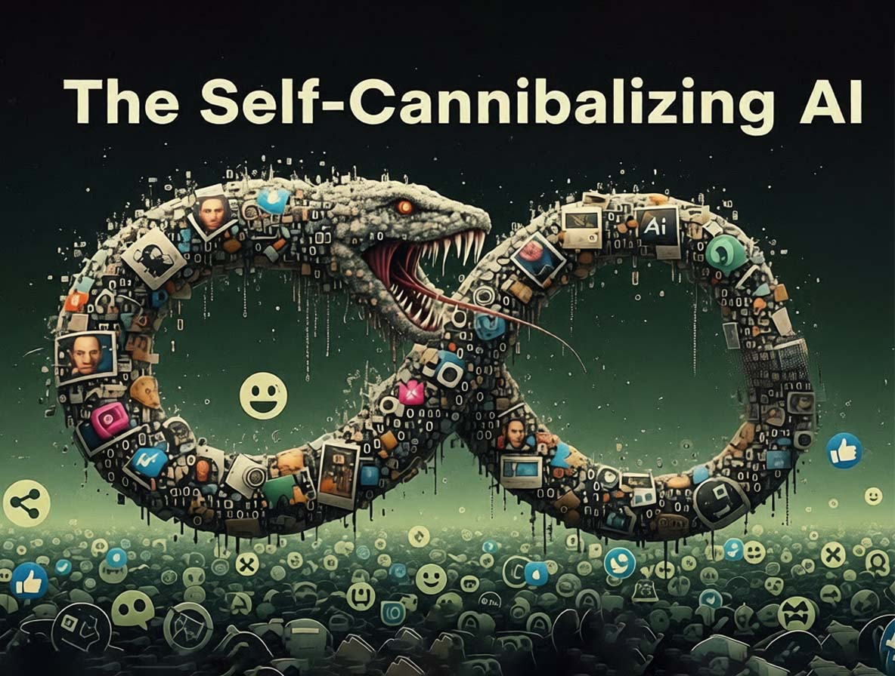
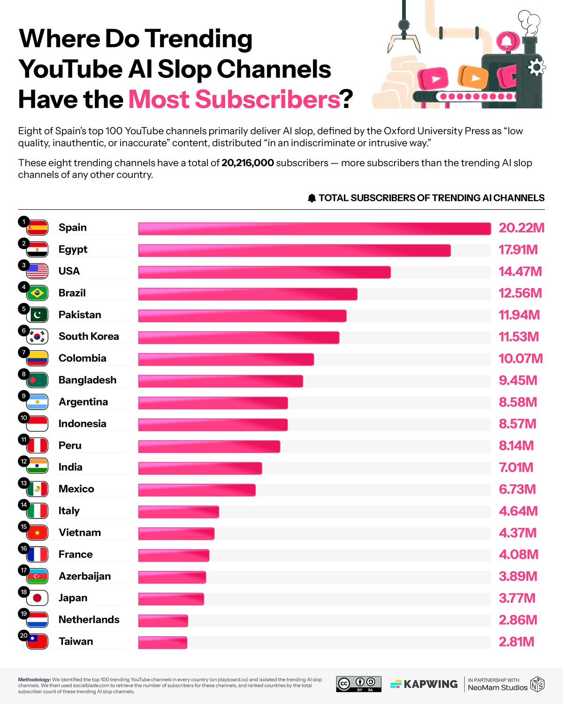
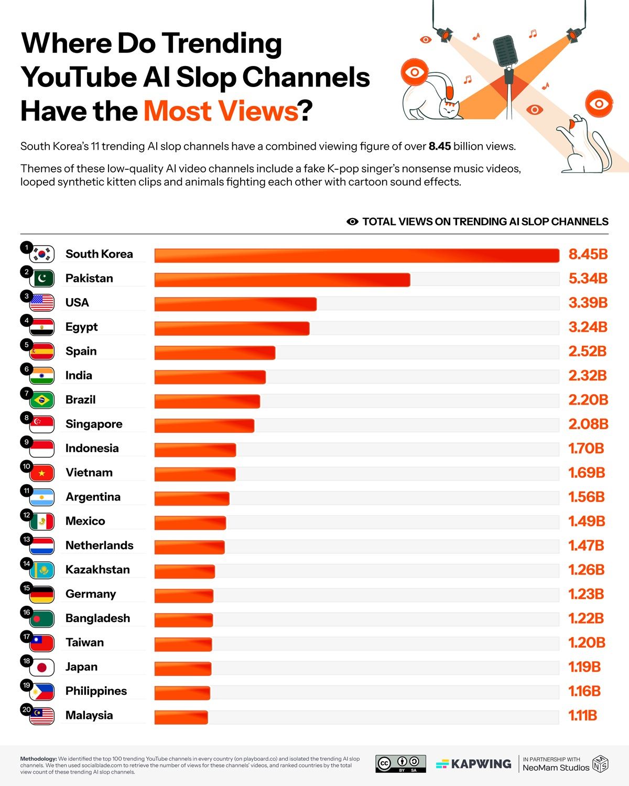

# L'internet che si mangia la coda: quando l'AI genera spazzatura che alimenta altra AI

*C'è una scena in *The Thing* di John Carpenter dove l'alieno assimila gli organismi terrestri creando copie sempre più degradate, sempre meno perfette. Ogni iterazione perde qualcosa dell'originale finché la distinzione tra autentico e replica diventa impossibile. È un'immagine potente per descrivere quello che sta accadendo all'ecosistema digitale: l'intelligenza artificiale sta consumando contenuti umani per rigenerarli in forma sempre più corrotta, alimentando un ciclo di degrado progressivo che gli scienziati chiamano "model collapse" ma che potremmo definire più semplicemente come l'internet che si mangia la coda.*

I numeri raccolti da [Kapwing nel loro ultimo report](https://www.kapwing.com/blog/ai-slop-report-the-global-rise-of-low-quality-ai-videos/) hanno la precisione brutale di una diagnosi medica: tra il 21 e il 33% dei contenuti che YouTube propone ai nuovi utenti è quello che nel gergo dell'industria si chiama "AI slop", spazzatura generata da intelligenza artificiale. Non stiamo parlando di contenuti AI di qualità, ma di quella produzione industriale a basso costo che ha un solo scopo: massimizzare le visualizzazioni per generare ricavi pubblicitari. Canali come Cuentos Fascinantes in Spagna hanno accumulato oltre venti milioni di iscritti con video interamente sintetici, mentre in Corea del Sud questa tipologia di contenuti ha raggiunto otto miliardi di visualizzazioni. L'economia dello slop vale già centodiciassette milioni di dollari all'anno, con singoli canali che fatturano oltre quattro milioni.

La macchina funziona in modo semplice ma efficace. Gli algoritmi di YouTube premiano la novità e l'engagement immediato. I contenuti generati da AI, prodotti in massa a costi bassissimi, possono saturare la piattaforma con variazioni infinite dello stesso tema. Un creatore tradizionale impiega ore o giorni per produrre un video. Un sistema AI può sfornarne decine nello stesso tempo, testando molteplici varianti per identificare quella che funziona meglio. Il 54% percento dei primi video visti dai nuovi utenti appartiene a questa categoria, creando una sorta di porta d'ingresso distorta alla piattaforma.

Neal Mohan, CEO di YouTube, [ha dichiarato al magazine Time](https://time.com/7338621/ceo-of-the-year-2025-neal-mohan/) che l'intelligenza artificiale rappresenta "la prossima frontiera" per la piattaforma. In una [riorganizzazione annunciata a ottobre 2024](https://www.uxpin.com/studio/blog/youtube-ceo-emphasizes-ai-technological-frontier/), YouTube ha ristrutturato le proprie divisioni prodotto e ingegneristiche proprio per allinearsi a questa visione AI-centrica. Ma c'è un incoerenza inquietante: mentre l'azienda investe massicciamente in strumenti AI per i creatori, i suoi stessi sistemi di moderazione automatizzata [stanno causando blocchi di massa di canali legittimi](https://ppc.land/youtube-ceo-defends-ai-moderation-as-creators-lose-channels-overnight/), con creator che vedono i loro account bannati mentre i canali che hanno rubato i loro contenuti rimangono attivi. È come se YouTube stesse contemporaneamente alimentando e combattendo lo stesso fenomeno, intrappolata in una contraddizione sistemica che ricorda da vicino le dinamiche di [monopolio tecnologico che l'Unione Europea sta cercando di regolare](https://aitalk.it/it/google-ue-indagine.html).

## L'entropia che cresce

Ma il problema dello slop è solo la manifestazione superficiale di qualcosa di molto più profondo. Mentre YouTube si riempie di video sintetici, LinkedIn ha raggiunto un punto critico ancora più estremo: [secondo l'analisi di Originality.AI](https://originality.ai/blog/ai-content-published-linkedin), il 54% percento dei post di lungo formato sulla piattaforma professionale è generato da intelligenza artificiale. Un salto del 189% rispetto al periodo pre-ChatGPT. Non parliamo di assistenza alla scrittura, ma di contenuti interamente artificiali presentati come pensiero originale. Gli algoritmi di LinkedIn ora premiano questa produzione massiva, creando un feed dove distinguere l'autentico dal sintetico diventa sempre più difficile.

La questione non è più solo qualitativa ma strutturale. Un [paper pubblicato su arXiv](https://arxiv.org/html/2512.12381v1) documenta scientificamente il fenomeno del "model collapse", l'entropia informazionale che si genera quando i modelli di intelligenza artificiale vengono addestrati su dati prodotti da altri modelli AI. Gli autori dimostrano che questa pratica causa una perdita progressiva di diversità: la varietà semantica misurata in bit per token scende da 4.2 a 2.5 nel giro di poche iterazioni di training. È come fare fotocopie di fotocopie: ogni generazione perde dettagli, sfumature, complessità.

Il meccanismo è subdolo. I modelli attuali sono stati addestrati su miliardi di testi prodotti da esseri umani in decenni di attività online. Ma quella miniera di dati originali si sta esaurendo. [Uno studio pubblicato su Nature](https://www.nature.com/articles/s41586-024-07566-y) stima che il "budget" di contenuti umani disponibili per l'addestramento si esaurirà tra il 2026 e il 2032, a seconda degli scenari. Dopodiché, i nuovi modelli dovranno necessariamente nutrirsi anche di contenuti generati da AI precedenti. Ed è qui che scatta la trappola: ogni ciclo di training su dati sintetici amplifica gli errori, riduce la varietà, omogeneizza l'output. Come in una popolazione che si riproduce solo al suo interno, la diversità genetica collassa.

[Immagine tratta da kapwing.com](https://www.kapwing.com/blog/ai-slop-report-the-global-rise-of-low-quality-ai-videos/)

## Il serpente Uroboro digitale

Lo slop di YouTube e il model collapse non sono fenomeni separati ma due facce della stessa medaglia. I video spazzatura generati oggi diventeranno parte dei dataset con cui verranno addestrati i modelli di domani. I post AI di LinkedIn verranno indicizzati, archiviati, utilizzati come materiale di training. È un feedback loop perfetto: contenuti di bassa qualità generano dati corrotti che producono modelli peggiori che a loro volta creano contenuti ancora più degradati. Un serpente che si mangia la coda, come l'Uroboro alchemico, ma senza alcuna promessa di rinascita.

Le implicazioni pratiche sono già misurabili. [Una ricerca pubblicata su JMIR](https://mededu.jmir.org/2025/1/e80084) ha identificato che il 5.3 percento dei contenuti educativi biomedici su YouTube contiene informazioni generate da AI di qualità dubbia. Non stiamo parlando di intrattenimento ma di materiale che medici, studenti e pazienti consultano per prendere decisioni sulla salute. L'effetto "illusory truth" è ben documentato: ripetere informazioni false o imprecise ne aumenta la credibilità percepita. Se YouTube continua a pompare contenuti AI non verificati, stiamo costruendo un'infrastruttura di disinformazione che diventerà sempre più difficile da smantellare.

Sul piano economico, lo slop crea distorsioni profonde. I centodiciassette milioni di dollari che genera annualmente non sono ricchezza nuova: vengono dirottati da creator legittimi verso chi ha capito come "giocare" il sistema algoritmico con produzione industriale a basso costo. È una forma di selezione avversa: l'algoritmo premia chi produce in quantità a scapito di chi produce in qualità, creando un incentivo perverso che spinge l'intero ecosistema verso il basso. E mentre questo accade, giganti come Google continuano a [ridefinire il proprio rapporto con l'AI](https://aitalk.it/it/google-ai-revolution.html), investendo massicciamente in una tecnologia che al contempo minaccia di cannibalizzare le fondamenta stesse del web che hanno contribuito a costruire.

La normalizzazione è forse l'aspetto più insidioso. Quando metà dei contenuti su LinkedIn è AI e un terzo di YouTube è slop, il nostro senso critico si adatta. Iniziamo ad aspettarci quella patina di artificialità, quella mancanza di autenticità. Il rischio è che stiamo addestrando una generazione di utenti a non distinguere più, a non cercare più l'originale. E quando non cerchi più l'originale, smetti di valorizzarlo e quindi di produrlo.

## I vincitori invisibili

Mentre l'ecosistema digitale si riempie di spazzatura e i modelli rischiano il collasso, esiste un'economia parallela che prospera proprio su questo caos. Nvidia ha chiuso il terzo trimestre fiscale 2026 con [cinquantasette miliardi di dollari di ricavi](https://nvidianews.nvidia.com/news/nvidia-announces-financial-results-for-third-quarter-fiscal-2026), in crescita del sessantadue percento anno su anno. L'azienda controlla il 92% del mercato GPU e monetizza ogni singola generazione AI, che sia contenuto di qualità o slop. Il CEO Jensen Huang parla di "domanda incredibile" e GPU cloud "sold out", proiettando investimenti in infrastruttura AI tra tre e quattro trilioni di dollari entro il 2030.

Non è solo Nvidia. I provider cloud come AWS, Azure e Google Cloud fatturano miliardi dalle aziende che addestrano modelli e generano contenuti. OpenAI e Anthropic raccolgono centinaia di milioni in finanziamenti proprio mentre il web si riempie dei contenuti che i loro modelli producono. È un paradosso perfetto: più contenuti AI vengono generati, più computing power è necessario per addestrare i modelli successivi su dataset sempre più inquinati, generando profitti crescenti per l'infrastruttura che alimenta il problema stesso. Gli sloppers di YouTube che fatturano quattro milioni sono la punta visibile dell'iceberg. Sotto la superficie, c'è un'industria da decine di miliardi che monetizza ogni watt di energia speso per generare e processare contenuti, indipendentemente dalla loro qualità o utilità.

[Immagine tratta da kapwing.com](https://www.kapwing.com/blog/ai-slop-report-the-global-rise-of-low-quality-ai-videos/)

## Verso quale ecosistema

Ma esistono alternative concrete che già funzionano. [Common Crawl](https://www.mozillafoundation.org/en/research/library/generative-ai-training-data/common-crawl/), nonostante le controversie recenti sulla gestione dei paywall, rimane il più grande archivio pubblico di dati web e viene utilizzato nel 64% dei modelli linguistici. La differenza cruciale sta nella cura: versioni filtrate come C4 di Google o Pile-CC di EleutherAI applicano processi di pulizia aggressivi. [NVIDIA ha sviluppato Nemotron-CC](https://developer.nvidia.com/blog/building-nemotron-cc-a-high-quality-trillion-token-dataset-for-llm-pretraining-from-common-crawl-using-nvidia-nemo-curator/), un dataset da 6.3 trilioni di token costruito attraverso ensemble di classificatori e tecniche di rephrasing sintetico che mantengono la qualità mentre espandono la quantità.

[Cohere Labs](https://cohere.com/research/aya) sta costruendo alternative radicalmente diverse con il progetto Aya, un'iniziativa open science che ha coinvolto tremila ricercatori da 150 paesi per creare dataset multilingue curati manualmente in 101 lingue. Non automazione cieca, ma curatela umana su larga scala. Il [Data Provenance Explorer](https://venturebeat.com/ai/mit-cohere-for-ai-others-launch-platform-to-track-and-filter-audited-ai-datasets/), sviluppato da MIT e Cohere Labs, ha tracciato e verificato duemila dei dataset più utilizzati, creando per la prima volta un sistema di tracciabilità che documenta licenze, creatori e lineage dei dati. Piattaforme come Substack hanno costruito modelli economici che premiano l'autenticità umana verificata, dimostrando che esistono mercati disposti a pagare per contenuti originali certificati.

Il watermarking dei contenuti AI rimane una soluzione parziale ma necessaria. L'Unione Europea, con l'AI Act, ha iniziato a imporre obblighi di trasparenza. YouTube [ha annunciato sistemi di etichettatura](https://blog.youtube/inside-youtube/2024-letter-from-neal/), anche se l'implementazione resta disomogenea. Ma la questione non è solo tecnologica. Servono interventi strutturali: le piattaforme devono ripensare algoritmi che premiano l'engagement immediato creando incentivi perversi. I dataset per l'addestramento richiedono curation estrema, privilegiando fonti umane verificate. E serve investimento massiccio in media literacy: riconoscere contenuti AI non è più opzionale ma competenza fondamentale.

Il punto critico è che siamo a un bivio. Possiamo continuare sulla traiettoria attuale, dove ogni anno una percentuale maggiore del web diventa AI-generata, dove i modelli si addestrano su output di altri modelli, dove la diversità informazionale collassa progressivamente fino a creare un ecosistema digitale omogeneo, prevedibile, sterile. Oppure possiamo intervenire ora, con regolamentazione intelligente, scelte tecniche consapevoli e una rinnovata valorizzazione del contenuto umano autentico.

La scommessa di YouTube è che l'AI possa democratizzare la creazione, abbassando le barriere tecniche e permettendo a chiunque di diventare creator. Ma se quella democratizzazione produce principalmente spazzatura che inquina l'ecosistema e alimenta il collasso dei modelli futuri, non stiamo democratizzando nulla: stiamo solo accelerando un degrado sistemico. Come nell'alieno di Carpenter, ogni copia diventa meno perfetta della precedente. E a differenza del film, qui non c'è un Kurt Russell con un lanciafiamme pronto a fermare l'assimilazione.

La domanda non è più se l'AI trasformerà internet. Quella trasformazione è già in corso. La domanda è: in cosa lo stiamo trasformando? In un sistema più ricco, vario e accessibile, o in una camera d'eco dove le macchine parlano principalmente ad altre macchine, mentre noi umani diventiamo spettatori sempre più passivi di un deterioramento informazionale che abbiamo messo in moto ma che fatichiamo sempre più a controllare?