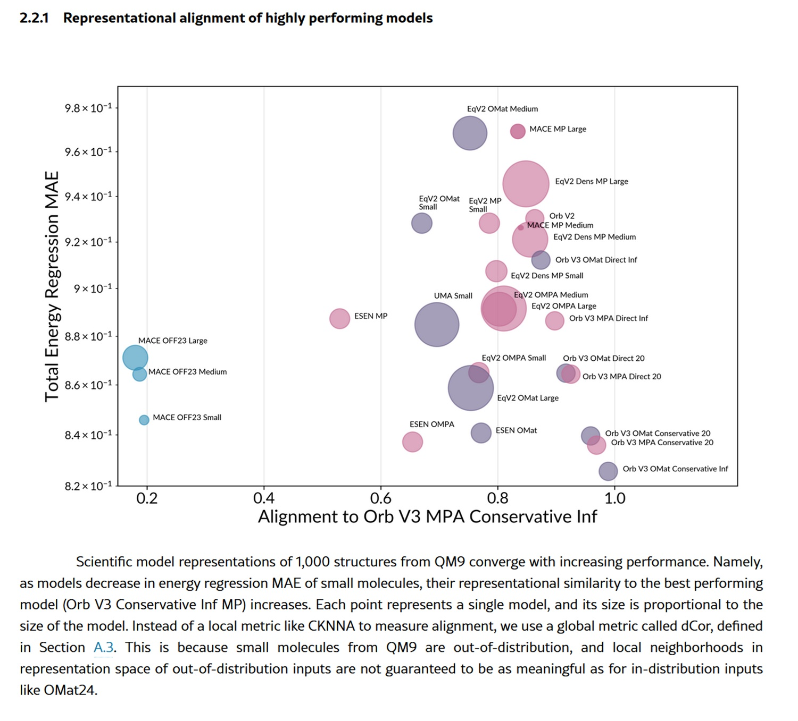

# Quando i modelli scientifici iniziano a pensare uguale

*Vi ricordate di quando [abbiamo parlato dell'AI slop](https://aitalk.it/it/ai-slop-entropia.html), quella valanga di contenuti sintetici che sta inondando YouTube e il resto dell'internet? La ricerca di Kapwing ci aveva mostrato un quadro allarmante: il 21% dei video raccomandati ai nuovi utenti è puro "slop" generato da AI, contenuti prodotti in massa senza supervisione umana, progettati solo per macinare visualizzazioni. Altri 33% ricadono nella categoria "brainrot", clip ripetitive e ipnotiche prive di sostanza. In totale, oltre la metà dei primi 500 video che un nuovo account YouTube incontra non contiene creatività umana significativa.*

Ma quella era solo la superficie del problema. Oggi vi racconto cosa succede quando scaviamo più a fondo, quando guardiamo non ai contenuti generati dall'AI ma alle rappresentazioni interne che questi sistemi sviluppano. E qui emerge uno scenario ancora più inquietante: i modelli scientifici di intelligenza artificiale stanno convergendo tutti verso lo stesso modo di "vedere" la materia. Non perché abbiano raggiunto una comprensione universale della fisica, ma perché sono tutti limitati dagli stessi dati.

Un team di ricercatori del MIT ha appena pubblicato uno [studio su 59 modelli scientifici di AI](https://arxiv.org/html/2512.03750v1), sistemi addestrati su dataset diversi, con architetture differenti, operanti su modalità distinte come stringhe chimiche, coordinate tridimensionali atomiche e sequenze proteiche. La domanda era semplice: questi modelli stanno davvero imparando la fisica sottostante della materia, o stanno solo memorizzando pattern dai loro dati di addestramento?

I risultati sono sorprendenti quanto preoccupanti. I modelli mostrano un "allineamento rappresentazionale" fortissimo, sviluppando rappresentazioni interne della materia stranamente simili tra loro. È come se stessero convergendo verso una "fisica comune" nascosta nei loro neuroni artificiali. I ricercatori hanno misurato questo fenomeno con quattro metriche diverse, dall'allineamento locale dei vicini più prossimi (CKNNA) alla correlazione di distanza globale (dCor) fino alla dimensione intrinseca degli spazi latenti, e tutte puntano nella stessa direzione.

## La convergenza inevitabile

Prendiamo il caso dei modelli addestrati su piccole molecole dal dataset QM9. Qui troviamo sistemi che operano su stringhe SMILES, quelle sequenze alfanumeriche che codificano strutture chimiche come "CC(C)C1CCC(C)CC1=O",  e modelli che invece processano direttamente le coordinate 3D degli atomi nello spazio. Sembrerebbero approcci radicalmente diversi, eppure i loro spazi latenti mostrano un allineamento sorprendente. I modelli basati su SMILES e quelli basati su coordinate atomiche concordano su quali molecole siano simili tra loro, nonostante uno lavori con stringhe piatte e l'altro con geometrie tridimensionali.

Il fenomeno è ancora più marcato con le proteine. I modelli che processano sequenze aminoacidiche, come ESM2 o ESM3, si allineano quasi perfettamente con quelli che operano su strutture proteiche tridimensionali. La convergenza è doppia rispetto a quella osservata per le piccole molecole. Questo suggerisce che i grandi modelli di sequenze proteiche abbiano imparato implicitamente i vincoli del ripiegamento proteico, portando i loro spazi latenti naturalmente più vicini a quelli dei modelli strutturali.

Ma c'è di più. Man mano che i modelli migliorano nelle loro performance, misurata come capacità di prevedere l'energia totale delle strutture materiali, le loro rappresentazioni convergono sempre più verso quelle del modello migliore. È un pattern che ricorda il "Platonic Representation Hypothesis" già osservato nei modelli di visione e linguaggio: l'idea che sistemi diversi, migliorando, convergano verso una rappresentazione condivisa della realtà.

I ricercatori hanno persino costruito un "albero evolutivo" dei modelli scientifici, usando le distanze negli spazi rappresentazionali per misurare quanto siano "imparentati". E qui emerge un dettaglio cruciale: i modelli si raggruppano più per dataset di addestramento che per architettura. Due modelli con architetture completamente diverse ma addestrati sugli stessi dati si assomigliano più di due modelli con la stessa architettura ma addestrati su dati diversi. Il messaggio è chiaro: sono i dati, non l'architettura, a dominare lo spazio rappresentazionale.

## Trappole nella distribuzione

Ma questa apparente maturazione scientifica nasconde un pericolo sistemico. I ricercatori hanno testato i modelli sia su strutture "in-distribuzione", materiali simili a quelli visti durante l'addestramento, sia su strutture "fuori-distribuzione", come molecole organiche molto più grandi e complesse. E qui il quadro si ribalta completamente.

Sulle strutture in-distribuzione, come quelle dal dataset OMat24 di materiali inorganici, i modelli migliori mostrano forte allineamento tra loro, mentre quelli più deboli divergono in sotto-ottimi locali dello spazio rappresentazionale. È il comportamento che ci aspetteremmo: i modelli performanti convergono verso una rappresentazione condivisa e generalizzabile, quelli deboli si perdono in soluzioni  fuori dal comune.

Ma quando escono dalla loro zona di comfort, testati su molecole organiche grandi dal dataset OMol25, quasi tutti i modelli collassano. Non solo peggiorano nelle previsioni, ma le loro rappresentazioni convergono verso varietà architetturali quasi identiche ma povere di informazioni. È come se, di fronte all'ignoto, perdessero ogni capacità distintiva e si rifugiassero nei pregiudizi induttivi codificati nelle loro architetture.

I ricercatori hanno visualizzato questo collasso usando la metrica dell'information imbalance, che misura asimmetricamente quanta informazione una rappresentazione contiene rispetto a un'altra. Per le strutture in-distribuzione, i modelli deboli sono sparsi, ognuno impara informazioni diverse e ortogonali. Per quelle fuori-distribuzione, si ammassano tutti nell'angolo in basso a sinistra del grafico: rappresentazioni quasi identiche, tutte ugualmente incomplete.

Il problema è sistemico. I dataset più popolari per l'addestramento, come MPTrj, sAlex e OMat24, sono dominati da simulazioni DFT basate sul funzionale PBE, uno standard computazionale occidentale. Questo crea una monocultura di dati che esclude sistematicamente chimica esotica, bio-molecole da ecosistemi non-occidentali, configurazioni atomiche rare. I modelli convergono non perché stiano scoprendo leggi universali della materia, ma perché sono tutti nutriti con le stesse minestre computazionali.

[Immagine tratta da arxiv.org](https://arxiv.org/html/2512.03750v1)

## L'entropia che dilaga

E qui il cerchio si chiude con l'AI slop di cui abbiamo parlato all'inizio. Perché quello che sta succedendo nei modelli scientifici è solo un caso particolare di un fenomeno molto più ampio: il model collapse globale.

Immaginate cosa succede quando i dati sintetici generati da AI vengono usati per addestrare nuove AI. È esattamente quello che sta accadendo su YouTube: 278 canali producono esclusivamente slop, accumulando 63 miliardi di visualizzazioni e 117 milioni di dollari annui di ricavi pubblicitari. Questi contenuti sintetici non sono neutrali, portano con sé i bias, le limitazioni e le rappresentazioni convergenti dei modelli che li hanno generati.

Nel caso dei modelli scientifici, questo significa che simulazioni DFT generate da AI, già limitate dal funzionale PBE e dai sistemi chimici "comuni", verranno usate per addestrare la prossima generazione di modelli. E questi, a loro volta, convergeranno ancora più strettamente sulle stesse rappresentazioni, escludendo progressivamente le periferie dello spazio chimico.

È il fenomeno del "model collapse" documentato in uno [studio recente](https://arxiv.org/html/2512.12381v1): quando modelli generativi vengono addestrati ricorsivamente su dati generati da altri modelli, la diversità si erode generazione dopo generazione. Per i Large Language Model addestrati su testo sintetico, questo si manifesta come perdita di creatività linguistica e difficoltà di generalizzazione cross-domain. Per i modelli scientifici, significa un progressivo impoverimento della capacità di esplorare nuove regioni dello spazio chimico e materiale.

Il parallelo con l'ecosistema dei contenuti è inquietante. Come l'AI slop su YouTube sta spiazzando i creator umani attraverso economie di unità negative, i contenuti sintetici costano quasi zero da produrre in scala, così i dati scientifici sintetici rischiano di svalutare la raccolta empirica costosa. Condurre esperimenti fisici reali, sintetizzare nuovi composti, raccogliere dati sperimentali da laboratori: tutto questo richiede tempo, competenze e risorse. Generare un milione di strutture simulate con un modello AI richiede solo potenza di calcolo.

## La geografia dei dati

Le implicazioni vanno ben oltre la chimica computazionale. I ricercatori del MIT sottolineano che i modelli attuali sono "data-governed, not foundational", governati dai dati, non ancora fondazionali nel senso vero del termine. Un vero modello fondazionale dovrebbe generalizzare bene su domini di materia mai visti durante l'addestramento. Invece, questi sistemi mostrano forte dipendenza dal training set e collasso prevedibile fuori-distribuzione.

C'è anche una dimensione geopolitica. I dataset dominanti vengono da istituzioni occidentali, usando metodi computazionali standardizzati. Questo crea bias strutturali che favoriscono chimica e materiali già ben studiati, escludendo sistematicamente scoperte potenziali in regioni dello spazio chimico meno esplorate. È una forma sottile di centralizzazione scientifica, dove le grandi aziende tech e pharma che possono permettersi la generazione di dati su larga scala monopolizzeranno l'AI scientifica.

I ricercatori suggeriscono che raggiungere vero status fondazionale richiederà dataset sostanzialmente più diversificati, coprendo regimi di equilibrio e non-equilibrio, ambienti chimici esotici, temperature e pressioni estreme. Servono policy per promuovere dataset aperti e diversificati, estensioni di iniziative come Open Catalyst 2020 ma su scala molto maggiore.

C'è però anche una nota positiva nascosta nei risultati. Lo studio mostra che modelli di dimensioni molto diverse, anche piccoli, possono apprendere rappresentazioni simili a quelle dei modelli grandi, se addestrati bene. Questo apre la strada alla distillazione: modelli compatti che ereditano la struttura rappresentazionale di sistemi enormi, abbassando le barriere computazionali per ricerca e sviluppo.

Più sorprendente ancora è il caso dei modelli Orb V3, che raggiungono performance eccellenti senza imporre equivarianza rotazionale nell'architettura. Usano invece un leggero schema di regolarizzazione chiamato "equigrad" che incoraggia quasi-invarianza dell'energia e quasi-equivarianza delle forze durante l'addestramento. Il risultato? I loro spazi latenti si allineano fortemente con architetture completamente equivarianti come MACE ed Equiformer V2, ma a costi computazionali molto inferiori. È una versione della "bitter lesson" del machine learning: spesso, scalare l'addestramento supera i vincoli architetturali elaborati.

La lezione finale è chiara: stiamo assistendo all'emergere di una monocultura rappresentazionale nell'AI scientifica, alimentata dalla convergenza di dataset limitati e dalla proliferazione di dati sintetici. Come per l'AI slop su YouTube, il problema non è la tecnologia in sé ma l'economia dell'attenzione e delle risorse che premia quantità sulla qualità, velocità sulla diversità. La differenza è che mentre su YouTube il peggio che può succedere è vedere un gatto parlante generato da AI, nell'AI scientifica stiamo codificando nei nostri modelli i limiti epistemici che definiranno quali farmaci svilupperemo, quali materiali scopriremo, quali domande scientifiche considereremo persino degne di essere poste.

Il cerchio si chiude dove era iniziato: l'entropia dilaga, non solo nei feed social ma negli spazi latenti che pretendono di rappresentare la materia stessa. E forse la vera domanda non è se l'AI stia imparando la fisica, ma se stiamo collettivamente rinunciando a esplorare tutto ciò che le nostre simulazioni standardizzate non possono già vedere.