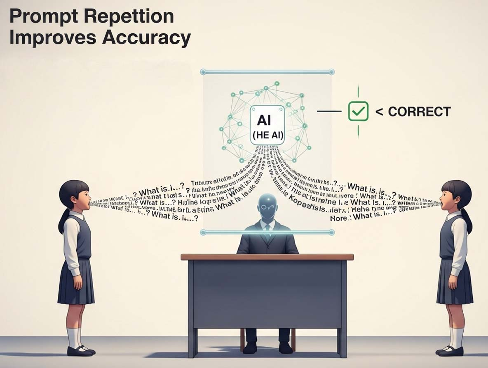
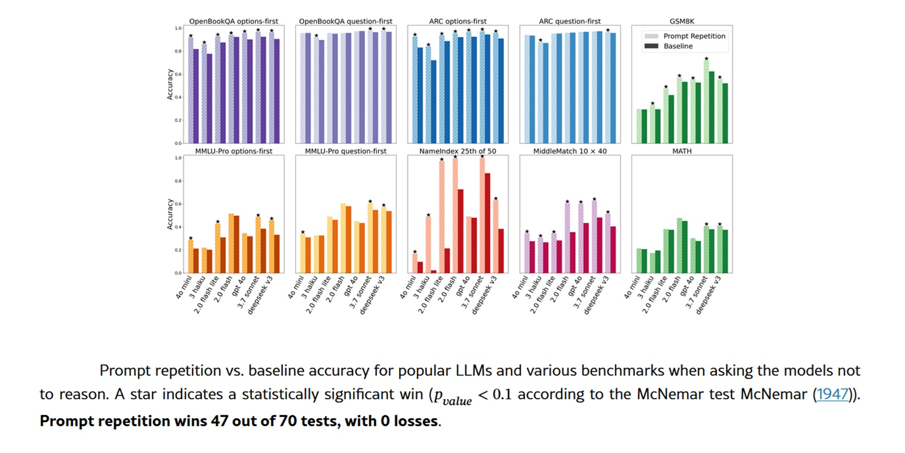

# Repetita Iuvant : comment la répétition du prompt double les performances des LLM

***Repetita iuvant**, disaient les Latins. Les choses répétées sont bénéfiques. Et si cette maxime, vieille de deux mille ans, s'avérait également être l'heuristique computationnelle la plus efficace pour les modèles de langage les plus avancés de 2026 ? C'est ce qui ressort d'un [article publié par Google Research](https://arxiv.org/html/2512.14982v1) en janvier, où trois chercheurs, Yaniv Leviathan, Matan Kalman et Yossi Matias, ont découvert quelque chose de déconcertant par sa simplicité : il suffit de répéter deux fois le même prompt pour améliorer significativement les performances de GPT, Claude, Gemini et Deepseek. Pas de Chaîne de Pensée élaborée, pas d'ingénierie de prompt sophistiquée. Littéralement : copier, coller.*

La technique fonctionne ainsi : au lieu de soumettre au modèle une requête sous la forme classique `<QUERY>`, on la transforme en `<QUERY><QUERY>`. Fin. Et pourtant, les résultats sont tout sauf anodins. Dans les tests menés sur sept modèles de pointe et autant de benchmarks, [la répétition du prompt a remporté 47 tests sur 70](https://arxiv.org/html/2512.14982v1#S2), sans aucune défaite. Sur certaines tâches personnalisées créées ad hoc par les chercheurs, les améliorations frôlent le surréel : Gemini 2.0 Flash-Lite passe de 21,33 % à 97,33 % de précision sur le benchmark NameIndex. Un bond de soixante-seize points de pourcentage obtenu en doublant le texte.

## Quand regarder vers l'avant signifie ne pas voir en arrière

Pour comprendre pourquoi cette technique fonctionne, il faut faire un pas en arrière dans l'architecture des grands modèles de langage. La grande majorité des LLM modernes sont entraînés comme des *modèles de langage causal*, un terme technique qui cache une contrainte structurelle fondamentale : chaque jeton ne peut "voir" que les jetons qui le précèdent, jamais ceux qui le suivent. C'est comme lire un livre avec une fenêtre mobile qui couvre tout ce qui se trouve devant le mot actuel.

Ce mécanisme d' [attention causale](https://arxiv.org/html/2512.14982v1#S1), aussi efficace soit-il pendant l'entraînement, introduit un problème subtil mais omniprésent : l'ordre des informations dans le prompt a une importance capitale. Un exemple concret aide à visualiser le problème. Imaginez une question à choix multiples structurée ainsi : d'abord la question, puis les options de réponse. Lorsque le modèle lit les options, il a déjà traité la question et peut les contextualiser. Mais si vous inversez l'ordre, d'abord les options, puis la question, le modèle traite les réponses *avant* de savoir ce que vous lui demandez. Le résultat ? Des performances systématiquement moins bonnes.

Les chercheurs de Google ont testé les deux configurations sur les benchmarks ARC, OpenBookQA et MMLU-Pro. Avec le format classique question d'abord, les améliorations de la répétition du prompt ont été modestes. Mais avec le format options d'abord, où le modèle voit les réponses sans encore connaître la question, [les gains ont été substantiels](https://arxiv.org/html/2512.14982v1#S1.F1). La répétition du prompt permet à chaque jeton de "voir" tous les autres jetons du prompt, contournant ainsi la contrainte causale. Ce n'est pas une véritable attention bidirectionnelle, mais elle en simule les effets.

## La solution désarmante

La beauté de la répétition du prompt réside dans sa simplicité opérationnelle. Elle ne nécessite aucune modification des modèles, ne change pas le format des réponses, n'augmente pas le nombre de jetons générés ni la latence perçue. C'est ce qu'on appelle en jargon un *déploiement "drop-in"*: vous prenez votre système existant, vous ajoutez une ligne de code qui duplique le prompt, et vous obtenez des améliorations mesurables. Pour les utilisateurs finaux, c'est encore plus immédiat : il suffit de copier et coller sa question deux fois.

Les tests ont été menés entre février et mars 2025 via les API officielles de quatre fournisseurs principaux. De Google : [Gemini 2.0 Flash et Gemini 2.0 Flash Lite](https://arxiv.org/html/2512.14982v1#bib.bib5). D'OpenAI : [GPT-4o et GPT-4o-mini](https://arxiv.org/html/2512.14982v1#bib.bib12). D'Anthropic : [Claude 3 Haiku et Claude 3.7 Sonnet](https://arxiv.org/html/2512.14982v1#bib.bib1). Et enfin [Deepseek V3](https://arxiv.org/html/2512.14982v1#bib.bib4). Sept modèles de tailles et de capacités différentes, tous testés sur des benchmarks établis comme GSM8K pour les mathématiques, MATH pour les problèmes plus complexes, et les ensembles de données de compréhension de texte déjà cités.

En plus des benchmarks standard, les chercheurs ont créé deux tâches spécialement conçues pour mettre en évidence les limites de l'attention causale. La première, NameIndex, est d'une simplicité désarmante : on fournit au modèle une liste de cinquante noms et on lui demande de renvoyer le vingt-cinquième. Cela semble trivial, mais cela nécessite de suivre la position tout en traitant séquentiellement tous les noms précédents. La seconde, MiddleMatch, demande d'identifier le nom qui apparaît exactement entre deux noms spécifiques dans une liste de quarante éléments avec des répétitions. Ce sont des tâches qu'un humain résoudrait en quelques secondes en parcourant des yeux, mais qui, pour un modèle causal, représentent un défi computationnel non négligeable.

[Les résultats sur ces tâches](https://arxiv.org/html/2512.14982v1#A1.SS3) montrent l'écart le plus net. Sur NameIndex, Gemini Flash-Lite sans répétition n'obtient que 21,33 % de réponses correctes. Avec la simple répétition du prompt : 97,33 %. GPT-4o passe de 92 % à 100 %. Claude 3.7 Sonnet de 98,67 % à 100 %. Ce ne sont pas des augmentations marginales, ce sont des sauts qualitatifs qui transforment des tâches impossibles en tâches résolues.

Les chercheurs ont également testé des variantes de la technique de base. La *Répétition Verbeuse du Prompt* introduit une phrase de transition : `<QUERY> Laissez-moi répéter cela : <QUERY>`. La *Répétition du Prompt ×3* triple le prompt avec deux phrases de liaison. [Les deux variantes](https://arxiv.org/html/2512.14982v1#A1.SS1) obtiennent des résultats comparables à la répétition simple sur la plupart des benchmarks, avec des améliorations supplémentaires occasionnelles sur les tâches personnalisées. Pour exclure que les avantages découlent simplement de l'augmentation de la longueur du prompt, une méthode de contrôle appelée *Rembourrage* a également été testée, qui ajoute des points de remplissage jusqu'à atteindre la même longueur que la répétition. Comme prévu, le rembourrage n'a produit aucune amélioration.

## Sous le capot

La clé de l'efficacité réside dans la manière dont les transformateurs traitent le texte. La génération d'une réponse se divise en deux phases : le *prétraitement*, où le modèle traite l'intégralité du prompt en parallèle en construisant le cache KV, et le *décodage*, où il génère les jetons un par un de manière séquentielle. La répétition du prompt n'affecte que le prétraitement, qui est déjà parallélisé et donc extrêmement rapide. La génération proprement dite, la partie lente, ne change absolument pas.

[Les mesures empiriques](https://arxiv.org/html/2512.14982v1#S2.SS0.SSS0.Px3) le confirment : aucune augmentation significative de la latence pour la plupart des modèles. L'exception concerne les modèles d'Anthropic, Claude Haiku et Claude 3.7 Sonnet, lorsqu'ils sont testés sur des prompts très longs comme ceux des tâches NameIndex et MiddleMatch, ou avec la variante ×3. Dans ces cas, la latence augmente, probablement parce que la phase de prétraitement commence à peser. Mais pour des prompts de longueur normale, le surcoût est négligeable.

Encore plus intéressant : le nombre de jetons générés reste identique. Contrairement à des techniques comme le célèbre ["Penser étape par étape"](https://arxiv.org/abs/2205.11916) proposé par Kojima en 2023, qui améliore le raisonnement mais génère des réponses beaucoup plus longues, la répétition du prompt n'altère absolument pas la sortie. Le modèle répond avec le même format, la même longueur, les mêmes mots. Seule la précision change. Cela la rend compatible avec n'importe quel système existant qui attend des réponses dans un format spécifique.

La comparaison avec la Chaîne de Pensée est éclairante. Le CoT et ses variantes forcent le modèle à expliciter son raisonnement, augmentant considérablement à la fois les jetons générés et la latence. Ils fonctionnent très bien pour les tâches de raisonnement complexes, mais ont un coût de calcul important. La répétition du prompt occupe une niche différente : [tâches de compréhension, de classification, de réponse à des questions directes](https://arxiv.org/html/2512.14982v1#S1), tout ce qui ne nécessite pas de raisonnement élaboré mais où l'ordre des informations peut prêter à confusion.

Et en effet, lorsque les chercheurs ont testé la répétition du prompt en combinaison avec l'instruction "penser étape par étape", [les résultats ont été neutres ou légèrement positifs](https://arxiv.org/html/2512.14982v1#A1.SS2) : cinq victoires, une défaite, vingt-deux nuls. C'est logique : si le modèle est déjà en train de raisonner et d'expliciter son processus, il répète probablement déjà les parties pertinentes du prompt dans son raisonnement interne. La technique devient redondante.

[Image tirée de arxiv.org](https://arxiv.org/html/2512.14982v1)

## Applications et limites

L'article a été publié en janvier 2026, et l'accueil dans la communauté technique a été rapide. Sur Reddit, dans le subreddit LocalLLaMA dédié aux modèles de langage locaux, plusieurs utilisateurs ont partagé des expériences pratiques. Les résultats confirment ce qui est rapporté dans l'article, certains signalant des améliorations notables sur les tâches de classification et d'extraction d'informations. D'autres ont noté des avantages particuliers sur les modèles plus petits, ceux de moins de 10 milliards de paramètres, où la répétition du prompt semble compenser partiellement les limitations architecturales.

Les cas d'utilisation idéaux ressortent assez clairement de l'article et des discussions qui ont suivi. Classification de texte, où il faut attribuer des catégories en se basant sur des informations éparses dans le prompt. Questions à choix multiples, surtout lorsque les options sont longues ou complexes. Extraction d'informations spécifiques de contextes longs. Toute tâche où l'ordre de présentation des informations pourrait créer une ambiguïté pour un modèle causal.

Les limitations sont tout aussi claires. Tout d'abord : cela ne fonctionne qu'sans raisonnement explicite. Si vous utilisez GPT-5 ou Claude Opus pour résoudre des problèmes mathématiques complexes ou pour programmer, la répétition du prompt ne vous apportera probablement aucun avantage. Deuxièmement : sur des prompts déjà très longs, pensez à ceux de 8000-10000 jetons, doubler le texte peut commencer à créer des problèmes de latence, en particulier avec certains fournisseurs. Troisièmement : [certains modèles d'Anthropic montrent des augmentations de latence](https://arxiv.org/html/2512.14982v1#S2.SS0.SSS0.Px3) même avec des prompts modérément longs lorsqu'on utilise la répétition.

Mais la limite la plus intéressante est peut-être épistémologique. Nous ne savons pas encore exactement *pourquoi* cela fonctionne si bien. L'article offre une explication mécaniste solide, l'attention pseudo-bidirectionnelle, mais les détails sur la manière dont les modèles utilisent réellement cette information dupliquée restent opaques. Les chercheurs suggèrent comme piste future d'[analyser les schémas d'attention](https://arxiv.org/html/2512.14982v1#S4) pendant la répétition, pour comprendre quelles parties du prompt dupliqué reçoivent le plus de poids et quand.

## Une généalogie de la répétition

La répétition du prompt n'émerge pas de nulle part. Elle s'inscrit dans un courant de recherche plus large sur la manipulation stratégique des entrées des LLM. Le point de référence historique est le déjà cité "prompting" de la Chaîne de Pensée, proposé par [Wei et ses collègues en 2023](https://arxiv.org/abs/2201.11903), qui a démontré comment le fait de demander explicitement au modèle de raisonner étape par étape améliore considérablement les performances sur les tâches complexes. Kojima a ensuite affiné l'approche en montrant qu'il suffit d'ajouter "Penser étape par étape" pour obtenir des effets similaires, sans avoir besoin d'exemples spécifiques pour chaque tâche.

Mais il existe aussi des explorations plus directes de la répétition. [Sagi Shaier a publié en décembre 2024](https://arxiv.org/abs/2412.07923) une étude sur la robustesse des LLM lorsque l'on répète les *questions*, et non l'intégralité du prompt, uniquement la partie interrogative. Ses résultats montrent que la répétition de la seule question ne produit pas d'améliorations significatives, et parfois même détériore légèrement les performances. C'est un contraste intéressant avec les résultats de Google : il est évidemment important de répéter *tout* le contexte, pas seulement la requête.

Une autre ligne de recherche connexe vient de [Jacob Springer et ses collègues](https://arxiv.org/abs/2402.15449), qui ont démontré en février 2024 que la répétition de l'entrée deux fois améliore la qualité des plongements de texte. Les plongements sont des représentations vectorielles du texte utilisées pour les tâches de similarité sémantique, et le fait que la répétition y contribue également suggère que les avantages vont au-delà de la simple génération de réponses.

Encore plus proche du travail de Google, [l'étude de Xiaohan Xu de 2024](https://arxiv.org/abs/2309.06275), qui a exploré la *relecture* – demander explicitement au modèle de relire la question avant de répondre. Xu a découvert que la relecture améliore le raisonnement, mais avec un mécanisme différent : le modèle génère effectivement une répétition dans sa sortie, ce qui augmente les jetons produits et la latence. La répétition du prompt obtient des effets similaires en déplaçant le coût vers la phase de prétraitement.

Ce qui ressort de cette constellation de recherches est un schéma : les modèles de langage bénéficient du traitement de la même information plusieurs fois, mais *comment* et *quand* ce retraitement a lieu fait toute la différence. Répéter dans le prompt est efficace, répéter dans la sortie est coûteux, et ne répéter que des parties sélectionnées est inefficace.

## Au-delà de l'article

Les pistes futures proposées par les chercheurs de Google sont ambitieuses. L'une des plus intéressantes concerne le réglage fin : et si nous entraînions des modèles spécifiquement avec des prompts répétés ? Ils pourraient apprendre à mieux exploiter cette structure, peut-être en développant des schémas d'attention optimisés. Ou, paradoxalement, ils pourraient apprendre à *ne pas* répéter dans leur sortie, rendant la technique encore plus efficace.

Une autre piste concerne l'optimisation du cache KV. Actuellement, lorsque l'on répète le prompt, les deux copies sont sauvegardées dans le cache. Mais techniquement, il suffirait de ne conserver que la deuxième répétition, celle qui a "vu" tous les jetons. [Cela rendrait la technique complètement neutre](https://arxiv.org/html/2512.14982v1#S4) même pour la phase de génération, éliminant ainsi tout surcoût de mémoire.

Il y a ensuite la question de la multimodalité. Les modèles modernes traitent du texte, des images, du son. Est-il judicieux de répéter également les entrées non textuelles ? Et si oui, comment ? Répéter une image pixel par pixel semble inutile, mais il existe peut-être des moyens plus intelligents de "répéter" l'information visuelle pour permettre aux différentes parties d'une image de mieux se "voir" les unes les autres.

La version la plus radicale de la technique pourrait impliquer des répétitions dynamiques pendant la génération elle-même. Au lieu de ne répéter que le prompt initial, on pourrait également répéter périodiquement les jetons déjà générés, permettant au modèle de retraiter sa sortie au fur et à mesure de sa production. C'est spéculatif, mais l'article le mentionne comme une possibilité.

Sur le plan pratique, la question est la suivante : quelqu'un l'utilise-t-il vraiment en production ? Les chercheurs ont testé tous les principaux modèles commerciaux, ce qui suggère un intérêt pour l'applicabilité réelle. Et certains commentaires sur les forums techniques indiquent que des développeurs expérimentent la technique dans des pipelines de classification et d'analyse de sentiments. Mais il manque encore une adoption massive documentée, probablement parce que l'article est très récent.

Une dernière réflexion sur la simplicité. Dans un domaine dominé par des architectures de plus en plus complexes, des mélanges d'experts, de la génération augmentée par la recherche, des cadres d'agents multimodaux, il y a quelque chose de paradoxalement révolutionnaire dans une technique qui consiste littéralement à appuyer sur Ctrl+C et Ctrl+V. C'est un rappel que l'innovation ne vient pas toujours de la complexité ajoutée, mais parfois d'une compréhension plus profonde des contraintes existantes. L'attention causale est une limitation architecturale connue depuis des années. La répétition du prompt est simplement le moyen le plus évident de la contourner, une fois qu'on y pense. Comme les motifs minimalistes de Steve Reich, où la répétition stratégique de phrases musicales crée une complexité émergente, ici la duplication du texte génère une forme de compréhension que le modèle ne pourrait pas obtenir autrement.

Les Latins le savaient déjà : *repetita iuvant*. Les chercheurs de Google n'ont fait que traduire le concept en une technique de calcul. Et ça marche.
