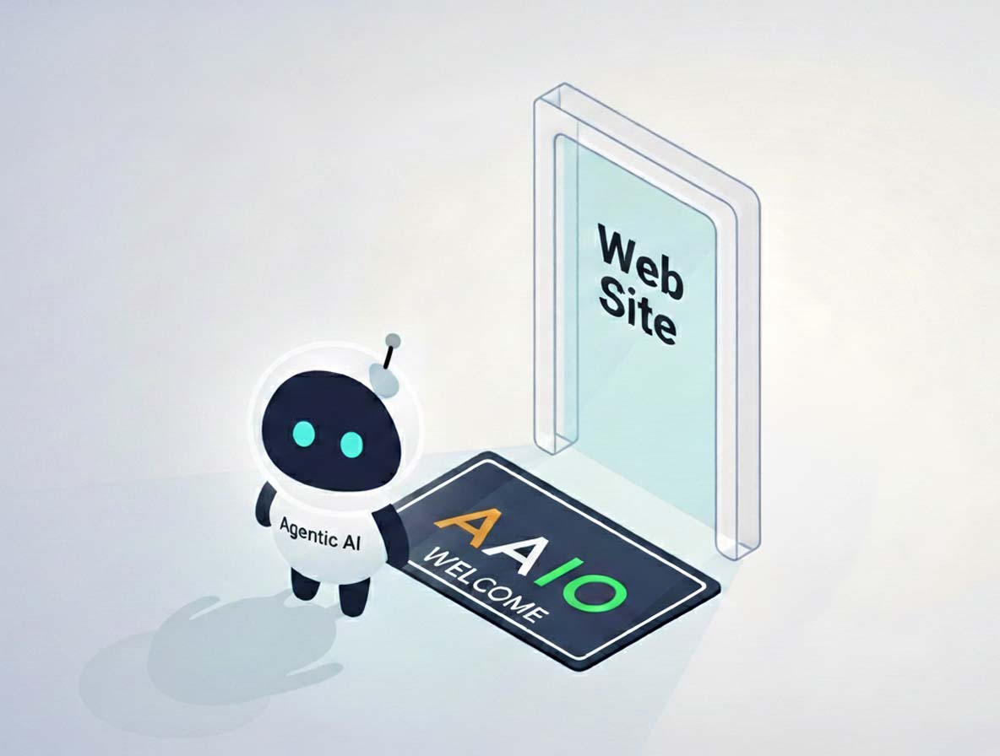
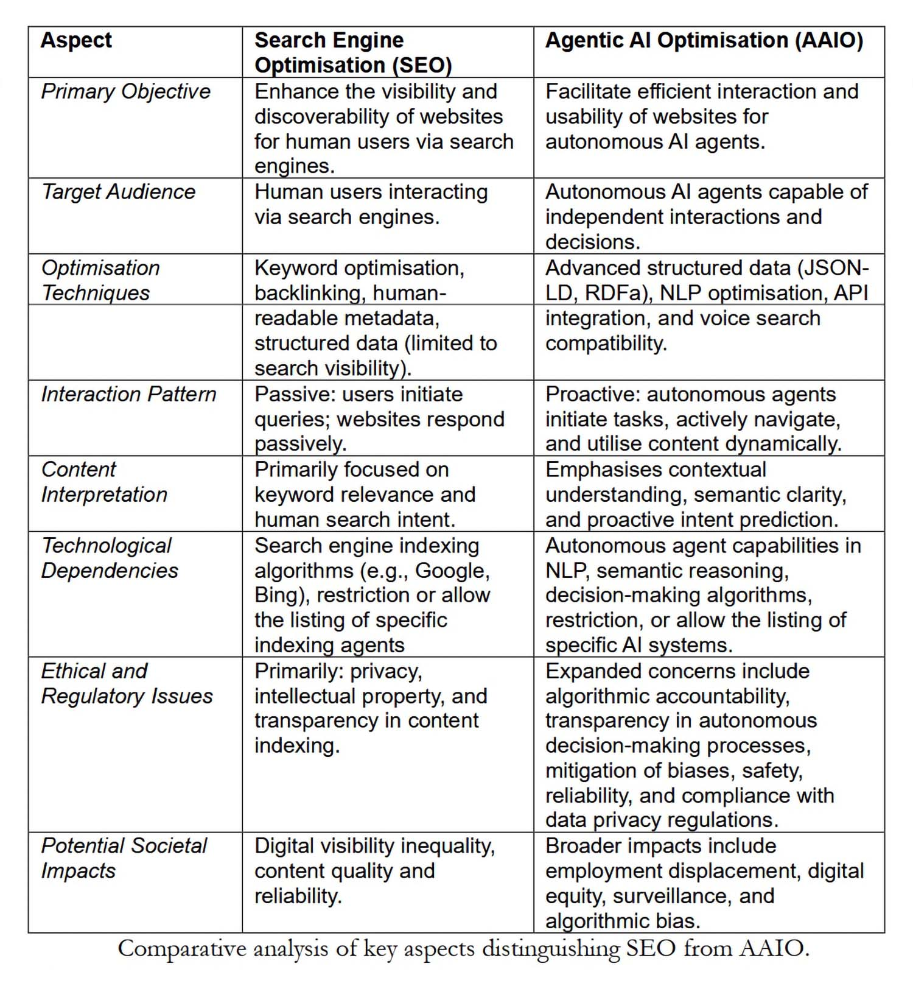

# Cuando los Agentes aprenden a navegar: bienvenidos a la era de la AAIO

*Imaginen un mundo donde su sitio web no solo es visitado por seres humanos aburridos durante la pausa para el café, sino también por agentes de inteligencia artificial que navegan de forma autónoma, toman decisiones y completan transacciones sin que ningún dedo humano toque un ratón. Bienvenidos a 2026, donde este escenario ya no es ciencia ficción, sino una realidad cotidiana. Y así como en los años noventa los webmasters tuvieron que adaptarse a las arañas de Google, hoy nos enfrentamos a una nueva revolución: la de la Optimización de la IA Agéntica.*

Nos guía en este nuevo territorio [Luciano Floridi](https://dec.yale.edu/people/luciano-floridi), un filósofo romano trasplantado a Yale, donde dirige el Centro de Ética Digital. Nacido en 1964, Floridi no es el clásico académico encerrado en su torre de marfil. Tras una formación clasicista en La Sapienza de Roma, pasó por la epistemología en Warwick y Oxford, para luego dedicarse a lo que hoy llamamos filosofía de la información. El gobierno italiano le concedió el título de Caballero de la Gran Cruz, el máximo reconocimiento nacional, y no es casualidad: Floridi ha trabajado como consultor ético para Google, ha colaborado con la Comisión Europea en inteligencia artificial y ha contribuido a dar forma al debate mundial sobre la ética digital.

En el [artículo](https://arxiv.org/abs/2504.12482) publicado en abril de 2025 junto a un equipo del Centro de Ética Digital (Carlotta Buttaboni, Emmie Hine, Jessica Morley, Claudio Novelli y Tyler Schroder), introduce formalmente el concepto de Optimización de la IA Agéntica. Si la Optimización para Motores de Búsqueda (SEO) ha definido cómo estructuramos los contenidos para los algoritmos de búsqueda, la AAIO representa la evolución necesaria para una era en la que la IA no se limita a responder a consultas, sino que actúa de forma autónoma.

## Qué hace que una IA sea "agéntica"

Antes de adentrarnos en la optimización, debemos entender qué distingue a un sistema de inteligencia artificial agéntica de sus predecesores. Floridi y su equipo identifican tres características fundamentales: autonomía para iniciar acciones sin instrucciones explícitas, capacidad de toma de decisiones basada en el contexto y adaptabilidad dinámica a los entornos digitales.

No estamos hablando de chatbots glorificados ni de asistentes de voz que ejecutan comandos predefinidos. Un sistema AAI puede, por ejemplo, navegar por un sitio de comercio electrónico, comparar productos según criterios complejos, verificar la disponibilidad en tiempo real y completar una compra optimizando para múltiples variables como el precio, los plazos de entrega y la sostenibilidad del vendedor. Todo ello sin que un humano haya especificado cada uno de los pasos.

Como escribe Floridi en el artículo, el éxito de estos sistemas no depende de su inteligencia (que técnicamente no poseen), sino de lo bien que el entorno digital esté estructurado en torno a su "agencia sin inteligencia". Aquí es donde entra en juego la AAIO.

## De la optimización para humanos a la optimización para agentes

El SEO tradicional se ha construido en torno a una arquitectura pensada para seres humanos que navegan a través de navegadores. Títulos atractivos, metadescripciones persuasivas, velocidad de carga percibida, diseño adaptable: todo gira en torno a la experiencia del usuario humano. La AAIO comparte algunos de estos principios fundamentales (datos estructurados, metadatos, accesibilidad de los contenidos), pero los amplía y los transforma para satisfacer las necesidades operativas de los agentes autónomos.

Un ejemplo concreto: mientras que para un humano un botón bien visible con el texto "Comprar ahora" es suficiente, un agente de IA necesita un marcado estructurado que identifique inequívocamente ese elemento como una acción transaccional, con toda la información colateral (precio final, impuestos incluidos, condiciones de devolución) en formatos legibles por máquina como JSON-LD o RDFa basados en [Schema.org](https://schema.org).

El artículo de Floridi identifica cuatro pilares técnicos de la AAIO. El primero es la implementación de datos estructurados avanzados que van más allá del marcado básico de SEO, proporcionando un contexto completo para cada entidad y relación en el sitio. El segundo se refiere a la optimización de la arquitectura de la información: jerarquías claras, navegación lógica, puntos finales de API bien documentados. El tercero es la accesibilidad semántica, que significa proporcionar alternativas textuales, descripciones detalladas y metadatos contextuales para cada elemento multimedia. El cuarto es la optimización del propio contenido a través de actualizaciones periódicas, una orientación precisa de la intención (ya no solo humana, sino también agéntica) y análisis basados en IA para mejoras continuas.

## El protocolo de los robots: gestionar el acceso de los agentes

Una cuestión práctica inmediata es: ¿cómo controlamos qué agentes de IA pueden acceder a nuestros contenidos? La respuesta pasa por evoluciones del clásico archivo robots.txt. Si bien esta herramienta nació para decir a las arañas de los motores de búsqueda a dónde pueden ir, hoy tenemos que enfrentarnos a agentes de usuario específicos como GPTBot de OpenAI, ClaudeBot de Anthropic o Google-Extended para los modelos de Google.

Cada agente se presenta con una cadena de identificación única en las solicitudes HTTP. Un webmaster puede decidir permitir el acceso a todos, bloquear selectivamente a algunos agentes o implementar listas blancas estrictas. Floridi señala en el artículo que algunos sitios están adoptando archivos LLMs.txt, una propuesta que recopila todo el contenido del sitio en un único documento de texto optimizado para el análisis por parte de Grandes Modelos de Lenguaje.

La cuestión no es solo técnica, sino también económica y estratégica. Si un agente de IA puede navegar, extraer información y completar transacciones de forma autónoma, ¿quién se beneficia de la interacción? ¿Quién paga por el alojamiento? ¿Quién recopila los valiosos datos de comportamiento para el marketing? Son preguntas que recuerdan a los primeros debates sobre el web scraping y los derechos de autor, pero con implicaciones más profundas.

## La industria se mueve: AgentKit, MCP y la carrera por los estándares

Mientras Floridi y su equipo proponen reglas, los gigantes tecnológicos construyen. OpenAI ha transformado su marco experimental Swarm en [AgentKit](https://openai.com/index/introducing-agentkit/), una suite completa para construir, desplegar y optimizar agentes autónomos. Lanzado en octubre de 2025, AgentKit incluye un Constructor de Agentes visual para componer flujos de trabajo multiagente, un Registro de Conectores centralizado para gestionar las integraciones de datos y ChatKit para incrustar interfaces conversacionales. Empresas como Klarna han construido agentes de soporte que gestionan dos tercios de los tickets utilizando estas herramientas, mientras que Clay ha decuplicado su crecimiento con agentes de ventas automatizados.

Pero la verdadera revolución podría venir de un estándar abierto. Anthropic ha lanzado el [Protocolo de Contexto de Modelo](https://www.anthropic.com/news/model-context-protocol), un protocolo universal para conectar sistemas de IA a fuentes de datos externas. Piensen en el MCP como un USB-C para aplicaciones de IA: una interfaz estandarizada que elimina la necesidad de integraciones personalizadas para cada combinación de modelo y sistema externo. Desde su lanzamiento en noviembre de 2024, la comunidad ha construido miles de servidores MCP, con SDK disponibles para todos los lenguajes principales y más de 97 millones de descargas mensuales entre Python y TypeScript.

La importancia estratégica del MCP es tal que en enero de 2025 Anthropic lo donó a la [Fundación de IA Agéntica](https://aitalk.it/it/agentic-ai-foundation.html), un fondo dirigido bajo la Fundación Linux cofundado por Anthropic, Block y OpenAI, con el apoyo de Google, Microsoft, AWS, Cloudflare y Bloomberg. Este movimiento transforma el MCP de un protocolo propietario a un estándar industrial neutral, acelerando potencialmente la adopción de la AAIO a escala mundial.

[Imagen de arxiv.org](https://arxiv.org/abs/2504.12482)

## El círculo virtuoso (o vicioso)

El artículo introduce un concepto fascinante: la relación simbiótica entre la optimización de las plataformas y el rendimiento de la IA. Cuantos más sitios implementen la AAIO, mejor será el rendimiento de los agentes de IA. Agentes más eficaces incentivan a más plataformas a optimizar. Este círculo virtuoso recuerda la evolución del SEO, donde los sitios bien optimizados mejoraban a Google, que a su vez premiaba la optimización con clasificaciones más altas.

Pero hay una diferencia crucial. Con el SEO, el beneficio era mutuo pero asimétrico: Google ganaba datos y tráfico, los sitios ganaban visibilidad. Con la AAIO, la dinámica es más compleja. Si un agente de IA completa una transacción en un sitio de comercio electrónico optimizado, ¿quién captura el valor de la relación con el cliente? El agente sabe que el usuario tiene preferencias específicas, ha rastreado el comportamiento de compra, ha recopilado comentarios. Estos datos de comportamiento, tradicionalmente oro puro para los especialistas en marketing, ahora fluyen hacia quien controla al agente.

Floridi y su equipo plantean preguntas cruciales: ¿quién queda excluido de este círculo? La implementación de la AAIO requiere competencias técnicas, recursos y acceso a documentación que no todos poseen. Las pequeñas empresas, las organizaciones sin ánimo de lucro, los creadores de contenido independientes podrían verse marginados en un ecosistema digital cada vez más optimizado para los gigantes tecnológicos que pueden permitirse equipos dedicados a la AAIO.

Esta brecha digital no es accidental, sino estructural. Como escriben los autores, existe el riesgo real de que la AAIO amplifique las desigualdades existentes en el acceso a los beneficios de la economía digital. Es la misma dinámica que vimos con la publicidad programática, donde quienes tenían los recursos para optimizar en tiempo real dominaron, dejando atrás a quienes no podían permitirse infraestructuras sofisticadas.

## Las implicaciones GELSI: gobernanza, ética, ley y sociedad

La sección más densa e interesante del artículo aborda las implicaciones GELSI (Gobernanza, Éticas, Legales y Sociales), un término que Floridi ha contribuido a popularizar en los estudios de ética de la tecnología.

En el frente de la gobernanza, la pregunta fundamental es: ¿quién debería desarrollar los estándares de la AAIO? ¿Un proceso orgánico liderado por la industria, como sucedió con muchos estándares web? ¿O un enfoque de múltiples partes interesadas que incluya a reguladores, académicos, la sociedad civil y los usuarios finales? La historia del SEO sugiere que los estándares que surgen desde abajo tienden a favorecer a quienes ya detentan el poder tecnológico y económico.

Las cuestiones éticas son aún más espinosas. Cuando un agente de IA autónomo comete un error basándose en contenido optimizado para la AAIO, ¿quién es el responsable? ¿El propietario del sitio que proporcionó datos estructurados incorrectos? ¿El desarrollador del agente que no validó adecuadamente la información? ¿El usuario final que delegó la decisión a la IA?

Floridi subraya que los marcos éticos actuales no están preparados para escenarios en los que la agencia se distribuye entre humanos, algoritmos e infraestructuras digitales. El concepto de "agencia sin inteligencia" que ha desarrollado en [trabajos anteriores](https://www.researchgate.net/publication/389450555_AI_as_Agency_without_Intelligence_On_Artificial_Intelligence_as_a_New_Form_of_Artificial_Agency_and_the_Multiple_Realisability_of_Agency_Thesis) se vuelve particularmente relevante: estos sistemas actúan sin comprender, deciden sin juzgar, influyen sin intencionalidad.

En el aspecto legal, el artículo destaca tensiones inmediatas con el RGPD europeo. Si un agente de IA recopila y procesa datos personales mientras navega por sitios optimizados para la AAIO, ¿quién es el responsable del tratamiento de los datos? Las categorías legales actuales de "recopilación de datos" presuponen una intencionalidad humana directa. Pero en escenarios en los que un agente opera de forma autónoma siguiendo objetivos de alto nivel, la cadena de responsabilidad se fragmenta.

Luego está la cuestión de la Ley de IA europea, que entró en vigor en 2024. Este marco regulatorio se diseñó antes de que la IA agéntica se generalizara, y le cuesta clasificar estos sistemas. ¿Son herramientas? ¿Son autónomos? ¿Requieren una supervisión humana continua o pueden operar de forma independiente? Floridi señala que la ambigüedad regulatoria podría ralentizar la adopción beneficiosa de la IA agéntica, pero también abrir espacios para abusos en jurisdicciones menos rigurosas.

## Los riesgos concretos: manipulación, sesgo y vigilancia

El artículo no se limita a especulaciones filosóficas, sino que identifica riesgos tangibles y actuales. El primero es la manipulación: los sitios optimizados para la AAIO podrían diseñarse para influir sutilmente en las decisiones de los agentes de IA, un poco como hacen los patrones oscuros con los humanos, pero con mayor eficacia, dado que los agentes no tienen un escepticismo innato.

El segundo se refiere a la amplificación de los sesgos. Si los conjuntos de datos con los que se entrenan los agentes de IA ya reflejan prejuicios sistémicos, y si los sitios optimizados para la AAIO refuerzan ciertos patrones informativos en detrimento de otros, el resultado es un círculo de retroalimentación que solidifica las discriminaciones existentes. Floridi cita explícitamente el [trabajo de Virginia Eubanks](https://www.wired.it/attualita/tech/2019/03/11/algoritmi-discriminazione-welfare/) sobre cómo los sistemas automatizados amplifican las desigualdades.

El tercer riesgo es la vigilancia. Cada interacción entre un agente de IA y un sitio optimizado para la AAIO genera datos granulares sobre comportamientos, preferencias y patrones de toma de decisiones. ¿Quién controla estos datos? ¿Cómo se monetizan? ¿Qué protecciones existen contra el abuso?

## Qué hay que hacer ahora

En la sección final, Floridi y su equipo proponen direcciones concretas. En el plano técnico, se necesita urgentemente el desarrollo de estándares abiertos e interoperables para la AAIO, gestionados por consorcios de múltiples partes interesadas en lugar de por corporaciones individuales. En el plano regulatorio, los legisladores deben actualizar marcos como el RGPD y la Ley de IA para contemplar explícitamente la agencia distribuida y las interacciones autónomas.

En el aspecto educativo, es necesario formar a una nueva generación de profesionales que comprendan tanto los aspectos técnicos de la AAIO como sus implicaciones éticas y sociales. No basta con saber implementar JSON-LD; hay que entender cómo esas elecciones técnicas influyen en quién tendrá acceso a los beneficios de la economía agéntica y quién quedará excluido.

El artículo se cierra con un llamamiento a la proactividad. Como ha señalado Floridi en otras ocasiones: "La mejor manera de coger el tren de la tecnología no es perseguirlo, sino estar en la siguiente estación". Debemos abordar las implicaciones GELSI de la AAIO ahora, antes de que los patrones se consoliden en infraestructuras difíciles de modificar.

La era de la IA agéntica no es un futuro hipotético, sino un presente en rápida evolución. La AAIO no es una tecnología que podamos permitirnos ignorar o relegar únicamente a los departamentos de TI. Es una cuestión que concierne a la arquitectura misma de nuestro ecosistema digital, con ramificaciones que afectan a la economía, la democracia, la equidad social y los derechos individuales.

La pregunta no es si debemos optimizar para los agentes de IA, sino cómo hacerlo de manera que esta optimización sirva al interés colectivo y no solo al de quienes ya detentan el poder tecnológico. Es un desafío que requiere, como siempre en el trabajo de Floridi, pensar filosóficamente sobre la tecnología antes de que la tecnología piense por nosotros.
