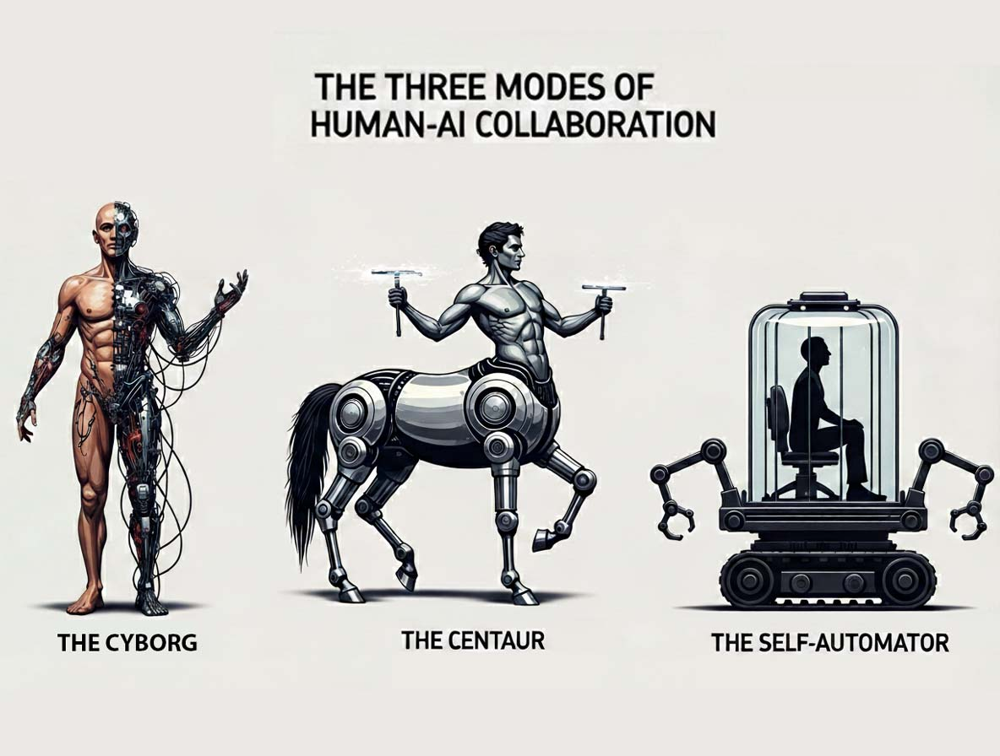
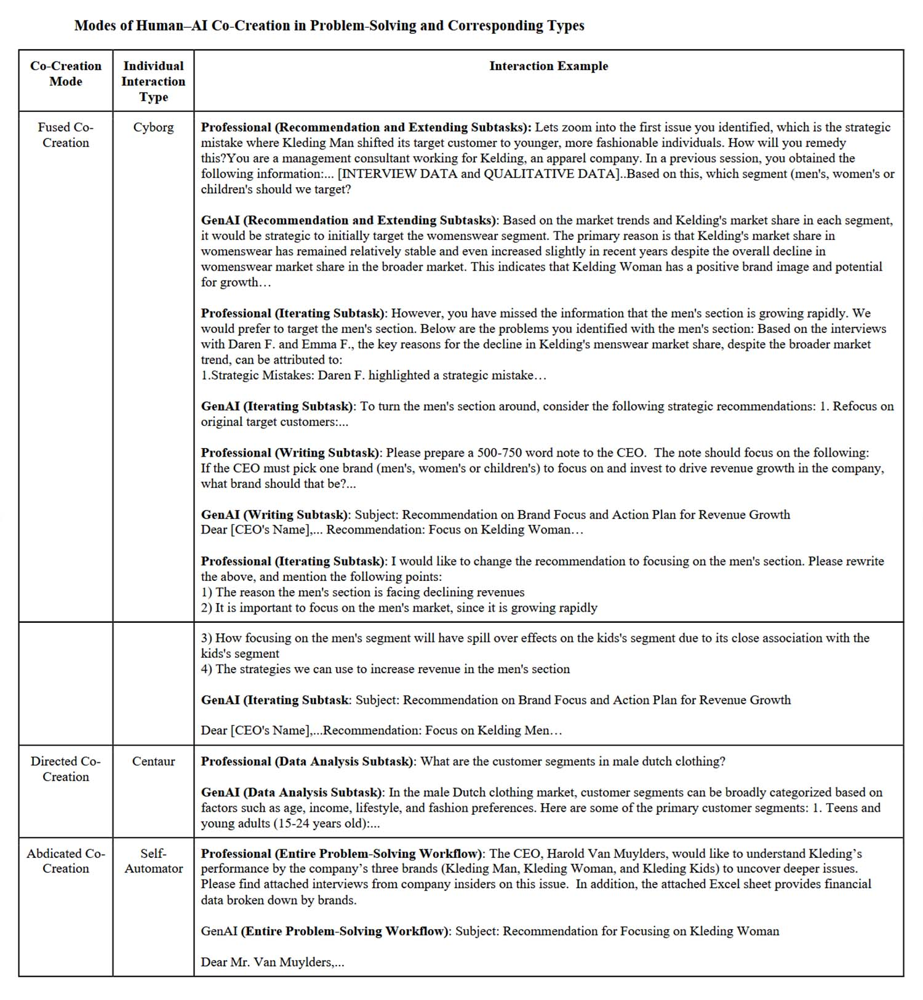

# Cyborgs, Zentauren oder Automaten: Wie du KI nutzt, verrät, wer du wirst

*Stellen Sie sich einen Berater der Boston Consulting Group vor, der für seinen strategischen Scharfsinn fürstlich bezahlt wird und der angesichts eines kritischen Geschäftsfalls das gesamte Problem in ChatGPT kopiert und einfügt und die Empfehlung der KI ohne eine einzige Frage annimmt. Die Antwort war falsch. Dennoch hat dieser Fachmann das Memo dem CEO ohne mit der Wimper zu zucken übergeben. Dies ist kein Einzelfall: In einer [Studie von Forschern aus Harvard und dem MIT](https://www.hbs.edu/ris/Publication%20Files/26-036_e7d0e59a-904c-49f1-b610-56eb2bdfe6f9.pdf) an 244 BCG-Beratern taten 27 % genau dies und delegierten ihr Denken vollständig an die Maschine.*

Der Widerspruch ist eklatant. Dies waren keine lustlosen Praktikanten, sondern qualifizierte Fachleute, die wussten, dass sie bewertet wurden. Sie hatten Zugang zum selben Werkzeug, denselben Daten, derselben Aufgabe. Dennoch zeigten sie drei völlig unterschiedliche Muster der Zusammenarbeit mit generativer künstlicher Intelligenz, mit radikal entgegengesetzten Folgen für ihre berufliche Entwicklung. Die Frage, die sich aus der Studie ergibt, ist nicht, ob man KI einsetzen soll, sondern wie. Und die Antwort auf dieses "Wie" zeichnet leise die Grenze zwischen menschlicher Expertise und maschineller Fähigkeit neu.

## Drei Stämme, ein Werkzeug

Das [Arbeitspapier](https://papers.ssrn.com/sol3/papers.cfm?abstract_id=4921696) von Steven Randazzo, Katherine Kellogg, Hila Lifshitz, François Candelon, Fabrizio Dell'Acqua, Ethan Mollick und Karim Lakhani trägt den Titel "Cyborgs, Centaurs and Self-Automators" und stellt eine natürliche Weiterentwicklung der Forschung dar, die 2023 das Konzept der "gezackten Grenze" der KI einführte. Diese erste Untersuchung hatte gezeigt, wie unregelmäßig die Fähigkeiten von GPT-4 waren, in manchen Aufgaben exzellent und in anderen überraschend fragil. Diese neue Studie geht darüber hinaus und verlagert den Fokus von dem, was KI tun kann, darauf, wie Menschen sich entscheiden, sie in ihren Arbeitsablauf zu integrieren.

Die Forscher bauten eine benutzerdefinierte Plattform auf der Grundlage von GPT-4, um jede einzelne Interaktion zu verfolgen: 4.975 Austausche zwischen Fachleuten und der Maschine, alle mit Zeitstempeln versehen. Die zugewiesene Aufgabe replizierte einen klassischen Fall strategischer Beratung: die Analyse von drei Bekleidungsmarken eines fiktiven Unternehmens und die Empfehlung, in welche man investieren sollte, um das Wachstum zu maximieren. Die Teilnehmer hatten Transkripte von Interviews mit Führungskräften, historische Finanzdaten, Marktinformationen. Dichtes, mehrdeutiges Material, genau wie in der Realität.

Was aus der Analyse der Interaktionsmuster hervorging, überraschte die Forscher selbst. Es gab nicht nur eine einzige Arbeitsweise mit generativer KI, sondern drei verschiedene Modi, die die Autoren mit evokativen Namen aus Mythologie und Science-Fiction tauften. 60 % der Berater verhielten sich wie "Cyborgs", die ihr eigenes Denken kontinuierlich mit dem der Maschine in einem engen, iterativen Dialog verschmolzen. 14 % agierten als "Zentauren", die die strategische Kontrolle fest in der Hand behielten und die KI selektiv für bestimmte Aufgaben einsetzten. Die restlichen 27 % verwandelten sich in "Selbst-Automatisierer", die der KI sowohl die Definition des Problems als auch dessen Ausführung anvertrauten.

Die Wahl des Namens Zentaur ist kein Zufall. Wie das mythologische Wesen, das menschliche Intelligenz und Pferdestärke vereint, aber getrennt hält, halten diese Fachleute ihre Kompetenzbereiche getrennt, entscheiden selbst, was zu tun ist und wie es zu tun ist, und delegieren nur umschriebene Aufgaben an die KI. Die Cyborgs hingegen arbeiten in einer kontinuierlichen Symbiose mit der Maschine, die eher an *Ghost in the Shell* als an Matrix erinnert, ohne klare Grenzen, wo das menschliche Denken aufhört und das algorithmische beginnt.

## Die gezackte Grenze der Expertise

Um wirklich zu verstehen, was diese drei Stämme unterscheidet, muss man sich die Details der Gespräche ansehen. Die Cyborgs entwickelten ein ausgeklügeltes Repertoire an interaktiven Praktiken. Sie weisen der Maschine eine Rolle zu, eine Persona: "Stellen Sie sich vor, Sie wären ein leitender Berater, der auf den Einzelhandel spezialisiert ist", um ihre Antworten zu lenken. Dann zerlegen sie komplexe Probleme in überschaubarere Teilaufgaben, was die Forscher "Modularisierung" nennen und was im Fachjargon als Chain-of-Thought-Prompting bekannt ist. Sie vertrauen nicht blind: Sie bitten die KI, ihre eigene Arbeit zu überprüfen, ihre Schlussfolgerungen zu rechtfertigen, und fordern sie heraus, wenn sie Widersprüche finden.

Ein konkretes Beispiel aus der Studie. Ein Berater erhält von GPT-4 die Empfehlung, in die Damenmarke zu investieren. Aber etwas stimmt nicht. Er fügt Marktdaten hinzu, die ein Wachstum von 72 % im Herrensegment zeigen, und fragt: "Ändert das Ihre Empfehlung?". Die KI bewertet neu und schlägt vor, auch die Herrenmarke in Betracht zu ziehen. Der Berater besteht darauf, weist auf Unstimmigkeiten bei den Wachstumsraten hin, drängt zurück. Nach mehreren Runden kommt die richtige Antwort zum Vorschein. Das ist keine einfache Nutzung der KI, das ist ein kognitiver Tanz.

Die Zentauren hingegen arbeiten radikal anders. Sie nutzen die KI hauptsächlich für drei Zwecke: um das Problemfeld zu kartieren, indem sie allgemeine Informationen wie "Was sind die wichtigsten Trends in der Herrenmode?" abfragen, um methodische Informationen wie "Wie lautet die Excel-Formel zur Berechnung des CAGR?" zu sammeln und um Inhalte zu verfeinern, die sie bereits selbst geschrieben haben. Ein Zentaur-Berater macht die Berechnungen selbst in Excel, nachdem er die Formel von der KI erfragt hat. Er schreibt seine Schlussfolgerungen und fragt dann: "Können Sie diesen Text auf Klarheit und Prägnanz überprüfen?". Die Kontrolle wird nie abgegeben.

Die Selbst-Automatisierer sind das andere Extrem. In einigen Fällen erledigten sie die gesamte Aufgabe mit einer oder zwei Interaktionen. Sie kopieren die gesamte Problembeschreibung, alle Interviews, alle Finanztabellen in einen einzigen Mammut-Prompt. GPT-4 antwortet mit Analysen, Empfehlungen, innovativen Strategien und einem Abschlussmemo. Sie akzeptieren, vielleicht mit ein paar oberflächlichen redaktionellen Änderungen: "Auf 400 Wörter kürzen" oder "Direkte Zitate entfernen". Ende. Keine Validierung, keine inhaltliche Iteration.

## Wer lernt was (und wer lernt nichts)

Die Auswirkungen auf die berufliche Entwicklung sind drastisch. Die Forscher identifizierten drei verschiedene Lerntrajektorien, die sie Upskilling, Newskilling und No Skilling nennen. Die Cyborgs entwickeln das, was die Studie als KI-bezogene Expertise bezeichnet, sie lernen, die Maschine mit zunehmender Präzision zu orchestrieren. Eine befragte Beraterin erzählt: "Früher habe ich eine Frage gestellt und die Antwort als Ausgangspunkt genommen. Jetzt weiß ich, dass ich weiter graben, Folgefragen stellen, tiefer bohren kann." Sie erwerben eine neue metakognitive Kompetenz, die Fähigkeit, effektiv mit generativen Systemen zusammenzuarbeiten.

Aber Vorsicht, die Cyborgs geben ihre Domänenexpertise nicht auf. Im Gegenteil, sie halten sie aktiv, gerade weil sie das, was die KI produziert, kontinuierlich bewerten, korrigieren und integrieren müssen. Wenn ein Cyborg einen sachlichen Widerspruch in der Ausgabe von GPT-4 aufdeckt, übt er sein berufliches Urteilsvermögen aus. Wenn er die KI bittet, nach Hinzufügung neuer Daten neu zu berechnen, leitet er die Analyse mit seinem Verständnis des Kontexts.

Die Zentauren hingegen entwickeln klassisches Upskilling, sie vertiefen ihre Kompetenz im spezifischen Fachgebiet. Ein Berater berichtet, dass er ChatGPT als "One-Stop-Service" nutzt, um das Lernen in neuen Branchen zu beschleunigen, indem er Beispiele von Unternehmen anfordert, die ähnliche Herausforderungen gemeistert haben, konkrete Fälle studiert und die KI als eine erweiterte Version von Google nutzt, die Informationen nicht nur findet, sondern auch zusammenfasst und kontextualisiert. Ihre Beziehung zur Maschine ist instrumentell, ein Mittel, um in ihrer Arbeit besser zu werden, nicht um sie zu verändern.

Die Selbst-Automatisierer sind jedoch die beunruhigendste Geschichte. Die Studie ist lapidar: "No Skilling", keine Entwicklung von KI-Kompetenzen oder Domänenkompetenzen. Der minimale Informationsaustausch, das Fehlen von Iteration, die totale Delegation der Entscheidungsfindung führen zu beruflicher Stagnation. Wie Melvilles Bartleby der Schreiber, der nur antwortet "Ich würde lieber nicht", zogen es diese Fachleute vor, nicht zu denken und delegierten sogar den Lernprozess, der aus kognitiver Anstrengung resultiert, an die Maschine.

[Bild von hbs.edu](https://www.hbs.edu/ris/Publication%20Files/26-036_e7d0e59a-904c-49f1-b610-56eb2bdfe6f9.pdf)

## Die Fallen der totalen Delegation

Es gibt ein kontraintuitives Element in den Ergebnissen zur Qualität der Ergebnisse. Die Zentauren produzierten die genauesten Empfehlungen und übertrafen sowohl die Cyborgs als auch die Selbst-Automatisierer. Dies wirft tiefgreifende Fragen über die Beziehung zwischen intensiver Zusammenarbeit und Leistung auf. Warum erzielen die Cyborgs, die doch kontinuierlich mit der KI interagieren, nicht die besten Ergebnisse?

Die Antwort liegt in dem, was [Ethan Mollick](https://www.oneusefulthing.org/p/centaurs-and-cyborgs-on-the-jagged) das Problem der "gezackten Grenze" nennt. Die Fähigkeiten von GPT-4 sind in manchen Aufgaben exzellent, in anderen aber fragil, und die Grenzen sind unvorhersehbar. Die Cyborgs, die in ständiger Symbiose arbeiten, laufen Gefahr, der Maschine zu sehr zu vertrauen, auch wenn diese außerhalb ihres Stärkebereichs operiert. Ein Cyborg-Berater in der Studie wendet die Praxis der "Validierung" an und bittet die KI ausdrücklich, ihre eigene Arbeit zu überprüfen. GPT-4 bestätigt die falsche Empfehlung mit plausiblen Argumenten. Der Berater, überzeugt von der scheinbaren logischen Kohärenz, akzeptiert. Er hat eine bewährte Methode angewendet, aber die Maschine hat ihn trotzdem getäuscht.

Die Zentauren vermeiden diese Falle, weil sie ihre kritische Linse immer aktiv halten. Sie bitten die KI nie, strategische Entscheidungen zu treffen, sondern nur, ihre Analyse zu unterstützen. Wenn ein Zentaur fragt: "Wie kann ich den Preis neu positionieren, um eine jüngere männliche Zielgruppe anzusprechen?", sucht er nach Anregungen, nicht nach endgültigen Antworten. Das endgültige Urteil bleibt menschlich.

Die Selbst-Automatisierer hingegen stellen das offensichtlichste Risiko dar, die Erosion der Expertise durch Nichtgebrauch. Wie Muskeln, die ohne Training verkümmern, verschlechtern sich die Fähigkeiten zur Problemlösung, wenn sie systematisch delegiert werden. Und hier zeigt sich ein besorgniserregendes Muster aus der Studie. Viele Selbst-Automatisierer äußerten in den Interviews volles Vertrauen in die KI. Einer sagt: "Ich habe einen kurzen Plausibilitätscheck gemacht, um zu überprüfen, ob die Daten und die Empfehlung nicht zu weit von der Realität entfernt sind." Ein anderer gibt offen zu: "Ich war ehrlich gesagt faul. Ich wollte keine 500 Wörter schreiben, ich wollte, dass GenAI sie produziert."

Kognitive Faulheit, getarnt als Effizienz, ist vielleicht das alarmierendste Signal. Denn dies waren Fachleute, die wussten, dass sie bewertet wurden, die einen expliziten Anreiz hatten, gut zu leisten. Was wird passieren, wenn die tägliche Nutzung der KI nicht nachverfolgt wird, wenn der einzige Druck darin besteht, eine Lieferung schnell abzuschließen?

## Welcher KI-Nutzer sind Sie?

Die Studie wirft Fragen auf, die weit über den konkreten Fall der Beratung hinausgehen. Wenn drei so unterschiedliche Modi spontan in einer homogenen Gruppe qualifizierter Fachleute entstehen, die sich derselben Aufgabe stellen, was wird dann passieren, wenn die generative KI in Berufe mit unterschiedlichen epistemischen Dynamiken eindringt? Ein Anwalt, der eine rechtliche Argumentation aufbauen muss, ein Arzt, der eine Differentialdiagnose stellen muss, ein Architekt, der Ästhetik und strukturelle Zwänge ausbalancieren muss – jeder von ihnen könnte einzigartige Varianten dieser Muster entwickeln.

Die Forscher sind vorsichtig, die Ergebnisse zu sehr zu verallgemeinern. Die Studie erfasste eine Momentaufnahme einer einzigen Sitzung mit GPT-4 vom April 2023, einem Modell, das heute bereits veraltet ist. Wir wissen nicht, wie sich diese Muster im Laufe der Zeit entwickeln, ob jemand, der als Selbst-Automatisierer beginnt, mit Erfahrung zum Cyborg werden kann oder ob umgekehrt eine längere Nutzung unweigerlich aus Bequemlichkeit zur Automatisierung führt. Und es gibt ein Quadrant ihres theoretischen Rahmens, der empirisch leer geblieben ist, der, in dem die KI auswählt, was zu tun ist, der Mensch aber ausführt. Vielleicht ist diese Konfiguration einfach instabil, vielleicht stellt sie eine noch zu erforschende Zukunft dar.

Dann gibt es noch das Thema der agentischen KIs, Systeme, die nicht auf Prompts warten, sondern autonom handeln, um komplexe Arbeitsabläufe abzuschließen. Wenn die KI nicht mehr ein Gesprächspartner, sondern ein proaktiver Agent ist, könnten die drei von der Studie identifizierten Modi zusammenbrechen oder sich in etwas radikal anderes verwandeln. Die Unterscheidung zwischen Cyborg und Selbst-Automatisierer hat nur so lange einen Sinn, wie es eine interaktive Schleife gibt, die man aufrechterhalten oder aufgeben kann.

Die organisatorischen Implikationen sind ebenso tiefgreifend. Wenn Zentauren die genauesten Ergebnisse produzieren, Cyborgs aber neue KI-Kompetenzen entwickeln, welchen Modus sollte ein Unternehmen fördern? Die Antwort hängt von den strategischen Zielen ab. Eine Organisation, die auf die unmittelbare Qualität der Dienstleistung ausgerichtet ist, wird Zentauren bevorzugen. Eine, die darauf abzielt, interne KI-Orchestrierungsfähigkeiten aufzubauen, wird in Cyborgs investieren. Und die Selbst-Automatisierer? Die Studie legt nahe, dass eine vollständige Automatisierung bei Routineaufgaben oder bei Zeitdruck sinnvoll ist, aber die Risiken der Dequalifizierung müssen im Kontext sorgfältig abgewogen werden.

Sicher ist, dass wir "den Einsatz von KI" nicht mehr als monolithische Kategorie betrachten können. Die relevante Frage für die Zukunft der kognitiven Arbeit lautet nicht "nutzen Sie KI?", sondern "wie nutzen Sie sie?". Und diese oft unbewusste Wahl schreibt bereits das Drehbuch dafür, wer Sie in den kommenden Jahren beruflich werden. Sind Sie ein Cyborg, der lernt, mit der Maschine zu tanzen, ein Zentaur, der die Kontrolle fest in der Hand behält, oder ein Selbst-Automatisierer, der es vorzieht, zu delegieren? Die Antwort kann von Aufgabe zu Aufgabe, von Tag zu Tag unterschiedlich sein. Aber das Muster zu erkennen, ist der erste Schritt, um es bewusst zu wählen, anstatt es zu erleiden.
