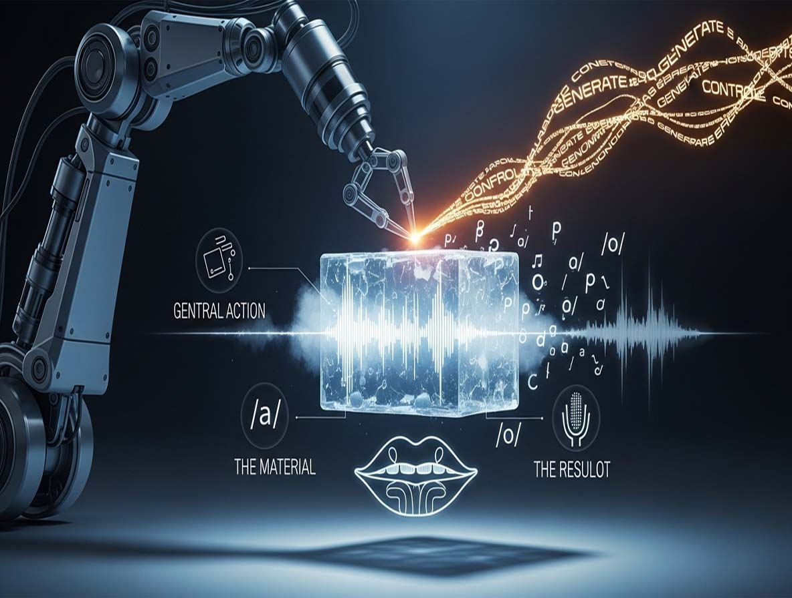
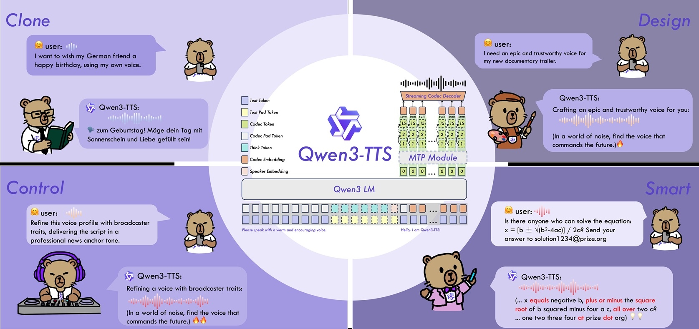
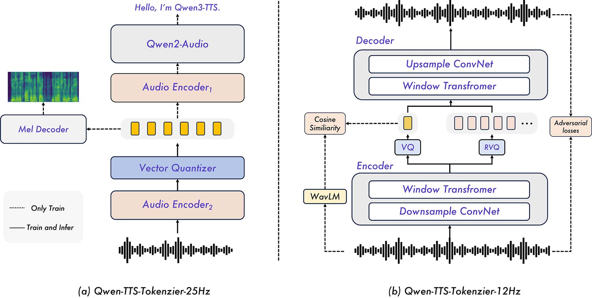

# Qwen3-TTS: Die synthetische Stimme aus der technologischen Belagerung

*Als [Alibaba Mitte Januar 2026 Qwen3-TTS veröffentlichte](https://arxiv.org/html/2601.15621v1), erkannten nur wenige das zugrunde liegende Paradoxon. Während Washington den Würgegriff auf die Exporte fortschrittlicher Chips nach China weiter verschärfte, präsentierte das Qwen-Team der Welt ein Open-Source-Text-to-Speech-Modell, das in der Lage ist, Stimmen mit nur drei Sekunden Audio zu klonen, Sprache in zehn Sprachen zu erzeugen und auf Consumer-Hardware zu laufen. Wir sprechen hier nicht von einer behelfsmäßigen Lösung: Benchmarks zeigen, dass Qwen3-TTS auf Datensätzen wie [Seed-TTS und InstructTTSEval](https://github.com/QwenLM/Qwen3-TTS) eine hochmoderne Leistung erzielt und Konkurrenten wie F5-TTS und Spark-TTS übertrifft oder ebenbürtig ist. Es ist der praktische Beweis dafür, wie Einschränkungen zu Katalysatoren für radikale architektonische Innovationen werden können, die chinesische Forscher zwingen, die Art und Weise, wie wir stimmliche künstliche Intelligenzen bauen, von Grund auf zu überdenken.*

Die erste Besonderheit von Qwen3-TTS ergibt sich aus seiner Architektur. Wo traditionelle Systeme separate Module verketten, um Text zu verstehen, akustische Darstellungen zu erzeugen und das endgültige Audio zu synthetisieren, verfolgt dieses Modell einen Ansatz, den das Alibaba-Team als "Dual-Track LM" für die Echtzeitsynthese bezeichnet. In der Praxis verarbeitet das System gleichzeitig zwei Informationsströme durch Tokenizer, die mit unterschiedlichen Frequenzen arbeiten: einer mit fünfundzwanzig Hertz, um den semantischen Inhalt zu erhalten, der andere mit zwölf Hertz für extreme Bitratenkompression und ultraschnelle Streaming-Generierung. Letzterer, der [Qwen-TTS-Tokenizer-12Hz](https://arxiv.org/html/2601.15621v1), verwendet ein Multi-Codebook-Design mit sechzehn Schichten, das rekordverdächtige Latenzen verspricht: siebenundneunzig Millisekunden, um das erste Audiopaket auszugeben, eine Zeit, die kürzer ist als die, die man braucht, um das Wort "Hallo" auszusprechen.

Das Training erforderte über fünf Millionen Stunden an Sprachdaten, die auf zehn Sprachen verteilt waren, von Chinesisch über Deutsch bis hin zu Japanisch, Koreanisch, Russisch, Portugiesisch, Spanisch, Französisch und Italienisch. Dabei geht es nicht nur um das Volumen: Der Datensatz umfasst dialektale Variationen, vielfältige emotionale Register und heterogene akustische Kontexte, die es dem Modell ermöglichen, nicht nur zu lernen, was es sagen soll, sondern wie es dies auf eine Weise tun kann, die auch dann natürlich klingt, wenn eine Stimme geklont wird, die nur drei Sekunden lang gehört wurde. Die Zahlen sprechen für sich: Auf [LibriSpeech test-clean](https://github.com/QwenLM/Qwen3-TTS) erreicht der Tokenizer eine Wortfehlerrate (WER) von 3,07 % im Englischen und 4,23 % im Chinesischen, eine Leistung, die frühere Tokenizer wie den S3-Tokenizer um über fünfzig Prozent übertrifft.

## Die Bewährungsprobe der Zahlen

Bei der Bewertung eines Text-to-Speech-Systems ist die wirklich wichtige Kennzahl die Wortfehlerrate: wie oft das Modell bei der Wiedergabe des Originaltextes Fehler macht. Qwen3-TTS verzeichnet einen [WER von 1,24 % im englischen Test von Seed-TTS](https://github.com/QwenLM/Qwen3-TTS) und positioniert sich damit unter den besten verfügbaren Systemen. Aber erst bei der Generierung von langen Inhalten zeigt das Modell seine Stärke: Die CustomVoice-Variante mit 1,7 Milliarden Parametern erreicht einen WER von nur 1,517 % im Chinesischen und 1,225 % im Englischen bei Audios, die länger als zehn Minuten sind, und übertrifft damit Konkurrenten wie Higgs-Audio-v2 und VoxCPM, die drei- oder viermal höhere Fehler aufweisen.

Die Stimmqualität, gemessen durch den Mean Opinion Score in subjektiven Hörtests, liegt auf einem wettbewerbsfähigen Niveau im Vergleich zu [ElevenLabs](https://elevenlabs.io), das nach wie vor der kommerzielle Maßstab für Realismus und emotionale Ausdruckskraft ist. Wo Qwen3-TTS wirklich glänzt, ist seine Vielseitigkeit: Es unterstützt nicht nur das Zero-Shot-Stimmenklonen, sondern auch die Erstellung völlig neuer Stimmen durch textuelle Beschreibungen in natürlicher Sprache. Wollen Sie eine ältere Männerstimme mit Sichuan-Akzent? Das Modell erzeugt sie. Benötigen Sie eine Erzählung in britischem Englisch mit neutralem Ton und langsamer Kadenz? Geben Sie es einfach in den Anweisungen an.

Der Vergleich mit den Hauptakteuren des Marktes zeigt interessante Dynamiken. ElevenLabs, im [Januar 2025 mit 3,3 Milliarden Dollar bewertet](https://www.mvp.vc/company-initations/elevenlabs), erwirtschaftet geschätzte Einnahmen von rund zweihundert Millionen Dollar pro Jahr und behält die Führung in der hochpräzisen emotionalen Synthese, die besonders für Hörbücher und Synchronisationen geschätzt wird. Google Cloud TTS, Amazon Polly und Microsoft Azure bieten konsolidierte Unternehmenslösungen mit wettbewerbsfähigen Latenzen und vorteilhaften Pay-per-Use-Preisen für hohe Volumina. Qwen3-TTS tritt in diese Landschaft mit einem anderen Wertversprechen ein: Apache 2.0-Lizenz, lokal herunterladbare Modelle und die Möglichkeit des Fine-Tunings ohne kommerzielle Einschränkungen. Das ist der Unterschied zwischen dem Mieten eines Dienstes und dem Besitz der Infrastruktur.

[Bild von arxiv.org](https://arxiv.org/html/2601.15621v1)

## Consumer-Hardware, Enterprise-Ambitionen

Hier zeigt sich die zweite strategische Anomalie. Während große Sprachmodelle Cluster von Enterprise-GPUs für die Inferenz benötigen, ist Qwen3-TTS so konzipiert, dass es auf Consumer-Grafikkarten läuft. Die Variante mit 1,7 Milliarden Parametern läuft flüssig auf einer [NVIDIA RTX 4060](https://colab.research.google.com/drive/1Vv99jmgfzu-pHwpkLawWY8iIpb5FBwru?usp=sharing) mit sechzehn Gigabyte VRAM, einer Hardware, die im Einzelhandel weniger als vierhundert Euro kostet. Das leichtere Modell mit 0,6 Milliarden Parametern funktioniert sogar auf bescheideneren Konfigurationen, wenn auch mit Kompromissen bei Qualität und Generierungsgeschwindigkeit.

Für diejenigen, die ohne Hardware-Investitionen experimentieren möchten, ermöglichen [die offiziellen Colab-Notebooks](https://colab.research.google.com/drive/1JUYT9xAistnOwMOtIPTP-E-upo4te8Qj?usp=sharing) das kostenlose Testen des Systems über virtuelle T4- oder V100-GPUs. Die lokale Installation erfordert Python mit PyTorch, einige zusätzliche Abhängigkeiten und das Herunterladen der Modellgewichte von Hugging Face, ein Vorgang, der für die vollständige Variante etwa sechs Gigabyte Festplattenspeicher beansprucht. Wer über leistungsfähigere Hardware verfügt, kann die Leistung steigern: Auf einer Enterprise-A100 sinkt der Real-Time-Factor unter 0,1, was bedeutet, dass das System zehn Sekunden Audio in nur einer Sekunde Verarbeitung erzeugt.

Diese Hardware-Zugänglichkeit ist kein Zufall, sondern das Ergebnis präziser architektonischer Entscheidungen. Anstatt sich wie viele Konkurrenten auf schwere Diffusion Transformers zu verlassen, verwendet Qwen3-TTS ein leichtes kausales ConvNet für die Audio-Dekodierung, was die Rechenanforderungen drastisch reduziert, ohne die Qualität übermäßig zu beeinträchtigen. Es ist ein Ansatz, der an [DeepSeek](https://aitalk.it/it/deepseek-mhc.html) mit seiner Mixture of Experts erinnert: Maximierung der Recheneffizienz durch intelligentes Design statt roher Gewalt.

## Von der Sprachsynthese zur digitalen Identität

Die praktischen Anwendungen eines so vielseitigen Text-to-Speech-Systems erstrecken sich über verschiedene Sektoren. Die Hörbuchindustrie erforscht bereits den Einsatz dieser Modelle für schnelle mehrsprachige Produktionen: Ein einzelner Sprecher kann geklont und in zehn verschiedenen Sprachen sprechen lassen, wobei Klangfarbe und metrische Eigenschaften des Originals erhalten bleiben. Verlage sparen Kosten für Aufnahme und Lokalisierung und beschleunigen die Markteinführung globaler Inhalte drastisch.

Im Gaming ermöglicht die prozedurale Sprachsynthese die Generierung dynamischer Dialoge für NPCs, ohne Tausende von Stunden an Sprachaufnahmen vorab aufzeichnen zu müssen. Komplexe narrative Spiele, wie sie Studios wie Obsidian oder Larian berühmt gemacht haben, könnten von Systemen profitieren, die kontextbezogene Sätze im laufenden Betrieb generieren und auf die Entscheidungen des Spielers mit kohärenten und natürlichen Stimmen reagieren. Ist das noch Science-Fiction? Vielleicht, aber die technischen Grundlagen sind langsam vorhanden.

Das Gesundheitswesen stellt eine weitere vielversprechende Front dar. Virtuelle Assistenten mit realistischen synthetischen Stimmen können ältere Patienten oder solche mit kognitiven Behinderungen unterstützen, indem sie an Therapien erinnern, als Gesprächspartner dienen oder medizinische Inhalte vorlesen. Die Möglichkeit, die Klangfarbe vollständig anzupassen, ermöglicht die Schaffung empathischerer und weniger befremdlicher Erfahrungen als bei herkömmlichen Roboterstimmen.

Auf der Creator-Seite demokratisiert die Integration mit [ComfyUI](https://github.com/QwenLM/Qwen3-TTS?tab=readme-ov-file#custom-voice-generate) und Hugging Face Spaces den Zugang zur Technologie. Content-Ersteller ohne technische Kenntnisse können professionelle Voice-Over für YouTube-Videos, Podcasts oder soziale Inhalte erstellen, indem sie einfach eine drei Sekunden lange Sprachprobe hochladen und den zu synthetisierenden Text eingeben. Die Eintrittsbarriere fällt und verwandelt eine Fähigkeit, die früher teuren Produktionsstudios vorbehalten war, in eine Ware, die über eine Weboberfläche verfügbar ist.

## Innovation unter Belagerung

Es ist jedoch der geopolitische Kontext, der Qwen3-TTS besonders bedeutsam macht. Die Vereinigten Staaten haben die Exportkontrollen für fortschrittliche Halbleiter nach China schrittweise verschärft und den [Zugang zu Enterprise-GPUs](https://www.cfr.org/article/chinas-ai-chip-deficit-why-huawei-cant-catch-nvidia-and-us-export-controls-should-remain) wie NVIDIA H100 und A100 blockiert. Das erklärte Ziel ist es, die militärische Entwicklung Chinas im Bereich der künstlichen Intelligenz zu verlangsamen, aber der Nebeneffekt war, dass die gesamte chinesische Technologiebranche gezwungen war, ihre Forschungs- und Entwicklungsstrategien zu überdenken.

Wie ich bereits in Bezug auf [DeepSeek und seine Mixture-of-Experts-Architektur](https://aitalk.it/it/deepseek-mhc.html) analysiert habe, war die chinesische Antwort nicht Kapitulation, sondern Innovation durch Effizienz. Wenn man nicht die leistungsstärksten Chips haben kann, muss man Modelle bauen, die mit unterlegener Hardware vergleichbare Ergebnisse erzielen. Dieser Ansatz hat zu architektonischen Durchbrüchen geführt, die sich paradoxerweise langfristig als nachhaltiger und skalierbarer erweisen könnten als die westliche Strategie, die auf immer größeren Clustern basiert.

[Qwen3 als Ganzes](https://aitalk.it/it/alibaba-qwen3.html) repräsentiert diese Philosophie systematisch angewendet: multimodale Sprachmodelle, die auf Consumer-Hardware laufen und eine wettbewerbsfähige Leistung mit den besten amerikanischen Systemen erzielen, während sie nur einen Bruchteil der Rechenressourcen verbrauchen. Qwen3-TTS setzt diese Tradition im Stimmbereich fort und beweist, dass es möglich ist, hochmoderne Sprachsynthese zu erreichen, ohne Zugang zu Rechenzentren mit Tausenden von Spitzen-GPUs zu haben.

Die Strategie erinnert an die, die auch von anderen Akteuren der chinesischen und europäischen KI-Landschaft verfolgt wird. [Mistral AI](https://aitalk.it/it/mistral-devstral.html) hat, obwohl es in einem anderen regulatorischen Kontext operiert, ebenfalls auf Effizienz und Optimierung gesetzt und bewiesen, dass kleinere, aber besser konzipierte Modelle mit viel teureren Giganten konkurrieren können. Es ist ein sich wiederholendes Muster: Angesichts von Ressourcenbeschränkungen findet die menschliche Intelligenz alternative Wege, die sich oft als überlegen gegenüber dem Brute-Force-Ansatz erweisen.

Die Daten bestätigen diesen Trend. Laut Zeugenaussagen vor dem US-Kongress wird [Huawei im Jahr 2025 etwa zweihunderttausend KI-Chips produzieren](https://www.cfr.org/article/chinas-ai-chip-deficit-why-huawei-cant-catch-nvidia-and-us-export-controls-should-remain), eine winzige Zahl im Vergleich zu den Millionen, die NVIDIA ausstößt. Dennoch zeigen Modelle wie DeepSeek-R1 oder eben Qwen3-TTS technische Fähigkeiten, die diese Hardware-Disparität nicht widerspiegeln. Die Erklärung liegt in der algorithmischen Effizienz: Wenn man weniger Ressourcen hat, muss man sie besser nutzen.

[Bild von arxiv.org](https://arxiv.org/html/2601.15621v1)

## Die Schatten einer perfekten Stimme

Jede Technologie birgt Risiken, die ihrer Macht proportional sind. Die Fähigkeit, Stimmen mit nur drei Sekunden Audio zu klonen, eröffnet beunruhigende Szenarien im Bereich der stimmlichen Deepfakes. Telefonbetrug mit der Stimme von Familienmitgliedern, politische Desinformation durch gefälschte Audioaufnahmen von Persönlichkeiten des öffentlichen Lebens, Erpressung auf der Grundlage gefälschter Aufnahmen: Die kriminellen Anwendungen sind unmittelbar und besorgniserregend.

Die Europäische Union hat versucht, diese Risiken durch das KI-Gesetz zu regulieren, das Transparenz und Rückverfolgbarkeit für künstlich erzeugte Inhalte fordert. Die Durchsetzung bleibt jedoch problematisch, wenn die Modelle Open Source und lokal herunterladbar sind. Sobald Qwen3-TTS auf Ihrem Computer ist, kann keine Unternehmensrichtlinie seine böswillige Nutzung verhindern. Alibaba fügt ethische Warnungen in die Dokumentation ein und empfiehlt die Verwendung von Audio-Wasserzeichen zur Identifizierung synthetischer Inhalte, aber dies sind zerbrechliche Barrieren gegen entschlossene Benutzer.

Sprachliche und kulturelle Vorurteile stellen eine weitere Grauzone dar. Das Modell wurde hauptsächlich mit chinesischen und englischen Daten trainiert, wobei die anderen acht unterstützten Sprachen in geringerem Maße berücksichtigt wurden. Dieses Ungleichgewicht führt zu ungleicher Leistung: Chinesisch klingt einwandfrei, Englisch sehr gut, aber laut einigen Nutzern gelegentlich mit "anime-ähnlichen" Nuancen, während Sprachen wie Deutsch oder Spanisch laut [Community-Tests](https://dev.to/czmilo/qwen3-tts-the-complete-2026-guide-to-open-source-voice-cloning-and-ai-speech-generation-1in6) eine geringere Qualität aufweisen. Für Deutsch, eine Sprache mit einer großen Anzahl von Muttersprachlern, ist die Abdeckung im Datensatz wahrscheinlich signifikant, wirft aber dennoch Fragen zur globalen Repräsentativität dieser Systeme auf.

Der Schutz der Privatsphäre der Stimme wird zu einem zentralen Thema. Die Stimme ist ein biometrisches Merkmal, das ebenso identifizierend ist wie Fingerabdrücke. Systeme, die ein leicht zugängliches Klonen von Stimmen ermöglichen, erfordern rechtliche Rahmenbedingungen zum Schutz der stimmlichen Identität von Einzelpersonen. Ist eine ausdrückliche Zustimmung zum Klonen einer Stimme erforderlich? Wer besitzt die Rechte an einer synthetischen Stimme, die aus echten Proben abgeleitet wurde? Die Gesetzgebung hat Mühe, mit der Technologie Schritt zu halten.

## Offene Märkte, geschlossene Strategien

Der Text-to-Speech-Markt befindet sich in einer Phase schnellen Wachstums. Branchenschätzungen bewerten den globalen TTS-Markt bis [2028 auf rund sieben Milliarden Dollar](https://droidcrunch.com/elevenlabs-review/), mit einem jährlichen Wachstum von 14,4 %. ElevenLabs, der dominierende Akteur im Premium-Segment, hat einen [Jahresumsatz von zweihundert Millionen Dollar](https://www.mvp.vc/company-initations/elevenlabs) erreicht und strebt bis Ende 2026 eine Bewertung von über sechs Milliarden an, angetrieben durch strategische Investitionen der Deutschen Telekom, LG Technology Ventures und anderer Unternehmensriesen.

Aber die Wettbewerbsdynamik ändert sich. Open Source, traditionell als Nischensektor für Enthusiasten und Forscher angesehen, untergräbt die Positionen der proprietären Anbieter. Wenn Modelle wie Qwen3-TTS achtzig Prozent der Fähigkeiten kommerzieller Lösungen kostenlos und mit voller Anpassungsfreiheit bieten, müssen Unternehmen ihre Wertversprechen neu kalibrieren. ElevenLabs behält den Vorteil bei der feinkörnigen emotionalen Ausdruckskraft und dem Support auf Unternehmensebene, aber für Anwendungen, die nicht die absolut höchste Qualität erfordern, werden Open-Source-Alternativen immer attraktiver.

Google, Amazon und Microsoft dominieren das Segment API-as-a-Service über ihre Cloud-Plattformen und profitieren von Skaleneffekten und nativen Integrationen mit anderen Unternehmensdiensten. Aber auch sie beobachten nervös den Vormarsch von Open Source. Wenn ein Startup Qwen3-TTS lokal ohne Lizenzgebühren oder Nutzungsbeschränkungen bereitstellen kann, warum sollte es für externe APIs bezahlen? Die Antwort liegt in Bequemlichkeit, Zuverlässigkeit und professionellem Support, aber die wirtschaftliche Kalkulation wird komplexer.

Das Ökosystem fragmentiert sich geografisch. Chinesische Unternehmen übernehmen natürlich Qwen-Lösungen aus Gründen der technologischen Souveränität und des privilegierten sprachlichen Zugangs. Europäische Kunden navigieren zwischen DSGVO-Konformität und Präferenzen für lokale Anbieter wie das in Frankreich ansässige Unternehmen Eleven Labs oder intern hostbare Open-Source-Lösungen. Der amerikanische Markt bleibt die Domäne heimischer Akteure, sowohl aus Trägheit als auch aufgrund zunehmender regulatorischer Beschränkungen für chinesische Technologien.

## Noch offene Fragen

Die Zukunft von Qwen3-TTS wirft sowohl technische als auch strategische Fragen auf. Die Roadmap des Qwen-Teams zielt auf immer stärker integrierte multimodale Modelle ab, bei denen Text-to-Speech mit Speech-to-Text, maschineller Übersetzung und kontextuellem Verständnis in End-to-End-Systemen konvergiert. Werden wir Varianten sehen, die Video-to-Speech verarbeiten und Lippenbewegungen und Audio synchronisieren? Unterstützt die aktuelle Architektur diese Erweiterungen?

Die Skalierung über 1,7 Milliarden Parameter hinaus stellt eine weitere Grenze dar. Größere Modelle könnten subtilere emotionale und metrische Nuancen erfassen, aber zu welchem Rechenaufwand? Der Effizienz-Qualitäts-Kompromiss, der die Entwicklung von Qwen bisher geleitet hat, könnte an seine Grenzen stoßen und weitere architektonische Durchbrüche erfordern.

Der Energieverbrauch und die Umweltauswirkungen von Stimm-KI verdienen Aufmerksamkeit. Selbst relativ leichte Modelle wie Qwen3-TTS, die auf Millionen von Geräten eingesetzt werden, um täglich Stunden an Audio zu erzeugen, tragen zum CO2-Fußabdruck des Technologiesektors bei. Es bedarf einer größeren Transparenz bei den Energieeffizienzkennzahlen und bewährten Verfahren für eine nachhaltige Bereitstellung.

Für Deutschland und Europa sind die Herausforderungen sowohl technischer als auch regulatorischer Natur. Die deutsche Sprache erhält in diesen globalen Datensätzen eine gute Abdeckung, läuft aber Gefahr, in zukünftigen kommerziellen Anwendungen an den Rand gedrängt zu werden. Öffentliche Investitionen in hochwertige, offene und zugängliche deutsche Sprachkorpora könnten diese Lücke schließen. Auf regulatorischer Seite muss das europäische KI-Gesetz ein Gleichgewicht zwischen dem Schutz der Bürger und der Nicht-Erstickung von Innovationen finden und vermeiden, dass übermäßig strenge Anforderungen die besten Talente in freizügigere Rechtsordnungen treiben.

Die tiefgreifendste Frage betrifft die allgemeine Richtung der KI-Forschung. Das amerikanische Technologieembargo erzwingt unbeabsichtigt einen alternativen Entwicklungspfad, der sich auf Effizienz und Einfallsreichtum statt auf rohe Gewalt konzentriert. Wenn sich dieser Ansatz langfristig als überlegen erweist, werden wir eines der spektakulärsten strategischen Eigentore in der Geschichte der Technologie erlebt haben. Wenn jedoch die Hardware-Beschränkungen am Ende die Oberhand gewinnen und die chinesischen Fähigkeiten unter denen des Westens begrenzen, werden die Exportkontrollen ihr Ziel erreicht haben. Nur die Zeit wird zeigen, welche Erzählung sich durchsetzen wird, aber in der Zwischenzeit verschieben Modelle wie Qwen3-TTS weiterhin die Grenzen des Möglichen und beweisen, dass Innovation immer einen Weg findet, wenn talentierte Menschen entschlossen sind, ihn zu finden.
