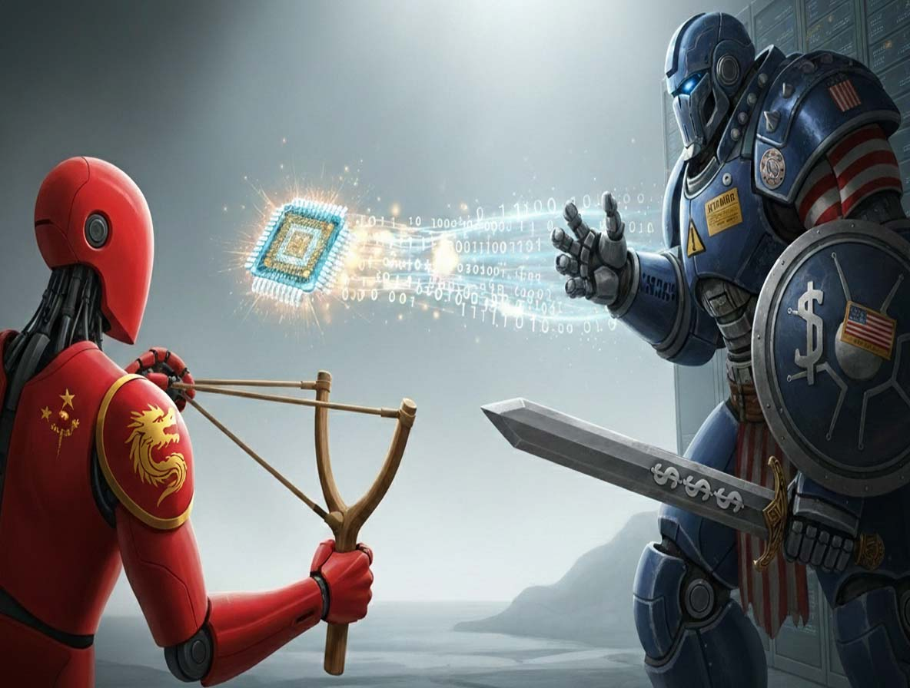
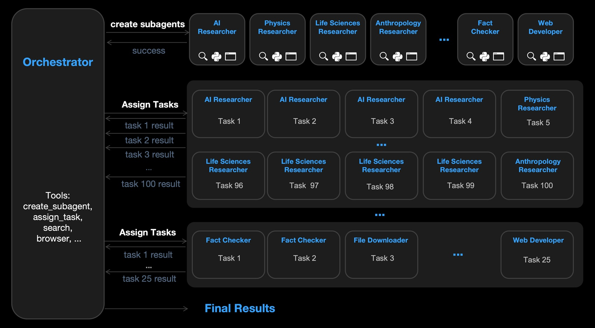
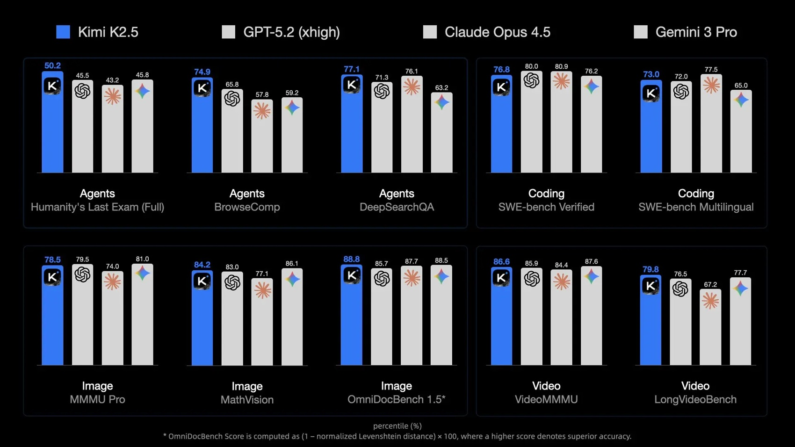
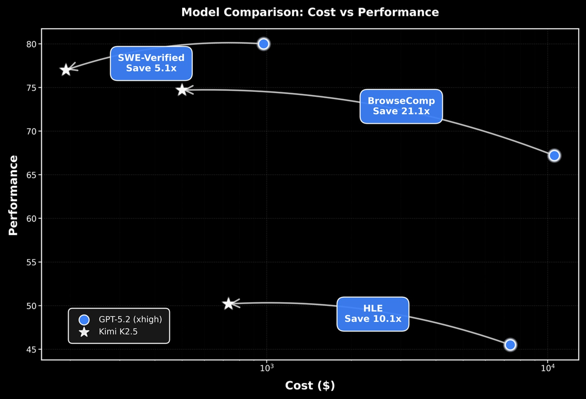

# Kimi K2.5 y la larga marcha china en la IA: cuando el embargo se convierte en un trampolín

*Hay un momento, en toda partida de ajedrez de alto nivel, en el que uno se da cuenta de que el jugador bajo presión no está tratando de defenderse: está construyendo un contraataque. Algo parecido está ocurriendo en el gran juego geopolítico de la inteligencia artificial, y el lanzamiento de Kimi K2.5 por parte de Moonshot AI no es un comunicado de prensa más que hojear distraídamente. Es otro capítulo de una historia que vale la pena seguir con atención, como en el análisis anterior sobre [Qwen3-TTS](https://aitalk.it/it/qwen3-tts.html) y la generación de voz sintética, porque narra y confirma cómo las restricciones de hardware impuestas por Estados Unidos a China están produciendo exactamente el efecto contrario al esperado: en lugar de frenar la innovación china, la están acelerando por trayectorias imprevistas.*

Ya habíamos hablado de ello al analizar [DeepSeek y su arquitectura MHC](https://aitalk.it/it/deepseek-mhc.html), y antes con [Kimi K2 Thinking](https://aitalk.it/it/kimi-k2-thinking.html). Hoy volvemos sobre el tema no para perseguir la expectación del último modelo lanzado, sino porque cada lanzamiento añade una pieza a un mosaico que está redibujando los equilibrios globales de la IA. Y Kimi K2.5, con su billón de parámetros organizados en una arquitectura de Mezcla de Expertos (MoE) profundamente optimizada, representa un salto cualitativo que merece más que un vistazo distraído en Hacker News.

## Otro lanzamiento que sí importa

Empecemos por los números, porque en la IA los números cuentan historias. [Kimi K2.5](https://platform.moonshot.ai/docs/guide/kimi-k2-5-quickstart) es un monstruo de un billón de parámetros en total, pero gracias a la arquitectura MoE solo activa treinta y dos mil millones por cada token generado. Es como tener una biblioteca inmensa donde, en lugar de hojear todos los volúmenes cada vez, seleccionas automáticamente las ocho estanterías más relevantes de las trescientas ochenta disponibles, más una estantería compartida que se consulta siempre. Este enfoque, técnicamente definido como "escasez" (sparsity), no es nuevo, pero Moonshot lo ha llevado a un nivel de refinamiento impresionante.

La arquitectura se basa en sesenta y una capas, de las cuales una es densa, con un mecanismo de atención llamado MLA (Multi-Head Latent Attention) que reduce drásticamente los requisitos de memoria durante la inferencia. La dimensión oculta de la atención es de 7168, mientras que cada experto MoE trabaja con 2048 dimensiones ocultas. El vocabulario cuenta con 160.000 tokens y el contexto se extiende hasta 256.000 tokens, una ventana que permite procesar documentos larguísimos o conversaciones complejas sin perder el hilo.

Pero el verdadero salto con respecto a K2 está en otra parte. Moonshot ha integrado de forma nativa capacidades multimodales a través de MoonViT, un codificador de visión de 400 millones de parámetros que permite al modelo "ver" imágenes y vídeos no como complementos añadidos con esfuerzo, sino como parte orgánica de su comprensión del mundo. Fue entrenado con unos quince billones de tokens mixtos, visuales y textuales, mediante un preentrenamiento continuo sobre la base de Kimi-K2-Base. El resultado: K2.5 no solo lee código, sino que lo genera observando maquetas de interfaces de usuario o analizando flujos de trabajo a partir de vídeos.

Salvatore Sanfilippo, uno de los desarrolladores más respetados de la comunidad tecnológica internacional y creador de Redis, analizó K2.5 destacando precisamente este aspecto: "Es un modelo nativamente multimodal, entrenado específicamente para resolver problemas de programación relacionados con la interfaz de usuario actuando como un agente que 've' el diseño". No estamos hablando de un truco de demostración, sino de una capacidad de diseño que cambia la forma en que se puede interactuar con la IA en el trabajo diario.

Y hay otro elemento que Sanfilippo destaca como crucial: la cuantización nativa de cuatro bits. K2.5 fue entrenado desde el principio con técnicas de Entrenamiento Consciente de la Cuantización (Quantization-Aware Training) que permiten ejecutarlo con unos 600-700 GB de RAM. Esto significa que un clúster de Mac Studios o servidores de consumo con GPU relativamente asequibles puede ejecutar un modelo de frontera mediante inferencia distribuida. No se necesita un centro de datos de una megacorporación. Es democratización tecnológica concreta, no retórica.

## MoE, Visión y Enjambre de Agentes

Pero la verdadera novedad de K2.5 reside en una funcionalidad que suena a ciencia ficción pero que ya está operativa: el enjambre de agentes (agent swarm). En lugar de hacer que un único agente de IA trabaje en tareas complejas, K2.5 puede instanciar dinámicamente enjambres de subagentes especializados que colaboran en paralelo. Es como pasar de un artesano solitario a un taller renacentista donde cada maestro se concentra en su parte del trabajo.

El mecanismo se basa en una técnica llamada Aprendizaje por Refuerzo de Agentes en Paralelo (PARL): el modelo descompone autónomamente una tarea compleja en subobjetivos, genera agentes especializados para cada uno y coordina su ejecución. En benchmarks como BrowseComp y WideSearch, K2.5 en modo enjambre supera claramente no solo a su versión de un solo agente, sino también a competidores como GPT-5.2 y Claude 4.5 Opus. En BrowseComp con el enjambre activo, alcanza un 78,4% frente al 60,6% en modo estándar. En WideSearch, pasa del 72,7% al 79%.

La configuración prevé un agente principal que puede ejecutar hasta quince pasos, mientras que cada subagente llega hasta cien pasos. Es una orquestación computacional que recuerda más a un director de orquesta que a un solista, y los resultados hablan por sí solos: en tareas que requieren una búsqueda web profunda, navegación multipágina o análisis de conjuntos de datos complejos, el enfoque de enjambre desbloquea niveles de rendimiento antes inaccesibles.

Este cambio de paradigma, de la escalada de un solo agente a la ejecución en enjambre, representa quizás la contribución más original de Moonshot. Mientras OpenAI y Anthropic continúan escalando modelos cada vez más grandes y costosos, los chinos están explorando modos de coordinación distribuida que podrían dejar obsoleto el enfoque monolítico. Es la diferencia entre construir rascacielos cada vez más altos y diseñar ciudades horizontales eficientes.

[Imagen extraída de kimi.com](https://www.kimi.com/blog/kimi-k2-5.html)

## Benchmarks: rendimiento en el campo

Vayamos a los números que realmente importan: ¿cómo se comporta K2.5 cuando se le plantean problemas reales? Los benchmarks publicados por Moonshot cubren un espectro impresionante: razonamiento matemático, codificación, visión multimodal, contextos largos, búsqueda con agentes. Y aquí hay que hacer una premisa incómoda pero necesaria.

Como vuelve a señalar Sanfilippo, "los benchmarks se los hacen ellos mismos" y sería necesario "un organismo aséptico y desvinculado que pueda examinar los resultados de forma independiente". Los productores estadounidenses son "completamente autorreferenciales", tienden a comparar los nuevos modelos solo con sus propias versiones anteriores, ignorando a la competencia. Los chinos, por el contrario, todavía incluyen los datos de los modelos estadounidenses en las pruebas "para demostrar que pueden competir con ellos a escala global". Moonshot no es una excepción: publica comparaciones directas con GPT-5.2, Claude 4.5 Opus, Gemini 3 Pro, DeepSeek V3.2.

Empecemos por el razonamiento. En HLE-Full (Humanity's Last Exam), uno de los benchmarks más duros que mide la capacidad avanzada de resolución de problemas, K2.5 obtiene un 30,1% sin herramientas y un 50,2% con herramientas habilitadas. GPT-5.2 alcanza un 34,5% y un 45,5%, Claude 4.5 Opus un 30,8% y un 43,2%. Cuando se añade la capacidad de usar herramientas externas, K2.5 supera a ambos. En AIME 2025, las olimpiadas de matemáticas estadounidenses, K2.5 obtiene un 96,1% de media en treinta y dos ejecuciones, frente al 100% de GPT-5.2 pero por encima del 92,8% de Claude.

En el frente de la codificación, los resultados son aún más interesantes. SWE-Bench Verified, que prueba la capacidad de resolver errores reales de repositorios de GitHub, sitúa a K2.5 en un 76,8%, a GPT-5.2 en un 80% y a Claude en un 80,9%. Una diferencia mínima. Pero en SWE-Bench Multilingual, K2.5 sube al 73% frente al 72% de GPT y el 77,5% de Claude. Y en Terminal Bench 2.0, que mide el uso autónomo de la terminal, K2.5 alcanza un 50,8%, por debajo de GPT-5.2 (54%) pero superando claramente a DeepSeek V3.2 (46,4%).

La parte visual es donde K2.5 realmente brilla. En MMMU-Pro, un benchmark multimodal universitario, obtiene un 78,5% frente al 79,5% de GPT y el 74% de Claude. En MathVision, que requiere resolver problemas matemáticos a partir de imágenes, K2.5 alcanza un 84,2%, superando a GPT (83%) y Claude (77,1%). En WorldVQA, un benchmark creado por la propia Moonshot para probar el conocimiento visual del mundo real, K2.5 obtiene un 46,3% frente al mísero 28% de GPT-5.2. Y en comprensión de vídeo, VideoMMMU sitúa a K2.5 en un 86,6%, VideoMME en un 87,4% y LongVideoBench en un 79,8%.

Sanfilippo, aunque reconoce el riesgo de fuga de datos (que los conjuntos de datos hayan acabado en el entrenamiento), considera que "los benchmarks de Kimi son históricamente fiables" y sugiere la solución más pragmática: "Descargarlo y someterlo a diez problemas inventados en el momento. Solo verificando personalmente si el modelo resuelve problemas inéditos es posible entender si es tan fuerte como dicen". La naturaleza de pesos abiertos (open-weights) de K2.5 hace posible esta verificación empírica, a diferencia de los modelos cerrados estadounidenses.

[Imagen extraída de platform.moonshot.ai](https://platform.moonshot.ai/docs/guide/kimi-k2-5-quickstart)

## Open source contra cerrado: una partida geopolítica

Y aquí llegamos al punto crucial, el que transforma este lanzamiento de noticia tecnológica a hecho geopolítico. Moonshot ha publicado los pesos completos de K2.5 en Hugging Face con una licencia MIT Modificada, extremadamente permisiva. Puedes descargar el modelo, modificarlo, usarlo comercialmente. El único requisito: si superas los veinte millones de dólares mensuales de ingresos o los cien millones de usuarios activos, debes citar explícitamente a Moonshot AI. Eso es todo.

Comparemos esto con la estrategia estadounidense. OpenAI ha cerrado GPT-4, GPT-5 está aún más blindado. Anthropic solo publica las API de Claude, cero acceso a los pesos. Google mantiene Gemini bajo llave. El enfoque es lo que algunos llaman "apertura estratificada": publican versiones menores de código abierto (Llama de Meta, Gemma de Google) pero mantienen los modelos de frontera estrictamente propietarios. El objetivo es controlar el ecosistema, mantener la ventaja competitiva, monetizar a través de API con altos márgenes.

China está jugando una partida diferente. DeepSeek ha publicado los pesos de V3, Qwen hace lo mismo, Moonshot con K2.5 confirma la tendencia. Sanfilippo es explícito: "Los modelos chinos son actualmente la única garantía para una futura democratización de la inteligencia artificial. Mientras que las empresas estadounidenses tienden a cerrar sus modelos más potentes para dominar el mercado, los chinos continúan publicándolos".

La pregunta es: ¿por qué? No es filantropía. Es estrategia. Publicar modelos con pesos abiertos crea una dependencia tecnológica inversa: desarrolladores en África, Sudamérica, Europa del Este comienzan a construir sobre infraestructura china. Cuando dentro de tres años ese desarrollador sea el CTO de una startup que ha crecido, ¿en qué stack crees que confiará? Y cuando los gobiernos europeos, latinoamericanos, asiáticos tengan que elegir infraestructuras de IA nacionales, ¿realmente pensarán que confiar completamente en API estadounidenses cerradas es una buena idea estratégica?

Sanfilippo toca este nervio: "La posesión de los pesos de Kimi 2.5 es una protección contra posibles decisiones políticas arbitrarias, como un bloqueo del acceso a la IA estadounidense por parte de Estados Unidos. Los gobernantes europeos deberían prestar mucha atención a estos desarrollos como un desafío estratégico". No es paranoia: hemos visto lo que ha pasado con Huawei, con TikTok, con las cadenas de suministro de semiconductores. ¿Por qué la IA debería ser diferente?

Luego hay una cuestión más sutil. Sanfilippo defiende el concepto de pesos abiertos frente a los puristas del código abierto: "Tener los pesos y el código de inferencia es suficiente para la libertad del usuario, permite continuar el entrenamiento o crear sistemas de inferencia independientes". No es necesario tener conjuntos de datos completos y pipelines de entrenamiento (que nadie publica nunca de verdad, ni siquiera Meta con Llama). Es necesario poder ejecutar, modificar y ampliar el modelo. Y eso es lo que K2.5 permite plenamente.

La comunidad está respondiendo. El AMA en Reddit del equipo de Kimi recibió cientos de preguntas sobre ajuste fino, despliegue local, optimizaciones de hardware. Together.ai ya ha integrado K2.5 en su plataforma. Los desarrolladores están probando diferentes cuantizaciones, creando adaptadores para frameworks específicos, publicando benchmarks independientes. Es un ecosistema que se autoalimenta, exactamente como ocurrió con Linux contra Windows en los años noventa.

## Hardware negado, software potenciado

Y aquí llegamos a la paradoja más deliciosa de esta historia. Las restricciones a la exportación de chips avanzados por parte de EE. UU. debían paralizar la IA china. En cambio, la han hecho más resiliente e innovadora. Es como negarle combustible premium a un equipo de Fórmula Uno: no dejan de correr, diseñan motores más eficientes.

Desde 2022, Estados Unidos ha bloqueado progresivamente la exportación a China de GPU NVIDIA de gama alta: primero las A100, luego las H100, y recientemente incluso las H200. Las empresas chinas solo pueden acceder a versiones "degradadas" como las H800 y H20, con ancho de banda de memoria e interconexión reducidos, o deben depender del hardware nacional de Huawei Ascend, todavía inmaduro.

¿La respuesta? Arquitecturas de software que exprimen hasta la última gota de rendimiento de un hardware inferior. DeepSeek ha demostrado que se puede entrenar un modelo competitivo utilizando principalmente H800. Moonshot con K2.5 lleva esta filosofía más allá: un MoE extremadamente optimizado que activa solo el 3,2% de los parámetros totales por cada token, cuantización nativa INT4 que reduce los requisitos de memoria cuatro veces, y técnicas de pre-llenado y decodificación que, según la [documentación oficial](https://platform.moonshot.ai/docs/guide/kimi-k2-5-quickstart), alcanzan una aceleración de 4,5x en comparación con implementaciones ingenuas.

Sanfilippo enmarca perfectamente la cuestión: la arquitectura MoE de K2.5 es "profundamente dispersa" precisamente porque "por cada token emitido solo se activan 32 mil millones, involucrando a 8 expertos de un total de 380". Esto significa un entrenamiento más eficiente en clústeres H800/H20 menos potentes, y una inferencia accesible incluso para quienes no tienen centros de datos de nivel NASA.

Luego hay un aspecto que merece atención: Sanfilippo menciona "la hipótesis de que DeepSeek está actualmente involucrado en un plan gubernamental chino masivo para el entrenamiento en GPU de Huawei", un posible "Proyecto Manhattan de la IA" que explicaría la ralentización en sus lanzamientos públicos. Si se confirmara, significaría que China está apostando por la independencia total de hardware en pocos años. Y cuando eso ocurra, las restricciones a la exportación de EE. UU. se volverán irrelevantes.

La comparación histórica que viene a la mente es con la industria automotriz japonesa en los años setenta. Cuando el embargo petrolero golpeó, Toyota y Honda no se rindieron: diseñaron motores más eficientes y conquistaron el mercado global. Moonshot, DeepSeek, Alibaba están haciendo lo mismo con la IA. El embargo de chips está creando los Toyota y Honda de la inteligencia artificial.

[Imagen extraída de kimi.com](https://www.kimi.com/blog/kimi-k2-5.html)

## Economías paralelas y mercados emergentes

Hablemos de dinero, porque al final siempre es una cuestión de dinero. Moonshot AI está valorada en 3.600 millones de dólares según las últimas estimaciones, con el respaldo de Alibaba y otros inversores chinos. Parece mucho, hasta que lo comparas con OpenAI (valorada en más de 150.000 millones), Anthropic (unos 30.000 millones), o Google y Microsoft, que tienen capitalizaciones del orden de los dos billones de dólares.

Sanfilippo señala la "fuerte discrepancia entre la forma (valoración financiera) y la sustancia (capacidad técnica)". Moonshot produce un modelo que compite con GPT-5 y Claude 4.5, pero vale una décima parte de Anthropic y una cuadragésima parte de OpenAI. ¿Por qué? Mercados financieros diferentes, ecosistemas de capital riesgo diferentes, pero también una monetización menos agresiva.

Miremos los precios de la API. K2.5 cuesta, según fuentes de terceros, 0,60 dólares por millón de tokens de entrada y 2,50 dólares de salida. GPT-5.2 en modo "thinking" se sitúa en 1,75 dólares de entrada y 14 dólares de salida por millón de tokens. Claude Opus 4.5 cuesta 5 dólares de entrada y 25 dólares de salida. Por lo tanto, K2.5 es tres veces más barato que GPT-5.2 y unas ocho veces más barato que Claude Opus 4.5 en la entrada, con diferencias aún más marcadas en la salida.

Para una startup en Vietnam, Nigeria o Argentina que quiera integrar IA en sus productos, la elección es obvia. K2.5 no solo cuesta menos, sino que, al tener los pesos abiertos, también puedes alojarlo localmente si tienes el hardware, eliminando por completo los costes de la API y la dependencia de proveedores externos. Esto está creando economías paralelas en la IA, ecosistemas que crecen fuera del circuito centrado en Silicon Valley.

El impacto en los mercados emergentes ya es visible. Empresas indias están construyendo chatbots de atención al cliente sobre Qwen y DeepSeek. Startups africanas utilizan K2 para aplicaciones educativas locales. En Sudamérica, los desarrolladores están ajustando modelos chinos para tareas específicas en portugués y español. No son mercados glamurosos que acaban en TechCrunch, pero son volúmenes que crecen exponencialmente.

Y hay un efecto de red perverso (desde el punto de vista estadounidense): cuantos más desarrolladores aprenden a trabajar con modelos chinos, más herramientas, frameworks e integraciones nacen en torno a estos modelos, y más costoso se vuelve cambiar a alternativas estadounidenses. Es un "lock-in" a la inversa. Microsoft y Google construyeron imperios sobre este principio. Ahora se encuentran en el lado equivocado de la barricada.

Los números hablan por sí solos: según datos de Andreessen Horowitz y OpenRouter, los modelos de código abierto chinos han pasado del 1,2% del uso global a finales de 2024 a casi el 30% en diciembre de 2025. Nikkei informa que en noviembre de 2025 los modelos de IA chinos representaban alrededor del 15% de la cuota de mercado global, un crecimiento vertical desde el 1% del año anterior. Un estudio de la RAND Corporation destaca que en agosto de 2025 los proveedores chinos habían captado más del 10% de los usuarios en treinta países y más del 20% en once países, principalmente en Asia, África y Sudamérica. Qwen de Alibaba ha superado los setecientos millones de descargas en Hugging Face, convirtiéndose en el sistema de IA de código abierto más utilizado del mundo. No es suficiente para desbancar a OpenAI o Google en los mercados occidentales, pero sí para hacer imposible cualquier monopolio global.

## Preguntas abiertas sobre el futuro

Cerremos con las preguntas, porque en la IA de 2026 las certezas son un bien escaso y las preguntas son más útiles que las respuestas prefabricadas. Primera cuestión: la alineación. Los modelos chinos con pesos abiertos siguen directrices de seguridad diferentes a las de los estadounidenses, reflejando inevitablemente los valores culturales y políticos del contexto en el que nacen. Cuando K2.5 es ajustado por una startup nigeriana o argentina, ¿quién garantiza que las alineaciones originales persistan? ¿Quién decide qué barreras de seguridad son necesarias y cuáles son censura?

Segunda cuestión: la hoja de ruta. Moonshot ya habla de K3, DeepSeek trabaja en V4, Alibaba sigue iterando Qwen. La velocidad de lanzamiento es impresionante, pero ¿es sostenible? El entrenamiento de estos modelos requiere una energía monstruosa y centros de datos enormes. China tiene energía de bajo coste (carbón, nuclear, renovables en expansión), centros de datos en rápida construcción y una cantera de doctores en ciencias de la computación más grande que Europa y EE. UU. juntos. Pero, ¿puede mantener este ritmo mientras se enfrenta a una desaceleración económica y a crecientes tensiones geopolíticas?

Tercera cuestión: la regulación. Europa ha aprobado la Ley de IA, que clasifica los modelos que superan ciertos umbrales de parámetros y capacidades como de "alto riesgo", exigiendo un cumplimiento estricto. K2.5 supera ampliamente esos umbrales. ¿Tendrá Moonshot que certificar el modelo para el mercado europeo? Y si lo hace, ¿significa que los modelos de pesos abiertos tendrán versiones diferentes para jurisdicciones diferentes, socavando el propio concepto de "abierto"?

Cuarta cuestión: la seguridad nacional. Si los gobiernos occidentales empiezan a percibir los modelos chinos como vectores de influencia estratégica, podríamos ver restricciones en el uso de K2.5, DeepSeek y Qwen en sectores sensibles. Algunas agencias gubernamentales de EE. UU. ya prohíben el software chino en dispositivos oficiales. Extender esta prohibición a los modelos de IA sería técnicamente complejo pero políticamente plausible. Y en ese punto, la bifurcación del ecosistema global de IA se volvería permanente.

Quinta cuestión: el factor Huawei. Si China realmente consigue desarrollar GPU Ascend competitivas con las de NVIDIA, la dinámica cambia por completo. Ya no sería una optimización de software para sortear limitaciones de hardware, sino una capacidad integral e independiente. Sanfilippo especula que DeepSeek ya está trabajando en un entrenamiento masivo con chips de Huawei, un "Proyecto Manhattan" gubernamental. Si es cierto, en doce o dieciocho meses podríamos ver modelos chinos entrenados completamente en hardware nacional, inmunizados contra cualquier embargo futuro.

Finalmente: la cuestión de la verdad. ¿Cómo verificamos el rendimiento real de estos modelos? Sanfilippo sugiere pruebas empíricas independientes, pero ¿quién tiene los recursos para hacerlo sistemáticamente? Realmente se necesita un CERN de la IA, un organismo internacional neutral que pruebe los modelos en condiciones controladas y publique resultados verificables. Mientras no exista, navegamos entre afirmaciones autorreferenciales y benchmarks potencialmente filtrados.

## Un jaque que vale la partida

Volvamos a la imagen inicial, la de la partida de ajedrez. Estados Unidos movió con el embargo tecnológico pensando en poner en jaque a China. China respondió con una serie de contramovimientos inesperados: arquitecturas de software más eficientes, lanzamientos estratégicos de pesos abiertos, ecosistemas de desarrolladores que crecen fuera del control de Silicon Valley. Kimi K2.5 es uno de estos contramovimientos, y no será el último.

La ridícula valoración de mercado en comparación con las capacidades técnicas, según Sanfilippo, cuenta una historia más profunda: "Moonshot AI vale 3.600 millones de dólares, una cifra muy baja en comparación con las valoraciones desorbitadas de OpenAI o Anthropic, a pesar de que la calidad del modelo es comparable". El mercado financiero occidental todavía no ha asimilado que la IA no será un monopolio estadounidense, que existen trayectorias alternativas, que el software puede compensar (y ha compensado) las limitaciones de hardware.

El lanzamiento de K2.5 no cierra la partida, abre nuevas fases. Los desarrolladores globales ahora tienen acceso a capacidades multimodales avanzadas, enjambres de agentes, codificación a partir de la visión, sin depender de las API estadounidenses o de presupuestos empresariales. Los gobiernos tienen opciones estratégicas que no implican la sumisión tecnológica a Washington. Los investigadores pueden estudiar, modificar y ampliar un modelo de frontera sin pedir permisos ni firmar acuerdos de confidencialidad imposibles.

Las preguntas abiertas son muchas, las certezas pocas. Pero una cosa está clara: la geografía de la inteligencia artificial se está redibujando, y pensar que este rediseño se puede detener con controles a la exportación es tan ingenuo como pensar que un embargo petrolero habría detenido a Toyota en los años setenta. La historia de la tecnología premia a quienes innovan bajo restricciones, no a quienes protegen sus rentas de posición.

Moonshot AI, como su nombre indica, apunta a la luna. Si realmente llegará allí es pronto para decirlo. Pero mientras tanto, mientras observamos, están construyendo cohetes cada vez mejores con materiales que no deberían ser suficientes. Y eso, en sí mismo, ya es algo que vale la pena seguir.
